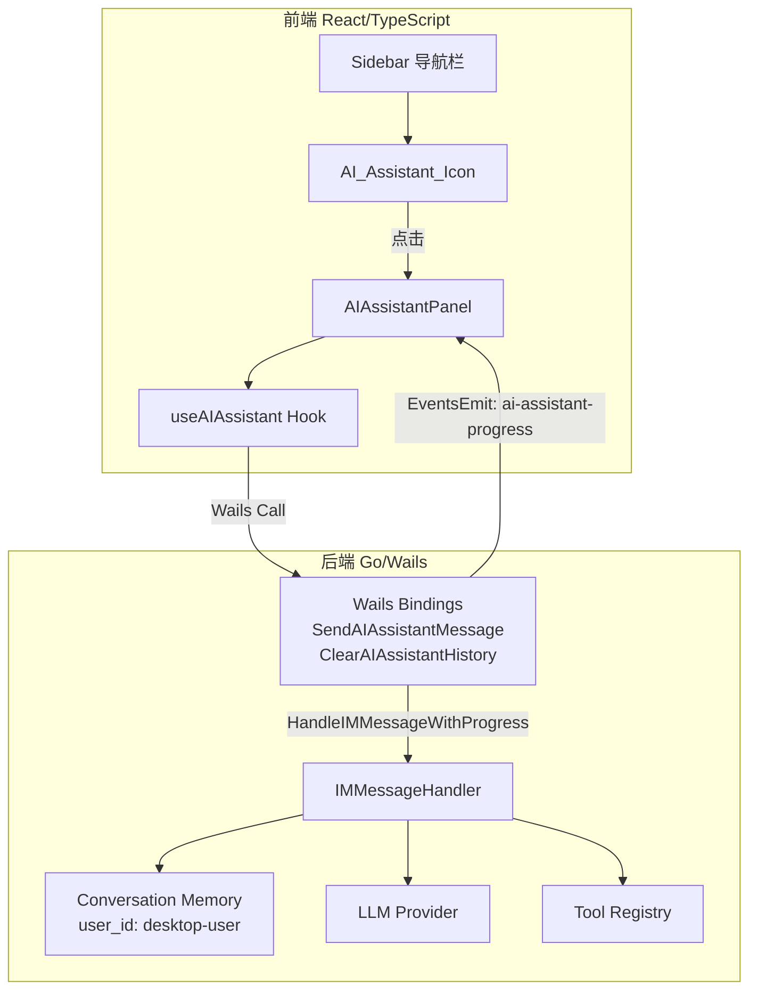

# 设计文档：AI 助手侧边栏图标

## 概述

本功能在 MaClaw 桌面应用左侧导航栏（远程 图标下方）新增一个"AI 助手"图标入口。点击后弹出全屏终端风格对话界面（`AIAssistantPanel`），复用后端 `IMMessageHandler` 的 Agent 能力，让用户无需手机/IM 即可直接在桌面端与 maClaw 对话。

核心设计决策：
- **前端**：新建 `AIAssistantPanel.tsx` 组件，视觉风格复用 `RemoteSessionConsole` 的深色终端主题，但数据流完全独立（不依赖远程会话管理）
- **后端**：在 `App` 上新增两个 Wails Binding（`SendAIAssistantMessage` / `ClearAIAssistantHistory`），内部直接调用 `IMMessageHandler`，使用固定 `user_id = "desktop-user"` 和 `platform = "desktop"`
- **进度推送**：通过 Wails `EventsEmit` 机制将 `onProgress` 回调的中间状态推送到前端

## 架构



### 数据流

1. 用户点击侧边栏 AI 图标 → 设置 `showAIPanel = true` → 渲染 `AIAssistantPanel` 全屏覆盖层
2. 用户输入文本 → `useAIAssistant.sendMessage(text)` → 调用 Wails Binding `SendAIAssistantMessage(text)`
3. Go 后端构造 `IMUserMessage{UserID: "desktop-user", Platform: "desktop", Text: text}` → 调用 `IMMessageHandler.HandleIMMessageWithProgress(msg, onProgress)`
4. `onProgress` 回调触发时 → `runtime.EventsEmit(ctx, "ai-assistant-progress", progressText)` → 前端通过 `EventsOn` 接收并显示进度
5. Agent 处理完成 → 返回 `IMAgentResponse` → 前端渲染回复（Markdown 文本、字段卡片、操作按钮、错误提示）

## 组件与接口

### 前端组件

#### 1. AI 图标入口（App.tsx 内联）

在 `App.tsx` 的 Sidebar 中，远程图标 `<div>` 之后插入新的导航项：

```tsx
// 在 remote 图标 div 之后
<div
    className={`sidebar-item ${showAIPanel ? 'active' : ''}`}
    onClick={() => setShowAIPanel(true)}
    style={{
        flexDirection: 'column', padding: '10px 0', width: '100%', gap: '4px',
        borderLeft: 'none',
        borderRight: showAIPanel ? '3px solid var(--primary-color)' : '3px solid transparent',
        justifyContent: 'center'
    }}
    title={lang === 'zh-Hans' ? 'AI 助手' : lang === 'zh-Hant' ? 'AI 助手' : 'AI Asst'}
>
    <span className="sidebar-icon" style={{ margin: 0, fontSize: '1.2rem' }}></span>
    <span style={{ fontSize: '0.65rem', lineHeight: 1 }}>
        {lang === 'zh-Hans' ? 'AI 助手' : lang === 'zh-Hant' ? 'AI 助手' : 'AI Asst'}
    </span>
</div>
```

设计决策：使用 `showAIPanel` 布尔状态而非 `navTab`，因为 AI 面板是全屏覆盖层，不替换主内容区域。这与 `RemoteSessionConsole` 的弹出模式一致。

#### 2. AIAssistantPanel 组件

新建 `frontend/src/components/ai/AIAssistantPanel.tsx`：

```typescript
interface AIAssistantPanelProps {
    onClose: () => void;
}
```

组件结构：
- **标题栏**：深色背景，显示"AI 助手"标题 + LLM 连接状态 + 关闭按钮（复用 RemoteSessionConsole 的 traffic lights 风格）
- **对话区域**：滚动容器，渲染 `ChatMessage[]`，支持 Markdown（复用 RemoteSessionConsole 的 `renderMarkdownLine` / `renderInlineMarkdown`）
- **输入栏**：底部固定，包含 `❯` 提示符 + 文本输入框 + 发送按钮 + 清空历史按钮

#### 3. useAIAssistant Hook

新建 `frontend/src/components/ai/useAIAssistant.ts`：

```typescript
interface ChatMessage {
    id: string;
    role: 'user' | 'assistant' | 'progress' | 'error';
    content: string;
    fields?: Array<{ label: string; value: string }>;
    actions?: Array<{ label: string; command: string; style: string }>;
    timestamp: number;
}

interface UseAIAssistantReturn {
    messages: ChatMessage[];
    sending: boolean;
    sendMessage: (text: string) => Promise<void>;
    clearHistory: () => Promise<void>;
    executeAction: (command: string) => Promise<void>;
}
```

状态管理：
- `messages: ChatMessage[]` — 前端维护的对话历史（用于 UI 渲染，后端 ConversationMemory 维护 LLM 上下文）
- `sending: boolean` — 是否正在等待 Agent 回复
- 通过 `EventsOn("ai-assistant-progress", ...)` 监听进度事件

### 后端接口

#### Wails Bindings（app_wails_bindings.go）

```go
// SendAIAssistantMessage 处理桌面端 AI 助手消息
func (a *App) SendAIAssistantMessage(text string) (*IMAgentResponse, error) {
    a.ensureRemoteInfra()
    hubClient := a.getHubClient()
    if hubClient == nil || hubClient.imHandler == nil {
        return nil, fmt.Errorf("AI assistant not initialized")
    }
    msg := IMUserMessage{
        UserID:   "desktop-user",
        Platform: "desktop",
        Text:     text,
    }
    onProgress := func(progressText string) {
        runtime.EventsEmit(a.ctx, "ai-assistant-progress", progressText)
    }
    resp := hubClient.imHandler.HandleIMMessageWithProgress(msg, onProgress)
    return resp, nil
}

// ClearAIAssistantHistory 清空桌面端 AI 助手对话记忆
func (a *App) ClearAIAssistantHistory() error {
    a.ensureRemoteInfra()
    hubClient := a.getHubClient()
    if hubClient == nil || hubClient.imHandler == nil {
        return fmt.Errorf("AI assistant not initialized")
    }
    hubClient.imHandler.memory.clear("desktop-user")
    return nil
}
```

设计决策：
- 复用 `remote_hub_client.go` 中已初始化的 `imHandler` 实例，而非创建新的 `IMMessageHandler`，确保工具注册表、安全防火墙等配置一致
- `user_id` 固定为 `"desktop-user"`，与 IM 端用户隔离，拥有独立的对话记忆
- `onProgress` 回调通过 `runtime.EventsEmit` 推送到前端，事件名 `"ai-assistant-progress"`

## 数据模型

### 前端数据模型

```typescript
// 对话消息
interface ChatMessage {
    id: string;                    // 唯一标识（uuid 或时间戳）
    role: 'user' | 'assistant' | 'progress' | 'error';
    content: string;               // 文本内容（Markdown）
    fields?: IMResponseField[];    // 键值对字段
    actions?: IMResponseAction[];  // 操作按钮
    timestamp: number;             // 消息时间戳
}

// 复用后端已有类型
interface IMResponseField {
    label: string;
    value: string;
}

interface IMResponseAction {
    label: string;
    command: string;
    style: string;
}
```

### 后端数据模型

无需新增数据模型。完全复用现有类型：
- `IMUserMessage` — 用户消息输入
- `IMAgentResponse` — Agent 回复输出
- `conversationEntry` / `conversationMemory` — 对话记忆（以 `"desktop-user"` 为 key）


## 正确性属性（Correctness Properties）

*属性（Property）是指在系统所有合法执行路径中都应成立的特征或行为——本质上是对系统应做什么的形式化陈述。属性是人类可读规格说明与机器可验证正确性保证之间的桥梁。*

### Property 1: 国际化标签正确性

*For any* 支持的语言设置（zh-Hans / zh-Hant / en），AI 助手图标的标签文字和 tooltip 应与该语言的预期本地化字符串完全匹配。

**Validates: Requirements 1.3, 1.6**

### Property 2: 发送消息增长消息列表

*For any* 非空文本输入，调用 `sendMessage(text)` 后，前端消息列表的长度应至少增加 1（用户消息），且列表中应包含一条 `role === 'user'`、`content === text` 的消息。

**Validates: Requirements 2.5**

### Property 3: 关闭/重新打开保留对话历史

*For any* 非空的消息列表，关闭 AI 面板（`showAIPanel = false`）再重新打开（`showAIPanel = true`）后，消息列表应与关闭前完全一致。

**Validates: Requirements 2.9**

### Property 4: 后端消息构造与平台标识

*For any* 文本输入，`SendAIAssistantMessage(text)` 应构造 `IMUserMessage{UserID: "desktop-user", Platform: "desktop", Text: text}` 并传递给 `HandleIMMessageWithProgress`，返回非 nil 的 `IMAgentResponse`。

**Validates: Requirements 3.1, 3.2**

### Property 5: 桌面端对话记忆隔离

*For any* 桌面端消息序列和任意 IM 端用户消息序列，桌面端的对话记忆（key = "desktop-user"）不应包含 IM 端用户的对话条目，反之亦然。

**Validates: Requirements 3.3**

### Property 6: 错误响应传播

*For any* 导致 `IMMessageHandler` 处理失败的输入（如 LLM 未配置），`SendAIAssistantMessage` 返回的 `IMAgentResponse` 应包含非空的 `Error` 字段。

**Validates: Requirements 3.4**

### Property 7: 清空历史清除记忆

*For any* 非空的桌面端对话历史，调用 `ClearAIAssistantHistory()` 后，`conversationMemory.load("desktop-user")` 应返回空切片。

**Validates: Requirements 3.5**

### Property 8: 响应渲染完整性

*For any* `IMAgentResponse`，若其包含 `fields` 数组，则渲染输出中应包含每个 field 的 `label` 和 `value`；若包含 `actions` 数组，则应渲染与 actions 数量相等的可点击按钮；若包含 `error` 字段，则应以错误样式显示该文本。

**Validates: Requirements 4.2, 4.3, 4.4**

### Property 9: 进度事件传递

*For any* `onProgress` 回调调用携带的进度文本，前端应通过 `EventsOn("ai-assistant-progress")` 接收到该文本，并在消息列表中添加一条 `role === 'progress'` 的消息。

**Validates: Requirements 5.1, 5.2**

### Property 10: 最终回复在进度消息之后

*For any* 包含进度更新的 Agent 处理流程，最终的 `role === 'assistant'` 消息在消息列表中的索引应大于所有对应的 `role === 'progress'` 消息的索引。

**Validates: Requirements 5.4**

## 错误处理

| 场景 | 处理方式 |
|------|---------|
| LLM 未配置 | `IMMessageHandler` 返回 `IMAgentResponse{Error: "MaClaw LLM 未配置..."}` → 前端以红色样式显示 |
| Hub Client / imHandler 未初始化 | `SendAIAssistantMessage` 返回 Go error → 前端 catch 后显示"AI 助手未初始化，请检查远程配置" |
| LLM API 调用超时 | `IMMessageHandler` 内部 HTTP client 120s 超时 → 返回 error 响应 → 前端显示超时提示 |
| 网络断开 | LLM 请求失败 → `IMAgentResponse.Error` 包含网络错误信息 → 前端显示 |
| 用户发送空消息 | 前端 `sendMessage` 在 `text.trim()` 为空时直接返回，不调用后端 |
| 对话记忆过期 | `conversationMemory` 的 eviction loop（2h TTL）自动清理 → 用户下次发消息时从空上下文开始 |
| 进度事件在面板关闭时到达 | `useAIAssistant` 在 `useEffect` cleanup 中调用 `EventsOff`，避免内存泄漏 |

## 测试策略

### 双重测试方法

本功能采用单元测试 + 属性测试的互补策略：

- **单元测试**：验证具体示例、边界情况和错误条件
- **属性测试**：验证跨所有输入的通用属性

### 属性测试配置

- 属性测试库：Go 后端使用 `testing/quick` 或 `pgregory.net/rapid`；TypeScript 前端使用 `fast-check`
- 每个属性测试最少运行 100 次迭代
- 每个测试必须以注释引用设计文档中的属性编号
- 标签格式：**Feature: ai-assistant-sidebar-icon, Property {number}: {property_text}**
- 每个正确性属性由单个属性测试实现

### 后端测试（Go）

| 测试类型 | 覆盖内容 |
|---------|---------|
| 属性测试 | Property 4: 消息构造（platform=desktop）、Property 5: 记忆隔离、Property 6: 错误传播、Property 7: 清空历史 |
| 单元测试 | `SendAIAssistantMessage` 基本调用流程、`ClearAIAssistantHistory` 清空验证、imHandler 未初始化时的错误返回 |

### 前端测试（TypeScript）

| 测试类型 | 覆盖内容 |
|---------|---------|
| 属性测试 | Property 1: i18n 标签、Property 2: 发送消息增长列表、Property 3: 关闭/重开保留历史、Property 8: 响应渲染完整性、Property 9: 进度事件、Property 10: 回复排序 |
| 单元测试 | 空消息拒绝发送、Escape 键关闭面板、action 按钮点击发送 command、Markdown 渲染基本格式 |
