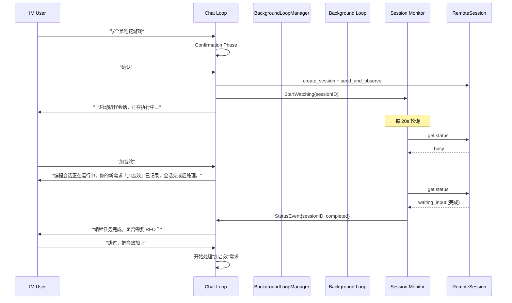
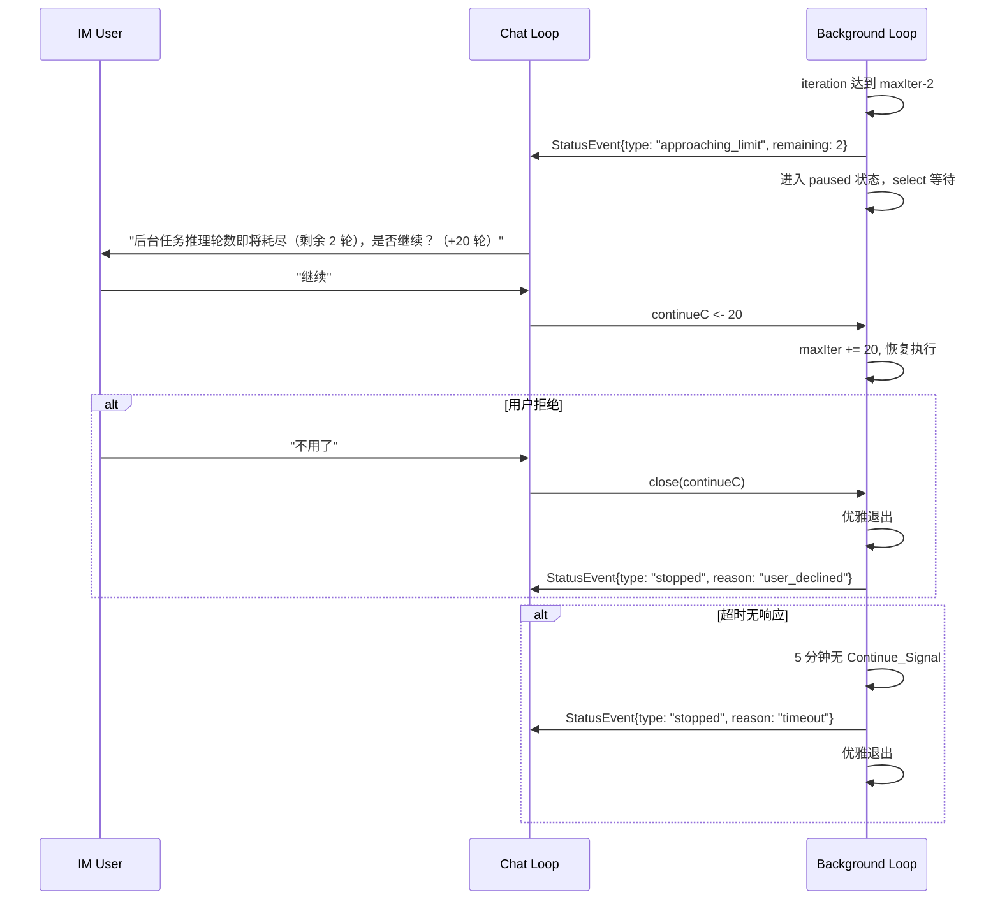

# Design Document: 后台 Agent Loop 隔离

## Overview

将当前单一的 `runAgentLoop` 拆分为前台 Chat Loop 和后台 Background Loop 两个独立执行通道，通过 Go channel 实现前后台通信。同时引入轻量级 Session Monitor 替代 LLM 驱动的编程会话轮询，降低 token 消耗。

### 设计决策

1. **Channel 通信而非共享状态**：前后台通过 `chan` 通信，不共享可变字段，从根本上消除 race condition。
2. **Session Monitor 不走 LLM**：编程会话状态轮询是确定性逻辑（检查 status 字段），不需要 LLM 推理，用纯 Go 代码实现更可靠、更省 token。
3. **Loop Context 独立化**：将 `loopMaxOverride`、iteration counter 等从 handler 级别下沉到每个 loop 实例，支持多 loop 并发。
4. **渐进式重构**：保持 `HandleIMMessageWithProgress` 接口不变，内部路由到 Chat Loop 或 Background Loop。

## Architecture

### 整体架构

```
┌─────────────────────────────────────────────────────────┐
│                    IMMessageHandler                      │
│                                                         │
│  ┌──────────────┐    ┌────────────────────────────┐     │
│  │  Chat Loop   │◄──►│  BackgroundLoopManager     │     │
│  │ (前台 agent) │    │  (slot-based 并发控制)     │     │
│  │              │    │                            │     │
│  │ - 用户对话   │    │  Slots:                    │     │
│  │ - 快进快出   │    │  [编程 ×1] → queue         │     │
│  │ - RFO 询问   │    │  [定时 ×1] → queue         │     │
│  │              │    │  [自动 ×1] → queue         │     │
│  └──────┬───────┘    │                            │     │
│         │            │  Running Loops:            │     │
│         │ statusC    │  ┌──────────────────────┐  │     │
│         │ continueC  │  │ BG Loop (编程)       │  │     │
│         │            │  │ BG Loop (定时)       │  │     │
│         │            │  │ BG Loop (自动)       │  │     │
│         └────────────┤  └──────────────────────┘  │     │
│                      └─────────────┬──────────────┘     │
│                                    │ ListViews()        │
│  ┌──────────────────────────────┐  │                    │
│  │   Session Monitor (纯 Go)   │  │                    │
│  │  - 轮询 busy 会话状态       │  │                    │
│  │  - 状态变化 → statusC       │  │                    │
│  │  - 不消耗 LLM tokens        │  │                    │
│  └──────────────────────────────┘  │                    │
└────────────────────────────────────┼────────────────────┘
                                     │
              ┌──────────────────────▼──────────────────┐
              │         Wails Bindings (App)            │
              │  ListBackgroundLoops()                  │
              │  StopBackgroundLoop(id)                 │
              │  ContinueBackgroundLoop(id, rounds)     │
              │  EventsEmit("background-loops-changed") │
              └──────────────────────┬─────────────────┘
                                     │
              ┌──────────────────────▼──────────────────┐
              │         Frontend (React)                │
              │  侧边栏: "任务" (原"远程")              │
              │  ┌─────────┬──────────┐                 │
              │  │  远程    │  后台    │                 │
              │  ├─────────┴──────────┤                 │
              │  │ Agent Loop 任务列表 │                 │
              │  │ AI 编程会话列表     │                 │
              │  │ [停止] [续命] [终端] │                │
              │  └────────────────────┘                 │
              └─────────────────────────────────────────┘
```

### 消息流



### 轮数续命流程



## Components and Interfaces

### 1. LoopContext（新增）

替代当前挂在 `IMMessageHandler` 上的共享字段。

```go
// LoopContext holds per-loop mutable state, eliminating shared fields on the handler.
type LoopContext struct {
    ID            string           // unique loop identifier (e.g. "chat", "bg-coding-xxx")
    Kind          LoopKind         // Chat, Background
    SlotKind      SlotKind         // Coding, Scheduled, Auto (Background only)
    Description   string           // human-readable task description
    MaxIterations int              // current max iterations for this loop
    Iteration     int              // current iteration count
    Status        string           // "running", "paused", "completed", "failed"
    Conversation  []interface{}    // this loop's conversation messages
    History       []conversationEntry
    ContinueC     chan int         // receive additional rounds (Background only)
    StatusC       chan StatusEvent  // send status events to Chat Loop
    CancelC       chan struct{}    // signal to stop the loop
    HTTPClient    *http.Client    // chat or task client
    SessionID     string           // associated remote session (if any)
    StartedAt     time.Time        // when this loop was spawned
}

type LoopKind int
const (
    LoopKindChat LoopKind = iota
    LoopKindBackground
)
```

### 2. StatusEvent（新增）

后台向前台推送的事件。

```go
type StatusEvent struct {
    Type      StatusEventType
    LoopID    string // which background loop
    SessionID string // related coding session (if any)
    Message   string // human-readable description
    Remaining int    // remaining iterations (for approaching_limit)
}

type StatusEventType int
const (
    StatusEventSessionCompleted StatusEventType = iota
    StatusEventSessionFailed
    StatusEventApproachingLimit
    StatusEventStopped
    StatusEventProgress
)
```

### 3. BackgroundLoopManager（新增）

管理所有后台 loop 的生命周期，含 slot-based 并发控制。

```go
// SlotKind categorizes background loops for concurrency control.
type SlotKind int
const (
    SlotKindCoding    SlotKind = iota // 编程任务 — max 1
    SlotKindScheduled                 // 定时任务 — max 1
    SlotKindAuto                      // ClawNet 自动任务 — max 1
)

type BackgroundLoopManager struct {
    mu      sync.RWMutex
    loops   map[string]*LoopContext // loopID -> context
    handler *IMMessageHandler
    statusC chan StatusEvent        // aggregated status channel for Chat Loop

    // Slot-based concurrency control
    slotLimits map[SlotKind]int          // max concurrent loops per kind (default: 1 each)
    queues     map[SlotKind][]*pendingTask // queued tasks when slot is occupied
}

type pendingTask struct {
    userID       string
    systemPrompt string
    userText     string
    maxIter      int
    onProgress   ProgressCallback
    resultC      chan *IMAgentResponse // caller blocks on this
}

// Spawn creates a new Background Loop if the slot is available.
// If the slot is occupied, the task is queued and the caller blocks
// until the slot becomes available and the task completes.
func (m *BackgroundLoopManager) Spawn(slotKind SlotKind, userID string,
    systemPrompt string, userText string, maxIter int,
    onProgress ProgressCallback) *LoopContext

// Get returns the LoopContext for a given loop ID.
func (m *BackgroundLoopManager) Get(loopID string) *LoopContext

// List returns all active background loops (for status display).
func (m *BackgroundLoopManager) List() []*LoopContext

// ListViews returns frontend-friendly snapshots of all background loops.
func (m *BackgroundLoopManager) ListViews() []BackgroundLoopView

// QueueLength returns the number of queued tasks for a given slot kind.
func (m *BackgroundLoopManager) QueueLength(kind SlotKind) int

// SendContinue sends additional rounds to a paused background loop.
func (m *BackgroundLoopManager) SendContinue(loopID string, additionalRounds int) error

// Stop gracefully stops a background loop and dequeues the next task.
func (m *BackgroundLoopManager) Stop(loopID string)
```

Slot 默认限制：编程 1 + 定时 1 + 自动 1 = 最多 3 个并发后台 loop。
当 `Stop()` 或 loop 自然结束时，自动从对应 queue 中取出下一个 pendingTask 并 Spawn。

### 4. SessionMonitor（新增）

轻量级编程会话状态轮询器，不走 LLM。

```go
type SessionMonitor struct {
    mu       sync.Mutex
    watches  map[string]*sessionWatch // sessionID -> watch
    manager  *RemoteSessionManager
    statusC  chan StatusEvent
    interval time.Duration // default 20s
}

type sessionWatch struct {
    sessionID  string
    loopID     string    // associated background loop (if any)
    lastStatus SessionStatus
    cancelCh   chan struct{}
}

// StartWatching begins polling a session's status.
func (m *SessionMonitor) StartWatching(sessionID string, loopID string)

// StopWatching stops polling for a session.
func (m *SessionMonitor) StopWatching(sessionID string)

// Close stops all watches.
func (m *SessionMonitor) Close()
```

SessionMonitor 与 StallDetector 的分工：
- StallDetector：检测会话卡住（无输出），发送 nudge 消息
- SessionMonitor：检测会话状态变化（busy → completed/failed），通知用户

### 5. runAgentLoop 重构

将 `runAgentLoop` 改为接受 `*LoopContext` 参数，不再依赖 handler 上的共享字段。

```go
// 修改前
func (h *IMMessageHandler) runAgentLoop(userID, systemPrompt string, 
    history []conversationEntry, userText string, 
    onProgress ProgressCallback, minIterations int, 
    httpClient *http.Client, platform string) *IMAgentResponse

// 修改后
func (h *IMMessageHandler) runAgentLoop(ctx *LoopContext, userID string,
    systemPrompt string, userText string,
    onProgress ProgressCallback, platform string) *IMAgentResponse
```

核心变更：
- `h.loopMaxOverride` → `ctx.MaxIterations`（每个 loop 独立）
- iteration counter 从局部变量移到 `ctx.Iteration`（可被外部观察）
- 后台 loop 在 `ctx.MaxIterations - 2` 时检查 `ctx.ContinueC`

### 6. HandleIMMessageWithProgress 路由逻辑

```go
func (h *IMMessageHandler) HandleIMMessageWithProgress(msg IMUserMessage, 
    onProgress ProgressCallback) *IMAgentResponse {
    
    // ... 现有的 slash command 处理 ...
    
    if msg.IsBackground {
        // 定时任务 / ClawNet 自动任务 → 后台 loop
        lctx := h.bgManager.Spawn(msg.UserID, systemPrompt, msg.Text, 
            maxIter, onProgress)
        // 阻塞等待后台 loop 完成（保持现有调用方的同步语义）
        return lctx.Wait()
    }
    
    // 用户聊天 → 前台 Chat Loop
    chatCtx := h.newChatLoopContext(msg, systemPrompt)
    return h.runAgentLoop(chatCtx, msg.UserID, systemPrompt, msg.Text, 
        onProgress, msg.Platform)
}
```

### 7. buildSystemPrompt 增强

在系统提示词中注入后台任务状态信息：

```go
// 在 buildSystemPrompt() 末尾，活跃会话列表之后添加：
if h.bgManager != nil {
    bgLoops := h.bgManager.List()
    if len(bgLoops) > 0 {
        b.WriteString("\n## 后台任务\n")
        for _, lctx := range bgLoops {
            b.WriteString(fmt.Sprintf("- [%s] 状态=%s 轮次=%d/%d\n", 
                lctx.ID, lctx.State(), lctx.Iteration, lctx.MaxIterations))
        }
        b.WriteString("有后台任务正在运行时，如果用户提出新的编程需求，先记录需求，等后台任务完成后再处理。\n")
    }
}
```

### 8. Chat Loop 中的 StatusEvent 处理

Chat Loop 在每轮 LLM 调用之间检查 statusC：

```go
// 在 runAgentLoop 的主循环中，每次 LLM 调用前检查后台事件
select {
case evt := <-ctx.StatusC:
    // 将事件注入到 conversation 中，让 LLM 知道后台发生了什么
    conversation = append(conversation, map[string]string{
        "role": "system", 
        "content": fmt.Sprintf("[后台事件] %s", evt.Message),
    })
default:
    // 无事件，继续正常流程
}
```

## Data Models

### 新增结构体

| 结构体 | 文件 | 用途 |
|--------|------|------|
| `LoopContext` | `agent_loop_context.go` | 每个 agent loop 的独立上下文 |
| `StatusEvent` / `StatusEventType` | `agent_loop_context.go` | 后台→前台事件 |
| `BackgroundLoopManager` | `background_loop_manager.go` | 后台 loop 生命周期管理（含 slot 并发控制） |
| `SlotKind` / `pendingTask` | `background_loop_manager.go` | Slot 分类与排队任务 |
| `BackgroundLoopView` | `background_loop_manager.go` | 前端展示用的只读快照 |
| `SessionMonitor` / `sessionWatch` | `session_monitor.go` | 编程会话状态轮询 |

### 修改的结构体

| 结构体 | 变更 |
|--------|------|
| `IMMessageHandler` | 移除 `loopMaxOverride`，新增 `bgManager *BackgroundLoopManager`、`sessionMonitor *SessionMonitor` |
| `runAgentLoop` 签名 | 接受 `*LoopContext` 替代散落的参数 |
| `App` | 新增 Wails binding 方法：`ListBackgroundLoops`、`StopBackgroundLoop`、`ContinueBackgroundLoop` |

### Channel 缓冲策略

| Channel | 缓冲大小 | 理由 |
|---------|----------|------|
| `StatusEvent` (aggregated) | 32 | 多个后台 loop 可能同时推事件，需要缓冲避免阻塞 |
| `ContinueC` (per loop) | 1 | 一次只需要一个续命信号 |
| `CancelC` (per loop) | 0 | 关闭语义，不需要缓冲 |
| `pendingTask.resultC` | 1 | 调用方阻塞等待结果，完成后写入一次 |

## 前端面板设计

### 侧边栏改名

侧边栏 `navTab === 'remote'` 的标签文字从"远程"改为"任务"（英文 "Tasks"，繁体 "任務"）。`navTab` 值保持 `'remote'` 不变，避免大范围重构。

### Sub-Tab 结构

现有 `RemoteSessionList` 中的 `sessionTab: "human" | "ai"` 改为 `sessionTab: "remote" | "background"`：

| Sub-Tab | 内容 | 数据来源 |
|---------|------|----------|
| 远程 | 人工启动的远程会话（现有"人类"tab） | `remoteSessions.filter(s => s.launch_source !== "ai")` |
| 后台 | 所有 MaClaw 驱动的任务：AI 编程会话 + 后台 Agent Loop | AI 会话: `remoteSessions.filter(s => s.launch_source === "ai")`；Agent Loop: `ListBackgroundLoops()` Wails binding |

### "后台" Sub-Tab 布局

```
┌─────────────────────────────────────────────────────┐
│  远程  │  后台 (3)                                   │
├─────────────────────────────────────────────────────┤
│                                                     │
│  ── Agent Loop 任务 ──                              │
│  编程 │ 写贪吃蛇游戏  │ 轮次 8/20 │ 运行中 │ [停止] │
│  ⏰ 定时 │ 每日代码审查  │ 轮次 3/50 │ 暂停   │ [续命][停止] │
│  自动 │ ClawNet #42   │ 轮次 12/30│ 运行中 │ [停止] │
│                                                     │
│  ── AI 编程会话 ──                                   │
│  AI │ session-abc │ claude │ busy    │ [查看终端] │
│  AI │ session-def │ gemini │ exited  │ [隐藏]     │
│                                                     │
└─────────────────────────────────────────────────────┘
```

后台 tab 分两个区域：
1. Agent Loop 任务（来自 `BackgroundLoopManager`）— 有停止/续命按钮；编程类型可点击"查看终端"
2. AI 编程会话（来自 `remoteSessions`，`launch_source === "ai"`）— 有查看终端按钮

### 只读终端（编程任务监控）

编程类后台任务点击"查看终端"时，复用现有 `RemoteSessionConsole` 组件，传入 `readOnly={true}`。该组件已支持 `readOnly` prop：
- 隐藏输入栏（input bar）
- 隐藏 Esc / Kill 等操作按钮
- 保留 Ctrl+C（中断）按钮
- 终端输出实时滚动，用户只能观看不能输入

通过 `LoopContext.SessionID` 关联到对应的 `RemoteSession`，获取终端输出数据。

### BackgroundLoopView（前端数据结构）

```go
// BackgroundLoopView is a read-only snapshot for the frontend.
type BackgroundLoopView struct {
    ID          string `json:"id"`
    SlotKind    string `json:"slot_kind"`    // "coding", "scheduled", "auto"
    Description string `json:"description"`  // task description (truncated)
    Iteration   int    `json:"iteration"`
    MaxIter     int    `json:"max_iter"`
    Status      string `json:"status"`       // "running", "paused", "completed", "failed"
    SessionID   string `json:"session_id"`   // associated remote session (if any)
    StartedAt   string `json:"started_at"`   // RFC3339
    QueuedCount int    `json:"queued_count"` // tasks queued behind this slot
}
```

### Wails Bindings（新增）

```go
// ListBackgroundLoops returns all active background loops for the frontend.
func (a *App) ListBackgroundLoops() []BackgroundLoopView {
    h := a.getIMHandler()
    if h == nil || h.bgManager == nil {
        return nil
    }
    return h.bgManager.ListViews()
}

// StopBackgroundLoop gracefully stops a background loop by ID.
func (a *App) StopBackgroundLoop(loopID string) error {
    h := a.getIMHandler()
    if h == nil || h.bgManager == nil {
        return fmt.Errorf("no background loop manager")
    }
    h.bgManager.Stop(loopID)
    return nil
}

// ContinueBackgroundLoop sends additional rounds to a paused loop.
func (a *App) ContinueBackgroundLoop(loopID string, additionalRounds int) error {
    h := a.getIMHandler()
    if h == nil || h.bgManager == nil {
        return fmt.Errorf("no background loop manager")
    }
    return h.bgManager.SendContinue(loopID, additionalRounds)
}
```

前端通过 `EventsOn("background-loops-changed", callback)` 监听变化事件，后端在 loop 状态变化时调用 `runtime.EventsEmit(a.ctx, "background-loops-changed")`。同时前端每 5 秒轮询 `ListBackgroundLoops()` 作为兜底。

## Correctness Properties

### Property 1: Loop Context 隔离

*For any* valid configuration with N concurrent agent loops, each loop's `LoopContext.MaxIterations` and `LoopContext.Iteration` SHALL be independent — modifying one loop's values SHALL NOT affect any other loop.

**Validates: Requirements 1.2, 1.4, 3.4**

### Property 2: Session Monitor 不消耗 LLM Tokens

*For any* session being watched by SessionMonitor, the monitor SHALL NOT invoke `doLLMRequest` or any LLM API call. All status checks SHALL use direct `RemoteSession.Status` field reads or `RemoteSessionManager` methods only.

**Validates: Requirements 2.2**

### Property 3: Continue Signal 正确传递

*For any* Background Loop in paused state, sending N additional rounds via `ContinueC` SHALL increase `LoopContext.MaxIterations` by exactly N, and the loop SHALL resume execution within one polling cycle.

**Validates: Requirements 4.3, 4.4**

### Property 4: Graceful Shutdown on Channel Close

*For any* Background Loop in paused state, closing `ContinueC` SHALL cause the loop to exit within one polling cycle without panic, and a "stopped" StatusEvent SHALL be emitted.

**Validates: Requirements 4.5**

### Property 5: Timeout Expiry

*For any* Background Loop in paused state, if no Continue_Signal is received within the configured timeout, the loop SHALL exit and emit a "timeout" StatusEvent.

**Validates: Requirements 4.6**

### Property 6: 向后兼容 — Chat Loop 行为不变

*For any* non-background message processed by `HandleIMMessageWithProgress`, the response SHALL be identical to the current implementation (same conversation flow, same tool routing, same memory persistence).

**Validates: Requirements 6.1, 6.2, 6.3**

### Property 7: 并发安全

*For any* number of concurrent Background Loops plus one Chat Loop, there SHALL be no data races on shared state. Specifically, `BackgroundLoopManager.loops` access SHALL be protected by `sync.RWMutex`, and no loop SHALL read or write another loop's `LoopContext` fields.

**Validates: Requirements 1.2, 3.4**

### Property 8: Slot 并发控制

*For any* SlotKind with limit N, the number of concurrently running Background Loops of that kind SHALL never exceed N. When a Spawn request arrives for a full slot, the task SHALL be queued (not dropped), and SHALL be dequeued and started when the slot becomes available.

**Validates: Requirements 3.5, 3.6, 3.7**

## Error Handling

### 1. Background Loop Panic Recovery

每个 Background Loop 的 goroutine 包含 `defer recover()`，panic 时推送 StatusEvent{type: Stopped, reason: "internal_error"} 并清理资源。

### 2. Channel 满时的背压

StatusEvent channel 使用 buffered channel (32)。如果 Chat Loop 长时间不消费事件（例如用户不活跃），后台使用 `select` + `default` 非阻塞发送，丢弃最旧的事件并记录日志。

### 3. Session Monitor 轮询失败

如果 `RemoteSessionManager.Get(sessionID)` 返回 nil（会话已被清理），SessionMonitor 自动停止该 watch 并推送 SessionFailed 事件。

### 4. 多个后台 Loop 同时请求续命

BackgroundLoopManager 序列化续命请求——每次只向 Chat Loop 推送一个 "approaching_limit" 事件，其他 loop 排队等待。避免用户同时收到多个续命询问。

### 5. 用户消息与后台事件的优先级

Chat Loop 优先处理用户消息。StatusEvent 在 LLM 调用间隙检查，不会阻塞用户消息的处理。

## Testing Strategy

### 单元测试

1. `LoopContext` 独立性：创建多个 LoopContext，修改一个不影响其他
2. `BackgroundLoopManager.Spawn/Stop`：生命周期管理
3. `SessionMonitor` 状态轮询：mock RemoteSessionManager，验证状态变化检测
4. `ContinueC` 通信：发送续命信号、关闭 channel、超时

### Property-Based Testing

使用 `testing/quick` 对 Property 1-8 进行属性测试。

**配置**：每个属性至少 100 次迭代。

**测试文件**：
- `agent_loop_context_test.go` — Property 1, 3, 4, 5
- `background_loop_manager_test.go` — Property 7, 8
- `session_monitor_test.go` — Property 2
- `im_message_handler_bgloop_test.go` — Property 6

### 集成测试

1. 模拟"用户聊天 + 编程会话监控"并发场景
2. 模拟"定时任务 + 用户聊天"并发场景
3. 模拟轮数续命完整流程（暂停 → 询问 → 续命/拒绝）
4. Slot 满时排队 → 前一个完成 → 自动 dequeue 并启动
5. Wails binding `ListBackgroundLoops` 返回正确的 `BackgroundLoopView` 快照
