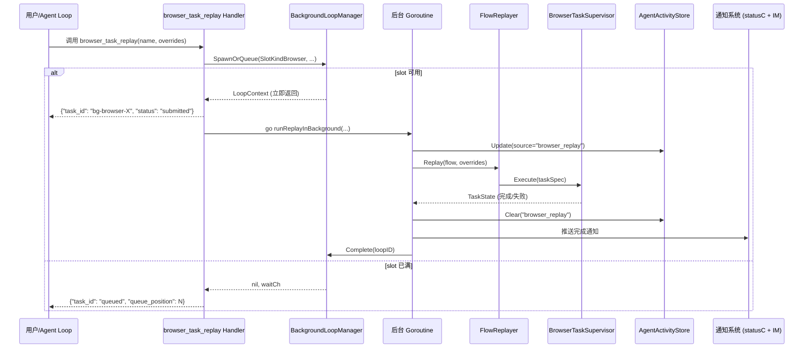
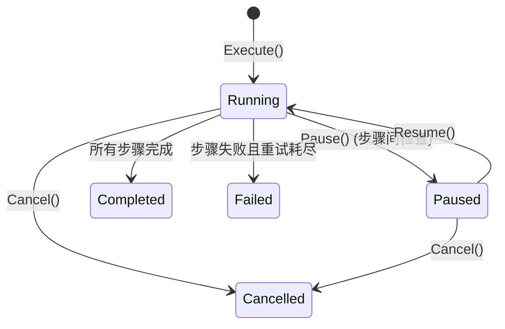
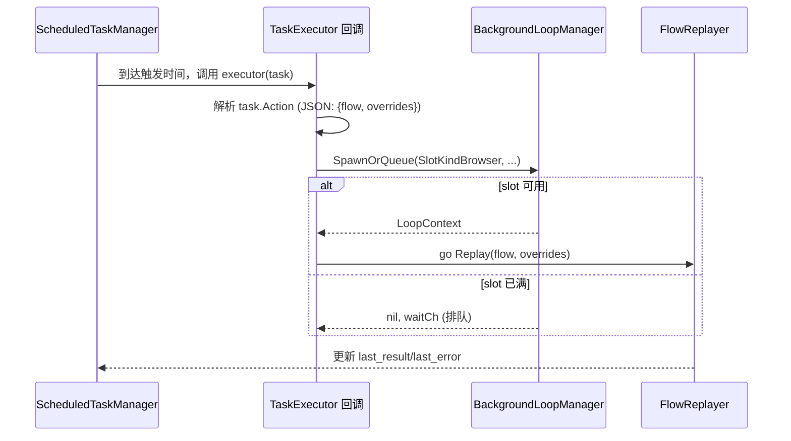

# 技术设计文档：浏览器回放接入后台任务管理

## 概述

本设计将 `browser_task_replay` 工具从同步阻塞模式改为异步后台执行模式。核心变更是：回放请求不再在 agent loop 中同步等待完成，而是通过 `BackgroundLoopManager` 以 `SlotKindBrowser` 类型创建后台任务，立即返回 `task_id`，使对话保持可用。

关键设计决策：
1. **复用现有 BackgroundLoopManager 的 slot 机制**：`SlotKindBrowser` 已存在（限制 2 并发），无需新增 SlotKind
2. **BrowserTaskSupervisor 新增 Pause/Resume**：在步骤间插入暂停检查点，通过 context 信号控制
3. **AgentActivityStore 扩展**：新增 `"browser_replay"` source 类型，使 IM 通道能感知回放任务
4. **ScheduledTaskManager 桥接**：定时任务的 executor 回调中触发后台回放，而非同步执行

## 架构

### 整体流程



### 暂停/恢复流程



### 定时回放流程



## 组件与接口

### 1. browser_task_replay Handler 改造

**文件**: `corelib/browser/task_tools.go`

当前 handler 同步调用 `replayer.Replay()`，改为：

```go
// 改造后的 handler 伪代码
Handler: func(args map[string]interface{}) string {
    name := args["name"].(string)
    flow, err := recorder.LoadFlow(name)
    // ... 参数解析 ...

    // 通过 BackgroundLoopManager 创建后台任务
    loopCtx, waitCh := loopMgr.SpawnOrQueue(
        agent.SlotKindBrowser, "", 
        fmt.Sprintf("replay: %s", name), 1,
    )
    
    if loopCtx != nil {
        // slot 可用，启动后台 goroutine
        go runReplayInBackground(loopCtx, flow, overrides, replayer, activityStore, statusC, loopMgr)
        return json.Marshal({"task_id": loopCtx.ID, "status": "submitted"})
    }
    
    // slot 已满，排队
    queuePos := loopMgr.QueueLength(agent.SlotKindBrowser)
    go waitAndRunReplay(waitCh, flow, overrides, ...)
    return json.Marshal({"status": "queued", "queue_position": queuePos})
}
```

**新增依赖注入**：`RegisterRecorderTools` 需要额外接收 `loopMgr *agent.BackgroundLoopManager` 和 `activityStore *AgentActivityStore` 参数。

### 2. BrowserTaskSupervisor 暂停/恢复

**文件**: `corelib/browser/task_supervisor.go`

新增字段和方法：

```go
// taskEntry 新增暂停信号
type taskEntry struct {
    state   *TaskState
    cancel  context.CancelFunc
    pauseC  chan struct{}  // 新增：暂停信号
    resumeC chan struct{}  // 新增：恢复信号
    paused  bool          // 新增：暂停状态标记
}

// Pause 暂停任务（在当前步骤完成后生效）
func (s *BrowserTaskSupervisor) Pause(taskID string) error

// Resume 恢复已暂停的任务
func (s *BrowserTaskSupervisor) Resume(taskID string) error
```

暂停机制：在 `Execute()` 的步骤循环中，每完成一个步骤后检查 `pauseC`：

```go
for i, step := range spec.Steps {
    // 检查暂停
    select {
    case <-entry.pauseC:
        state.Status = TaskStatusPaused
        s.emitProgress(spec.ID, "paused", i+1, len(spec.Steps))
        <-entry.resumeC  // 阻塞等待恢复
        state.Status = TaskStatusRunning
        s.emitProgress(spec.ID, "resumed", i+1, len(spec.Steps))
    default:
    }
    // ... 执行步骤 ...
}
```

### 3. AgentActivityStore 扩展

**文件**: `gui/agent_activity.go`

无需修改结构体，`Source` 字段已支持任意字符串。使用 `"browser_replay"` 作为 source：

```go
activityStore.Update(&AgentActivity{
    Source:      "browser_replay",
    Task:        fmt.Sprintf("回放: %s", flow.Name),
    Iteration:   currentStep,
    MaxIter:     totalSteps,
    LastSummary: "执行中...",
})
```

`FormatForPrompt` 中需要为 `"browser_replay"` 添加标签映射：

```go
label := "IM 通道"
if a.Source == "gui" {
    label = "GUI AI 助手"
} else if a.Source == "browser_replay" {
    label = "浏览器回放"
}
```

### 4. 完成通知

**通知渠道**：
- **statusC 通道**：通过 `agent.StatusEvent` 推送到 chat loop，类型为 `StatusEventSessionCompleted` 或 `StatusEventSessionFailed`
- **IM 通道**：如果用户在对话界面，在对话中插入系统消息

```go
func notifyReplayComplete(statusC chan agent.StatusEvent, loopID string, state *TaskState, flow *RecordedFlow) {
    evtType := agent.StatusEventSessionCompleted
    msg := fmt.Sprintf("浏览器回放 [%s] 完成，耗时 %s", flow.Name, elapsed)
    if state.Status == TaskStatusFailed {
        evtType = agent.StatusEventSessionFailed
        msg = fmt.Sprintf("浏览器回放 [%s] 失败（步骤 %d/%d）: %s", 
            flow.Name, state.CurrentStep, state.TotalSteps, state.LastError)
    }
    statusC <- agent.StatusEvent{
        Type:    evtType,
        LoopID:  loopID,
        Message: msg,
    }
}
```

### 5. 定时回放桥接

**文件**: `gui/tools_browser.go`（或新文件 `gui/browser_replay_scheduler.go`）

定时任务的 `Action` 字段存储 JSON 格式的回放配置：

```json
{
    "type": "browser_replay",
    "flow_name": "daily_checkin",
    "overrides": {"username": "admin"}
}
```

在 `ScheduledTaskManager` 的 executor 回调中识别并处理：

```go
func scheduledTaskExecutor(task *scheduler.ScheduledTask) (string, error) {
    // 解析 action
    var action struct {
        Type      string            `json:"type"`
        FlowName  string            `json:"flow_name"`
        Overrides map[string]string `json:"overrides"`
    }
    if json.Unmarshal([]byte(task.Action), &action) == nil && action.Type == "browser_replay" {
        return executeBrowserReplay(action.FlowName, action.Overrides)
    }
    // ... 其他类型的定时任务处理 ...
}
```

### 6. runReplayInBackground 核心函数

**新增文件**: `corelib/browser/replay_background.go`

```go
// RunReplayInBackground 在后台 goroutine 中执行回放任务。
// 负责：执行回放、更新 activity store、发送完成通知、释放 slot。
func RunReplayInBackground(
    loopCtx *agent.LoopContext,
    flow *RecordedFlow,
    overrides map[string]string,
    replayer *FlowReplayer,
    activityStore ActivityUpdater,
    statusC chan agent.StatusEvent,
    loopMgr LoopManager,
    logger func(string),
)
```

接口抽象（避免 corelib 依赖 gui 包）：

```go
// ActivityUpdater 抽象 AgentActivityStore 的更新接口
type ActivityUpdater interface {
    UpdateReplay(flowName string, currentStep, totalSteps int, status string)
    ClearReplay()
}

// LoopManager 抽象 BackgroundLoopManager 的生命周期接口
type LoopManager interface {
    Complete(loopID string)
    Stop(loopID string)
}
```

## 数据模型

### TaskState 扩展

`corelib/browser/task_supervisor.go` 中的 `TaskState` 新增暂停状态：

```go
const (
    TaskStatusPending   TaskStatus = "pending"    // 排队中
    TaskStatusRunning   TaskStatus = "running"    // 执行中
    TaskStatusPaused    TaskStatus = "paused"     // 已暂停（新增）
    TaskStatusCompleted TaskStatus = "completed"  // 已完成
    TaskStatusFailed    TaskStatus = "failed"     // 失败
    TaskStatusCancelled TaskStatus = "cancelled"  // 已取消
)
```

### 定时回放 Action 格式

```go
// ScheduledReplayAction 定时回放任务的 Action 字段 JSON 结构
type ScheduledReplayAction struct {
    Type      string            `json:"type"`       // 固定为 "browser_replay"
    FlowName  string            `json:"flow_name"`  // 流程名称
    Overrides map[string]string `json:"overrides"`  // 参数覆盖
}
```

### BackgroundLoopView 已有字段

`BackgroundLoopView` 已包含 `SlotKind`、`Description`、`Status` 等字段，无需扩展。GUI 前端通过 `ListViews()` 获取所有后台任务（包括浏览器回放），根据 `slot_kind == "browser"` 过滤显示。

### 通知消息结构

完成通知通过现有 `StatusEvent` 传递，`Message` 字段包含格式化的结果摘要。截图信息通过 `TaskState.Checkpoints` 的最后一个元素获取（已有 `ScreenshotB64` 字段）。


## 正确性属性 (Correctness Properties)

*属性（Property）是在系统所有合法执行中都应成立的特征或行为——本质上是对系统行为的形式化陈述。属性是人类可读规格说明与机器可验证正确性保证之间的桥梁。*

### Property 1: 异步提交返回任务 ID

*For any* 有效的 RecordedFlow 和参数覆盖，调用 browser_task_replay handler 应立即返回包含非空 `task_id` 和 `"submitted"` 状态的 JSON 响应，且 BackgroundLoopManager 的 SlotKindBrowser 运行计数应增加 1（slot 可用时）。

**Validates: Requirements 1.1, 1.2**

### Property 2: Slot 满时排队

*For any* BackgroundLoopManager 状态，当 SlotKindBrowser 的运行数已达上限（2）时，调用 `SpawnOrQueue(SlotKindBrowser, ...)` 应返回 nil 的 LoopContext 和非 nil 的 wait channel，且 `QueueLength(SlotKindBrowser)` 应增加 1。

**Validates: Requirements 1.4, 5.3**

### Property 3: Slot 释放后自动调度队列

*For any* BackgroundLoopManager 状态，当 SlotKindBrowser 有排队任务时，调用 `Complete(loopID)` 或 `Stop(loopID)` 应使 slot 计数减 1，且队列中的第一个任务应被自动 spawn（队列长度减 1，运行计数恢复）。

**Validates: Requirements 1.5, 3.3**

### Property 4: ListViews 包含浏览器回放任务

*For any* 通过 SpawnOrQueue 创建的 SlotKindBrowser 后台任务，`ListViews()` 返回的列表中应包含一个 `slot_kind == "browser"` 的条目，其 `Description` 包含流程名称，`Status` 反映当前状态。

**Validates: Requirements 2.1**

### Property 5: AgentActivityStore 状态同步

*For any* 浏览器回放任务的状态变化（running → paused → completed/failed），AgentActivityStore 中 source 为 `"browser_replay"` 的条目应反映最新的步骤进度和状态；任务完成后该条目应被清除。

**Validates: Requirements 2.3**

### Property 6: Cancel 释放 Slot 并标记取消

*For any* 正在运行的浏览器回放任务，调用 `Cancel(taskID)` 后，TaskState 的 Status 应变为 `"cancelled"`，且 BackgroundLoopManager 的 SlotKindBrowser 运行计数应减 1。

**Validates: Requirements 3.1**

### Property 7: Pause/Resume 保持任务连续性

*For any* 正在运行的多步骤浏览器回放任务，调用 `Pause(taskID)` 应使任务在当前步骤完成后进入 `"paused"` 状态；随后调用 `Resume(taskID)` 应使任务从暂停的步骤继续执行（CurrentStep 不变），最终完成所有剩余步骤。

**Validates: Requirements 3.4, 3.5**

### Property 8: 完成通知包含必要信息

*For any* 已完成（成功或失败）的浏览器回放任务，发送到 statusC 的 StatusEvent 的 Message 字段应包含流程名称；成功时应包含耗时信息，失败时应包含失败步骤编号和错误信息。

**Validates: Requirements 4.1, 4.2**

### Property 9: 定时回放任务创建格式正确

*For any* 有效的流程名称和调度参数，通过 ScheduledTaskManager 创建的定时回放任务应满足：`task_type == "process"`，且 `action` 字段可被反序列化为包含 `type == "browser_replay"` 和正确 `flow_name` 的 JSON 对象。

**Validates: Requirements 5.1**

### Property 10: 定时任务持久化 Round Trip

*For any* 有效的定时回放任务配置，序列化到 JSON 文件后再反序列化，应产生等价的 ScheduledTask 对象（ID、Name、Action、Hour、Minute、DayOfWeek、TaskType 字段均相等）。

**Validates: Requirements 5.4**

### Property 11: 定时回放执行结果更新

*For any* 已触发执行的定时回放任务，执行完成后 ScheduledTask 的 `last_result` 应为非空字符串，`run_count` 应增加 1；若执行失败，`last_error` 应为非空字符串。

**Validates: Requirements 5.5**

### Property 12: 状态查询返回正确信息

*For any* 活跃的浏览器回放任务 ID，调用 `browser_task_status` 工具应返回包含 task_id、当前步骤、总步骤数、状态和重试次数的 JSON 响应，且各字段值与 BrowserTaskSupervisor 中的 TaskState 一致。

**Validates: Requirements 6.2**

## 错误处理

### 回放执行错误

| 错误场景 | 处理方式 |
|---------|---------|
| 流程文件不存在 | handler 直接返回错误，不创建后台任务 |
| 浏览器未连接 | 后台 goroutine 中捕获，标记任务失败，推送通知 |
| 步骤执行超时 | BrowserTaskSupervisor 现有重试机制处理（最多 3 次） |
| 步骤验证失败 | RetryStrategy 决定是否重试或调整步骤 |
| 回放中浏览器断开 | sessionFn 返回错误，任务标记失败 |

### 并发与资源错误

| 错误场景 | 处理方式 |
|---------|---------|
| Slot 已满 | SpawnOrQueue 排队，返回队列位置 |
| 排队任务等待超时 | 可选：设置最大等待时间，超时后取消并通知 |
| 后台 goroutine panic | defer/recover 捕获，标记任务失败，释放 slot |
| statusC 通道满 | select default 分支丢弃事件（现有行为） |

### 定时回放错误

| 错误场景 | 处理方式 |
|---------|---------|
| Action JSON 解析失败 | executor 返回错误，ScheduledTaskManager 记录到 last_error |
| 流程文件被删除 | executor 返回错误，不创建后台任务 |
| 应用重启时有未完成的回放 | 回放任务不持久化（仅定时配置持久化），重启后由定时器重新触发 |

## 测试策略

### 测试方法

采用双轨测试策略：
- **单元测试**：验证具体示例、边界情况和错误条件
- **属性测试**：验证跨所有输入的通用属性

### 属性测试配置

- **库**: 使用 Go 的 `testing/quick` 或 `github.com/leanovate/gopter` 进行属性测试
- **迭代次数**: 每个属性测试最少 100 次迭代
- **标签格式**: 每个测试用注释标注对应的设计属性
  - 格式: `// Feature: browser-replay-background, Property N: <property_text>`

### 属性测试计划

| Property | 测试文件 | 测试方法 |
|----------|---------|---------|
| P1: 异步提交 | `corelib/browser/replay_background_test.go` | 生成随机 RecordedFlow，调用 handler，验证返回格式和 slot 计数 |
| P2: Slot 排队 | `corelib/agent/background_loop_manager_test.go` | 填满 browser slot 后再提交，验证排队行为 |
| P3: 自动调度 | `corelib/agent/background_loop_manager_test.go` | 创建排队任务后 Complete，验证 dequeue |
| P4: ListViews | `corelib/agent/background_loop_manager_test.go` | 创建 browser 任务后调用 ListViews，验证包含正确条目 |
| P5: Activity 同步 | `gui/agent_activity_test.go` | 模拟状态变化序列，验证 store 内容 |
| P6: Cancel | `corelib/browser/task_supervisor_test.go` | 启动任务后 Cancel，验证状态和 slot 释放 |
| P7: Pause/Resume | `corelib/browser/task_supervisor_test.go` | 多步骤任务中 Pause 再 Resume，验证步骤连续性 |
| P8: 通知内容 | `corelib/browser/replay_background_test.go` | 生成随机完成/失败状态，验证通知消息格式 |
| P9: 定时任务创建 | `corelib/browser/replay_background_test.go` | 生成随机流程名和调度参数，验证创建的任务格式 |
| P10: 持久化 Round Trip | `corelib/scheduler/task_test.go` | 生成随机 ScheduledTask，save 后 load，验证等价 |
| P11: 执行结果更新 | `corelib/scheduler/task_test.go` | 模拟 executor 返回随机结果，验证 last_result/last_error |
| P12: 状态查询 | `corelib/browser/task_tools_test.go` | 创建任务后调用 status 工具，验证返回字段一致性 |

### 单元测试计划

- **边界情况**：空流程（0 步骤）、流程文件不存在、浏览器未连接
- **错误条件**：Action JSON 格式错误、无效的 task_id 查询、Cancel 已完成的任务
- **集成点**：ScheduledTaskManager executor 回调正确触发后台回放
- **通知降级**：statusC 通道满时不阻塞、通知推送失败时写入日志

### 每个属性测试必须满足

1. 单个属性对应单个属性测试函数
2. 最少 100 次随机迭代
3. 注释标注对应的设计属性编号和描述
