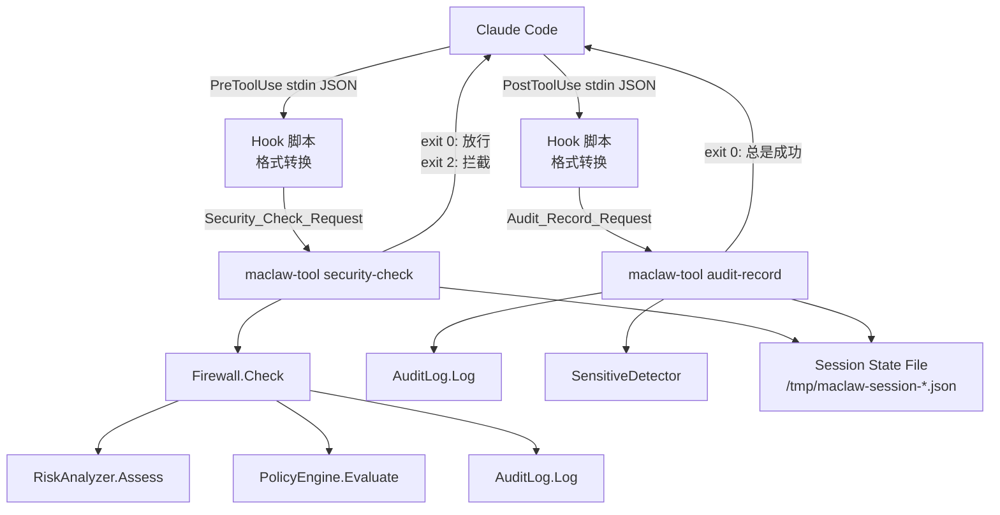

# 技术设计文档：Claude Hook Security Gateway

## 概述

本设计将 maclaw 现有的安全护栏体系（Firewall、RiskAnalyzer、PolicyEngine、AuditLog）通过 Claude Code 的 hook 机制注入到工具执行链路中。核心思路是在 `maclaw-tool` CLI 中新增两个纯本地子命令（`security-check` 和 `audit-record`），由 Claude Code 的 PreToolUse/PostToolUse hook 调用，实现"安全网关"模式。

设计目标：
- 零依赖：不需要 Hub 连接、不需要 `--token`，纯本地执行
- 低延迟：安全检查在 10ms 量级完成（不含 LLM 审查）
- 通用性：输入格式不绑定 Claude Code，可复用于 Codex、Cursor 等
- 幂等性：hook 配置注入可重复执行，不会破坏已有配置

## 架构

### 整体架构



### 数据流

1. **PreToolUse 流程**：Claude Code → hook 脚本（格式转换）→ `maclaw-tool security-check`（stdin JSON）→ Firewall.Check() → exit code + stdout/stderr
2. **PostToolUse 流程**：Claude Code → hook 脚本（格式转换）→ `maclaw-tool audit-record`（stdin JSON）→ AuditLog.Log() + 敏感信息检测 → exit 0
3. **会话状态**：security-check 和 audit-record 通过 `/tmp/maclaw-session-{id}.json` 共享会话安全上下文

### CLI 命令路由设计

现有 `maclaw-tool` 的 `main()` 函数使用 `flag.Args()` 解析 `command action` 二级结构（如 `session list`）。新增的子命令采用一级结构：

```
maclaw-tool security-check [--mode standard|strict|relaxed] [--project /path]
maclaw-tool audit-record [--audit-dir ~/.maclaw/audit/]
```

设计决策：security-check 和 audit-record 作为一级命令而非 `session` 下的子命令，因为它们不需要 Hub 连接，语义上也独立于 session 管理。在 `main()` 中，先检查第一个参数是否为 `security-check` 或 `audit-record`，如果是则走本地执行路径，跳过 `--token` 校验和 Hub 连接。

## 组件与接口

### 1. SecurityCheckCommand

负责 PreToolUse 安全检查的 CLI 入口。

```go
// cmd/maclaw-tool/security_check.go

// SecurityCheckRequest 是 security-check 命令的通用输入格式
type SecurityCheckRequest struct {
    ToolName    string                 `json:"tool_name"`
    ToolInput   map[string]interface{} `json:"tool_input,omitempty"`
    SessionID   string                 `json:"session_id,omitempty"`
    Source      string                 `json:"source,omitempty"`
    ProjectPath string                 `json:"project_path,omitempty"`
}

// SecurityCheckResult 是 security-check 的输出
type SecurityCheckResult struct {
    Allowed    bool     `json:"allowed"`
    RiskLevel  string   `json:"risk_level"`
    Reason     string   `json:"reason,omitempty"`
    Factors    []string `json:"factors,omitempty"`
    ModeUpgrade string  `json:"mode_upgrade,omitempty"`
}

func runSecurityCheck(mode, projectPath string) int
```

**接口行为**：
- 从 stdin 读取一行 JSON（SecurityCheckRequest）
- 创建 RiskAnalyzer + PolicyEngine（按 mode 参数）+ AuditLog
- 如有 projectPath，加载项目级策略
- 调用 Firewall.Check()
- 根据结果输出 stdout/stderr 并返回 exit code（0 或 2）

### 2. AuditRecordCommand

负责 PostToolUse 审计记录的 CLI 入口。

```go
// cmd/maclaw-tool/audit_record.go

// AuditRecordRequest 是 audit-record 命令的通用输入格式
type AuditRecordRequest struct {
    ToolName      string                 `json:"tool_name"`
    ToolInput     map[string]interface{} `json:"tool_input,omitempty"`
    SessionID     string                 `json:"session_id,omitempty"`
    Result        string                 `json:"result,omitempty"`
    OutputSnippet string                 `json:"output_snippet,omitempty"`
    Source        string                 `json:"source,omitempty"`
}

func runAuditRecord(auditDir string) int
```

**接口行为**：
- 从 stdin 读取一行 JSON（AuditRecordRequest）
- 创建 AuditLog（指向 auditDir）
- 对 output_snippet 进行敏感信息检测
- 调用 AuditLog.Log() 写入审计条目
- 更新 Session State File
- 始终返回 exit code 0

### 3. SensitiveDetector

敏感信息检测模块。

```go
// corelib/security/sensitive_detector.go

type SensitiveMatch struct {
    Category string // "api_key", "private_key", "password", "jwt"
    Pattern  string // 匹配的模式名
}

type SensitiveDetector struct {
    patterns []sensitivePattern
}

func NewSensitiveDetector() *SensitiveDetector
func (d *SensitiveDetector) Detect(text string) []SensitiveMatch
func (d *SensitiveDetector) Redact(text string) string
```

内置检测模式：
- API Key：`sk-[a-zA-Z0-9]{20,}`、`AKIA[A-Z0-9]{16}`
- 私钥：`-----BEGIN.*PRIVATE KEY-----`
- 密码：`(?i)(password|passwd|pwd)\s*[=:]\s*\S+`
- JWT：`eyJ[a-zA-Z0-9_-]+\.eyJ[a-zA-Z0-9_-]+\.[a-zA-Z0-9_-]+`

### 4. SessionStateManager

会话安全状态持久化管理。

```go
// corelib/security/session_state.go

type SessionState struct {
    SessionID     string    `json:"session_id"`
    ToolCallCount int       `json:"tool_call_count"`
    HighRiskCount int       `json:"high_risk_count"`
    LastCheckTime time.Time `json:"last_check_time"`
    SecurityMode  string    `json:"security_mode"`
    ModeUpgraded  bool      `json:"mode_upgraded"`
}

func LoadSessionState(sessionID string) (*SessionState, error)
func (s *SessionState) Save() error
func (s *SessionState) IncrementToolCall()
func (s *SessionState) IncrementHighRisk() bool // 返回是否触发模式升级
```

**状态文件路径**：`/tmp/maclaw-session-{session_id}.json`
**文件锁**：使用 `syscall.Flock` (Unix) 或等效机制防止并发写入
**升级规则**：5 分钟内累积 ≥3 次 high/critical 风险 → 自动升级为 strict 模式

### 5. HookConfigInjector

Hook 配置文件自动注入。

```go
// corelib/configfile/claude_hook_injector.go

func EnsureClaudeSecurityHook(home, maclawBinary, tag string, logFn func(string)) error
```

**行为**：
- 在 `~/.claude/hooks/` 下创建 `maclaw-security.json`
- 包含 PreToolUse 和 PostToolUse 两个 hook 定义
- 通过 `_comment` 字段包含 `"maclaw-security-gateway"` 标记实现幂等检测
- 与现有 `stop.json` / `maclaw-stop.json` 互不干扰

### Hook 配置文件格式

```json
{
  "_comment": "maclaw-security-gateway: Auto-injected by maclaw onboarding",
  "hooks": {
    "PreToolUse": [
      {
        "type": "command",
        "command": "echo '{\"tool_name\":\"$TOOL_NAME\",\"tool_input\":$TOOL_INPUT,\"session_id\":\"$SESSION_ID\",\"source\":\"claude-code\"}' | /path/to/maclaw-tool security-check --mode standard"
      }
    ],
    "PostToolUse": [
      {
        "type": "command",
        "command": "echo '{\"tool_name\":\"$TOOL_NAME\",\"tool_input\":$TOOL_INPUT,\"session_id\":\"$SESSION_ID\",\"result\":\"$TOOL_RESULT\",\"source\":\"claude-code\"}' | /path/to/maclaw-tool audit-record"
      }
    ]
  }
}
```

> 注意：实际的 hook command 需要根据 Claude Code 的变量替换机制调整。如果 Claude Code 通过 stdin 直接传递 JSON（而非环境变量），则 command 简化为直接调用 `maclaw-tool security-check`，由 Claude Code 负责 stdin 传递。

### PolicyAsk 处理策略

在 hook 场景下没有交互式确认通道，PolicyAsk 按安全模式分级处理：

| 安全模式 | PolicyAsk 处理 | Exit Code | 输出 |
|---------|---------------|-----------|------|
| strict  | 视为 deny     | 2         | stderr: 拦截原因 |
| standard| 放行 + 提示   | 0         | stdout: 风险提示（注入给 Claude） |
| relaxed | 静默放行      | 0         | 仅审计日志 |

## 数据模型

### SecurityCheckRequest

| 字段 | 类型 | 必填 | 说明 |
|------|------|------|------|
| tool_name | string | 是 | 工具名称 |
| tool_input | object | 否 | 工具参数 map |
| session_id | string | 否 | 会话 ID |
| source | string | 否 | 调用来源标识 |
| project_path | string | 否 | 项目路径 |

### AuditRecordRequest

| 字段 | 类型 | 必填 | 说明 |
|------|------|------|------|
| tool_name | string | 是 | 工具名称 |
| tool_input | object | 否 | 工具参数 map |
| session_id | string | 否 | 会话 ID |
| result | string | 否 | 工具执行结果描述 |
| output_snippet | string | 否 | 工具输出片段（用于敏感信息检测） |
| source | string | 否 | 调用来源标识 |

### SessionState

| 字段 | 类型 | 说明 |
|------|------|------|
| session_id | string | 会话 ID |
| tool_call_count | int | 工具调用总次数 |
| high_risk_count | int | high/critical 风险触发次数 |
| last_check_time | timestamp | 最后检查时间 |
| security_mode | string | 当前安全模式（可能被自动升级） |
| mode_upgraded | bool | 是否已被自动升级 |
| high_risk_timestamps | []timestamp | 最近 high/critical 风险的时间戳列表（用于 5 分钟窗口计算） |

### SensitiveMatch

| 字段 | 类型 | 说明 |
|------|------|------|
| category | string | 敏感信息类别：api_key / private_key / password / jwt |
| pattern | string | 匹配的模式名称 |

### 扩展的 AuditEntry 字段

在现有 AuditEntry 基础上，audit-record 命令写入时额外填充：

| 字段 | 类型 | 说明 |
|------|------|------|
| source | string | 调用来源（如 "claude-code"） |
| sensitive_detected | bool | 是否检测到敏感信息 |
| sensitive_categories | []string | 检测到的敏感信息类别列表 |
| output_snippet | string | 脱敏后的输出片段 |


## 正确性属性（Correctness Properties）

*正确性属性是一种在系统所有合法执行中都应成立的特征或行为——本质上是对系统应做什么的形式化陈述。属性是人类可读规范与机器可验证正确性保证之间的桥梁。*

### Property 1: SecurityCheckRequest 序列化往返

*For any* 合法的 SecurityCheckRequest 对象，将其序列化为 JSON 后再反序列化，应产生与原始对象等价的请求对象。

**Validates: Requirements 1.1, 3.5, 9.5**

### Property 2: AuditRecordRequest 序列化往返

*For any* 合法的 AuditRecordRequest 对象，将其序列化为 JSON 后再反序列化，应产生与原始对象等价的请求对象。

**Validates: Requirements 2.1, 4.3**

### Property 3: Firewall 结果到 exit code 的映射

*For any* SecurityCheckRequest，当 Firewall.Check() 返回 allowed=true 时 exit code 应为 0，当返回 allowed=false 时 exit code 应为 2。stdout/stderr 的内容应分别包含安全检查摘要或拦截原因。

**Validates: Requirements 1.3, 1.4**

### Property 4: PolicyAsk 按安全模式分级处理

*For any* 触发 PolicyAsk 结果的 SecurityCheckRequest，在 strict 模式下 exit code 应为 2（视为 deny），在 standard 模式下 exit code 应为 0 且 stdout 包含风险提示，在 relaxed 模式下 exit code 应为 0 且仅记录审计日志。

**Validates: Requirements 7.1, 7.2, 7.3**

### Property 5: 敏感信息检测准确性

*For any* 包含已知敏感模式（API key `sk-`/`AKIA` 前缀、私钥标记、密码赋值、JWT token）的字符串，SensitiveDetector.Detect() 应返回非空结果且包含正确的类别标识；对于不包含任何敏感模式的字符串，应返回空结果。

**Validates: Requirements 8.1, 8.2, 8.3**

### Property 6: 脱敏处理消除所有敏感模式

*For any* 字符串，经过 SensitiveDetector.Redact() 处理后，再次调用 Detect() 应返回空结果（即脱敏后的文本不再包含任何可检测的敏感模式）。这是一个幂等性/不动点属性：`Detect(Redact(text)) == []`。

**Validates: Requirements 8.4**

### Property 7: Hook 配置注入幂等性

*For any* 初始文件系统状态，连续两次调用 EnsureClaudeSecurityHook() 后，`maclaw-security.json` 的内容应与第一次调用后完全相同。即 `f(f(state)) == f(state)`。

**Validates: Requirements 5.4**

### Property 8: 会话状态持久化正确性

*For any* 包含 session_id 的请求序列，处理后 Session_State_File 应存在，且 tool_call_count 等于请求序列长度，high_risk_count 等于序列中 high/critical 风险评估的次数。

**Validates: Requirements 6.1, 6.2, 2.6**

### Property 9: 累积高风险自动升级安全模式

*For any* 会话，当在 5 分钟窗口内累积 ≥3 次 high 或 critical 风险评估时，SessionState 的 security_mode 应自动升级为 "strict" 且 mode_upgraded 标记为 true。当累积次数 <3 或时间窗口超过 5 分钟时，不应触发升级。

**Validates: Requirements 6.3, 6.4**

### Property 10: audit-record 始终以 exit code 0 退出

*For any* 输入（包括合法 JSON、非法 JSON、空输入），audit-record 命令的 exit code 应始终为 0，确保审计记录失败不会阻塞工具执行链路。

**Validates: Requirements 2.4, 2.5**

### Property 11: Hook 配置包含正确的命令定义

*For any* 调用 EnsureClaudeSecurityHook() 生成的 maclaw-security.json，解析后应包含 PreToolUse hook 调用 `security-check` 命令和 PostToolUse hook 调用 `audit-record` 命令。

**Validates: Requirements 5.2, 5.3**

### Property 12: Hook 注入不影响 Stop hook

*For any* 已存在 stop.json 或 maclaw-stop.json 的文件系统状态，调用 EnsureClaudeSecurityHook() 后，原有 stop hook 文件的内容应保持不变。

**Validates: Requirements 5.5**

### Property 13: Claude Code Hook_Input 到 SecurityCheckRequest 的格式转换

*For any* 合法的 Claude Code Hook_Input JSON（包含 hook_type、tool_name、tool_input、session_id），格式转换后应产生合法的 SecurityCheckRequest，且 tool_name、tool_input、session_id 字段值与原始输入一致。

**Validates: Requirements 9.2, 9.3**

### Property 14: mode 参数正确配置 PolicyEngine

*For any* mode 值（standard、strict、relaxed），security-check 命令创建的 PolicyEngine 应使用对应模式的策略规则集。具体地，PolicyRulesForMode(mode) 返回的规则集应与 PolicyEngine 内部使用的规则集一致。

**Validates: Requirements 3.2**

### Property 15: 请求数据正确流转到 Firewall 和 AuditLog

*For any* 合法的 SecurityCheckRequest，传递给 Firewall.Check() 的 toolName 应等于请求的 tool_name，args 应等于请求的 tool_input，CallContext.SessionID 应等于请求的 session_id；且审计日志中记录的 source 字段应等于请求的 source 字段。

**Validates: Requirements 1.2, 1.7, 2.2, 2.3**

## 错误处理

### 输入解析错误

| 场景 | 处理方式 | Exit Code |
|------|---------|-----------|
| stdin 为空（EOF） | stderr 输出使用说明 | 0 |
| JSON 格式错误 | stderr 输出解析错误 | 0 |
| 缺少 tool_name 字段 | stderr 输出字段缺失错误 | 0 |
| tool_input 类型错误 | 忽略 tool_input，继续检查 | 按正常流程 |

设计原则：输入解析错误不应阻塞 Claude Code 的正常工作流，因此 security-check 和 audit-record 在解析失败时都以 exit 0 退出。

### 安全组件初始化错误

| 场景 | 处理方式 |
|------|---------|
| AuditLog 目录创建失败 | stderr 警告，跳过审计记录 |
| 项目策略文件加载失败 | stderr 警告，使用默认策略 |
| Session State 文件损坏 | 创建新的初始状态，继续执行 |
| Session State 文件锁获取超时 | 跳过状态更新，继续执行 |

### Hook 配置注入错误

| 场景 | 处理方式 |
|------|---------|
| ~/.claude/hooks/ 目录创建失败 | 记录警告日志，不阻塞 onboarding |
| maclaw-security.json 写入失败 | 记录警告日志，不阻塞 onboarding |
| maclaw-tool 二进制路径无法确定 | 使用 "maclaw-tool"（依赖 PATH），记录警告 |

## 测试策略

### 属性测试（Property-Based Testing）

使用 Go 的 `testing/quick` 包或 `github.com/leanovate/gopter` 库进行属性测试。每个属性测试至少运行 100 次迭代。

每个测试必须通过注释引用设计文档中的属性编号：

```go
// Feature: claude-hook-security-gateway, Property 1: SecurityCheckRequest 序列化往返
func TestSecurityCheckRequestRoundTrip(t *testing.T) { ... }
```

属性测试覆盖范围：
- Property 1-2：请求对象的 JSON 序列化往返
- Property 3-4：exit code 映射和 PolicyAsk 分级处理
- Property 5-6：敏感信息检测和脱敏
- Property 7：Hook 配置幂等性
- Property 8-9：会话状态持久化和自动升级
- Property 10：audit-record 始终 exit 0
- Property 11-12：Hook 配置内容和独立性
- Property 13：格式转换正确性
- Property 14：mode 参数映射
- Property 15：数据流转正确性

### 单元测试

单元测试聚焦于具体示例和边界情况：

1. **security-check 命令**：
   - 示例：已知危险命令（`rm -rf /`）应被拦截
   - 示例：安全的文件读取操作应被放行
   - 边界：空 stdin、畸形 JSON、缺少 tool_name

2. **audit-record 命令**：
   - 示例：正常审计记录写入和查询
   - 边界：空 stdin、审计目录不存在时自动创建

3. **SensitiveDetector**：
   - 示例：已知 API key 格式（`sk-abc123...`）应被检测
   - 示例：已知 JWT 格式应被检测
   - 边界：空字符串、超长字符串、Unicode 内容

4. **SessionStateManager**：
   - 示例：新会话创建初始状态
   - 示例：3 次高风险触发模式升级
   - 边界：状态文件损坏、并发访问

5. **HookConfigInjector**：
   - 示例：首次注入创建文件
   - 示例：已存在标记时跳过
   - 边界：hooks 目录不存在、权限不足

### 集成测试

- 端到端测试：模拟 Claude Code hook 调用流程，验证 stdin → security-check → exit code 的完整链路
- 会话状态累积测试：模拟多次 hook 调用，验证会话状态正确累积和模式升级
