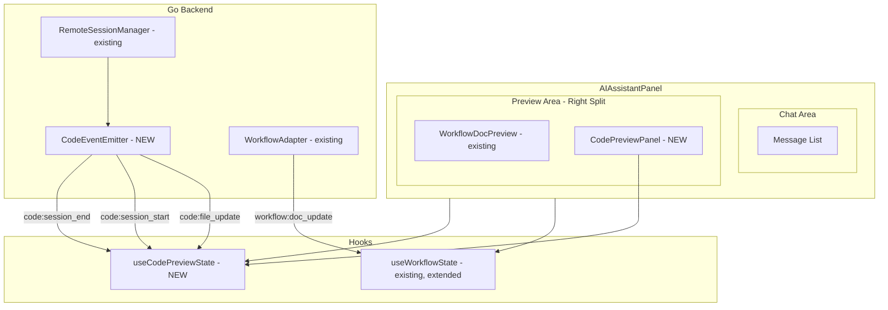
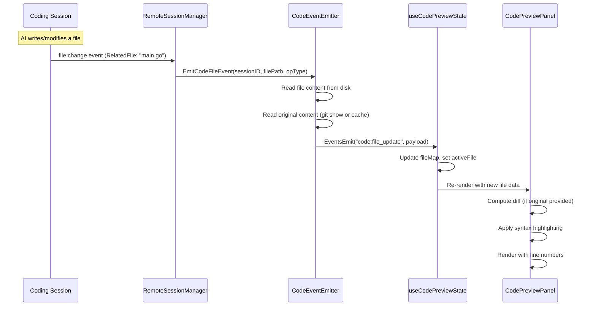
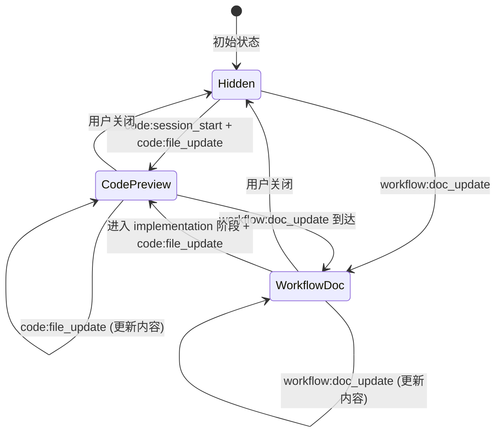

# Design Document: Code Preview Panel

## Overview

为 maclaw 桌面端 AI 助手面板新增代码预览区（Code Preview Panel），在 AI 通过编程会话（Session Tool）生成或修改代码文件时，面板右侧自动打开代码预览区，顶部显示文件名标签栏，预览区显示当前选中文件的代码内容（含语法高亮）。对于修改的文件，以 diff 视图标记添加/删除的代码行。

### 核心设计决策

1. **事件通信**：复用 Wails `runtime.EventsEmit` 机制，新增 `code:file_update`、`code:session_start`、`code:session_end` 三个事件，与现有 `workflow:doc_update` 模式一致。
2. **事件发射位置**：在 Go 后端 `remote_session_manager.go` 的事件提取流程中，当检测到 `file.change` / `file.read` 类型事件时，读取文件内容并发射 `code:file_update` 事件。对于 `file.change` 事件，同时读取 git diff 或缓存的原始内容用于 diff 计算。
3. **分屏布局复用**：与 `WorkflowDocPreview` 共享 `useWorkflowState` 中的 `splitMode` / `splitRatio` 机制，但通过独立的 `useCodePreviewState` hook 管理代码预览专属状态（文件列表、选中文件、diff 数据等）。两个面板互斥显示。
4. **Diff 计算**：在前端使用轻量级 diff 算法（Myers diff）计算行级差异，避免引入重量级依赖。原始内容由 Go 后端在事件中提供。
5. **语法高亮**：使用纯 CSS + 正则的轻量方案，根据文件扩展名识别语言，对关键字、字符串、注释等进行着色。不引入 Prism.js / highlight.js 等重量级库，保持与现有项目零外部依赖的风格一致。
6. **面板互斥**：当 `WorkflowDocPreview` 活跃时，代码预览面板不打开；当代码预览面板活跃时收到工作流文档事件，自动切换到工作流预览。通过 `useWorkflowState` 中的状态协调实现。

## Architecture

### 组件层次结构



### 数据流



### 面板互斥流程



## Components and Interfaces

### 1. CodeEventEmitter (Go Backend)

新增 `gui/code_event_emitter.go`，负责从编程会话事件中提取文件操作信息并发射 Wails 事件。

```go
// CodeEventEmitter emits code file events to the frontend via Wails runtime.
type CodeEventEmitter struct {
    app *App
}

// CodeFileEvent is the payload for code:file_update events.
type CodeFileEvent struct {
    SessionID   string `json:"session_id"`
    FilePath    string `json:"file_path"`
    FileName    string `json:"file_name"`
    Content     string `json:"content"`
    Original    string `json:"original,omitempty"` // empty for new files
    OpType      string `json:"op_type"`            // "create" or "modify"
    Language    string `json:"language"`            // detected from extension
}

// EmitCodeFileEvent emits a code:file_update event to the frontend.
func (e *CodeEventEmitter) EmitCodeFileEvent(evt CodeFileEvent)

// EmitSessionStart emits code:session_start when a coding session begins.
func (e *CodeEventEmitter) EmitSessionStart(sessionID string)

// EmitSessionEnd emits code:session_end when a coding session completes.
func (e *CodeEventEmitter) EmitSessionEnd(sessionID string)
```

**集成点**：在 `RemoteSessionManager` 的事件处理流程中（`processEvents` 或类似方法），当检测到 `file.change` 类型事件时，调用 `CodeEventEmitter.EmitCodeFileEvent`。

**原始内容获取策略**：
- 优先尝试 `git show HEAD:<relative_path>` 获取文件修改前的内容
- 如果 git 不可用或文件是新建的，`Original` 字段为空
- 使用 `filepath.Ext()` 检测文件扩展名，映射到语言标识符

### 2. useCodePreviewState (Frontend Hook)

新增 `gui/frontend/src/components/ai/useCodePreviewState.ts`，管理代码预览面板的状态。

```typescript
interface CodeFile {
    filePath: string;
    fileName: string;
    content: string;
    original?: string;       // undefined for new files
    opType: 'create' | 'modify';
    language: string;
    updatedAt: number;
}

interface CodePreviewUIState {
    active: boolean;              // panel is visible
    files: Map<string, CodeFile>; // filePath -> CodeFile
    activeFilePath: string;       // currently selected file
    sessionActive: boolean;       // coding session in progress
    userClosed: boolean;          // user manually closed, suppress auto-open
}

function useCodePreviewState(): {
    state: CodePreviewUIState;
    closePanel: () => void;
    reopenPanel: () => void;
    selectFile: (filePath: string) => void;
    resetSession: () => void;
}
```

**事件监听**：
- `code:file_update` → 更新 `files` map，如果面板未被用户关闭则自动打开，自动选中最新文件
- `code:session_start` → 设置 `sessionActive = true`，重置 `files` 和 `userClosed`
- `code:session_end` → 设置 `sessionActive = false`

### 3. CodePreviewPanel (Frontend Component)

新增 `gui/frontend/src/components/ai/CodePreviewPanel.tsx`，代码预览面板主组件。

```typescript
interface CodePreviewPanelProps {
    files: Map<string, CodeFile>;
    activeFilePath: string;
    onSelectFile: (filePath: string) => void;
    onClose: () => void;
    theme: CodePreviewTheme;
}
```

**子组件**：
- `FileTabBar` — 文件名标签栏，水平滚动，高亮选中项，tooltip 显示完整路径，修改/新建文件图标区分
- `CodeContentView` — 代码内容显示区，行号 + 语法高亮 + 垂直滚动
- `DiffView` — diff 视图，双列行号 + 添加/删除行标记 + 语法高亮

### 4. AIAssistantPanel 扩展

在现有 `AIAssistantPanel.tsx` 中：
- 引入 `useCodePreviewState` hook
- 在分屏区域根据状态选择渲染 `WorkflowDocPreview` 或 `CodePreviewPanel`
- 面板互斥逻辑：`workflow:doc_update` 到达时关闭代码预览，`code:file_update` 到达时（如果工作流预览不活跃）打开代码预览

### 5. 语法高亮模块

新增 `gui/frontend/src/components/ai/syntaxHighlight.ts`，轻量级语法高亮。

```typescript
interface HighlightToken {
    text: string;
    type: 'keyword' | 'string' | 'comment' | 'number' | 'operator' | 'function' | 'type' | 'plain';
}

// Tokenize a line of code based on language
function tokenizeLine(line: string, language: string): HighlightToken[];

// Map file extension to language identifier
function detectLanguage(fileName: string): string;
```

支持的语言：Go, TypeScript/JavaScript, Python, Rust, Java, C/C++, HTML, CSS, JSON, YAML, Markdown, Shell/Bash。

### 6. Diff 计算模块

新增 `gui/frontend/src/components/ai/diffCompute.ts`，行级 diff 计算。

```typescript
interface DiffLine {
    type: 'add' | 'delete' | 'unchanged';
    content: string;
    oldLineNum?: number;  // line number in original
    newLineNum?: number;  // line number in modified
}

// Compute line-level diff between original and modified content
function computeDiff(original: string, modified: string): DiffLine[];
```

使用 Myers diff 算法的简化实现，仅处理行级差异（按 `\n` 分割后比较）。

## Data Models

### Wails 事件 Payload

#### code:file_update
```json
{
    "session_id": "session-abc123",
    "file_path": "/project/src/main.go",
    "file_name": "main.go",
    "content": "package main\n\nfunc main() {\n    ...\n}",
    "original": "package main\n\nfunc main() {\n}",
    "op_type": "modify",
    "language": "go"
}
```

#### code:session_start
```json
{
    "session_id": "session-abc123"
}
```

#### code:session_end
```json
{
    "session_id": "session-abc123"
}
```

### 前端状态模型

```typescript
// CodeFile — 单个代码文件的完整数据
interface CodeFile {
    filePath: string;       // 完整路径，作为唯一标识
    fileName: string;       // 仅文件名，用于标签显示
    content: string;        // 当前文件内容
    original?: string;      // 修改前的原始内容（新建文件为 undefined）
    opType: 'create' | 'modify';
    language: string;       // 语言标识符（go, typescript, python 等）
    updatedAt: number;      // 最后更新时间戳
}

// DiffLine — diff 视图中的单行数据
interface DiffLine {
    type: 'add' | 'delete' | 'unchanged';
    content: string;
    oldLineNum?: number;
    newLineNum?: number;
}

// CodePreviewTheme — 代码预览面板主题
interface CodePreviewTheme {
    bg: string;
    text: string;
    textMuted: string;
    border: string;
    lineNumBg: string;
    lineNumText: string;
    tabBg: string;
    tabActiveBg: string;
    tabActiveText: string;
    tabHoverBg: string;
    diffAddBg: string;
    diffAddText: string;
    diffDeleteBg: string;
    diffDeleteText: string;
    // Syntax highlighting colors
    syntaxKeyword: string;
    syntaxString: string;
    syntaxComment: string;
    syntaxNumber: string;
    syntaxFunction: string;
    syntaxType: string;
    syntaxOperator: string;
}
```

### 语言检测映射

| 扩展名 | 语言标识符 |
|--------|-----------|
| .go | go |
| .ts, .tsx | typescript |
| .js, .jsx | javascript |
| .py | python |
| .rs | rust |
| .java | java |
| .c, .h | c |
| .cpp, .cc, .hpp | cpp |
| .html, .htm | html |
| .css | css |
| .json | json |
| .yaml, .yml | yaml |
| .md | markdown |
| .sh, .bash | shell |
| 其他 | plaintext |


## Correctness Properties

*A property is a characteristic or behavior that should hold true across all valid executions of a system — essentially, a formal statement about what the system should do. Properties serve as the bridge between human-readable specifications and machine-verifiable correctness guarantees.*

### Property 1: Panel idempotent open on repeated events

*For any* sequence of code file events emitted while the panel is already open, the panel SHALL remain in the active/open state and SHALL NOT re-trigger the open transition. The panel's `active` flag should be true before and after each event.

**Validates: Requirements 1.5**

### Property 2: User close suppresses auto-reopen

*For any* sequence of code file events emitted after the user manually closes the panel (setting `userClosed = true`), the panel SHALL remain closed (`active = false`) until `reopenPanel()` is explicitly called.

**Validates: Requirements 1.6**

### Property 3: File map completeness and content correctness

*For any* set of code file events with distinct file paths, the `files` map SHALL contain exactly one entry per unique file path, and selecting any file path via `selectFile()` SHALL set `activeFilePath` to that path, making the corresponding file's content available for display.

**Validates: Requirements 2.1, 2.4**

### Property 4: File name extraction from path

*For any* file path string (Unix or Windows format), the extracted file name (used as tab label) SHALL equal the last path segment after the final `/` or `\` separator. For paths with no separator, the entire string is the file name.

**Validates: Requirements 2.5**

### Property 5: No duplicate files on repeated events

*For any* sequence of code file events where the same file path appears multiple times, the `files` map SHALL contain exactly one entry for that path, and its content SHALL equal the content from the most recent event for that path.

**Validates: Requirements 2.8**

### Property 6: Language detection from file extension

*For any* file name with a known extension (from the supported language mapping table), `detectLanguage()` SHALL return the correct language identifier. For unknown extensions, it SHALL return `"plaintext"`.

**Validates: Requirements 3.2**

### Property 7: Diff computation round-trip correctness

*For any* pair of text strings (original, modified), applying the diff produced by `computeDiff(original, modified)` — taking all `unchanged` and `add` lines in order — SHALL reconstruct the modified text. Similarly, taking all `unchanged` and `delete` lines in order SHALL reconstruct the original text.

**Validates: Requirements 4.1**

### Property 8: Tab indicator matches operation type

*For any* file in the `files` map, the tab visual indicator SHALL reflect the file's `opType`: files with `opType = 'modify'` display a modification indicator, and files with `opType = 'create'` display a creation indicator. The indicator type is a pure function of `opType`.

**Validates: Requirements 4.6**

### Property 9: Diff dual line number correctness

*For any* diff output from `computeDiff()`, the line numbers SHALL be consistent: `oldLineNum` values on `unchanged` and `delete` lines SHALL form a monotonically increasing sequence starting from 1, and `newLineNum` values on `unchanged` and `add` lines SHALL form a monotonically increasing sequence starting from 1.

**Validates: Requirements 4.7**

### Property 10: Panel mutual exclusion with workflow preview

*For any* interleaved sequence of `workflow:doc_update` and `code:file_update` events, at most one of `WorkflowDocPreview` or `CodePreviewPanel` SHALL be active at any given time. A `workflow:doc_update` event SHALL deactivate the code preview if it was active, and a `code:file_update` event SHALL NOT activate the code preview while the workflow preview is active.

**Validates: Requirements 6.1, 6.3**

## Error Handling

### Go Backend (CodeEventEmitter)

| 场景 | 处理方式 |
|------|---------|
| Wails runtime context 为 nil | 静默跳过事件发射，不 panic，不返回错误 |
| 文件路径不存在或无法读取 | 记录 warning 日志，跳过该文件事件 |
| git show 命令失败（非 git 仓库或新文件） | `Original` 字段设为空字符串，文件视为新建 |
| 文件内容过大（>1MB） | 截断内容到 1MB，在事件中标记 `truncated: true` |
| 编程会话 ID 为空 | 跳过事件发射 |

### Frontend (useCodePreviewState)

| 场景 | 处理方式 |
|------|---------|
| 事件 payload 缺少必需字段（file_path, content） | 忽略该事件，不更新状态 |
| 文件内容为空字符串 | 正常显示空文件（显示行号 1，无内容） |
| 极大文件（>10000 行） | 正常渲染，依赖浏览器虚拟滚动能力 |
| diff 计算超时（极大文件） | 设置 500ms 超时，超时则显示纯文本视图不带 diff 标记 |
| 语言检测失败（未知扩展名） | 回退到 `plaintext`，不应用语法高亮 |

## Testing Strategy

### 单元测试（Example-based）

| 测试目标 | 测试内容 |
|---------|---------|
| CodeEventEmitter | ctx 为 nil 时不 panic；正确构造事件 payload |
| useCodePreviewState | 初始状态为 hidden；事件触发状态变更；关闭/重新打开逻辑 |
| CodePreviewPanel | 渲染文件标签栏；选中文件切换内容；diff 视图渲染 |
| syntaxHighlight | 各语言关键字正确着色；未知语言回退 plaintext |
| 面板互斥 | workflow 事件关闭代码预览；代码事件不覆盖 workflow 预览 |
| 主题适配 | dark/light 模式下颜色正确切换 |

### 属性测试（Property-based）

使用 `fast-check` 库（项目已有依赖），每个属性测试最少 100 次迭代。

| 属性 | 测试标签 |
|------|---------|
| Property 1: Panel idempotent open | Feature: code-preview-panel, Property 1: Panel idempotent open on repeated events |
| Property 2: User close suppresses auto-reopen | Feature: code-preview-panel, Property 2: User close suppresses auto-reopen |
| Property 3: File map completeness | Feature: code-preview-panel, Property 3: File map completeness and content correctness |
| Property 4: File name extraction | Feature: code-preview-panel, Property 4: File name extraction from path |
| Property 5: No duplicate files | Feature: code-preview-panel, Property 5: No duplicate files on repeated events |
| Property 6: Language detection | Feature: code-preview-panel, Property 6: Language detection from file extension |
| Property 7: Diff round-trip | Feature: code-preview-panel, Property 7: Diff computation round-trip correctness |
| Property 8: Tab indicator | Feature: code-preview-panel, Property 8: Tab indicator matches operation type |
| Property 9: Diff line numbers | Feature: code-preview-panel, Property 9: Diff dual line number correctness |
| Property 10: Mutual exclusion | Feature: code-preview-panel, Property 10: Panel mutual exclusion with workflow preview |

### 集成测试

| 测试目标 | 测试内容 |
|---------|---------|
| Go 后端事件发射 | Session 文件操作 → CodeEventEmitter 发射正确事件 |
| 端到端数据流 | 编程会话文件变更 → 前端面板更新 |
| 面板共存 | 工作流阶段切换时面板正确互斥 |
