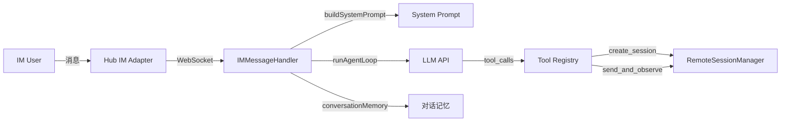
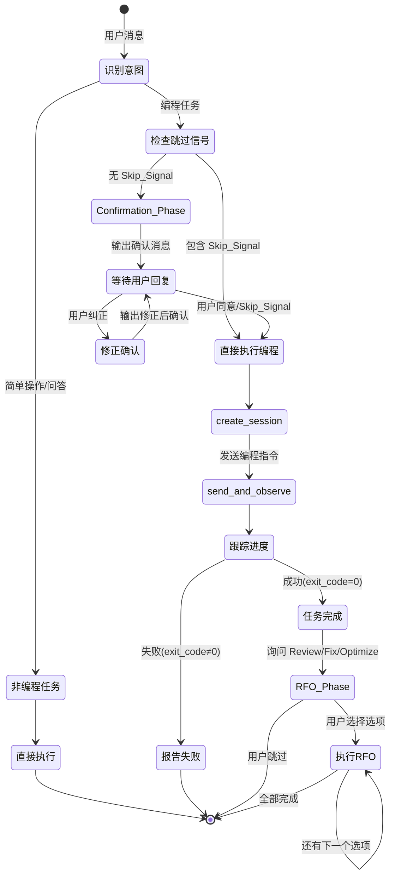

# Design Document: Coding Interaction Workflow

## Overview

本设计为 MaClaw Agent 的编程任务处理流程增加两个交互环节：

1. **Confirmation Phase（需求确认阶段）**：当 Agent 识别到用户消息为编程任务（Coding_Task）时，不再直接调用 `create_session`，而是先输出结构化确认消息（需求复述、实现方案、边界情况），等待用户确认后再执行。
2. **RFO Phase（Review/Fix/Optimize 阶段）**：编程任务成功完成后，Agent 询问用户是否需要代码质量提升，用户可选择 Review、Fix、Optimize 中的一个或多个，也可跳过。

### 设计决策

**纯提示词驱动方案**：本功能通过修改 `buildSystemPrompt()` 中的系统提示词来实现，不新增 Go 代码中的状态机或工具。原因：

- 当前架构中 Agent 行为完全由系统提示词 + 工具集驱动，LLM 具备足够的指令遵循能力
- Confirmation Phase 和 RFO Phase 本质上是 Agent 的对话策略变更，不涉及新的工具调用
- 对话记忆（`conversationMemory`）已能保存确认过程中的上下文，无需额外存储
- 避免引入复杂的状态机逻辑，保持架构简洁

**不新增工具的理由**：确认和 RFO 询问都是 Agent 的自然语言交互行为，通过提示词指令即可实现。Agent 已有 `create_session`、`send_and_observe` 等工具完成实际编程操作，新增工具反而增加不必要的复杂度。

## Architecture

### 系统架构（无变更）



本功能不改变系统架构，仅修改 System Prompt 中的工作流指令。

### 编程任务工作流变更



## Components and Interfaces

### 1. buildSystemPrompt() 修改

**文件**: `im_message_handler.go`

修改 `buildSystemPrompt()` 方法中的 `## ⚠️ 编程任务工作流（极其重要）` 部分，替换为包含 Confirmation Phase 和 RFO Phase 的新工作流指令。

#### 修改前（当前）

```
## ⚠️ 编程任务工作流（极其重要）
当用户提出编程需求时，按以下步骤执行：
1. 理解需求：如果用户指令模糊...先澄清...如果指令明确...可以直接执行
2. 创建会话：调用 create_session 启动编程工具
3. 发送指令：...
4. 跟踪进度：...
```

#### 修改后（新）

新的工作流指令将包含以下结构：

```
## ⚠️ 编程任务工作流（极其重要）

### 第一步：识别任务类型
- 编程任务（Coding_Task）：需要调用 create_session 启动远程编程工具的需求（写代码、重构、修 bug、添加功能等）
- 非编程任务：简单问答、文件操作（bash/read_file/write_file）、配置管理、截屏等 → 直接执行，不需要确认

### 第二步：检查跳过信号（Skip_Signal）
如果用户消息中包含以下表达，跳过确认直接执行：
- 中文：直接做、不用问了、按你的想法来、直接开始、不用确认、马上做、赶紧做
- English：just do it、skip confirmation、go ahead、do it now

### 第三步：需求确认（Confirmation Phase）
对于编程任务且无跳过信号时，必须先输出确认消息再执行：

**确认消息格式：**
📋 **需求确认**
1. 需求理解：[用简洁语言复述你对需求的理解]
2. 实现方案：[涉及的文件和大致实现思路]
3. 边界情况：[需要用户决定的设计决策点，如无则省略]

请确认是否按此方案执行？

**确认阶段规则：**
- 等待用户明确同意（如"好的"、"可以"、"确认"、"没问题"）后才调用 create_session
- 如果用户提出修正，更新理解后重新输出确认消息
- 如果用户在确认阶段发出跳过信号，立即执行

### 第四步：执行编程任务
（保留现有的 create_session → send_and_observe → 跟踪进度 流程）
- 将确认阶段达成的需求理解和实现方案整合到发送给编程工具的指令中

### 第五步：任务完成后 Review/Fix/Optimize（RFO Phase）
当编程任务成功完成（会话状态为 waiting_input 或 exited 且 exit_code=0）时：

**RFO 询问格式：**
✅ 任务已完成。是否需要进一步优化代码质量？（会消耗额外 tokens）
- Review：审查代码质量、命名、结构
- Fix：修复潜在问题、边界情况
- Optimize：性能优化、代码简化
- 跳过：直接结束

**RFO 规则：**
- 用户可选择一个或多个选项（如"review 和 optimize"、"全部"）
- 多选时按 Review → Fix → Optimize 顺序执行
- 每个选项通过 send_and_observe 发送对应指令给编程工具
- 每个选项完成后报告结果再执行下一个
- 用户说"不需要"、"跳过"、"skip"时直接结束
- 如果任务失败（exit_code≠0 或 error 状态），跳过 RFO 直接报告失败
```

### 2. 现有组件交互（无变更）

| 组件 | 角色 | 变更 |
|------|------|------|
| `conversationMemory` | 保存对话历史，包括确认阶段的交互 | 无变更，自然支持 |
| `create_session` 工具 | 创建远程编程会话 | 无变更 |
| `send_and_observe` 工具 | 发送指令并等待输出 | 无变更 |
| `get_session_output` 工具 | 获取会话输出 | 无变更 |
| `ToolRouter` | 根据消息内容路由工具 | 无变更 |
| `SecurityFirewall` | 工具调用安全检查 | 无变更 |

### 3. Skip_Signal 识别

Skip_Signal 的识别完全由 LLM 在系统提示词指导下完成，不需要代码层面的正则匹配。系统提示词中列出常见的跳过表达模式，LLM 基于语义理解判断用户意图。

支持的模式：
- 中文：直接做、不用问了、按你的想法来、直接开始、不用确认、马上做、赶紧做
- English：just do it、skip confirmation、go ahead、do it now
- 确认阶段中的跳过：用户在收到确认消息后回复跳过信号

### 4. RFO 指令模板

Agent 在执行 RFO 时，通过 `send_and_observe` 发送以下指令给编程工具：

- **Review**: `请审查刚才的代码变更：检查代码质量、命名规范、结构合理性、是否有明显的 code smell。列出发现的问题和改进建议。`
- **Fix**: `请检查刚才的代码变更中的潜在问题：边界情况处理、错误处理、空值检查、并发安全等。如果发现问题，直接修复。`
- **Optimize**: `请优化刚才的代码变更：性能优化、代码简化、减少重复、改进可读性。直接应用优化。`

## Data Models

### 无新增数据模型

本功能不引入新的数据结构。所有交互状态通过以下现有机制管理：

1. **对话记忆** (`conversationMemory`): 确认阶段的对话（Agent 的确认消息、用户的回复/修正）自然保存在对话历史中，后续 Agent 循环可引用。

2. **会话状态** (`RemoteSession.Status`): 现有的 `SessionWaitingInput`、`SessionBusy`、`SessionExited` 等状态已足够判断任务完成情况和是否触发 RFO。

3. **会话摘要** (`SessionSummary`): 现有的 `ExitCode`、`Status` 字段已足够判断任务成功/失败。

### 系统提示词变更范围

仅修改 `buildSystemPrompt()` 中的一个文本块：

```go
// 修改前：约 15 行的 "编程任务工作流" 部分
// 修改后：约 50 行的新工作流指令（包含 Confirmation Phase + RFO Phase）
```

其余系统提示词内容（核心原则、执行验证、会话失败止损、工具使用要点、设备状态等）保持不变。


## Correctness Properties

*A property is a characteristic or behavior that should hold true across all valid executions of a system — essentially, a formal statement about what the system should do. Properties serve as the bridge between human-readable specifications and machine-verifiable correctness guarantees.*

由于本功能的核心实现是修改 `buildSystemPrompt()` 的输出文本，correctness properties 主要验证系统提示词的结构完整性和内容正确性。这些属性确保提示词变更不会遗漏关键工作流指令。

### Property 1: Confirmation Phase 在 create_session 之前

*For any* valid system configuration, calling `buildSystemPrompt()` should produce a prompt string where the Confirmation Phase instructions (需求确认) appear before the `create_session` execution instructions, ensuring the Agent is instructed to confirm before creating a session.

**Validates: Requirements 1.1, 6.1**

### Property 2: 确认消息包含所有必需组件

*For any* valid system configuration, calling `buildSystemPrompt()` should produce a prompt string that contains instructions for all three confirmation message components: 需求理解（需求复述）、实现方案、边界情况。

**Validates: Requirements 1.2**

### Property 3: 编程任务与非编程任务的区分

*For any* valid system configuration, calling `buildSystemPrompt()` should produce a prompt string that contains clear criteria distinguishing Coding_Task (requiring Confirmation Phase) from non-coding requests (direct execution), and explicitly lists non-coding examples (file operations, configuration, screenshots, general questions).

**Validates: Requirements 1.5, 6.4, 7.1, 7.3**

### Property 4: Skip_Signal 双语模式

*For any* valid system configuration, calling `buildSystemPrompt()` should produce a prompt string that contains Skip_Signal patterns in both Chinese (e.g., 直接做, 不用问了) and English (e.g., just do it, go ahead).

**Validates: Requirements 2.1, 2.3, 6.3**

### Property 5: RFO 工作流完整性

*For any* valid system configuration, calling `buildSystemPrompt()` should produce a prompt string that contains: (a) RFO trigger conditions (waiting_input or exited with exit_code=0), (b) all three RFO options (Review, Fix, Optimize), (c) the sequential execution order Review → Fix → Optimize for multi-select scenarios.

**Validates: Requirements 4.1, 4.2, 5.1, 5.2, 6.2**

### Property 6: 任务失败时跳过 RFO

*For any* valid system configuration, calling `buildSystemPrompt()` should produce a prompt string that contains explicit instructions to skip RFO_Phase when the coding task fails (non-zero exit code or error status).

**Validates: Requirements 4.6**

### Property 7: 现有工作流规则保留

*For any* valid system configuration, calling `buildSystemPrompt()` should produce a prompt string that preserves all existing workflow rules: (a) 会话失败止损原则, (b) 执行验证原则, (c) busy 会话不终止规则.

**Validates: Requirements 6.5**

## Error Handling

### 1. LLM 不遵循确认流程

**场景**: LLM 忽略系统提示词中的确认指令，直接调用 `create_session`。

**处理**: 这是 LLM 合规性问题，非代码层面可控。缓解措施：
- 在系统提示词中使用强调标记（⚠️、极其重要）提高指令优先级
- 在 `create_session` 工具描述中添加提示："如果用户需求模糊，建议先澄清再创建"（已有）
- 后续可考虑在 `toolCreateSession` 中添加代码级拦截（超出本次范围）

### 2. 确认阶段对话记忆溢出

**场景**: 用户在确认阶段反复修正，导致对话历史过长。

**处理**: 现有的 `trimConversation` 和 `trimHistory` 机制已能处理。对话历史超过 `maxConversationTurns`（40 轮）或 token 限制时自动裁剪旧消息。

### 3. RFO 阶段会话已退出

**场景**: 用户选择 RFO 选项时，编程工具会话已经退出。

**处理**: Agent 通过 `send_and_observe` 发送 RFO 指令时，如果会话已退出，工具会返回错误信息。Agent 应告知用户会话已结束，无法执行 RFO。系统提示词中应包含此场景的处理指引。

### 4. Skip_Signal 误识别

**场景**: LLM 将非跳过意图的消息误判为 Skip_Signal（如"直接告诉我怎么做"被误判为"直接做"）。

**处理**: 系统提示词中列出明确的 Skip_Signal 模式，并强调需要语义匹配而非子串匹配。LLM 的语义理解能力通常足以区分。

### 5. 系统提示词 token 预算

**场景**: 新增的工作流指令增加了系统提示词长度，可能影响对话上下文窗口。

**处理**: 新增约 50 行指令文本，估计增加 ~500 tokens。当前系统提示词约 2000-3000 tokens，增加后仍在合理范围内。`trimConversation` 会根据总 token 预算自动调整对话历史长度。

## Testing Strategy

### 单元测试

1. **buildSystemPrompt 输出验证**: 调用 `buildSystemPrompt()` 并验证输出包含所有必需的工作流指令关键词和结构。
2. **现有功能回归**: 验证修改后的 `buildSystemPrompt()` 仍包含所有现有工作流规则（止损、验证、busy 会话等）。
3. **边界情况**: 测试不同配置下（自定义角色名、有/无活跃会话、有/无 MCP Server）的提示词生成。

### Property-Based Testing

使用 Go 的 `testing/quick` 包进行属性测试。

**配置**:
- 每个属性测试运行至少 100 次迭代
- 生成随机的 App 配置（角色名、角色描述、活跃会话列表等）
- 每个测试用注释标注对应的设计属性

**标注格式**: `// Feature: coding-interaction-workflow, Property N: <property_text>`

**测试文件**: `im_message_handler_coding_workflow_test.go`

**属性测试列表**:

| Property | 测试描述 | 生成器 |
|----------|----------|--------|
| Property 1 | 确认阶段在 create_session 之前 | 随机 App 配置 |
| Property 2 | 确认消息包含三个组件 | 随机 App 配置 |
| Property 3 | 编程/非编程任务区分 | 随机 App 配置 |
| Property 4 | Skip_Signal 双语模式 | 随机 App 配置 |
| Property 5 | RFO 工作流完整性 | 随机 App 配置 |
| Property 6 | 任务失败跳过 RFO | 随机 App 配置 |
| Property 7 | 现有规则保留 | 随机 App 配置 |

每个 correctness property 必须由单个 property-based test 实现。单元测试用于覆盖具体示例和边界情况（如空配置、极长角色名等），property-based test 用于验证跨所有有效配置的通用属性。
