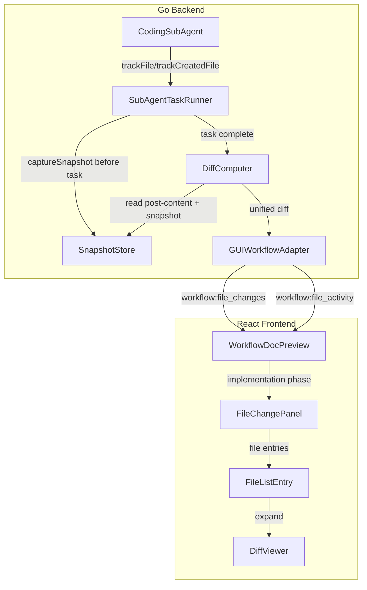
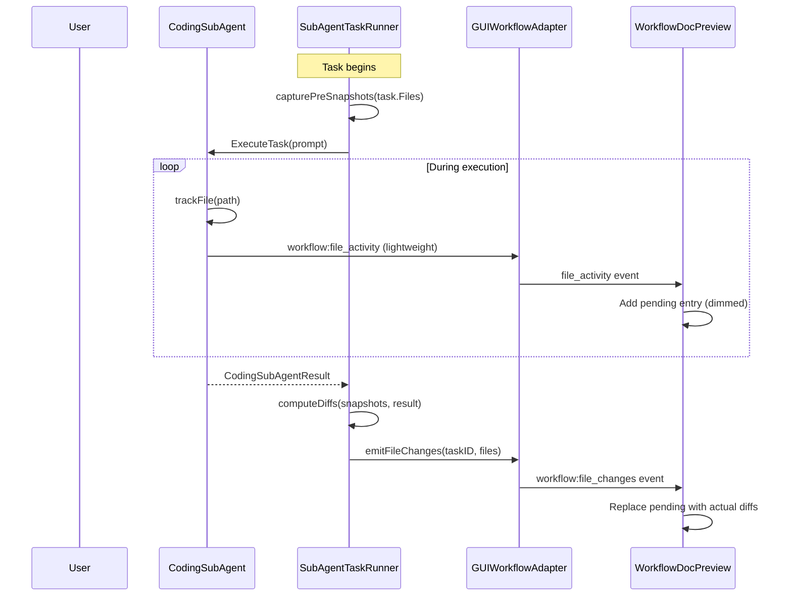

# Design Document: Coding Phase File Preview

## Overview

This feature connects the CodingSubAgent's file tracking infrastructure to the WorkflowDocPreview panel, enabling real-time file change visualization during the implementation phase of the coding workflow. The system captures pre-modification file snapshots, computes unified diffs after task completion, and emits structured events that the frontend renders as an interactive file change list with expandable diffs.

The design leverages existing infrastructure:
- **Backend**: `CodeEventEmitter` (Wails event emission), `SubAgentTaskRunner` (task execution lifecycle), `GUIWorkflowAdapter` (workflow event bridge)
- **Frontend**: `WorkflowDocPreview` (phase-aware document panel), `WorkflowProgressBoard` (phase navigation)

Key design decisions:
1. **Extend existing event infrastructure** rather than creating new event channels — the `GUIWorkflowAdapter` already bridges workflow state to the frontend via `runtime.EventsEmit`
2. **Compute diffs on the backend** (Go) using the standard unified diff algorithm — avoids shipping large file contents to the frontend
3. **Dual-mode rendering** in WorkflowDocPreview — Markdown mode for document phases, file-change mode for implementation phase, controlled by a single `displayMode` state variable
4. **Incremental accumulation** — file changes accumulate across tasks with latest-wins semantics per file path

## Architecture



### Data Flow Sequence



## Components and Interfaces

### Backend Components

#### 1. FileSnapshotStore (new, `gui/file_snapshot_store.go`)

Captures and stores pre-modification file content for diff computation.

```go
// FileSnapshotStore holds pre-modification file content for a single task execution.
type FileSnapshotStore struct {
    mu        sync.RWMutex
    snapshots map[string]fileSnapshot // keyed by absolute path
    maxFiles  int                     // cap at 50 per task
}

type fileSnapshot struct {
    Content   string // UTF-8 file content (empty if capture failed)
    Error     string // non-empty if capture failed (permission, too large, etc.)
    CapturedAt time.Time
}

// CaptureSnapshots reads files from disk and stores their content.
// Skips files > 2MB, binary files, and files that cannot be read.
// Limited to maxFiles entries.
func (s *FileSnapshotStore) CaptureSnapshots(projectPath string, filePaths []string)

// GetSnapshot returns the pre-modification content for a file path.
func (s *FileSnapshotStore) GetSnapshot(absPath string) (fileSnapshot, bool)

// Clear resets the store for the next task.
func (s *FileSnapshotStore) Clear()
```

#### 2. DiffComputer (new, `gui/diff_computer.go`)

Computes unified diffs between pre/post file content.

```go
// DiffComputer computes unified diffs for file changes.
type DiffComputer struct {
    contextLines int // default 3
    maxDiffLines int // default 500
}

// ComputeFileDiffs generates diffs for all files in a task result.
// Uses snapshots for modified files, full-content for created/deleted files.
func (dc *DiffComputer) ComputeFileDiffs(
    projectPath string,
    snapshots *FileSnapshotStore,
    filesModified []string,
    filesCreated []string,
) []FileChangeDiff

// FileChangeDiff is the diff result for a single file.
type FileChangeDiff struct {
    Path       string // project-relative, forward slashes
    ChangeType string // "added", "modified", "deleted"
    Diff       string // unified diff content
    Language   string // inferred from extension
    Truncated  bool   // true if diff exceeded maxDiffLines
    TotalLines int    // total diff lines before truncation
    Error      string // non-empty if diff computation failed
}
```

#### 3. WorkflowFileChangeEmitter (new methods on GUIWorkflowAdapter)

Extends `GUIWorkflowAdapter` with file change event emission.

```go
// EmitFileChanges emits a workflow:file_changes event after task completion.
func (a *GUIWorkflowAdapter) EmitFileChanges(userID string, payload FileChangesPayload) error

// EmitFileActivity emits a lightweight workflow:file_activity event during execution.
func (a *GUIWorkflowAdapter) EmitFileActivity(userID string, payload FileActivityPayload) error

// FileChangesPayload is the workflow:file_changes event structure.
type FileChangesPayload struct {
    UserID    string           `json:"user_id"`
    PhaseID   string           `json:"phase_id"`   // always "implementation"
    TaskID    string           `json:"task_id"`
    TaskTitle string           `json:"task_title"` // max 200 chars
    Files     []FileChangeItem `json:"files"`      // max 200 entries
    Truncated bool             `json:"truncated"`  // true if files > 200
}

// FileChangeItem is a single file change in the event payload.
type FileChangeItem struct {
    Path       string `json:"path"`        // project-relative, forward slashes, max 500 chars
    ChangeType string `json:"change_type"` // "added" | "modified" | "deleted"
    Diff       string `json:"diff"`        // unified diff format
    Language   string `json:"language"`    // from extension or "plaintext"
}

// FileActivityPayload is the workflow:file_activity event structure.
type FileActivityPayload struct {
    UserID     string `json:"user_id"`
    PhaseID    string `json:"phase_id"`    // always "implementation"
    TaskID     string `json:"task_id"`
    FilePath   string `json:"file_path"`   // project-relative, forward slashes, max 500 chars
    ChangeType string `json:"change_type"` // "added" | "modified" | "deleted"
}
```

#### 4. Integration with SubAgentTaskRunner

The `SubAgentTaskRunner.runTaskHandle` method is extended:

```go
// Before task execution:
snapshotStore := NewFileSnapshotStore(50)
snapshotStore.CaptureSnapshots(projectPath, task.Files)

// After task completion (in existing artifactsRecorded block):
diffComputer := &DiffComputer{contextLines: 3, maxDiffLines: 500}
diffs := diffComputer.ComputeFileDiffs(projectPath, snapshotStore, result.FilesModified, result.FilesCreated)
adapter.EmitFileChanges(userID, buildFileChangesPayload(task, diffs))
```

#### 5. Path Normalization (new, `gui/file_path_normalize.go`)

```go
// NormalizeFilePathForEvent converts a file path to project-relative,
// forward-slash format. Returns empty string if path is outside project root.
func NormalizeFilePathForEvent(filePath, projectPath string) string

// IsBinaryFile checks if file content contains null bytes in first 8192 bytes.
func IsBinaryFile(content []byte) bool
```

### Frontend Components

#### 6. FileChangePanel (new, `gui/frontend/src/components/ai/FileChangePanel.tsx`)

Top-level component for the file change preview mode.

```typescript
interface FileChangeState {
    taskGroups: TaskFileGroup[];      // accumulated across tasks
    pendingFiles: PendingFileEntry[]; // files seen during execution, no diff yet
    isExecuting: boolean;             // spinner state
    currentTaskTitle: string;
}

interface TaskFileGroup {
    taskId: string;
    taskTitle: string;
    files: FileChangeEntry[];
    status: "completed" | "failed" | "cancelled";
}

interface FileChangeEntry {
    path: string;
    changeType: "added" | "modified" | "deleted";
    diff: string;
    language: string;
    expanded: boolean;
}

interface PendingFileEntry {
    path: string;
    changeType: "added" | "modified" | "deleted";
}
```

#### 7. DiffViewer (new, `gui/frontend/src/components/ai/DiffViewer.tsx`)

Renders unified diff content with syntax highlighting.

```typescript
interface DiffViewerProps {
    diff: string;
    language: string;
    theme: DocPreviewTheme;
}
```

Lines prefixed with `+` get green background, `-` get red background, `@@` get blue/muted styling, context lines get default styling.

#### 8. WorkflowDocPreview Extension

The existing component gains a `displayMode` state:

```typescript
type DisplayMode = "markdown" | "file-changes";

// Mode is determined by:
// - "file-changes" when activePhaseID === "implementation"
// - "markdown" for all other phases
```

## Data Models

### Event Payloads (TypeScript)

```typescript
// workflow:file_changes event
interface WorkflowFileChangesEvent {
    user_id: string;
    phase_id: "implementation";
    task_id: string;
    task_title: string;       // max 200 chars
    files: FileChangeItem[];  // max 200 entries
    truncated?: boolean;
}

interface FileChangeItem {
    path: string;             // project-relative, forward slashes, max 500 chars
    change_type: "added" | "modified" | "deleted";
    diff: string;             // unified diff format, max 500 lines
    language: string;
}

// workflow:file_activity event
interface WorkflowFileActivityEvent {
    user_id: string;
    phase_id: "implementation";
    task_id: string;
    file_path: string;        // project-relative, forward slashes, max 500 chars
    change_type: "added" | "modified" | "deleted";
}
```

### State Management (Frontend)

```typescript
// Accumulated state preserved across phase navigation
interface FileChangePreviewState {
    taskGroups: TaskFileGroup[];
    expandedPaths: Set<string>;  // preserved across navigation
    scrollPosition: number;       // preserved across navigation
}
```

### Snapshot Storage (Backend, in-memory per task)

```go
// Per-task, cleared after diff computation
type fileSnapshot struct {
    Content    string    // raw UTF-8 content, empty if capture failed
    Error      string    // "permission_denied" | "file_too_large" | "not_found" | ""
    CapturedAt time.Time
    Size       int64     // original file size
}
```

## Correctness Properties

*A property is a characteristic or behavior that should hold true across all valid executions of a system — essentially, a formal statement about what the system should do. Properties serve as the bridge between human-readable specifications and machine-verifiable correctness guarantees.*

### Property 1: Event Payload Structural Completeness

*For any* `workflow:file_changes` event emitted by the system, the payload SHALL contain all required fields (`user_id`, `phase_id`, `task_id`, `task_title`, `files`) with correct types, `phase_id` SHALL always equal `"implementation"`, `task_title` SHALL not exceed 200 characters, and each file entry SHALL contain `path` (max 500 chars, forward slashes only, no `..` segments), `change_type` (one of "added"/"modified"/"deleted"), `diff` (string), and `language` (string).

**Validates: Requirements 6.1, 6.2, 6.3**

### Property 2: Diff Computation Round-Trip

*For any* pair of valid UTF-8 text files (original, modified) where both are under 2MB, computing the unified diff and applying it to the original SHALL produce content equivalent to the modified file.

**Validates: Requirements 1.2, 2.3**

### Property 3: Snapshot Map Size Invariant

*For any* task with N files listed in its `Files` field (where N ranges from 0 to any positive integer), the snapshot store SHALL contain at most 50 entries after `CaptureSnapshots` completes.

**Validates: Requirements 2.2**

### Property 4: Diff Truncation Invariant

*For any* computed unified diff, if the diff exceeds 500 lines, the emitted diff string SHALL contain exactly 500 lines followed by a truncation marker, and the `truncated` field SHALL be true with `totalLines` reflecting the actual line count.

**Validates: Requirements 2.5, 3.6, 7.3**

### Property 5: File List Grouping Order

*For any* set of file change entries rendered in the FileChangePanel, files SHALL be ordered by change type in the sequence: all "added" files first, then all "modified" files, then all "deleted" files.

**Validates: Requirements 3.1**

### Property 6: Summary Header Count Correctness

*For any* accumulated set of file changes across N tasks, the summary header counts (added, modified, deleted) SHALL equal the actual count of unique file paths in each category after latest-wins deduplication.

**Validates: Requirements 3.7**

### Property 7: File Accumulation Latest-State Semantics

*For any* sequence of `workflow:file_changes` events where the same file path appears in multiple events, the displayed diff for that path SHALL be the diff from the most recently received event (latest wins).

**Validates: Requirements 3.8**

### Property 8: Task Title Truncation

*For any* task title string of length L, the displayed title SHALL be the full string if L ≤ 80, or the first 80 characters followed by "…" if L > 80.

**Validates: Requirements 3.9**

### Property 9: Pending File Deduplication

*For any* sequence of `workflow:file_activity` events received during task execution, the pending file list SHALL contain at most one entry per unique file path, with the change type from the most recent event for that path.

**Validates: Requirements 4.3**

### Property 10: Path Normalization and Safety

*For any* file path processed by the system, the output path SHALL use forward slashes, be relative to the project root, contain no `..` segments, and if the resolved absolute path does not start with the project root directory, the file SHALL be excluded from all emitted events.

**Validates: Requirements 6.4, 6.5**

### Property 11: File List Truncation at 200 Entries

*For any* `workflow:file_changes` event where the source file list contains N > 200 entries, the emitted `files` array SHALL contain exactly 200 entries and the `truncated` field SHALL be `true`.

**Validates: Requirements 6.6**

### Property 12: Binary File Detection

*For any* file whose content contains at least one null byte (0x00) within the first 8192 bytes, the system SHALL emit a "Binary file changed" placeholder instead of attempting to compute a diff.

**Validates: Requirements 7.2**

## Error Handling

### Backend Error Scenarios

| Scenario | Handling |
|----------|----------|
| File unreadable during snapshot (permission denied) | Store `fileSnapshot{Error: "permission_denied"}`, emit placeholder diff |
| File > 2MB during snapshot | Skip snapshot, store `fileSnapshot{Error: "file_too_large"}` |
| File deleted between snapshot and diff computation | Generate full-deletion diff from snapshot |
| File created between task start and completion (not in Files list) | Included via `FilesCreated` in result, no snapshot needed |
| Binary file detected (null bytes in first 8192 bytes) | Emit `FileChangeItem{Diff: "Binary file changed", ...}` |
| Git not available for original content | Fall back to snapshot-based diff (no git dependency for core flow) |
| Path resolves outside project root | Exclude from event, log warning |
| Task fails mid-execution | Emit partial file changes with task status "failed" |
| Task cancelled mid-execution | Emit partial file changes with task status "cancelled" |
| Wails context nil (app shutting down) | Silently skip event emission |

### Frontend Error Scenarios

| Scenario | Handling |
|----------|----------|
| Event received with empty files array | Display "No changes captured" under task title |
| Event received with malformed diff | Display raw diff text without highlighting |
| Phase navigation during event processing | Queue events, process after navigation completes |
| Workflow reset during active display | Clear all state immediately |

## Testing Strategy

### Property-Based Tests (Go, using `rapid`)

Property-based testing is appropriate for this feature because:
- Path normalization has a large input space (Windows/Unix paths, relative/absolute, with `..` segments)
- Diff computation has universal properties (round-trip, truncation invariants)
- Event payload validation has structural constraints that should hold for all inputs

Configuration: minimum 100 iterations per property test.

**Library**: `pgregory.net/rapid` (already used in the project's `corelib/memory` tests)

Tests to implement:
- **Property 1**: Generate random `FileChangesPayload`, serialize to JSON, deserialize, verify all fields present and valid
- **Property 2**: Generate random text file pairs, compute diff, apply diff, verify round-trip
- **Property 3**: Generate task file lists of size 0-200, verify snapshot map ≤ 50
- **Property 4**: Generate file pairs producing diffs of 1-2000 lines, verify truncation at 500
- **Property 5**: Generate random file change sets, verify rendered order
- **Property 6**: Generate multi-task file change sequences, verify summary counts
- **Property 7**: Generate overlapping file paths across tasks, verify latest-wins
- **Property 8**: Generate strings of length 0-500, verify truncation at 80
- **Property 9**: Generate file_activity event sequences with repeated paths, verify dedup
- **Property 10**: Generate paths with various formats, verify normalization and exclusion
- **Property 11**: Generate file lists of size 1-500, verify truncation at 200
- **Property 12**: Generate byte slices with null bytes at various positions, verify detection

Tag format: **Feature: coding-phase-file-preview, Property {number}: {property_text}**

### Unit Tests (Go)

- `TestDiffComputer_ModifiedFile` — known input/output pair
- `TestDiffComputer_CreatedFile` — all lines are additions
- `TestDiffComputer_DeletedFile` — all lines are deletions
- `TestFileSnapshotStore_PermissionDenied` — error handling
- `TestFileSnapshotStore_FileTooLarge` — 2MB limit
- `TestNormalizeFilePathForEvent_WindowsBackslash` — path normalization
- `TestNormalizeFilePathForEvent_OutsideProject` — exclusion
- `TestIsBinaryFile_NullBytePositions` — binary detection edge cases
- `TestEmitFileChanges_EmptyResult` — empty files array emission
- `TestEmitFileChanges_Truncation` — 200 file limit

### Unit Tests (TypeScript/React)

- `FileChangePanel` renders grouped file list correctly
- `FileChangePanel` handles expand/collapse interactions
- `DiffViewer` renders additions/deletions with correct styling
- `WorkflowDocPreview` switches display mode on phase change
- `WorkflowDocPreview` preserves state across navigation
- `WorkflowDocPreview` clears state on workflow reset
- Pending file entries transition to resolved on task completion

### Integration Tests

- Full flow: SubAgent executes task → snapshots captured → diffs computed → event emitted → frontend renders
- Multi-task accumulation with overlapping file paths
- Task failure with partial file changes
- Phase navigation between Markdown and file-change modes
