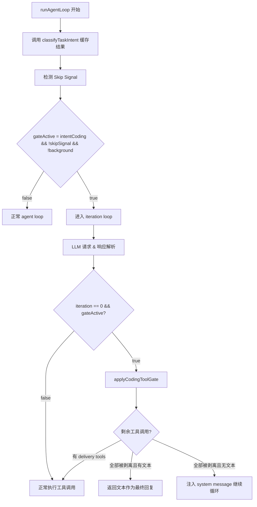

# Design Document: Coding Workflow Gate

## Overview

本功能在 `runAgentLoop` 的 agent loop 中加入代码级硬性拦截机制（Coding Tool Gate），作为 system prompt 中 HARD GATE 约束的最后防线。当 intent classifier 判定为 `intentCoding` 且处于 iteration 0 且用户未发出跳过信号时，拦截器从 LLM 回复中剥离编码工具调用（`create_session`、`bash`、`write_file` 等），仅保留文本内容和交付工具调用（`generate_pdf`、`send_file` 等），确保三阶段编程工作流不被 LLM 绕过。

核心设计原则：
- 拦截发生在 LLM 响应解析之后、工具执行之前
- 仅影响 iteration 0 的编码意图任务，后续轮次完全透明
- 不修改 system prompt、工具定义或其他 agent loop 行为
- 不影响后台循环（`LoopKindBackground`）

## Architecture

拦截器作为一个纯函数模块嵌入 `runAgentLoop` 的主循环中，位于 LLM 响应解析（`choice.Message.ToolCalls`）和工具执行循环之间。



拦截点位于 `gui/im_message_handler.go` 的 `runAgentLoop` 方法中，在以下代码之后：

```go
choice := resp.Choices[0]
// ... assistantMsg construction ...
if len(choice.Message.ToolCalls) > 0 {
    assistantMsg["tool_calls"] = choice.Message.ToolCalls
}
```

在进入 `for _, tc := range choice.Message.ToolCalls` 工具执行循环之前插入 gate 逻辑。

## Components and Interfaces

### 1. `codingToolGate` 结构体

新文件 `gui/coding_tool_gate.go`，包含所有 gate 相关逻辑。

```go
// codingToolGateConfig holds the pre-computed gate decision for the loop.
type codingToolGateConfig struct {
    active     bool       // gate 是否激活（intentCoding && !skip && !background）
    intent     taskIntent // 缓存的 intent 分类结果
    skipSignal bool       // 用户消息是否包含跳过信号
    reason     string     // gate 决策原因（用于日志）
}

// codingToolGateResult holds the result of applying the gate to a set of tool calls.
type codingToolGateResult struct {
    stripped  []llm.ToolCall // 被剥离的编码工具调用
    remaining []llm.ToolCall // 保留的工具调用（delivery tools）
    applied   bool           // gate 是否实际生效（有工具被剥离）
}
```

### 2. 核心函数

```go
// newCodingToolGateConfig 在 loop 开始前调用一次，缓存 gate 决策。
func newCodingToolGateConfig(userText string, loopKind LoopKind) codingToolGateConfig

// applyCodingToolGate 在 iteration 0 对工具调用列表执行过滤。
func applyCodingToolGate(calls []llm.ToolCall) codingToolGateResult

// containsSkipSignal 检测用户消息中是否包含跳过信号。
func containsSkipSignal(text string) bool

// isCodingTool 判断工具名是否在编码工具黑名单中。
func isCodingTool(name string) bool
```

### 3. 工具分类

黑名单（编码工具，subject to stripping）：

```go
var codingToolBlocklist = map[string]bool{
    "create_session":  true,
    "bash":            true,
    "write_file":      true,
    "edit_file":       true,
    "craft_tool":      true,
    "send_and_observe": true,
    "control_session": true,
}
```

白名单（交付工具，永不拦截）：

```go
var deliveryToolAllowlist = map[string]bool{
    "generate_pdf":  true,
    "send_file":     true,
    "memory":        true,
    "open":          true,
    "set_nickname":  true,
    "manage_config": true,
}
```

分类逻辑：工具名在 blocklist 中且不在 allowlist 中 → 编码工具。不在 blocklist 中的工具默认放行。

### 4. 跳过信号

```go
var skipSignalsChinese = []string{
    "直接做", "不用问了", "按你的想法来", "直接开始",
    "不用确认", "马上做", "赶紧做", "跳过文档", "不需要文档",
}

var skipSignalsEnglish = []string{
    "just do it", "skip confirmation", "go ahead", "do it now",
}
```

匹配规则：大小写不敏感，子串匹配。

### 5. 集成点（runAgentLoop 修改）

在 `runAgentLoop` 中的修改：

1. **loop 开始前**（conversation 构建之后，iteration loop 之前）：
   ```go
   gateConfig := newCodingToolGateConfig(userText, ctx.Kind)
   ```

2. **iteration 0，工具执行前**：
   ```go
   if iteration == 0 && gateConfig.active && len(choice.Message.ToolCalls) > 0 {
       gateResult := applyCodingToolGate(choice.Message.ToolCalls)
       if gateResult.applied {
           // log, trace, update choice.Message.ToolCalls
           choice.Message.ToolCalls = gateResult.remaining
           // update assistantMsg["tool_calls"]
           if len(gateResult.remaining) == 0 {
               delete(assistantMsg, "tool_calls")
           } else {
               assistantMsg["tool_calls"] = gateResult.remaining
           }
       }
   }
   ```

## Data Models

无新增持久化数据模型。所有状态为 loop 生命周期内的临时变量：

| 字段 | 类型 | 生命周期 | 说明 |
|------|------|----------|------|
| `gateConfig` | `codingToolGateConfig` | 单次 loop | loop 开始时计算，整个 loop 不变 |
| `gateResult` | `codingToolGateResult` | 单次 iteration | iteration 0 计算，用后即弃 |


## Correctness Properties

*A property is a characteristic or behavior that should hold true across all valid executions of a system — essentially, a formal statement about what the system should do. Properties serve as the bridge between human-readable specifications and machine-verifiable correctness guarantees.*

### Property 1: Tool stripping correctness

*For any* list of `llm.ToolCall` items, when `applyCodingToolGate` is applied, the `stripped` result SHALL contain exactly those tool calls whose function name is in `codingToolBlocklist` and not in `deliveryToolAllowlist`, and the `remaining` result SHALL contain all other tool calls in their original order.

**Validates: Requirements 1.1, 1.3, 2.3, 2.4**

### Property 2: Text content preservation

*For any* LLM response text content and any list of tool calls, applying the coding tool gate SHALL never modify, truncate, or reorder the text content — the text before and after gate application SHALL be identical.

**Validates: Requirements 1.2**

### Property 3: Gate inactivity for non-qualifying configurations

*For any* `codingToolGateConfig` where `active` is false (due to non-coding intent, skip signal present, or background loop kind), and *for any* iteration number and tool call list, the gate SHALL not strip any tool calls — the output tool call list SHALL be identical to the input.

**Validates: Requirements 1.4, 1.5, 5.4, 7.1, 7.2, 7.3, 7.5**

### Property 4: Tool classification determinism

*For any* tool name string, `isCodingTool(name)` SHALL return true if and only if the name is present in `codingToolBlocklist` and not present in `deliveryToolAllowlist`. All other tool names SHALL return false (default-allow).

**Validates: Requirements 2.1, 2.2, 2.3, 2.4**

### Property 5: Skip signal detection completeness

*For any* known skip signal string (Chinese or English) and *for any* surrounding text (prefix/suffix) and *for any* case variation of the signal, `containsSkipSignal` SHALL return true when the signal appears as a substring within the message.

**Validates: Requirements 3.1, 3.2, 3.3, 3.4**

## Error Handling

| 场景 | 处理方式 |
|------|----------|
| `classifyTaskIntent` 返回 `intentUnknown` | gate 不激活，保守放行所有工具调用 |
| `choice.Message.ToolCalls` 为空 | gate 无需介入，走正常的 no-tool-call 分支 |
| gate 剥离所有工具后文本为空 | 注入 system message 提示 LLM 生成需求文档，继续循环 |
| gate 剥离部分工具后仍有 delivery tools | 正常执行剩余 delivery tools |
| `userText` 为空字符串 | `classifyTaskIntent` 返回 `intentUnknown`，gate 不激活 |

## Testing Strategy

### Property-Based Tests（使用 `testing/quick`）

每个 property test 运行至少 100 次迭代，使用 Go 标准库 `testing/quick` 包。

- **Property 1**: 生成随机工具调用列表（工具名从 blocklist + allowlist + 随机名中选取），验证 `applyCodingToolGate` 的分区结果正确
- **Property 2**: 生成随机文本内容 + 随机工具调用列表，验证 gate 不修改文本
- **Property 3**: 生成随机 `codingToolGateConfig`（active=false），验证 gate 不剥离任何工具
- **Property 4**: 生成随机工具名，验证 `isCodingTool` 与 blocklist/allowlist 成员关系一致
- **Property 5**: 从已知信号列表中随机选取，随机添加前缀/后缀/大小写变换，验证 `containsSkipSignal` 返回 true

Tag 格式：`Feature: coding-workflow-gate, Property N: <property_text>`

### Unit Tests（example-based）

- 验证 blocklist 包含所有 7 个指定工具名（Req 2.1）
- 验证 allowlist 包含所有 6 个指定工具名（Req 2.2）
- 验证 `newCodingToolGateConfig` 对各种 intent + loopKind 组合的决策正确性
- 验证 gate 剥离后空文本时注入 system message 的行为（Req 4.3）
- 验证日志输出包含 stripped tool names 和 preserved tool names（Req 6.1, 6.2）
- 验证 trace event 类型为 `gate.coding_tool_stripped`（Req 6.3）

### Integration Considerations

- gate 逻辑为纯函数，不依赖外部服务，所有测试可在单元测试中完成
- `runAgentLoop` 的集成测试可通过现有的 `im_message_handler_spec_workflow_test.go` 模式扩展
