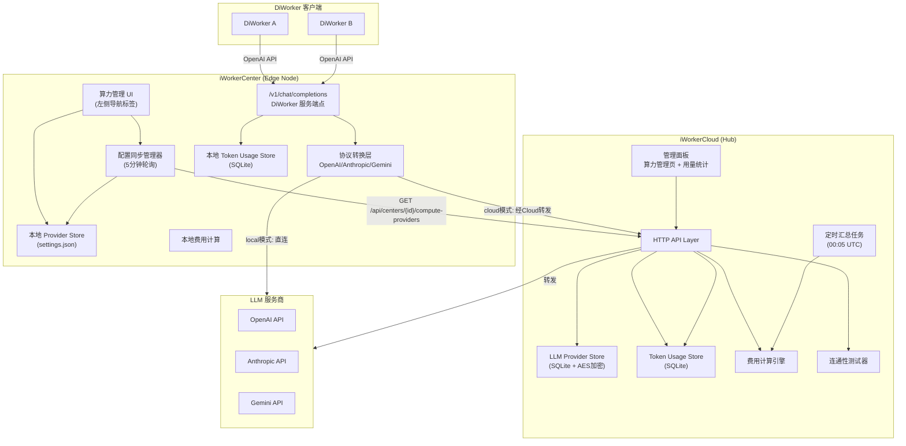
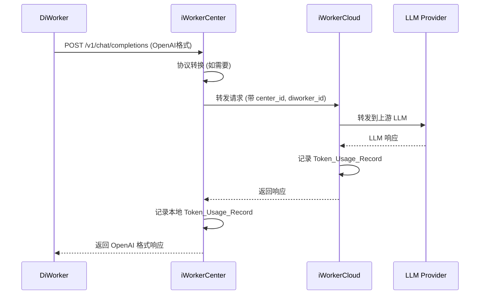

# 技术设计文档：算力管理模块

## 概述

算力管理模块在 iWorkerCloud（中心化管理平台，基于 Hub 架构）与 iWorkerCenter（边缘节点，Wails + React 桌面应用）之间建立统一的 LLM 算力配置、分发、协议转换和用量计费体系。

核心设计目标：
1. iWorkerCloud 集中管理 LLM 服务商配置（CRUD + 加密存储 + 连通性测试），通过 API 分发给各 iWorkerCenter
2. iWorkerCenter 默认从 Cloud 同步算力配置（cloud 模式），获授权后可切换为本地自管理（local 模式）
3. 协议转换层将 Anthropic / Gemini 协议统一转换为 OpenAI API 格式，对 DiWorker 提供一致接口
4. 双端独立记录 token 用量：Cloud 记录全局数据用于精算，Center 记录本地数据用于实时统计
5. 基于 MToken 单价配置自动计算费用，支持按 Center / DiWorker 维度的日/月统计和趋势图表

### 设计决策

| 决策点 | 选择 | 理由 |
|--------|------|------|
| API Key 存储 | SQLite + AES-256-GCM 加密 | 与现有 Hub 架构一致，SQLite 已有成熟的 store 层；AES-GCM 提供认证加密 |
| 协议转换位置 | iWorkerCenter 本地转换 | 减少 Cloud 负载，Center 已有 LLM 请求转发逻辑 |
| Token 用量记录 | 双端独立记录 | Cloud 在转发时记录全局数据；Center 记录本地数据用于实时 DiWorker 统计 |
| 费用计算 | 基于 MToken 单价 × 实际用量 | 业界标准计费方式，支持 input/output 差异化定价 |
| 前端图表 | Recharts | React 生态成熟的图表库，与现有 Wails + React 前端技术栈一致 |
| 配置同步间隔 | 5 分钟 | 平衡实时性与网络开销 |

## 架构

### 系统架构图



### 请求流转（Cloud 模式）



## 组件与接口

### 1. iWorkerCloud 算力管理 API

#### LLM Provider CRUD

```
POST   /api/admin/compute/providers          — 创建 Provider
GET    /api/admin/compute/providers          — 列表（api_key 替换为 has_api_key）
GET    /api/admin/compute/providers/{id}     — 详情
PUT    /api/admin/compute/providers/{id}     — 更新
DELETE /api/admin/compute/providers/{id}     — 删除
POST   /api/admin/compute/providers/{id}/test — 测试连通性
POST   /api/admin/compute/providers/{id}/toggle — 启用/禁用
```

#### Center 算力分发

```
GET /api/centers/{id}/compute-providers — Center 拉取分配的 Provider 列表（含完整 api_key）
```

#### Center 权限管理

```
PUT /api/admin/centers/{id}/compute-permission — 授予/撤销算力自管理权限
```

#### 费用统计

```
GET /api/stats/center-costs?center_id={id}&period=daily|monthly&start={date}&end={date}
GET /api/centers/{id}/monthly-usage?month={YYYY-MM}
```

### 2. iWorkerCenter 本地 API（Wails Bindings）

```go
// 算力配置
func (a *App) GetComputeSource() string                          // 返回 "cloud" 或 "local"
func (a *App) SetComputeSource(source string) error              // 切换算力来源
func (a *App) GetComputeProviders() []ComputeProvider            // 获取当前生效的 Provider 列表
func (a *App) SyncComputeProviders() error                       // 手动触发同步
func (a *App) GetComputePermission() bool                        // 获取算力自管理权限状态
func (a *App) GetLastSyncStatus() ComputeSyncStatus              // 获取最后同步状态

// 本地 Provider 管理（local 模式）
func (a *App) SaveLocalComputeProvider(p ComputeProvider) error
func (a *App) DeleteLocalComputeProvider(id string) error
func (a *App) TestComputeProvider(p ComputeProvider) TestResult

// 用量统计
func (a *App) GetDiWorkerCostReport(params CostReportParams) DiWorkerCostReport
func (a *App) GetDiWorkerCostDetail(diworkerID string, params CostReportParams) DiWorkerCostDetail
```

### 3. 协议转换层接口

```go
// ProtocolAdapter 将不同协议的请求/响应转换为 OpenAI 格式
type ProtocolAdapter interface {
    // ConvertRequest 将 OpenAI 格式请求转换为目标协议格式
    ConvertRequest(req *OpenAIChatRequest, provider *ComputeProvider) (*http.Request, error)
    // ConvertResponse 将目标协议响应转换为 OpenAI 格式
    ConvertResponse(resp *http.Response, protocol string) (*OpenAIChatResponse, error)
    // ExtractUsage 从响应中提取 token 用量
    ExtractUsage(resp *OpenAIChatResponse, protocol string) *TokenUsage
}
```

## 数据模型

### iWorkerCloud 数据模型（SQLite）

#### compute_providers 表

```sql
CREATE TABLE compute_providers (
    id              TEXT PRIMARY KEY,
    name            TEXT NOT NULL,
    base_url        TEXT NOT NULL,
    api_key_enc     BLOB NOT NULL,          -- AES-256-GCM 加密
    api_key_nonce   BLOB NOT NULL,          -- GCM nonce
    protocol        TEXT NOT NULL DEFAULT 'openai',  -- openai | anthropic | gemini
    user_agent      TEXT NOT NULL DEFAULT 'openclaw',
    compute_type    TEXT NOT NULL DEFAULT 'general', -- general | coding | document | analysis
    model           TEXT NOT NULL DEFAULT '',
    enabled         INTEGER NOT NULL DEFAULT 1,
    priority        INTEGER NOT NULL DEFAULT 0,
    description     TEXT NOT NULL DEFAULT '',
    input_price_per_mtoken  REAL NOT NULL DEFAULT 0.0,
    output_price_per_mtoken REAL NOT NULL DEFAULT 0.0,
    created_at      DATETIME NOT NULL DEFAULT CURRENT_TIMESTAMP,
    updated_at      DATETIME NOT NULL DEFAULT CURRENT_TIMESTAMP
);
```

#### center_compute_permissions 表

```sql
-- 复用现有 center 记录，在 system_settings 中存储权限标志
-- key: "compute_permission_{center_id}", value: {"enabled": true/false}
```

#### center_provider_assignments 表

```sql
CREATE TABLE center_provider_assignments (
    center_id   TEXT NOT NULL,
    provider_id TEXT NOT NULL,
    created_at  DATETIME NOT NULL DEFAULT CURRENT_TIMESTAMP,
    PRIMARY KEY (center_id, provider_id)
);
```

#### token_usage_records 表（Cloud 端）

```sql
CREATE TABLE token_usage_records (
    id              TEXT PRIMARY KEY,
    center_id       TEXT NOT NULL,
    diworker_id     TEXT NOT NULL,
    provider_name   TEXT NOT NULL,
    model           TEXT NOT NULL,
    input_tokens    INTEGER NOT NULL DEFAULT 0,
    output_tokens   INTEGER NOT NULL DEFAULT 0,
    total_tokens    INTEGER NOT NULL DEFAULT 0,
    estimated       INTEGER NOT NULL DEFAULT 0,  -- 1 = 估算值
    timestamp       DATETIME NOT NULL DEFAULT CURRENT_TIMESTAMP
);
CREATE INDEX idx_usage_center ON token_usage_records(center_id, timestamp);
CREATE INDEX idx_usage_diworker ON token_usage_records(diworker_id, timestamp);
CREATE INDEX idx_usage_timestamp ON token_usage_records(timestamp);
```

#### cost_summaries 表（Cloud 端）

```sql
CREATE TABLE cost_summaries (
    id                  TEXT PRIMARY KEY,
    center_id           TEXT NOT NULL,
    period_type         TEXT NOT NULL,  -- 'daily' | 'monthly'
    period_start        DATE NOT NULL,
    provider_name       TEXT NOT NULL,
    model               TEXT NOT NULL,
    total_input_tokens  INTEGER NOT NULL DEFAULT 0,
    total_output_tokens INTEGER NOT NULL DEFAULT 0,
    total_tokens        INTEGER NOT NULL DEFAULT 0,
    input_cost          REAL NOT NULL DEFAULT 0.0,
    output_cost         REAL NOT NULL DEFAULT 0.0,
    total_cost          REAL NOT NULL DEFAULT 0.0,
    request_count       INTEGER NOT NULL DEFAULT 0,
    input_price_used    REAL NOT NULL DEFAULT 0.0,  -- 计算时使用的单价快照
    output_price_used   REAL NOT NULL DEFAULT 0.0,
    created_at          DATETIME NOT NULL DEFAULT CURRENT_TIMESTAMP
);
CREATE INDEX idx_cost_center_period ON cost_summaries(center_id, period_type, period_start);
```

### iWorkerCenter 数据模型（本地 SQLite）

#### center_token_usage 表

```sql
CREATE TABLE center_token_usage (
    id              TEXT PRIMARY KEY,
    diworker_id     TEXT NOT NULL,
    provider_name   TEXT NOT NULL,
    model           TEXT NOT NULL,
    input_tokens    INTEGER NOT NULL DEFAULT 0,
    output_tokens   INTEGER NOT NULL DEFAULT 0,
    total_tokens    INTEGER NOT NULL DEFAULT 0,
    estimated       INTEGER NOT NULL DEFAULT 0,
    timestamp       DATETIME NOT NULL DEFAULT CURRENT_TIMESTAMP
);
CREATE INDEX idx_center_usage_dw ON center_token_usage(diworker_id, timestamp);
CREATE INDEX idx_center_usage_ts ON center_token_usage(timestamp);
```

#### center_cost_summaries 表

```sql
CREATE TABLE center_cost_summaries (
    id                  TEXT PRIMARY KEY,
    diworker_id         TEXT NOT NULL,
    diworker_name       TEXT NOT NULL DEFAULT '',
    period_type         TEXT NOT NULL,  -- 'daily' | 'monthly'
    period_start        DATE NOT NULL,
    provider_name       TEXT NOT NULL,
    model               TEXT NOT NULL,
    total_input_tokens  INTEGER NOT NULL DEFAULT 0,
    total_output_tokens INTEGER NOT NULL DEFAULT 0,
    total_tokens        INTEGER NOT NULL DEFAULT 0,
    input_cost          REAL NOT NULL DEFAULT 0.0,
    output_cost         REAL NOT NULL DEFAULT 0.0,
    total_cost          REAL NOT NULL DEFAULT 0.0,
    request_count       INTEGER NOT NULL DEFAULT 0,
    input_price_used    REAL NOT NULL DEFAULT 0.0,
    output_price_used   REAL NOT NULL DEFAULT 0.0,
    created_at          DATETIME NOT NULL DEFAULT CURRENT_TIMESTAMP
);
CREATE INDEX idx_center_cost_dw ON center_cost_summaries(diworker_id, period_type, period_start);
```

### Go 类型定义

```go
// ComputeProvider 是 LLM 服务商的完整配置记录
type ComputeProvider struct {
    ID                   string  `json:"id"`
    Name                 string  `json:"name"`
    BaseURL              string  `json:"base_url"`
    APIKey               string  `json:"api_key,omitempty"`       // 仅在 Center 同步 API 中返回
    HasAPIKey            bool    `json:"has_api_key,omitempty"`   // Admin API 中替代 api_key
    Protocol             string  `json:"protocol"`                // openai | anthropic | gemini
    UserAgent            string  `json:"user_agent"`
    ComputeType          string  `json:"compute_type"`            // general | coding | document | analysis
    Model                string  `json:"model"`
    Enabled              bool    `json:"enabled"`
    Priority             int     `json:"priority"`
    Description          string  `json:"description"`
    InputPricePerMToken  float64 `json:"input_price_per_mtoken"`
    OutputPricePerMToken float64 `json:"output_price_per_mtoken"`
    CreatedAt            string  `json:"created_at"`
    UpdatedAt            string  `json:"updated_at"`
}

// TokenUsageRecord 单次 LLM 请求的 token 用量记录
type TokenUsageRecord struct {
    ID            string `json:"id"`
    CenterID      string `json:"center_id,omitempty"`
    DiWorkerID    string `json:"diworker_id"`
    ProviderName  string `json:"provider_name"`
    Model         string `json:"model"`
    InputTokens   int64  `json:"input_tokens"`
    OutputTokens  int64  `json:"output_tokens"`
    TotalTokens   int64  `json:"total_tokens"`
    Estimated     bool   `json:"estimated"`
    Timestamp     string `json:"timestamp"`
}

// CostSummary 费用汇总记录
type CostSummary struct {
    ID                string  `json:"id"`
    CenterID          string  `json:"center_id,omitempty"`
    DiWorkerID        string  `json:"diworker_id,omitempty"`
    DiWorkerName      string  `json:"diworker_name,omitempty"`
    PeriodType        string  `json:"period_type"`    // daily | monthly
    PeriodStart       string  `json:"period_start"`
    ProviderName      string  `json:"provider_name"`
    Model             string  `json:"model"`
    TotalInputTokens  int64   `json:"total_input_tokens"`
    TotalOutputTokens int64   `json:"total_output_tokens"`
    TotalTokens       int64   `json:"total_tokens"`
    InputCost         float64 `json:"input_cost"`
    OutputCost        float64 `json:"output_cost"`
    TotalCost         float64 `json:"total_cost"`
    RequestCount      int64   `json:"request_count"`
    InputPriceUsed    float64 `json:"input_price_used"`
    OutputPriceUsed   float64 `json:"output_price_used"`
}

// ComputeSyncStatus 同步状态
type ComputeSyncStatus struct {
    LastSyncAt    string `json:"last_sync_at"`
    Status        string `json:"status"`         // success | failure | pending
    Error         string `json:"error,omitempty"`
    ProviderCount int    `json:"provider_count"`
}
```

## 正确性属性

*属性（Property）是在系统所有有效执行中都应成立的特征或行为——本质上是对系统应做什么的形式化陈述。属性是人类可读规格说明与机器可验证正确性保证之间的桥梁。*

### Property 1: API Key 加密往返

*对于任意* 非空 API Key 字符串，使用 AES-256-GCM 加密后再解密，应当产生与原始 API Key 完全相同的字符串。

**Validates: Requirements 1.3**

### Property 2: Provider CRUD 往返

*对于任意* 有效的 ComputeProvider 记录（Cloud 端或 Center 本地），创建后再读取应当返回所有字段值与原始记录一致的记录（id 和时间戳除外）。

**Validates: Requirements 1.1, 5.1**

### Property 3: Provider 输入验证

*对于任意* ComputeProvider 输入，验证函数应当：(a) 仅当 base_url 是有效 HTTPS URL 时通过 URL 验证；(b) 仅当 protocol 是 `openai`、`anthropic`、`gemini` 之一时通过协议验证；(c) 仅当 input_price_per_mtoken 和 output_price_per_mtoken 均为非负数时通过价格验证。

**Validates: Requirements 1.2, 10.2**

### Property 4: Admin API Key 遮蔽

*对于任意* 存储了 api_key 的 ComputeProvider，通过 Admin API 返回时，api_key 字段应当为空，且 has_api_key 应当等于原始 api_key 是否非空。

**Validates: Requirements 1.4**

### Property 5: Center API Key 完整返回

*对于任意* 存储了 api_key 的 ComputeProvider，通过已认证的 Center API 返回时，api_key 字段应当等于原始存储的（解密后的）api_key。

**Validates: Requirements 2.3**

### Property 6: Center 认证

*对于任意* center secret，仅当请求中携带的 secret 与该 Center 注册时的 secret 完全匹配时，compute-providers API 才应返回成功响应；否则应返回认证失败。

**Validates: Requirements 2.2**

### Property 7: Provider 分配过滤

*对于任意* Center 和任意 Provider 集合，当存在特定分配关系时，compute-providers API 应仅返回已分配的 enabled Provider；当不存在特定分配时，应返回所有 enabled Provider。

**Validates: Requirements 2.5**

### Property 8: 协议转换往返

*对于任意* 支持的协议（OpenAI、Anthropic、Gemini）和任意有效的 LLM 响应，将 Provider 原生响应解析后转换为 OpenAI 格式，再将 OpenAI 格式解析，应当产生与原始响应内容等价的结果。转换过程中 User-Agent 头应设置为 Provider 配置的 user_agent 值。

**Validates: Requirements 6.1, 6.2, 6.5, 6.7**

### Property 9: Anthropic 系统消息提取

*对于任意* 包含 system 角色消息的 OpenAI 格式请求，转换为 Anthropic 格式时，所有 system 消息应被提取到 Anthropic `system` 参数中，请求应包含 `anthropic-version` 头，且同时设置 `x-api-key` 和 `Authorization: Bearer` 头。

**Validates: Requirements 6.3**

### Property 10: Gemini 格式转换

*对于任意* OpenAI 格式的消息数组，转换为 Gemini 格式时，messages 应被转换为 `contents` 数组，system 角色消息应映射为 `systemInstruction`，API Key 应作为查询参数附加。

**Validates: Requirements 6.4**

### Property 11: 协议错误转换

*对于任意* 非 200 HTTP 状态码和任意错误响应体，Protocol_Adapter 应将其转换为 OpenAI 错误格式（包含 error.message 和 error.type 字段），并保持原始 HTTP 状态码不变。

**Validates: Requirements 6.6**

### Property 12: 多协议 Token 用量提取

*对于任意* 包含 token 用量信息的 LLM 响应（OpenAI 的 `usage` 对象、Anthropic 的 `usage` 对象、Gemini 的 `usageMetadata` 对象），提取函数应正确返回 input_tokens、output_tokens 和 total_tokens，且 total_tokens 应等于 input_tokens + output_tokens。

**Validates: Requirements 9.3**

### Property 13: Token 估算回退

*对于任意* 不包含 token 用量信息的 LLM 响应，系统应基于字符数进行近似估算，返回的记录应标记 `estimated: true`，且估算的 token 数应为正整数。

**Validates: Requirements 9.4**

### Property 14: Token 用量记录完整性

*对于任意* LLM 请求/响应对，经过转发层处理后创建的 Token_Usage_Record 应包含所有必填字段（provider_name、model、input_tokens、output_tokens、total_tokens、timestamp），且 total_tokens 应等于 input_tokens + output_tokens。

**Validates: Requirements 9.1, 9.2**

### Property 15: 费用计算公式

*对于任意* 非负的 input_tokens、output_tokens、input_price_per_mtoken 和 output_price_per_mtoken，费用计算应满足：`input_cost = input_tokens × input_price_per_mtoken / 1,000,000`，`output_cost = output_tokens × output_price_per_mtoken / 1,000,000`，`total_cost = input_cost + output_cost`。

**Validates: Requirements 11.2**

### Property 16: 费用聚合一致性

*对于任意* Token_Usage_Record 集合，按维度（center_id 或 diworker_id）和时间段聚合后的 CostSummary，其 total_input_tokens 应等于该维度下所有记录的 input_tokens 之和，total_output_tokens 同理，request_count 应等于记录数。

**Validates: Requirements 11.1, 12.1**

### Property 17: 历史价格不可变性

*对于任意* 已生成的 CostSummary 记录，当对应 Provider 的 MToken 单价被更新后，该历史 CostSummary 的 input_price_used、output_price_used 和所有费用字段应保持不变。

**Validates: Requirements 10.5**

### Property 18: 月度对账差异计算

*对于任意* 本地月度 token 总量和 Cloud 月度 token 总量，对账指标应正确显示两者的差异值，且差异值应等于 |本地总量 - Cloud 总量|。

**Validates: Requirements 12.6**

## 错误处理

### API 层错误

| 场景 | HTTP 状态码 | 错误码 | 处理方式 |
|------|------------|--------|---------|
| Provider base_url 不是有效 HTTPS URL | 400 | INVALID_BASE_URL | 返回验证错误详情 |
| Protocol 不在支持列表中 | 400 | INVALID_PROTOCOL | 返回支持的协议列表 |
| MToken 单价为负数 | 400 | INVALID_PRICE | 返回验证错误 |
| Provider 不存在 | 404 | PROVIDER_NOT_FOUND | 返回 404 |
| Center 已禁用 | 403 | CENTER_DISABLED | 拒绝访问 |
| Center 认证失败 | 401 | AUTH_FAILED | 拒绝访问 |
| 连通性测试超时 | 200 | — | 返回 success=false + 错误信息 |
| LLM Provider 返回 5xx | 502 | UPSTREAM_ERROR | 转换为 OpenAI 错误格式 |
| API Key 解密失败 | 500 | DECRYPTION_FAILED | 记录日志，返回内部错误 |

### 同步层错误

| 场景 | 处理方式 |
|------|---------|
| Cloud 不可达 | 保留上次成功同步的配置，下次间隔重试 |
| 响应格式异常 | 记录日志，保留当前配置 |
| force_sync 触发 | 立即切换到 cloud 模式，丢弃本地覆盖 |
| 权限被撤销 | 切换到 cloud 模式，UI 显示提示 |

### 协议转换层错误

| 场景 | 处理方式 |
|------|---------|
| 不支持的协议类型 | 返回 400 UNSUPPORTED_PROTOCOL |
| Anthropic 响应解析失败 | 返回 502 + 原始错误信息 |
| Gemini 响应解析失败 | 返回 502 + 原始错误信息 |
| Token 用量缺失 | 使用字符估算，标记 estimated=true |

### 费用计算错误

| 场景 | 处理方式 |
|------|---------|
| Provider 无价格配置 | 费用计算为 0，记录中标注 |
| 定时任务执行失败 | 记录日志，下次执行时补算 |
| 对账数据拉取失败 | 显示"对账数据不可用"，不影响本地统计 |

## 测试策略

### 双重测试方法

本模块采用单元测试 + 属性测试的双重策略：

- **单元测试**：验证具体示例、边界情况和错误条件
- **属性测试**：验证跨所有输入的通用属性（使用 `testing/quick` 或 `gopter`）

### 属性测试配置

- 使用 Go 的 `testing/quick` 包进行属性测试
- 每个属性测试最少运行 100 次迭代
- 每个属性测试通过注释引用设计文档中的属性编号
- 标签格式：`// Feature: compute-power-management, Property {number}: {property_text}`

### 测试分层

#### 属性测试（Property-Based Tests）

| 属性 | 测试文件 | 说明 |
|------|---------|------|
| Property 1 | `iWorkerCloud/internal/compute/crypto_property_test.go` | AES-256-GCM 加密往返 |
| Property 2 | `iWorkerCloud/internal/compute/store_property_test.go` | Provider CRUD 往返 |
| Property 3 | `iWorkerCloud/internal/compute/validation_property_test.go` | 输入验证 |
| Property 4-5 | `iWorkerCloud/internal/compute/api_masking_property_test.go` | API Key 遮蔽/暴露 |
| Property 6-7 | `iWorkerCloud/internal/compute/auth_property_test.go` | 认证和分配过滤 |
| Property 8-11 | `iWorkerCloud/internal/compute/adapter_property_test.go` | 协议转换往返和错误处理 |
| Property 12-14 | `iWorkerCloud/internal/compute/usage_property_test.go` | Token 用量提取和记录 |
| Property 15-16 | `iWorkerCloud/internal/compute/cost_property_test.go` | 费用计算和聚合 |
| Property 17 | `iWorkerCloud/internal/compute/price_immutability_property_test.go` | 历史价格不可变 |
| Property 18 | `iWorkerCenter/internal/compute/reconciliation_property_test.go` | 对账差异计算 |

#### 单元测试

| 模块 | 测试文件 | 覆盖内容 |
|------|---------|---------|
| Provider CRUD Handler | `iWorkerCloud/internal/httpapi/compute_handler_test.go` | API 端点行为、错误码 |
| Center 认证 | `iWorkerCloud/internal/httpapi/compute_auth_test.go` | 认证流程、禁用 Center |
| 权限管理 | `iWorkerCloud/internal/compute/permission_test.go` | 权限授予/撤销、force_sync |
| 同步管理器 | `iWorkerCenter/internal/compute/sync_test.go` | 同步间隔、失败重试、配置保留 |
| 定时汇总 | `iWorkerCloud/internal/compute/cron_test.go` | 日/月汇总生成 |

#### 集成测试

| 场景 | 说明 |
|------|------|
| 端到端同步流程 | Cloud 创建 Provider → Center 同步 → 验证配置一致 |
| 连通性测试 | Mock LLM 端点 → 测试成功/失败/超时场景 |
| 费用统计查询 | 创建用量数据 → 查询日/月统计 → 验证聚合结果 |

### 前端测试

| 组件 | 测试方式 |
|------|---------|
| 算力管理标签页 | 快照测试 + 交互测试 |
| Provider 列表 | 渲染测试（cloud/local 模式） |
| 用量统计图表 | Mock 数据渲染测试 |
| 日期选择器 | 交互测试 |
