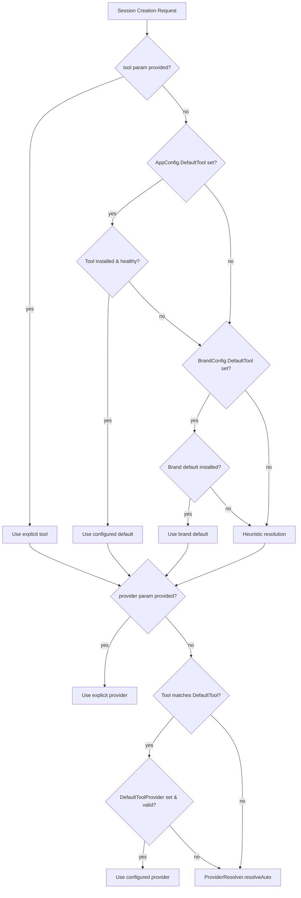

# Design Document: Default Coding Tool Setting

## Overview

This feature adds user-configurable default coding tool and provider preferences to the MaClaw/TigerClaw application. Currently, when the LLM agent creates a coding session without specifying a tool, `SessionContextResolver.ResolveTool()` picks a tool via project-file heuristics (go.mod → opencode, package.json → claude, etc.) and falls back to "claude". Users have no control over this choice.

The design introduces a three-tier resolution strategy:

1. **User config** — `AppConfig.DefaultTool` / `AppConfig.DefaultToolProvider`
2. **Brand defaults** — `BrandConfig.DefaultTool` / `BrandConfig.DefaultToolProvider`
3. **Heuristics** — existing project-file-based detection (unchanged)

Each tier is consulted only when the previous tier yields no usable result. Explicit parameters in session creation requests always take top priority, bypassing all defaults.

The frontend adds two dropdowns in Settings → Coding Tools (编程工具) for selecting the default tool and provider, with cascading behavior (changing the tool resets the provider).

## Architecture



### Key Design Decisions

1. **Config-level storage, not a separate settings file.** The default tool/provider fields live in `AppConfig` alongside existing tool configs. This keeps the persistence model simple — one JSON file, one load/save path.

2. **BrandConfig fields instead of hardcoded fallbacks.** Brand-specific defaults are declared in `BrandConfig` rather than hardcoded in `ResolveTool()`. This makes adding new brands or changing defaults a data change, not a logic change.

3. **ResolveTool owns the full resolution chain.** Rather than splitting resolution across multiple callers, `ResolveTool()` is the single entry point that checks user config → brand defaults → heuristics. Callers (like `toolCreateSession`) don't need to know about the resolution tiers.

4. **Provider default is scoped to the default tool.** `DefaultToolProvider` only applies when the resolved tool matches `DefaultTool`. If the user explicitly picks a different tool or heuristics select one, the provider falls back to the tool's own `CurrentModel`. This prevents confusing cross-tool provider mismatches.

5. **Wails binding for tool+provider listing.** The frontend needs to know which tools are available and what providers each tool has. The existing `ListRemoteToolMetadata()` binding provides tool metadata. A new `ListToolProviders(toolName)` binding returns the provider list for a specific tool, avoiding the need to expose full `ToolConfig` objects to the frontend.

## Components and Interfaces

### 1. AppConfig (corelib/app_config.go)

**New fields:**

```go
type AppConfig struct {
    // ... existing fields ...
    
    // Default coding tool preference (empty = no preference, defer to brand)
    DefaultTool         string `json:"default_tool"`
    // Default provider for the default tool (empty = no preference, defer to tool's CurrentModel)
    DefaultToolProvider string `json:"default_tool_provider"`
}
```

No custom marshal/unmarshal logic needed — Go's `encoding/json` defaults missing string fields to `""`, satisfying requirement 1.6.

### 2. BrandConfig (corelib/brand/brand.go)

**New fields:**

```go
type BrandConfig struct {
    // ... existing fields ...
    
    DefaultTool         string // Brand-specific default tool (e.g., "claude")
    DefaultToolProvider string // Brand-specific default provider (e.g., "" for MaClaw, "codegen" for TigerClaw)
}
```

**Brand init updates:**

- `brand_maclaw.go`: `DefaultTool: "claude"`, `DefaultToolProvider: ""`
- `brand_qianxin.go`: `DefaultTool: "claude"`, `DefaultToolProvider: "codegen"`

### 3. SessionContextResolver.ResolveTool (gui/session_context_resolver.go)

**Modified signature** (unchanged externally, new internal logic):

```go
func (r *SessionContextResolver) ResolveTool(projectPath, taskDescription string) (toolName string, reason string)
```

**New resolution order:**

```
1. Load AppConfig
2. Read cfg.DefaultTool, trim + lowercase
3. If non-empty AND tool exists in catalog AND tool is installed+healthy:
     → return (defaultTool, "用户配置的默认工具")
   If non-empty AND tool not in catalog or not installed:
     → log warning, fall through
4. Read brand.Current().DefaultTool
5. If non-empty AND tool is installed+healthy:
     → return (brandDefault, "品牌默认工具")
   If non-empty AND not installed:
     → fall through
6. Existing heuristic logic (project file detection + fallback order)
```

### 4. toolCreateSession (gui/im_tools_session.go)

**Changes:**

After `ResolveTool` returns the tool name, and before calling `ProviderResolver.Resolve()`, inject the default provider preference:

```go
// If no explicit provider was given, and the resolved tool matches the
// user's default tool, use the configured default provider as the
// providerOverride for ProviderResolver.
if provider == "" && cfg.DefaultTool != "" {
    resolvedNorm := strings.ToLower(strings.TrimSpace(tool))
    defaultNorm := strings.ToLower(strings.TrimSpace(cfg.DefaultTool))
    if resolvedNorm == defaultNorm && strings.TrimSpace(cfg.DefaultToolProvider) != "" {
        provider = cfg.DefaultToolProvider
    }
}
```

The same logic applies in `CodingSessionStarter.Start()` (gui/session_orchestrator.go).

### 5. ProviderResolver (gui/provider_resolver.go)

**No structural changes needed.** The default provider preference is passed as `providerOverride` to `Resolve()`. The existing three modes handle it:

- Mode 1 (explicit override): `providerOverride` is the default provider → `resolveExplicit()` validates it exists and has a valid API key
- If the default provider is invalid/missing, `resolveExplicit()` returns an error → caller falls back to `resolveAuto()` with empty override

To support graceful fallback (requirement 4.3), the caller wraps the call:

```go
result, err := resolver.Resolve(toolCfg, provider)
if err != nil && isDefaultProviderOverride {
    // Default provider invalid, retry without override
    result, err = resolver.Resolve(toolCfg, "")
}
```

### 6. Frontend Settings UI (gui/frontend/src/App.tsx)

**New UI elements in the "编程工具" (Coding Tools / display) settings tab:**

Two dropdowns placed above the existing "Tool Visibility" section:

#### Default Tool Dropdown
- Label: "默认编程工具" / "Default Coding Tool"
- Options: "Auto (品牌默认)" + all tools from `ListRemoteToolMetadata()` where `installed == true`
- Not-installed tools shown with "(未安装)" suffix, disabled
- Selection saves to `config.default_tool`

#### Default Provider Dropdown
- Label: "默认服务商" / "Default Provider"  
- Visible only when a specific tool is selected (not "Auto")
- Options: "Auto (自动选择)" + providers from `ListToolProviders(selectedTool)`
- Selection saves to `config.default_tool_provider`
- Resets to "Auto" when tool selection changes

### 7. New Wails Binding: ListToolProviders

```go
// ListToolProviders returns the provider list for a given tool, suitable for
// populating the default provider dropdown in settings.
func (a *App) ListToolProviders(toolName string) []ToolProviderView {
    cfg, err := a.LoadConfig()
    if err != nil {
        return nil
    }
    toolCfg, err := remoteToolConfig(cfg, toolName)
    if err != nil {
        return nil
    }
    var out []ToolProviderView
    for _, m := range toolCfg.Models {
        out = append(out, ToolProviderView{
            Name:    m.ModelName,
            Valid:   isValidProvider(m),
            Builtin: m.IsBuiltin,
        })
    }
    return out
}

type ToolProviderView struct {
    Name    string `json:"name"`
    Valid   bool   `json:"valid"`
    Builtin bool   `json:"builtin"`
}
```

## Data Models

### AppConfig JSON Schema (new fields only)

```json
{
  "default_tool": "claude",
  "default_tool_provider": "Anthropic"
}
```

| Field | Type | Default | Description |
|-------|------|---------|-------------|
| `default_tool` | string | `""` | User's preferred default coding tool name. Empty = no preference. |
| `default_tool_provider` | string | `""` | User's preferred default provider for the default tool. Empty = no preference. |

### BrandConfig (compile-time, not serialized)

| Brand | DefaultTool | DefaultToolProvider |
|-------|-------------|---------------------|
| MaClaw | `"claude"` | `""` (first available) |
| TigerClaw | `"claude"` | `"codegen"` |

### ToolProviderView (Wails binding response)

```json
{
  "name": "Anthropic",
  "valid": true,
  "builtin": false
}
```

### Resolution Priority Matrix

| tool param | provider param | DefaultTool | DefaultToolProvider | Resolved Tool | Resolved Provider |
|-----------|---------------|-------------|--------------------|--------------|--------------------|
| "gemini" | "Google" | "claude" | "Anthropic" | gemini | Google |
| "" | "" | "claude" | "Anthropic" | claude* | Anthropic* |
| "" | "" | "claude" | "" | claude* | CurrentModel/first |
| "" | "" | "" | "" | brand default* | brand provider/auto |
| "" | "Google" | "claude" | "Anthropic" | claude* | Google |
| "" | "" | "badtool" | "Anthropic" | brand default* | brand provider/auto |

\* Assuming the tool is installed and healthy. Falls back to next tier if not.

## Correctness Properties

*A property is a characteristic or behavior that should hold true across all valid executions of a system — essentially, a formal statement about what the system should do. Properties serve as the bridge between human-readable specifications and machine-verifiable correctness guarantees.*

### Property 1: AppConfig default tool fields round-trip through JSON

*For any* AppConfig with arbitrary `default_tool` and `default_tool_provider` string values, serializing to JSON and deserializing back SHALL produce an AppConfig with identical `default_tool` and `default_tool_provider` values. Additionally, deserializing a JSON object that lacks these keys SHALL produce empty strings for both fields.

**Validates: Requirements 1.1, 1.2, 1.5, 1.6**

### Property 2: Configured default tool is preferred when available

*For any* valid tool name that exists in the tool catalog and is installed and healthy, when that name is set as `AppConfig.DefaultTool` and the `tool` parameter in the session creation request is empty, `ResolveTool()` SHALL return that tool name.

**Validates: Requirements 3.1, 3.2**

### Property 3: Unavailable default tool falls back gracefully

*For any* tool name set as `AppConfig.DefaultTool` that is either not in the tool catalog or not installed, `ResolveTool()` SHALL NOT return that tool name. It SHALL instead return a tool from the brand-default or heuristic tiers.

**Validates: Requirements 3.3, 7.1**

### Property 4: Explicit tool parameter overrides all defaults

*For any* non-empty `tool` parameter in a session creation request, and *for any* `AppConfig.DefaultTool` value, the resolved tool SHALL equal the explicit `tool` parameter, ignoring the default setting entirely.

**Validates: Requirements 3.5**

### Property 5: Default provider is used when tool matches and provider is valid

*For any* valid provider name that exists in the tool's model list and has a valid API key, when that name is set as `AppConfig.DefaultToolProvider` and the resolved tool matches `AppConfig.DefaultTool` and the `provider` parameter is empty, the resolved provider SHALL be the configured default provider.

**Validates: Requirements 4.1, 4.2**

### Property 6: Invalid default provider falls back to auto-resolution

*For any* `AppConfig.DefaultToolProvider` value that does not exist in the tool's model list or lacks a valid API key, the provider resolution SHALL fall back to the tool's `CurrentModel` or first available provider, without returning an error.

**Validates: Requirements 4.3, 7.3**

### Property 7: Explicit provider parameter overrides default provider

*For any* non-empty `provider` parameter in a session creation request, and *for any* `AppConfig.DefaultToolProvider` value, the resolved provider SHALL equal the explicit `provider` parameter, ignoring the default provider setting.

**Validates: Requirements 4.4**

### Property 8: Default provider is ignored when tool does not match

*For any* resolved tool that differs from `AppConfig.DefaultTool`, the `AppConfig.DefaultToolProvider` value SHALL be ignored, and provider resolution SHALL use the tool's own `CurrentModel` or fallback chain.

**Validates: Requirements 4.5**

## Error Handling

| Scenario | Behavior |
|----------|----------|
| `DefaultTool` refers to unknown tool name | Log warning, fall through to brand defaults → heuristics |
| `DefaultTool` refers to uninstalled tool | Log warning, fall through to brand defaults → heuristics |
| `DefaultToolProvider` refers to unknown provider | Log warning, retry `ProviderResolver.Resolve()` with empty override |
| `DefaultToolProvider` refers to provider without API key | Log warning, retry with empty override (triggers `resolveAuto` fallback) |
| `DefaultTool` has whitespace/mixed case | Trim and lowercase before lookup (via existing `normalizeRemoteToolName`) |
| Config file missing new fields | Go JSON unmarshal defaults to `""` — no special handling needed |
| `ListToolProviders` called with invalid tool name | Returns empty slice, frontend shows only "Auto" option |
| Brand has no `DefaultTool` set | Falls through to heuristic resolution (existing behavior preserved) |

## Testing Strategy

### Property-Based Tests (Go, using `testing/quick` or `rapid`)

Each correctness property maps to a property-based test with minimum 100 iterations:

- **Property 1**: Generate random `AppConfig` instances with random `DefaultTool`/`DefaultToolProvider` strings, verify JSON round-trip preserves values. Also test deserialization of JSON without these keys.
  - Tag: `Feature: default-coding-tool, Property 1: AppConfig default tool fields round-trip through JSON`

- **Property 2**: Generate random tool names from the catalog, mock `ToolManager.GetToolStatus` to return installed+healthy, verify `ResolveTool` returns the configured default.
  - Tag: `Feature: default-coding-tool, Property 2: Configured default tool is preferred when available`

- **Property 3**: Generate random strings (including catalog names), mock tool status as not-installed, verify `ResolveTool` never returns the configured default.
  - Tag: `Feature: default-coding-tool, Property 3: Unavailable default tool falls back gracefully`

- **Property 4**: Generate random (explicitTool, defaultTool) pairs, verify the explicit tool always wins.
  - Tag: `Feature: default-coding-tool, Property 4: Explicit tool parameter overrides all defaults`

- **Property 5**: Generate random valid provider names from a ToolConfig's model list, verify provider resolution returns the configured default.
  - Tag: `Feature: default-coding-tool, Property 5: Default provider is used when tool matches and provider is valid`

- **Property 6**: Generate random provider names NOT in the model list, verify fallback to CurrentModel or first available.
  - Tag: `Feature: default-coding-tool, Property 6: Invalid default provider falls back to auto-resolution`

- **Property 7**: Generate random (explicitProvider, defaultProvider) pairs, verify explicit always wins.
  - Tag: `Feature: default-coding-tool, Property 7: Explicit provider parameter overrides default provider`

- **Property 8**: Generate random (resolvedTool, defaultTool) pairs where they differ, verify DefaultToolProvider is not used.
  - Tag: `Feature: default-coding-tool, Property 8: Default provider is ignored when tool does not match`

### Unit Tests (Example-Based)

- **Brand defaults**: MaClaw → "claude"/""  ; TigerClaw → "claude"/"codegen"
- **Extra tool resolution**: TigerClaw with `DefaultTool: "tigerclaw"` resolves through `ExtraToolConfigs`
- **Whitespace/case normalization**: `"  Claude  "` → `"claude"`
- **Hidden tool still usable**: Tool with `ShowXxx: false` but installed → still returned as default
- **Provider cascade reset**: Changing `DefaultTool` in UI clears `DefaultToolProvider`
- **ListToolProviders**: Returns correct provider list for each tool, empty for unknown tools

### Integration Tests

- **End-to-end config persistence**: Set defaults via UI → restart app → verify defaults loaded
- **Session creation with defaults**: Configure default → create session without tool param → verify correct tool/provider used
- **Fallback chain**: Configure unavailable default → verify graceful fallback to brand default → heuristics

### Frontend Tests

- **Dropdown population**: Verify tool dropdown contains all installed tools + "Auto"
- **Cascading behavior**: Changing tool resets provider dropdown
- **Disabled state**: Uninstalled tools shown but not selectable
- **Provider visibility**: Provider dropdown hidden when "Auto" is selected for tool
