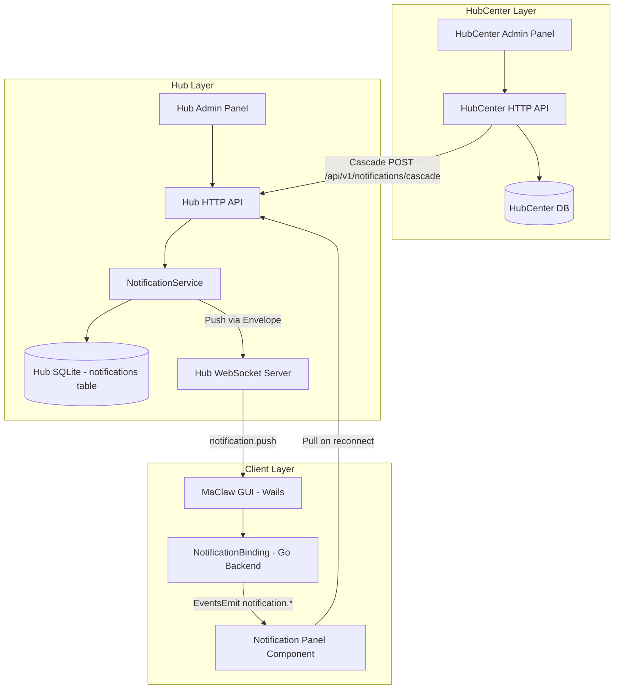
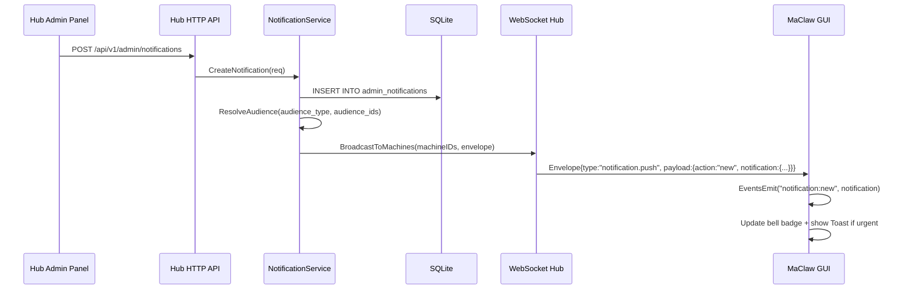
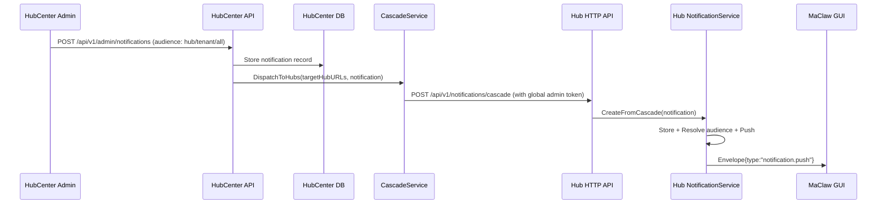
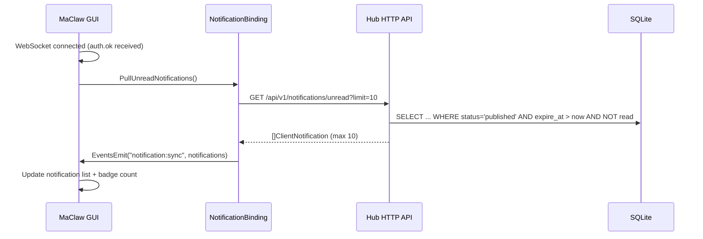
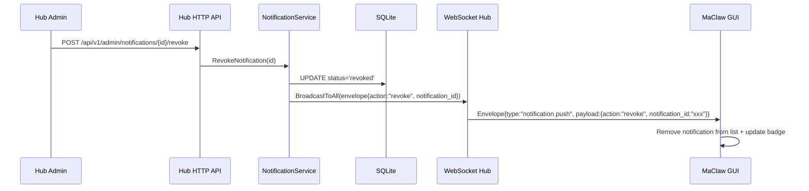

# Dynamic Notification System — Technical Design

## Overview

本设计描述 MaClaw 动态通知系统的技术实现方案。系统允许 Hub 管理员和 HubCenter 管理员向终端用户推送通知，通知通过 Hub WebSocket 实时到达客户端，在 AI 助手面板以铃铛图标 + 下拉面板的形式展示。

**核心数据流**：
- Hub 本地通知：Admin Panel → Hub HTTP API → Hub DB → Hub WebSocket → GUI Client
- HubCenter 跨 Hub 通知：HubCenter Admin → HubCenter API → HubCenter→Hub Cascade API → Hub DB → Hub WebSocket → GUI Client

**设计原则**：
- 复用现有 WebSocket Envelope 格式，新增 notification 专用 type
- 复用现有 admin 中间件（requireAdmin/requireGlobalAdmin）
- 客户端不区分通知来源（Hub/HubCenter），统一展示
- 推送 + 拉取双保障（在线推送，离线重连时拉取）

## Architecture



## Components and Interfaces

### 1. Hub 后端 — `hub/internal/notification/`（新包）

| 组件 | 职责 |
|------|------|
| `store.go` | SQLite CRUD — 通知的创建、查询、更新、删除 |
| `service.go` | 业务逻辑 — 发布调度、受众解析、过期检查、撤回 |
| `pusher.go` | WebSocket 推送 — 通过 ws.Hub 广播 Envelope 到目标客户端 |
| `types.go` | 数据类型定义 — Notification, Category, Priority, AudienceScope |

### 2. Hub HTTP API — `hub/internal/httpapi/notification_handler.go`（新文件）

| 端点 | 方法 | 描述 | 中间件 |
|------|------|------|--------|
| `/api/v1/admin/notifications` | POST | 创建通知 | requireAdmin |
| `/api/v1/admin/notifications` | GET | 管理员列表（含统计） | requireAdmin |
| `/api/v1/admin/notifications/{id}` | GET | 通知详情+送达统计 | requireAdmin |
| `/api/v1/admin/notifications/{id}/revoke` | POST | 撤回通知 | requireAdmin |
| `/api/v1/notifications/cascade` | POST | HubCenter 级联推送入口 | requireGlobalAdmin |
| `/api/v1/notifications/unread` | GET | 客户端拉取未读通知 | machine auth |
| `/api/v1/notifications/{id}/read` | POST | 客户端标记已读 | machine auth |
| `/api/v1/notifications/read-all` | POST | 客户端全部已读 | machine auth |

### 3. Hub WebSocket 新增消息类型

复用现有 `Envelope{type, request_id, ts, machine_id, payload}` 格式：

| Type | 方向 | Payload | 描述 |
|------|------|---------|------|
| `notification.push` | Server → Client | `NotificationPushPayload` | 推送新通知/撤回通知 |
| `notification.ack` | Client → Server | `{notification_id, action: "read"}` | 客户端确认已读 |

```go
// NotificationPushPayload — notification.push 的 payload 结构
type NotificationPushPayload struct {
    Action       string         `json:"action"` // "new" | "revoke"
    Notification *Notification  `json:"notification,omitempty"` // action=new 时携带
    NotifID      string         `json:"notification_id,omitempty"` // action=revoke 时携带
}
```

### 4. HubCenter 后端 — `hubcenter/internal/notification/`（新包）

| 组件 | 职责 |
|------|------|
| `store.go` | 存储 HubCenter 级通知记录 |
| `service.go` | 受众解析（Hub 级/租户级/全网广播）、级联调度 |
| `cascade.go` | HTTP POST 到目标 Hub 的 `/api/v1/notifications/cascade` |

### 5. GUI 客户端 — Go 后端绑定

| 文件 | 职责 |
|------|------|
| `gui/notification_binding.go`（新） | Wails binding — 拉取/标记已读/获取未读数 |
| `gui/remote_hub_notification.go`（新） | WebSocket 消息处理 — 收到 `notification.push` 后 EventsEmit |

新增 `hubInboundMessageType`：
```go
hubInboundMessageNotificationPush hubInboundMessageType = "notification.push"
```

### 6. GUI 客户端 — React 前端

| 组件 | 职责 |
|------|------|
| `NotificationBell.tsx`（新） | 铃铛图标 + 未读计数 badge + 闪烁动画 |
| `NotificationPanel.tsx`（新） | 下拉通知列表面板 — 分类筛选/标记已读/展开详情 |
| `NotificationItem.tsx`（新） | 单条通知卡片 — 标题/时间/分类/优先级标识 |
| `NotificationDetail.tsx`（新） | 通知详情 — Markdown 渲染完整内容 |
| `NotificationToast.tsx`（新） | urgent 通知 Toast/Banner 提醒 |
| `useNotifications.ts`（新） | 状态管理 Hook — 未读列表/计数/事件监听 |

### 7. Admin Panel（Hub + HubCenter）

Hub admin（`hub/web/admin/notification-tab.js`，新文件）：
- 通知列表（卡片式，含状态标签 published/expired/revoked）
- 创建通知表单（Markdown 编辑器 + 受众选择器 + 定时发布）
- 通知详情（送达/已读统计）
- 撤回操作

HubCenter admin（`hubcenter/web/admin/` 中扩展或新增模块）：
- 同 Hub admin 但受众范围为 Hub 级/租户级/全网
- 级联推送状态监控（各 Hub 送达情况）

## Data Models

### Hub 端 SQLite 表 — `admin_notifications`

```sql
CREATE TABLE IF NOT EXISTS admin_notifications (
    id              TEXT PRIMARY KEY,
    title           TEXT NOT NULL,
    content         TEXT NOT NULL,              -- Markdown 格式
    category        TEXT NOT NULL DEFAULT 'system_announcement',
    priority        TEXT NOT NULL DEFAULT 'normal',  -- normal/important/urgent
    audience_type   TEXT NOT NULL,              -- all/tenant/department/user
    audience_ids    TEXT NOT NULL DEFAULT '[]', -- JSON array of target IDs
    status          TEXT NOT NULL DEFAULT 'draft', -- draft/published/expired/revoked
    im_push         INTEGER NOT NULL DEFAULT 0, -- 是否推送到 IM 通道
    source          TEXT NOT NULL DEFAULT 'hub', -- hub/hubcenter
    source_id       TEXT NOT NULL DEFAULT '',    -- HubCenter 原始通知 ID（级联用）
    created_by      TEXT NOT NULL DEFAULT '',    -- 管理员标识
    publish_at      TEXT,                        -- 定时发布时间（ISO8601）
    expire_at       TEXT,                        -- 过期时间
    created_at      TEXT NOT NULL,
    updated_at      TEXT NOT NULL
);

CREATE INDEX idx_admin_notif_status ON admin_notifications(status, publish_at);
CREATE INDEX idx_admin_notif_source ON admin_notifications(source, source_id);
```

### Hub 端 SQLite 表 — `admin_notification_reads`

```sql
CREATE TABLE IF NOT EXISTS admin_notification_reads (
    notification_id TEXT NOT NULL,
    machine_id      TEXT NOT NULL,
    read_at         TEXT NOT NULL,
    PRIMARY KEY (notification_id, machine_id)
);

CREATE INDEX idx_admin_notif_reads_machine ON admin_notification_reads(machine_id);
```

### Go 类型定义 — `hub/internal/notification/types.go`

```go
package notification

import "time"

type Category string
const (
    CategorySystemAnnouncement Category = "system_announcement"
    CategoryFeatureUpdate      Category = "feature_update"
    CategorySecurityAlert      Category = "security_alert"
    CategoryMaintenance        Category = "maintenance"
    CategoryCustom             Category = "custom"
)

type Priority string
const (
    PriorityNormal    Priority = "normal"
    PriorityImportant Priority = "important"
    PriorityUrgent    Priority = "urgent"
)

type AudienceType string
const (
    AudienceAll        AudienceType = "all"
    AudienceTenant     AudienceType = "tenant"
    AudienceDepartment AudienceType = "department"
    AudienceUser       AudienceType = "user"
)

type Status string
const (
    StatusDraft     Status = "draft"
    StatusPublished Status = "published"
    StatusExpired   Status = "expired"
    StatusRevoked   Status = "revoked"
)

type Notification struct {
    ID           string       `json:"id"`
    Title        string       `json:"title"`
    Content      string       `json:"content"`
    Category     Category     `json:"category"`
    Priority     Priority     `json:"priority"`
    AudienceType AudienceType `json:"audience_type"`
    AudienceIDs  []string     `json:"audience_ids"`
    Status       Status       `json:"status"`
    IMPush       bool         `json:"im_push"`
    Source       string       `json:"source"`       // "hub" | "hubcenter"
    SourceID     string       `json:"source_id"`
    CreatedBy    string       `json:"created_by"`
    PublishAt    *time.Time   `json:"publish_at,omitempty"`
    ExpireAt     *time.Time   `json:"expire_at,omitempty"`
    CreatedAt    time.Time    `json:"created_at"`
    UpdatedAt    time.Time    `json:"updated_at"`
}
```

### 客户端通知模型（前端 + Go binding）

```typescript
// gui/frontend/src/types/notification.ts
interface AdminNotification {
  id: string;
  title: string;
  content: string;       // Markdown
  category: 'system_announcement' | 'feature_update' | 'security_alert' | 'maintenance' | 'custom';
  priority: 'normal' | 'important' | 'urgent';
  is_read: boolean;
  created_at: string;    // ISO8601
}
```

```go
// gui/notification_binding.go — 客户端拉取的通知视图
type ClientNotification struct {
    ID        string `json:"id"`
    Title     string `json:"title"`
    Content   string `json:"content"`
    Category  string `json:"category"`
    Priority  string `json:"priority"`
    IsRead    bool   `json:"is_read"`
    CreatedAt string `json:"created_at"`
}
```

## Sequence Diagrams

### Flow 1: Hub Admin 创建通知 → 实时推送到在线客户端



### Flow 2: HubCenter 级联推送



### Flow 3: 客户端重连 → 拉取未读通知



### Flow 4: 管理员撤回通知



## Detailed Component Design

### Hub NotificationService 核心逻辑

```go
// hub/internal/notification/service.go

type Service struct {
    store  *Store
    wsHub  WSBroadcaster // interface to ws.Hub for pushing envelopes
    imPush IMPusher      // interface for IM channel push (feishu/wechat/qq)
}

// WSBroadcaster — 与 ws.Hub 的接口解耦
type WSBroadcaster interface {
    BroadcastToMachines(machineIDs []string, envelope []byte) error
    BroadcastToAll(envelope []byte) error
}

// CreateNotification — 管理员创建通知
func (s *Service) CreateNotification(ctx context.Context, req CreateRequest) (*Notification, error)

// PublishNotification — 发布通知（立即推送或定时调度）
func (s *Service) PublishNotification(ctx context.Context, id string) error

// RevokeNotification — 撤回通知
func (s *Service) RevokeNotification(ctx context.Context, id string) error

// GetUnreadForMachine — 客户端拉取未读（最多 10 条）
func (s *Service) GetUnreadForMachine(ctx context.Context, machineID string, limit int) ([]ClientNotification, error)

// MarkRead — 标记单条已读
func (s *Service) MarkRead(ctx context.Context, machineID, notificationID string) error

// MarkAllRead — 全部已读
func (s *Service) MarkAllRead(ctx context.Context, machineID string) error

// CreateFromCascade — HubCenter 级联入口
func (s *Service) CreateFromCascade(ctx context.Context, req CascadeRequest) error

// CheckExpired — 定期检查过期通知（由 ticker goroutine 调用）
func (s *Service) CheckExpired(ctx context.Context) error
```

### 受众解析逻辑

```go
// ResolveAudienceMachines — 根据 audience_type + audience_ids 解析目标 machine_id 列表
func (s *Service) ResolveAudienceMachines(ctx context.Context, n *Notification) ([]string, error) {
    switch n.AudienceType {
    case AudienceAll:
        return s.store.AllActiveMachineIDs(ctx)
    case AudienceTenant:
        return s.store.MachineIDsByTenantIDs(ctx, n.AudienceIDs)
    case AudienceDepartment:
        return s.store.MachineIDsByDepartmentIDs(ctx, n.AudienceIDs)
    case AudienceUser:
        return s.store.MachineIDsByUserIDs(ctx, n.AudienceIDs)
    }
    return nil, fmt.Errorf("unknown audience type: %s", n.AudienceType)
}
```

### GUI Go 后端 — WebSocket 消息处理

```go
// gui/remote_hub_notification.go

// handleNotificationPush — 处理 Hub 推送的 notification.push envelope
func (app *App) handleNotificationPush(payload json.RawMessage) {
    var push NotificationPushPayload
    if err := json.Unmarshal(payload, &push); err != nil {
        return
    }
    switch push.Action {
    case "new":
        // 添加到本地未读列表（内存缓存，最多 10 条）
        app.notificationCache.Add(push.Notification)
        // 通知前端
        runtime.EventsEmit(app.ctx, "notification:new", push.Notification)
        // urgent 通知额外发 toast 事件
        if push.Notification.Priority == "urgent" {
            runtime.EventsEmit(app.ctx, "notification:urgent-toast", push.Notification)
        }
    case "revoke":
        app.notificationCache.Remove(push.NotifID)
        runtime.EventsEmit(app.ctx, "notification:revoke", push.NotifID)
    }
}
```

在 `gui/remote_hub_message_type.go` 中新增：
```go
hubInboundMessageNotificationPush hubInboundMessageType = "notification.push"
```

在 `normalizeHubInboundMessageType` switch 中新增 case。

### GUI Go 后端 — Wails Bindings

```go
// gui/notification_binding.go

// GetUnreadNotifications — 前端调用，返回缓存的未读通知列表
func (app *App) GetUnreadNotifications() []ClientNotification

// GetUnreadCount — 前端调用，返回未读计数
func (app *App) GetUnreadCount() int

// MarkNotificationRead — 前端调用，标记单条已读
func (app *App) MarkNotificationRead(notificationID string) error

// MarkAllNotificationsRead — 前端调用，全部已读
func (app *App) MarkAllNotificationsRead() error

// PullUnreadNotifications — WebSocket 重连后从 Hub 拉取未读
func (app *App) PullUnreadNotifications() error
```

### 前端通知状态管理 — `useNotifications.ts`

```typescript
// gui/frontend/src/components/ai/useNotifications.ts

interface NotificationState {
  notifications: AdminNotification[];
  unreadCount: number;
  panelOpen: boolean;
  categoryFilter: string | null;
}

export function useNotifications() {
  const [state, setState] = useState<NotificationState>({...});

  useEffect(() => {
    // 监听后端事件
    EventsOn("notification:new", handleNew);
    EventsOn("notification:revoke", handleRevoke);
    EventsOn("notification:sync", handleSync);
    EventsOn("notification:urgent-toast", handleUrgentToast);

    // 初始加载
    loadUnread();

    return () => { /* cleanup listeners */ };
  }, []);

  // unreadCount 上限显示 10
  const displayCount = Math.min(state.unreadCount, 10);
  const shouldAnimate = state.unreadCount > 0;

  return { ...state, displayCount, shouldAnimate, ... };
}
```

### 前端铃铛组件 — `NotificationBell.tsx`

位置：`AssistantTitleBar.tsx` 中，标题栏右侧区域。

```tsx
// 铃铛图标 + 未读 badge + 闪烁动画
function NotificationBell({ unreadCount, onClick }) {
  const shouldAnimate = unreadCount > 0;
  const displayCount = Math.min(unreadCount, 10);

  return (
    <button onClick={onClick} className="notification-bell">
      <BellIcon className={shouldAnimate ? 'bell-animate' : ''} />
      {unreadCount > 0 && (
        <span className="badge">{displayCount}{unreadCount > 10 ? '+' : ''}</span>
      )}
    </button>
  );
}
```

### HubCenter 级联服务

```go
// hubcenter/internal/notification/cascade.go

type CascadeService struct {
    httpClient *http.Client
    store      *Store
}

// DispatchToHubs — 向目标 Hub 实例推送通知
func (c *CascadeService) DispatchToHubs(ctx context.Context, notif *Notification, targetHubs []HubEndpoint) error {
    var wg sync.WaitGroup
    for _, hub := range targetHubs {
        wg.Add(1)
        go func(h HubEndpoint) {
            defer wg.Done()
            err := c.pushToHub(ctx, h, notif)
            c.store.RecordCascadeResult(ctx, notif.ID, h.ID, err)
        }(hub)
    }
    wg.Wait()
    return nil
}

func (c *CascadeService) pushToHub(ctx context.Context, hub HubEndpoint, notif *Notification) error {
    body, _ := json.Marshal(CascadeRequest{Notification: notif})
    req, _ := http.NewRequestWithContext(ctx, "POST", hub.URL+"/api/v1/notifications/cascade", bytes.NewReader(body))
    req.Header.Set("Authorization", "Bearer "+hub.GlobalAdminToken)
    req.Header.Set("Content-Type", "application/json")
    resp, err := c.httpClient.Do(req)
    // ... error handling + retry
    return err
}
```

### Hub Admin Panel — `notification-tab.js`

UI 结构（复用现有 admin 面板卡片式 + tab 导航风格）：

1. **通知列表视图**（默认）
   - 卡片列表，每张卡片显示：标题、分类标签（彩色 pill）、状态标签、创建时间、送达率
   - 筛选栏：状态（全部/已发布/已过期/已撤回/草稿）、分类
   - 操作按钮：创建新通知、批量操作

2. **创建通知表单**
   - 标题输入（maxlength=100）
   - Markdown 编辑器（内容，maxlength=2000，带预览）
   - 分类选择（下拉：系统公告/功能更新/安全告警/运维通知/自定义）
   - 受众选择器：
     - 所有用户（默认）
     - 指定租户（多选下拉，异步加载租户列表）
     - 指定部门（树形选择器，加载组织架构）
     - 指定用户（搜索框，支持 email/ID 搜索）
   - 优先级：normal/important/urgent（radio）
   - IM 推送开关（仅 urgent 时可见）
   - 生效时间：立即 / 定时（日期时间选择器）
   - 过期时间（可选日期时间选择器）
   - 操作：保存草稿 / 立即发布

3. **通知详情 + 统计**
   - 通知内容预览（Markdown 渲染）
   - 送达统计：总推送数、已读数、已读率（饼图）
   - 操作：撤回（仅 published 且未过期时可用）

### HubCenter Admin Panel

复用 Hub admin 的 UI 结构，差异在受众选择器：
- 整个 Hub（多选已注册的 Hub 实例列表）
- 指定 Hub 下的租户
- 全网广播（所有 Hub 的所有用户）

额外展示：级联推送状态表格（Hub 名称、推送时间、状态 success/failed/pending）

## Correctness Properties

*A property is a characteristic or behavior that should hold true across all valid executions of a system — essentially, a formal statement about what the system should do. Properties serve as the bridge between human-readable specifications and machine-verifiable correctness guarantees.*

### Property 1: Badge count display invariant

*For any* unread notification count N (where N ≥ 0), the displayed badge number SHALL equal min(N, 10), and the bell animation SHALL be active if and only if N > 0.

**Validates: Requirements FR-4 (客户端最多保留 10 条未读通知 + 铃铛闪烁)**

### Property 2: Client-server unread synchronization on reconnect

*For any* set of published, non-expired, non-revoked notifications that target a given machine and have not been marked as read by that machine, after a client reconnect and pull operation, the client's local unread notification set SHALL be a subset of (and equal to, up to the 10-most-recent limit) the server's unread set for that machine.

**Validates: Requirements FR-3, FR-4, Acceptance Criteria 1.6**

### Property 3: Revoked notification invisibility

*For any* notification that has been revoked (status = "revoked"), that notification SHALL NOT appear in any client's unread list nor be delivered via WebSocket push, regardless of when the client queries or connects.

**Validates: Requirements FR-5, FR-6, Acceptance Criteria 1.8**

### Property 4: Notification input validation completeness

*For any* CreateNotification request, if the title exceeds 100 characters OR content exceeds 2000 characters OR category is not in the allowed set OR audience_type is not in the allowed set OR required fields are empty, the system SHALL reject the request with a validation error and NOT persist the notification.

**Validates: Requirements FR-1 (field constraints)**

### Property 5: Notification lifecycle state machine validity

*For any* notification, the status transitions SHALL only follow the valid state machine: draft → published → {expired, revoked}. No other transitions are permitted (e.g., revoked → published, expired → draft are invalid).

**Validates: Requirements FR-6 (通知生命周期)**

## Error Handling

### Hub 后端

| 场景 | 处理策略 |
|------|---------|
| WebSocket 推送失败（客户端已断开） | 忽略，客户端重连时通过 Pull 补齐 |
| 受众解析无匹配 machine | 通知仍创建成功，推送数为 0，管理员可在统计中看到 |
| HubCenter 级联推送 Hub 不可达 | 记录失败状态，Hub 重启后可通过定时任务从 HubCenter 重新拉取（NFR-3） |
| 定时发布时间已过 | 立即发布（不跳过） |
| 客户端拉取时通知已过期 | 不返回（过滤 expire_at <= now） |
| SQLite 写入失败 | 返回 500，管理员面板显示错误提示 |
| Markdown 内容含 XSS | 前端渲染时使用 sanitize（DOMPurify 或等效库），禁止 script/iframe/on* 属性 |

### 客户端

| 场景 | 处理策略 |
|------|---------|
| Pull API 返回错误 | 静默重试（最多 3 次，指数退避），不阻塞 UI |
| Mark-read API 失败 | 本地先标记已读（乐观更新），失败时回滚 + Toast 提示 |
| 通知内容 Markdown 渲染失败 | 降级为纯文本显示 |
| 未读超过 10 条 | 只保留最新 10 条，旧的不显示（服务端返回时已按时间排序 + limit） |
| WebSocket 断开期间收到的通知 | 重连时通过 Pull 补齐，不丢失 |

### HubCenter 级联

| 场景 | 处理策略 |
|------|---------|
| 目标 Hub 返回 401/403 | 记录为 auth_failed，不重试（需管理员检查 token 配置） |
| 目标 Hub 返回 5xx | 记录为 server_error，支持手动重试 |
| 目标 Hub 超时 | 30 秒超时，记录为 timeout，支持重试 |
| 目标 Hub 已有相同 source_id 的通知 | 幂等处理——更新而非重复创建（基于 source + source_id 唯一索引） |

## Testing Strategy

### 单元测试

- **NotificationStore**：CRUD 操作、过期过滤、已读标记、audience 查询
- **NotificationService**：受众解析、状态转换、定时发布逻辑
- **NotificationPusher**：Envelope 构建、广播目标计算
- **前端 useNotifications**：状态管理、事件处理、badge 计算
- **输入验证**：边界值（title 100 chars、content 2000 chars、空值）

### Property-Based Tests

使用 Go 的 `rapid` 库（已在项目中使用）：

- **Property 1**：生成随机 unread count (0-1000)，验证 badge = min(N, 10) && animate = (N > 0)
- **Property 2**：生成随机通知集合（不同状态/过期/撤回），模拟 pull，验证返回集合正确
- **Property 3**：生成随机通知序列（含 revoke 操作），验证 revoked 通知不出现在任何查询结果中
- **Property 4**：生成随机 CreateRequest（含无效值），验证验证逻辑覆盖所有约束
- **Property 5**：生成随机状态转换序列，验证只有合法转换被接受

配置：每个 property test 运行 200 iterations。
标签格式：`// Feature: dynamic-notification-system, Property N: <description>`

### 集成测试

- Hub admin API 端到端（创建→推送→拉取→已读→撤回）
- HubCenter 级联端到端（创建→级联→Hub 接收→客户端拉取）
- WebSocket 推送延迟测量（< 3 秒 SLA）
- 客户端断线重连→Pull 同步
