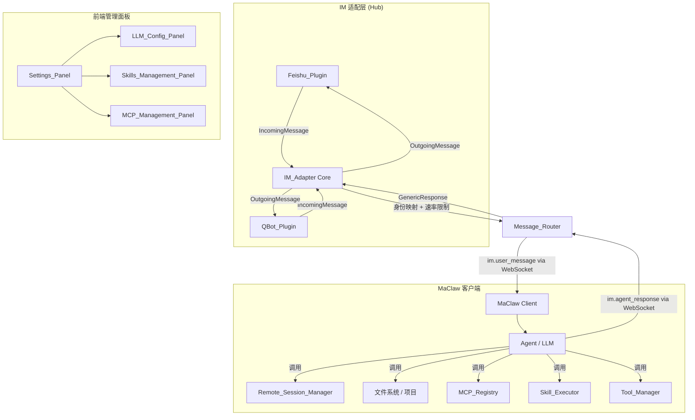
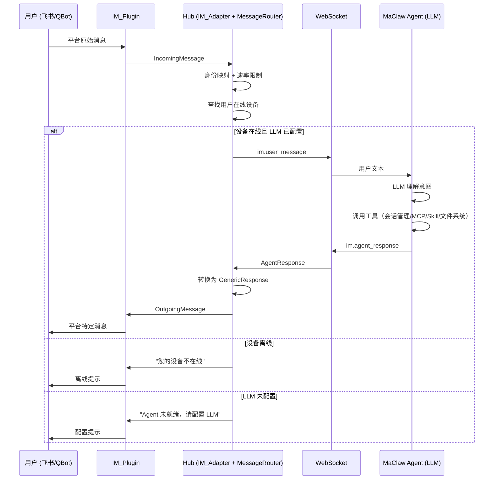

# 设计文档：飞书自然语言远程工具控制

## Overview

本设计文档描述将 MaClaw Hub 的 IM 机器人升级为 Agent 透传模式的完整技术方案。核心思路是：Hub 不做意图解析和命令映射，而是将 IM 消息透传到 MaClaw 客户端的 Agent，由 Agent（LLM）自行理解用户意图、调用本地工具、生成回复，再将回复透传回 IM 平台。

这种架构的优势：
- Agent 拥有完整的本地上下文（文件系统、工具状态、会话状态、项目结构），能做出更好的决策
- 不需要在 Hub 侧维护一套硬编码的意图映射，更灵活
- 新增能力只需更新 Agent 的 system prompt 和工具定义，无需改 Hub 代码
- MCP Server、Skill 等扩展能力自然地在 Agent 侧实现，与本地开发环境深度集成

核心设计目标：

1. **Agent_Passthrough** — Hub 作为消息中转站，IM 消息透传到 MaClaw Agent，Agent 回复透传回 IM
2. **IM_Adapter 插件化** — 基于 OpenClaw IM 插件抽象体系，飞书作为首个 IM_Plugin，支持快速接入 QBot 等其他平台
3. **MaClaw Agent** — 客户端侧的 LLM Agent，负责理解自然语言、调用工具、生成回复
4. **GenericResponse** — 统一响应模型，Agent 回复经 Hub 转换为 IM 平台特定格式
5. **前端管理面板** — LLM 配置、Skills 和 MCP Server 的可视化管理界面

## Architecture



### 设计决策

**D1: Hub 只做消息路由，不做意图解析**

Hub 收到 IM 消息后，只做身份映射（platformUID → userID）和速率限制，然后将原始文本通过 WebSocket 透传到用户绑定的 MaClaw 客户端。所有自然语言理解、工具调用、上下文管理都由 MaClaw 客户端的 Agent 完成。这避免了在 Hub 侧维护一套硬编码的意图映射规则。

**D2: IM_Adapter 保持插件化设计**

IM_Adapter 的插件化接口（IMPlugin、CapabilityDeclaration、IncomingMessage、OutgoingMessage）保持不变。变化的是消息处理管线：不再经过 NL_Router → BridgeExecutor，而是直接路由到 MaClaw WebSocket。

**D3: Agent 回复通过 GenericResponse 统一格式化**

Agent 的回复以结构化的 `AgentResponse`（包含文本、字段列表、操作建议等）通过 WebSocket 回传到 Hub，Hub 将其转换为 `GenericResponse`，再由 IM_Plugin 转换为平台特定格式。纯文本回复也支持，直接作为 `GenericResponse.Body` 透传。

**D4: WebSocket 协议扩展**

在现有 MaClaw ↔ Hub 的 WebSocket 协议中新增两个消息类型：
- `im.user_message` — Hub → MaClaw：用户从 IM 发来的消息
- `im.agent_response` — MaClaw → Hub：Agent 的回复

**D5: Agent 离线时的降级处理**

当用户绑定的 MaClaw 客户端不在线或 LLM 未配置时，Hub 直接返回提示消息（"您的设备不在线" 或 "Agent 未就绪，请在 MaClaw 中配置 LLM"），不尝试在 Hub 侧处理。

**D6: 邮箱绑定流程保留在 Hub 侧**

邮箱绑定（email → open_id 映射）是 IM 平台特有的身份关联流程，不涉及 Agent 智能，继续在 Hub 侧处理。绑定完成后，后续消息才会路由到 Agent。

**D7: MCP_Registry 和 Skill 系统在 MaClaw 客户端侧**

MCP Server 注册、Skill 定义和执行都在 MaClaw 客户端侧实现。Agent 可以直接调用本地注册的 MCP Server 和 Skill，无需经过 Hub 中转。前端管理面板通过 Wails 绑定直接操作客户端侧的 Registry 和 Executor。


## Components and Interfaces

### 1. IM_Adapter 核心接口（`hub/internal/im/adapter.go`）

接口定义与之前相同，变化在于消息处理管线。

```go
// IMPlugin 定义 IM 平台插件的标准接口（不变）
type IMPlugin interface {
    Name() string
    ReceiveMessage(handler func(msg IncomingMessage))
    SendText(ctx context.Context, target UserTarget, text string) error
    SendCard(ctx context.Context, target UserTarget, card OutgoingMessage) error
    SendImage(ctx context.Context, target UserTarget, imageKey string, caption string) error
    ResolveUser(ctx context.Context, platformUID string) (string, error)
    Capabilities() CapabilityDeclaration
    Start(ctx context.Context) error
    Stop(ctx context.Context) error
}
```

### 2. Message_Router（`hub/internal/im/router.go`）

替代原来的 NL_Router + BridgeExecutor，只做消息路由。

```go
// MessageRouter 将 IM 消息路由到 MaClaw 客户端的 Agent
type MessageRouter struct {
    devices     DeviceBinder       // 查找用户绑定的在线设备
    rateLimiter *rateLimiter
    identity    IdentityResolver
    pendingReqs map[string]*PendingIMRequest // requestID → 等待 Agent 回复
    mu          sync.RWMutex
}

// RouteToAgent 将用户消息路由到其绑定设备上的 Agent
func (r *MessageRouter) RouteToAgent(ctx context.Context, msg IncomingMessage) (*GenericResponse, error) {
    // 1. 身份映射
    // 2. 速率限制
    // 3. 查找用户的在线设备
    // 4. 检查设备 LLM 配置状态
    // 5. 通过 WebSocket 发送 im.user_message
    // 6. 等待 im.agent_response（带超时）
    // 7. 转换为 GenericResponse 返回
}

// PendingIMRequest 等待 Agent 回复的请求
type PendingIMRequest struct {
    RequestID   string
    UserID      string
    PlatformUID string
    Text        string
    ResponseCh  chan *AgentResponse
    CreatedAt   time.Time
    Timeout     time.Duration  // 默认 120 秒
}
```

### 3. WebSocket 协议扩展

```go
// im.user_message — Hub 发送给 MaClaw 客户端
type IMUserMessage struct {
    Type      string `json:"type"`       // "im.user_message"
    RequestID string `json:"request_id"` // 用于关联回复
    UserID    string `json:"user_id"`
    Platform  string `json:"platform"`   // "feishu", "qbot"
    Text      string `json:"text"`
    Timestamp int64  `json:"ts"`
}

// im.agent_response — MaClaw 客户端发送给 Hub
type IMAgentResponse struct {
    Type      string          `json:"type"`       // "im.agent_response"
    RequestID string          `json:"request_id"` // 关联原始请求
    Response  AgentResponse   `json:"response"`
}

// AgentResponse Agent 的结构化回复
type AgentResponse struct {
    Text     string            `json:"text"`               // 主要回复文本
    Fields   []ResponseField   `json:"fields,omitempty"`   // 结构化字段（可选）
    Actions  []ResponseAction  `json:"actions,omitempty"`  // 操作建议（可选）
    ImageKey string            `json:"image_key,omitempty"` // 图片（可选）
    Error    string            `json:"error,omitempty"`    // 错误信息（可选）
}
```

### 4. MaClaw Agent（客户端侧）

```go
// IMMessageHandler 处理从 Hub 转发来的 IM 消息
type IMMessageHandler struct {
    app          *App
    llmConfig    MaclawLLMConfig
    sessions     *RemoteSessionManager
    toolCatalog  map[string]RemoteToolMetadata
    mcpRegistry  *MCPRegistry       // 本地 MCP Server 注册中心
    skillExec    *SkillExecutor     // 本地 Skill 执行器
}

// HandleIMMessage 接收 IM 消息，调用 LLM Agent 处理，返回回复
func (h *IMMessageHandler) HandleIMMessage(msg IMUserMessage) *AgentResponse {
    // 1. 构建 system prompt（包含当前设备状态、会话列表、工具列表等上下文）
    // 2. 调用 LLM（OpenAI-compatible API）
    // 3. 如果 LLM 返回 tool_call，执行对应工具
    // 4. 将结果封装为 AgentResponse 返回
}
```

### 5. GenericResponse（`hub/internal/im/response.go`）

保持不变，用于将 AgentResponse 转换为 IM 平台特定格式。

```go
type GenericResponse struct {
    StatusCode   int
    StatusIcon   string
    Title        string
    Body         string
    Fields       []ResponseField
    Actions      []ResponseAction
    FallbackText string
}
```

### 6. 前端管理面板组件

Skills 和 MCP 管理面板通过 Wails 绑定直接操作客户端侧的 Registry 和 Executor，不经过 Hub。

```typescript
// Skills_Management_Panel (frontend/src/components/remote/SkillsManagementPanel.tsx)
interface SkillDefinition {
    name: string;
    description: string;
    triggers: string[];
    steps: SkillStep[];
    status: "active" | "candidate" | "disabled";
    created_at: string;
}

// MCP_Management_Panel (frontend/src/components/remote/MCPManagementPanel.tsx)
interface MCPServerView {
    id: string;
    name: string;
    endpoint_url: string;
    auth_type: "none" | "api_key" | "bearer";
    health_status: "healthy" | "slow" | "unavailable";
    tool_count: number;
    tools: MCPToolView[];
    last_check_at: string;
}
```


## Data Models

### 1. WebSocket 消息流转



### 2. 持久化数据

| 位置 | 键名格式 | 值类型 | 说明 |
|------|---------|--------|------|
| Hub | `feishu_openid_map` | JSON (map[string]string) | 飞书 email→open_id 绑定 |
| Hub | `feishu_config` | JSON (FeishuConfigState) | 飞书配置 |
| Hub | `im_plugin_configs` | JSON (map[string]PluginConfig) | 各 IM 插件配置 |
| MaClaw | `maclaw_llm_url/key/model` | string | LLM 配置 |
| MaClaw | `mcp_servers` | JSON ([]MCPServer) | 本地 MCP Server 列表 |
| MaClaw | `skills` | JSON ([]SkillDefinition) | 本地 Skill 定义列表 |

### 3. Agent System Prompt 上下文

Agent 在处理每条 IM 消息时，system prompt 中注入以下上下文：

```
你是 MaClaw 远程开发助手。用户通过 IM（飞书/QBot）向你发送消息。

当前设备状态：
- 设备名: {machine_name}
- 平台: {platform}
- 活跃会话: {session_count} 个

可用工具：
- list_sessions: 列出当前所有远程会话
- create_session: 创建新的远程会话（参数: tool, project_path, prompt）
- send_input: 向会话发送输入（参数: session_id, text）
- interrupt_session: 中断会话
- kill_session: 终止会话
- screenshot: 截取会话屏幕
- list_mcp_tools: 列出已注册的 MCP 工具
- call_mcp_tool: 调用 MCP 工具
- run_skill: 执行已注册的 Skill

当前会话列表：
{sessions_json}

请用中文回复，关键技术术语保留英文。
```

### 4. 安全模型

```go
// Hub 侧安全（保留）
- 身份映射：platformUID → userID（邮箱绑定验证）
- 速率限制：每用户每分钟 30 次
- 未绑定用户只能执行绑定流程

// Agent 侧安全（新增）
- LLM 配置验证：URL + Model 必须非空
- 工具调用权限：Agent 只能调用已注册的工具
- 输入清洗：Agent 对 LLM 返回的 tool_call 参数做基本校验
```
