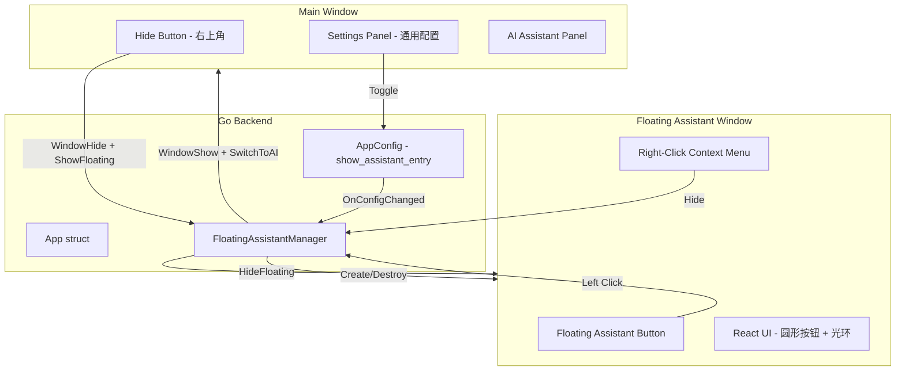
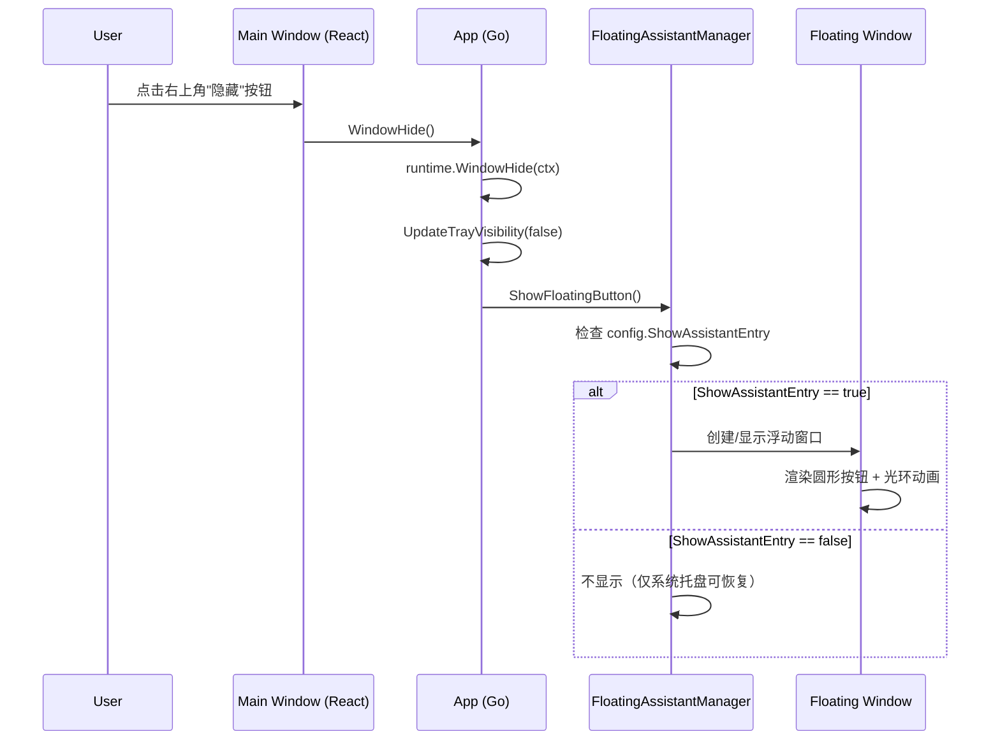
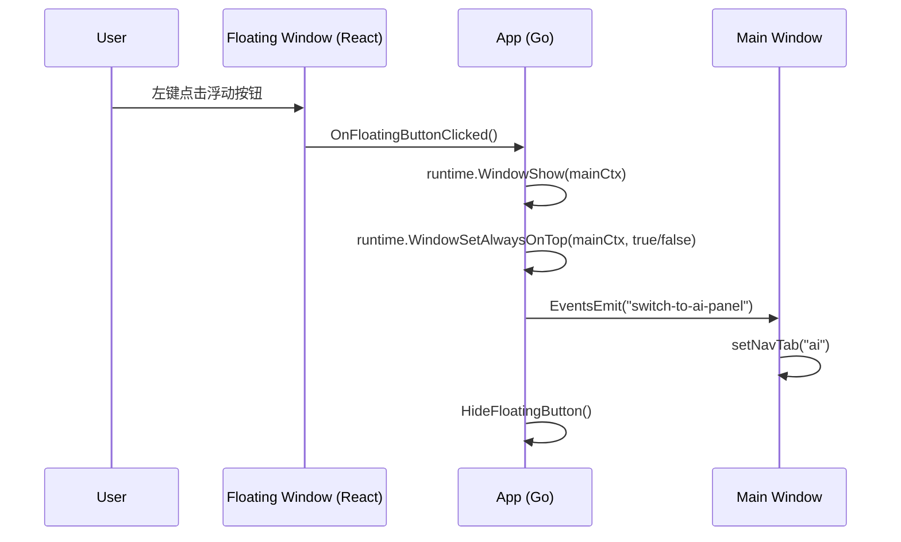
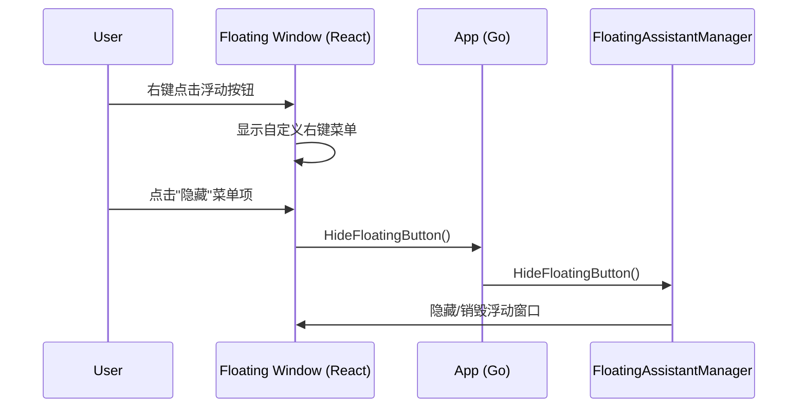

# Design Document: Floating Assistant Button

## Overview

当用户点击 maclaw 主窗口右上角的"隐藏"按钮后，主窗口隐藏的同时在桌面最顶层显示一个使用 maclaw logo 的圆形浮动助手按钮。该按钮背景透明、带光环动画效果，支持拖动、右键菜单（含隐藏项）、左键点击（显示主窗口并切换到 AI 助手面板）。用户可在"maclaw 配置 → 通用配置"中通过"显示助手入口"复选框控制该按钮的显示/隐藏，该选项与"显示欢迎页"放在同一行。

本功能涉及 Go 后端（Wails 窗口管理）和 React 前端（配置 UI）两层。浮动按钮本身通过 Wails 的第二窗口机制实现——创建一个独立的无边框、透明、置顶的小窗口，内嵌一个 React 渲染的圆形按钮 UI。

## Architecture



## Sequence Diagrams

### 主流程：隐藏主窗口 → 显示浮动按钮



### 左键点击浮动按钮 → 显示主窗口



### 右键菜单 → 隐藏浮动按钮



## Components and Interfaces

### Component 1: FloatingAssistantManager (Go Backend)

**Purpose**: 管理浮动助手按钮窗口的生命周期（创建、显示、隐藏、销毁）、位置持久化、拖动坐标同步。

**Interface**:
```go
// FloatingAssistantManager manages the floating assistant button window lifecycle.
type FloatingAssistantManager struct {
    app         *App
    visible     bool
    posX, posY  int  // 当前位置（屏幕坐标）
    mu          sync.Mutex
}

// ShowFloatingButton creates and shows the floating assistant window.
// No-op if config.ShowAssistantEntry is false or already visible.
func (m *FloatingAssistantManager) ShowFloatingButton()

// HideFloatingButton hides the floating assistant window.
func (m *FloatingAssistantManager) HideFloatingButton()

// IsVisible returns whether the floating button is currently shown.
func (m *FloatingAssistantManager) IsVisible() bool

// UpdatePosition saves the dragged position for next show.
func (m *FloatingAssistantManager) UpdatePosition(x, y int)
```

**Responsibilities**:
- 创建无边框、透明、置顶的第二窗口
- 响应配置变更（`ShowAssistantEntry` 开关）
- 在主窗口隐藏时自动显示浮动按钮
- 在浮动按钮被点击时恢复主窗口并切换到 AI 面板
- 记忆拖动后的位置

### Component 2: Floating Button UI (React Frontend - 第二窗口)

**Purpose**: 渲染圆形浮动按钮的视觉效果（logo、光环动画）、处理用户交互（拖动、左键、右键菜单）。

**Interface**:
```typescript
// FloatingButton.tsx - 浮动按钮组件（独立窗口的根组件）
interface FloatingButtonProps {
    logoSrc: string;       // maclaw logo 图片路径
    onLeftClick: () => void;   // 左键点击回调
    onHide: () => void;        // 右键菜单"隐藏"回调
}

function FloatingButton(props: FloatingButtonProps): JSX.Element
```

**Responsibilities**:
- 渲染 56×56px 圆形按钮，使用 maclaw2.png 作为 logo
- CSS 动画实现光环效果（脉冲发光环）
- 支持鼠标拖动（mousedown + mousemove + mouseup）
- 区分拖动和点击（拖动距离 < 5px 视为点击）
- 自定义右键菜单（不使用系统默认菜单）
- 右键菜单包含"隐藏"选项

### Component 3: Settings UI Extension (React Frontend - 主窗口)

**Purpose**: 在"通用配置"面板中添加"显示助手入口"复选框。

**Responsibilities**:
- 在"显示欢迎页"复选框同一行添加"显示助手入口"复选框
- 勾选/取消时更新 `AppConfig.show_assistant_entry` 并保存
- 多语言支持（中/英/繁体）

## Data Models

### AppConfig Extension

```go
type AppConfig struct {
    // ... existing fields ...

    // ShowAssistantEntry controls whether the floating assistant button
    // appears when the main window is hidden. Default: true.
    ShowAssistantEntry bool `json:"show_assistant_entry"`
}
```

**Validation Rules**:
- 布尔值，默认 `true`（首次安装即启用）
- 通过 `SaveConfig` / `LoadConfig` 持久化到 `~/.maclaw/config.json`

### Floating Window Position (内存态，不持久化)

```go
type floatingPosition struct {
    X int `json:"x"`
    Y int `json:"y"`
}
```

**Validation Rules**:
- X, Y 必须在屏幕可见范围内
- 默认位置：屏幕顶部居中 `(screenWidth/2 - 28, 10)`

## Key Functions with Formal Specifications

### Function 1: App.WindowHide() (修改现有)

```go
func (a *App) WindowHide()
```

**Preconditions:**
- `a.ctx` 已初始化（Wails OnStartup 已执行）

**Postconditions:**
- 主窗口已隐藏
- 系统托盘状态已更新
- 若 `config.ShowAssistantEntry == true`，浮动按钮窗口已显示

**修改内容:**
- 在现有 `runtime.WindowHide` 和 `UpdateTrayVisibility` 之后，调用 `a.floatingAssistant.ShowFloatingButton()`

### Function 2: FloatingAssistantManager.ShowFloatingButton()

```go
func (m *FloatingAssistantManager) ShowFloatingButton()
```

**Preconditions:**
- `m.app` 非 nil
- `m.app.ctx` 已初始化

**Postconditions:**
- 若 `config.ShowAssistantEntry == false`，无操作
- 若已 visible，无操作
- 否则：浮动窗口已创建并显示在屏幕最顶层
- `m.visible == true`

### Function 3: OnFloatingButtonClicked() (Wails binding)

```go
func (a *App) OnFloatingButtonClicked()
```

**Preconditions:**
- 浮动按钮窗口存在且可见

**Postconditions:**
- 主窗口已显示并置顶
- 已发送 `"switch-to-ai-panel"` 事件到主窗口前端
- 浮动按钮窗口已隐藏
- `floatingAssistant.visible == false`

### Function 4: OnFloatingButtonDragged() (Wails binding)

```go
func (a *App) OnFloatingButtonDragged(x, y int)
```

**Preconditions:**
- x, y 为屏幕坐标

**Postconditions:**
- 浮动窗口已移动到 (x, y)
- `floatingAssistant.posX == x && floatingAssistant.posY == y`

## Algorithmic Pseudocode

### Main Workflow: Window Hide → Show Floating Button

```pascal
PROCEDURE WindowHide(app)
  INPUT: app (App instance)
  OUTPUT: none (side effects: window hidden, floating button shown)

  SEQUENCE
    runtime.WindowHide(app.ctx)

    IF UpdateTrayVisibility IS NOT NULL THEN
      UpdateTrayVisibility(false)
    END IF

    IF app.floatingAssistant IS NOT NULL THEN
      app.floatingAssistant.ShowFloatingButton()
    END IF
  END SEQUENCE
END PROCEDURE
```

### Show Floating Button Algorithm

```pascal
PROCEDURE ShowFloatingButton(manager)
  INPUT: manager (FloatingAssistantManager)
  OUTPUT: none (side effects: floating window created/shown)

  SEQUENCE
    LOCK manager.mu

    config ← LoadConfig()
    IF config.ShowAssistantEntry = false THEN
      UNLOCK manager.mu
      RETURN
    END IF

    IF manager.visible = true THEN
      UNLOCK manager.mu
      RETURN
    END IF

    IF manager.posX = 0 AND manager.posY = 0 THEN
      screenW, screenH ← GetScreenDimensions()
      manager.posX ← screenW / 2 - 28
      manager.posY ← 10
    END IF

    CreateFloatingWindow(manager.posX, manager.posY, 64, 64)
    // Window properties: frameless, transparent, always-on-top, non-activating

    manager.visible ← true
    UNLOCK manager.mu
  END SEQUENCE
END PROCEDURE
```

### Floating Button Click Handler (Frontend)

```pascal
PROCEDURE HandleFloatingButtonInteraction(event)
  INPUT: event (mouse event)
  OUTPUT: none (side effects: window shown or drag started)

  SEQUENCE
    IF event.type = "contextmenu" THEN
      event.preventDefault()
      ShowContextMenu(event.clientX, event.clientY)
      RETURN
    END IF

    IF event.type = "mousedown" AND event.button = 0 THEN
      dragStartX ← event.screenX
      dragStartY ← event.screenY
      isDragging ← false

      WHILE mouse is held DO
        deltaX ← currentScreenX - dragStartX
        deltaY ← currentScreenY - dragStartY

        IF |deltaX| > 5 OR |deltaY| > 5 THEN
          isDragging ← true
          // Call Go backend to move window
          OnFloatingButtonDragged(windowX + deltaX, windowY + deltaY)
          dragStartX ← currentScreenX
          dragStartY ← currentScreenY
        END IF
      END WHILE

      IF isDragging = false THEN
        // This was a click, not a drag
        OnFloatingButtonClicked()
      END IF
    END IF
  END SEQUENCE
END PROCEDURE
```

## Example Usage

### Go Backend - Modified WindowHide

```go
func (a *App) WindowHide() {
    runtime.WindowHide(a.ctx)
    if UpdateTrayVisibility != nil {
        UpdateTrayVisibility(false)
    }
    // NEW: Show floating assistant button
    if a.floatingAssistant != nil {
        a.floatingAssistant.ShowFloatingButton()
    }
}
```

### Go Backend - Floating Button Click Handler

```go
func (a *App) OnFloatingButtonClicked() {
    // Show main window
    runtime.WindowShow(a.ctx)
    runtime.WindowSetAlwaysOnTop(a.ctx, true)
    runtime.WindowSetAlwaysOnTop(a.ctx, false)

    // Tell frontend to switch to AI assistant panel
    runtime.EventsEmit(a.ctx, "switch-to-ai-panel")

    // Hide floating button
    if a.floatingAssistant != nil {
        a.floatingAssistant.HideFloatingButton()
    }
}
```

### React Frontend - Floating Button Component

```typescript
function FloatingButton({ logoSrc, onLeftClick, onHide }: FloatingButtonProps) {
    const [showMenu, setShowMenu] = useState(false);
    const [menuPos, setMenuPos] = useState({ x: 0, y: 0 });
    const dragRef = useRef({ startX: 0, startY: 0, dragging: false });

    const handleMouseDown = (e: React.MouseEvent) => {
        if (e.button !== 0) return;
        dragRef.current = { startX: e.screenX, startY: e.screenY, dragging: false };
        // ... attach mousemove/mouseup listeners
    };

    const handleContextMenu = (e: React.MouseEvent) => {
        e.preventDefault();
        setMenuPos({ x: e.clientX, y: e.clientY });
        setShowMenu(true);
    };

    return (
        <div className="floating-assistant-container"
             onMouseDown={handleMouseDown}
             onContextMenu={handleContextMenu}>
            <div className="floating-assistant-halo" />
            
            {showMenu && (
                <div className="floating-context-menu" style={{ top: menuPos.y, left: menuPos.x }}>
                    <div className="menu-item" onClick={onHide}>隐藏</div>
                </div>
            )}
        </div>
    );
}
```

### React Frontend - Settings Checkbox

```typescript
{/* 显示助手入口 - 与"显示欢迎页"同一行 */}
<label style={{ display: 'flex', alignItems: 'center', gap: '8px', cursor: 'pointer' }}>
    <input
        type="checkbox"
        checked={config?.show_assistant_entry !== false}
        onChange={(e) => {
            if (config) {
                const newConfig = new main.AppConfig({
                    ...config,
                    show_assistant_entry: e.target.checked
                });
                setConfig(newConfig);
                SaveConfig(newConfig);
            }
        }}
        style={{ width: '16px', height: '16px' }}
    />
    <span style={{ fontSize: '0.8rem', color: 'var(--theme-text-primary)' }}>
        {t("showAssistantEntry")}
    </span>
</label>
```

### CSS - Halo Animation

```css
.floating-assistant-container {
    width: 56px;
    height: 56px;
    border-radius: 50%;
    position: relative;
    cursor: pointer;
    user-select: none;
    -webkit-app-region: no-drag;
}

.floating-assistant-halo {
    position: absolute;
    inset: -4px;
    border-radius: 50%;
    border: 2px solid rgba(99, 102, 241, 0.6);
    animation: halo-pulse 2s ease-in-out infinite;
    pointer-events: none;
}

@keyframes halo-pulse {
    0%, 100% {
        box-shadow: 0 0 8px rgba(99, 102, 241, 0.4),
                    0 0 16px rgba(99, 102, 241, 0.2);
        opacity: 1;
    }
    50% {
        box-shadow: 0 0 16px rgba(99, 102, 241, 0.6),
                    0 0 32px rgba(99, 102, 241, 0.3);
        opacity: 0.8;
    }
}

.floating-assistant-logo {
    width: 56px;
    height: 56px;
    border-radius: 50%;
    object-fit: cover;
    position: relative;
    z-index: 1;
}
```

## Correctness Properties

*A property is a characteristic or behavior that should hold true across all valid executions of a system — essentially, a formal statement about what the system should do. Properties serve as the bridge between human-readable specifications and machine-verifiable correctness guarantees.*

### Property 1: State machine consistency under config and operations

*For any* initial FloatingAssistantManager state and any sequence of show/hide/config-change operations, the Floating_Button visibility SHALL equal `true` only when: (a) a hide-main-window event occurred, (b) `AppConfig.show_assistant_entry` is `true`, and (c) no subsequent click, context-menu-hide, or config-change-to-false has occurred. Calling ShowFloatingButton when already visible SHALL be idempotent.

**Validates: Requirements 1.1, 1.2, 1.3, 4.3, 5.3**

### Property 2: Click restores main window and switches to AI panel

*For any* state where Floating_Button is visible, a left-click SHALL result in: Main_Window visible, active navigation tab set to AI_Assistant_Panel, and Floating_Button visibility set to false.

**Validates: Requirements 2.1, 2.2, 2.3**

### Property 3: Drag/click threshold classification

*For any* mouse press-and-release interaction on Floating_Button with displacement (deltaX, deltaY), the interaction SHALL be classified as a drag if `|deltaX| > 5 OR |deltaY| > 5`, and as a click otherwise.

**Validates: Requirements 3.1, 3.2**

### Property 4: Drag position round-trip

*For any* valid drag end position, saving the position via FloatingAssistantManager.UpdatePosition and then showing Floating_Button SHALL restore it to the saved position.

**Validates: Requirements 3.3, 10.2**

### Property 5: Position clamping within screen bounds

*For any* screen dimensions (W, H) and any drag end position (x, y), the clamped position SHALL satisfy `0 ≤ x ≤ W - buttonWidth` and `0 ≤ y ≤ H - buttonHeight`.

**Validates: Requirement 3.4**

### Property 6: Mutual exclusivity invariant

*For any* sequence of show/hide/click/config-change operations, Floating_Button and Main_Window SHALL never be simultaneously visible.

**Validates: Requirements 7.1, 7.2, 7.3**

### Property 7: AppConfig serialization round-trip with default

*For any* valid AppConfig instance, serializing to JSON and deserializing back SHALL produce an equivalent `show_assistant_entry` value. When the field is absent from JSON, deserialization SHALL default to `true`.

**Validates: Requirements 8.2, 8.4**

### Property 8: Default position calculation

*For any* screen width W, the default Floating_Button position SHALL be `(W/2 - 28, 10)`.

**Validates: Requirement 10.1**

## Error Handling

### Error Scenario 1: 第二窗口创建失败

**Condition**: Wails 不支持当前平台的多窗口或系统资源不足
**Response**: 静默失败，记录日志，不影响主窗口功能
**Recovery**: 用户仍可通过系统托盘恢复主窗口

### Error Scenario 2: 浮动按钮被拖出屏幕

**Condition**: 用户将按钮拖到屏幕边缘外
**Response**: 在 mouseup 时检测位置，若超出屏幕范围则 clamp 到最近的可见位置
**Recovery**: 按钮自动回到屏幕可见区域

### Error Scenario 3: 配置文件损坏

**Condition**: `show_assistant_entry` 字段缺失或类型错误
**Response**: 使用默认值 `true`（Go 的 bool 零值为 false，需在 UnmarshalJSON 中处理默认值）
**Recovery**: 下次 SaveConfig 时写入正确值

## Testing Strategy

### Unit Testing Approach

- `FloatingAssistantManager` 的 `ShowFloatingButton` / `HideFloatingButton` 状态转换测试
- `AppConfig` 序列化/反序列化测试（`show_assistant_entry` 默认值）
- 拖动 vs 点击判定逻辑测试（距离阈值 5px）

### Property-Based Testing Approach

**Property Test Library**: fast-check (已在项目 devDependencies 中)

- 属性：任意序列的 show/hide/click 操作后，`visible` 状态始终一致
- 属性：任意拖动坐标经 clamp 后必须在屏幕范围内
- 属性：config toggle 序列后，浮动按钮可见性与最终 config 值一致

### Integration Testing Approach

- 端到端流程：隐藏主窗口 → 浮动按钮出现 → 点击 → 主窗口显示且在 AI 面板
- 配置联动：设置中取消勾选 → 隐藏主窗口 → 浮动按钮不出现

## Performance Considerations

- 浮动窗口使用最小化的 HTML/CSS，不加载完整的 React 应用，确保内存占用 < 10MB
- 光环动画使用 CSS animation（GPU 加速），不使用 JavaScript 定时器
- 拖动使用 `requestAnimationFrame` 节流，避免高频窗口移动调用
- 浮动窗口在隐藏时销毁（而非仅 hide），释放 WebView 资源

## Security Considerations

- 浮动窗口不暴露任何敏感信息（仅显示 logo）
- 右键菜单不包含危险操作
- 拖动坐标不通过网络传输

## Dependencies

- **Wails v2 Runtime**: `runtime.WindowShow`, `runtime.WindowHide`, `runtime.EventsEmit` — 窗口管理和事件通信
- **Wails v2 Multi-Window** (如支持): 创建第二个独立窗口；若 Wails v2 不支持多窗口，需使用平台原生方案（macOS: NSWindow, Windows: Win32 CreateWindowEx）作为 fallback
- **energye/systray** (Windows): 已有依赖，系统托盘集成
- **maclaw2.png**: 已有资源 `gui/frontend/src/assets/images/maclaw2.png`
- **React 18**: 浮动窗口的 UI 渲染

### 平台实现策略

由于 Wails v2 的多窗口支持有限，浮动按钮窗口的实现需要按平台区分：

| 平台 | 实现方案 | 关键 API |
|------|---------|---------|
| macOS | NSWindow + WKWebView（通过 CGo/ObjC 桥接） | `NSWindow.setLevel(.floating)`, `NSWindow.setBackgroundColor(.clear)` |
| Windows | Win32 CreateWindowEx + WebView2 | `WS_EX_TOPMOST`, `WS_EX_LAYERED`, `WS_EX_TOOLWINDOW` |
| Linux | GTK Window + WebKitWebView | `gtk_window_set_keep_above`, `gtk_window_set_decorated(false)` |

每个平台的实现放在对应的 build-tag 文件中（`floating_darwin.go`, `floating_windows.go`, `floating_linux.go`），通过统一的 `FloatingAssistantManager` 接口抽象。
