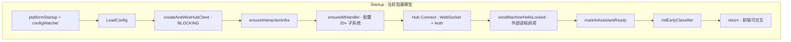
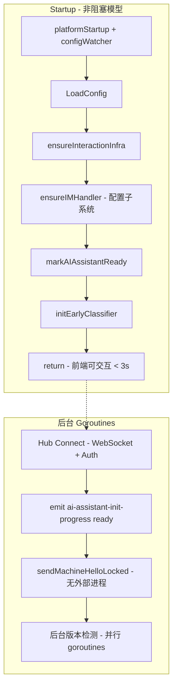
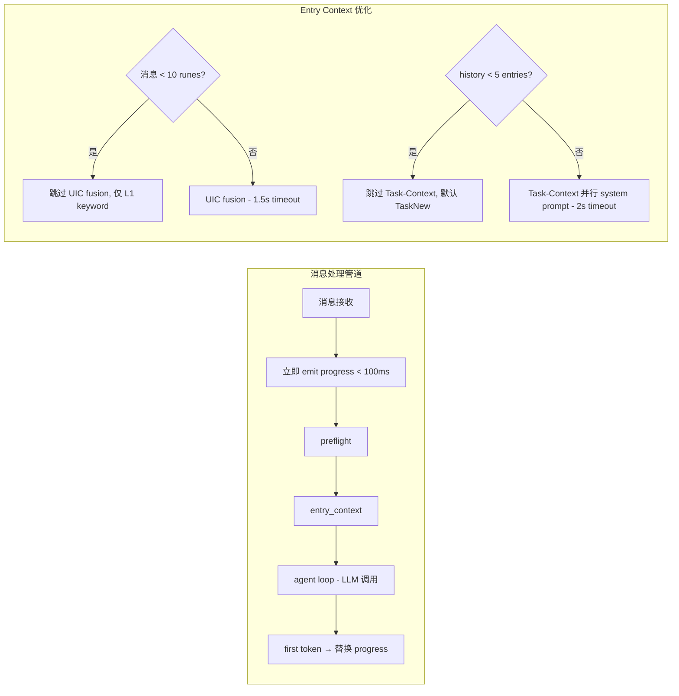

# Design: GUI 启动与消息响应体验优化

## Overview

本设计解决 GUI 桌面 AI 助手面板的两个核心体验问题：

1. **启动阻塞**：`startup()` 回调中 `createAndWireHubClient()` 同步执行 WebSocket 连接 + 认证 + Send_Hello（含外部进程调用），耗时 2-53 秒，期间前端完全无法交互。
2. **消息响应延迟**：用户发送消息后，经过 UIC 分类（3s 超时）、Task-Context LLM（8s 超时）、系统 prompt 构建等串行步骤，才到达 LLM 生成阶段，期间无任何可见反馈。

**设计目标**：startup 在 <3s 内返回；用户发送消息后 <100ms 看到进度指示器；first token 在 <5s 内到达（LLM API 正常时）。

**设计原则**：
- 将网络 I/O 从关键路径移到后台 goroutine
- 用缓存消除重复的文件系统扫描和外部进程调用
- 用并行化和超时缩短消除串行等待
- 用即时进度反馈消除"卡死"感知

## Architecture

### 当前架构（阻塞模型）



### 目标架构（非阻塞模型）



### 消息处理管道优化



## Components and Interfaces

### 1. AsyncHubConnector（新组件）

负责在后台执行 Hub 连接生命周期，不阻塞 startup。

```go
// AsyncHubConnector manages the Hub connection lifecycle in background.
type AsyncHubConnector struct {
    app        *App
    hubClient  *RemoteHubClient
    connected  atomic.Bool
    helloSent  atomic.Bool
    mu         sync.Mutex
}

// StartAsync initiates Hub connection in a background goroutine.
// Returns immediately. Caller should NOT wait on this.
func (c *AsyncHubConnector) StartAsync()

// IsConnected returns true after auth.ok is received.
func (c *AsyncHubConnector) IsConnected() bool

// IsHelloSent returns true after sendMachineHelloLocked completes.
func (c *AsyncHubConnector) IsHelloSent() bool
```

**生命周期**：
1. `startup()` 调用 `StartAsync()` → 立即返回
2. 后台 goroutine：WebSocket dial → sendMachineAuth → 读取 auth response
3. Auth 成功 → `connected.Store(true)` → emit `"ai-assistant-init-progress"` with `"ready"`
4. 后台 goroutine（独立）：`sendMachineHelloLocked()` → `helloSent.Store(true)`
5. Auth 失败/超时 → 降级模式，本地功能正常

### 2. CachedSkillScanner（新组件）

包装 `ScanSkillDir`，提供异步扫描 + 30s TTL 缓存。

```go
// CachedSkillScanner provides async skill scanning with TTL cache.
type CachedSkillScanner struct {
    roots       []string
    cache       atomic.Pointer[skillCacheEntry]
    scanning    atomic.Bool
    scanOnce    sync.Once  // 防止并发扫描
    mu          sync.Mutex
}

type skillCacheEntry struct {
    skills    []corelib.NLSkillEntry
    createdAt time.Time
}

// Init records roots and starts background scan. Returns in <50ms.
func (s *CachedSkillScanner) Init(roots []string)

// Get returns cached skills or empty list if scan not complete.
func (s *CachedSkillScanner) Get() []corelib.NLSkillEntry

// Invalidate marks cache as stale and triggers background refresh.
func (s *CachedSkillScanner) Invalidate()
```

**缓存策略**：
- TTL = 30 秒
- 过期后：返回 stale 数据 + 触发后台刷新
- 无缓存时：返回空列表（graceful degradation）
- 安装/删除 Skill 时：`Invalidate()` 立即标记失效

### 3. ToolVersionCache（新组件）

缓存工具版本信息，避免 `sendMachineHelloLocked` 中的外部进程调用。

```go
// ToolVersionCache caches tool version information to avoid
// synchronous external process execution during Send_Hello.
type ToolVersionCache struct {
    versions sync.Map  // map[string]*cachedVersion
}

type cachedVersion struct {
    Version   string
    CheckedAt time.Time
    Installed bool
    Path      string
}

// GetCached returns cached version info, or nil if not cached.
func (c *ToolVersionCache) GetCached(name string) *cachedVersion

// RefreshAllAsync starts parallel version checks in background.
func (c *ToolVersionCache) RefreshAllAsync(tools []string, timeout time.Duration)

// GetInstallStatus checks binary existence only (exec.LookPath), no execution.
func (c *ToolVersionCache) GetInstallStatus(name string) (installed bool, path string)
```

### 4. ImmediateProgressEmitter（新行为）

在 `handleIMMessageWithLoop` 入口处立即发射进度事件。

```go
// emitImmediateProgress sends a progress event within 100ms of message receipt.
// Called at the very beginning of handleIMMessageWithLoop, before any processing.
func (h *IMMessageHandler) emitImmediateProgress(msg IMUserMessage, onProgress tool.ProgressCallback) {
    if onProgress != nil {
        onProgress("正在思考...")
    }
}
```

### 5. 修改的接口

#### startup() 修改

```go
func (a *App) startup(ctx context.Context) {
    // ... platform init, config watcher, LoadConfig ...
    
    // 关键变更：ensureInteractionInfra + ensureIMHandler 同步执行（快速，无网络 I/O）
    // Hub Connect 移到后台
    if hasHubCredentials(config) {
        go a.asyncHubConnect()  // 不阻塞
    } else {
        a.markAIAssistantReady()  // 无 Hub 凭据，立即就绪
    }
    
    a.initEarlyClassifier()
    // return — 前端可交互
}
```

#### sendMachineHelloLocked() 修改

```go
func (c *RemoteHubClient) sendMachineHelloLocked() error {
    cfg, _ := c.app.LoadConfig()
    _ = c.applyConfig(cfg)
    profile := c.app.currentRemoteMachineProfile(cfg.RemoteHeartbeatSec, 0)
    
    // 变更：不调用 listRemoteToolMetadataForApp（它会执行外部进程）
    // 改为使用 ToolVersionCache 的缓存数据
    tools := c.app.toolVersionCache.GetCachedToolNames()
    
    msg := HubEnvelope{...}
    err := c.conn.WriteJSON(msg)
    
    // 发送 hello 后，异步刷新版本缓存
    go c.app.toolVersionCache.RefreshAllAsync(toolNames, 10*time.Second)
    
    return err
}
```

#### resolveIMEntryContext 修改

```go
func (h *IMMessageHandler) resolveIMEntryContext(opts imEntryContextOptions) *imEntryContextResult {
    // 短消息优化：< 10 runes 跳过 UIC fusion
    if utf8.RuneCountInString(strings.TrimSpace(opts.Trimmed)) < 10 {
        // 仅执行 L1 keyword matching
        // 跳过 L2 embedding + L3 tree
    }
    
    // Task-Context 优化：< 5 entries 跳过 LLM 调用
    if len(history) < 5 {
        decision = TaskNew  // 默认新任务
    } else {
        // 并行执行 Task-Context LLM 和 system prompt 构建
        taskCtxCh := make(chan TaskContextResult, 1)
        go func() { taskCtxCh <- callTaskContextLLM(ctx, 2*time.Second) }()
        systemPrompt := buildSystemPrompt(...)
        taskCtxResult := <-taskCtxCh  // 消费结果
    }
}
```

## Data Models

### ToolVersionCache 持久化格式

```json
{
  "claude": {
    "version": "2.1.29",
    "checked_at": "2026-05-01T10:30:00Z",
    "installed": true,
    "path": "/usr/local/bin/claude"
  },
  "codex": {
    "version": "0.1.5",
    "checked_at": "2026-05-01T10:30:00Z",
    "installed": true,
    "path": "/usr/local/bin/codex"
  }
}
```

存储位置：`~/.maclaw/data/tool_version_cache.json`

### CachedSkillScanner 内存结构

```go
type skillCacheEntry struct {
    skills    []corelib.NLSkillEntry  // 完整的 skill 列表
    createdAt time.Time               // 缓存创建时间
    stale     bool                    // 是否已过期（仍可返回）
}
```

无持久化——每次启动重新扫描（后台），30s TTL 足够覆盖单次会话。

### 进度事件格式

```typescript
// Wails event: "ai-assistant-progress"
interface ProgressEvent {
    text: string;       // "正在思考..." | "处理时间较长，请耐心等待..."
    timestamp: number;  // Unix ms
}

// Wails event: "ai-assistant-init-progress"
interface InitProgressEvent {
    status: "connecting" | "ready" | "degraded";
}
```

## Correctness Properties

*A property is a characteristic or behavior that should hold true across all valid executions of a system—essentially, a formal statement about what the system should do. Properties serve as the bridge between human-readable specifications and machine-verifiable correctness guarantees.*

### Property 1: Non-blocking startup

*For any* valid Hub credential configuration (all three fields present), the `startup()` function SHALL return control to the caller before the Hub WebSocket connection or Send_Hello operation completes. Specifically, `startup()` return timestamp < Hub auth completion timestamp AND `startup()` return timestamp < Send_Hello completion timestamp.

**Validates: Requirements 1.2, 1.5**

### Property 2: Missing credentials immediate ready

*For any* configuration where at least one of RemoteMachineID, RemoteMachineToken, or RemoteHubURL is empty, the system SHALL call `markAIAssistantReady()` synchronously within the `startup()` function without initiating any Hub connection attempt.

**Validates: Requirements 1.3**

### Property 3: Hub failure graceful degradation

*For any* Hub connection failure scenario (WebSocket dial error, authentication rejection, or auth response timeout exceeding 10 seconds), the system SHALL mark the AI assistant as ready and local features (LLM requests via local API keys, local tool execution) SHALL remain functional.

**Validates: Requirements 1.6**

### Property 4: Hello payload without external process execution

*For any* set of configured tools, the `sendMachineHelloLocked` function SHALL construct the hello payload using only cached version data or binary existence checks (`exec.LookPath` / file stat), and SHALL NOT invoke `exec.Command.Output()` or any equivalent that spawns a child process.

**Validates: Requirements 8.1, 8.2, 8.3**

### Property 5: Skill cache TTL correctness

*For any* successful skill scan result, calling `Get()` within 30 seconds of scan completion SHALL return the cached results without triggering a new file system scan. The returned list SHALL be identical to the original scan result.

**Validates: Requirements 2.4, 2.5**

### Property 6: Stale-while-revalidate pattern

*For any* expired cache (age > 30 seconds), calling `Get()` SHALL return the stale cached results immediately (without blocking) AND SHALL initiate a background scan to refresh the cache.

**Validates: Requirements 2.6**

### Property 7: Scan error resilience

*For any* set of skill directories where a subset have file system errors (permission denied, corrupted files, missing directories), the scanner SHALL skip errored directories and return valid skill entries from the remaining directories.

**Validates: Requirements 2.8**

### Property 8: Scan deduplication

*For any* number of concurrent callers triggering a cache refresh (via `Get()` on expired cache or `Invalidate()`), at most one scan operation SHALL execute concurrently.

**Validates: Requirements 2.9**

### Property 9: Graceful degradation during scan

*For any* caller requesting the skill list while a background scan is in progress and no prior cache exists, the scanner SHALL return an empty skill list without blocking.

**Validates: Requirements 2.3, 2.10**

### Property 10: Immediate progress emission

*For any* user message received by the IMMessageHandler with a non-nil onProgress callback, the progress callback SHALL be invoked before any preflight or entry_context processing begins, ensuring the progress event is emitted within 100ms of message receipt.

**Validates: Requirements 3.1**

### Property 11: UIC timeout degradation

*For any* message where the UIC tree channel classification exceeds the 1.5-second timeout, the UIC SHALL return a result with label "ambiguous", confidence 0.0, and Degraded=true, allowing downstream processing to continue.

**Validates: Requirements 4.2**

### Property 12: Short message fusion skip with L1 preservation

*For any* user message containing fewer than 10 Unicode code points (runes) after whitespace trimming, the Entry_Context resolver SHALL skip UIC fusion classification (L2 embedding + L3 tree) AND SHALL still execute L1 keyword matching for fast-path intent detection.

**Validates: Requirements 4.3, 4.4**

### Property 13: Task-Context skip for short history

*For any* conversation with fewer than 5 history entries, the Entry_Context resolver SHALL skip the Task_Context_LLM call and default to TaskNew action without any LLM invocation.

**Validates: Requirements 5.1**

### Property 14: Task-Context failure fallback

*For any* Task_Context_LLM invocation that times out (exceeds 2 seconds) or returns an error, the Entry_Context resolver SHALL default to TaskContinue action as the conservative assumption.

**Validates: Requirements 5.4**

### Property 15: Message processing independence from Hub

*For any* user message received when the AI assistant is marked ready (warmupDone=true), the IMMessageHandler SHALL process the message successfully regardless of Send_Hello completion status, Hub connection status, or Hub client availability. Message processing SHALL depend only on locally available resources (LLM config, conversation history, IMMessageHandler instance).

**Validates: Requirements 6.1, 6.2, 6.5, 6.6**

## Error Handling

### Startup Errors

| Error Scenario | Handling Strategy |
|---|---|
| Config file unreadable | Skip Hub connection, mark ready immediately, log error |
| Hub WebSocket dial failure | Mark ready in degraded mode, schedule reconnection |
| Hub auth rejection (auth.error) | Mark ready in degraded mode, emit degraded event |
| Hub auth timeout (>10s) | Mark ready in degraded mode, close connection |
| `ensureInteractionInfra` panic | Recover, mark ready without IM handler, log critical |

### Message Processing Errors

| Error Scenario | Handling Strategy |
|---|---|
| UIC tree channel timeout | Return degraded result (ambiguous/0.0), continue processing |
| Task-Context LLM timeout | Default to TaskContinue, continue processing |
| Task-Context LLM error | Default to TaskContinue, log warning |
| LLM API failure | Replace progress indicator with error message |
| 120s overall timeout | Replace progress indicator with timeout message |

### Skill Scanner Errors

| Error Scenario | Handling Strategy |
|---|---|
| Individual directory read error | Skip directory, log error, continue scanning |
| All directories fail | Return empty list, log critical |
| Scan goroutine panic | Recover, mark scan as complete with empty result |

### Tool Version Cache Errors

| Error Scenario | Handling Strategy |
|---|---|
| `exec.LookPath` failure | Mark tool as not installed, no version |
| Version check process timeout (10s) | Use last cached version or omit |
| Cache file read error | Start with empty cache, refresh in background |
| Cache file write error | Log warning, continue with in-memory cache |

## Testing Strategy

### Property-Based Testing

This feature is suitable for property-based testing because:
- The components have clear input/output behavior (configs → startup behavior, messages → processing behavior)
- Universal properties hold across a wide input space (any config, any message, any failure type)
- Input variation reveals edge cases (credential combinations, message lengths, timing)

**PBT Library**: Go's `rapid` (pgregory.net/rapid) — already used in the project (`corelib/skill/skill_5patterns_test.go`)

**Configuration**:
- Minimum 100 iterations per property test
- Each test tagged with: `Feature: gui-startup-response-optimization, Property N: {title}`

**Property tests to implement** (one test per property above):
1. Non-blocking startup — generate random Hub configs, verify timing invariant
2. Missing credentials — generate credential combinations, verify immediate ready
3. Hub failure degradation — generate failure types, verify degraded mode
4. Hello without processes — generate tool lists, verify no exec calls
5. Skill cache TTL — generate scan results, verify cache behavior over time
6. Stale-while-revalidate — generate expired caches, verify immediate return + refresh
7. Scan error resilience — generate directories with random errors, verify partial results
8. Scan deduplication — generate concurrent access patterns, verify single scan
9. Graceful degradation during scan — verify empty list during scan
10. Immediate progress — generate messages, verify callback ordering
11. UIC timeout degradation — generate slow classifications, verify degraded result
12. Short message fusion skip — generate short strings, verify L1 only
13. Task-Context skip — generate short histories, verify no LLM call
14. Task-Context failure fallback — generate failures, verify TaskContinue
15. Message independence from Hub — generate messages with various Hub states, verify processing

### Unit Tests (Example-Based)

- Hub auth success → event emission sequence
- Frontend state transitions on ready/degraded events
- `sendMachineHelloLocked` completion within 500ms (benchmark)
- Skill cache invalidation timing
- Progress indicator lifecycle (display → replace with token/error/timeout)
- UIC 1.5s timeout configuration
- Task-Context 2s timeout configuration
- Concurrent version checks with 10s combined timeout

### Integration Tests

- End-to-end startup time measurement (<3s)
- End-to-end first-token latency measurement (<5s)
- Tool routing latency with warm cache (<10ms)
- Progress indicator display within 200ms of submission

