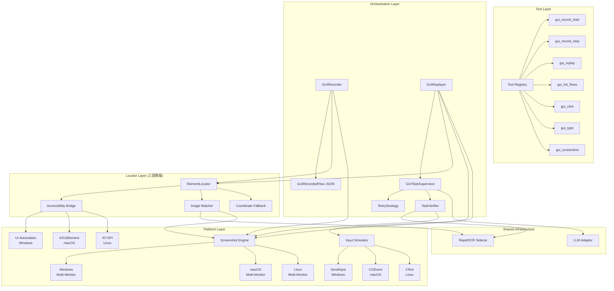

# Design Document: GUI Test Replay

## Overview

本设计为 maclaw 增加原生 GUI 应用（非 Web）的测试录制与重放能力，同时修复多显示器截图缺陷。整体架构复用现有浏览器录制/重放的分层模式（Recorder → Replayer → TaskSupervisor），但将底层操作从 CDP/DOM 替换为三层混合定位策略：Accessibility API → 图像/OCR 匹配 → 屏幕坐标。

核心设计决策：
- **复用而非重写**：GUI 录制/重放与浏览器录制/重放共享 TaskSupervisor 的暂停/恢复/重试框架，通过接口抽象差异
- **渐进降级**：三层定位策略（Accessibility → Image → Coords）确保即使目标应用无障碍支持不完善也能工作
- **平台隔离**：通过 Go build tags 隔离 Windows/macOS/Linux 的平台特定实现，统一接口层

## Architecture



### 关键架构决策

1. **ElementLocator 统一入口**：GUIReplayer 不直接调用 Accessibility/Image/Coords，而是通过 ElementLocator 接口统一调度，内部按优先级逐级尝试。这样 Replayer 逻辑保持简洁，定位策略可独立演进。

2. **GUITaskSupervisor 复用模式**：不继承 BrowserTaskSupervisor，而是提取共享接口 `TaskExecutor`，两者各自实现。共享的暂停/恢复/重试/检查点逻辑通过组合（embedding）复用。

3. **截图快照外部存储**：录制时截图保存为独立 PNG 文件（`~/.maclaw/gui_flows/<flow_name>/snapshots/`），JSON 中仅存文件引用路径。避免 JSON 文件膨胀，便于版本控制。

4. **平台代码隔离**：每个平台特定实现放在独立的 `_windows.go` / `_darwin.go` / `_linux.go` 文件中，通过 build tags 编译。公共接口定义在无 build tag 的文件中。

## Components and Interfaces

### 1. Screenshot Engine（多显示器修复）

修改现有 `corelib/remote/screenshot_command.go` 及平台文件。

```go
// corelib/remote/screenshot_multimon.go

// DisplayInfo describes a single display/monitor.
type DisplayInfo struct {
    Index  int    `json:"index"`
    Name   string `json:"name"`
    X      int    `json:"x"`       // 虚拟桌面坐标
    Y      int    `json:"y"`
    Width  int    `json:"width"`
    Height int    `json:"height"`
    Scale  float64 `json:"scale"`  // DPI 缩放因子
    Primary bool  `json:"primary"`
}

// EnumDisplays returns all connected displays.
// Platform-specific implementations in _windows.go, _darwin.go, _linux.go.
func EnumDisplays() ([]DisplayInfo, error)

// BuildMultiMonitorScreenshotCommand returns a command that captures
// all monitors into a single stitched PNG.
func BuildMultiMonitorScreenshotCommand() string

// BuildSingleMonitorScreenshotCommand returns a command that captures
// only the specified monitor by index.
func BuildSingleMonitorScreenshotCommand(screenIndex int) string
```

**Windows 实现要点**：
- 使用 `EnumDisplayMonitors` + `GetMonitorInfo` 枚举所有显示器
- 计算虚拟桌面总边界（`SM_XVIRTUALSCREEN`, `SM_YVIRTUALSCREEN`, `SM_CXVIRTUALSCREEN`, `SM_CYVIRTUALSCREEN`）
- `CopyFromScreen` 使用虚拟桌面坐标而非 `PrimaryScreen.Bounds`
- 保留现有 5 级降级链（CopyFromScreen → BitBlt → tscon → PrintWindow → DXGI），但每级都使用虚拟桌面坐标

**macOS 实现要点**：
- `CGGetActiveDisplayList` 枚举显示器
- `CGDisplayBounds` 获取每个显示器的坐标和尺寸
- `CGWindowListCreateImage(CGRectInfinite, ...)` 已天然支持多显示器，但需验证
- 单显示器截图使用 `CGDisplayCreateImage(displayID)`

**Linux 实现要点**：
- X11: `XRRGetScreenResources` + `XRRGetCrtcInfo` 枚举
- Wayland: 通过 `wlr-screencopy` 或 `grim -o <output>` 指定输出
- `scrot` 默认截取整个虚拟桌面（已支持多显示器），`grim` 同理

### 2. Accessibility Bridge

```go
// corelib/accessibility/bridge.go

// Element represents a UI control in the accessibility tree.
type Element struct {
    Role     string    `json:"role"`      // button, textfield, checkbox, etc.
    Name     string    `json:"name"`      // accessible name
    Value    string    `json:"value"`     // current value
    Bounds   Rect      `json:"bounds"`    // screen coordinates
    Children []Element `json:"children,omitempty"`
    Handle   uintptr   `json:"-"`         // platform-specific handle
}

type Rect struct {
    X, Y, Width, Height int
}

// Bridge provides cross-platform accessibility access.
type Bridge interface {
    // EnumElements returns the accessibility tree for the given window.
    EnumElements(windowTitle string) ([]Element, error)
    // FindElement searches for an element by role and name.
    FindElement(windowTitle, role, name string) (*Element, error)
    // ClickElement performs a click on the element.
    ClickElement(el *Element) error
    // TypeInElement types text into the element.
    TypeInElement(el *Element, text string) error
    // GetValue returns the current value of the element.
    GetValue(el *Element) (string, error)
    // Close releases resources.
    Close()
}

// NewBridge creates a platform-specific Bridge.
// Returns a no-op bridge on unsupported platforms.
func NewBridge() Bridge
```

**Windows**: UI Automation COM (`IUIAutomation`, `IUIAutomationElement`)，通过 `go-ole` 或直接 syscall 调用。
**macOS**: `AXUIElementCreateApplication` → `AXUIElementCopyAttributeValue`，通过 CGo 调用。
**Linux**: AT-SPI via D-Bus (`org.a11y.atspi`)，通过 `godbus/dbus` 包。

### 3. Image Matcher

```go
// corelib/guiautomation/image_matcher.go

// MatchResult describes where a reference image was found.
type MatchResult struct {
    Found      bool    `json:"found"`
    X, Y       int     `json:"x,y"`        // center of matched region
    Width      int     `json:"width"`
    Height     int     `json:"height"`
    Confidence float64 `json:"confidence"`  // 0.0 - 1.0
}

// ImageMatcher locates UI elements by image comparison or OCR text.
type ImageMatcher struct {
    ocr        browser.OCRProvider
    screenshotFn func() (string, error) // returns base64 PNG
}

// FindByImage searches for a reference image snippet in the current screen.
func (m *ImageMatcher) FindByImage(refImageB64 string, searchRegion *Rect) (*MatchResult, error)

// FindByText uses OCR to locate text on screen.
func (m *ImageMatcher) FindByText(targetText string, searchRegion *Rect) (*MatchResult, error)
```

图像匹配使用简单的滑动窗口 + 像素差异比较（NCC - Normalized Cross-Correlation），不引入 OpenCV 依赖。对于大多数 GUI 测试场景，OCR 文本匹配是更可靠的降级路径。

### 4. Element Locator（统一定位入口）

```go
// corelib/guiautomation/locator.go

// LocateStrategy describes how an element was located.
type LocateStrategy string

const (
    StrategyAccessibility LocateStrategy = "accessibility"
    StrategyImage         LocateStrategy = "image"
    StrategyCoordinate    LocateStrategy = "coordinate"
)

// LocateResult is the result of element location.
type LocateResult struct {
    Strategy LocateStrategy
    X, Y     int     // screen coordinates for action
    Element  *accessibility.Element // non-nil if found via accessibility
    Confidence float64
}

// ElementLocator tries multiple strategies to find a UI element.
type ElementLocator struct {
    bridge   accessibility.Bridge
    matcher  *ImageMatcher
    logger   func(string)
}

// Locate attempts to find the target element using the three-tier strategy.
func (l *ElementLocator) Locate(step GUIRecordedStep) (*LocateResult, error)
```

### 5. Input Simulator

```go
// corelib/guiautomation/input.go

// InputSimulator provides cross-platform input event simulation.
type InputSimulator interface {
    Click(x, y int) error
    RightClick(x, y int) error
    DoubleClick(x, y int) error
    Type(text string) error
    KeyCombo(keys ...string) error  // e.g. "ctrl", "c"
    Scroll(x, y, deltaX, deltaY int) error
    DragDrop(fromX, fromY, toX, toY int) error
}

// NewInputSimulator creates a platform-specific simulator.
func NewInputSimulator() InputSimulator
```

**Windows**: `SendInput` API (user32.dll)
**macOS**: `CGEventCreateMouseEvent` / `CGEventCreateKeyboardEvent` (CoreGraphics)
**Linux**: XTest extension (`XTestFakeMotionEvent`, `XTestFakeButtonEvent`, `XTestFakeKeyEvent`)

### 6. GUI Recorder

```go
// corelib/guiautomation/recorder.go

type GUIRecorder struct {
    bridge      accessibility.Bridge
    screenshot  func() (string, error)
    locator     *ElementLocator
    recording   bool
    steps       []GUIRecordedStep
    flowDir     string  // ~/.maclaw/gui_flows/
}

func (r *GUIRecorder) Start() error
func (r *GUIRecorder) RecordStep(action, windowTitle string, coords [2]int, text string) error
func (r *GUIRecorder) Stop(name, description string) (*GUIRecordedFlow, error)
func (r *GUIRecorder) ListFlows() ([]GUIRecordedFlow, error)
func (r *GUIRecorder) LoadFlow(name string) (*GUIRecordedFlow, error)
```

### 7. GUI Replayer

```go
// corelib/guiautomation/replayer.go

type GUIReplayer struct {
    supervisor *GUITaskSupervisor
    locator    *ElementLocator
    input      InputSimulator
    llmDecide  func(string) (string, error)
}

func (r *GUIReplayer) Replay(flow *GUIRecordedFlow, overrides map[string]string) (*GUITaskState, error)
```

### 8. GUI Task Supervisor

```go
// corelib/guiautomation/supervisor.go

type GUITaskSupervisor struct {
    // 复用 browser.BrowserTaskSupervisor 的暂停/恢复/取消模式
    tasks     map[string]*guiTaskEntry
    locator   *ElementLocator
    input     InputSimulator
    screenshot func() (string, error)
    ocr       browser.OCRProvider
    retrier   *GUIRetryStrategy
    logger    func(string)
}

func (s *GUITaskSupervisor) Execute(spec GUITaskSpec) (*GUITaskState, error)
func (s *GUITaskSupervisor) Pause(taskID string) error
func (s *GUITaskSupervisor) Resume(taskID string) error
func (s *GUITaskSupervisor) Cancel(taskID string) error
func (s *GUITaskSupervisor) GetState(taskID string) (*GUITaskState, bool)
```

## Data Models

### GUIRecordedFlow

```go
// corelib/guiautomation/types.go

type GUIRecordedFlow struct {
    Name            string             `json:"name"`
    Description     string             `json:"description"`
    RecordedAt      time.Time          `json:"recorded_at"`
    TargetApp       string             `json:"target_app"`       // 目标应用窗口标题
    Steps           []GUIRecordedStep  `json:"steps"`
    SuccessCriteria []GUICriterionSpec `json:"success_criteria,omitempty"`
}

type GUIRecordedStep struct {
    Action       string        `json:"action"`                  // click, type, scroll, drag, keypress
    WindowTitle  string        `json:"window_title"`
    Timestamp    time.Duration `json:"timestamp"`

    // 三层定位信息（录制时同时记录）
    AccessibilityID *AccessibilityRef `json:"accessibility,omitempty"` // 层1: 控件标识
    SnapshotRef     string            `json:"snapshot_ref,omitempty"`  // 层2: 截图文件路径
    Coords          [2]int            `json:"coords"`                  // 层3: 屏幕坐标

    // 操作参数
    Text     string   `json:"text,omitempty"`      // type 操作的文本
    Keys     []string `json:"keys,omitempty"`       // keypress 的按键组合
    DragTo   [2]int   `json:"drag_to,omitempty"`    // drag 操作的目标坐标
    ScrollDY int      `json:"scroll_dy,omitempty"`  // scroll 的垂直偏移
}

type AccessibilityRef struct {
    Role  string `json:"role"`
    Name  string `json:"name"`
    Value string `json:"value,omitempty"`
}

type GUICriterionSpec struct {
    Type    string `json:"type"`     // ocr_contains, window_exists, element_exists
    Pattern string `json:"pattern"`
    Window  string `json:"window,omitempty"`
}

type GUITaskSpec struct {
    ID              string             `json:"id"`
    Description     string             `json:"description"`
    Steps           []GUIStepSpec      `json:"steps"`
    SuccessCriteria []GUICriterionSpec `json:"success_criteria,omitempty"`
    MaxRetries      int                `json:"max_retries"`
    StepTimeout     time.Duration      `json:"step_timeout"`
}

type GUIStepSpec struct {
    Action      string            `json:"action"`
    Params      map[string]string `json:"params"`
    OrigStep    *GUIRecordedStep  `json:"orig_step,omitempty"` // 原始录制步骤（用于定位）
    Timeout     time.Duration     `json:"timeout,omitempty"`
}

type GUITaskState struct {
    ID          string           `json:"id"`
    Status      string           `json:"status"` // running, completed, failed, paused, cancelled
    TotalSteps  int              `json:"total_steps"`
    CurrentStep int              `json:"current_step"`
    RetryCount  int              `json:"retry_count"`
    LastError   string           `json:"last_error,omitempty"`
    StartedAt   time.Time        `json:"started_at"`
    Checkpoints []GUICheckpoint  `json:"checkpoints,omitempty"`
}

type GUICheckpoint struct {
    StepIndex     int       `json:"step_index"`
    Timestamp     time.Time `json:"timestamp"`
    WindowTitle   string    `json:"window_title"`
    ScreenshotB64 string    `json:"screenshot_b64,omitempty"`
    Strategy      string    `json:"strategy"` // 使用了哪种定位策略
}
```

### JSON 文件结构示例

```
~/.maclaw/gui_flows/
  login_test/
    flow.json              # GUIRecordedFlow（不含内联截图）
    snapshots/
      step_001.png         # 步骤1的截图快照
      step_002.png
      step_003.png
```

`flow.json` 中的 `snapshot_ref` 字段引用相对路径：`"snapshot_ref": "snapshots/step_001.png"`


## Correctness Properties

*A property is a characteristic or behavior that should hold true across all valid executions of a system — essentially, a formal statement about what the system should do. Properties serve as the bridge between human-readable specifications and machine-verifiable correctness guarantees.*

### Property 1: Multi-monitor stitched screenshot dimensions

*For any* set of N displays (N ≥ 2) with known positions and dimensions, the stitched screenshot output should have width and height equal to the bounding box of all displays in virtual desktop coordinates.

**Validates: Requirements 1.1**

### Property 2: Single monitor screenshot selection

*For any* set of N displays and any valid screen_index i (0 ≤ i < N), the single-monitor screenshot output dimensions should match display i's width and height.

**Validates: Requirements 1.3**

### Property 3: Out-of-range screen index error

*For any* set of N displays and any screen_index i ≥ N, the screenshot function should return an error whose message contains the actual display count N.

**Validates: Requirements 1.4**

### Property 4: Accessibility element invariants

*For any* Element returned by the Accessibility Bridge, the element should have a non-empty Role string and Bounds with Width > 0 and Height > 0.

**Validates: Requirements 3.2**

### Property 5: Accessibility find consistency

*For any* accessibility tree and any element E in that tree, calling FindElement with E's role and name should return an element with matching role and name.

**Validates: Requirements 3.7**

### Property 6: Recorded step completeness

*For any* GUI operation recorded during an active recording session, the resulting GUIRecordedStep should have a non-empty Action (one of click/type/scroll/drag/keypress), a non-negative Timestamp, a non-empty WindowTitle, and valid Coords (both values ≥ 0).

**Validates: Requirements 4.2, 4.3**

### Property 7: Locator priority ordering

*For any* GUIRecordedStep with all three locator types available (accessibility, image, coords), the ElementLocator should return StrategyAccessibility. When accessibility is unavailable but image matching succeeds, it should return StrategyImage. When both fail, it should return StrategyCoordinate.

**Validates: Requirements 5.2**

### Property 8: Override substitution in replay

*For any* GUIRecordedFlow containing type-action steps and any non-empty overrides map, when the replayer converts the flow to a task spec, steps whose fields match override keys should have their text values replaced with the corresponding override values.

**Validates: Requirements 5.6**

### Property 9: Retry strategy correctness

*For any* failure type and retry count, the GUIRetryStrategy should: (a) allow retry when count < 3, (b) deny retry when count ≥ 3, (c) increase wait time for element-not-found failures, and (d) extend timeout for timeout failures.

**Validates: Requirements 6.1, 6.2**

### Property 10: Task state transitions

*For any* running GUI task, calling Pause should transition it to paused state, calling Resume on a paused task should transition it back to running, and calling Cancel on a running or paused task should transition it to cancelled.

**Validates: Requirements 6.4**

### Property 11: Checkpoint recording

*For any* GUI task with N steps that completes successfully, the final task state should contain exactly N checkpoints, each with a valid StepIndex, non-zero Timestamp, and non-empty Strategy field.

**Validates: Requirements 6.5**

### Property 12: Image matching with confidence threshold

*For any* reference image embedded at a known position within a larger image, the ImageMatcher should find it at the correct position with confidence ≥ 0.6. For any match result with confidence < 0.6, the result's Found field should be false.

**Validates: Requirements 7.1, 7.3, 7.4**

### Property 13: OCR text location

*For any* set of OCR results containing a target text string, FindByText should return a MatchResult with Found=true and coordinates within the bounding box of the OCR result that contains the target text.

**Validates: Requirements 7.2**

### Property 14: Snapshot external storage

*For any* saved GUIRecordedFlow with screenshot snapshots, the JSON file should not contain base64 image data, and each step's snapshot_ref should point to an existing file in the snapshots subdirectory.

**Validates: Requirements 8.2**

### Property 15: Flow JSON round-trip

*For any* valid GUIRecordedFlow object, serializing to JSON and deserializing back should produce an object equivalent to the original (all fields match).

**Validates: Requirements 8.3**

### Property 16: Tool registration completeness

*For any* registered GUI test tool, the tool should have a non-empty Description, and its Tags should include at least "gui" and "test".

**Validates: Requirements 9.2**

### Property 17: GUI tool routing by keywords

*For any* user message containing GUI-related keywords (e.g. "gui", "桌面", "录制", "自动化"), the tool router's DetectGroupTags should return tags that match the GUI test tools' tag set.

**Validates: Requirements 9.3**

## Error Handling

### Screenshot Engine
- 多显示器枚举失败 → 降级为主显示器截图，返回结果附带 `degraded: true` 标记和原因
- 单个显示器截图失败 → 跳过该显示器，拼接其余显示器（如果全部失败则降级到主显示器）
- 截图结果为全黑 → 复用现有 `IsBlankImage` 检测，触发下一级截图方法

### Accessibility Bridge
- COM/AX/D-Bus 初始化失败 → 返回空控件树 + nil error，不阻塞录制/重放
- 单个控件查询超时（>5s）→ 放弃该控件，返回已获取的部分树
- 权限不足（macOS 需要辅助功能权限）→ 返回明确的权限错误提示

### Image Matcher
- OCR sidecar 未启动 → 自动启动（复用现有 `ensureReadyLocked` 机制）
- 图像匹配超时（>10s）→ 返回 MatchResult{Found: false} + timeout error
- 参考图片格式无效 → 返回明确的格式错误

### GUI Recorder
- 录制过程中 Accessibility 获取失败 → 该步骤 AccessibilityID 留空，继续录制
- 录制过程中截图失败 → 该步骤 SnapshotRef 留空，继续录制
- 保存 JSON 时磁盘空间不足 → 返回错误，但保留内存中的 flow 数据供重试

### GUI Replayer / TaskSupervisor
- 三层定位全部失败 → 标记步骤失败，进入重试流程
- 重试 2 次后仍失败 → 构建 LLM 上下文（截图 + OCR 文本 + 失败信息），请求适配建议
- 重试 3 次后仍失败 → 任务标记为 failed，保留所有检查点供诊断
- 任务暂停期间连接断开 → 保持 paused 状态，恢复时重新检查环境

### Input Simulator
- 坐标超出屏幕范围 → 裁剪到最近的屏幕边界
- 输入模拟 API 调用失败 → 返回错误，不静默忽略
- 组合键中包含未知键名 → 返回明确的 "unknown key" 错误

## Testing Strategy

### 单元测试

针对以下场景编写传统单元测试：
- **Screenshot Engine**: 验证 `ParseScreenshotOutput` 对各种格式的 base64 输入的处理、`IsBlankImage` 的边界情况
- **Accessibility Bridge**: 使用 mock bridge 测试 `FindElement` 的搜索逻辑
- **Image Matcher**: 使用预制的测试图片验证匹配算法的基本正确性
- **GUI Recorder**: 测试 Start/RecordStep/Stop 的状态机转换
- **GUI Replayer**: 测试 flowToTaskSpec 的转换逻辑和 override 替换
- **Retry Strategy**: 测试各种失败类型和重试次数的决策逻辑
- **JSON 序列化**: 测试 flow 文件的保存和加载

### 属性测试（Property-Based Testing）

使用 Go 的 `testing/quick` 或 `pgregory.net/rapid` 库进行属性测试。

每个属性测试至少运行 100 次迭代，使用随机生成的输入。

每个测试用注释标注对应的设计属性：
```go
// Feature: gui-test-replay, Property 15: Flow JSON round-trip
func TestFlowJSONRoundTrip(t *testing.T) { ... }
```

属性测试覆盖的核心属性：
- Property 1-3: 多显示器截图维度（使用 mock DisplayInfo 生成器）
- Property 6: 录制步骤完整性（生成随机操作参数）
- Property 7: 定位器优先级（生成随机的 accessibility/image/coords 可用性组合）
- Property 8: Override 替换（生成随机 flow 和 overrides map）
- Property 9: 重试策略（生成随机失败类型和重试次数）
- Property 10: 状态转换（生成随机的 pause/resume/cancel 操作序列）
- Property 11: 检查点记录（生成随机步骤数的任务）
- Property 12-13: 图像/OCR 匹配（生成随机图像和文本）
- Property 15: JSON round-trip（生成随机 GUIRecordedFlow）
- Property 16-17: 工具注册和路由（生成随机用户消息）

### 集成测试

平台特定的集成测试（需要实际 OS 环境）：
- Windows: UI Automation + SendInput 端到端测试
- macOS: AXUIElement + CGEvent 端到端测试
- Linux: AT-SPI + XTest 端到端测试
- 多显示器截图（需要多显示器硬件或虚拟显示器）

这些测试标记为 `//go:build integration`，不在 CI 中自动运行。
