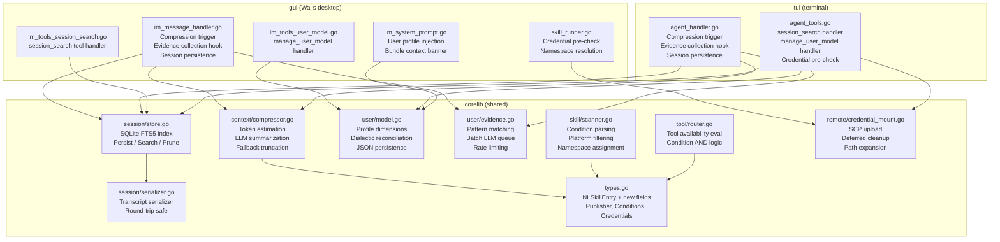

# Design Document: Hermes Advanced Features

## Overview

This feature ports seven additional design patterns from the Hermes Agent project into MacLaw's Go codebase: cross-session full-text search, intelligent context compression, conditional skill activation based on tool availability, credential file mounting for remote execution, plugin skill namespacing, platform-based skill filtering, and dialectic user modeling.

The changes span 7 subsystems across `corelib/`, `gui/`, and `tui/` packages, maintaining GUI/TUI parity and full backward compatibility with existing skills and tools. This is the second batch of Hermes improvements, building on the first batch (knowledge skills, skill patching, security scanning, memory snapshots, atomic writes, nudges).

### Design Decisions

1. **SQLite FTS5 for session search**: Rather than building a custom inverted index or using an external search service, we use SQLite's built-in FTS5 extension. It ships with the `mattn/go-sqlite3` driver, supports CJK text via the `unicode61` tokenizer, provides BM25 ranking out of the box, and keeps the entire search index in a single portable file. No external dependencies or services required.

2. **Character-based token estimation over external tokenizer**: Instead of bundling tiktoken or calling an API for token counting, we use a simple heuristic (4 chars/token English, 1.5 chars/token CJK). This is fast, dependency-free, and accurate enough for compression triggering (±15% error is acceptable since we trigger at 80%, well before the hard limit).

3. **Condition fields on NLSkillEntry over separate condition table**: Tool availability conditions are stored directly on the skill struct rather than in a separate lookup table. This keeps the scanner simple (one YAML parse), avoids join logic in the router, and matches the existing pattern where all skill metadata lives on `NLSkillEntry`.

4. **SCP + deferred cleanup over persistent mount**: Credential files are copied via SCP before execution and deleted after, rather than using SSHFS or persistent mounts. This is simpler, works with any SSH server, and ensures credentials don't persist on remote hosts after use.

5. **Publisher field over directory-based namespacing**: The namespace is stored as a `Publisher` field on `NLSkillEntry` rather than derived from directory structure. This decouples the logical namespace from the filesystem layout and allows renaming publishers without moving files.

6. **Scan-time platform filtering over display-time filtering**: Incompatible skills are filtered during `ScanSkillDir()` rather than at list/display time. This means incompatible skills never enter memory, reducing the tool routing candidate set and preventing accidental execution.

7. **Pattern matching first, LLM second for user modeling**: Evidence collection uses regex/keyword patterns for common signals (language mentions, tool preferences) and only queues ambiguous observations for batch LLM analysis. This keeps per-turn overhead near zero while still handling nuanced signals.

8. **Dialectic reconciliation with confidence decay**: When new evidence contradicts an existing belief, we don't simply overwrite — we synthesize and lower confidence. This prevents a single contradictory signal from destroying a well-established profile dimension while still allowing the model to evolve.

## Architecture



## Components and Interfaces

### 1. Session Search Store (`corelib/session/store.go`)

```go
package session

// Store manages the SQLite FTS5 index for session transcript search.
type Store struct {
    db     *sql.DB
    dbPath string
}

// SessionDocument represents a stored session transcript.
type SessionDocument struct {
    SessionID string    `json:"session_id"`
    Timestamp time.Time `json:"timestamp"`
    Platform  string    `json:"platform"`  // "gui", "tui", "im"
    Topic     string    `json:"topic"`
    FullText  string    `json:"full_text"`
}

// SearchResult represents a single search hit.
type SearchResult struct {
    SessionID string  `json:"session_id"`
    Timestamp string  `json:"timestamp"`
    Platform  string  `json:"platform"`
    Topic     string  `json:"topic"`
    Snippet   string  `json:"snippet"`
    Rank      float64 `json:"rank"`
}

// NewStore opens or creates the FTS5 database at the given path.
func NewStore(dbPath string) (*Store, error)

// Persist stores a session transcript in the FTS5 index.
func (s *Store) Persist(doc SessionDocument) error

// Search performs full-text search, returning ranked results up to maxResults.
func (s *Store) Search(query string, maxResults int) ([]SearchResult, error)

// Prune removes sessions older than the given duration.
func (s *Store) Prune(olderThan time.Duration) (int, error)

// Close closes the database connection.
func (s *Store) Close() error
```

### 2. Session Transcript Serializer (`corelib/session/serializer.go`)

```go
package session

// TranscriptEntry represents a single message in a conversation.
type TranscriptEntry struct {
    Role       string            `json:"role"`        // "user", "assistant", "system", "tool"
    Content    string            `json:"content"`
    ToolCalls  []ToolCallMeta    `json:"tool_calls,omitempty"`
    ToolCallID string            `json:"tool_call_id,omitempty"`
}

type ToolCallMeta struct {
    ID       string `json:"id"`
    Name     string `json:"name"`
    Args     string `json:"args"`
}

// Serialize converts a conversation history into a searchable plain-text format.
// The format preserves role markers, content, and tool call metadata in a
// deterministic, parseable structure.
func Serialize(entries []TranscriptEntry) string

// Deserialize reconstructs the conversation structure from serialized text.
func Deserialize(text string) ([]TranscriptEntry, error)
```

### 3. Context Compressor (`corelib/context/compressor.go`)

```go
package context

// CompressConfig holds compression parameters.
type CompressConfig struct {
    ThresholdRatio    float64 // 0.80 = trigger at 80% of context window
    ProtectedTurns    int     // 5 = don't compress last 5 turns
    MaxContextTokens  int     // from MaclawLLMConfig.EffectiveContextTokens()
}

// CompressResult holds the output of a compression operation.
type CompressResult struct {
    Messages         []Message       // compressed message list
    OriginalTokens   int
    CompressedTokens int
    MarkerText       string          // "[compressed] 12000→4500 tokens (62% reduction)"
}

// Compressor performs intelligent conversation history compression.
type Compressor struct {
    config    CompressConfig
    summarize func(text string) (string, error) // LLM summarization callback
}

// NewCompressor creates a compressor with the given config and LLM callback.
func NewCompressor(config CompressConfig, summarize func(string) (string, error)) *Compressor

// ShouldCompress returns true if the conversation exceeds the threshold.
func (c *Compressor) ShouldCompress(messages []Message) bool

// Compress performs intelligent compression on the message history.
// It preserves the last ProtectedTurns and summarizes older content.
func (c *Compressor) Compress(messages []Message) (*CompressResult, error)

// EstimateTokens estimates the token count of a text string using
// character-based heuristics (4 chars/token English, 1.5 chars/token CJK).
func EstimateTokens(text string) int
```

### 4. User Model (`corelib/user/model.go`)

```go
package user

// Dimension represents a single profile dimension with confidence tracking.
type Dimension struct {
    Value         string      `json:"value"`
    Confidence    float64     `json:"confidence"`     // [0, 1]
    Evidence      []Evidence  `json:"evidence"`
    UserConfirmed bool        `json:"user_confirmed"` // true if explicitly set by user
}

// Evidence records an observation that informed a dimension.
type Evidence struct {
    Observation string    `json:"observation"`
    Timestamp   time.Time `json:"timestamp"`
    Source      string    `json:"source"` // "pattern", "llm", "user"
}

// Profile is the complete user model.
type Profile struct {
    CommunicationStyle Dimension `json:"communication_style"`
    TechnicalLevel     Dimension `json:"technical_level"`
    PreferredLanguages Dimension `json:"preferred_languages"`
    DomainExpertise    Dimension `json:"domain_expertise"`
    WorkPatterns       Dimension `json:"work_patterns"`
    ToolPreferences    Dimension `json:"tool_preferences"`
}

// Model manages the user profile lifecycle.
type Model struct {
    profile  Profile
    filePath string
    mu       sync.RWMutex
}

// NewModel loads or initializes the user profile from the given path.
func NewModel(filePath string) (*Model, error)

// GetProfile returns a snapshot of the current profile.
func (m *Model) GetProfile() Profile

// UpdateDimension applies dialectic reconciliation when new evidence arrives.
// If the new value contradicts the existing value, confidence is lowered.
func (m *Model) UpdateDimension(dimension string, newValue string, evidence Evidence) error

// CorrectDimension sets a dimension to a user-confirmed value (confidence=1.0).
func (m *Model) CorrectDimension(dimension string, value string) error

// ResetDimension clears a dimension back to empty state.
func (m *Model) ResetDimension(dimension string) error

// Save persists the profile to disk.
func (m *Model) Save() error

// FormatForPrompt returns the profile formatted for system prompt injection.
func (m *Model) FormatForPrompt() string
```

### 5. Evidence Collector (`corelib/user/evidence.go`)

```go
package user

// Collector analyzes user messages for profile signals.
type Collector struct {
    model         *Model
    batchQueue    []pendingObservation
    updateCounts  map[string]int // dimension → updates this session
    mu            sync.Mutex
}

// NewCollector creates an evidence collector bound to a user model.
func NewCollector(model *Model) *Collector

// Analyze processes a user message asynchronously (called in goroutine).
// Returns immediately; profile updates happen in background.
func (c *Collector) Analyze(userMessage string)

// FlushBatch processes queued observations via LLM (called every 10 turns or session end).
func (c *Collector) FlushBatch(summarize func(string) (string, error)) error

// ResetSession resets per-session rate limits.
func (c *Collector) ResetSession()
```

### 6. Skill Conditional Activation (extensions to existing modules)

```go
// In corelib/types.go — new fields on NLSkillEntry:
type NLSkillEntry struct {
    // ... existing fields ...
    
    // Tool availability conditions
    RequiresTools       []string `json:"requires_tools,omitempty"`
    FallbackForTools    []string `json:"fallback_for_tools,omitempty"`
    RequiresToolsets    []string `json:"requires_toolsets,omitempty"`
    FallbackForToolsets []string `json:"fallback_for_toolsets,omitempty"`
    
    // Credential file mounting
    RequiredCredentialFiles []string `json:"required_credential_files,omitempty"`
    
    // Plugin namespace
    Publisher string `json:"publisher,omitempty"` // e.g. "lovstudio"
}

// In corelib/skill/scanner.go — new YAML fields:
type SkillYAMLFile struct {
    // ... existing fields ...
    RequiresTools          []string `yaml:"requires_tools,omitempty"`
    FallbackForTools       []string `yaml:"fallback_for_tools,omitempty"`
    RequiresToolsets       []string `yaml:"requires_toolsets,omitempty"`
    FallbackForToolsets    []string `yaml:"fallback_for_toolsets,omitempty"`
    RequiredCredentialFiles []string `yaml:"required_credential_files,omitempty"`
}
```

### 7. Credential Mount (`corelib/remote/credential_mount.go`)

```go
package remote

// CredentialMounter handles SCP upload and cleanup of credential files.
type CredentialMounter struct {
    sshMgr *SSHSessionManager
}

// MountCredentials uploads credential files to the remote host.
// Returns a cleanup function that removes the files.
func (cm *CredentialMounter) MountCredentials(
    sessionID string,
    files []string,
) (cleanup func(), err error)

// ExpandCredentialPath expands ~ and environment variables in a path.
func ExpandCredentialPath(path string) (string, error)

// ValidateCredentialFiles checks that all declared files exist locally.
// Returns a list of missing files (empty if all present).
func ValidateCredentialFiles(files []string) []string
```

## Data Models

### Session Search Database Schema

```sql
-- Main sessions table
CREATE TABLE IF NOT EXISTS sessions (
    session_id TEXT PRIMARY KEY,
    timestamp  TEXT NOT NULL,        -- ISO 8601
    platform   TEXT NOT NULL,        -- "gui", "tui", "im"
    topic      TEXT DEFAULT '',
    full_text  TEXT NOT NULL
);

-- FTS5 virtual table for full-text search
CREATE VIRTUAL TABLE IF NOT EXISTS sessions_fts USING fts5(
    full_text,
    topic,
    content='sessions',
    content_rowid='rowid',
    tokenize='unicode61'
);

-- Triggers to keep FTS index in sync
CREATE TRIGGER sessions_ai AFTER INSERT ON sessions BEGIN
    INSERT INTO sessions_fts(rowid, full_text, topic)
    VALUES (new.rowid, new.full_text, new.topic);
END;

CREATE TRIGGER sessions_ad AFTER DELETE ON sessions BEGIN
    INSERT INTO sessions_fts(sessions_fts, rowid, full_text, topic)
    VALUES ('delete', old.rowid, old.full_text, old.topic);
END;
```

### User Profile JSON Schema (`~/.maclaw/data/user_model.json`)

```json
{
  "communication_style": {
    "value": "concise, prefers code examples over prose",
    "confidence": 0.75,
    "evidence": [
      {"observation": "User consistently asks for 'just show me the code'", "timestamp": "2025-07-10T14:30:00Z", "source": "pattern"},
      {"observation": "User said 'skip the explanation'", "timestamp": "2025-07-11T09:15:00Z", "source": "pattern"}
    ],
    "user_confirmed": false
  },
  "technical_level": {
    "value": "senior, familiar with Go/Python/TypeScript",
    "confidence": 0.85,
    "evidence": [
      {"observation": "Uses advanced Go patterns (generics, context propagation)", "timestamp": "2025-07-10T14:35:00Z", "source": "pattern"}
    ],
    "user_confirmed": false
  },
  "preferred_languages": {
    "value": "Go primary, Python for scripting, TypeScript for frontend",
    "confidence": 0.90,
    "evidence": [
      {"observation": "Mentioned 'Go' in 12 of last 20 sessions", "timestamp": "2025-07-11T10:00:00Z", "source": "pattern"}
    ],
    "user_confirmed": false
  },
  "domain_expertise": { "value": "", "confidence": 0.0, "evidence": [], "user_confirmed": false },
  "work_patterns": { "value": "", "confidence": 0.0, "evidence": [], "user_confirmed": false },
  "tool_preferences": { "value": "", "confidence": 0.0, "evidence": [], "user_confirmed": false }
}
```

### Transcript Serialization Format

```
[session:abc123 platform:gui timestamp:2025-07-10T14:30:00Z]
---
[user]
How do I implement a BFS in Go?
---
[assistant]
Here's a BFS implementation...
---
[tool_call:call_001 name:write_file]
{"path": "bfs.go", "content": "package main..."}
---
[tool_result:call_001]
File written successfully.
---
[assistant]
I've created bfs.go with the implementation.
---
```

### Toolset Group Definitions

```go
// ToolsetGroups maps toolset names to their constituent tool names.
var ToolsetGroups = map[string][]string{
    "coding":  {"create_session", "send_and_observe", "list_sessions", "get_session_output", "send_input", "interrupt_session", "kill_session", "control_session", "get_session_events"},
    "browser": allBrowserToolNames,
    "ssh":     {"ssh"},
}
```

## Correctness Properties

*A property is a characteristic or behavior that should hold true across all valid executions of a system — essentially, a formal statement about what the system should do. Properties serve as the bridge between human-readable specifications and machine-verifiable correctness guarantees.*

### Property 1: Transcript serialization round-trip

*For any* valid conversation history ([]TranscriptEntry with valid roles, non-empty content, and optional tool call metadata), serializing then deserializing SHALL produce an equivalent conversation structure preserving all roles, content, and tool call metadata.

**Validates: Requirements 12.1, 12.2, 12.3, 12.4**

### Property 2: FTS5 search returns only matching sessions

*For any* set of indexed session documents and any search query that is a substring of at least one document's full_text, the search results SHALL contain only sessions whose full_text or topic contains the query terms, and the result count SHALL NOT exceed the configured maximum.

**Validates: Requirements 1.2, 1.7, 1.11**

### Property 3: Token estimation follows heuristic formula

*For any* text string containing a mix of ASCII and CJK characters, `EstimateTokens(text)` SHALL return a value equal to `ceil(asciiChars/4) + ceil(cjkChars/1.5)` (±1 for rounding).

**Validates: Requirements 9.1**

### Property 4: Compression preserves recent turns and chronological order

*For any* conversation history with more than 5 turns that exceeds the compression threshold, after compression: (a) the last 5 turns SHALL be unchanged, (b) all messages SHALL maintain their original chronological order, and (c) a Compressed_Marker with token ratio SHALL be present.

**Validates: Requirements 2.8, 2.9, 2.12**

### Property 5: Skill activation respects tool availability conditions (AND logic)

*For any* skill with tool availability conditions (requires_tools, fallback_for_tools, requires_toolsets, fallback_for_toolsets) and any tool availability state: the skill activates if and only if (keyword triggers match) AND (all requires_tools are available) AND (all fallback_for_tools are unavailable) AND (all requires_toolsets are available) AND (all fallback_for_toolsets are unavailable). Skills with no conditions activate on keyword match alone.

**Validates: Requirements 3.2, 3.3, 3.4, 3.5, 3.7, 3.8**

### Property 6: YAML condition field parsing round-trip

*For any* valid skill YAML containing the four condition fields and required_credential_files, parsing via `ParseSkillYAMLFile` SHALL populate the corresponding fields on `SkillYAMLFile` with the exact values from the YAML source.

**Validates: Requirements 3.6, 4.2**

### Property 7: Credential file validation detects all missing files

*For any* list of credential file paths (with ~ and env var expansion), `ValidateCredentialFiles` SHALL return exactly the subset of paths that do not exist on the local filesystem after expansion.

**Validates: Requirements 4.3, 10.1, 10.2, 10.3**

### Property 8: Credential cleanup always executes

*For any* credential mount operation that successfully uploads files to a remote host, the cleanup function SHALL be called regardless of whether the subsequent skill execution succeeds or fails, removing all uploaded files.

**Validates: Requirements 4.6**

### Property 9: Qualified name resolution with precedence

*For any* skill with a Publisher field, `MatchesName` SHALL match: (a) the full qualified name `publisher:name`, (b) the bare name when no collision exists, (c) the DirName, and (d) the SkillDir basename. When two skills share a bare name but have different publishers, qualified name lookup SHALL return the correct skill and bare name lookup SHALL signal ambiguity.

**Validates: Requirements 5.6, 5.7, 5.8, 5.9**

### Property 10: Platform filtering excludes incompatible skills

*For any* skill with a non-empty `platforms` field and any target OS, the skill SHALL be included in scan results if and only if the target OS (mapped via GOOS→platform) is in the skill's platforms list. Skills with empty platforms SHALL always be included.

**Validates: Requirements 6.2, 6.3**

### Property 11: Dialectic reconciliation lowers confidence on contradiction

*For any* profile dimension with an existing value and confidence > 0, when `UpdateDimension` is called with a contradicting value, the resulting confidence SHALL be strictly lower than the original confidence, and both old and new evidence SHALL be recorded.

**Validates: Requirements 7.4, 7.5**

### Property 12: User correction sets confidence to 1.0

*For any* profile dimension with any existing confidence value, when `CorrectDimension` is called, the resulting confidence SHALL be exactly 1.0 and `UserConfirmed` SHALL be true.

**Validates: Requirements 7.9**

### Property 13: User profile JSON persistence round-trip

*For any* valid Profile struct, saving to JSON then loading from the same file SHALL produce an equivalent Profile with all dimension values, confidence scores, and evidence lists preserved.

**Validates: Requirements 7.10**

### Property 14: Evidence collection rate limiting

*For any* session where the evidence collector receives N > 1 signals for the same dimension, at most one profile update SHALL be applied to that dimension during the session.

**Validates: Requirements 11.5**

### Property 15: Session topic extraction

*For any* conversation history where the first user message has content of length L, the extracted topic SHALL be the first `min(L, 100)` characters of that first user message.

**Validates: Requirements 8.4**

### Property 16: Session pruning removes only expired sessions

*For any* set of stored sessions with varying timestamps and a prune threshold T, calling `Prune(T)` SHALL remove exactly those sessions whose timestamp is older than `now - T`, leaving all newer sessions intact.

**Validates: Requirements 8.5**

## Error Handling

### Session Search

| Error Condition | Handling Strategy |
|---|---|
| SQLite DB file missing | Auto-create on first access (Req 1.8) |
| FTS5 query syntax error | Escape special characters, retry as phrase query |
| LLM summarization timeout | Return raw snippets without summarization |
| No results found | Return structured "no results" message (Req 1.10) |
| DB corruption | Log error, attempt VACUUM; if fails, recreate DB |

### Context Compressor

| Error Condition | Handling Strategy |
|---|---|
| LLM summarization fails | Fall back to simple truncation (Req 2.10) |
| Token estimation overflow | Cap at MaxInt; trigger compression |
| Empty conversation | No-op, return original messages |
| All messages within protected window | No-op, return original messages |

### Credential Mounting

| Error Condition | Handling Strategy |
|---|---|
| Credential file missing locally | Return `setup_needed` with guidance (Req 4.4) |
| SCP upload fails | Abort skill execution, return error |
| Cleanup fails (remote delete) | Log warning, do not fail the skill result |
| Path expansion fails (bad env var) | Return error identifying the problematic path |
| Permission denied on local file | Return `setup_needed` with permission guidance |

### User Model

| Error Condition | Handling Strategy |
|---|---|
| Profile JSON corrupted | Log error, initialize fresh profile |
| Concurrent write conflict | Mutex serialization (sync.RWMutex) |
| Pattern matching panic | Recover in goroutine, log, skip update |
| Batch LLM analysis fails | Discard queued observations, log warning |

### Plugin Namespace

| Error Condition | Handling Strategy |
|---|---|
| Bare name collision (ambiguous) | Return error listing qualified alternatives |
| Publisher metadata missing from Hub | Use "unknown" as publisher prefix |
| Qualified name not found | Fall back to bare name search |

## Testing Strategy

### Property-Based Tests (fast-check for Go)

The project will use [`pgregory.net/rapid`](https://github.com/flyingmutant/rapid) for property-based testing in Go. Each property test runs a minimum of 100 iterations.

| Property | Test File | Key Generators |
|---|---|---|
| P1: Transcript round-trip | `corelib/session/serializer_prop_test.go` | Random []TranscriptEntry with varied roles, content lengths, tool calls |
| P2: FTS5 search correctness | `corelib/session/store_prop_test.go` | Random session documents, substring queries |
| P3: Token estimation | `corelib/context/compressor_prop_test.go` | Random mixed ASCII/CJK strings |
| P4: Compression invariants | `corelib/context/compressor_prop_test.go` | Random conversation histories exceeding threshold |
| P5: Skill activation logic | `corelib/tool/router_conditions_prop_test.go` | Random skills with conditions, random tool availability |
| P6: YAML parsing | `corelib/skill/scanner_prop_test.go` | Random valid YAML with condition fields |
| P7: Credential validation | `corelib/remote/credential_mount_prop_test.go` | Random file paths, random filesystem state |
| P8: Credential cleanup | `corelib/remote/credential_mount_prop_test.go` | Random execution outcomes (success/failure/panic) |
| P9: Name resolution | `corelib/types_prop_test.go` | Random skills with/without publishers, collision scenarios |
| P10: Platform filtering | `corelib/skill/scanner_prop_test.go` | Random platform sets, random GOOS values |
| P11: Reconciliation confidence | `corelib/user/model_prop_test.go` | Random existing dimensions, contradicting values |
| P12: User correction | `corelib/user/model_prop_test.go` | Random dimensions with various confidences |
| P13: Profile round-trip | `corelib/user/model_prop_test.go` | Random Profile structs |
| P14: Rate limiting | `corelib/user/evidence_prop_test.go` | Random signal sequences for same dimension |
| P15: Topic extraction | `corelib/session/store_prop_test.go` | Random conversation histories |
| P16: Session pruning | `corelib/session/store_prop_test.go` | Random session sets with varied timestamps |

Each property test is tagged with:
```go
// Feature: hermes-advanced-features, Property N: <property text>
```

### Unit Tests (example-based)

- Session search: DB creation, empty query, special characters in query
- Compressor: /compress command handling, LLM failure fallback
- Credential mount: tilde expansion on each OS, env var expansion
- Namespace: Hub install assigns publisher, local skill has no prefix, list grouping
- Platform: GOOS mapping (darwin→macos, windows→windows, linux→linux)
- User model: fresh initialization, manage_user_model tool actions (view/correct/reset)

### Integration Tests

- Session persistence from agent loop (GUI and TUI)
- LLM summarization call during search
- SCP upload/cleanup via SSH mock
- Evidence collection async behavior (goroutine non-blocking)
- Bundle context banner injection during skill execution

### GUI/TUI Parity Verification

Each feature has a parity checklist:
- Session search: both write to same DB, both register `session_search` tool
- Compressor: both call `corelib/context/compressor.go`
- Credentials: both implement pre-execution check via `ValidateCredentialFiles`
- Namespace: both use `MatchesName` for resolution
- Platform: both use `ScanSkillDir` (filtering happens in corelib)
- User model: both read/write same JSON file, both inject same prompt section
