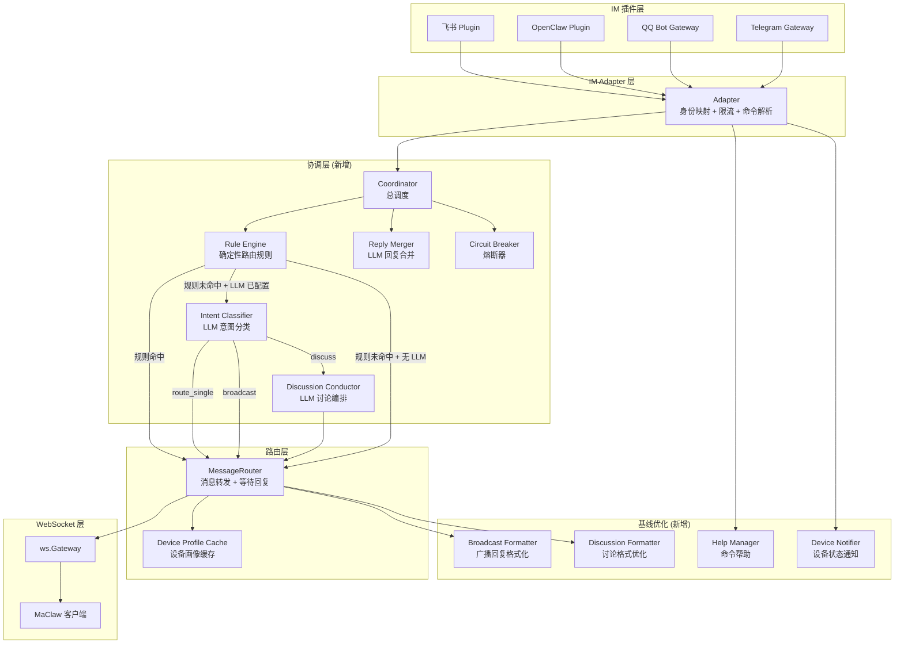
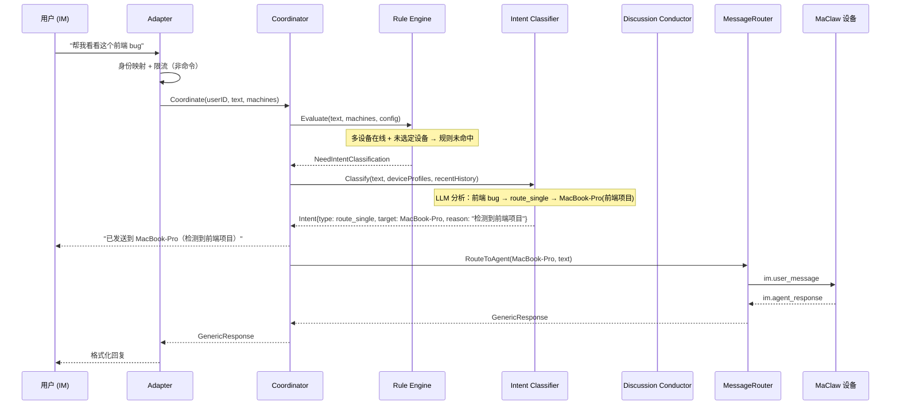
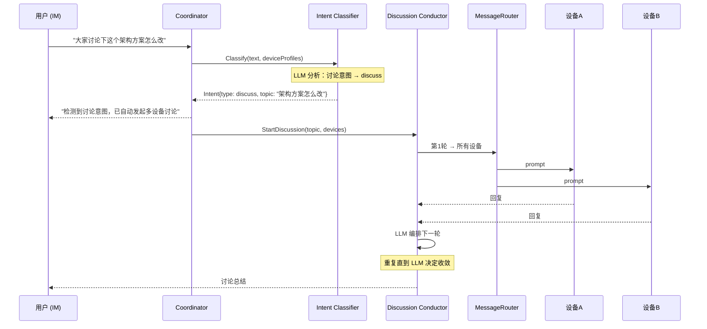

# 技术设计文档：Hub LLM 协调器 + 群聊基线优化

## 概述

本设计文档描述 Hub 服务端的两大改进方向：(1) 引入可选的 LLM 协调层，将 Hub 从"哑管道"升级为"智能中枢"，实现无感多设备体验；(2) 优化无 LLM 场景下的多设备交互基线体验。设计基于现有 Go 代码库（`hub/internal/im/` 包），在不破坏现有架构的前提下进行增量扩展。

### 设计决策

1. **LLM 意图分类是 primary，命令系统是 fallback**：有 LLM 时，用户无需记任何命令，所有非命令消息都经过 Intent_Classifier 自动决策走单聊/广播/讨论。命令仍然有效，作为手动覆盖。
2. **复用 `corelib/agent.DoSimpleLLMRequest`**：Hub LLM client 不重新造轮子，直接复用现有的 OpenAI/Anthropic 兼容 client，自带 `User-Agent: OpenClaw/1.0`，可对接龙虾等 OpenClaw 包月套餐。
3. **Coordinator 插入在 Adapter 和 MessageRouter 之间**：不修改两端的公共 API，Coordinator 作为中间层拦截消息流，决策后调用 MessageRouter 的现有方法。
4. **规则引擎零延迟优先**：显式命令、@指定、单设备（开关关闭时）等场景走规则引擎，纯内存操作，不触发 LLM。
5. **单设备 LLM 路由可选**：`smart_route_single_device` 开关默认关闭（单设备直接转发零延迟），可打开体验 LLM 意图分类效果。
6. **基线优化独立于 LLM**：广播格式、讨论结构、命令帮助、设备通知等改进在无 LLM 场景下也生效。

### 设计原则

- **LLM 是增强层，不是依赖层**：规则引擎优先，LLM 仅在规则无法决策时介入
- **增量扩展**：新组件通过接口与现有代码集成，不修改 MessageRouter 和 Adapter 的公共 API 签名
- **关注点分离**：每个子系统独立文件，通过 Bootstrap 组合注入

## 架构

### 高层架构



### 无感智能模式消息流程



### 自动讨论触发流程



## 组件与接口

### 1. HubLLMConfig（LLM 配置）

持久化到 `system_settings` 表，key: `hub_llm_config`。

```go
// HubLLMConfig Hub 侧 LLM 配置
type HubLLMConfig struct {
    Enabled                bool   `json:"enabled"`
    APIURL                 string `json:"api_url"`      // API Base URL（如 https://api.deepseek.com/v1）
    APIKey                 string `json:"api_key"`
    Model                  string `json:"model"`        // 如 deepseek-chat
    Protocol               string `json:"protocol"`     // "openai"(默认) 或 "anthropic"
    SmartRouteSingleDevice bool   `json:"smart_route_single_device"` // 单设备也走 LLM 意图分类，默认 false
}

// ToMaclawLLMConfig 转换为 corelib 的 LLM 配置格式，复用 DoSimpleLLMRequest
func (c *HubLLMConfig) ToMaclawLLMConfig() corelib.MaclawLLMConfig {
    return corelib.MaclawLLMConfig{
        URL:      c.APIURL,
        Key:      c.APIKey,
        Model:    c.Model,
        Protocol: c.Protocol,
    }
}
```

### 2. Coordinator（协调器核心）

新文件：`hub/internal/im/coordinator.go`

Coordinator 是消息处理的中间层，位于 Adapter 和 MessageRouter 之间。Adapter 的 `HandleMessage` 在命令解析后，将非命令消息交给 Coordinator 处理。

```go
// Coordinator 消息协调器
type Coordinator struct {
    router         *MessageRouter
    devices        DeviceFinder
    ruleEngine     *RuleEngine
    intentClassifier *IntentClassifier
    conductor      *DiscussionConductor
    replyMerger    *ReplyMerger
    breaker        *CircuitBreaker
    configProvider func() *HubLLMConfig // 从 system_settings 动态读取

    mu             sync.RWMutex
    deviceProfiles map[string][]DeviceProfile // userID → profiles
}

// NewCoordinator 创建协调器
func NewCoordinator(router *MessageRouter, devices DeviceFinder, configProvider func() *HubLLMConfig) *Coordinator

// Coordinate 协调消息路由（Adapter 调用此方法替代直接调用 RouteToAgent）
// 返回 GenericResponse 给 Adapter 进行格式化和发送
func (c *Coordinator) Coordinate(ctx context.Context, userID, platformName, platformUID, text string) (*GenericResponse, error)

// IsLLMEnabled 检查 LLM 是否已配置且可用（未熔断）
func (c *Coordinator) IsLLMEnabled() bool

// GetLLMStatus 返回 LLM 健康状态：normal / circuit_open / not_configured
func (c *Coordinator) GetLLMStatus() string

// UpdateDeviceProfile 更新设备画像缓存
func (c *Coordinator) UpdateDeviceProfile(userID string, profile DeviceProfile)

// RemoveDeviceProfile 设备离线时清除画像
func (c *Coordinator) RemoveDeviceProfile(userID, machineID string)
```

### 3. RuleEngine（规则引擎）

新文件：`hub/internal/im/rule_engine.go`

纯内存操作，零 I/O，零延迟。

```go
// RouteAction 规则引擎的路由决策类型
type RouteAction string

const (
    ActionRouteToTarget     RouteAction = "route_to_target"     // 路由到指定设备
    ActionBroadcast         RouteAction = "broadcast"           // 广播到所有设备
    ActionNeedClassification RouteAction = "need_classification" // 需要 LLM 意图分类
    ActionPassthrough       RouteAction = "passthrough"         // 降级为现有逻辑
)

// RouteDecision 路由决策结果
type RouteDecision struct {
    Action   RouteAction
    TargetID string // ActionRouteToTarget 时有效
    Reason   string // 人类可读的决策理由
}

// RuleEngine 确定性规则引擎
type RuleEngine struct{}

// Evaluate 评估消息，返回路由决策
// 规则优先级：
// 1. @昵称 前缀 → route_to_target
// 2. 单设备 + smart_route_single_device=false → route_to_target
// 3. 已选定设备（非广播模式）→ route_to_target
// 4. 广播模式 → broadcast
// 5. 以上均未命中 → need_classification（有 LLM）或 passthrough（无 LLM）
func (e *RuleEngine) Evaluate(text string, machines []OnlineMachineInfo, selectedMachine string, llmEnabled bool, smartRouteSingle bool) RouteDecision
```

### 4. IntentClassifier（LLM 意图分类器）

新文件：`hub/internal/im/intent_classifier.go`

无感智能模式的核心。对每条非命令消息调用 LLM 进行意图分类。

```go
// IntentType LLM 意图分类结果
type IntentType string

const (
    IntentRouteSingle      IntentType = "route_single"      // 发给指定设备
    IntentBroadcast        IntentType = "broadcast"          // 广播到所有设备
    IntentDiscuss          IntentType = "discuss"            // 发起多轮讨论
    IntentNeedClarification IntentType = "need_clarification" // 需要用户补充
)

// IntentResult LLM 意图分类结果
type IntentResult struct {
    Type     IntentType `json:"type"`
    TargetID string     `json:"target_id,omitempty"` // route_single 时的目标设备 ID
    Topic    string     `json:"topic,omitempty"`     // discuss 时提取的话题
    Reason   string     `json:"reason"`              // 人类可读的决策理由
    Message  string     `json:"message,omitempty"`   // need_clarification 时的提示消息
}

// IntentClassifier LLM 意图分类器
type IntentClassifier struct {
    configProvider func() *HubLLMConfig
    breaker        *CircuitBreaker
    client         *http.Client

    mu    sync.Mutex
    cache []intentCacheEntry // 最近 10 条缓存
}

// intentCacheEntry 意图分类缓存条目
type intentCacheEntry struct {
    UserID     string
    MachineSet string // 排序后的 machineID 拼接，用于判断设备集合是否变化
    TextHash   uint64 // 消息文本的 hash
    Result     IntentResult
    CreatedAt  time.Time
}

// Classify 对消息进行意图分类
// 输入：用户消息 + 设备画像 + 最近 3 条路由历史
// 输出：IntentResult
// 超时 5 秒，超时降级为 broadcast
func (ic *IntentClassifier) Classify(ctx context.Context, text string, profiles []DeviceProfile, recentHistory []routeHistoryEntry) (*IntentResult, error)
```

LLM Prompt 模板（意图分类）：

```
你是一个消息路由助手。用户有多台开发设备在线，你需要根据消息内容和设备信息判断消息应该发给谁。

在线设备：
{{range .Profiles}}
- {{.Name}}: 项目={{.ProjectPath}}, 语言={{.Language}}, 框架={{.Framework}}, 活跃Session={{.ActiveSessions}}
{{end}}

最近路由历史：
{{range .RecentHistory}}
- "{{.Text}}" → {{.Target}} ({{.Reason}})
{{end}}

用户消息：{{.Text}}

请以 JSON 格式返回分类结果，type 为以下之一：
- "route_single": 发给指定设备（需提供 target_id 和 reason）
- "broadcast": 广播到所有设备（需提供 reason）
- "discuss": 发起多设备讨论（需提供 topic 和 reason）
- "need_clarification": 无法判断（需提供 message 提示用户）

仅返回 JSON，不要其他内容。
```

### 5. DiscussionConductor（LLM 讨论编排）

新文件：`hub/internal/im/discussion_conductor.go`

替代现有 `discussion.go` 中的机械式轮次逻辑（LLM 已配置时）。

```go
// DiscussionConductor LLM 驱动的讨论编排器
type DiscussionConductor struct {
    configProvider func() *HubLLMConfig
    breaker        *CircuitBreaker
    router         *MessageRouter
    client         *http.Client
}

// ConductedDiscussionState LLM 编排的讨论状态
type ConductedDiscussionState struct {
    Topic         string
    Devices       []OnlineMachineInfo
    Rounds        []ConductedRound
    MaxRounds     int // 默认 10
    Running       bool
    StopCh        chan struct{}
    UserInputCh   chan string
    HistorySummary string // 历史讨论摘要（从 discussion_history 检索）
}

// ConductedRound 一轮讨论的记录
type ConductedRound struct {
    Number    int
    Action    string            // "ask_all", "ask_specific", "cross_review", "summarize", "conclude"
    TargetIDs []string          // 本轮参与的设备
    Prompt    string            // 本轮发给设备的 prompt
    Replies   map[string]string // machineID → reply
    Summary   string            // 本轮小结
}

// StartConductedDiscussion 启动 LLM 编排的讨论
func (dc *DiscussionConductor) StartConductedDiscussion(ctx context.Context, userID, platformName, platformUID, topic string, devices []OnlineMachineInfo) *GenericResponse

// runConductedDiscussion 后台执行讨论循环
// 每轮结束后调用 LLM 决定下一步：
// - ask_specific: 向指定设备追问
// - cross_review: 要求设备 A 评价设备 B 的观点
// - summarize: 生成阶段性总结
// - conclude: 结束讨论，生成最终总结
func (dc *DiscussionConductor) runConductedDiscussion(userID, platformName, platformUID string, state *ConductedDiscussionState)
```

### 6. ReplyMerger（回复合并器）

新文件：`hub/internal/im/reply_merger.go`

广播模式下，收集所有设备回复后由 LLM 合并。

```go
// ReplyMerger LLM 回复合并器
type ReplyMerger struct {
    configProvider func() *HubLLMConfig
    breaker        *CircuitBreaker
    client         *http.Client
}

// MergeReplies 合并多设备回复
// 策略：
// 1. 只有 1 个回复 → 直接返回
// 2. 多个回复高度相似（前 100 字符相同）→ 返回第一个 + "其他设备观点一致"
// 3. 多个不同回复 + LLM 可用 → 调用 LLM 合并
// 4. 多个不同回复 + LLM 不可用 → 使用 BroadcastFormatter 结构化格式
func (rm *ReplyMerger) MergeReplies(ctx context.Context, replies []DeviceReply) (*GenericResponse, error)

// DeviceReply 单台设备的回复
type DeviceReply struct {
    Name     string
    MachineID string
    Response *GenericResponse
    Err      error
}
```

### 7. CircuitBreaker（熔断器）

新文件：`hub/internal/im/circuit_breaker.go`

```go
// CircuitBreaker LLM 调用熔断器
type CircuitBreaker struct {
    mu              sync.Mutex
    consecutiveFails int
    openUntil       time.Time
    threshold       int           // 连续失败阈值，默认 3
    cooldown        time.Duration // 熔断冷却时间，默认 5 分钟
}

// Allow 检查是否允许 LLM 调用
func (cb *CircuitBreaker) Allow() bool

// RecordSuccess 记录成功调用
func (cb *CircuitBreaker) RecordSuccess()

// RecordFailure 记录失败调用，达到阈值时触发熔断
func (cb *CircuitBreaker) RecordFailure()

// IsOpen 返回熔断器是否处于打开状态
func (cb *CircuitBreaker) IsOpen() bool

// Status 返回状态字符串：normal / circuit_open
func (cb *CircuitBreaker) Status() string
```

### 8. DeviceProfile（设备画像）

扩展现有 `OnlineMachineInfo`，增加项目上下文信息。

```go
// DeviceProfile 设备画像（客户端上报）
type DeviceProfile struct {
    MachineID      string   `json:"machine_id"`
    Name           string   `json:"name"`
    LLMConfigured  bool     `json:"llm_configured"`
    ProjectPath    string   `json:"project_path,omitempty"`
    Language       string   `json:"language,omitempty"`       // 主要语言
    Framework      string   `json:"framework,omitempty"`      // 主要框架
    ActiveSessions []string `json:"active_sessions,omitempty"` // 活跃 session ID 列表
}

// DeviceProfileCache 设备画像内存缓存
type DeviceProfileCache struct {
    mu       sync.RWMutex
    profiles map[string]map[string]DeviceProfile // userID → machineID → profile
}

// Update 更新设备画像
func (c *DeviceProfileCache) Update(userID string, profile DeviceProfile)

// Remove 移除设备画像（设备离线时）
func (c *DeviceProfileCache) Remove(userID, machineID string)

// GetAll 获取用户所有在线设备的画像
func (c *DeviceProfileCache) GetAll(userID string) []DeviceProfile
```

### 9. 基线优化组件

#### 9.1 HelpManager（命令帮助）

在 `hub/internal/im/core.go` 的 Adapter 中新增 `/help` 命令处理。

```go
// BuildHelpMessage 根据用户当前状态生成帮助消息
// - 单设备用户：不显示 /call all 和 /discuss
// - 广播模式：提示 /call <name> 切回单聊
// - LLM 已配置：提示无感智能模式已启用
func BuildHelpMessage(machineCount int, selectedMachine string, llmEnabled bool) string
```

#### 9.2 BroadcastFormatter（广播回复格式化）

改进 `routeBroadcast` 的回复格式。

```go
// FormatBroadcastReply 格式化广播回复
// - 结构化分隔线 + 设备名称标题
// - 相似回复去重（前 100 字符比较）
// - 末尾摘要统计
// - 错误信息集中在末尾
func FormatBroadcastReply(replies []DeviceReply) string
```

#### 9.3 DiscussionFormatter（讨论格式优化）

改进 `runDiscussion` 的输出格式。

```go
// FormatRoundSummary 生成每轮的简要小结
func FormatRoundSummary(round int, results []discussionRoundResult) string

// FormatDiscussionSummary 生成结构化的讨论总结
// 分为：共识点、分歧点、待定事项
func FormatDiscussionSummary(topic string, allRoundTexts []string) string
```

#### 9.4 DeviceNotifier（设备状态通知）

新文件：`hub/internal/im/device_notifier.go`

```go
// DeviceNotifier 设备上下线通知
type DeviceNotifier struct {
    adapter     *Adapter
    coordinator *Coordinator

    mu          sync.Mutex
    debounce    map[string]*debounceEntry // machineID → pending notification
    activeUsers map[string]string         // userID → platformName（有过 IM 交互的用户）
}

// debounceEntry 防抖条目
type debounceEntry struct {
    machineID string
    name      string
    online    bool
    timer     *time.Timer
}

// NotifyDeviceOnline 设备上线通知（30 秒防抖）
func (dn *DeviceNotifier) NotifyDeviceOnline(userID, machineID, name string)

// NotifyDeviceOffline 设备离线通知（30 秒防抖）
func (dn *DeviceNotifier) NotifyDeviceOffline(userID, machineID, name string)

// MarkUserActive 标记用户有过 IM 交互（只通知活跃用户）
func (dn *DeviceNotifier) MarkUserActive(userID, platformName, platformUID string)
```

## 数据模型

### HubLLMConfig（持久化）

```go
// 存储在 system_settings 表，key: "hub_llm_config"
type HubLLMConfig struct {
    Enabled                bool   `json:"enabled"`
    APIURL                 string `json:"api_url"`
    APIKey                 string `json:"api_key"`
    Model                  string `json:"model"`
    Protocol               string `json:"protocol"`                  // "openai" | "anthropic"
    SmartRouteSingleDevice bool   `json:"smart_route_single_device"` // 默认 false
}
```

### DeviceProfile（内存缓存）

```go
type DeviceProfile struct {
    MachineID      string   `json:"machine_id"`
    Name           string   `json:"name"`
    LLMConfigured  bool     `json:"llm_configured"`
    ProjectPath    string   `json:"project_path,omitempty"`
    Language       string   `json:"language,omitempty"`
    Framework      string   `json:"framework,omitempty"`
    ActiveSessions []string `json:"active_sessions,omitempty"`
}
```

### IntentResult（LLM 返回）

```go
type IntentResult struct {
    Type     IntentType `json:"type"`      // route_single | broadcast | discuss | need_clarification
    TargetID string     `json:"target_id,omitempty"`
    Topic    string     `json:"topic,omitempty"`
    Reason   string     `json:"reason"`
    Message  string     `json:"message,omitempty"`
}
```

### DiscussionHistory（持久化）

```go
// 存储在 system_settings 表，key: "discussion_history_{userID}"
type DiscussionHistory struct {
    Entries []DiscussionSummaryEntry `json:"entries"`
}

type DiscussionSummaryEntry struct {
    Topic      string   `json:"topic"`
    Devices    []string `json:"devices"`
    Consensus  []string `json:"consensus"`   // 共识点
    Divergence []string `json:"divergence"`  // 分歧点
    Pending    []string `json:"pending"`     // 待定事项
    Timestamp  int64    `json:"timestamp"`
}
```

## Bootstrap 集成

在 `hub/internal/app/bootstrap.go` 中新增 Coordinator 的创建和注入：

```go
// 在现有 MessageRouter 创建之后：

// Hub LLM Coordinator
llmConfigProvider := func() *im.HubLLMConfig {
    raw, err := st.System.Get(context.Background(), "hub_llm_config")
    if err != nil || raw == "" {
        return nil
    }
    var cfg im.HubLLMConfig
    if json.Unmarshal([]byte(raw), &cfg) != nil {
        return nil
    }
    if !cfg.Enabled {
        return nil
    }
    return &cfg
}

coordinator := im.NewCoordinator(messageRouter, deviceFinder, llmConfigProvider)

// 将 Adapter 的消息处理指向 Coordinator
// Adapter.HandleMessage 中非命令消息调用 coordinator.Coordinate() 替代 messageRouter.RouteToAgent()
imAdapter.SetCoordinator(coordinator)

// 设备状态通知
deviceNotifier := im.NewDeviceNotifier(imAdapter, coordinator)
gateway.SetDeviceNotifier(deviceNotifier)
```

## 正确性属性

### Property 1: Passthrough 等价性

*For any* 未配置 Hub_LLM 的 Hub 实例，Coordinator 处理消息的结果 SHALL 与直接调用 MessageRouter.RouteToAgent 的结果完全一致。

**Validates: Requirements 1.3, 3.3, 7.6**

### Property 2: 规则引擎零 I/O

*For any* RuleEngine.Evaluate 调用，SHALL 不产生任何网络请求、磁盘读写或数据库查询。

**Validates: Requirements 3.4**

### Property 3: 规则引擎优先级正确性

*For any* 消息，如果 RuleEngine 能命中规则（@指定、单设备、已选定设备、广播模式），则 SHALL 不调用 IntentClassifier。

**Validates: Requirements 3.1**

### Property 4: 意图分类超时降级

*For any* IntentClassifier.Classify 调用，如果 LLM 响应超过 5 秒，SHALL 降级为 broadcast 意图。

**Validates: Requirements 4.3**

### Property 5: 熔断器状态机正确性

*For any* CircuitBreaker，连续失败次数达到 threshold 后 SHALL 进入 open 状态，open 状态持续 cooldown 时间后 SHALL 允许一次试探调用。

**Validates: Requirements 9.3, 9.4**

### Property 6: 意图分类缓存一致性

*For any* 两条消息，如果 userID、machineSet（排序后）和 textHash 均相同，且缓存未过期，则 SHALL 返回相同的 IntentResult。

**Validates: Requirements 4.5**

### Property 7: 设备画像生命周期

*For any* 设备，连接时 SHALL 有对应的 DeviceProfile 缓存条目，断开后 SHALL 无对应条目。

**Validates: Requirements 2.1, 2.2**

### Property 8: 单设备开关行为

*For any* 单设备用户，WHEN smart_route_single_device=false 时 SHALL 直接转发（不调用 LLM），WHEN smart_route_single_device=true 时 SHALL 经过 IntentClassifier。

**Validates: Requirements 1.7, 3.1(c)**

### Property 9: 命令系统始终有效

*For any* 以 `/` 开头的命令消息，无论 LLM 是否配置，SHALL 由 Adapter 直接处理，不经过 Coordinator。

**Validates: Requirements 7.5**

### Property 10: 广播回复格式完整性

*For any* routeBroadcast 的输出，SHALL 包含摘要统计行（参与设备数、成功数、失败数）。

**Validates: Requirements 12.3**

### Property 11: 设备通知防抖

*For any* 同一设备在 30 秒内的多次上下线事件，DeviceNotifier SHALL 只发送最终状态的通知。

**Validates: Requirements 15.4**

### Property 12: 讨论历史上限

*For any* 用户的讨论历史，条目数 SHALL 不超过 20 条。

**Validates: Requirements 8.2**

## 错误处理

| 层级 | 错误类型 | 处理方式 |
|------|---------|---------|
| IntentClassifier | LLM 超时（>5s） | 降级为 broadcast，记录日志 |
| IntentClassifier | LLM 返回无效 JSON | 降级为 broadcast，记录日志 |
| IntentClassifier | LLM API 错误 | 降级为 passthrough，触发 CircuitBreaker |
| CircuitBreaker | 连续 3 次失败 | 进入 open 状态 5 分钟，期间所有 LLM 调用跳过 |
| CircuitBreaker | 熔断恢复后首次调用 | 成功则关闭熔断，失败则重新打开 |
| DiscussionConductor | LLM 编排失败 | 降级为现有机械式轮次逻辑 |
| ReplyMerger | LLM 合并失败 | 降级为 BroadcastFormatter 结构化格式 |
| DeviceNotifier | IM 发送失败 | 静默丢弃，记录日志 |
| Coordinator | 配置读取失败 | 视为未配置，进入 Passthrough_Mode |

## 新增文件清单

| 文件路径 | 说明 |
|---------|------|
| `hub/internal/im/coordinator.go` | Coordinator 核心调度 |
| `hub/internal/im/rule_engine.go` | 确定性规则引擎 |
| `hub/internal/im/intent_classifier.go` | LLM 意图分类器 |
| `hub/internal/im/discussion_conductor.go` | LLM 讨论编排器 |
| `hub/internal/im/reply_merger.go` | LLM 回复合并器 |
| `hub/internal/im/circuit_breaker.go` | 熔断器 |
| `hub/internal/im/device_profile.go` | 设备画像缓存 |
| `hub/internal/im/device_notifier.go` | 设备状态通知 |
| `hub/internal/im/help.go` | 命令帮助 |
| `hub/internal/im/broadcast_formatter.go` | 广播回复格式化 |
| `hub/internal/im/discussion_formatter.go` | 讨论格式优化 |

## 修改文件清单

| 文件路径 | 修改内容 |
|---------|---------|
| `hub/internal/im/core.go` | Adapter 新增 `/help`、`/rounds` 命令处理；非命令消息改为调用 Coordinator |
| `hub/internal/im/router.go` | routeBroadcast 使用 BroadcastFormatter；无逻辑变更 |
| `hub/internal/im/discussion.go` | runDiscussion 使用 DiscussionFormatter；LLM 已配置时委托给 DiscussionConductor |
| `hub/internal/app/bootstrap.go` | 创建并注入 Coordinator、DeviceNotifier |
| `hub/internal/ws/gateway.go` | 接收客户端上报的 DeviceProfile；设备上下线通知 DeviceNotifier |
| `hub/internal/httpapi/router.go` | 新增 Hub LLM 配置 API 路由 |
| `hub/web/admin/index.html` | 新增 Hub LLM 配置卡片 UI |
