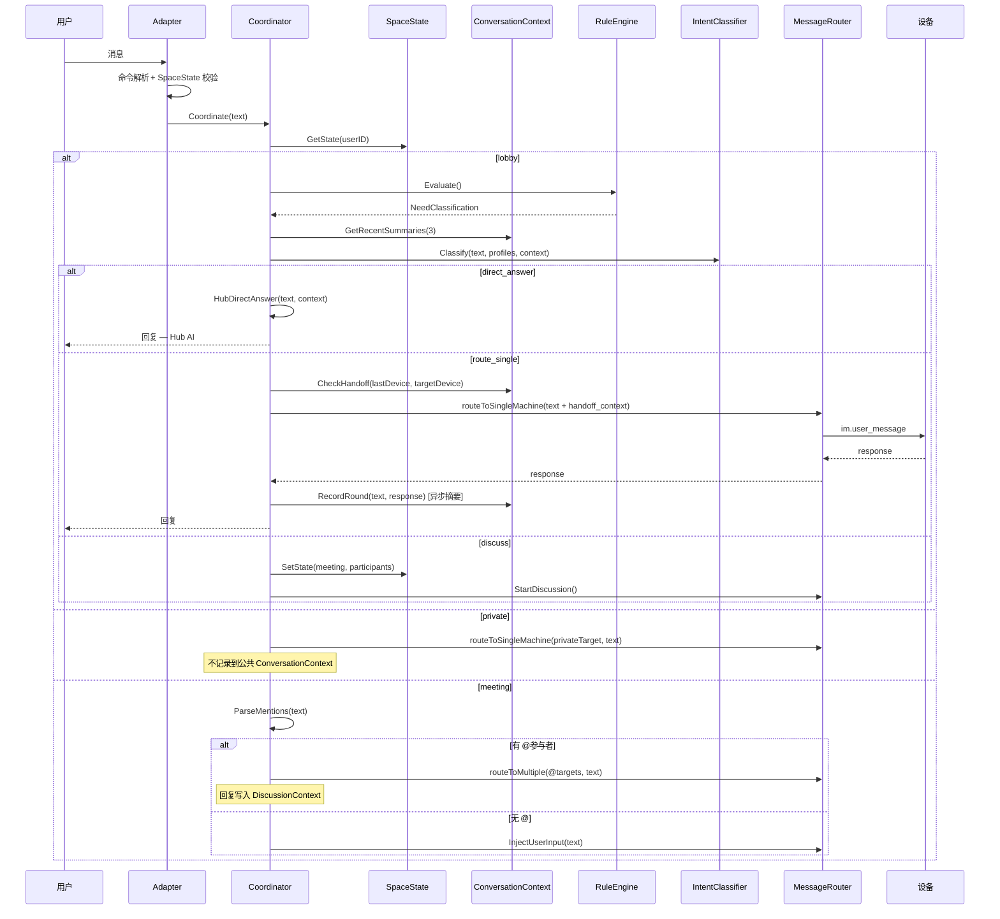

# 技术设计文档：Hub 无感聊天（Seamless Chat）

## 概述

在 Hub LLM Coordinator（`hub/internal/im/coordinator.go` 等）已实现智能路由、意图分类、讨论编排的基础上，本设计新增三大子系统：

1. **ConversationContext** — 用户级对话上下文管理 + Hub 直接应答 + 跨设备 Session 续接
2. **SpaceState** — 空间模型状态机（大厅/私聊/会议），统一 @ 语义
3. **讨论增强** — 讨论生命周期修复、AI 角色意识 prompt、会议上下文前缀

设计原则：增量扩展现有组件，不修改公共 API 签名，LLM 是增强层不是依赖层。

### 设计决策

1. **ConversationContext 是内存结构**：短期记忆，Hub 重启清空，不持久化。摘要生成异步，不阻塞消息响应。
2. **SpaceState 嵌入 Coordinator**：不新建文件，作为 Coordinator 的内部状态管理。状态转换严格由命令驱动（私聊），IntentClassifier 仅可触发会议。
3. **@ 解析统一为 ParseMentions 函数**：所有空间状态共用同一个解析器，语义由空间状态决定。
4. **会议上下文前缀在 deliver 层拼接**：零 LLM token 消耗，每条讨论回复自带 `🗣️ 会议 | {话题} | 第{N}轮` 前缀。
5. **讨论 bug 修复最小化**：`runDiscussion`/`runConductedDiscussion` 的 defer 中 `delete(r.discussions, userID)`，一行修复。
6. **direct_answer 复用 IntentClassifier**：新增意图类型，不新建组件。单设备场景用简化 prompt。

## 架构

### 新增组件在现有架构中的位置

```
Adapter (core.go)
  ├── 命令解析: /call, /discuss, /stop, /ask, /context, /help
  │   └── SpaceState 校验（会议中禁 /call，私聊中禁 /discuss）
  ├── 非命令消息
  │   ├── LLM 模式: 跳过 step 3d → Coordinator.Coordinate()
  │   └── 非 LLM 模式: step 3d 讨论拦截 → RouteToAgent()
  │
Coordinator (coordinator.go) — 扩展
  ├── SpaceState 状态机 (新增)
  │   ├── lobby → RuleEngine → IntentClassifier (现有流程)
  │   ├── private → 直接发给私聊目标 (跳过分类)
  │   └── meeting → 讨论注入 / @小会路由
  ├── ConversationContext (新增)
  │   ├── 记录每轮对话摘要
  │   ├── 注入 IntentClassifier prompt
  │   └── SessionHandoff 上下文注入
  ├── HubDirectAnswer (新增)
  │   └── direct_answer 意图 → Hub LLM 直接回答
  └── @ 解析器 ParseMentions (新增)
      └── 统一解析 @name 序列
```

### 消息流程（空间模型集成后）



## 组件与接口

### 1. ConversationContext（对话上下文）

扩展 `coordinator.go`，新增内部结构。

```go
// ConversationContext 用户级对话上下文（内存存储）
type ConversationContext struct {
    mu     sync.RWMutex
    rounds []ConversationRound // 最近 20 轮，FIFO
}

// ConversationRound 一轮对话记录
type ConversationRound struct {
    UserText     string    // 用户消息原文
    Summary      string    // Agent 回复摘要（LLM 生成或截断）
    TargetDevice string    // 路由目标设备 ID
    DeviceName   string    // 路由目标设备名
    Timestamp    time.Time
}

// conversationContextStore 全局存储
type conversationContextStore struct {
    mu   sync.RWMutex
    data map[string]*ConversationContext // userID → context
}

// GetOrCreate 获取或创建用户的对话上下文
func (s *conversationContextStore) GetOrCreate(userID string) *ConversationContext

// RecordRound 记录一轮对话（异步生成摘要）
func (cc *ConversationContext) RecordRound(userText, responseText, targetDevice, deviceName string, llmCfg *HubLLMConfig, breaker *CircuitBreaker)

// GetRecentSummaries 获取最近 N 轮摘要（供 IntentClassifier 和 SessionHandoff 使用）
func (cc *ConversationContext) GetRecentSummaries(n int) []ConversationRound

// BuildHandoffContext 构建跨设备续接上下文（≤500 字符）
func (cc *ConversationContext) BuildHandoffContext(lastDevice, reason string) string

// Clear 清除上下文（/context clear）
func (cc *ConversationContext) Clear()

// FormatDisplay 格式化显示（/context 命令）
func (cc *ConversationContext) FormatDisplay() string
```

摘要生成逻辑：
```go
// generateSummary 异步生成回复摘要
// 3 秒超时，超时降级为截断前 100 字符
func generateSummary(responseText string, llmCfg *HubLLMConfig, breaker *CircuitBreaker) string {
    if llmCfg == nil || !breaker.Allow() {
        return truncate(responseText, 100)
    }
    // LLM prompt: "请用不超过100字概括以下回复的核心内容：\n{responseText}"
    // 3s timeout → truncate fallback
}
```

### 2. SpaceState（空间状态机）

扩展 `coordinator.go`，新增状态管理。

```go
// SpaceStateType 空间状态类型
type SpaceStateType string

const (
    SpaceLobby   SpaceStateType = "lobby"
    SpacePrivate SpaceStateType = "private"
    SpaceMeeting SpaceStateType = "meeting"
)

// SpaceState 用户的空间状态
type SpaceState struct {
    State         SpaceStateType
    PrivateTarget string   // private 模式下的目标设备 ID
    PrivateName   string   // private 模式下的目标设备名
    MeetingTopic  string   // meeting 模式下的话题
    Participants  []string // meeting 模式下的参与者 machineID 列表
    MessageCount  int      // 私聊模式下的消息计数（用于每 5 条提醒）
}

// spaceStateStore 全局存储
type spaceStateStore struct {
    mu   sync.RWMutex
    data map[string]*SpaceState // userID → state
}

// GetOrCreate 获取用户空间状态，默认 lobby
func (s *spaceStateStore) GetOrCreate(userID string) *SpaceState

// EnterPrivate 进入私聊（仅从 lobby）
func (s *spaceStateStore) EnterPrivate(userID, machineID, name string) error

// ExitPrivate 退出私聊回到大厅
func (s *spaceStateStore) ExitPrivate(userID string) error

// EnterMeeting 进入会议（仅从 lobby）
func (s *spaceStateStore) EnterMeeting(userID, topic string, participants []string) error

// ExitMeeting 退出会议回到大厅
func (s *spaceStateStore) ExitMeeting(userID string) error

// RemoveParticipant 移除会议参与者（设备离线）
func (s *spaceStateStore) RemoveParticipant(userID, machineID string) (remaining int)

// Reset 重置为 lobby
func (s *spaceStateStore) Reset(userID string)
```

状态转换矩阵：
```
         → lobby    → private   → meeting
lobby      -        /call name  /discuss 或 IntentClassifier(discuss)
private   /call all  -          ✗ (拒绝)
meeting   /stop      ✗ (拒绝)   -
```

### 3. HubDirectAnswer（Hub 直接应答）

扩展 `coordinator.go` 的 `classifyAndRoute` 方法。

```go
// IntentDirectAnswer 新增意图类型
const IntentDirectAnswer IntentType = "direct_answer"

// hubDirectAnswer 使用 Hub LLM 直接回答用户问题
func (c *Coordinator) hubDirectAnswer(ctx context.Context, userID, text string) (*GenericResponse, error) {
    cc := c.convContext.GetOrCreate(userID)
    recentSummaries := cc.GetRecentSummaries(5)
    
    // 构建 prompt，注入最近 5 轮上下文
    // 系统提示包含 need_device 降级机制
    // 15 秒超时 → 降级为 broadcast
    
    // 回复末尾附加 " — Hub AI" 标记
    // 记录到 ConversationContext（targetDevice = "hub"）
}
```

IntentClassifier prompt 扩展：
```
新增意图类型：
- "direct_answer": Hub 直接回答（问题不需要访问用户设备的项目代码/文件/工具）

判断规则新增：
- 如果问题是通用编程知识、语法问题、正则表达式等，选 direct_answer
- 如果问题涉及"我的项目"、"这个文件"、"帮我改"等，不选 direct_answer

上下文注入：
最近对话：
{{range .RecentContext}}
- [{{.DeviceName}}] 用户: {{.UserText}} → 摘要: {{.Summary}}
{{end}}

如果用户消息是对上一轮对话的延续（包含指代词或省略主语），优先路由到上一轮的目标设备。
```

### 4. SessionHandoff（跨设备续接）

扩展 `coordinator.go` 的 `routeToTarget` 方法。

```go
// routeToTarget 扩展：检测设备切换，注入 handoff_context
func (c *Coordinator) routeToTarget(...) (*GenericResponse, error) {
    cc := c.convContext.GetOrCreate(userID)
    lastRound := cc.GetRecentSummaries(1)
    
    // 检测设备切换
    if len(lastRound) > 0 && lastRound[0].TargetDevice != targetID {
        handoffCtx := cc.BuildHandoffContext(lastRound[0].DeviceName, reason)
        // 注入到 im.user_message payload 的 handoff_context 字段
    }
    
    // 调用 routeToSingleMachine（现有逻辑）
    // 异步记录到 ConversationContext
}
```

`im.user_message` payload 扩展：
```json
{
    "user_id": "...",
    "platform": "feishu",
    "text": "帮我看看后端的 API",
    "handoff_context": {
        "from_device": "MacBook-Pro",
        "summary": "用户之前在 MacBook-Pro 上讨论了前端 bug，涉及 React 组件渲染问题...",
        "reason": "检测到后端项目"
    }
}
```

### 5. @ 解析器

新增工具函数，供 Coordinator 和 RuleEngine 共用。

```go
// ParseMentions 从消息开头解析连续的 @name 序列
// 返回被 @ 的名称列表和剩余消息正文
// 例: "@安妮 @小明 你们看看" → (["安妮", "小明"], "你们看看")
// 例: "@安妮 你好" → (["安妮"], "你好")
// 例: "你好 @安妮" → ([], "你好 @安妮")  // @ 不在开头，不解析
func ParseMentions(text string) (names []string, body string)
```

### 6. Coordinator.Coordinate 扩展

核心调度逻辑重构：

```go
func (c *Coordinator) Coordinate(ctx, userID, platformName, platformUID, text) {
    machines := c.devices.FindAllOnlineMachinesForUser(ctx, userID)
    if len(machines) == 0 { return 503 }
    
    state := c.spaceState.GetOrCreate(userID)
    
    switch state.State {
    case SpacePrivate:
        return c.handlePrivateMessage(ctx, userID, ..., text, state)
    case SpaceMeeting:
        return c.handleMeetingMessage(ctx, userID, ..., text, state)
    default: // lobby
        return c.handleLobbyMessage(ctx, userID, ..., text, machines)
    }
}

// handlePrivateMessage 私聊模式：直接发给目标设备
// - @ 无特殊语义，原样发送
// - 不记录到公共 ConversationContext
// - 每 5 条消息插入状态提醒
// - 目标离线 → 自动返回大厅
func (c *Coordinator) handlePrivateMessage(...)

// handleMeetingMessage 会议模式：解析 @ 或注入讨论
// - ParseMentions 解析 @
// - 有 @ → 校验参与者 → 并行发送 → 回复写入 DiscussionContext
// - 无 @ → InjectUserInput
func (c *Coordinator) handleMeetingMessage(...)

// handleLobbyMessage 大厅模式：现有 classifyAndRoute 逻辑
// - ParseMentions 解析 @ → 多人定向发送
// - 无 @ → RuleEngine → IntentClassifier
// - direct_answer → hubDirectAnswer
// - discuss → EnterMeeting + StartDiscussion
func (c *Coordinator) handleLobbyMessage(...)
```

### 7. Adapter (core.go) 命令扩展

```go
// 新增命令处理（在现有命令解析区域）

// /ask <设备名> <消息> — 一次性跨空间交互
// 不影响当前 SpaceState，回复不写入 DiscussionContext
case strings.HasPrefix(text, "/ask "):
    // 解析设备名和消息
    // 直接 routeToSingleMachine，不经过 Coordinator

// /context — 显示对话上下文
case text == "/context":
    cc := coordinator.convContext.GetOrCreate(unifiedID)
    display := cc.FormatDisplay()

// /context clear — 清除对话上下文
case text == "/context clear":
    cc := coordinator.convContext.GetOrCreate(unifiedID)
    cc.Clear()

// /call 扩展 — SpaceState 校验
// 会议中 /call → 拒绝
// 私聊中 /call all → 退出私聊回大厅
// 大厅中 /call name → 进入私聊

// /discuss 扩展 — SpaceState 校验 + 参与者解析
// 私聊中 /discuss → 拒绝
// 解析 /discuss @安妮 @小明 话题 → 指定参与者
// 进入会议状态

// /stop 扩展 — 退出会议回大厅
```

### 8. 讨论增强

#### 8.1 生命周期修复

```go
// discussion.go — runDiscussion defer 中新增清理
defer func() {
    // ... 现有 recover 和 Running=false ...
    r.mu.Lock()
    delete(r.discussions, userID)  // 新增：彻底清理
    r.mu.Unlock()
}()

// discussion_conductor.go — runConductedDiscussion defer 同理
defer func() {
    // ... 现有逻辑 ...
    dc.router.mu.Lock()
    delete(dc.router.discussions, userID)  // 新增
    dc.router.mu.Unlock()
}()
```

#### 8.2 AI 角色意识 prompt

扩展 `discussion_conductor.go` 的 `askDevices` 方法：

```go
// 每台设备收到的 prompt 包含 discussion_context
wsMsg := map[string]interface{}{
    "type":       "im.user_message",
    "request_id": requestID,
    "payload": map[string]interface{}{
        "text": prompt,
        "discussion_context": map[string]interface{}{
            "role":         deviceName,
            "participants": allParticipantNames,
            "round":        roundNumber,
            "topic":        topic,
            "instruction":  "你是讨论参与者「{name}」，其他参与者有 {others}。请以你的角色身份参与讨论。不要重复自己之前的观点，重点回应其他参与者的新观点。",
        },
    },
}
```

#### 8.3 会议上下文前缀

扩展 `discussion_conductor.go` 的 `deliverRoundReplies`：

```go
func (dc *DiscussionConductor) deliverRoundReplies(..., topic string, round int) {
    prefix := fmt.Sprintf("🗣️ 会议 | %s | 第%d轮", truncate(topic, 20), round)
    for _, d := range devices {
        text := replies[d.MachineID]
        msg := fmt.Sprintf("%s\n[%s] %s", prefix, d.Name, text)
        dc.router.deliverProgress(ctx, userID, platformName, platformUID, msg)
    }
}
```

#### 8.4 小会写入 DiscussionContext

```go
// Coordinator.handleMeetingMessage 中处理 @ 小会
func (c *Coordinator) handleMeetingSideChat(ctx, userID, platformName, platformUID string, targets []string, body string, state *SpaceState) {
    // 并行发送给所有被 @ 的设备
    // 收集回复
    // 格式化为 "💬 主持人与安妮、小明的小会：\n用户: {body}\n[安妮] {reply}\n[小明] {reply}"
    // 写入 DiscussionContext（通过 InjectUserInput 或直接追加到 ConductedRound）
    // 回复发送给用户（带会议前缀）
}
```

### 9. core.go step 3d LLM 模式跳过

```go
// 现有 step 3d 位置，新增 LLM 模式判断
llmActive := a.coordinator != nil && a.coordinator.IsLLMEnabled()

// LLM 模式下跳过 step 3d，让 Coordinator 统一处理会议消息
if !llmActive && !strings.HasPrefix(text, "/") && a.messageRouter.IsInDiscussion(unifiedID) {
    // 现有讨论拦截逻辑（保持不变）
}
// LLM 模式下，非命令消息直接走 Coordinator.Coordinate()
```

## 数据模型

### ConversationRound（内存）

```go
type ConversationRound struct {
    UserText     string    `json:"user_text"`
    Summary      string    `json:"summary"`
    TargetDevice string    `json:"target_device"`
    DeviceName   string    `json:"device_name"`
    Timestamp    time.Time `json:"timestamp"`
}
```

### SpaceState（内存）

```go
type SpaceState struct {
    State         SpaceStateType `json:"state"`
    PrivateTarget string         `json:"private_target,omitempty"`
    PrivateName   string         `json:"private_name,omitempty"`
    MeetingTopic  string         `json:"meeting_topic,omitempty"`
    Participants  []string       `json:"participants,omitempty"`
    MessageCount  int            `json:"message_count"`
}
```

### handoff_context（WebSocket payload 扩展）

```go
type HandoffContext struct {
    FromDevice string `json:"from_device"`
    Summary    string `json:"summary"`
    Reason     string `json:"reason"`
}
```

### discussion_context（WebSocket payload 扩展）

```go
type DiscussionContextPayload struct {
    Role         string   `json:"role"`
    Participants []string `json:"participants"`
    Round        int      `json:"round"`
    Topic        string   `json:"topic"`
    Instruction  string   `json:"instruction"`
}
```

## 新增/修改文件清单

### 新增文件

| 文件路径 | 说明 |
|---------|------|
| `hub/internal/im/conversation_context.go` | ConversationContext 存储、摘要生成、handoff 构建 |
| `hub/internal/im/space_state.go` | SpaceState 状态机、状态转换、参与者管理 |
| `hub/internal/im/mention_parser.go` | ParseMentions @ 解析器 |

### 修改文件

| 文件路径 | 修改内容 |
|---------|---------|
| `hub/internal/im/coordinator.go` | 集成 SpaceState + ConversationContext + HubDirectAnswer；Coordinate 方法按空间状态分发；新增 handlePrivateMessage/handleMeetingMessage/handleLobbyMessage/hubDirectAnswer |
| `hub/internal/im/intent_classifier.go` | 新增 `IntentDirectAnswer` 意图类型；prompt 注入 ConversationContext 摘要；上下文延续性指令 |
| `hub/internal/im/rule_engine.go` | Evaluate 使用 ParseMentions 处理多人 @；多人 @ 返回新的 ActionRouteToMultiple |
| `hub/internal/im/core.go` | 新增 /ask、/context、/context clear 命令；/call 和 /discuss 增加 SpaceState 校验；step 3d LLM 模式跳过 |
| `hub/internal/im/discussion.go` | runDiscussion defer 中 delete(r.discussions, userID) |
| `hub/internal/im/discussion_conductor.go` | runConductedDiscussion defer 清理；askDevices 注入 discussion_context；deliverRoundReplies 添加会议前缀 |
| `hub/internal/im/router.go` | routeToSingleMachine 支持 handoff_context 注入；新增 routeToMultiple 方法 |
| `hub/internal/im/help.go` | BuildHelpMessage 增加空间模型相关命令说明 |
| `hub/internal/httpapi/hub_llm_handlers.go` | 新增 GET /api/admin/conversation_stats 端点 |
| `hub/internal/app/bootstrap.go` | Coordinator 初始化时创建 ConversationContext 和 SpaceState 存储 |

## 正确性属性

### Property 1: SpaceState 状态机完整性
*For any* 用户，SpaceState 只能是 lobby/private/meeting 三者之一，且状态转换严格遵循转换矩阵（private ↔ meeting 不可直达）。

### Property 2: 私聊隔离性
*For any* 私聊模式下的消息，SHALL 不经过 IntentClassifier，不记录到公共 ConversationContext，不影响其他设备。

### Property 3: ConversationContext FIFO 上限
*For any* 用户的 ConversationContext，轮次数 SHALL 不超过 20。

### Property 4: SessionHandoff 仅在设备切换时触发
*For any* 连续路由到同一设备的消息，SHALL 不注入 handoff_context。

### Property 5: 会议参与者隔离
*For any* 会议，非参与者设备 SHALL 不收到任何讨论相关消息。

### Property 6: @ 解析一致性
*For any* 消息，ParseMentions 的结果 SHALL 仅取决于消息文本，不取决于空间状态。空间状态仅决定 @ 的语义。

### Property 7: 讨论清理完整性
*For any* 讨论结束后，`IsInDiscussion(userID)` SHALL 返回 false。

### Property 8: direct_answer 降级安全
*For any* Hub LLM 返回 `{"need_device": true}` 的情况，SHALL 降级为正常路由，不返回空回复。

### Property 9: 会议前缀零 token
*For any* 会议回复的上下文前缀，SHALL 由 Hub deliver 层拼接，不出现在发给设备的 prompt 中。

## 错误处理

| 场景 | 处理方式 |
|------|---------|
| 摘要生成超时（3s） | 降级为截断前 100 字符 |
| HubDirectAnswer 超时（15s） | 降级为 broadcast 路由 |
| HubDirectAnswer 返回 need_device | 降级为正常 IntentClassifier 路由 |
| 私聊目标离线 | 自动返回大厅，显示在线设备列表 |
| 会议参与者离线 | 移除参与者，会议继续；全部离线则自动结束 |
| SpaceState 不一致（会议已结束但状态仍为 meeting） | 防御性重置为 lobby |
| ParseMentions 匹配到不存在的设备名 | 大厅模式降级为正常路由；会议模式拒绝并提示 |
