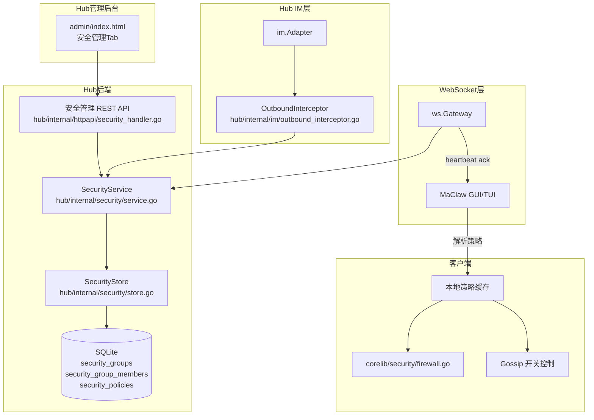

# 技术设计文档：Hub 安全管理

## 概述

本设计在现有 Hub 架构上新增集中式安全管理能力。核心思路是：在 Hub 后端新增 `hub/internal/security` 包，实现用户组树形结构、安全策略存储与继承计算；通过现有 WebSocket 心跳机制将生效策略下发到客户端；在 IM 路由层（`hub/internal/im/`）插入文件/图片外发拦截逻辑；在客户端（GUI/TUI）侧根据下发策略切换只读模式并执行策略。

关键设计决策：
1. **策略存储采用 JSON 稀疏存储**：每个用户组仅存储显式设置的策略项（JSON 对象），未设置的项不存储，继承时从根节点逐级合并
2. **心跳响应注入策略**：复用现有 `machine.heartbeat` → `ack` 的响应路径，在 ack 中附带 `security_policy` 字段
3. **IM 拦截在 Hub 侧执行**：文件/图片外发检查在 `im.Adapter.sendResponse` 之前插入，无需修改客户端 IM 逻辑
4. **用户组树存储在 SQLite**：新增 `security_groups` 和 `security_group_members` 表，通过 `parent_id` 构建树形关系

## 架构



### 数据流

1. **策略配置流**：管理员 → Hub_Admin UI → REST API → SecurityService → SQLite
2. **策略下发流**：客户端心跳 → ws.Gateway.handleMachineHeartbeat → SecurityService.GetEffectivePolicy → 心跳 ack 响应附带策略
3. **IM 拦截流**：Agent 响应 → im.Adapter.sendResponse → OutboundInterceptor.Check → 允许/拦截
4. **客户端执行流**：心跳 ack 解析 → 策略缓存更新 → PolicyEngine/Firewall/Gossip 模块状态切换

## 组件与接口

### 1. SecurityService（`hub/internal/security/service.go`）

核心业务逻辑层，负责用户组 CRUD、策略管理和生效策略计算。

```go
type SecurityService struct {
    store   *SecurityStore
    system  store.SystemSettingsRepository
    audit   store.AdminAuditRepository
    cache   sync.Map // userEmail -> *CachedEffectivePolicy
}

// 用户组管理
func (s *SecurityService) CreateGroup(ctx context.Context, name, parentID string) (*SecurityGroup, error)
func (s *SecurityService) RenameGroup(ctx context.Context, id, name string) error
func (s *SecurityService) DeleteGroup(ctx context.Context, id string) error
func (s *SecurityService) GetGroupTree(ctx context.Context) (*GroupTreeNode, error)
func (s *SecurityService) AssignUser(ctx context.Context, email, groupID string) error
func (s *SecurityService) RemoveUser(ctx context.Context, groupID, email string) error

// 策略管理
func (s *SecurityService) GetGroupPolicy(ctx context.Context, groupID string) (*GroupPolicyView, error)
func (s *SecurityService) UpdateGroupPolicy(ctx context.Context, groupID string, policy map[string]interface{}) error

// 生效策略计算
func (s *SecurityService) GetEffectivePolicy(ctx context.Context, email string) (*EffectivePolicy, error)
func (s *SecurityService) GetGroupEffectivePolicy(ctx context.Context, groupID string) (*EffectivePolicy, error)

// 系统设置
func (s *SecurityService) GetSettings(ctx context.Context) (*SecuritySettings, error)
func (s *SecurityService) UpdateSettings(ctx context.Context, settings *SecuritySettings) error
func (s *SecurityService) SetDefaultGroup(ctx context.Context, groupID string) error

// 缓存失效
func (s *SecurityService) InvalidateCache(groupID string)
func (s *SecurityService) InvalidateCacheForSubtree(groupID string)
```

### 2. SecurityStore（`hub/internal/security/store.go`）

SQLite 数据访问层。

```go
type SecurityStore struct {
    db    *sql.DB
    batch *writeBatcher // 复用现有 batcher
}

func (s *SecurityStore) CreateGroup(ctx context.Context, group *SecurityGroup) error
func (s *SecurityStore) GetGroupByID(ctx context.Context, id string) (*SecurityGroup, error)
func (s *SecurityStore) ListGroups(ctx context.Context) ([]*SecurityGroup, error)
func (s *SecurityStore) UpdateGroupName(ctx context.Context, id, name string) error
func (s *SecurityStore) DeleteGroup(ctx context.Context, id string) error
func (s *SecurityStore) GetRootGroup(ctx context.Context) (*SecurityGroup, error)

func (s *SecurityStore) AssignUser(ctx context.Context, email, groupID string) error
func (s *SecurityStore) RemoveUser(ctx context.Context, email string) error
func (s *SecurityStore) GetUserGroup(ctx context.Context, email string) (string, error)
func (s *SecurityStore) ListGroupMembers(ctx context.Context, groupID string) ([]string, error)
func (s *SecurityStore) CountGroupMembers(ctx context.Context, groupID string) (int, error)
func (s *SecurityStore) MoveUsersToRoot(ctx context.Context, fromGroupIDs []string) error

func (s *SecurityStore) GetGroupPolicy(ctx context.Context, groupID string) (map[string]interface{}, error)
func (s *SecurityStore) SetGroupPolicy(ctx context.Context, groupID string, policy map[string]interface{}) error
```

### 3. OutboundInterceptor（`hub/internal/im/outbound_interceptor.go`）

IM 外发拦截器，在 `im.Adapter.sendResponse` 之前检查文件/图片外发权限。

```go
type OutboundInterceptor struct {
    securitySvc SecurityPolicyProvider
    auditLog    func(email, platform, fileType string)
}

type SecurityPolicyProvider interface {
    GetEffectivePolicyByUserID(ctx context.Context, userID string) (*EffectivePolicy, error)
    IsCentralizedEnabled(ctx context.Context) (bool, error)
}

func (i *OutboundInterceptor) CheckOutbound(ctx context.Context, userID string, resp *GenericResponse) (*GenericResponse, bool)
```

拦截逻辑：
- 检查 `centralized_security_enabled` 是否为 true
- 如果 `resp.FileData != ""` 且 `file_outbound_enabled == false` → 替换为拦截提示
- 如果 `resp.ImageKey != ""` 且 `image_outbound_enabled == false` → 替换为拦截提示

### 4. 心跳策略注入（`hub/internal/ws/handlers_machine.go` 修改）

在现有 `handleMachineHeartbeat` 中，将 `writeAck` 替换为带策略数据的响应：

```go
func (g *Gateway) handleMachineHeartbeat(ctx *ConnContext, msg Envelope) error {
    // ... 现有逻辑 ...
    
    // 注入安全策略
    ackPayload := map[string]any{"request_id": msg.RequestID}
    if g.SecurityProvider != nil {
        policy, err := g.SecurityProvider.GetHeartbeatPolicy(context.Background(), ctx.UserID)
        if err == nil && policy != nil {
            ackPayload["security_policy"] = policy
        }
    }
    return writeJSON(ctx.Conn, map[string]any{
        "type":    "ack",
        "payload": ackPayload,
    })
}
```

### 5. 客户端策略执行器

**GUI 侧**（`gui/app.go` 修改）：
- 解析心跳 ack 中的 `security_policy` 字段
- 更新本地 `HubSecurityPolicy` 缓存
- 通知前端 React 组件切换只读模式
- 调用 `PolicyEngine.SetMode()` / `Firewall` 配置更新

**TUI 侧**（`tui/config_watcher.go` 修改）：
- 同样解析心跳 ack
- 更新本地策略缓存
- Gossip 命令检查 `gossip_enabled`

### 6. Hub_Admin 安全管理界面

在 `hub/web/admin/index.html` 中新增 `security` Tab：
- 左侧：用户组树形视图（可展开/折叠，右键菜单）
- 右侧：策略配置面板（表单，标注继承来源）
- 顶部：集中管控开关 + 组织机构开关 + 默认组设置

### 7. REST API 路由（`hub/internal/httpapi/security_handler.go`）

所有 `/api/admin/security/*` 路由通过 `RequireAdmin` 中间件保护。
`/api/enroll/group-tree` 为公开端点（注册流程使用）。

## 数据模型

### SQLite 新增表

```sql
-- 用户组表
CREATE TABLE IF NOT EXISTS security_groups (
    id TEXT PRIMARY KEY,
    name TEXT NOT NULL,
    parent_id TEXT NOT NULL DEFAULT '',
    created_at TEXT NOT NULL,
    updated_at TEXT NOT NULL
);

CREATE INDEX IF NOT EXISTS idx_security_groups_parent ON security_groups(parent_id);

-- 用户组成员表（一个用户只属于一个组）
CREATE TABLE IF NOT EXISTS security_group_members (
    email TEXT PRIMARY KEY,
    group_id TEXT NOT NULL,
    created_at TEXT NOT NULL
);

CREATE INDEX IF NOT EXISTS idx_sgm_group ON security_group_members(group_id);

-- 用户组策略表（稀疏 JSON 存储）
CREATE TABLE IF NOT EXISTS security_policies (
    group_id TEXT PRIMARY KEY,
    policy_json TEXT NOT NULL DEFAULT '{}',
    updated_at TEXT NOT NULL
);
```

### Go 数据结构

```go
// SecurityGroup 用户组
type SecurityGroup struct {
    ID        string    `json:"id"`
    Name      string    `json:"name"`
    ParentID  string    `json:"parent_id"`
    CreatedAt time.Time `json:"created_at"`
    UpdatedAt time.Time `json:"updated_at"`
}

// GroupTreeNode 树形节点（API 返回用）
type GroupTreeNode struct {
    ID          string          `json:"id"`
    Name        string          `json:"name"`
    ParentID    string          `json:"parent_id"`
    MemberCount int             `json:"member_count"`
    Children    []*GroupTreeNode `json:"children"`
}

// EffectivePolicy 生效策略
type EffectivePolicy struct {
    FileOutboundEnabled  bool   `json:"file_outbound_enabled"`
    ImageOutboundEnabled bool   `json:"image_outbound_enabled"`
    GossipEnabled        bool   `json:"gossip_enabled"`
    GuardrailMode        string `json:"guardrail_mode"`
    SandboxMode          string `json:"sandbox_mode"`
    NetworkLevel         string `json:"network_level"`
    YoloModeAllowed      bool   `json:"yolo_mode_allowed"`
    SmartRouteEnabled    bool   `json:"smart_route_enabled"`
}

// DefaultPolicy 根组默认策略
var DefaultPolicy = EffectivePolicy{
    FileOutboundEnabled:  true,
    ImageOutboundEnabled: true,
    GossipEnabled:        true,
    GuardrailMode:        "standard",
    SandboxMode:          "none",
    NetworkLevel:         "full",
    YoloModeAllowed:      true,
    SmartRouteEnabled:    true,
}

// GroupPolicyView 组策略视图（含继承信息）
type GroupPolicyView struct {
    GroupID  string                    `json:"group_id"`
    Items    map[string]PolicyItemView `json:"items"`
}

type PolicyItemView struct {
    Value       interface{} `json:"value"`
    Source      string      `json:"source"`       // "self" 或 "inherited"
    SourceGroup string      `json:"source_group"` // 来源组 ID
    SourceName  string      `json:"source_name"`  // 来源组名称
}

// SecuritySettings 系统安全设置
type SecuritySettings struct {
    CentralizedSecurityEnabled bool   `json:"centralized_security_enabled"`
    OrgStructureEnabled        bool   `json:"org_structure_enabled"`
    DefaultGroupID             string `json:"default_group_id,omitempty"`
}

// HeartbeatSecurityPayload 心跳下发的安全策略
type HeartbeatSecurityPayload struct {
    CentralizedSecurity bool             `json:"centralized_security"`
    Policy              *EffectivePolicy `json:"policy,omitempty"`
}
```

### 策略继承计算算法

```
ComputeEffectivePolicy(userEmail):
  1. groupID = store.GetUserGroup(userEmail)  // 未分配则为 root
  2. path = []  // 从 root 到 userGroup 的路径
  3. 从 groupID 向上遍历 parent_id 直到 root，收集路径
  4. 反转路径（root 在前）
  5. result = DefaultPolicy（root 默认值）
  6. for each group in path:
       policyJSON = store.GetGroupPolicy(group.ID)
       for each key in policyJSON:
         result[key] = policyJSON[key]  // 子组覆盖父组
  7. return result
```

### 系统设置存储

复用现有 `system_settings` 表，key 为 `security_settings`，value 为 JSON：

```json
{
  "centralized_security_enabled": false,
  "org_structure_enabled": false,
  "default_group_id": ""
}
```


## 正确性属性（Correctness Properties）

*属性（Property）是在系统所有合法执行中都应成立的特征或行为——本质上是对系统应做什么的形式化陈述。属性是人类可读规格说明与机器可验证正确性保证之间的桥梁。*

### Property 1: 创建子组扩展树

*对于任意*合法的组名称和已存在的父组 ID，创建子组后，用户组树中应包含该新组，且其 parent_id 指向指定的父组。

**Validates: Requirements 1.2**

### Property 2: 重命名组的往返一致性

*对于任意*已存在的用户组和任意非空新名称，重命名后再查询该组，返回的名称应等于新名称。

**Validates: Requirements 1.3**

### Property 3: 删除组从树中移除

*对于任意*非根用户组，删除后，用户组树中不应再包含该组 ID。

**Validates: Requirements 1.4**

### Property 4: 级联删除将用户移回根组

*对于任意*用户组树，当删除一个非根组时，该组及其所有子组中的用户都应被移到 Root_Group。删除后，这些用户查询所属组应返回 Root_Group 的 ID。

**Validates: Requirements 1.5**

### Property 5: 用户单组归属不变量

*对于任意*用户和任意两个不同的用户组 A 和 B，将用户分配到 B 后，该用户应属于 B 且不再属于 A。在任何时刻，一个用户恰好属于一个组。

**Validates: Requirements 1.6, 1.7**

### Property 6: 新用户自动分组

*对于任意*新注册用户，当 `org_structure_enabled` 为 false 时，该用户应被分配到 Root_Group；当 `org_structure_enabled` 为 true 且用户选择了部门时，应被分配到所选部门对应的组；当 `org_structure_enabled` 为 true 但未选择部门且设置了 `default_group_id` 时，应被分配到默认组。

**Validates: Requirements 1.10, 1.11, 1.12**

### Property 7: 策略稀疏存储

*对于任意*用户组和任意策略更新操作，存储层仅保存显式设置的策略项。读取该组的原始策略 JSON 时，其键集合应恰好等于更新时传入的键集合（不包含未设置的项）。

**Validates: Requirements 2.3**

### Property 8: 策略继承合并

*对于任意*用户组树和任意策略配置，用户的 Effective_Policy 应等于从 Root_Group 沿路径到用户所在组逐级合并的结果：以 Root_Group 的默认策略为基础，每经过一个组，该组显式设置的项覆盖当前值，未设置的项保持不变。

**Validates: Requirements 3.1, 3.3, 3.4**

### Property 9: 策略视图标注来源

*对于任意*用户组，查询其策略视图时，每个 Policy_Item 应标注正确的来源：如果该组显式设置了该项，来源为 "self"；否则来源为 "inherited"，且 source_group 指向实际提供该值的最近祖先组。

**Validates: Requirements 2.6**

### Property 10: 心跳响应根据集中管控状态下发策略

*对于任意*已认证的客户端心跳，当 `centralized_security_enabled` 为 true 时，心跳 ack 应包含 `centralized_security: true` 和该用户的 Effective_Policy；当为 false 时，应包含 `centralized_security: false` 且不包含策略数据。

**Validates: Requirements 4.3, 4.4**

### Property 11: IM 外发拦截

*对于任意*用户和任意 IM 通道响应，当集中管控开启且用户的 `file_outbound_enabled` 为 false 时，包含文件数据的响应应被替换为拦截提示；当 `image_outbound_enabled` 为 false 时，包含图片数据的响应应被替换为拦截提示。当集中管控关闭时，不应拦截任何响应。

**Validates: Requirements 5.1, 5.2, 5.3**

### Property 12: 设置变更审计日志

*对于任意*安全设置切换操作（`centralized_security_enabled`、`org_structure_enabled` 的开/关），系统应记录一条审计日志，包含操作管理员 ID 和切换时间。文件/图片外发被拦截时也应记录审计日志。

**Validates: Requirements 4.7, 4.8, 5.5, 10.8, 10.9**

### Property 13: Gossip 禁用执行

*对于任意*用户，当集中管控开启且其 Effective_Policy 中 `gossip_enabled` 为 false 时，AutoPublishTrigger 应跳过自动发布，GossipClient 的发布/评论请求应返回权限错误。当集中管控关闭时，Gossip 功能应按本地配置决定。

**Validates: Requirements 6.1, 6.2, 6.3, 6.4, 6.5**

### Property 14: 客户端策略应用

*对于任意*从 Hub 收到的新 Effective_Policy，如果与当前缓存不同，客户端应立即应用：`guardrail_mode` 变化时调用 PolicyEngine.SetMode，`sandbox_mode` 变化时更新 Firewall 沙箱配置，`network_level` 变化时更新网络访问级别。

**Validates: Requirements 7.1, 7.3, 7.5, 7.6, 7.7**

### Property 15: YOLO 模式强制覆盖

*对于任意*项目配置中 YOLO 模式为开启状态的情况，当 Effective_Policy 中 `yolo_mode_allowed` 为 false 时，系统应强制关闭 YOLO 模式，实际执行时不应跳过用户确认。

**Validates: Requirements 7.8**

### Property 16: 注册响应根据组织机构开关返回数据

*对于任意* enrollment 请求，当 `org_structure_enabled` 为 true 时，响应应包含 `org_structure_enabled: true` 和用户组树结构数据；当为 false 时，响应应包含 `org_structure_enabled: false` 且不包含用户组树数据。

**Validates: Requirements 10.2, 10.4**

### Property 17: 离线策略持久化

*对于任意*客户端，在与 Hub 断开连接后，应继续使用最后一次收到的 Effective_Policy，直到重新连接并收到新策略。

**Validates: Requirements 7.2**

## 错误处理

### Hub 后端错误

| 场景 | 处理方式 |
|------|---------|
| 创建子组时父组不存在 | 返回 404，消息 "parent group not found" |
| 创建子组时树深度超过 10 层 | 返回 400，消息 "group tree depth exceeds maximum (10)" |
| 删除 Root_Group | 返回 403，消息 "cannot delete root group" |
| 分配用户时目标组不存在 | 返回 404，消息 "group not found" |
| 分配用户时邮箱不存在于 users 表 | 返回 404，消息 "user not found" |
| 设置 default_group_id 指向不存在的组 | 返回 400，消息 "default group not found" |
| 策略 JSON 格式错误 | 返回 400，消息 "invalid policy format" |
| 策略项值类型不匹配（如 guardrail_mode 传入非法值） | 返回 400，消息 "invalid value for [field]" |
| SQLite 写入失败 | 返回 500，记录错误日志 |

### IM 拦截错误

| 场景 | 处理方式 |
|------|---------|
| 文件外发被拦截 | 替换响应为 GenericResponse{StatusCode: 403, Body: "文件外发已被管理员禁止"} |
| 图片外发被拦截 | 替换响应为 GenericResponse{StatusCode: 403, Body: "图片外发已被管理员禁止"} |
| 策略查询失败（数据库错误） | 放行（fail-open），记录错误日志 |

### 客户端错误

| 场景 | 处理方式 |
|------|---------|
| 心跳 ack 中 security_policy 解析失败 | 忽略本次策略更新，保持上次缓存，记录警告日志 |
| Hub 断开连接 | 继续使用最后缓存的策略 |
| 策略字段值不在预期范围内 | 使用默认值，记录警告日志 |

## 测试策略

### 双轨测试方法

本功能采用单元测试 + 属性测试的双轨方法：

- **单元测试**：验证具体示例、边界情况和错误条件
- **属性测试**：验证跨所有输入的通用属性

两者互补，单元测试捕获具体 bug，属性测试验证通用正确性。

### 属性测试配置

- **库**：Go 标准库 `testing/quick` 或 `github.com/leanovate/gopter`（推荐 gopter，支持更丰富的生成器）
- **每个属性测试最少运行 100 次迭代**
- **每个属性测试必须以注释引用设计文档中的属性编号**
- **标签格式**：`// Feature: hub-security-management, Property {number}: {property_text}`
- **每个正确性属性由一个属性测试实现**

### 单元测试范围

1. **SecurityStore 层**：
   - 创建/删除/重命名组的 CRUD 操作
   - 用户分配和移除
   - 策略 JSON 读写
   - Root_Group 初始化和保护

2. **SecurityService 层**：
   - 策略继承合并的具体示例（3 层树，特定策略值）
   - 缓存失效后重新计算
   - 深度限制（11 层拒绝）
   - 级联删除的具体场景

3. **OutboundInterceptor 层**：
   - 文件拦截的具体示例
   - 图片拦截的具体示例
   - 集中管控关闭时不拦截
   - 策略查询失败时 fail-open

4. **REST API 层**：
   - 各端点的 HTTP 状态码验证
   - 认证中间件拦截未授权请求
   - 请求参数校验

5. **客户端策略执行**：
   - 心跳 ack 解析
   - 策略变更检测
   - PolicyEngine.SetMode 调用验证
   - YOLO 模式覆盖

### 属性测试范围

| 属性 | 测试文件 | 生成器 |
|------|---------|--------|
| P1-P5: 用户组树操作 | `hub/internal/security/service_property_test.go` | 随机组名、随机树结构、随机用户邮箱 |
| P7: 稀疏存储 | `hub/internal/security/store_property_test.go` | 随机策略 JSON 子集 |
| P8: 策略继承合并 | `hub/internal/security/policy_merge_property_test.go` | 随机树 + 随机策略 |
| P9: 策略视图标注 | `hub/internal/security/policy_view_property_test.go` | 随机树 + 随机策略 |
| P10: 心跳策略下发 | `hub/internal/ws/heartbeat_security_property_test.go` | 随机用户 + 随机开关状态 |
| P11: IM 外发拦截 | `hub/internal/im/outbound_interceptor_property_test.go` | 随机用户 + 随机响应类型 + 随机策略 |
| P13: Gossip 禁用 | `gui/gossip_security_property_test.go` | 随机策略状态 |

### 集成测试

- 端到端流程：创建组 → 分配用户 → 设置策略 → 开启集中管控 → 验证心跳下发 → 验证 IM 拦截
- 使用内存 SQLite 数据库，无需外部依赖
