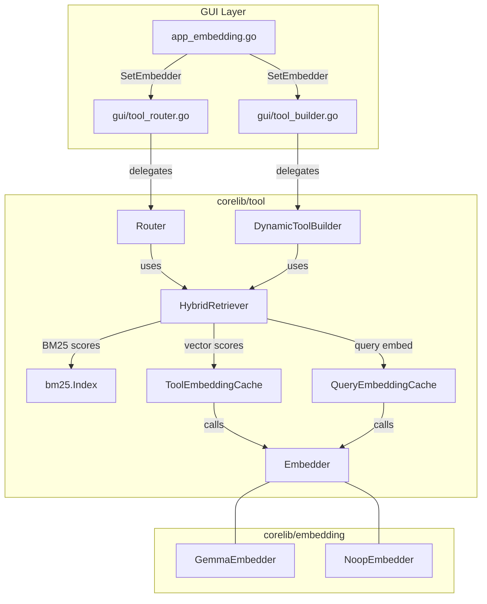

# Design Document: Hybrid Tool Retrieval

## Overview

本设计为 MaClaw 的工具路由管线引入混合检索能力，将现有的 BM25 稀疏检索与 Gemma2 嵌入模型的稠密向量检索相结合。核心思路是在 `corelib/tool/hybrid.go` 中新建一个 `HybridRetriever` 组件，封装 BM25 分数归一化、余弦相似度计算和加权融合逻辑，然后通过 `SetEmbedder()` 方法将其注入到现有的 `Router` 和 `DynamicToolBuilder` 中。

当嵌入器不可用（`NoopEmbedder`）时，系统自动回退到纯 BM25，保持完全向后兼容。

### 设计目标

1. 在不破坏现有 BM25 路由行为的前提下，增加语义向量检索信号
2. 通过工具嵌入缓存和查询嵌入缓存最小化嵌入计算开销
3. 保持 `Router` 和 `DynamicToolBuilder` 的 API 兼容性
4. 通过 GUI 层的嵌入器注入实现运行时动态切换

## Architecture



### 数据流（单次 Route 调用）

1. `Router.Route(userMessage, allTools)` 被调用
2. 分离 core tools 和 candidate tools（与现有逻辑相同）
3. 构建 BM25 索引并获取 BM25 分数（与现有逻辑相同）
4. 如果 Embedder 可用（非 Noop）：
   a. 通过 `QueryEmbeddingCache` 获取 userMessage 的嵌入向量
   b. 通过 `ToolEmbeddingCache` 获取每个候选工具描述的嵌入向量
   c. 计算每个候选工具的余弦相似度
   d. 对 BM25 分数做 min-max 归一化
   e. 融合：`final = 0.6 * norm_bm25 + 0.4 * cosine_sim`
5. 按融合分数排序，选取 top-K 工具
6. 返回结果

## Components and Interfaces

### 1. `HybridRetriever`（新建：`corelib/tool/hybrid.go`）

```go
// HybridRetriever combines BM25 sparse scores with dense vector cosine
// similarity scores using weighted linear fusion.
type HybridRetriever struct {
    embedder       embedding.Embedder
    toolCache      *ToolEmbeddingCache
    queryCache     *QueryEmbeddingCache
    alpha          float64 // fusion weight: alpha*BM25 + (1-alpha)*cosine
}

func NewHybridRetriever(emb embedding.Embedder) *HybridRetriever
func (h *HybridRetriever) FuseScores(
    query string,
    bm25Scores map[string]float64,
    toolTexts map[string]string,
) map[string]float64
```

`FuseScores` 接收 BM25 原始分数和工具描述文本映射，返回融合后的分数映射。当嵌入器为 Noop 时直接返回原始 BM25 分数。

### 2. `ToolEmbeddingCache`（新建：`corelib/tool/hybrid.go`）

```go
// ToolEmbeddingCache caches embedding vectors for tool description texts.
// Keyed by SHA-256 hash of the description text.
type ToolEmbeddingCache struct {
    mu       sync.RWMutex
    embedder embedding.Embedder
    cache    map[string][]float32 // hash(description) → embedding
}

func NewToolEmbeddingCache(emb embedding.Embedder) *ToolEmbeddingCache
func (c *ToolEmbeddingCache) Get(text string) ([]float32, error)
func (c *ToolEmbeddingCache) GetBatch(texts map[string]string) (map[string][]float32, error)
```

缓存策略：工具描述文本通常在应用生命周期内不变，因此使用简单的 map 缓存，以描述文本的 SHA-256 哈希为 key。当工具描述变化时，新的哈希会自动触发重新计算。

### 3. `QueryEmbeddingCache`（新建：`corelib/tool/hybrid.go`）

```go
// QueryEmbeddingCache is an LRU cache with TTL for user query embeddings.
type QueryEmbeddingCache struct {
    mu       sync.Mutex
    embedder embedding.Embedder
    entries  map[string]*queryEntry // query text → entry
    order    []string               // LRU order (most recent at end)
    maxSize  int                    // 64
    ttl      time.Duration          // 30s
}

type queryEntry struct {
    vec       []float32
    createdAt time.Time
}

func NewQueryEmbeddingCache(emb embedding.Embedder, maxSize int, ttl time.Duration) *QueryEmbeddingCache
func (c *QueryEmbeddingCache) Get(query string) ([]float32, error)
```

### 4. `CosineSimilarity`（新建：`corelib/tool/hybrid.go`）

```go
// CosineSimilarity computes the cosine similarity between two float32 vectors.
// Returns 0.0 for nil, empty, mismatched-length, or zero-magnitude vectors.
func CosineSimilarity(a, b []float32) float64
```

### 5. Router 修改（`corelib/tool/router.go`）

```go
// 新增字段
type Router struct {
    // ... existing fields ...
    hybrid *HybridRetriever // nil when no embedder set
}

// 新增方法
func (r *Router) SetEmbedder(emb embedding.Embedder)
```

`SetEmbedder` 检查是否为 NoopEmbedder：如果是，将 `hybrid` 设为 nil；否则创建 `HybridRetriever`。

在 `Route()` 中，当 `hybrid != nil` 时，将 BM25 分数和工具描述文本传给 `hybrid.FuseScores()` 获取融合分数，替代原始 BM25 分数用于排序。

### 6. DynamicToolBuilder 修改（`corelib/tool/builder.go`）

```go
// 新增字段
type DynamicToolBuilder struct {
    // ... existing fields ...
    hybrid *HybridRetriever // nil when no embedder set
}

// 新增方法
func (b *DynamicToolBuilder) SetEmbedder(emb embedding.Embedder)
```

与 Router 相同的模式：在 `Build()` 中，当 `hybrid != nil` 时使用融合分数。

### 7. GUI 适配器修改

**gui/tool_router.go** — 新增 `SetEmbedder` 方法，桥接到 `inner.SetEmbedder()`：
```go
func (r *ToolRouter) SetEmbedder(emb embedding.Embedder) {
    r.inner.SetEmbedder(emb)
}
```

**gui/tool_builder.go** — 新增 `SetEmbedder` 方法，桥接到 `inner.SetEmbedder()`：
```go
func (b *DynamicToolBuilder) SetEmbedder(emb embedding.Embedder) {
    b.inner.SetEmbedder(emb)
}
```

**gui/app_embedding.go** — 在 `SetVectorSearchEnabled()` 中，除了设置 memoryStore 的 embedder 外，同时设置 Router 和 Builder 的 embedder：
```go
if a.toolRouter != nil {
    a.toolRouter.SetEmbedder(emb)
}
if a.toolBuilder != nil {
    a.toolBuilder.SetEmbedder(emb)
}
```

### 8. 可观测性

在 `Router.Route()` 中，当 hybrid 模式激活时，使用 `log.Printf` 在 debug 级别输出 top-5 工具的 BM25、向量和融合分数。

`VectorSearchStatus` 结构体新增 `HybridToolRetrievalActive bool` 字段。

## Data Models

### ToolEmbeddingCache 内部结构

| 字段 | 类型 | 说明 |
|------|------|------|
| cache | `map[string][]float32` | key = SHA-256(description text), value = embedding vector |

缓存生命周期与 `HybridRetriever` 实例相同。当 `SetEmbedder` 被调用时，旧的缓存被丢弃，新的 `HybridRetriever`（含新缓存）被创建。

### QueryEmbeddingCache 内部结构

| 字段 | 类型 | 说明 |
|------|------|------|
| entries | `map[string]*queryEntry` | key = query text, value = {vec, createdAt} |
| order | `[]string` | LRU 顺序追踪 |
| maxSize | `int` | 最大条目数 = 64 |
| ttl | `time.Duration` | 条目过期时间 = 30s |

### 融合参数

| 参数 | 默认值 | 说明 |
|------|--------|------|
| alpha | 0.6 | BM25 权重 |
| 1-alpha | 0.4 | 向量相似度权重 |

### VectorSearchStatus 扩展

```go
type VectorSearchStatus struct {
    // ... existing fields ...
    HybridToolRetrievalActive bool `json:"hybrid_tool_retrieval_active"`
}
```


## Correctness Properties

*A property is a characteristic or behavior that should hold true across all valid executions of a system — essentially, a formal statement about what the system should do. Properties serve as the bridge between human-readable specifications and machine-verifiable correctness guarantees.*

### Property 1: Noop fallback preserves BM25 behavior

*For any* set of candidate tools, any user message, and any BM25 score map, when the HybridRetriever is configured with a NoopEmbedder, `FuseScores` should return scores identical to the original BM25 scores. Equivalently, `Router.Route()` and `DynamicToolBuilder.Build()` with a NoopEmbedder (or no embedder) should produce the same tool selection as the current pure-BM25 implementation.

**Validates: Requirements 1.2, 3.3, 4.3**

### Property 2: Min-max normalization bounds

*For any* non-empty BM25 score map with at least two distinct values, after min-max normalization, all normalized scores should fall in the range [0.0, 1.0], the minimum original score should map to 0.0, and the maximum original score should map to 1.0.

**Validates: Requirements 1.4**

### Property 3: Fusion formula correctness

*For any* alpha in [0, 1], any normalized BM25 score in [0, 1], and any cosine similarity in [-1, 1], the fused score should equal `alpha * normalized_bm25 + (1 - alpha) * cosine_similarity`. Furthermore, for any set of tool candidates with a functional embedder, the fused scores returned by `FuseScores` should each satisfy this formula when decomposed into their BM25 and vector components.

**Validates: Requirements 1.3, 1.5**

### Property 4: Tool embedding cache deduplication

*For any* sequence of `Get(text)` calls on a `ToolEmbeddingCache`, the underlying `Embedder.Embed()` should be called exactly once per unique text value. Repeated calls with the same text should return the same vector without invoking the embedder again.

**Validates: Requirements 2.1, 2.2, 2.3**

### Property 5: Cosine similarity correctness

*For any* two non-zero float32 vectors of equal length, `CosineSimilarity(a, b)` should equal `dot(a, b) / (|a| * |b|)`. As a corollary, *for any* non-zero vector v, `CosineSimilarity(v, v)` should equal 1.0. For nil, empty, mismatched-length, or zero-magnitude inputs, the result should be 0.0.

**Validates: Requirements 6.1, 6.2, 6.3, 6.4, 6.5**

### Property 6: Query embedding cache deduplication

*For any* query text and a cache with TTL > 0, calling `Get(query)` twice within the TTL window should invoke the underlying `Embedder.Embed()` exactly once and return identical vectors both times.

**Validates: Requirements 7.2**

### Property 7: Query cache LRU eviction

*For any* sequence of N distinct query texts inserted into a `QueryEmbeddingCache` with maxSize M (where N > M), the cache size should never exceed M, and the evicted entry should always be the least recently used one. Specifically, after inserting M+1 distinct entries, the first entry should be evicted and a subsequent `Get` for it should trigger a new `Embed` call.

**Validates: Requirements 7.3, 7.5**

### Property 8: Single query embed per Route call

*For any* user message and any set of candidate tools (regardless of count), a single `Router.Route()` call with a functional embedder should invoke `Embedder.Embed()` for the user query at most once, even when there are many candidate tools to compare against.

**Validates: Requirements 3.4**

## Error Handling

### Embedder 错误

| 场景 | 处理方式 |
|------|----------|
| `Embed(userQuery)` 返回 error | 记录 warning 日志，本次 Route/Build 调用回退到纯 BM25 |
| `Embed(toolDescription)` 返回 error | 跳过该工具的向量分数，仅使用 BM25 分数 |
| `EmbedBatch` 部分失败 | 对失败的条目跳过向量分数，成功的条目正常融合 |

### 缓存错误

| 场景 | 处理方式 |
|------|----------|
| ToolEmbeddingCache 中某工具嵌入失败 | 该工具不参与向量评分，仅保留 BM25 分数 |
| QueryEmbeddingCache 中查询嵌入失败 | 整个 Route 调用回退到纯 BM25 |

### 边界情况

| 场景 | 处理方式 |
|------|----------|
| 候选工具数 ≤ MaxToolBudget | 直接返回所有工具，不触发评分逻辑（现有行为） |
| 所有 BM25 分数相同（min == max） | 归一化后所有分数为 0.0，融合分数完全由向量相似度决定 |
| 嵌入器在 Route 调用期间被替换 | 当前调用使用调用开始时的嵌入器引用，不受影响 |

## Testing Strategy

### 测试框架

- 单元测试：Go 标准 `testing` 包
- 属性测试：[`pgregory.net/rapid`](https://github.com/flyingmutant/rapid)（Go 属性测试库）
- 每个属性测试配置最少 100 次迭代

### 属性测试

每个属性测试必须以注释标注对应的设计属性：

```go
// Feature: hybrid-tool-retrieval, Property 1: Noop fallback preserves BM25 behavior
func TestProperty_NoopFallback(t *testing.T) { ... }
```

属性测试覆盖：

| 属性 | 测试文件 | 生成器 |
|------|----------|--------|
| Property 1: Noop fallback | `corelib/tool/hybrid_property_test.go` | 随机 BM25 分数 map + 随机工具描述 |
| Property 2: Min-max normalization | `corelib/tool/hybrid_property_test.go` | 随机 float64 分数 map（至少 2 个不同值） |
| Property 3: Fusion formula | `corelib/tool/hybrid_property_test.go` | 随机 alpha + 随机归一化分数 + 随机余弦值 |
| Property 4: Tool cache dedup | `corelib/tool/hybrid_property_test.go` | 随机字符串序列 + 计数 mock embedder |
| Property 5: Cosine similarity | `corelib/tool/hybrid_property_test.go` | 随机 float32 向量对 |
| Property 6: Query cache dedup | `corelib/tool/hybrid_property_test.go` | 随机查询字符串 + 计数 mock embedder |
| Property 7: LRU eviction | `corelib/tool/hybrid_property_test.go` | 随机字符串序列（长度 > maxSize） |
| Property 8: Single query embed | `corelib/tool/hybrid_property_test.go` | 随机用户消息 + 随机候选工具列表 |

### 单元测试

单元测试覆盖具体示例和边界情况：

| 测试 | 文件 | 覆盖内容 |
|------|------|----------|
| TestCosineSimilarity_NilInputs | `corelib/tool/hybrid_test.go` | nil/空/不等长向量返回 0.0 |
| TestCosineSimilarity_ZeroMagnitude | `corelib/tool/hybrid_test.go` | 零向量返回 0.0 |
| TestHybridRetriever_DefaultAlpha | `corelib/tool/hybrid_test.go` | 默认 alpha = 0.6 |
| TestQueryCache_TTLExpiry | `corelib/tool/hybrid_test.go` | TTL 过期后重新计算 |
| TestQueryCache_DefaultTTL | `corelib/tool/hybrid_test.go` | 默认 TTL = 30s |
| TestRouter_SetEmbedder_Noop | `corelib/tool/hybrid_test.go` | SetEmbedder(NoopEmbedder) 不激活 hybrid |
| TestRouter_EmbedError_Fallback | `corelib/tool/hybrid_test.go` | 嵌入错误时回退 BM25 |
| TestToolCache_EmbedError_Skip | `corelib/tool/hybrid_test.go` | 单工具嵌入错误时跳过向量分数 |
| TestVectorSearchStatus_HybridField | `gui/app_embedding_test.go` | 新字段正确反映 hybrid 状态 |

### Mock Embedder

测试中使用一个可配置的 mock embedder：

```go
type mockEmbedder struct {
    embedCount int
    dim        int
    embedFn    func(string) ([]float32, error)
}
```

该 mock 支持：计数调用次数、返回固定向量、按输入返回不同向量、模拟错误。
