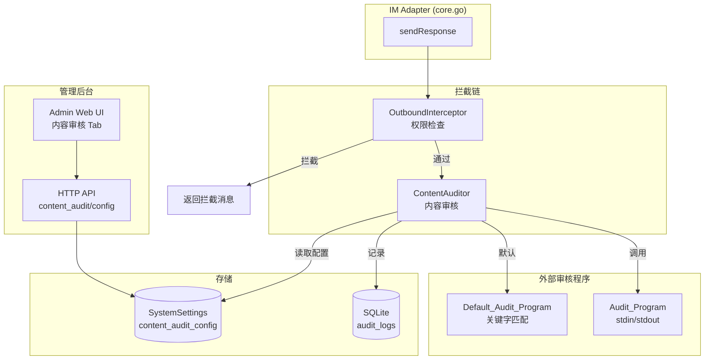
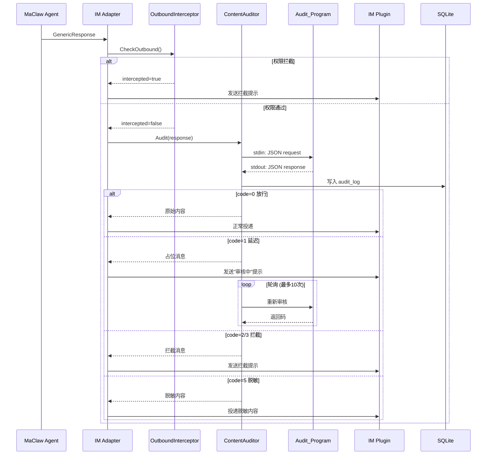

# 设计文档：IM 内容审核

## Overview

本设计为 MaClaw Hub 的 IM 出站通道添加内容审核能力。核心思路是在现有的 `sendResponse` 投递流程中，于 `OutboundInterceptor` 安全检查之后插入一个新的 `ContentAuditor` 模块。该模块通过 stdin/stdout JSON 协议调用外部审核程序（Audit_Program），根据返回码决定消息的放行、拦截、延迟投递或内容脱敏。

同时，Hub 内置一个基于关键字匹配的默认审核程序（Default_Audit_Program），作为独立的 Go 可执行文件随 Hub 一起编译部署，实现开箱即用。管理后台新增"内容审核"配置界面，支持动态配置关键字列表和审核参数。

### 关键设计决策

1. **外部进程模型**：审核程序作为独立进程通过 stdin/stdout 通信，而非嵌入式插件。这保证了审核逻辑的隔离性和可替换性，同时允许使用任意语言实现审核程序。
2. **串行拦截链**：ContentAuditor 在 OutboundInterceptor 之后执行，形成两级拦截链。OutboundInterceptor 负责权限检查（文件/图片外发权限），ContentAuditor 负责内容合规检查。
3. **进程池限流**：通过 semaphore 限制并发审核进程数量（上限 10），防止审核程序故障时进程泄漏。
4. **配置双通道**：审核程序路径等基础配置来自 YAML 配置文件（`config.yaml`），关键字列表等动态配置存储在 SystemSettings 数据库中，通过管理后台 API 管理。

## Architecture



### 消息审核流程



## Components and Interfaces

### 1. ContentAuditor (`hub/internal/im/content_auditor.go`)

核心审核模块，负责调用外部审核程序并处理返回结果。

```go
// ContentAuditor 调用外部审核程序对 IM 出站内容进行合规检查。
type ContentAuditor struct {
    programPath    string
    timeoutSec     int
    timeoutPolicy  string // "block" or "pass"
    semaphore      chan struct{} // 并发限流，容量 10
    logStore       AuditLogStore
    configProvider func() *ContentAuditDynamicConfig // 从 SystemSettings 读取动态配置
}

// AuditRequest 是写入审核程序 stdin 的 JSON 结构。
type AuditRequest struct {
    Type     string   `json:"type"`      // "text", "image", "file"
    Content  string   `json:"content"`   // 文本内容或 base64 编码数据
    UserID   string   `json:"user_id"`
    Platform string   `json:"platform"`
    Keywords []string `json:"keywords,omitempty"` // 动态关键字列表
}

// AuditResponse 是从审核程序 stdout 读取的 JSON 结构。
type AuditResponse struct {
    Code             int    `json:"code"`
    Message          string `json:"message,omitempty"`
    SanitizedContent string `json:"sanitized_content,omitempty"`
}

// AuditResult 是 ContentAuditor 返回给调用方的审核结果。
type AuditResult struct {
    Action   AuditAction // Pass, Block, Delay, Sanitize, ManualReview
    Response *GenericResponse // 替换后的响应（拦截/脱敏时使用）
    Message  string // 审核程序返回的附加说明
}

type AuditAction int
const (
    AuditPass AuditAction = iota
    AuditBlock
    AuditDelay
    AuditSanitize
    AuditManualReview
    AuditError
)

func NewContentAuditor(programPath string, timeoutSec int, timeoutPolicy string, logStore AuditLogStore, configProvider func() *ContentAuditDynamicConfig) *ContentAuditor

// Audit 对 GenericResponse 执行内容审核，返回审核结果。
func (ca *ContentAuditor) Audit(ctx context.Context, userID, platform string, resp *GenericResponse) *AuditResult

// auditContent 调用外部审核程序执行单次审核。
func (ca *ContentAuditor) auditContent(ctx context.Context, req *AuditRequest) (*AuditResponse, error)
```

### 2. AuditLogStore (`hub/internal/im/audit_log_store.go`)

审核日志持久化接口及 SQLite 实现。

```go
type AuditLogEntry struct {
    ID          int64
    Timestamp   time.Time
    UserID      string
    Platform    string
    ContentType string // "text", "image", "file"
    Summary     string // 文本前200字符或文件名
    ReturnCode  int
    Duration    time.Duration
    Message     string // 审核程序返回的 message
    ContentHash string // SHA-256，仅拦截时记录
}

type AuditLogStore interface {
    WriteLog(ctx context.Context, entry *AuditLogEntry) error
}
```

### 3. Default_Audit_Program (`hub/cmd/audit_program/main.go`)

内置默认审核程序，独立 Go 可执行文件。

```go
// 从 stdin 读取 AuditRequest JSON
// 根据 type 字段分发处理：
//   text  → 关键字匹配检查
//   image → 直接返回 code=0
//   file  → 直接返回 code=0
// 将 AuditResponse JSON 写入 stdout

// 关键字来源优先级：
// 1. stdin JSON 中的 keywords 字段
// 2. --keywords-file 命令行参数指定的文件（每行一个关键字）
```

### 4. Admin API Handlers (`hub/internal/httpapi/content_audit_handler.go`)

```go
// GET  /api/admin/content_audit/config → 读取 SystemSettings 中的 content_audit_config
// PUT  /api/admin/content_audit/config → 写入 SystemSettings 中的 content_audit_config

type ContentAuditConfig struct {
    ProgramPath    string   `json:"program_path"`
    TimeoutSeconds int      `json:"timeout_seconds"`
    TimeoutPolicy  string   `json:"timeout_policy"`
    Keywords       []string `json:"keywords"`
}
```

### 5. Admin Web UI 变更 (`hub/web/admin/index.html`)

在 IM 插件 tab 的子 tab 栏中新增"内容审核"子 tab，包含：
- 审核程序路径输入框
- 超时时间输入框
- 超时策略下拉选择（block/pass）
- 关键字列表多行文本框（每行一个关键字）
- 保存/加载按钮

### 6. 集成点变更 (`hub/internal/im/core.go`)

在 `Adapter.sendResponse` 方法中，`OutboundInterceptor.CheckOutbound` 之后插入 `ContentAuditor.Audit` 调用：

```go
func (a *Adapter) sendResponse(ctx context.Context, plugin IMPlugin, target UserTarget, resp *GenericResponse) {
    // 1. 现有：OutboundInterceptor 权限检查
    if a.outboundInterceptor != nil {
        newResp, intercepted := a.outboundInterceptor.CheckOutbound(ctx, target.UnifiedUserID, resp, plugin.Name())
        if intercepted {
            resp = newResp
            // 被权限拦截，跳过内容审核
            // ... 直接投递拦截消息 ...
            return
        }
    }

    // 2. 新增：ContentAuditor 内容审核
    if a.contentAuditor != nil {
        result := a.contentAuditor.Audit(ctx, target.UnifiedUserID, plugin.Name(), resp)
        switch result.Action {
        case AuditBlock, AuditManualReview:
            resp = result.Response
        case AuditDelay:
            // 发送占位消息，启动后台轮询
            // ...
        case AuditSanitize:
            resp = result.Response
        case AuditError:
            // 根据 timeout_policy 决定
        }
    }

    // 3. 现有：格式化和投递逻辑
    // ...
}
```

## Data Models

### SQLite 表：`audit_logs`

```sql
CREATE TABLE IF NOT EXISTS audit_logs (
    id           INTEGER PRIMARY KEY AUTOINCREMENT,
    timestamp    DATETIME NOT NULL DEFAULT CURRENT_TIMESTAMP,
    user_id      TEXT NOT NULL,
    platform     TEXT NOT NULL,
    content_type TEXT NOT NULL,  -- 'text', 'image', 'file'
    summary      TEXT NOT NULL,  -- 文本前200字符或文件名
    return_code  INTEGER NOT NULL,
    duration_ms  INTEGER NOT NULL,
    message      TEXT,           -- 审核程序返回的 message
    content_hash TEXT            -- SHA-256，仅拦截时记录
);

CREATE INDEX IF NOT EXISTS idx_audit_logs_timestamp ON audit_logs(timestamp);
CREATE INDEX IF NOT EXISTS idx_audit_logs_user_id ON audit_logs(user_id);
CREATE INDEX IF NOT EXISTS idx_audit_logs_return_code ON audit_logs(return_code);
```

### SystemSettings 存储键

- Key: `content_audit_config`
- Value: JSON 字符串

```json
{
    "program_path": "./audit_program",
    "timeout_seconds": 30,
    "timeout_policy": "block",
    "keywords": ["敏感词1", "敏感词2", "测试关键字"]
}
```

### stdin/stdout 协议数据模型

**请求（Hub → Audit_Program stdin）：**
```json
{
    "type": "text",
    "content": "这是一段需要审核的文本内容",
    "user_id": "user-abc-123",
    "platform": "feishu",
    "keywords": ["敏感词1", "敏感词2"]
}
```

**响应（Audit_Program stdout → Hub）：**
```json
{
    "code": 0,
    "message": "审核通过"
}
```

**脱敏响应示例（code=5）：**
```json
{
    "code": 5,
    "message": "已脱敏处理",
    "sanitized_content": "这是一段需要审核的***内容"
}
```

### 返回码枚举

| 返回码 | 含义 | Hub 行为 |
|--------|------|----------|
| 0 | 通过 | 放行原始内容 |
| 1 | 延迟审核 | 发送占位消息，后台轮询 |
| 2 | 数据安全违规 | 拦截，提示"不符合数据安全规则" |
| 3 | 非法信息 | 拦截，提示"包含非法信息" |
| 4 | 需人工审核 | 拦截，提示"等待管理员审批" |
| 5 | 内容脱敏 | 用 sanitized_content 替换后投递 |
| -1 | 程序错误 | 根据 timeout_policy 决定 |
| 其他 | 未定义 | 视为 -1 处理 |


## Correctness Properties

*A property is a characteristic or behavior that should hold true across all valid executions of a system — essentially, a formal statement about what the system should do. Properties serve as the bridge between human-readable specifications and machine-verifiable correctness guarantees.*

### Property 1: Empty program path passthrough

*For any* GenericResponse and any user/platform combination, when the ContentAuditor's `program_path` is empty, the Audit method should return AuditPass with the original response unchanged.

**Validates: Requirements 1.3, 6.4**

### Property 2: Return code to action mapping

*For any* valid return code from the Audit_Program, the ContentAuditor should map it to the correct AuditAction: code 0 → AuditPass, code 1 → AuditDelay, code 2 → AuditBlock, code 3 → AuditBlock, code 4 → AuditManualReview, code 5 → AuditSanitize, code -1 → AuditError. For any integer not in {-1, 0, 1, 2, 3, 4, 5}, the mapping should be identical to code -1.

**Validates: Requirements 3.1, 3.2, 3.3, 3.4, 3.5, 3.6, 3.7, 3.8**

### Property 3: Error policy fallback

*For any* AuditError result (code -1 or undefined codes), when `timeout_policy` is `"pass"` the ContentAuditor should allow the content through, and when `timeout_policy` is `"block"` the ContentAuditor should block the content.

**Validates: Requirements 3.5, 7.1**

### Property 4: Sanitized content replacement

*For any* GenericResponse where the Audit_Program returns code 5 with a non-empty `sanitized_content` field, the delivered response body should equal the `sanitized_content` value, not the original content.

**Validates: Requirements 3.7**

### Property 5: Audit protocol round-trip

*For any* valid AuditRequest, serializing it to JSON and deserializing should produce an equivalent AuditRequest with all fields (type, content, user_id, platform, keywords) preserved. Similarly, for any valid AuditResponse, serializing and deserializing should preserve code, message, and sanitized_content.

**Validates: Requirements 2.1, 2.2**

### Property 6: Audit log completeness

*For any* audit invocation, the resulting AuditLogEntry should contain non-zero timestamp, the correct user_id, platform, content_type, a summary (first 200 chars of text or filename), the return code, positive duration, and the audit program's message. Additionally, when the return code is 2, 3, or 4, the content_hash field should be a valid SHA-256 hex string; when the return code is 0 or 1, content_hash should be empty.

**Validates: Requirements 5.1, 5.2**

### Property 7: Audit log persistence round-trip

*For any* valid AuditLogEntry, writing it to the AuditLogStore and reading it back should produce an equivalent entry.

**Validates: Requirements 5.3**

### Property 8: Outbound interceptor short-circuits audit

*For any* GenericResponse that is intercepted by OutboundInterceptor (intercepted=true), the ContentAuditor's Audit method should not be called.

**Validates: Requirements 6.2**

### Property 9: Concurrent audit semaphore

*For any* number N > 10 of simultaneous audit requests, at most 10 Audit_Program processes should be running concurrently.

**Validates: Requirements 7.4**

### Property 10: Default audit program type-based routing

*For any* AuditRequest processed by the Default_Audit_Program: when type is `"image"`, the response code should be 0; when type is `"file"`, the response code should be 0; when type is `"text"` and the content contains any keyword from the keywords list, the response code should be 2; when type is `"text"` and the content contains no keyword, the response code should be 0.

**Validates: Requirements 8.3, 8.4, 8.5**

### Property 11: Default audit program keyword hit message

*For any* text content that triggers a keyword match in the Default_Audit_Program, the response `message` field should contain the matched keyword string.

**Validates: Requirements 8.7**

### Property 12: Keywords passthrough from config to stdin

*For any* non-empty keywords list stored in the SystemSettings `content_audit_config`, when the ContentAuditor invokes the Audit_Program, the stdin JSON's `keywords` field should contain exactly those keywords.

**Validates: Requirements 8.8**

### Property 13: Admin config persistence round-trip

*For any* valid ContentAuditConfig (containing program_path, timeout_seconds, timeout_policy, and a keywords list), saving it via `PUT /api/admin/content_audit/config` and reading it back via `GET /api/admin/content_audit/config` should produce an equivalent config. The keywords field should be a JSON string array.

**Validates: Requirements 9.3, 9.4, 9.6**

### Property 14: Delay resolution delivers correct outcome

*For any* content initially receiving code 1 (delay), when the subsequent polling returns code 0, the original content should be delivered to the receiver. When polling returns code 2 or 3, the corresponding block message should be delivered instead.

**Validates: Requirements 4.3, 4.4**

## Error Handling

### 审核程序错误

| 错误场景 | 处理方式 |
|----------|----------|
| `program_path` 为空 | 跳过审核，直接放行 |
| `program_path` 指向不存在的文件 | 视为 code -1，根据 `timeout_policy` 处理 |
| 审核程序启动失败 | 视为 code -1，记录错误日志 |
| 审核程序超时 | 终止进程，视为 code -1 |
| stdout 输出非法 JSON | 视为 code -1 |
| 进程非零退出码且无有效输出 | 视为 code -1 |
| 未定义的返回码 | 视为 code -1 |
| 并发审核超过 10 个 | 等待 semaphore 释放（带 context 超时） |

### 审核日志错误

| 错误场景 | 处理方式 |
|----------|----------|
| 数据库写入失败 | 记录错误日志，审核决策不受影响 |
| 数据库连接丢失 | 同上，fail-open 策略 |

### 管理后台 API 错误

| 错误场景 | 处理方式 |
|----------|----------|
| 未认证访问 | 返回 401 |
| 无效 JSON 请求体 | 返回 400 |
| SystemSettings 读写失败 | 返回 500，记录错误日志 |

### 延迟审核错误

| 错误场景 | 处理方式 |
|----------|----------|
| 轮询超过 10 次仍为 code 1 | 停止轮询，发送"审核超时"消息 |
| 轮询中审核程序出错 | 视为 code -1，根据 `timeout_policy` 处理 |

## Testing Strategy

### 单元测试

单元测试覆盖具体示例和边界情况：

1. **Config 默认值测试**：验证 `Default()` 返回的 Config 包含 `ContentAudit` 段及正确默认值（验证需求 1.1, 1.2）
2. **非法 JSON 解析测试**：验证非法 stdout 输出被正确处理为 code -1（验证需求 2.4）
3. **超时终止测试**：验证审核程序超时后进程被终止（验证需求 2.3, 7.1）
4. **进程启动失败测试**：验证不存在的程序路径返回 code -1（验证需求 1.4, 7.2）
5. **进程非零退出测试**：验证进程崩溃时返回 code -1（验证需求 7.3）
6. **延迟轮询超时测试**：验证 10 次轮询后发送超时消息（验证需求 4.5）
7. **审核日志写入失败测试**：验证日志失败不影响审核决策（验证需求 5.4）
8. **Admin API 端点测试**：验证 GET/PUT 端点存在且需要认证（验证需求 9.5）
9. **Admin UI 结构测试**：验证 HTML 包含内容审核 tab 和所有表单字段（验证需求 9.1, 9.2）
10. **关键字文件加载测试**：验证 `--keywords-file` 参数正确加载关键字（验证需求 8.6）

### 属性测试（Property-Based Testing）

使用 Go 的 `testing/quick` 包或 `github.com/leanovate/gopter` 库进行属性测试。每个属性测试至少运行 100 次迭代。

每个属性测试必须以注释标注对应的设计属性：

```go
// Feature: im-content-audit, Property 1: Empty program path passthrough
func TestProperty_EmptyProgramPathPassthrough(t *testing.T) { ... }

// Feature: im-content-audit, Property 2: Return code to action mapping
func TestProperty_ReturnCodeToActionMapping(t *testing.T) { ... }
```

属性测试列表（对应上述 Correctness Properties）：

| 属性编号 | 测试函数 | 最少迭代 |
|----------|----------|----------|
| Property 1 | TestProperty_EmptyProgramPathPassthrough | 100 |
| Property 2 | TestProperty_ReturnCodeToActionMapping | 100 |
| Property 3 | TestProperty_ErrorPolicyFallback | 100 |
| Property 4 | TestProperty_SanitizedContentReplacement | 100 |
| Property 5 | TestProperty_AuditProtocolRoundTrip | 100 |
| Property 6 | TestProperty_AuditLogCompleteness | 100 |
| Property 7 | TestProperty_AuditLogPersistenceRoundTrip | 100 |
| Property 8 | TestProperty_OutboundInterceptorShortCircuits | 100 |
| Property 9 | TestProperty_ConcurrentAuditSemaphore | 100 |
| Property 10 | TestProperty_DefaultAuditProgramTypeRouting | 100 |
| Property 11 | TestProperty_DefaultAuditProgramKeywordHitMessage | 100 |
| Property 12 | TestProperty_KeywordsPassthroughFromConfig | 100 |
| Property 13 | TestProperty_AdminConfigPersistenceRoundTrip | 100 |
| Property 14 | TestProperty_DelayResolutionOutcome | 100 |

### 测试工具选择

- **属性测试库**：`github.com/leanovate/gopter`（Go 生态中成熟的 PBT 库，支持自定义生成器）
- **单元测试**：标准 `testing` 包
- **Mock**：对 AuditLogStore、外部进程调用使用接口 mock
- **集成测试**：使用真实的 Default_Audit_Program 可执行文件进行端到端测试
