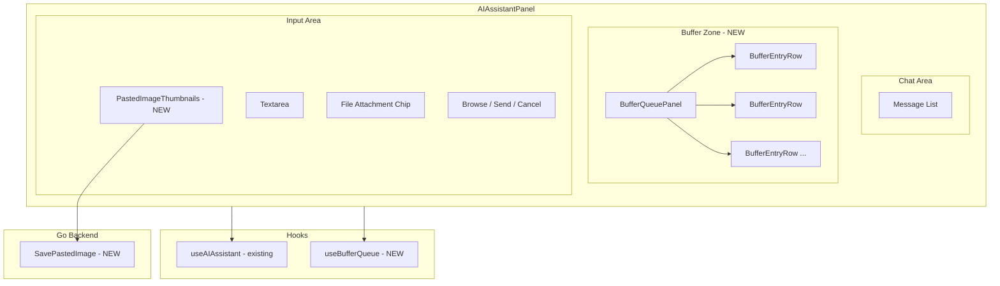
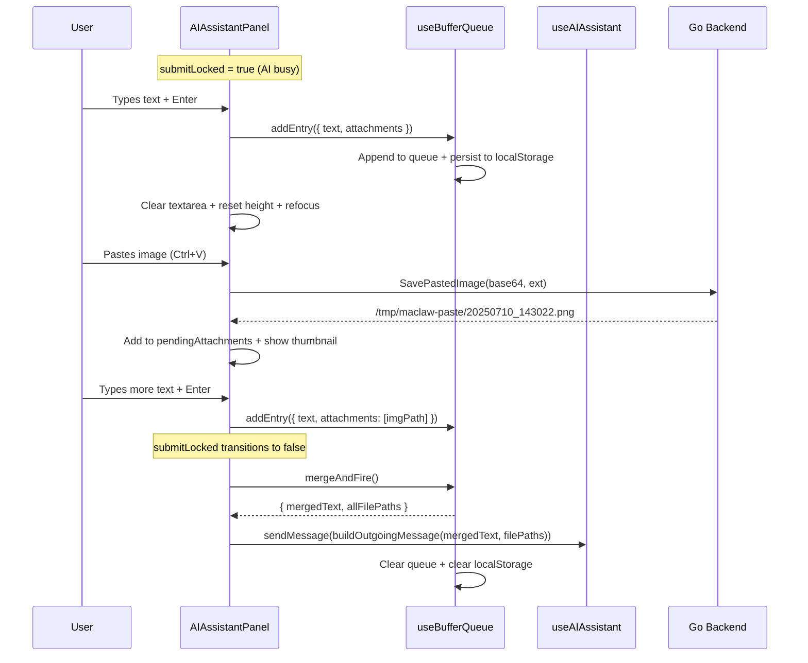

# Design Document: Input Buffer Queue

## Overview

本设计为 MaClaw AI 助手面板新增输入缓冲队列（Input Buffer Queue），允许用户在 AI 助手忙碌时（`submitLocked = true`）继续提交多条指令。这些指令以有序队列形式缓存在输入框上方，待 AI 助手空闲后自动合并为一条消息发射。

### 核心设计决策

1. **状态管理位置**：Buffer Queue 状态放在 `AIAssistantPanel.tsx` 组件内部（`useState`），而非 `useAIAssistant` hook 中。原因：队列是纯 UI 层概念，不涉及后端通信；合并发射时调用已有的 `sendMessage` 即可。
2. **拖拽实现**：使用 Pointer Events API（`onPointerDown/Move/Up`），不使用 HTML5 Drag API。原因：Wails WebView 中 HTML5 Drag API 行为不一致，Pointer Events 提供更可靠的跨平台体验。
3. **粘贴图片存储**：图片通过后端 Wails binding `SavePastedImage` 保存为临时文件，前端只存储文件路径 + 缩略图 data URL。不使用 base64 存储，避免 localStorage 膨胀。
4. **合并策略**：所有 Buffer Entry 的文本用 `\n\n---\n\n` 分隔符拼接，文件路径聚合后通过已有的 `buildOutgoingMessage` 格式附加。一次性发射，不逐条发送。
5. **组件拆分**：新增独立的 `BufferQueuePanel` 组件和 `useBufferQueue` hook，保持 `AIAssistantPanel.tsx` 的可维护性。

## Architecture

### 组件层次结构



### 数据流



## Components and Interfaces

### 1. `useBufferQueue` Hook (NEW)

**文件**: `gui/frontend/src/components/ai/useBufferQueue.ts`

```typescript
interface BufferEntry {
  id: string;                    // 唯一标识，nanoid 或 timestamp-based
  text: string;                  // 文本内容
  attachments: AttachmentInfo[]; // 文件附件列表
  createdAt: number;             // 创建时间戳
}

interface AttachmentInfo {
  filePath: string;              // 绝对文件路径
  thumbnailDataUrl?: string;     // 仅图片类型：blob data URL 用于缩略图显示
  isImage: boolean;              // 是否为图片附件
  fileName: string;              // 文件名（从路径提取）
  extension: string;             // 文件扩展名（小写，含点号）
}

interface UseBufferQueueReturn {
  queue: BufferEntry[];
  addEntry: (text: string, attachments: AttachmentInfo[]) => void;
  removeEntry: (id: string) => void;
  updateEntry: (id: string, text: string, attachments: AttachmentInfo[]) => void;
  reorderEntry: (fromIndex: number, toIndex: number) => void;
  mergeAndFire: () => { mergedText: string; allFilePaths: string[] } | null;
  clearQueue: () => void;
  restoreQueue: () => BufferEntry[];  // 从 localStorage 恢复
}
```

**localStorage key**: `"ai_assistant_buffer_queue"`

**持久化策略**：每次 `addEntry`/`removeEntry`/`updateEntry`/`reorderEntry` 后同步写入 localStorage。存储格式为 `JSON.stringify(queue)`，但 `thumbnailDataUrl` 字段在序列化时排除（避免 localStorage 膨胀）。恢复时图片缩略图不可用，仅显示文件路径。

### 2. `BufferQueuePanel` Component (NEW)

**文件**: `gui/frontend/src/components/ai/BufferQueuePanel.tsx`

**Props**:
```typescript
interface BufferQueuePanelProps {
  queue: BufferEntry[];
  lang: string;
  theme: Theme;
  editingEntryId: string | null;
  onEdit: (id: string) => void;
  onCancelEdit: () => void;
  onSaveEdit: (id: string, text: string, attachments: AttachmentInfo[]) => void;
  onDelete: (id: string) => void;
  onReorder: (fromIndex: number, toIndex: number) => void;
}
```

**布局**:
- 位于 `ai-input-bar` div 的正上方，在 workflow docs bar 的下方
- 最大高度 40% 的聊天区域可见高度，超出时内部滚动（`overflow-y: auto`）
- 使用与 `ai-input-bar` 相同的 `background`、`border` 色值
- Header 行显示队列计数（如 "3 条待发送"）

**每条 BufferEntryRow**:
- 左侧：Drag Handle（`⠿` 或 `≡` 图标），cursor: grab
- 中间：文本预览（截断 80 字符 + `...`）+ 附件指示器（图片缩略图 24×24px / 文件类型图标）
- 右侧：编辑按钮（✏️）+ 删除按钮（🗑）
- 编辑模式：替换为 textarea + 附件管理区 + 确认/取消按钮

### 3. `AIAssistantPanel.tsx` 修改

**handleSend 修改逻辑**:
```
if (submitLocked) {
  // 创建 BufferEntry 并加入队列
  if (!text.trim() && pendingAttachments.length === 0 && !selectedFilePath) return;
  addEntry(text, collectAttachments());
  clearInput();
  clearPendingAttachments();
  clearSelectedFile();
  refocusTextarea();
} else if (queue.length > 0) {
  // 不应该发生：submitLocked=false 且队列非空时，mergeAndFire 应已触发
  // 安全兜底：执行 mergeAndFire
} else {
  // 正常发送（现有逻辑不变）
  await sendMessage(text);
}
```

**mergeAndFire 触发时机**：通过 `useEffect` 监听 `submitLocked` 从 `true` → `false` 的转换：
```typescript
const prevSubmitLockedRef = useRef(submitLocked);
useEffect(() => {
  if (prevSubmitLockedRef.current && !submitLocked && queue.length > 0) {
    executeMergeAndFire();
  }
  prevSubmitLockedRef.current = submitLocked;
}, [submitLocked, queue.length]);
```

**粘贴图片处理**：在 textarea 的 `onPaste` 事件中拦截：
```typescript
const handlePaste = async (e: React.ClipboardEvent) => {
  const items = e.clipboardData?.items;
  if (!items) return;
  for (const item of items) {
    if (item.type.startsWith('image/')) {
      e.preventDefault();
      const blob = item.getAsFile();
      if (!blob) continue;
      const ext = blob.type === 'image/png' ? 'png' : 'jpg';
      const base64 = await blobToBase64(blob);
      const filePath = await SavePastedImage(base64, ext);
      const thumbnailDataUrl = URL.createObjectURL(blob);
      addPendingAttachment({ filePath, thumbnailDataUrl, isImage: true, ... });
      return; // 阻止默认粘贴
    }
  }
  // 非图片：允许默认文本粘贴
};
```

**placeholder 文本更新**：
```typescript
const placeholderText = !ready
  ? initLabel
  : submitLocked
    ? localizeText(lang, "Press Enter to queue...", "输入后按回车缓存...", "輸入後按 Enter 緩存...")
    : showThinkingState ? thinkingText
    : showProcessingState ? processingText
    : idlePlaceholderText;
```

### 4. 拖拽排序实现

使用 Pointer Events 实现，不依赖任何第三方拖拽库：

**状态**:
```typescript
const [dragState, setDragState] = useState<{
  draggingId: string | null;
  startY: number;
  currentY: number;
  startIndex: number;
} | null>(null);
```

**流程**:
1. `onPointerDown` on Drag Handle → 记录起始位置，`setPointerCapture`
2. `onPointerMove` → 计算偏移量，确定目标插入位置，显示插入线指示器
3. `onPointerUp` → 调用 `reorderEntry(fromIndex, toIndex)`，清除拖拽状态，`releasePointerCapture`

**视觉反馈**:
- 被拖拽条目：`opacity: 0.5`，`transform: translateY(deltaY)`
- 插入位置：2px 高的蓝色线条（`borderTop: 2px solid ${t.headingColor}`）

### 5. 文件类型图标映射

```typescript
const FILE_TYPE_ICONS: Record<string, string> = {
  // 文档
  '.pdf': '📕', '.doc': '📘', '.docx': '📘', '.xls': '📗', '.xlsx': '📗',
  '.ppt': '📙', '.pptx': '📙', '.txt': '📝', '.md': '📝', '.csv': '📊',
  // 代码
  '.js': '🟨', '.ts': '🔷', '.jsx': '🟨', '.tsx': '🔷',
  '.py': '🐍', '.go': '🔵', '.rs': '🦀', '.java': '☕',
  '.c': '🔧', '.cpp': '🔧', '.h': '🔧', '.cs': '🟣',
  '.html': '🌐', '.css': '🎨', '.json': '📋', '.xml': '📋',
  '.yaml': '📋', '.yml': '📋', '.toml': '📋',
  // 图片（非粘贴图片，用户浏览选择的）
  '.png': '🖼️', '.jpg': '🖼️', '.jpeg': '🖼️', '.gif': '🖼️',
  '.svg': '🖼️', '.webp': '🖼️', '.bmp': '🖼️',
  // 压缩
  '.zip': '📦', '.tar': '📦', '.gz': '📦', '.rar': '📦',
  // 其他
  '.sh': '⚙️', '.bat': '⚙️', '.ps1': '⚙️',
};
const DEFAULT_FILE_ICON = '📄';

function getFileTypeIcon(extension: string): string {
  return FILE_TYPE_ICONS[extension.toLowerCase()] || DEFAULT_FILE_ICON;
}
```

### 6. Backend `SavePastedImage` Wails Binding (NEW)

**文件**: `gui/app_wails_bindings.go`

```go
// SavePastedImage saves a base64-encoded image to a temporary file and returns
// the absolute file path. The image is stored in os.TempDir()/maclaw-paste/
// with a timestamped filename.
func (a *App) SavePastedImage(base64Data string, extension string) (string, error) {
    // 1. Validate extension (only png, jpg, jpeg, gif, webp, bmp allowed)
    // 2. Create temp directory: os.TempDir()/maclaw-paste/
    // 3. Generate filename: paste_20250710_143022_<random4>.png
    // 4. Decode base64 → []byte
    // 5. Write to file
    // 6. Return absolute path
}
```

**安全约束**:
- 仅允许图片扩展名白名单
- base64 数据大小上限 50MB（解码前）
- 临时目录自动创建，权限 0755
- 文件权限 0644

### 7. `buildOutgoingMessage` 扩展

当前 `buildOutgoingMessage(text, selectedFilePath)` 只支持单个文件路径。合并发射时需要支持多个文件路径。

**方案**：新增 `buildOutgoingMessageMulti(text: string, filePaths: string[]): string` 函数：

```typescript
function buildOutgoingMessageMulti(text: string, filePaths: string[]): string {
  const trimmedText = text.trim();
  const validPaths = filePaths.map(p => p.trim()).filter(Boolean);
  if (validPaths.length === 0) return trimmedText;

  const hasImages = validPaths.some(isImageFilePath);
  const pathInstructions = hasImages
    ? "这是用户已经提供的本地文件。图片文件不要调用 screenshot 或重新截图；请直接使用这些路径。"
    : "请直接使用这些路径；如需查看内容可调用 read_file、open 等工具。";

  const fileBlock = [
    FILE_PATH_PROMPT_PREFIX,
    ...validPaths,
    pathInstructions,
  ].join("\n");

  return trimmedText ? `${trimmedText}\n\n${fileBlock}` : fileBlock;
}
```

## Data Models

### BufferEntry

| 字段 | 类型 | 说明 |
|------|------|------|
| `id` | `string` | 唯一标识，格式 `buf-{timestamp}-{counter}` |
| `text` | `string` | 用户输入的文本内容 |
| `attachments` | `AttachmentInfo[]` | 文件附件列表（含浏览选择的文件和粘贴图片） |
| `createdAt` | `number` | 创建时间戳（`Date.now()`） |

### AttachmentInfo

| 字段 | 类型 | 说明 |
|------|------|------|
| `filePath` | `string` | 绝对文件路径 |
| `thumbnailDataUrl` | `string \| undefined` | 图片缩略图 data URL（仅图片类型，不持久化到 localStorage） |
| `isImage` | `boolean` | 是否为图片附件 |
| `fileName` | `string` | 文件名（从路径末段提取） |
| `extension` | `string` | 小写扩展名（含点号，如 `.png`） |

### localStorage 持久化格式

**Key**: `"ai_assistant_buffer_queue"`

**Value**: JSON 数组，每个元素为 `BufferEntry`，但 `attachments[].thumbnailDataUrl` 字段被排除：

```json
[
  {
    "id": "buf-1720612222000-1",
    "text": "请检查这个文件的编码问题",
    "attachments": [
      {
        "filePath": "C:\\Users\\user\\Desktop\\test.py",
        "isImage": false,
        "fileName": "test.py",
        "extension": ".py"
      }
    ],
    "createdAt": 1720612222000
  },
  {
    "id": "buf-1720612225000-2",
    "text": "这是截图参考",
    "attachments": [
      {
        "filePath": "C:\\Users\\user\\AppData\\Local\\Temp\\maclaw-paste\\paste_20250710_143022_a1b2.png",
        "isImage": true,
        "fileName": "paste_20250710_143022_a1b2.png",
        "extension": ".png"
      }
    ],
    "createdAt": 1720612225000
  }
]
```

### 合并发射输出格式

多条 BufferEntry 合并后的消息文本格式：

```
<entry1.text>

---

<entry2.text>

---

<entry3.text>

[用户选择的本地文件路径]
C:\path\to\file1.py
C:\path\to\screenshot.png
这是用户已经提供的本地文件。图片文件不要调用 screenshot 或重新截图；请直接使用这些路径。
```


## Correctness Properties

*A property is a characteristic or behavior that should hold true across all valid executions of a system — essentially, a formal statement about what the system should do. Properties serve as the bridge between human-readable specifications and machine-verifiable correctness guarantees.*

### Property 1: Entry creation preserves content

*For any* non-empty text string and any list of attachments (including empty list), when `addEntry` is called while `submitLocked` is true, the queue length SHALL increase by exactly 1, and the newly appended entry SHALL contain the exact input text and all provided attachment file paths.

**Validates: Requirements 1.1, 1.3**

### Property 2: Whitespace-only input rejection

*For any* string composed entirely of whitespace characters (spaces, tabs, newlines, or empty string), and with no file attachments, calling `addEntry` SHALL be rejected — the queue length SHALL remain unchanged.

**Validates: Requirements 1.4**

### Property 3: Text preview truncation

*For any* string, the text preview function SHALL return the original string if its length is ≤ 80 characters, or the first 80 characters followed by "..." if its length exceeds 80 characters.

**Validates: Requirements 2.3**

### Property 4: Queue ordering invariant

*For any* sequence of N `addEntry` calls, the resulting queue SHALL contain exactly N entries in the same order as they were added — `queue[i].createdAt <= queue[i+1].createdAt` for all valid i.

**Validates: Requirements 3.3, 3.4**

### Property 5: Reorder correctness

*For any* queue of N entries and any valid (fromIndex, toIndex) pair where 0 ≤ fromIndex, toIndex < N, after `reorderEntry(fromIndex, toIndex)`, the entry originally at fromIndex SHALL be at toIndex, the queue length SHALL remain N, and all other entries SHALL maintain their relative order.

**Validates: Requirements 6.2**

### Property 6: Edit updates entry text

*For any* existing entry in the queue and any non-empty replacement text, calling `updateEntry(id, newText, attachments)` SHALL update that entry's text to the new value while preserving the entry's id and position in the queue.

**Validates: Requirements 4.2**

### Property 7: Empty edit removes entry

*For any* existing entry in the queue, calling `updateEntry(id, "", [])` (empty text and no attachments) SHALL remove that entry from the queue, reducing queue length by 1.

**Validates: Requirements 4.4**

### Property 8: Delete removes entry

*For any* queue containing at least one entry, calling `removeEntry(id)` for an existing entry SHALL reduce the queue length by exactly 1, and the removed entry's id SHALL no longer appear in the queue. All other entries SHALL maintain their relative order.

**Validates: Requirements 5.1**

### Property 9: Merge-and-fire text concatenation

*For any* non-empty queue of N entries with text contents [t1, t2, ..., tN], calling `mergeAndFire()` SHALL produce a `mergedText` equal to `t1 + "\n\n---\n\n" + t2 + "\n\n---\n\n" + ... + tN`. For a single-entry queue, the merged text SHALL equal the entry's text without any delimiter.

**Validates: Requirements 7.2**

### Property 10: Merge-and-fire file path aggregation

*For any* non-empty queue where entries contain file path attachments, calling `mergeAndFire()` SHALL produce an `allFilePaths` array containing every file path from every entry's attachments, in queue order, with no duplicates lost and no extra paths added. Image attachments (pasted images saved as temp files) SHALL be treated identically to browsed file attachments.

**Validates: Requirements 7.3, 7.4, 12.7**

### Property 11: Merge-and-fire postconditions

*For any* non-empty queue of N entries, after `mergeAndFire()` completes, the queue SHALL be empty (length 0), and `recordSubmittedPrompt` SHALL have been called exactly N times — once for each entry's text content, in queue order.

**Validates: Requirements 7.5, 7.6**

### Property 12: Persistence round-trip

*For any* queue state, after any mutation (add, edit, remove, reorder), the serialized queue in `localStorage` SHALL, when deserialized, produce a queue equivalent to the current in-memory queue (excluding `thumbnailDataUrl` fields which are not persisted). Conversely, restoring from localStorage SHALL produce the same queue state.

**Validates: Requirements 9.1, 9.2**

### Property 13: Sequential paste accumulation

*For any* sequence of N image paste events (N ≥ 1), each paste SHALL add exactly one new attachment to the pending attachment list, resulting in a list of length N. No previous attachments SHALL be lost or duplicated.

**Validates: Requirements 12.5**

## Error Handling

### Frontend Error Handling

| 场景 | 处理方式 |
|------|---------|
| `SavePastedImage` 后端调用失败 | 显示 toast 提示"图片保存失败"，不添加附件，不阻断用户输入 |
| `localStorage` 写入失败（配额满） | `console.warn` 记录，队列仍在内存中正常工作，下次成功时重新持久化 |
| `localStorage` 读取失败或数据损坏 | 启动时 `console.warn`，使用空队列，不影响正常功能 |
| `mergeAndFire` 中 `sendMessage` 失败 | 不清空队列，保留条目供用户重试；显示错误消息 |
| 粘贴事件中 blob 提取失败 | 静默忽略，允许默认粘贴行为（文本粘贴） |
| base64 编码失败（FileReader error） | `console.error` 记录，不添加附件，不阻断用户输入 |
| 拖拽过程中指针丢失（pointercancel） | 重置拖拽状态，不执行 reorder |

### Backend Error Handling

| 场景 | 处理方式 |
|------|---------|
| base64 解码失败 | 返回 error："invalid base64 data" |
| 不支持的图片扩展名 | 返回 error："unsupported image extension: {ext}" |
| base64 数据超过 50MB | 返回 error："image data too large (max 50MB)" |
| 临时目录创建失败 | 返回 error，包含 OS 错误信息 |
| 文件写入失败（磁盘满等） | 返回 error，包含 OS 错误信息 |

## Testing Strategy

### Property-Based Tests

使用 [fast-check](https://github.com/dubzzz/fast-check) 作为 TypeScript 的 property-based testing 库，配合 Vitest 测试框架。

每个 property test 最少运行 **100 次迭代**。

**测试文件**: `gui/frontend/src/components/ai/__tests__/useBufferQueue.property.test.ts`

测试覆盖 Property 1-13，每个 property 对应一个 `it.prop` 或 `fc.assert(fc.property(...))` 测试用例。

**Tag 格式**: 每个测试用例注释标注 `// Feature: input-buffer-queue, Property N: <property_text>`

**生成器设计**:
- `arbNonEmptyText`: `fc.string({ minLength: 1 }).filter(s => s.trim().length > 0)` — 非空非纯空白文本
- `arbWhitespaceText`: `fc.stringOf(fc.constantFrom(' ', '\t', '\n', '\r'))` — 纯空白文本
- `arbAttachment`: `fc.record({ filePath: fc.string(), isImage: fc.boolean(), fileName: fc.string(), extension: fc.constantFrom('.png', '.jpg', '.pdf', '.py', '.txt') })` — 随机附件
- `arbBufferEntry`: 组合 `arbNonEmptyText` + `fc.array(arbAttachment)` — 随机队列条目
- `arbQueue`: `fc.array(arbBufferEntry, { minLength: 1, maxLength: 20 })` — 随机队列
- `arbReorderPair(n)`: `fc.tuple(fc.nat(n-1), fc.nat(n-1))` — 随机 (from, to) 索引对

### Unit Tests (Example-Based)

**测试文件**: `gui/frontend/src/components/ai/__tests__/useBufferQueue.test.ts`

覆盖：
- 空队列初始状态
- `addEntry` 基本流程（文本 + 附件）
- `removeEntry` 最后一条时队列变空
- 编辑模式进入/保存/取消
- `mergeAndFire` 单条目（无分隔符）
- `mergeAndFire` 返回 null 当队列为空
- localStorage 损坏数据恢复
- 文件类型图标映射（已知扩展名 + 未知扩展名）
- `buildOutgoingMessageMulti` 多文件路径格式

### Component Tests

**测试文件**: `gui/frontend/src/components/ai/__tests__/BufferQueuePanel.test.tsx`

覆盖：
- 队列非空时面板渲染
- 队列为空时面板不渲染
- Header 计数显示（各语言）
- 拖拽手柄存在
- 编辑模式 UI 切换
- 删除按钮点击
- 附件指示器（图片缩略图 / 文件类型图标）
- 主题切换（light/dark）
- 最大高度 40% 滚动

### Integration Tests

**测试文件**: `gui/frontend/src/components/ai/__tests__/AIAssistantPanel.buffer.test.tsx`

覆盖：
- `submitLocked=true` 时 Enter 键创建 BufferEntry
- `submitLocked=false` 时 Enter 键正常发送
- `submitLocked` 从 true→false 触发 mergeAndFire
- 粘贴图片 → SavePastedImage 调用 → 缩略图显示
- 非图片粘贴 → 默认行为
- placeholder 文本随 submitLocked 状态变化
- 面板挂载时从 localStorage 恢复队列

### Backend Tests

**测试文件**: `gui/app_wails_bindings_test.go`

覆盖：
- `SavePastedImage` 正常保存 PNG/JPG
- `SavePastedImage` 拒绝非图片扩展名
- `SavePastedImage` 拒绝超大 base64 数据
- `SavePastedImage` 拒绝无效 base64
- 临时目录自动创建
- 文件名格式验证（时间戳 + 随机后缀）
