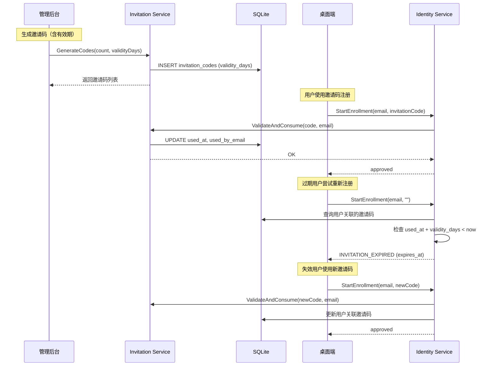

# 设计文档：邀请码有效期管理

## 概述

本设计为 Hub 邀请码系统新增有效期管理能力。核心思路是在现有 `InvitationCode` 数据模型上扩展 `validity_days` 字段，在邀请码被消费（绑定用户）时利用已有的 `used_at` 作为绑定时间基准，结合 `validity_days` 计算过期时间。过期检查嵌入到 `IdentityService.StartEnrollment` 流程中，拒绝过期用户的注册请求并返回专用错误码 `INVITATION_EXPIRED`。失效用户可通过提供新邀请码重新绑定。

同时，本设计移除 Governance 页面中已废弃的 Email 邀请（Invites）区域，简化管理界面。

### 设计决策

1. **复用 `used_at` 作为 `bound_at`**：需求 4.3 明确要求使用已有的 `UsedAt` 字段作为绑定时间来源，避免引入冗余字段。设计中不新增 `bound_at` 列，而是在 API 响应中将 `used_at` 映射为 `bound_at` 语义。
2. **`validity_days` 存储在邀请码记录上**：有效期是邀请码的属性而非用户的属性，这样同一系统中可以有不同有效期的邀请码共存。
3. **过期检查在 Enrollment 阶段执行**：每次设备注册（Enroll）时检查关联邀请码是否过期，而非通过定时任务。这样实现简单且实时性好。
4. **管理后台单位转换在前端完成**：天/月/年的单位选择和转换逻辑放在 Admin Console 前端，后端只接收和存储 `validity_days`（整数天数）。
5. **向后兼容通过默认值 0 实现**：`validity_days` 默认为 0 表示长期有效，旧数据无需迁移即可正常工作。

## 架构



### 组件交互

- **Invitation Service**：扩展 `GenerateCodes` 接受 `validityDays` 参数；扩展 `ValidateAndConsume` 和列表 API 返回 `validity_days`。新增 `GetByEmail` 方法用于按邮箱查询已使用的邀请码。
- **Identity Service**：在 `StartEnrollment` 中增加过期检查逻辑；支持失效用户通过新邀请码重新绑定。新增 `ErrInvitationExpired` 错误。
- **InvitationCodeValidator 接口**：扩展 `CheckExpiry(ctx, email)` 方法，供 Identity Service 调用。
- **Admin Console**：邀请码生成表单增加有效期输入；列表增加有效期/剩余天数显示；移除 Email 邀请区域。
- **Desktop Client**：处理 `INVITATION_EXPIRED` 错误码，显示过期提示。

## 组件与接口

### 1. 数据层扩展

#### InvitationCode 数据模型（store/store.go）

```go
type InvitationCode struct {
    ID           string
    Code         string
    Status       string     // "unused" | "used"
    UsedByEmail  string
    UsedAt       *time.Time
    ValidityDays int        // 新增：0 = 长期有效，>0 = 有效天数
    CreatedAt    time.Time
}
```

#### InvitationCodeRepository 接口扩展

```go
type InvitationCodeRepository interface {
    // 现有方法保持不变
    Create(ctx context.Context, item *InvitationCode) error
    GetByCode(ctx context.Context, code string) (*InvitationCode, error)
    List(ctx context.Context, status string, search string) ([]*InvitationCode, error)
    ListPaged(ctx context.Context, status string, search string, offset, limit int) ([]*InvitationCode, int, error)
    MarkUsed(ctx context.Context, id string, email string, usedAt time.Time) error
    // 新增
    GetByEmail(ctx context.Context, email string) (*InvitationCode, error) // 按 used_by_email 查询已使用的邀请码
}
```

### 2. Invitation Service 扩展

```go
// GenerateCodes 扩展签名
func (s *Service) GenerateCodes(ctx context.Context, count int, validityDays int) ([]*store.InvitationCode, error)

// CheckExpiry 检查指定邮箱关联的邀请码是否过期
// 返回值：expired bool, expiresAt *time.Time, err error
func (s *Service) CheckExpiry(ctx context.Context, email string) (bool, *time.Time, error)
```

### 3. InvitationCodeValidator 接口扩展

```go
type InvitationCodeValidator interface {
    IsRequired(ctx context.Context) (bool, error)
    ValidateAndConsume(ctx context.Context, code string, email string) error
    // 新增
    CheckExpiry(ctx context.Context, email string) (bool, *time.Time, error)
}
```

### 4. Identity Service 过期检查

在 `StartEnrollment` 中，对已存在的用户增加过期检查：

```go
var ErrInvitationExpired = errors.New("invitation code has expired")

// StartEnrollment 中的过期检查逻辑（伪代码）
if user != nil && s.invitationSvc != nil {
    expired, expiresAt, _ := s.invitationSvc.CheckExpiry(ctx, email)
    if expired {
        if invitationCode != "" {
            // 失效用户提供了新邀请码 → 重新绑定
            if err := s.invitationSvc.ValidateAndConsume(ctx, invitationCode, email); err != nil {
                return nil, ErrInvalidInvitationCode
            }
            // 继续正常注册流程
        } else {
            return &EnrollmentResult{
                Status:    "invitation_expired",
                Message:   "邀请码已过期",
                ExpiresAt: expiresAt.Format(time.RFC3339),
            }, ErrInvitationExpired
        }
    }
}
```

### 5. HTTP Handler 扩展

#### 生成邀请码请求

```go
type generateCodesRequest struct {
    Count        int `json:"count"`
    ValidityDays int `json:"validity_days"` // 新增
}
```

#### 邀请码列表响应

```go
type invitationCodeResponse struct {
    ID           string  `json:"id"`
    Code         string  `json:"code"`
    Status       string  `json:"status"`
    UsedByEmail  string  `json:"used_by_email"`
    UsedAt       *string `json:"used_at"`
    ValidityDays int     `json:"validity_days"` // 新增
    CreatedAt    string  `json:"created_at"`
}
```

#### Enroll 错误处理

```go
case errors.Is(err, auth.ErrInvitationExpired):
    writeError(w, http.StatusForbidden, "INVITATION_EXPIRED", err.Error())
    // 响应体中包含 expires_at
```

### 6. Admin Console 变更

#### 邀请码生成表单
- 新增有效期数值输入框（默认空 = 长期有效）
- 新增单位选择器：天(×1) / 月(×30) / 年(×365)
- 新增"长期有效"复选框（选中时 validity_days = 0）

#### 邀请码列表
- 新增"有效期"列：显示 validity_days（0 显示"长期有效"）
- 已使用的邀请码显示剩余天数或"已过期"标记
- 过期邀请码以红色/醒目样式标记

#### 移除 Email 邀请区域
- 从 Governance 页面移除 Invites 区域（inviteEmail 输入框、createInvite 按钮、invitesTitle/invitesDesc 列表）
- 保留邀请码管理（Invitation Codes）Tab 不受影响

### 7. Desktop Client 变更

在 `EnrollStartHandler` 错误处理中新增 `INVITATION_EXPIRED` 分支，前端显示"用户已失效，请使用新的邀请码重新绑定"。

## 数据模型

### invitation_codes 表变更

```sql
-- 新增列（ALTER TABLE 迁移）
ALTER TABLE invitation_codes ADD COLUMN validity_days INTEGER NOT NULL DEFAULT 0;
```

现有记录的 `validity_days` 默认为 0（长期有效），满足向后兼容要求。

### 过期时间计算

```
expires_at = used_at + validity_days * 24h
is_expired = validity_days > 0 AND now() > expires_at
```

当 `validity_days = 0` 时，永不过期。
当 `used_at` 为 NULL（未使用）时，不存在过期问题。

### API 响应中的有效期信息

邀请码列表 API 响应新增字段：
- `validity_days`: int — 有效期天数（0 = 长期有效）
- `bound_at`: string|null — 绑定时间（即 `used_at` 的别名映射）

Enrollment 过期错误响应：
```json
{
  "code": "INVITATION_EXPIRED",
  "message": "invitation code has expired",
  "expires_at": "2025-03-15T10:30:00Z"
}
```
