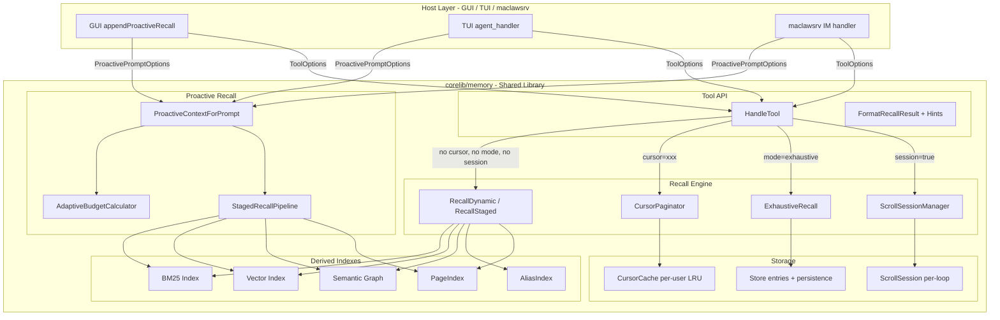

# Design Document: Knowledge Retrieval Multi-Page Recall

## Overview

This feature comprehensively upgrades the knowledge retrieval system in MacLaw/CodeClaw. The current architecture has six interconnected limitations: single-batch recall caps (15 entries / 2500 tokens), write-recall semantic gaps (aliases not resolved), cross-page context loss after compaction, timeout-induced silent recall drops, lack of LLM guidance on recall deepening, and host-specific recall logic duplication.

The design introduces seven complementary mechanisms, **all implemented in `corelib/memory/`** as shared library code consumed by GUI, TUI, and maclawsrv through the same interfaces:

1. **Cursor-based pagination** — Memory Tool recall supports `cursor` for page-by-page traversal
2. **Adaptive proactive recall budget** — auto-expands injection budget when topic density is high
3. **Exhaustive recall mode** — `mode=exhaustive` returns all matches up to hard caps
4. **Scroll-through recall** — session-scoped cached recall for iterative deepening
5. **Page Index** — indexes key facts from compacted pages for cross-page retrieval
6. **Alias Index** — bidirectional alias mappings bridge write-recall semantic gaps
7. **Staged recall pipeline** — progressive results within timeout budget

All mechanisms maintain full backward compatibility and follow the **corelib-first constraint**: hosts pass configuration; corelib implements behavior. No recall logic lives in `gui/`, `tui/`, or `maclawsrv/`.

## Architecture



**Key architectural decisions:**

1. **Corelib-first**: All recall logic lives in `corelib/memory/`. Hosts (GUI/TUI/maclawsrv) only pass configuration structs (`ProactivePromptOptions`, `ToolOptions`). No host imports or host-specific logic inside corelib.

2. **Scoring is performed once, paging is a slice operation.** Both cursor pagination and scroll sessions execute the full multi-signal scoring pipeline only on the first invocation. Subsequent pages slice into the pre-scored candidate list.

3. **Cursor state is ephemeral (in-memory).** Recall cursors are stored in a per-user LRU cache with 5-minute TTL. Not persisted to disk.

4. **Scroll sessions are scoped to the agent loop execution.** Created when `LoopID` is set in `ToolOptions`; destroyed when the host calls `ScrollSessionManager.Destroy(loopID)`.

5. **Adaptive budget is computed inside `ProactiveContextForPrompt`.** No new background processes needed. Hosts see the expanded results transparently.

6. **Page Index is per-user, in-memory, with host-controlled lifecycle.** Hosts call `Store.IndexCompactedPage(userID, entries)` when compaction occurs and `Store.ClearPageIndex(userID)` on session reset. All indexing/querying logic is internal.

7. **Alias Index is derived from entry tags/entities.** Rebuilt during `rebuildDerivedIndexesLocked`. No separate persistence — reconstructed from entry metadata on load.

8. **Staged recall provides progressive results under timeout.** BM25 results (fast, <200ms) are always available. Vector and semantic graph are additive stages that improve quality when time permits.

## Components and Interfaces

### 1. CursorPaginator

Manages the lifecycle of paginated recall sessions.

```go
// CursorPaginator manages cursor-based pagination state.
type CursorPaginator struct {
    mu      sync.Mutex
    cursors map[string]*userCursorPool // keyed by userID
}

type userCursorPool struct {
    pool []*RecallCursor // max 10, LRU eviction
}

type RecallCursor struct {
    ID          string
    UserID      string
    Query       string
    Category    Category
    ProjectPath string
    Candidates  []recallScored  // full scored list from initial recall
    Position    int             // next entry index to return
    CreatedAt   time.Time
    LastUsedAt  time.Time
    PageSize    int             // entries returned per page (dynamic, token-bounded)
}

// FirstPage executes the full recall pipeline and returns page 1 + cursor.
func (p *CursorPaginator) FirstPage(store *Store, query string, category Category, projectPath string, ownerID string) (*PaginatedResult, error)

// NextPage returns the next slice from the cursor's candidate list.
func (p *CursorPaginator) NextPage(cursorID string) (*PaginatedResult, error)

// Evict removes expired cursors (called periodically or on new cursor creation).
func (p *CursorPaginator) Evict(userID string)
```

### 2. ScrollSessionManager

Manages scroll-through recall within a single agent loop execution.

```go
// ScrollSessionManager tracks per-loop scroll sessions.
type ScrollSessionManager struct {
    mu       sync.Mutex
    sessions map[string]*ScrollSession // keyed by loopID
}

type ScrollSession struct {
    LoopID     string
    Query      string          // the query that produced the cached candidates
    Candidates []recallScored  // up to 200 scored candidates
    Position   int             // next slice start
    CreatedAt  time.Time
}

// GetOrCreate returns existing session for the loop or creates a new one.
func (m *ScrollSessionManager) GetOrCreate(loopID string, store *Store, query string, category Category, projectPath string, ownerID string) *ScrollSession

// Advance returns the next slice from the session's candidates.
func (m *ScrollSessionManager) Advance(loopID string, pageTokenBudget int) (*ScrollResult, error)

// Destroy removes the session (called when agent loop exits).
func (m *ScrollSessionManager) Destroy(loopID string)
```

### 3. AdaptiveBudgetCalculator

Computes the expanded entry/token budget for proactive recall.

```go
// AdaptiveBudgetCalculator determines proactive recall budget based on topic density.
type AdaptiveBudgetCalculator struct{}

type AdaptiveBudgetResult struct {
    MaxEntries  int
    MaxTokens   int
    Expanded    bool
    TopicDensity float64
}

// Calculate returns the recall budget for the given message.
// topicDensity = matchingEntries / totalActiveEntries
func (c *AdaptiveBudgetCalculator) Calculate(matchingEntries, totalActiveEntries int) AdaptiveBudgetResult
```

### 4. ExhaustiveRecaller

Executes the exhaustive recall mode with hard caps.

```go
// RecallExhaustive returns all entries matching query above threshold, up to caps.
func (s *Store) RecallExhaustive(query string, category Category, projectPath string, ownerID ...string) *ExhaustiveResult

type ExhaustiveResult struct {
    Entries       []Entry
    Truncated     bool
    TotalMatching int
}
```

### 5. PaginatedResult / ScrollResult (response types)

```go
type PaginatedResult struct {
    Entries  []Entry
    Cursor   string  // opaque token, empty if no more pages
    HasMore  bool
    Page     int     // 1-indexed
}

type ScrollResult struct {
    Entries          []Entry
    SessionExhausted bool
}
```

### 6. HandleTool Extensions

The existing `HandleTool` function in `corelib/memory/tool_service.go` is extended to recognize new parameters:

| Parameter | Type | Description |
|-----------|------|-------------|
| `cursor` | string | Opaque pagination cursor from previous response |
| `mode` | string | `"exhaustive"` for exhaustive recall |
| `session` | bool | `true` to use scroll-through recall |

Response extensions (only present when activated):

| Field | Type | Condition |
|-------|------|-----------|
| `cursor` | string | When has_more=true in paginated mode |
| `has_more` | bool | In paginated mode |
| `page` | int | In paginated mode |
| `truncated` | bool | In exhaustive mode when caps hit |
| `total_matching` | int | In exhaustive mode when truncated |
| `session_exhausted` | bool | In scroll mode when cache depleted |

### 7. PageIndex (Cross-Page Context)

Indexes key facts from compacted conversation pages for cross-page retrieval.

```go
// PageIndex maintains per-user indexes of compacted page content.
// Lives in corelib/memory/, usable by all hosts.
type PageIndex struct {
    mu    sync.RWMutex
    users map[string]*userPageIndex // keyed by userID
}

type userPageIndex struct {
    pages []indexedPage // max 20, FIFO eviction at 20 keeping most recent 15
}

type indexedPage struct {
    PageID    string
    Timestamp time.Time
    Items     []pageIndexItem // max 50 per page
}

type pageIndexItem struct {
    Content     string  // file path, tool output summary, decision text, or entity name
    Kind        string  // "file_path" | "tool_output" | "decision" | "entity"
    Fingerprint string  // SHA-256 of content for dedup
}

// IndexCompactedPage extracts and indexes items from entries being compacted.
// Called by the host when trimHistoryWithSummary creates a compaction boundary.
func (pi *PageIndex) IndexCompactedPage(userID string, entries []Entry) error

// Query returns page-indexed items matching the query with BM25 scoring.
// Includes page-proximity recency boost.
func (pi *PageIndex) Query(userID string, query string, queryTokens []string) []pageIndexCandidate

// Clear removes all indexed pages for a user. Called by host on /new, /reset, session end.
func (pi *PageIndex) Clear(userID string)
```

### 8. AliasIndex (Write-Recall Semantic Gap)

Bidirectional alias mappings that expand recall queries with known aliases.

```go
// AliasIndex maps entity aliases for recall query expansion.
// Rebuilt from entry Tags and Entities during rebuildDerivedIndexesLocked.
type AliasIndex struct {
    mu       sync.RWMutex
    aliases  map[string][]string  // normalized term → list of known aliases
    capacity int                  // max 1000 mappings, FIFO eviction
}

// Expand returns known aliases for any entities found in the query.
// Used by RecallDynamic to augment the BM25 multi-query set.
func (ai *AliasIndex) Expand(entities []string) []string

// Register adds a bidirectional alias mapping.
// Called during SaveWithContext when contextHint provides alias context.
func (ai *AliasIndex) Register(term string, aliases []string)

// Rebuild reconstructs the index from all active entries' Tags and Entities.
// Called during rebuildDerivedIndexesLocked.
func (ai *AliasIndex) Rebuild(entries []Entry)
```

### 9. StagedRecallPipeline (Timeout Resilience)

Progressive recall that returns best available results within the time budget.

```go
// StagedRecallPipeline executes recall stages progressively, returning
// the best results available within the deadline.
type StagedRecallPipeline struct{}

type StagedRecallResult struct {
    Entries      []Entry
    StageReached string  // "bm25_only" | "bm25_vec" | "full"
    Elapsed      time.Duration
    Partial      bool    // true if not all stages completed
}

// Recall executes staged retrieval within the given deadline.
// Stage 1 (BM25): guaranteed within 200ms
// Stage 2 (+Vector): target within 500ms
// Stage 3 (+Semantic Graph + Page Index + Alias expansion): target within 1500ms
func (p *StagedRecallPipeline) Recall(ctx context.Context, store *Store, query string, opts ProactiveRecallOptions, deadline time.Time) StagedRecallResult
```

### 10. Host Interface Contract

The minimal interface hosts must implement to use the full recall system:

```go
// Hosts configure recall via these structs — NO recall logic in host code.

// ProactivePromptOptions (extended)
type ProactivePromptOptions struct {
    // ... existing fields ...
    PageIndexEnabled      bool  // enable cross-page recall integration
    PageIndexMaxTokens    int   // dedicated sub-budget for page context (default 800)
    PartialResultsEnabled bool  // enable staged recall with partial results on timeout
}

// ToolOptions (extended)  
type ToolOptions struct {
    // ... existing fields ...
    LoopID string  // identifies the agent loop for scroll session scoping
}

// Host lifecycle hooks (the ONLY host-specific calls):
// - store.PageIndex().IndexCompactedPage(userID, entries)  // on compaction
// - store.PageIndex().Clear(userID)                         // on /new, /reset, session end
// - store.ScrollSessions().Destroy(loopID)                  // on agent loop exit
```

## Data Models

### RecallCursor (in-memory only)

```go
type RecallCursor struct {
    ID          string          `json:"-"`
    UserID      string          `json:"-"`
    Query       string          `json:"-"`
    Category    Category        `json:"-"`
    ProjectPath string          `json:"-"`
    OwnerID     string          `json:"-"`
    Candidates  []recallScored  `json:"-"` // full scored+sorted list
    Position    int             `json:"-"` // next entry to return
    CreatedAt   time.Time       `json:"-"`
    LastUsedAt  time.Time       `json:"-"`
    TokenBudget int             `json:"-"` // per-page token cap (default 2500)
}
```

### ScrollSession (in-memory only, scoped to agent loop)

```go
type ScrollSession struct {
    LoopID     string          `json:"-"`
    Query      string          `json:"-"`
    Candidates []recallScored  `json:"-"` // max 200
    Position   int             `json:"-"`
    CreatedAt  time.Time       `json:"-"`
}
```

### AdaptiveBudgetConfig (constants)

```go
const (
    defaultMaxEntries       = 12
    expandedMaxEntries      = 24
    defaultMaxTokens        = 2500  // proactive recall standard budget
    expandedMaxTokens       = 5000  // proactive recall expanded budget
    topicDensityThreshold   = 0.15
    expansionFactor         = 0.4

    exhaustiveMaxEntries    = 100
    exhaustiveMaxTokens     = 15000

    cursorTTL               = 5 * time.Minute
    maxCursorsPerUser       = 10
    scrollSessionMaxCache   = 200
    perPageTokenBudget      = 2500
)
```

### Cursor Token Format

The cursor is an opaque base64-encoded string containing:
```go
type cursorPayload struct {
    CursorID  string `json:"c"`
    UserID    string `json:"u"`
    CreatedAt int64  `json:"t"` // unix timestamp for quick expiry check
}
```

The actual state (candidates list, position) lives in the server-side `CursorPaginator` cache. The token is just a lookup key with embedded expiry hint.

## Correctness Properties

*A property is a characteristic or behavior that should hold true across all valid executions of a system — essentially, a formal statement about what the system should do. Properties serve as the bridge between human-readable specifications and machine-verifiable correctness guarantees.*

### Property 1: Paginated recall order preservation

*For any* memory store and valid query, concatenating all pages from a paginated recall (page 1 through page N where has_more=false) SHALL produce the same entry sequence as a single non-paginated recall of the same query with no entry/token limit.

**Validates: Requirements 1.2, 1.3**

### Property 2: has_more correctness

*For any* paginated recall response, `has_more` SHALL be `true` if and only if there exist additional scored entries beyond the current page's position in the candidate list that have not yet been returned.

**Validates: Requirements 1.5, 1.7**

### Property 3: Per-page token budget invariant

*For any* single page in a paginated recall, the sum of `EstimateTextTokens(entry.Content)` for all entries on that page SHALL not exceed 2500 tokens.

**Validates: Requirements 1.8**

### Property 4: Adaptive expansion formula correctness

*For any* integer `matchingEntries >= 0` and `totalActiveEntries > 0`, when `matchingEntries / totalActiveEntries > 0.15`, the expanded entry count SHALL equal `min(24, max(12, floor(matchingEntries * 0.4)))`.

**Validates: Requirements 2.3**

### Property 5: Expanded token budget cap

*For any* proactive recall with adaptive expansion active, the total estimated tokens of all injected entries SHALL not exceed 5000 tokens.

**Validates: Requirements 2.4**

### Property 6: Expansion preserves existing filters

*For any* proactive recall with adaptive expansion active, all returned entries SHALL satisfy OwnerID isolation (if ownerID is non-empty), category exclusion rules, and project scope filtering — identical to non-expanded recall.

**Validates: Requirements 2.6**

### Property 7: Exhaustive mode respects caps

*For any* exhaustive recall, the result SHALL contain at most 100 entries AND the sum of estimated tokens SHALL not exceed 15000 tokens.

**Validates: Requirements 3.2, 3.3**

### Property 8: Exhaustive mode preserves scoring order

*For any* query and store, the entries returned by exhaustive recall SHALL be ordered by the same multi-signal fusion score used in standard `RecallDynamic`, with higher-scored entries appearing first.

**Validates: Requirements 3.5**

### Property 9: Exhaustive mode respects owner and category filters

*For any* exhaustive recall with a specified `ownerID`, all returned entries SHALL have OwnerID matching (or empty/shared). *For any* exhaustive recall with a specified `category`, all returned entries SHALL have a category matching (via `recallCategoryMatches`) the requested category.

**Validates: Requirements 3.6, 3.7**

### Property 10: Scroll session sequential access without overlap

*For any* scroll session where the same query is used across multiple `Advance` calls, the returned entry sets SHALL be non-overlapping and their concatenation SHALL form a prefix of the initial scored candidate list.

**Validates: Requirements 4.2, 4.3**

### Property 11: Scroll session cache bounded at 200

*For any* scroll session, the number of cached scored candidates SHALL not exceed 200.

**Validates: Requirements 4.6, 6.2**

### Property 12: Scroll session exhaustion signal

*For any* scroll session, once all cached candidates have been returned across successive `Advance` calls, the next call SHALL return `session_exhausted: true` and an empty entries list.

**Validates: Requirements 4.7**

### Property 13: Backward compatibility — no new fields without new params

*For any* Memory Tool recall action that does not include `cursor`, `mode=exhaustive`, or `session=true` parameters, the response SHALL not contain `cursor`, `has_more`, `page`, `truncated`, `total_matching`, or `session_exhausted` fields.

**Validates: Requirements 5.1, 5.3, 5.4, 5.5**

### Property 14: Cursor pool bounded with LRU eviction

*For any* user, the number of active (non-expired) cursors SHALL not exceed 10. When a new cursor is created while 10 already exist, the oldest (by `LastUsedAt`) SHALL be evicted.

**Validates: Requirements 6.3, 6.4**

## Error Handling

| Scenario | Behavior |
|----------|----------|
| Invalid/expired cursor token | Return error: "cursor expired or invalid, please start a new recall" |
| Cursor belongs to different user | Return error: "cursor not found" (no information leak) |
| Empty query with cursor | Use the query stored in the cursor (query was captured at creation) |
| Exhaustive mode + cursor | Error: mutually exclusive. Return "cannot combine exhaustive mode with cursor pagination" |
| Session + cursor | Error: mutually exclusive. Return "cannot combine session mode with cursor pagination" |
| Store not initialized | Return existing "long-term memory is not initialized" message |
| Scroll session different query | Discard cached candidates, re-score with new query, reset position |
| Proactive expansion timeout | Fall back to default 12 entries within 2-second budget |
| Cursor evicted (LRU) while in use | Return error same as expired cursor |

## Testing Strategy

### Property-Based Tests (using `rapid` library)

Each correctness property above is implemented as a property-based test with minimum 100 iterations. Tests use generated stores (random entries with varying content lengths, categories, owners, and tags) and random queries.

**Library:** `pgregory.net/rapid` (already used in `corelib/memory/` for existing property tests)

**Tag format:** `Feature: knowledge-retrieval-multipage-recall, Property {N}: {title}`

Key generators:
- `genMemoryStore(minEntries, maxEntries)` — generates a Store with random entries
- `genQuery()` — generates query strings with varying lengths and entity patterns
- `genCategory()` — generates random valid categories
- `genOwnerID()` — generates random owner IDs for multi-tenant scenarios

### Unit Tests (example-based)

- Expired cursor rejection (concrete 5-minute scenario)
- Invalid cursor format parsing
- Mutually exclusive parameter combinations
- ScrollSession query change behavior
- Cursor token encoding/decoding round-trip
- AdaptiveBudgetCalculator edge cases (0 entries, 1 entry, exactly at threshold)

### Integration Tests

- Performance: paginated recall < 500ms for 1000 entries
- Performance: exhaustive recall < 2000ms for 1000 entries
- Timeout: proactive expansion falls back within 2-second budget
- Cursor TTL: expiry after 5 minutes (with time mocking)
- Concurrency: concurrent paginated recalls don't corrupt cursor state (race detector)

### Backward Compatibility Tests

- Existing `RecallDynamic` output unchanged when no new params
- Existing `RecallForProject` output unchanged
- Existing `RecallByMode` routing unchanged
- Response format has no new fields for standard recalls
