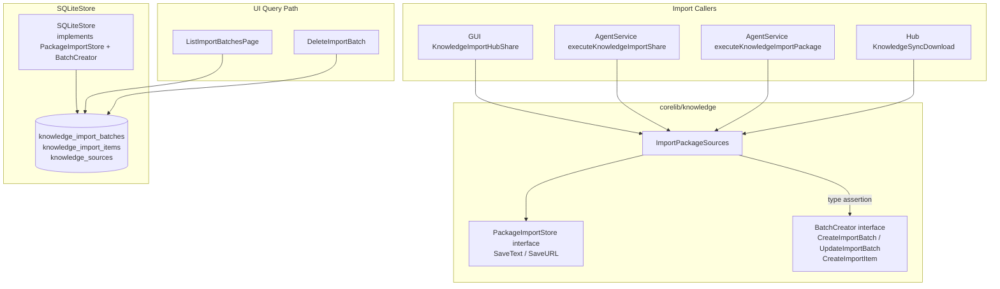

# Design Document

## Overview

This design fixes the knowledge share/package import display gap in MaClawSrv's virtual employee knowledge management interface. The core problem: `ImportPackageSources` saves individual knowledge sources but never creates an `ImportBatch` record, so the UI (which queries `knowledge_import_batches` exclusively) shows an empty list despite successful imports.

The fix introduces a **`BatchCreator` optional interface** that `ImportPackageSources` detects at runtime via Go type assertion. When the store supports batch creation, the function creates a batch record before importing and updates it with final counts afterward. When the store does NOT support batch creation (legacy callers, test mocks), behavior is unchanged — zero breaking changes.

This is a minimal, targeted fix: one new interface (~4 methods), one detection point in `ImportPackageSources`, and no schema migration required (the `knowledge_import_batches` table already exists with all needed columns).

## Architecture



**Design Decision: Optional Interface via Type Assertion**

Rationale: Go's interface composition and type assertion pattern (`if bc, ok := store.(BatchCreator); ok { ... }`) provides compile-time safety for existing callers while enabling new functionality without signature changes. This is the idiomatic Go approach for extending interfaces without breaking backward compatibility.

Alternative considered: Adding batch methods directly to `PackageImportStore`. Rejected because it would force all existing callers and test mocks to implement batch methods they don't need.

## Components and Interfaces

### New Interface: `BatchCreator`

```go
// BatchCreator is an optional interface that PackageImportStore implementations
// can satisfy to enable automatic ImportBatch record creation during package imports.
// Detected via type assertion in ImportPackageSources.
type BatchCreator interface {
    CreateImportBatch(ctx context.Context, batch ImportBatch) error
    UpdateImportBatch(ctx context.Context, batch ImportBatch) error
    CreateImportItem(ctx context.Context, item ImportItem) error
}
```

**Location:** `corelib/knowledge/package_import.go` (same file as `PackageImportStore`)

### Modified Function: `ImportPackageSources`

The function signature remains unchanged. Internal behavior changes:

1. **Before loop:** Type-assert `store` to `BatchCreator`. If successful, create an `ImportBatch` with status `"running"`.
2. **During loop:** After each successful `SaveText`/`SaveURL`, create an `ImportItem` linking the source to the batch (only if `BatchCreator` is available).
3. **After loop:** Update the batch with final counts and derived status.

### Status Derivation Logic

```go
func deriveImportBatchStatus(imported, skipped, failed, total int) string {
    switch {
    case imported == 0 && total > 0:
        return "failed"
    case imported == total:
        return "completed"
    default:
        return "partial"
    }
}
```

### Existing Interface: `PackageImportStore` (unchanged)

```go
type PackageImportStore interface {
    SaveText(ctx context.Context, req TextSaveRequest) (Source, error)
    SaveURL(ctx context.Context, req URLSaveRequest) (Source, error)
}
```

No changes to this interface. Existing callers that pass a minimal mock implementing only `SaveText`/`SaveURL` continue to work.

### SQLiteStore Implementation

`SQLiteStore` already has `insertBatch` (used by `importScannedItems`) and `insertImportItem` internal functions. The `BatchCreator` implementation wraps these:

```go
func (s *SQLiteStore) CreateImportBatch(ctx context.Context, batch ImportBatch) error {
    tx, err := s.db.BeginTx(ctx, nil)
    if err != nil { return err }
    defer tx.Rollback()
    if err := insertBatch(ctx, tx, batch); err != nil { return err }
    return tx.Commit()
}

func (s *SQLiteStore) UpdateImportBatch(ctx context.Context, batch ImportBatch) error {
    _, err := s.db.ExecContext(ctx, `UPDATE knowledge_import_batches 
        SET status=?, imported_files=?, skipped_files=?, failed_files=?, total_files=?, updated_at=?
        WHERE id=?`,
        batch.Status, batch.Imported, batch.Skipped, batch.Failed, batch.TotalFiles, batch.UpdatedAt, batch.ID)
    return err
}

func (s *SQLiteStore) CreateImportItem(ctx context.Context, item ImportItem) error {
    tx, err := s.db.BeginTx(ctx, nil)
    if err != nil { return err }
    defer tx.Rollback()
    if err := insertImportItem(ctx, tx, item); err != nil { return err }
    return tx.Commit()
}
```

### Callers: Zero Changes Required

| Caller | Store Type | BatchCreator? | Behavior |
|--------|-----------|---------------|----------|
| GUI `KnowledgeImportHubShare` | `*SQLiteStore` | Yes | Creates batch automatically |
| AgentService `executeKnowledgeImportShare` | `KnowledgeStore` (wraps `*SQLiteStore`) | Yes (if wrapper forwards) | Creates batch automatically |
| AgentService `executeKnowledgeImportPackage` | Same | Yes | Creates batch automatically |
| Hub `KnowledgeSyncDownload` | `*SQLiteStore` | Yes | Creates batch automatically |
| Test mocks | Custom struct | No | No batch, no change |
| DryRun (store=nil) | nil | No | No batch, no change |

**Note on `multiKnowledgeStore` (MaClawSrv):** This wrapper delegates to `*SQLiteStore`. For `BatchCreator` to work through the wrapper, `multiKnowledgeStore` needs to forward the `BatchCreator` methods. This is a trivial 3-method delegation.

### `PackageImportOptions` Extension

```go
type PackageImportOptions struct {
    OwnerID   string
    TenantID  string
    SaveScope string
    DryRun    bool
    TopicHint string // NEW: Display name for the batch (from package/share title)
}
```

The `TopicHint` field is populated by callers from package metadata (e.g., `pkg.Manifest.Title` or share title). This becomes the batch's display name in the UI.

## Data Models

### ImportBatch Record (for share/package imports)

Reuses the existing `knowledge_import_batches` schema. Fields populated for share/package imports:

| Column | Value for Share/Package Import |
|--------|-------------------------------|
| `id` | Generated via `NewID("kbatch")` |
| `root_path` | `"share://{knowledgeID}"` or `"package://{packageID}"` |
| `owner_id` | From `PackageImportOptions.OwnerID` |
| `tenant_id` | From `PackageImportOptions.TenantID` |
| `project_path` | Empty (not applicable for share/package imports) |
| `topic_hint` | Package title / share title (display name in UI) |
| `recursive` | `false` |
| `include_exts_json` | `null` |
| `exclude_globs_json` | `null` |
| `max_file_bytes` | `0` |
| `status` | `"completed"` / `"partial"` / `"failed"` |
| `total_files` | `len(sources)` |
| `queued_files` | `0` |
| `imported_files` | Count of successfully imported |
| `skipped_files` | Count of skipped |
| `failed_files` | Count of failed |
| `created_at` | Import start time |
| `updated_at` | Import end time |

### ImportItem Record (for each source in the batch)

Reuses the existing `knowledge_import_items` schema:

| Column | Value |
|--------|-------|
| `id` | Generated via `NewID("kitem")` |
| `batch_id` | Parent batch ID |
| `source_id` | The `Source.ID` returned by `SaveText`/`SaveURL` |
| `file_path` | Source URI or title (for display) |
| `relative_path` | Source title |
| `file_hash` | Empty (not a file) |
| `file_size` | `len(content)` or `0` |
| `kind` | `"url"` or `"text"` |
| `status` | `"imported"` / `"skipped"` / `"failed"` |
| `error_message` | Error text if failed |
| `created_at` | Item import time |
| `updated_at` | Item import time |

### Source Record: `batch_id` Population

The `Source` struct already has a `BatchID string` field. Currently `SaveText`/`SaveURL` don't set it for share/package imports. Two approaches:

**Approach A (Preferred):** Add `BatchID` to `TextSaveRequest` and `URLSaveRequest`. `ImportPackageSources` populates it when `BatchCreator` is available. The existing `SaveText`/`SaveURL` implementations already pass `BatchID` through to `insertSource`.

**Approach B:** Have `CreateImportItem` update the source's `batch_id` after creation. Less clean but doesn't modify request structs.

We go with **Approach A** since `TextSaveRequest`/`URLSaveRequest` are internal types and the change is additive (empty `BatchID` = no change in behavior).

### No Schema Migration Required

The `knowledge_import_batches` and `knowledge_import_items` tables already exist with all needed columns. The `knowledge_sources.batch_id` column already exists. No ALTER TABLE or migration script is needed.

## Correctness Properties

*A property is a characteristic or behavior that should hold true across all valid executions of a system — essentially, a formal statement about what the system should do. Properties serve as the bridge between human-readable specifications and machine-verifiable correctness guarantees.*

### Property 1: Batch Creation for Any Valid Package Import

*For any* valid set of `PackageSource` entries and a store that implements `BatchCreator`, calling `ImportPackageSources` SHALL create exactly one `ImportBatch` record with `TopicHint` matching the provided options and `TotalFiles` equal to `len(sources)`.

**Validates: Requirements 1.1, 2.1**

### Property 2: Status Derivation from Import Counts

*For any* `ImportBatch` after `ImportPackageSources` completes, the batch status SHALL be: `"completed"` if `imported == total`, `"failed"` if `imported == 0 && total > 0`, or `"partial"` otherwise. And the invariant `imported + skipped + failed == total` SHALL always hold.

**Validates: Requirements 1.2, 1.3, 1.4, 2.2**

### Property 3: Source-to-Batch Linking

*For any* source successfully imported via `ImportPackageSources` with a `BatchCreator`-capable store, the source's `BatchID` field SHALL equal the batch's `ID`, and a corresponding `ImportItem` record with `status="imported"` SHALL exist.

**Validates: Requirements 1.5, 2.3**

### Property 4: Graceful Degradation Without BatchCreator

*For any* store that implements only `PackageImportStore` (not `BatchCreator`), `ImportPackageSources` SHALL import all sources correctly and return accurate `PackageImportResult` counts without error — identical behavior to the current implementation.

**Validates: Requirements 5.1, 5.3, 6.3**

### Property 5: Cascade Delete Consistency

*For any* `ImportBatch` created by a share/package import, calling `DeleteImportBatch` SHALL delete the batch record, all linked `ImportItem` records, and all linked `Source` records whose `batch_id` matches.

**Validates: Requirements 4.1, 4.2**

### Property 6: Batch Visibility in Paginated List

*For any* set of `ImportBatch` records (mixed directory + share + package origins), `ListImportBatchesPage` SHALL return all batches sorted by `updated_at DESC`, regardless of their origin (`root_path` prefix).

**Validates: Requirements 3.1, 3.2**

## Error Handling

| Scenario | Behavior |
|----------|----------|
| `BatchCreator.CreateImportBatch` fails | Log warning, continue importing without batch tracking. Sources are still saved. |
| `BatchCreator.CreateImportItem` fails for one item | Log warning, continue to next item. Batch counts reflect actual outcomes. |
| `BatchCreator.UpdateImportBatch` fails (final update) | Log warning. Batch remains in `"running"` status. A background reconciliation job or UI refresh can detect stale batches. |
| Store is nil (DryRun mode) | No type assertion attempted. No batch created. Existing behavior preserved. |
| Context cancelled mid-import | Batch is updated with partial counts and `"partial"` status before returning. |
| `TextSaveRequest`/`URLSaveRequest` with `BatchID` on a store that ignores `BatchID` | No effect — the field is simply stored in the source record for query purposes. |

**Design Decision:** Batch creation errors are non-fatal. The primary operation (importing sources) must not fail because of a secondary operation (batch bookkeeping). This follows the same pattern as `importScannedItems` where progress reporting failures don't abort the import.

## Testing Strategy

### Property-Based Tests (PBT)

- **Library:** `pgregory.net/rapid` (Go's fast-check equivalent, already used in this project)
- **Minimum iterations:** 100 per property
- **Tag format:** `Feature: knowledge-share-import-display, Property N: {property_text}`

Each correctness property (1-6) maps to one property-based test:

1. **Batch creation** — Generate random `[]PackageSource` (varying counts, kinds, content), verify batch is created with correct metadata.
2. **Status derivation** — Generate random (imported, skipped, failed) tuples constrained by `imported+skipped+failed == total`, verify `deriveImportBatchStatus` output.
3. **Source-to-batch linking** — Generate sources, import, verify all imported sources have matching `BatchID`.
4. **Graceful degradation** — Use a mock implementing only `PackageImportStore`, generate random sources, verify no panic and correct result counts.
5. **Cascade delete** — Create batch with random sources, delete, verify all records removed.
6. **List ordering** — Create batches with random timestamps, verify `ListImportBatchesPage` returns them sorted.

### Unit Tests (specific examples)

- Share import with 0 sources → returns error before creating batch
- Share import with 1 URL source that fails re-fetch but has inline content → batch shows 1 imported
- Package import with all metadata-only sources → batch status "failed"
- `DryRun=true` → no batch created, no store calls
- `multiKnowledgeStore` wrapper forwards `BatchCreator` interface correctly

### Integration Tests

- Full GUI flow: `KnowledgeImportHubShare` → verify batch appears in `ListImportBatchesPage`
- Full agentservice flow: `executeKnowledgeImportShare` → verify batch appears
- Directory import continues to work unchanged (regression)
- Delete a share-created batch → all sources and items removed
