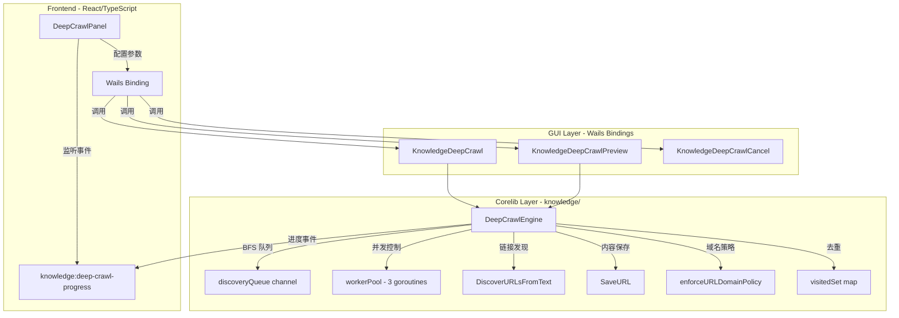
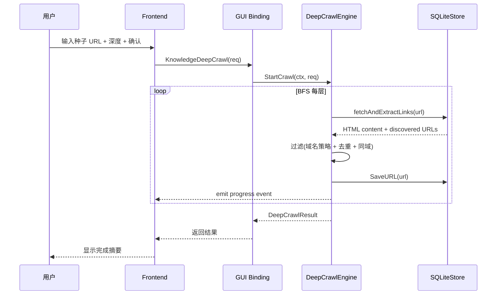

# Design Document: Knowledge URL Deep Crawl

## Overview

知识库 URL 深度检索功能为现有的 URL 导入系统增加广度优先（BFS）递归抓取能力。用户提供种子 URL 和抓取深度（1-5 层），系统从种子页面出发逐层发现同站链接，将所有成功抓取的页面内容保存为知识库来源。

### 核心设计决策

1. **复用现有基础设施**：链接发现复用 `DiscoverURLsFromText`，内容保存复用 `SaveURL`，域名策略复用 `enforceURLDomainPolicy`
2. **BFS + Worker Pool 并发模型**：使用 Go channel 实现 BFS 队列，固定 3 个 worker goroutine 消费队列
3. **事件驱动进度反馈**：复用 Wails `runtime.EventsEmit` 模式，前端通过事件监听实时更新 UI
4. **预览与执行分离**：预览模式只做链接发现（不保存内容），确认后复用发现结果执行完整抓取

## Architecture



### 数据流



## Components and Interfaces

### 1. DeepCrawlEngine (`corelib/knowledge/deep_crawl.go`)

核心抓取引擎，负责 BFS 调度、并发控制、进度报告。

```go
// DeepCrawlRequest 深度检索请求参数
type DeepCrawlRequest struct {
    SeedURL        string   `json:"seed_url"`
    MaxDepth       int      `json:"max_depth"`        // 1-5
    SameDomainOnly bool     `json:"same_domain_only"` // 默认 true
    SaveScope      string   `json:"save_scope,omitempty"`
    TopicHint      string   `json:"topic_hint,omitempty"`
    DistillMode    string   `json:"distill_mode,omitempty"`
    Labels         []string `json:"labels,omitempty"`
    AutoLabels     bool     `json:"auto_labels,omitempty"`
    PreviewOnly    bool     `json:"preview_only"`     // true=仅预览不保存
    OwnerID        string   `json:"owner_id,omitempty"`
    ProjectPath    string   `json:"project_path,omitempty"`
}

// DeepCrawlProgress 进度事件数据
type DeepCrawlProgress struct {
    JobID          string `json:"job_id"`
    Status         string `json:"status"`          // discovering/crawling/completed/cancelled/failed
    CurrentDepth   int    `json:"current_depth"`
    MaxDepth       int    `json:"max_depth"`
    TotalDiscovered int   `json:"total_discovered"`
    Completed      int    `json:"completed"`
    Pending        int    `json:"pending"`
    Failed         int    `json:"failed"`
    Skipped        int    `json:"skipped"`
    CurrentURL     string `json:"current_url,omitempty"`
}

// DeepCrawlResult 抓取完成结果
type DeepCrawlResult struct {
    JobID       string              `json:"job_id"`
    Status      string              `json:"status"`
    TotalSaved  int                 `json:"total_saved"`
    Duplicates  int                 `json:"duplicates"`
    Failed      int                 `json:"failed"`
    Skipped     int                 `json:"skipped"`
    Items       []DeepCrawlItem     `json:"items,omitempty"`
    ByDepth     []DeepCrawlDepthSummary `json:"by_depth,omitempty"`
}

// DeepCrawlItem 单个 URL 的抓取结果
type DeepCrawlItem struct {
    URL      string `json:"url"`
    Depth    int    `json:"depth"`
    Status   string `json:"status"`   // saved/duplicate/failed/skipped
    Title    string `json:"title,omitempty"`
    Error    string `json:"error,omitempty"`
    SourceID string `json:"source_id,omitempty"`
}

// DeepCrawlDepthSummary 按层级汇总
type DeepCrawlDepthSummary struct {
    Depth      int      `json:"depth"`
    Total      int      `json:"total"`
    Saved      int      `json:"saved"`
    Failed     int      `json:"failed"`
    URLs       []string `json:"urls,omitempty"` // 仅预览模式填充
}

// DeepCrawlEngine 深度检索引擎
type DeepCrawlEngine struct {
    store          *SQLiteStore
    onProgress     func(DeepCrawlProgress)
    maxConcurrency int           // 默认 3
    requestDelay   time.Duration // 默认 500ms
    maxURLs        int           // 默认 200
    perURLTimeout  time.Duration // 默认 30s
    sessionTimeout time.Duration // 默认 10min
}

// NewDeepCrawlEngine 创建引擎实例
func NewDeepCrawlEngine(store *SQLiteStore, onProgress func(DeepCrawlProgress)) *DeepCrawlEngine

// StartCrawl 启动深度检索（阻塞直到完成或取消）
func (e *DeepCrawlEngine) StartCrawl(ctx context.Context, req DeepCrawlRequest) (DeepCrawlResult, error)

// Preview 预览模式（仅发现链接，不保存内容）
func (e *DeepCrawlEngine) Preview(ctx context.Context, req DeepCrawlRequest) (DeepCrawlResult, error)
```

### 2. BFS 调度算法

```go
// bfsLevel 表示 BFS 中一层的 URL 集合
type bfsLevel struct {
    depth int
    urls  []string
}

// crawlState 抓取状态（引擎内部）
type crawlState struct {
    mu          sync.Mutex
    visited     map[string]struct{}  // 已访问/已入队的 URL（normalized）
    results     []DeepCrawlItem
    totalQueued int
    completed   int
    failed      int
    skipped     int
}
```

**BFS 执行流程**：

```
1. 初始化: visited = {seedURL}, currentLevel = [seedURL], depth = 0
2. 循环 depth = 0..maxDepth-1:
   a. 对 currentLevel 中每个 URL，启动 worker（受 semaphore 限制为 3 并发）
   b. worker: fetch HTML → DiscoverURLsFromText → 过滤 → 返回 (content, newURLs)
   c. 非预览模式: SaveURL 保存内容
   d. 收集所有 newURLs，去重后作为 nextLevel
   e. 如果 totalQueued >= maxURLs，停止发现
   f. currentLevel = nextLevel, depth++
3. 返回 DeepCrawlResult
```

### 3. Wails Bindings (`gui/app_knowledge.go`)

```go
// KnowledgeDeepCrawl 启动深度检索
func (a *App) KnowledgeDeepCrawl(req knowledge.DeepCrawlRequest) (knowledge.DeepCrawlResult, error)

// KnowledgeDeepCrawlPreview 预览模式
func (a *App) KnowledgeDeepCrawlPreview(req knowledge.DeepCrawlRequest) (knowledge.DeepCrawlResult, error)

// KnowledgeDeepCrawlCancel 取消正在进行的深度检索
func (a *App) KnowledgeDeepCrawlCancel() error
```

### 4. Frontend Component (`DeepCrawlPanel`)

新增 React 组件，嵌入 `KnowledgeSettingsPanel` 中：

```typescript
interface DeepCrawlConfig {
    seedURL: string;
    maxDepth: number;       // 1-5, default 2
    sameDomainOnly: boolean; // default true
    saveScope: string;
    topicHint: string;
    labels: string[];
}

interface DeepCrawlProgress {
    job_id: string;
    status: 'discovering' | 'crawling' | 'completed' | 'cancelled' | 'failed';
    current_depth: number;
    max_depth: number;
    total_discovered: number;
    completed: number;
    pending: number;
    failed: number;
    skipped: number;
    current_url?: string;
}

interface DeepCrawlPreviewResult {
    by_depth: Array<{
        depth: number;
        total: number;
        urls: string[];
    }>;
    total_discovered: number;
}
```

## Data Models

### 新增类型（`corelib/knowledge/types.go`）

上述 `DeepCrawlRequest`、`DeepCrawlProgress`、`DeepCrawlResult`、`DeepCrawlItem`、`DeepCrawlDepthSummary` 类型定义在 `corelib/knowledge/types.go` 中。

### 内部状态（不持久化）

| 字段 | 类型 | 说明 |
|------|------|------|
| `visited` | `map[string]struct{}` | 已访问/已入队 URL 集合（normalized URL 为 key） |
| `depthMap` | `map[string]int` | URL → 发现深度映射 |
| `results` | `[]DeepCrawlItem` | 每个 URL 的处理结果 |
| `cancelCtx` | `context.Context` | 用于取消的 context |

### 事件名

| 事件 | 方向 | 说明 |
|------|------|------|
| `knowledge:deep-crawl-progress` | Backend → Frontend | 进度更新 |

### 与现有类型的关系

- `DeepCrawlRequest.SaveScope/TopicHint/Labels/AutoLabels/DistillMode` 直接映射到 `URLSaveRequest` 的对应字段
- `DeepCrawlEngine` 内部使用 `URLDiscoveryRequest` 调用 `DiscoverURLsFromText`
- 保存结果复用 `Source` 类型

## Correctness Properties

*A property is a characteristic or behavior that should hold true across all valid executions of a system—essentially, a formal statement about what the system should do. Properties serve as the bridge between human-readable specifications and machine-verifiable correctness guarantees.*

### Property 1: Invalid URL rejection

*For any* string that does not start with `http://` or `https://`, submitting it as a seed URL SHALL be rejected with a validation error, and no crawl SHALL be initiated.

**Validates: Requirements 1.4**

### Property 2: Same-domain filtering

*For any* seed URL with hostname H and same-domain restriction enabled, *for any* discovered URL with hostname H' where H' ≠ H, that URL SHALL NOT be enqueued for crawling.

**Validates: Requirements 2.2**

### Property 3: BFS ordering invariant

*For any* crawl execution trace, *for all* URLs at depth N and depth N+1, all URLs at depth N SHALL be completed (fetched or failed) before any URL at depth N+1 begins processing.

**Validates: Requirements 2.3**

### Property 4: URL deduplication (no URL processed twice)

*For any* crawl execution over a link graph (which may contain cycles and duplicate links), each normalized URL SHALL appear at most once in the results list, regardless of how many times it was discovered.

**Validates: Requirements 2.4, 5.3**

### Property 5: Depth limit enforcement

*For any* crawl with configured `maxDepth = N`, no URL in the results SHALL have a depth value greater than N.

**Validates: Requirements 2.5**

### Property 6: Domain policy enforcement at all phases

*For any* URL that matches a domain block policy, that URL SHALL be skipped during both the discovery phase and the save phase, and the rejection reason SHALL be recorded in the results.

**Validates: Requirements 2.6, 7.3**

### Property 7: Fault tolerance (failure recording and continuation)

*For any* crawl execution where some URLs fail to fetch (network error, HTTP 4xx/5xx, timeout), the engine SHALL record the failure reason for each failed URL AND continue processing all remaining URLs in the queue.

**Validates: Requirements 3.4**

### Property 8: Preview mode does not persist

*For any* crawl execution in preview mode (`PreviewOnly = true`), zero calls to `SaveURL` SHALL be made, and no new sources SHALL appear in the Knowledge Store.

**Validates: Requirements 4.1**

### Property 9: Configuration propagation

*For any* crawl request with non-empty `SaveScope`, `TopicHint`, and `Labels`, every `SaveURL` call made by the engine SHALL include those exact values in the corresponding request fields.

**Validates: Requirements 5.2**

### Property 10: Result count consistency

*For any* completed crawl, the sum `TotalSaved + Duplicates + Failed + Skipped` SHALL equal the total number of URLs that entered the processing pipeline (excluding the seed URL's own discovery-only fetch at depth 0 when it also produces content).

**Validates: Requirements 5.4**

### Property 11: Concurrency limit

*For any* point in time during a crawl execution, the number of in-flight HTTP requests SHALL NOT exceed 3.

**Validates: Requirements 6.1**

### Property 12: Request delay enforcement

*For any* two consecutive HTTP requests to the same host during a crawl, the time elapsed between the start of the second request and the completion of the first request SHALL be at least 500 milliseconds.

**Validates: Requirements 6.2**

### Property 13: Maximum URL limit

*For any* single crawl session, the total number of URLs processed (fetched or attempted) SHALL NOT exceed 200.

**Validates: Requirements 6.3**

## Error Handling

### URL 级别错误

| 错误类型 | 处理方式 | 用户可见 |
|---------|---------|---------|
| 网络超时（30s） | 记录失败原因，继续下一个 URL | 进度事件中 failed++ |
| HTTP 4xx/5xx | 记录 HTTP 状态码，继续 | 进度事件中 failed++ |
| 域名策略拒绝 | 记录拒绝原因，跳过 | 进度事件中 skipped++ |
| HTML 解析失败 | 记录错误，保存已获取内容（如有） | 进度事件中 completed++ 或 failed++ |
| SaveURL 失败 | 记录错误，继续 | 进度事件中 failed++ |
| 重复 URL | 标记为 duplicate，继续 | 进度事件中 skipped++ |

### 会话级别错误

| 错误类型 | 处理方式 | 用户可见 |
|---------|---------|---------|
| 种子 URL 无效 | 立即返回错误 | 前端显示验证错误 |
| 种子 URL 被域名策略拒绝 | 立即返回错误 | 前端显示策略拒绝消息 |
| 种子 URL 获取失败 | 立即返回错误 | 前端显示获取失败消息 |
| 总 URL 数达到 200 上限 | 停止发现新链接，完成已入队 URL | 进度事件 status="limit_reached" |
| 会话超时（10min） | 取消所有进行中请求，返回已完成结果 | 进度事件 status="timeout" |
| 用户取消 | 取消所有进行中请求，返回已完成结果 | 进度事件 status="cancelled" |
| Context 取消 | 同用户取消 | 同上 |

### 错误恢复策略

- **不重试**：单个 URL 获取失败不重试（避免延长总抓取时间）
- **优雅降级**：任何单个 URL 的失败不影响其他 URL 的处理
- **部分结果保留**：即使会话超时或用户取消，已保存的内容保留在知识库中

## Testing Strategy

### Property-Based Tests（使用 `testing/quick` 或 `pgregory.net/rapid`）

每个 Correctness Property 对应一个 property-based test，最少 100 次迭代：

| Property | 测试文件 | 生成器 |
|----------|---------|--------|
| P1: Invalid URL rejection | `deep_crawl_test.go` | 随机非 http(s) 字符串 |
| P2: Same-domain filtering | `deep_crawl_test.go` | 随机 hostname 对 |
| P3: BFS ordering | `deep_crawl_test.go` | 随机链接图 + mock fetcher |
| P4: Deduplication | `deep_crawl_test.go` | 含环和重复链接的随机图 |
| P5: Depth limit | `deep_crawl_test.go` | 随机深度 1-5 + 随机图 |
| P6: Domain policy | `deep_crawl_test.go` | 随机 URL + 随机策略集 |
| P7: Fault tolerance | `deep_crawl_test.go` | 随机失败率的 mock fetcher |
| P8: Preview no-persist | `deep_crawl_test.go` | 随机图 + mock store |
| P9: Config propagation | `deep_crawl_test.go` | 随机配置值 |
| P10: Count consistency | `deep_crawl_test.go` | 随机图 + 混合成功/失败 |
| P11: Concurrency limit | `deep_crawl_test.go` | 随机图 + atomic counter |
| P12: Request delay | `deep_crawl_test.go` | 随机图 + timestamp recording |
| P13: Max URL limit | `deep_crawl_test.go` | 大随机图（>200 nodes） |

**PBT 库选择**：`pgregory.net/rapid`（项目已有依赖）

**配置**：每个 property test 最少 100 次迭代

**标签格式**：`// Feature: knowledge-url-deep-crawl, Property N: {property_text}`

### Unit Tests（示例和边界情况）

- 种子 URL 验证（空字符串、无协议、ftp://、有效 http/https）
- 深度参数边界（0、1、5、6、-1）
- 空 HTML 页面（无链接可发现）
- 单页面无外链（depth=1 但种子页面无链接）
- 所有链接都是跨域的（same_domain=true 时结果为空）
- 所有链接都被域名策略拒绝
- 取消时的状态一致性

### Integration Tests

- 端到端：真实 HTTP server（httptest）+ SQLite store + 完整抓取流程
- 进度事件发射验证
- Wails binding 参数传递验证

