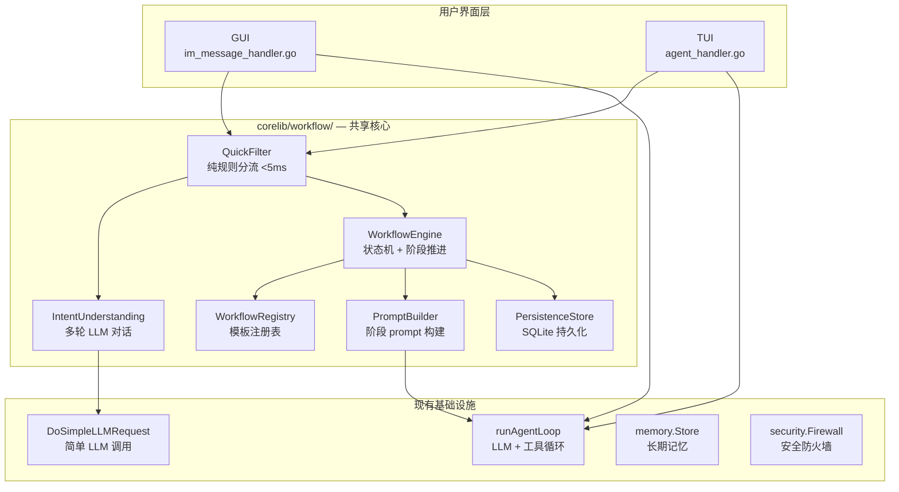
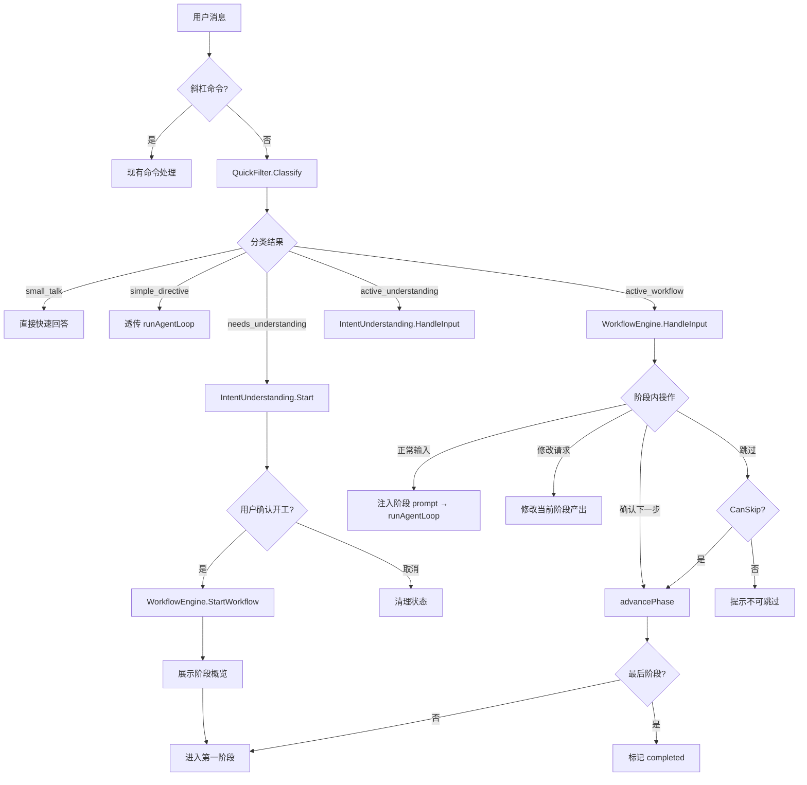
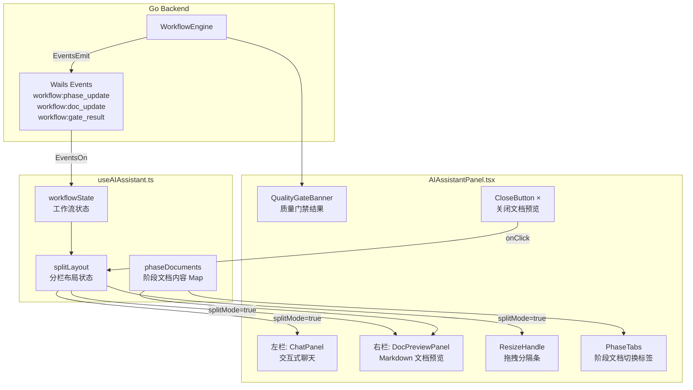
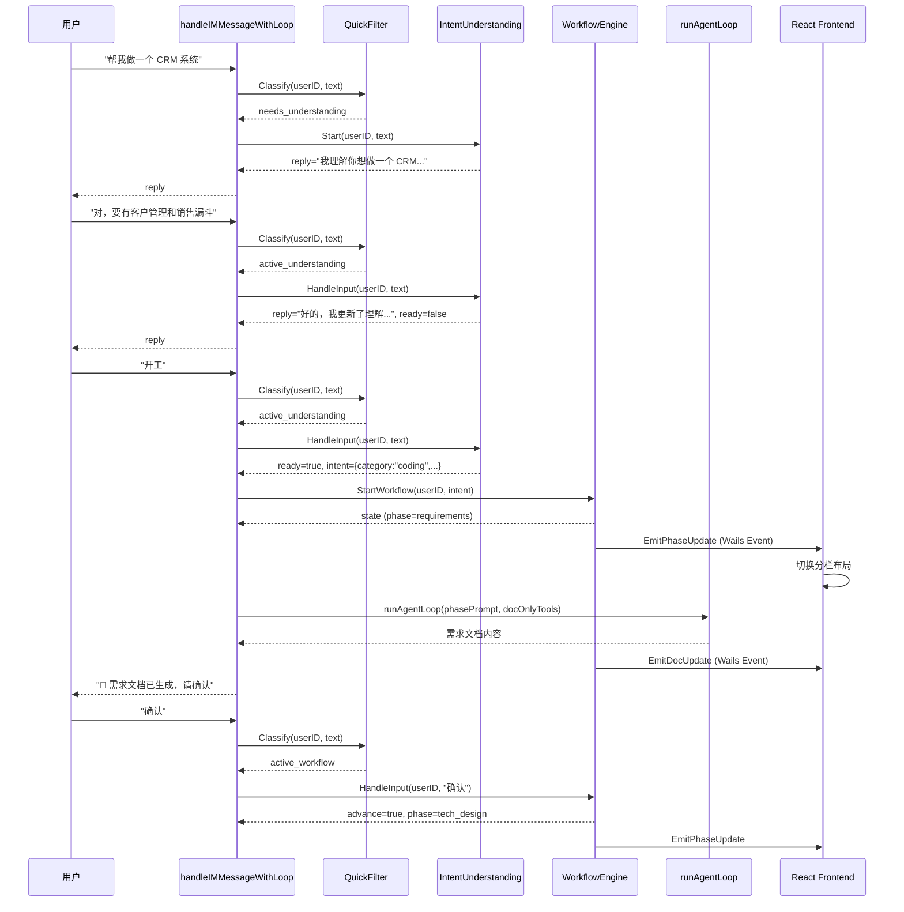
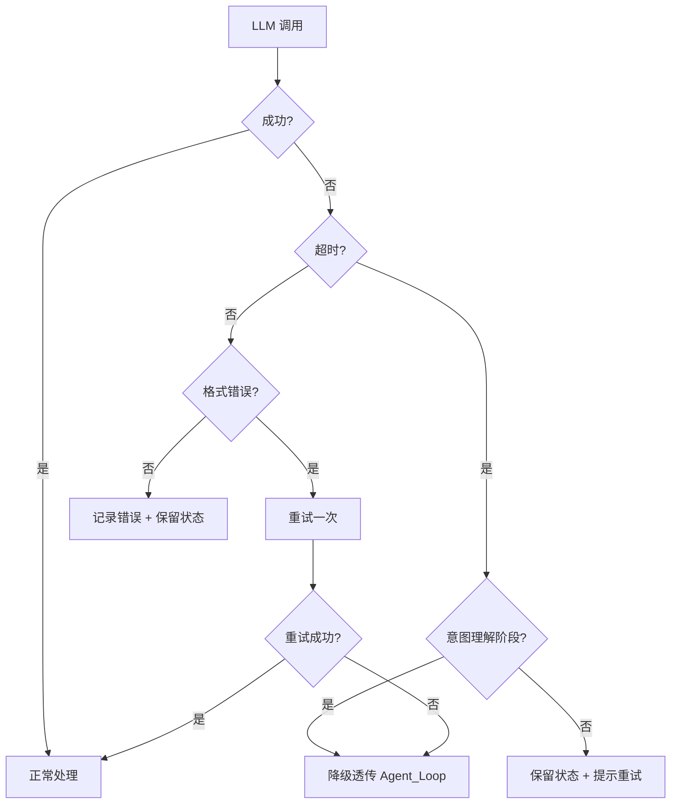

# MaClaw Agent 工作流引擎 — 技术设计文档

## 概览

在 `corelib/workflow/` 构建代码级状态机工作流引擎，替代现有 `coding-workflow.md` 纯 prompt 引导方案。引擎通过三层架构实现复杂任务的全生命周期管理：

1. **快速分流层（QuickFilter）**：纯规则判断，<5ms，将消息分为 small_talk / simple_directive / needs_understanding / active_workflow / active_understanding 五类
2. **意图理解层（IntentUnderstanding）**：独立多轮 LLM 对话（无工具），通过 `agent.DoSimpleLLMRequest` 与用户澄清需求，输出 StructuredIntent
3. **工作流执行层（WorkflowEngine）**：代码级状态机控制阶段推进，每个阶段通过动态 System Prompt 注入引导 `runAgentLoop` 中的 LLM 行为

### 核心设计决策

| 决策 | 选择 | 理由 |
|------|------|------|
| 代码位置 | `corelib/workflow/` | GUI + TUI 共享，避免重复实现 |
| 状态管理 | 代码级状态机 | 阶段推进由 Go 代码控制，不依赖 LLM 判断，杜绝跳阶段 |
| 意图理解 | 独立 LLM 对话 | 不经过 Agent Loop，不携带工具定义，纯对话理解 |
| 工作流执行 | 复用 `runAgentLoop` | 通过动态 system prompt 注入引导 LLM，复用现有 streaming/progress/token 回调 |
| 持久化 | 本地 `.maclaw/` SQLite | 与 `corelib/memory/store.go` 同模式，应用重启可恢复 |
| Hub 角色 | 纯数据通道 | 所有工作流逻辑在客户端，Hub 不承载任何工作流状态 |
| 模板扩展 | Register 注册机制 | 新增业务类型只需定义模板并注册，不修改引擎代码 |

### 与现有方案的关系

- **替代** `coding-workflow.md`：coding 模板覆盖其"编程任务强制三阶段流程"
- **替代** `CodingToolGate`：工作流引擎在非 implementation 阶段限制工具列表，比 iteration 0 拦截更精确
- **兼容** Harness 模块：GoalAnchor、DriftDetector、ProgressTracker 继续工作，阶段 prompt 作为额外 system message 注入

## 架构

### 系统分层



### 消息处理流程



### GUI 分栏文档预览架构



## 组件与接口

### 1. QuickFilter（快速分流器）

文件：`corelib/workflow/quick_filter.go`

```go
type FilterResult string
const (
    FilterSmallTalk          FilterResult = "small_talk"
    FilterSimpleDirective    FilterResult = "simple_directive"
    FilterActiveWorkflow     FilterResult = "active_workflow"
    FilterActiveUnderstanding FilterResult = "active_understanding"
    FilterNeedsUnderstanding FilterResult = "needs_understanding"
)

type QuickFilter struct {
    engine *WorkflowEngine // 引用，用于检查活跃会话
}

// Classify 对消息进行分类，纯规则判断，无 I/O，<5ms
func (f *QuickFilter) Classify(userID, text string) FilterResult
```

分流规则（优先级从高到低）：
1. 用户有活跃工作流 → `active_workflow`
2. 用户有活跃意图理解会话 → `active_understanding`
3. 消息匹配 small talk 模式（短消息 + 问候词/时间词/感谢词）→ `small_talk`
4. 消息匹配简单指令模式（翻译/格式化/总结等无需多阶段的指令）→ `simple_directive`
5. 消息包含复杂任务特征（动词 + 目标对象 + 约束条件）→ `needs_understanding`
6. 默认 → `simple_directive`（保守策略，不误拦截）

### 2. IntentUnderstanding（意图理解管理器）

文件：`corelib/workflow/intent_understanding.go`

```go
type UnderstandingState string
const (
    UnderstandingActive    UnderstandingState = "active"
    UnderstandingConfirmed UnderstandingState = "confirmed"
    UnderstandingCancelled UnderstandingState = "cancelled"
    UnderstandingExpired   UnderstandingState = "expired"
)

type UnderstandingSession struct {
    ID        string             `json:"id"`
    UserID    string             `json:"user_id"`
    Intent    StructuredIntent   `json:"intent"`
    Rounds    []UnderstandingRound `json:"rounds"`
    State     UnderstandingState `json:"state"`
    CreatedAt time.Time          `json:"created_at"`
    UpdatedAt time.Time          `json:"updated_at"`
}

type UnderstandingRound struct {
    UserText      string    `json:"user_text"`
    AssistantText string    `json:"assistant_text"`
    Timestamp     time.Time `json:"timestamp"`
}

// LLMCaller 抽象 LLM 调用，便于测试 mock
type LLMCaller interface {
    DoSimpleLLMRequest(messages []interface{}, timeout time.Duration) (string, error)
}

type IntentUnderstandingManager struct {
    mu       sync.RWMutex
    sessions map[string]*UnderstandingSession // userID → session
    store    PersistenceStore
    llm      LLMCaller
    registry *WorkflowRegistry
}

// Start 创建新的意图理解会话
func (m *IntentUnderstandingManager) Start(userID, text string) (reply string, err error)

// HandleInput 处理意图理解会话中的用户输入
// 返回 reply（LLM 回复）、ready（是否确认开工）、cancelled（是否取消）
func (m *IntentUnderstandingManager) HandleInput(userID, text string) (reply string, ready bool, cancelled bool, err error)

// GetSession 获取用户的活跃意图理解会话
func (m *IntentUnderstandingManager) GetSession(userID string) *UnderstandingSession

// HasActiveSession 检查用户是否有活跃意图理解会话
func (m *IntentUnderstandingManager) HasActiveSession(userID string) bool

// CleanupExpired 清理超时会话（30 分钟无活动）
func (m *IntentUnderstandingManager) CleanupExpired()
```

意图理解 LLM Prompt 策略：
- System prompt 包含所有已注册模板的描述（通过 `registry.AllDescriptions()`）
- 要求 LLM 输出 JSON：`{"intent": StructuredIntent, "reply": string, "ready": bool}`
- `ready` 判断由 LLM 综合分析用户消息语义，而非简单关键词匹配
- 每轮回复末尾提示用户"确定了就告诉我'开工'"

### 3. WorkflowEngine（工作流引擎）

文件：`corelib/workflow/engine.go`

```go
type WorkflowStatus string
const (
    WorkflowActive    WorkflowStatus = "active"
    WorkflowCompleted WorkflowStatus = "completed"
    WorkflowCancelled WorkflowStatus = "cancelled"
)

type WorkflowState struct {
    ID           string           `json:"id"`
    UserID       string           `json:"user_id"`
    Type         WorkflowType     `json:"type"`
    Intent       StructuredIntent `json:"intent"`
    CurrentPhase string           `json:"current_phase"`
    PhaseIndex   int              `json:"phase_index"`
    PhaseOutputs map[string]string `json:"phase_outputs"`
    GateResults  map[string]*QualityGateResult `json:"gate_results"`
    Status       WorkflowStatus   `json:"status"`
    CreatedAt    time.Time        `json:"created_at"`
    UpdatedAt    time.Time        `json:"updated_at"`
}

type QualityGateResult struct {
    PhaseID  string           `json:"phase_id"`
    Passed   bool             `json:"passed"`
    Items    []GateCheckItem  `json:"items"`
    CheckedAt time.Time       `json:"checked_at"`
}

type GateCheckItem struct {
    Description string `json:"description"`
    Passed      bool   `json:"passed"`
    Note        string `json:"note,omitempty"`
}

// EngineCallbacks 定义 GUI/TUI 适配层需要实现的回调接口
type EngineCallbacks interface {
    // SendTextToUser 向用户发送文本消息
    SendTextToUser(userID, text string) error
    // EmitPhaseUpdate 通知前端阶段变更（仅 GUI 实现，TUI 可空实现）
    EmitPhaseUpdate(userID string, state *WorkflowState) error
    // EmitDocUpdate 通知前端文档内容更新（仅 GUI 实现）
    EmitDocUpdate(userID, phaseID, content string) error
    // EmitGateResult 通知前端质量门禁结果（仅 GUI 实现）
    EmitGateResult(userID, phaseID string, result *QualityGateResult) error
}

type WorkflowEngine struct {
    mu          sync.RWMutex
    workflows   map[string]*WorkflowState // userID → active workflow
    registry    *WorkflowRegistry
    understanding *IntentUnderstandingManager
    store       PersistenceStore
    callbacks   EngineCallbacks
    filter      *QuickFilter
}

// StartWorkflow 从确认的 StructuredIntent 创建并启动工作流
func (e *WorkflowEngine) StartWorkflow(userID string, intent StructuredIntent) (*WorkflowState, error)

// HandleInput 处理工作流阶段内的用户输入
// 返回 WorkflowResponse 指示如何响应
func (e *WorkflowEngine) HandleInput(userID, text string) (*WorkflowResponse, error)

// GetActiveWorkflow 获取用户的活跃工作流
func (e *WorkflowEngine) GetActiveWorkflow(userID string) *WorkflowState

// HasActiveWorkflow 检查用户是否有活跃工作流
func (e *WorkflowEngine) HasActiveWorkflow(userID string) bool

// CancelWorkflow 取消当前工作流
func (e *WorkflowEngine) CancelWorkflow(userID string) error

// BuildPhasePrompt 构建当前阶段的 system prompt
func (e *WorkflowEngine) BuildPhasePrompt(userID string) string

// GetPhaseToolFilter 返回当前阶段的工具过滤策略
func (e *WorkflowEngine) GetPhaseToolFilter(userID string) ToolFilterPolicy

// RestoreFromStore 从 SQLite 恢复活跃工作流状态
func (e *WorkflowEngine) RestoreFromStore() error

// CleanupExpired 清理已完成/已取消且超过 7 天的记录
func (e *WorkflowEngine) CleanupExpired()
```

### 4. WorkflowRegistry（模板注册表）

文件：`corelib/workflow/registry.go`

```go
type WorkflowRegistry struct {
    mu        sync.RWMutex
    templates map[WorkflowType]*WorkflowTemplate
}

// NewWorkflowRegistry 创建注册表并自动注册 6 种内置模板
func NewWorkflowRegistry() *WorkflowRegistry

// Register 注册新模板，同类型覆盖旧模板
func (r *WorkflowRegistry) Register(tmpl *WorkflowTemplate)

// Match 按 WorkflowType 精确匹配模板
func (r *WorkflowRegistry) Match(wt WorkflowType) *WorkflowTemplate

// AllDescriptions 返回所有模板摘要，供 LLM 意图分类使用
func (r *WorkflowRegistry) AllDescriptions() string
```

### 5. PromptBuilder（阶段 Prompt 构建器）

文件：`corelib/workflow/prompt_builder.go`

```go
type ToolFilterPolicy string
const (
    ToolFilterNone     ToolFilterPolicy = "none"      // 不限制工具
    ToolFilterDocOnly  ToolFilterPolicy = "doc_only"   // 仅文档生成工具
    ToolFilterFull     ToolFilterPolicy = "full"       // 完整工具列表
)

// BuildPhaseSystemPrompt 构建阶段 system prompt
// 包含：阶段名称/描述、LLM 指令、StructuredIntent 摘要、前序阶段产出物摘要、Checklist
func BuildPhaseSystemPrompt(state *WorkflowState, phase *PhaseTemplate, registry *WorkflowRegistry) string

// BuildQualityGatePrompt 构建质量门禁检查 prompt
func BuildQualityGatePrompt(phase *PhaseTemplate, output string) string

// GetToolFilterForPhase 返回阶段的工具过滤策略
func GetToolFilterForPhase(phase *PhaseTemplate) ToolFilterPolicy
```

### 6. PersistenceStore（持久化存储）

文件：`corelib/workflow/persistence.go`

```go
type PersistenceStore interface {
    // 意图理解会话
    SaveUnderstandingSession(session *UnderstandingSession) error
    LoadUnderstandingSession(userID string) (*UnderstandingSession, error)
    DeleteUnderstandingSession(userID string) error

    // 工作流状态
    SaveWorkflowState(state *WorkflowState) error
    LoadWorkflowState(userID string) (*WorkflowState, error)
    DeleteWorkflowState(id string) error
    ListActiveWorkflows() ([]*WorkflowState, error)

    // 清理
    CleanupExpired(olderThan time.Duration) error
}
```

文件：`corelib/workflow/sqlite_store.go`

```go
type SQLiteStore struct {
    db *sql.DB
}

// NewSQLiteStore 在 ~/.maclaw/workflow.db 创建 SQLite 存储
func NewSQLiteStore(dbPath string) (*SQLiteStore, error)
```

数据库表结构：

```sql
CREATE TABLE IF NOT EXISTS understanding_sessions (
    id          TEXT PRIMARY KEY,
    user_id     TEXT NOT NULL UNIQUE,
    intent_json TEXT NOT NULL,
    rounds_json TEXT NOT NULL,
    state       TEXT NOT NULL DEFAULT 'active',
    created_at  DATETIME NOT NULL,
    updated_at  DATETIME NOT NULL
);

CREATE TABLE IF NOT EXISTS workflow_states (
    id            TEXT PRIMARY KEY,
    user_id       TEXT NOT NULL UNIQUE,
    type          TEXT NOT NULL,
    intent_json   TEXT NOT NULL,
    current_phase TEXT NOT NULL,
    phase_index   INTEGER NOT NULL DEFAULT 0,
    outputs_json  TEXT NOT NULL DEFAULT '{}',
    gates_json    TEXT NOT NULL DEFAULT '{}',
    status        TEXT NOT NULL DEFAULT 'active',
    created_at    DATETIME NOT NULL,
    updated_at    DATETIME NOT NULL
);

CREATE INDEX IF NOT EXISTS idx_ws_user_status ON workflow_states(user_id, status);
CREATE INDEX IF NOT EXISTS idx_us_user_state ON understanding_sessions(user_id, state);
```

### 7. GUI 适配层

文件：`gui/workflow_adapter.go`

```go
type GUIWorkflowAdapter struct {
    app    *App
    engine *workflow.WorkflowEngine
}

// 实现 EngineCallbacks 接口
func (a *GUIWorkflowAdapter) SendTextToUser(userID, text string) error
func (a *GUIWorkflowAdapter) EmitPhaseUpdate(userID string, state *workflow.WorkflowState) error
func (a *GUIWorkflowAdapter) EmitDocUpdate(userID, phaseID, content string) error
func (a *GUIWorkflowAdapter) EmitGateResult(userID, phaseID string, result *workflow.QualityGateResult) error
```

### 8. TUI 适配层

文件：`tui/workflow_adapter.go`

```go
type TUIWorkflowAdapter struct {
    handler *TUIAgentHandler
    engine  *workflow.WorkflowEngine
}

// 实现 EngineCallbacks 接口（EmitPhaseUpdate/EmitDocUpdate/EmitGateResult 为空实现）
func (a *TUIWorkflowAdapter) SendTextToUser(userID, text string) error
func (a *TUIWorkflowAdapter) EmitPhaseUpdate(userID string, state *workflow.WorkflowState) error
func (a *TUIWorkflowAdapter) EmitDocUpdate(userID, phaseID, content string) error
func (a *TUIWorkflowAdapter) EmitGateResult(userID, phaseID string, result *workflow.QualityGateResult) error
```

### 9. GUI 分栏文档预览组件

文件：`gui/frontend/src/components/ai/WorkflowDocPreview.tsx`

```typescript
interface WorkflowDocPreviewProps {
    phaseDocuments: Map<string, string>;  // phaseID → markdown content
    currentPhaseID: string;
    gateResults: Map<string, QualityGateResult>;
    onClose: () => void;
}

// WorkflowDocPreview 右侧文档预览面板
function WorkflowDocPreview(props: WorkflowDocPreviewProps): JSX.Element
```

文件：`gui/frontend/src/components/ai/useWorkflowState.ts`

```typescript
interface WorkflowUIState {
    active: boolean;
    splitMode: boolean;           // 是否分栏模式
    splitRatio: number;           // 左栏宽度比例 (0-1)，默认 0.5
    currentPhaseID: string;
    phaseDocuments: Map<string, string>;
    gateResults: Map<string, QualityGateResult>;
    phases: PhaseInfo[];          // 所有阶段信息
}

// useWorkflowState 管理工作流 UI 状态
function useWorkflowState(): {
    state: WorkflowUIState;
    openDocPreview: (phaseID?: string) => void;
    closeDocPreview: () => void;
    setSplitRatio: (ratio: number) => void;
}
```

## 数据模型

### 核心类型定义

文件：`corelib/workflow/types.go`

```go
package workflow

import "time"

// WorkflowType 工作流类型标识
type WorkflowType string

const (
    WorkflowCoding        WorkflowType = "coding"
    WorkflowProductDesign WorkflowType = "product_design"
    WorkflowInnovation    WorkflowType = "innovation"
    WorkflowBusinessPlan  WorkflowType = "business_plan"
    WorkflowTesting       WorkflowType = "testing"
)

// StructuredIntent 结构化意图，意图理解阶段的输出
type StructuredIntent struct {
    Category      WorkflowType `json:"category"`
    Summary       string       `json:"summary"`
    Goals         []string     `json:"goals"`
    Constraints   []string     `json:"constraints"`
    OpenQuestions []string     `json:"open_questions"`
    Confidence    float64      `json:"confidence"`
    Ready         bool         `json:"ready"`
}

// PhaseTemplate 阶段模板定义
type PhaseTemplate struct {
    ID           string   `json:"id"`
    Name         string   `json:"name"`
    Description  string   `json:"description"`
    Prompt       string   `json:"prompt"`       // LLM 指令
    Deliverable  string   `json:"deliverable"`  // 产出物描述
    Checklist    []string `json:"checklist"`     // 质量检查项
    NeedsConfirm bool     `json:"needs_confirm"` // 是否需要用户确认
    CanSkip      bool     `json:"can_skip"`      // 是否可跳过
    ToolPolicy   ToolFilterPolicy `json:"tool_policy"` // 工具过滤策略
}

// WorkflowTemplate 工作流模板定义
type WorkflowTemplate struct {
    Type        WorkflowType   `json:"type"`
    Name        string         `json:"name"`
    Description string         `json:"description"`
    Keywords    []string       `json:"keywords"`
    Phases      []PhaseTemplate `json:"phases"`
}

// WorkflowResponse 工作流引擎对用户输入的响应
type WorkflowResponse struct {
    Text         string              // 回复文本
    PhasePrompt  string              // 注入 runAgentLoop 的阶段 system prompt
    ToolFilter   ToolFilterPolicy    // 工具过滤策略
    RunAgentLoop bool                // 是否需要调用 runAgentLoop
    Advance      bool                // 是否推进到下一阶段
    Complete     bool                // 工作流是否完成
    DocContent   string              // 文档内容（用于前端预览）
    GateResult   *QualityGateResult  // 质量门禁结果
}
```

### 内置模板定义

文件：`corelib/workflow/templates.go`

6 种内置模板的阶段定义：

| 模板 | 阶段 | ToolPolicy |
|------|------|------------|
| coding | requirements → tech_design → task_breakdown → implementation → review | doc_only → doc_only → doc_only → full → doc_only |
| product_design | problem_discovery → solution_design → prd → prototype | 全部 doc_only |
| innovation | opportunity → ideation → validation → roadmap → action_plan | 全部 doc_only |
| business_plan | executive_summary → market_analysis → product_strategy → operations → financial_projection | 全部 doc_only |
| testing | test_strategy → test_design → test_environment → test_execution → defect_report | doc_only → doc_only → doc_only → full → doc_only |

### 集成点数据流




## 正确性属性

*正确性属性是在系统所有合法执行中都应成立的特征或行为——本质上是对系统应做什么的形式化陈述。属性是人类可读规格与机器可验证正确性保证之间的桥梁。*

### Property 1: 活跃会话路由优先级

*For any* 用户 ID 和任意消息文本，当该用户存在活跃工作流时，QuickFilter.Classify 应返回 `active_workflow`；当该用户存在活跃意图理解会话（且无活跃工作流）时，应返回 `active_understanding`——无论消息内容是什么。

**Validates: Requirements 1.3, 1.4**

### Property 2: QuickFilter 分类正确性

*For any* 不含活跃会话的用户，当消息匹配 small talk 模式（短消息 + 问候/感谢/时间词）时，QuickFilter.Classify 应返回 `small_talk`；当消息匹配简单指令模式时，应返回 `simple_directive`；当消息包含复杂任务特征（动词 + 目标对象 + 约束条件）时，应返回 `needs_understanding`。

**Validates: Requirements 1.1, 1.2, 1.6**

### Property 3: QuickFilter 性能保证

*For any* 消息文本（长度 0 到 10000 字符），QuickFilter.Classify 的执行时间应小于 5ms，且不执行任何 I/O 操作。

**Validates: Requirements 1.5, 13.1**

### Property 4: 意图理解会话过期清理

*For any* UnderstandingSession 集合，调用 CleanupExpired 后，所有 UpdatedAt 距今超过 30 分钟的会话应被移除，所有 UpdatedAt 距今不超过 30 分钟的活跃会话应被保留。

**Validates: Requirements 2.7**

### Property 5: 模板注册-匹配往返一致性

*For any* 合法的 WorkflowTemplate，调用 Register 注册后，Match(template.Type) 应返回该模板。若对同一 Type 注册两次，Match 应返回最后注册的模板（覆盖语义）。

**Validates: Requirements 3.2, 3.5**

### Property 6: AllDescriptions 完整性

*For any* 已注册模板集合，AllDescriptions 返回的文本应包含每个模板的 Name 和 Description 子串。

**Validates: Requirements 3.3**

### Property 7: StartWorkflow 初始化第一阶段

*For any* 合法的 StructuredIntent（Category 匹配已注册模板），StartWorkflow 应返回 PhaseIndex=0、CurrentPhase 等于模板第一个阶段的 ID、Status=active 的 WorkflowState。

**Validates: Requirements 5.1**

### Property 8: BuildPhasePrompt 结构完整性

*For any* 活跃的 WorkflowState（含任意阶段索引和前序产出物），BuildPhasePrompt 输出应包含：当前阶段名称、阶段 LLM 指令、StructuredIntent 摘要、所有前序阶段产出物摘要、当前阶段 Checklist 的每一项。

**Validates: Requirements 5.2, 6.1, 6.2**

### Property 9: NeedsConfirm 阶段阻止非确认推进

*For any* 处于 NeedsConfirm=true 阶段的 WorkflowState，当用户输入不包含确认词（"下一步"/"确认"/"继续"）时，HandleInput 返回的 Advance 应为 false，PhaseIndex 应保持不变。

**Validates: Requirements 5.4, 5.5**

### Property 10: 跳过行为遵循 CanSkip 标志

*For any* WorkflowState，当用户输入"跳过"时：若当前阶段 CanSkip=true，则 PhaseIndex 应增加 1（推进到下一阶段）；若 CanSkip=false，则 PhaseIndex 应保持不变，且响应文本应包含不可跳过的提示。

**Validates: Requirements 5.6, 5.7**

### Property 11: 最后阶段完成标记

*For any* 处于最后一个阶段的 WorkflowState，当触发阶段推进时，Status 应变为 `completed`，且 HasActiveWorkflow 应返回 false。

**Validates: Requirements 5.8**

### Property 12: 工具过滤策略与阶段配置一致

*For any* PhaseTemplate，GetToolFilterForPhase 返回的 ToolFilterPolicy 应与该阶段的 ToolPolicy 字段一致。doc_only 阶段返回 ToolFilterDocOnly，full 阶段返回 ToolFilterFull。

**Validates: Requirements 6.3, 6.4**

### Property 13: 持久化往返一致性

*For any* 合法的 WorkflowState 和 UnderstandingSession，Save 后 Load 应返回与原始对象等价的数据（所有字段值相同）。

**Validates: Requirements 7.1, 7.2, 7.3, 7.4**

### Property 14: 过期记录清理正确性

*For any* WorkflowState 集合，调用 CleanupExpired(7天) 后：所有 Status 为 completed 或 cancelled 且 UpdatedAt 距今超过 7 天的记录应被移除；所有 Status 为 active 的记录应被保留（无论年龄）；所有不超过 7 天的 completed/cancelled 记录也应被保留。

**Validates: Requirements 7.5**

### Property 15: 单用户单活跃工作流不变量

*For any* 用户 ID，在任意时刻，WorkflowEngine 中该用户最多有一个 Status=active 的工作流。当已有活跃工作流时，StartWorkflow 应返回错误。

**Validates: Requirements 12.1, 12.2**

### Property 16: LLM 失败保持状态不变

*For any* 活跃的 WorkflowState，当 LLM 调用返回错误时，WorkflowState 的 PhaseIndex、CurrentPhase、PhaseOutputs、Status 应保持不变。

**Validates: Requirements 12.3, 15.1**

### Property 17: 取消保留已完成阶段产出物

*For any* 活跃的 WorkflowState（含任意数量的已完成阶段产出物），CancelWorkflow 后 Status 应为 `cancelled`，且 PhaseOutputs 中所有已有的键值对应保持不变。

**Validates: Requirements 9.5**

## 错误处理

### 降级策略

| 异常场景 | 降级行为 | 用户感知 |
|----------|----------|----------|
| LLM 未配置 | 跳过意图理解，直接透传 Agent_Loop | 与当前行为一致，无感知 |
| 意图理解 LLM 超时（>10s） | 降级为直接透传 Agent_Loop | 轻微延迟后正常响应 |
| 工作流阶段 LLM 超时（>30s） | 保留当前状态，提示用户重试 | 提示"生成超时，请重新发送消息重试" |
| LLM 返回格式错误 | 重试一次，仍失败则降级透传 | 可能轻微延迟 |
| SQLite 不可用 | 降级为纯内存模式，不持久化 | 重启后丢失工作流状态 |
| SQLite 写入失败 | 日志记录，不阻塞工作流执行 | 无感知，但重启可能丢失最新状态 |
| 用户在工作流中发送 /new | 清理所有工作流和意图理解状态 | 回到空闲状态 |
| 用户在工作流中发送 /cancel | 取消工作流，保留已完成产出物 | 可查看已完成阶段的文档 |

### 错误恢复流程



### 并发安全

- `WorkflowEngine`、`IntentUnderstandingManager`、`WorkflowRegistry` 均使用 `sync.RWMutex` 保护
- 读操作（HasActiveWorkflow、GetActiveWorkflow、Match）使用 `RLock`
- 写操作（StartWorkflow、HandleInput、Register）使用 `Lock`
- SQLite 操作通过单连接串行化（与 `corelib/memory/store.go` 同模式）

## 测试策略

### 属性测试（Property-Based Testing）

使用 Go 标准库 `testing/quick` 进行属性测试，每个属性至少 100 次迭代。

测试文件：`corelib/workflow/engine_property_test.go`

覆盖的属性：
- Property 1-3：QuickFilter 分类正确性和性能
- Property 4：意图理解会话过期清理
- Property 5-6：模板注册表往返一致性和完整性
- Property 7：StartWorkflow 初始化
- Property 8：BuildPhasePrompt 结构完整性
- Property 9-11：阶段推进状态机属性
- Property 12：工具过滤策略一致性
- Property 13：持久化往返一致性
- Property 14：过期记录清理
- Property 15：单用户单活跃工作流不变量
- Property 16：LLM 失败状态保持
- Property 17：取消保留产出物

每个测试标注格式：
```go
// Feature: maclaw-agent-workflow, Property 1: 活跃会话路由优先级
// For any 用户 ID 和任意消息文本，当该用户存在活跃工作流时，
// QuickFilter.Classify 应返回 active_workflow
```

### 单元测试

测试文件：`corelib/workflow/engine_test.go`

覆盖的场景：
- 6 种内置模板结构验证（需求 4.1-4.7）
- 斜杠命令兼容性（需求 9.3-9.5）
- LLM 未配置降级（需求 12.4）
- LLM 超时降级（需求 12.5-12.6）
- SQLite 不可用降级（需求 15.3）

### 集成测试

测试文件：`gui/workflow_integration_test.go`、`tui/workflow_integration_test.go`

覆盖的场景：
- GUI handleIMMessageWithLoop 中的工作流拦截（需求 9.1-9.2）
- TUI RunAgentLoop 中的工作流拦截（需求 10.1-10.2）
- 意图理解 → 工作流启动 → 阶段推进完整流程（Mock LLM）
- 工作流内跑题处理（需求 8.1-8.3）

### 前端测试

测试文件：`gui/frontend/src/components/ai/__tests__/useWorkflowState.test.ts`

覆盖的场景：
- 分栏布局状态切换（需求 16.1, 16.5）
- 文档内容更新（需求 16.3, 16.4）
- 质量门禁结果展示（需求 16.7）
- 文档预览关闭/重新打开（需求 16.9, 16.11）

### 测试配置

```go
func quickConfig() *quick.Config {
    return &quick.Config{MaxCount: 100}
}
```
