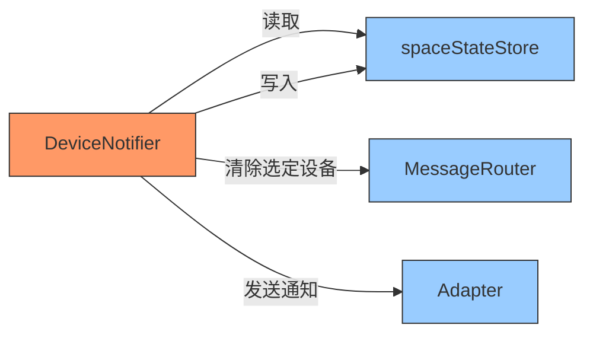
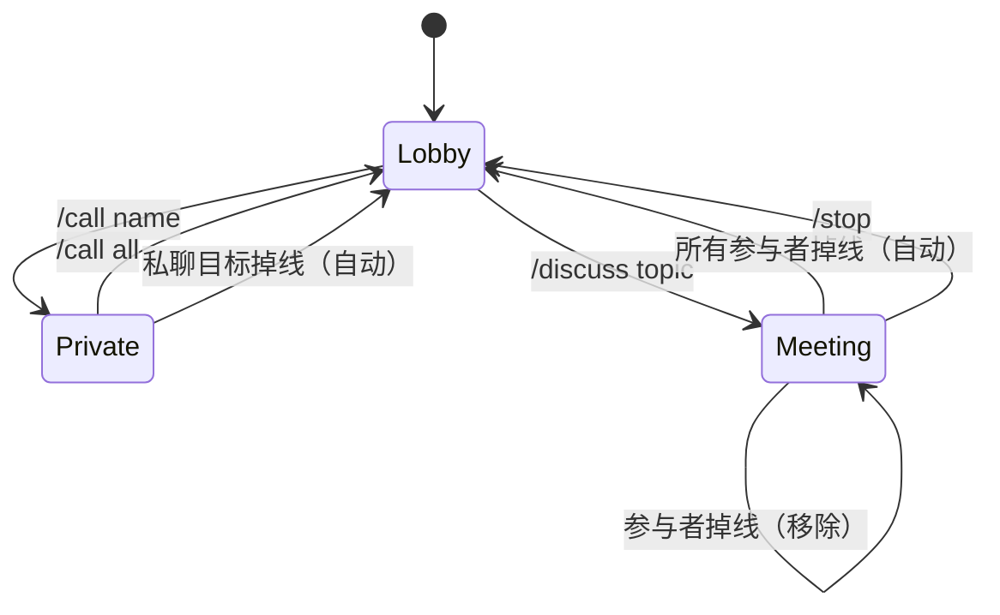
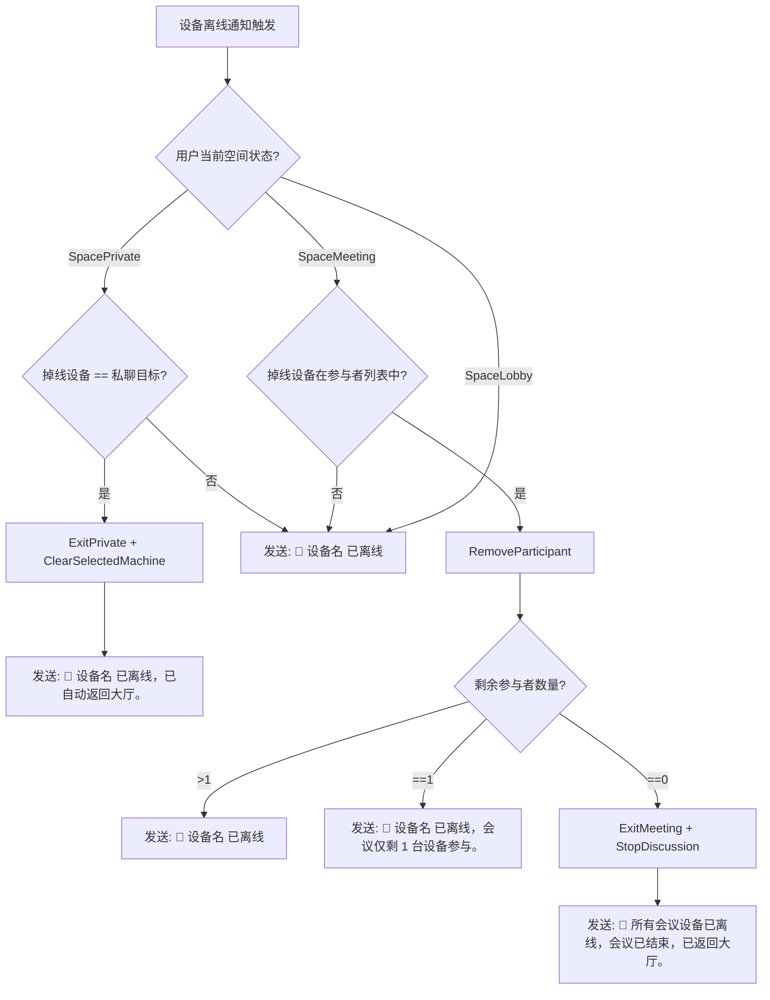

# 设计文档：设备掉线自动返回大厅

## 概述

本设计文档描述当用户正在私聊或会议中的设备掉线时，系统如何自动维护空间状态的机制。核心改动集中在 `DeviceNotifier.fireNotification()` 方法中，在发送离线通知前检查用户当前空间状态，并根据状态类型（私聊/会议/大厅）执行不同的自动恢复逻辑。

### 设计目标

1. 私聊目标掉线时自动返回大厅，无需用户手动执行 `/call all`
2. 会议参与者掉线时正确维护参与者列表，所有设备离线时自动结束会议
3. 非相关设备掉线时保持简洁通知，不干扰用户工作流
4. 保持现有 30 秒防抖机制不变

### 设计原则

- **最小改动**：仅修改 `DeviceNotifier`，通过已有的 `spaceStateStore` 和 `MessageRouter` 接口完成状态切换
- **无新依赖**：不引入新的 goroutine 或定时器，复用现有防抖 timer 的回调
- **幂等安全**：状态切换操作本身是幂等的，重复调用不会产生副作用

## 架构

### 改动范围



### 状态转换流程



### 离线通知决策流程



## 组件与接口

### DeviceNotifier 扩展

`DeviceNotifier` 需要新增对 `spaceStateStore` 的引用，以便在 `fireNotification` 中查询和修改用户空间状态。

```go
type DeviceNotifier struct {
    adapter     *Adapter
    coordinator *Coordinator

    mu          sync.Mutex
    debounce    map[string]*debounceEntry
    activeUsers map[string]activeUserInfo
}
```

不需要新增字段。`DeviceNotifier` 已持有 `coordinator` 引用，可通过 `coordinator.SpaceStateStore()` 访问空间状态，通过 `coordinator.router` 访问 `MessageRouter`。

### fireNotification 改造

核心改动在 `fireNotification` 方法中。当前逻辑：

1. 构造上线/离线消息
2. 如果离线且是选定设备，追加手动切换提示
3. 通过 Adapter 发送

改造后逻辑：

1. 构造上线/离线消息
2. **如果离线，检查用户空间状态**：
   - **SpacePrivate + 掉线设备是私聊目标**：自动 ExitPrivate + ClearSelectedMachine，消息改为自动返回大厅通知
   - **SpaceMeeting + 掉线设备在参与者列表中**：RemoveParticipant，根据剩余数量决定通知内容
   - **其他情况**：仅发送简洁离线通知（移除原有的手动切换提示）
3. 通过 Adapter 发送

### 已有接口复用

| 接口 | 方法 | 用途 |
|------|------|------|
| `spaceStateStore` | `GetOrCreate(userID)` | 查询用户当前空间状态 |
| `spaceStateStore` | `ExitPrivate(userID)` | 退出私聊，回到大厅 |
| `spaceStateStore` | `RemoveParticipant(userID, machineID)` | 从会议中移除设备 |
| `spaceStateStore` | `ExitMeeting(userID)` | 结束会议，回到大厅 |
| `MessageRouter` | `ClearSelectedMachine(userID)` | 清除选定设备记录 |
| `MessageRouter` | `StopDiscussion(userID)` | 停止进行中的讨论 |

## 数据模型

本功能不引入新的数据模型。所有状态变更使用现有的 `SpaceState` 结构体和 `spaceStateStore` 方法。

### SpaceState（已有）

```go
type SpaceState struct {
    State         SpaceStateType // lobby / private / meeting
    PrivateTarget string         // 私聊目标 machineID
    PrivateName   string         // 私聊目标显示名
    MeetingTopic  string         // 会议话题
    Participants  []string       // 会议参与者 machineIDs
    MessageCount  int            // 私聊消息计数
}
```


## 正确性属性 (Correctness Properties)

*属性是一种在系统所有有效执行中都应成立的特征或行为——本质上是关于系统应该做什么的形式化陈述。属性是人类可读规范与机器可验证正确性保证之间的桥梁。*

### Property 1: 私聊目标掉线自动返回大厅

*For any* 处于 SpacePrivate 状态的用户，当其私聊目标设备触发离线通知时，用户的空间状态应变为 SpaceLobby，且 MessageRouter 中该用户的 selectedMachine 记录应被清除。

**Validates: Requirements 1.1, 1.2**

### Property 2: 自动返回大厅通知格式

*For any* 设备名称，当私聊目标掉线触发自动返回大厅时，发送的通知消息应包含该设备名称和"已自动返回大厅"字样，且不应包含"/call"手动切换提示。

**Validates: Requirements 1.3, 1.4**

### Property 3: 会议参与者掉线移除

*For any* 处于 SpaceMeeting 状态的用户和任意会议参与者设备，当该设备触发离线通知时，该设备应从会议参与者列表中被移除，且剩余参与者列表不应包含该设备。

**Validates: Requirements 2.1**

### Property 4: 所有会议参与者掉线自动结束会议

*For any* 处于 SpaceMeeting 状态的用户，当所有会议参与者设备均触发离线通知后，用户的空间状态应变为 SpaceLobby。

**Validates: Requirements 2.3**

### Property 5: 非相关设备掉线简洁通知

*For any* 用户和任意非私聊目标、非会议参与者的设备，当该设备触发离线通知时，通知消息应仅为"📴 <设备名> 已离线"格式，不包含任何额外的状态切换提示或操作指引。

**Validates: Requirements 3.1**

## 错误处理

### 并发安全

- `fireNotification` 在访问 `spaceStateStore` 和 `MessageRouter` 时，这些组件内部已有 `sync.Mutex` 保护，无需额外加锁
- 防抖 timer 回调在独立 goroutine 中执行，与主消息处理流程无竞争

### 边界情况

| 场景 | 处理方式 |
|------|----------|
| coordinator 为 nil（未配置智能路由） | 跳过空间状态检查，保持原有简洁通知行为 |
| 用户不在 activeUsers 中 | `scheduleNotification` 已有检查，直接跳过 |
| ExitPrivate/ExitMeeting 返回 error | 记录日志，仍发送通知（降级为简洁通知） |
| 设备快速上下线（防抖期间状态已变） | 防抖 timer 触发时重新检查空间状态，以最新状态为准 |

## 测试策略

### 属性测试 (Property-Based Testing)

使用 Go 标准库 `testing/quick` 进行属性测试，每个属性至少运行 100 次迭代。

每个正确性属性对应一个属性测试：

- **Property 1 测试**：生成随机用户 ID 和设备 ID，设置 SpacePrivate 状态，调用离线处理逻辑，验证状态和 selectedMachine 均已清除
  - Tag: `Feature: maclaw-auto-lobby-return, Property 1: 私聊目标掉线自动返回大厅`
- **Property 2 测试**：生成随机设备名称（含中文、英文、特殊字符），验证通知消息格式正确且不含 `/call`
  - Tag: `Feature: maclaw-auto-lobby-return, Property 2: 自动返回大厅通知格式`
- **Property 3 测试**：生成随机参与者列表和随机掉线设备，验证移除后列表不含该设备
  - Tag: `Feature: maclaw-auto-lobby-return, Property 3: 会议参与者掉线移除`
- **Property 4 测试**：生成随机参与者列表，逐一移除所有参与者，验证最终状态为 SpaceLobby
  - Tag: `Feature: maclaw-auto-lobby-return, Property 4: 所有会议参与者掉线自动结束会议`
- **Property 5 测试**：生成随机空间状态和非相关设备，验证通知消息为简洁格式
  - Tag: `Feature: maclaw-auto-lobby-return, Property 5: 非相关设备掉线简洁通知`

### 单元测试

单元测试覆盖具体示例和边界情况：

- coordinator 为 nil 时的降级行为
- 会议仅剩 1 台设备时的特殊提示消息（边界情况 2.2）
- 防抖期间空间状态已变化的场景
- ExitPrivate/ExitMeeting 失败时的降级处理

### 测试文件

所有测试放在 `hub/internal/im/device_notifier_test.go` 中，与现有测试共存。
