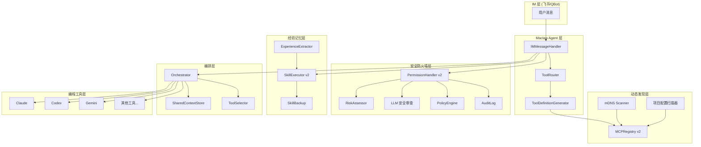
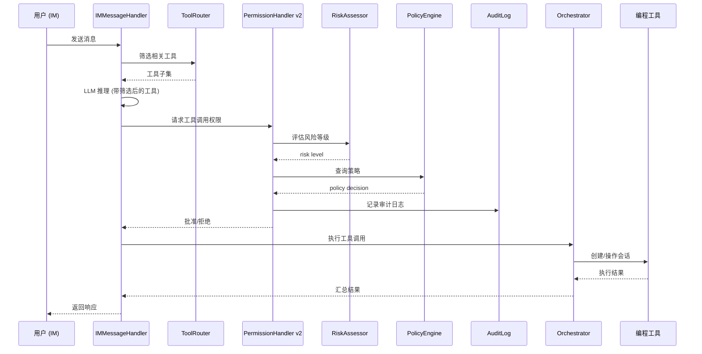

# 设计文档：Maclaw 能力升级改进计划

## 概述

本设计文档描述 Maclaw 平台在五个方向的能力升级：动态工具发现、安全防火墙、经验记忆管理、Skills 备份与恢复、差异化编排能力。设计基于现有 Go 代码库（Wails 桌面端 + Hub 后端），在不破坏现有架构的前提下进行增量扩展。

### 设计目标

1. **动态工具发现**：将 MCP Server 从手动注册扩展为自动发现 + 手动注册混合模式，工具列表从硬编码 12 个扩展为动态生成
2. **安全防火墙**：将 `PermissionHandler` 从简单的工具名称匹配升级为意图级风险评估 + LLM 辅助审查 + 策略引擎 + 审计日志的完整安全链路
3. **经验记忆管理**：从会话历史中自动提取可复用的操作模式，转化为 NL Skill 并支持跨项目复用
4. **Skills 备份与恢复**：支持 Skills 的 zip 备份/恢复，确保序列化 round-trip 正确性
5. **差异化编排**：支持多工具并行编排、跨工具上下文共享和智能工具选择

### 设计原则

- **增量扩展**：所有新组件通过接口与现有代码集成，不修改现有公共 API 签名
- **关注点分离**：每个子系统独立文件，通过 `App` 结构体组合
- **Go 惯用法**：使用 `sync.RWMutex` 保护并发状态，`interface` 实现多态，`context.Context` 控制超时

## 架构

### 高层架构



### 数据流



## 组件与接口

### 1. 动态发现子系统

#### 1.1 mDNS Scanner (`mdns_scanner.go`)

```go
// MDNSScanner 通过 mDNS/DNS-SD 发现局域网内的 MCP Server
type MDNSScanner struct {
    registry *MCPRegistry
    stopCh   chan struct{}
    mu       sync.Mutex
    running  bool
}

// Start 启动 mDNS 扫描，监听 _mcp._tcp 服务类型
func (s *MDNSScanner) Start() error

// Stop 停止 mDNS 扫描
func (s *MDNSScanner) Stop()

// OnServiceFound 回调：发现新的 MCP Server 时触发
// 将发现的服务器添加到 MCPRegistry 的候选列表（source="mdns"）
type MDNSServiceEntry struct {
    Name        string
    Host        string
    Port        int
    EndpointURL string
    TxtRecords  map[string]string
}
```

#### 1.2 项目配置扫描器 (`project_scanner.go`)

```go
// ProjectScanner 扫描项目目录中的 .mcp/servers.json 配置
type ProjectScanner struct {
    registry *MCPRegistry
}

// ScanProject 解析指定项目目录的 MCP 配置文件
func (s *ProjectScanner) ScanProject(projectPath string) ([]MCPServerEntry, error)
```

#### 1.3 MCPRegistry v2 扩展

在现有 `MCPRegistry` 基础上增加：

```go
// MCPServerSource 标识服务器的注册来源
type MCPServerSource string

const (
    MCPSourceManual  MCPServerSource = "manual"
    MCPSourceMDNS    MCPServerSource = "mdns"
    MCPSourceProject MCPServerSource = "project"
)

// MCPServerEntry v2 — 增加 Source 字段
// Source MCPServerSource `json:"source"`

// RegisterAutoDiscovered 注册自动发现的服务器（如与手动注册冲突则忽略）
func (r *MCPRegistry) RegisterAutoDiscovered(entry MCPServerEntry, source MCPServerSource) error

// StartHealthLoop 启动 60 秒间隔的健康检查循环
func (r *MCPRegistry) StartHealthLoop(ctx context.Context)

// RemoveUnhealthy 移除连续 3 次健康检查失败的自动发现服务器
func (r *MCPRegistry) RemoveUnhealthy()
```

#### 1.4 ToolDefinitionGenerator (`tool_definition_generator.go`)

```go
// ToolDefinitionGenerator 动态生成 Agent 的工具定义列表
type ToolDefinitionGenerator struct {
    registry    *MCPRegistry
    builtinDefs []map[string]interface{} // 12 个内置工具定义
}

// Generate 生成完整的工具定义列表（内置 + 动态 MCP 工具）
// 动态工具名称冲突时添加 server_id 前缀
func (g *ToolDefinitionGenerator) Generate() []map[string]interface{}
```

#### 1.5 ToolRouter (`tool_router.go`)

```go
// ToolRouter 根据用户意图筛选相关工具
type ToolRouter struct {
    generator *ToolDefinitionGenerator
}

// Route 根据用户消息筛选工具子集
// 当工具总数 > 20 时，保留 12 个内置 + 最相关的动态工具（上限 15）
// 使用关键词匹配 + TF-IDF 相似度排序
func (r *ToolRouter) Route(userMessage string, allTools []map[string]interface{}) []map[string]interface{}
```

### 2. 安全防火墙子系统

#### 2.1 RiskAssessor (`risk_assessor.go`)

```go
type RiskLevel string

const (
    RiskLow      RiskLevel = "low"
    RiskMedium   RiskLevel = "medium"
    RiskHigh     RiskLevel = "high"
    RiskCritical RiskLevel = "critical"
)

// RiskContext 风险评估的上下文信息
type RiskContext struct {
    ToolName       string
    Arguments      map[string]interface{}
    SessionID      string
    ProjectPath    string
    PermissionMode PermissionMode
    CallCount      int // 同一工具在同一会话中的连续调用次数
}

// RiskAssessment 风险评估结果
type RiskAssessment struct {
    Level       RiskLevel
    Reason      string
    Factors     []string // 影响评估的因素列表
}

// RiskAssessor 意图级风险评估器
type RiskAssessor struct{}

// Assess 评估工具调用的风险等级
func (a *RiskAssessor) Assess(ctx RiskContext) RiskAssessment
```

风险评估规则：
- 参数包含 `rm -rf`、`DROP TABLE`、`format`、`sudo` → `critical`
- 文件写入、命令执行类操作 → 至少 `medium`
- 只读查询类操作 → `low`
- 系统目录写操作 → 提升一级
- read-only 模式下所有写操作 → `critical`
- 同一工具连续调用 > 10 次 → 提升一级

#### 2.2 LLM 安全审查 (`llm_security_review.go`)

```go
type LLMSecurityVerdict string

const (
    VerdictSafe      LLMSecurityVerdict = "safe"
    VerdictRisky     LLMSecurityVerdict = "risky"
    VerdictDangerous LLMSecurityVerdict = "dangerous"
)

// LLMSecurityReview LLM 辅助安全审查
type LLMSecurityReview struct {
    llmConfig MaclawLLMConfig
    client    *http.Client // 5 秒超时
}

// Review 对高风险操作进行 LLM 安全审查
// 超时 5 秒未返回则回退到规则评估
func (r *LLMSecurityReview) Review(ctx RiskContext, assessment RiskAssessment) (LLMSecurityVerdict, string, error)
```

#### 2.3 PolicyEngine (`policy_engine.go`)

```go
type PolicyAction string

const (
    PolicyAllow PolicyAction = "allow"
    PolicyDeny  PolicyAction = "deny"
    PolicyAsk   PolicyAction = "ask"
    PolicyAudit PolicyAction = "audit"
)

// PolicyRule 策略规则
type PolicyRule struct {
    Name        string            `json:"name"`
    Priority    int               `json:"priority"` // 数字越小优先级越高
    ToolPattern string            `json:"tool_pattern"` // 工具名称 glob 模式
    ArgsPattern string            `json:"args_pattern"` // 参数正则模式
    RiskLevels  []RiskLevel       `json:"risk_levels"`  // 匹配的风险等级
    Action      PolicyAction      `json:"action"`
}

// PolicyEngine 策略引擎
type PolicyEngine struct {
    mu    sync.RWMutex
    rules []PolicyRule
}

// Evaluate 评估工具调用应执行的策略动作
func (e *PolicyEngine) Evaluate(toolName string, args map[string]interface{}, risk RiskLevel) PolicyAction

// LoadRules 从配置文件加载策略规则
func (e *PolicyEngine) LoadRules(path string) error

// DefaultRules 返回默认策略集
func DefaultPolicyRules() []PolicyRule
```

#### 2.4 AuditLog (`audit_log.go`)

```go
// AuditEntry 审计日志条目
type AuditEntry struct {
    Timestamp   time.Time              `json:"timestamp"`
    UserID      string                 `json:"user_id"`
    SessionID   string                 `json:"session_id"`
    ToolName    string                 `json:"tool_name"`
    Arguments   map[string]interface{} `json:"arguments"`
    RiskLevel   RiskLevel              `json:"risk_level"`
    PolicyAction PolicyAction          `json:"policy_action"`
    Result      string                 `json:"result"`
}

// AuditLog 审计日志管理器
type AuditLog struct {
    mu      sync.Mutex
    dir     string // 日志目录
    current *os.File
    encoder *json.Encoder
}

// Log 记录一条审计日志
func (l *AuditLog) Log(entry AuditEntry) error

// Query 按条件查询审计记录
func (l *AuditLog) Query(filter AuditFilter) ([]AuditEntry, error)

// AuditFilter 审计日志查询过滤器
type AuditFilter struct {
    StartTime  *time.Time
    EndTime    *time.Time
    ToolName   string
    RiskLevels []RiskLevel
}
```

#### 2.5 PermissionHandler v2 集成

扩展现有 `PermissionHandler`，在 `HandleRequest` 中集成完整安全链路：

```
HandleRequest → RiskAssessor.Assess → PolicyEngine.Evaluate → [LLMSecurityReview] → AuditLog.Log → Decision
```

### 3. 经验记忆子系统

#### 3.1 ExperienceExtractor (`experience_extractor.go`)

```go
// ExperienceExtractor 从会话历史中提取可复用的操作模式
type ExperienceExtractor struct {
    app           *App
    skillExecutor *SkillExecutor
    llmConfig     MaclawLLMConfig
    client        *http.Client
}

// Extract 分析会话历史，提取操作模式并注册为 NL Skill
func (e *ExperienceExtractor) Extract(session *RemoteSession) error
```

#### 3.2 NLSkillEntry v2

扩展现有 `NLSkillEntry`：

```go
type NLSkillEntry struct {
    Name          string        `json:"name"`
    Description   string        `json:"description"`
    Triggers      []string      `json:"triggers"`
    Steps         []NLSkillStep `json:"steps"`
    Status        string        `json:"status"`
    CreatedAt     string        `json:"created_at"`
    Source        string        `json:"source"`         // "manual" | "learned"
    SourceProject string        `json:"source_project"` // 提取来源项目路径
}
```

#### 3.3 SkillBackup (`skill_backup.go`)

```go
// SkillManifest 备份清单
type SkillManifest struct {
    BackupTime    string `json:"backup_time"`
    SkillCount    int    `json:"skill_count"`
    MaclawVersion string `json:"maclaw_version"`
}

// BackupSkills 将所有 Skills 备份为 zip 文件
func (e *SkillExecutor) BackupSkills(outputPath string) error

// RestoreSkills 从 zip 文件恢复 Skills
func (e *SkillExecutor) RestoreSkills(zipPath string) (*RestoreReport, error)

// RestoreReport 恢复报告
type RestoreReport struct {
    Restored int      `json:"restored"`
    Skipped  int      `json:"skipped"`
    Failed   int      `json:"failed"`
    Details  []string `json:"details"`
}
```

### 4. 编排子系统

#### 4.1 Orchestrator (`orchestrator.go`)

```go
// Orchestrator 多工具编排器
type Orchestrator struct {
    app          *App
    manager      *RemoteSessionManager
    sharedCtx    *SharedContextStore
    toolSelector *ToolSelector
    mu           sync.RWMutex
    activeTasks  map[string]*OrchestratorTask
}

// OrchestratorTask 编排任务
type OrchestratorTask struct {
    ID        string
    Sessions  []string // 关联的会话 ID 列表
    Status    string   // "running", "completed", "partial_failure"
    Results   map[string]string
    CreatedAt time.Time
}

// ExecuteParallel 并行执行多个任务
// 最多 5 个并行会话
func (o *Orchestrator) ExecuteParallel(tasks []TaskRequest) (*OrchestratorResult, error)

// TaskRequest 任务请求
type TaskRequest struct {
    Tool        string `json:"tool"`
    Description string `json:"description"`
    ProjectPath string `json:"project_path"`
}

// OrchestratorResult 编排结果
type OrchestratorResult struct {
    TaskID   string
    Results  map[string]SessionResult
    Summary  string
}
```

#### 4.2 SharedContextStore (`shared_context.go`)

```go
// SharedContextStore 跨会话共享上下文存储
type SharedContextStore struct {
    mu      sync.RWMutex
    entries []ContextEntry
    maxSize int // 100KB
}

// ContextEntry 上下文条目
type ContextEntry struct {
    Key       string    `json:"key"`
    Value     string    `json:"value"`
    SessionID string    `json:"session_id"`
    CreatedAt time.Time `json:"created_at"`
}

// Put 写入上下文条目，超出 maxSize 时 FIFO 淘汰
func (s *SharedContextStore) Put(entry ContextEntry)

// GetForSession 获取与指定会话相关的上下文
func (s *SharedContextStore) GetForSession(sessionID string) []ContextEntry
```

#### 4.3 ToolSelector (`tool_selector.go`)

```go
// ToolProfile 工具能力画像
type ToolProfile struct {
    Name       string   `json:"name"`
    Languages  []string `json:"languages"`  // 擅长的编程语言
    Frameworks []string `json:"frameworks"` // 擅长的框架
    TaskTypes  []string `json:"task_types"` // 擅长的任务类型
    Score      float64  `json:"score"`      // 综合评分
}

// ToolSelector 智能工具选择器
type ToolSelector struct {
    profiles map[string]ToolProfile
}

// Recommend 根据任务描述推荐最合适的编程工具
// 优先选择已安装且健康的工具
func (s *ToolSelector) Recommend(taskDescription string, installed []string) (string, string)
// 返回 (推荐工具名, 推荐理由)
```

## 数据模型

### 扩展的配置结构

```go
// AppConfig 扩展字段
type AppConfig struct {
    // ... 现有字段 ...

    // 安全策略
    PolicyRules []PolicyRule `json:"policy_rules,omitempty"`

    // 审计日志目录
    AuditLogDir string `json:"audit_log_dir,omitempty"`

    // 工具能力画像
    ToolProfiles map[string]ToolProfile `json:"tool_profiles,omitempty"`
}
```

### MCPServerEntry v2

```go
type MCPServerEntry struct {
    ID          string          `json:"id"`
    Name        string          `json:"name"`
    EndpointURL string          `json:"endpoint_url"`
    AuthType    string          `json:"auth_type"`
    AuthSecret  string          `json:"auth_secret"`
    CreatedAt   string          `json:"created_at"`
    Source      MCPServerSource `json:"source"`       // 新增：注册来源
}
```

### NLSkillEntry v2

```go
type NLSkillEntry struct {
    Name          string        `json:"name"`
    Description   string        `json:"description"`
    Triggers      []string      `json:"triggers"`
    Steps         []NLSkillStep `json:"steps"`
    Status        string        `json:"status"`
    CreatedAt     string        `json:"created_at"`
    Source        string        `json:"source"`         // 新增："manual" | "learned"
    SourceProject string        `json:"source_project"` // 新增：来源项目
}
```

### AuditEntry

```go
type AuditEntry struct {
    Timestamp    time.Time              `json:"timestamp"`
    UserID       string                 `json:"user_id"`
    SessionID    string                 `json:"session_id"`
    ToolName     string                 `json:"tool_name"`
    Arguments    map[string]interface{} `json:"arguments"`
    RiskLevel    RiskLevel              `json:"risk_level"`
    PolicyAction PolicyAction           `json:"policy_action"`
    Result       string                 `json:"result"`
}
```

### SkillManifest

```go
type SkillManifest struct {
    BackupTime    string `json:"backup_time"`
    SkillCount    int    `json:"skill_count"`
    MaclawVersion string `json:"maclaw_version"`
}
```

### PolicyRule

```go
type PolicyRule struct {
    Name        string      `json:"name"`
    Priority    int         `json:"priority"`
    ToolPattern string      `json:"tool_pattern"`
    ArgsPattern string      `json:"args_pattern"`
    RiskLevels  []RiskLevel `json:"risk_levels"`
    Action      PolicyAction `json:"action"`
}
```

