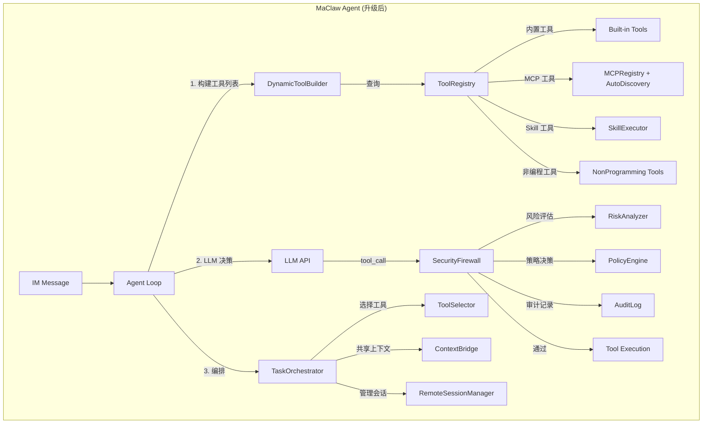
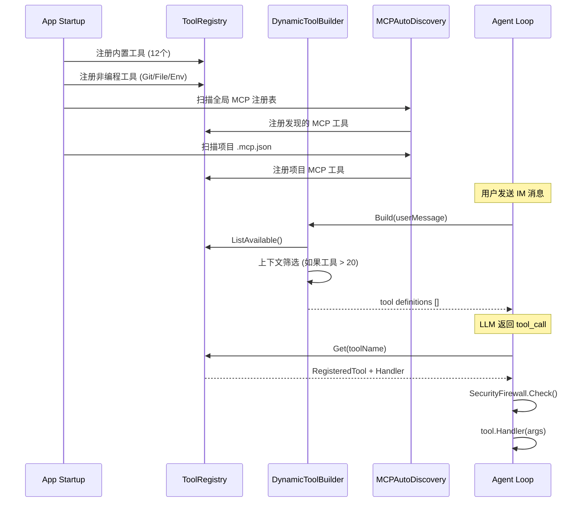
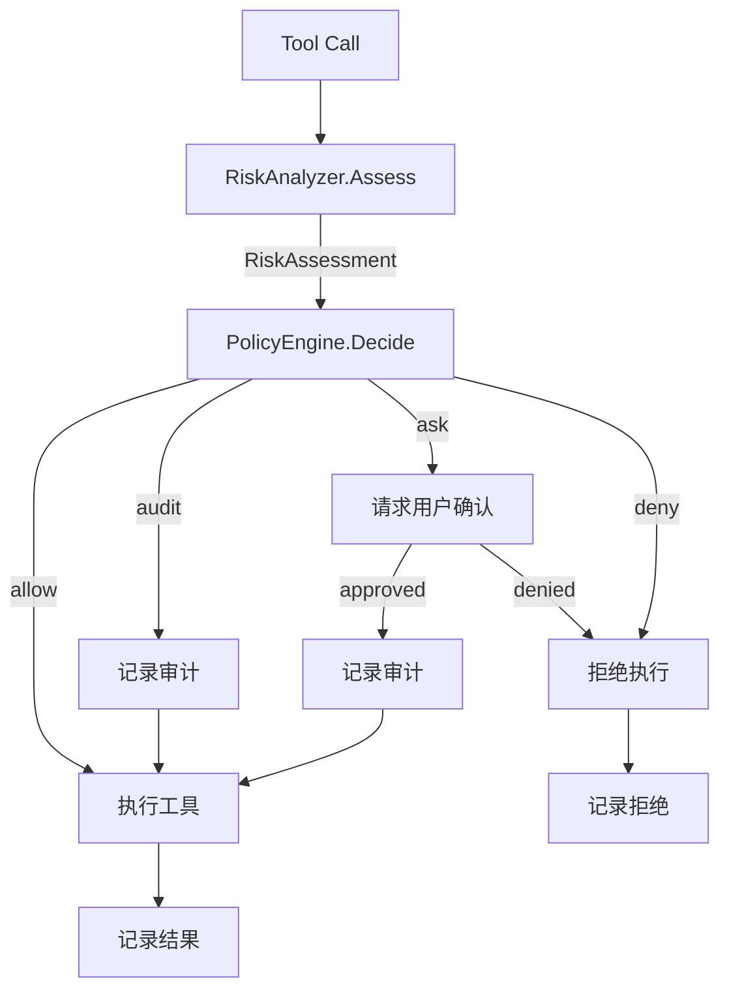

# 设计文档：MaClaw 能力升级 — 动态工具发现、安全防火墙、差异化调度

## Overview

本设计文档描述 MaClaw 三大能力升级的技术方案。所有改进基于现有 Agent Passthrough 架构增量演进，不改变 Hub 侧的消息路由模型。

核心设计目标：

1. **ToolRegistry + DynamicToolBuilder** — 统一工具注册中心 + 动态工具定义生成，替代硬编码的 `buildToolDefinitions()`
2. **SecurityFirewall** — 多层安全防火墙（RiskAnalyzer + PolicyEngine + AuditLog），替代简单的 PermissionMode 切换
3. **TaskOrchestrator + ToolSelector + ContextBridge** — 智能调度层，实现多工具编排、自动选择、上下文共享

## Architecture



### 设计决策

**D1: ToolRegistry 作为单一事实来源**

所有工具（内置、MCP、Skill、非编程）统一注册到 ToolRegistry。`buildToolDefinitions()` 不再硬编码工具列表，而是从 ToolRegistry 动态查询。这样新增任何类型的工具都自动对 Agent 可见。

**D2: SecurityFirewall 插入在 LLM tool_call 和实际执行之间**

Agent Loop 收到 LLM 的 tool_call 后，先经过 SecurityFirewall 评估，再决定是否执行。这个位置确保所有工具调用（包括 MCP 和 Skill）都受安全控制。

**D3: RiskAnalyzer 使用规则 + 模式匹配，不依赖额外 LLM 调用**

风险评估使用预定义的规则和正则模式匹配，不调用 LLM（避免延迟和成本）。只有在规则无法判断时，才可选地使用 LLM 辅助评估。

**D4: PolicyEngine 支持四级策略层叠**

策略优先级：工具调用参数级 > 会话级 > 项目级 > 全局级。高优先级策略覆盖低优先级。

**D5: TaskOrchestrator 是可选的高级功能**

普通的单会话操作不经过 TaskOrchestrator。只有用户明确请求多任务编排（或 Agent 判断任务需要分解）时才启用。

**D6: ContextBridge 基于事件提取，不侵入编程工具**

ContextBridge 从 OutputPipeline 的事件流中提取上下文信息（文件变更、命令执行等），不修改编程工具的行为。

**D7: 分阶段交付**

- Phase 1（基础）：ToolRegistry + DynamicToolBuilder + MCP AutoDiscovery
- Phase 2（安全）：SecurityFirewall (RiskAnalyzer + PolicyEngine + AuditLog)
- Phase 3（调度）：TaskOrchestrator + ToolSelector + ContextBridge + 非编程工具

## Components and Interfaces

### Phase 1: 动态工具发现

#### 1.1 ToolRegistry (`tool_registry.go`)

```go
// ToolCategory 工具类别
type ToolCategory string
const (
    ToolCategoryBuiltin    ToolCategory = "builtin"     // 内置工具（会话管理等）
    ToolCategoryMCP        ToolCategory = "mcp"         // MCP Server 工具
    ToolCategorySkill      ToolCategory = "skill"       // Skill 工具
    ToolCategoryNonCode    ToolCategory = "non_code"    // 非编程工具（Git/文件/环境）
)

// ToolStatus 工具状态
type ToolStatus string
const (
    ToolStatusAvailable   ToolStatus = "available"
    ToolStatusDegraded    ToolStatus = "degraded"    // 可用但性能下降
    ToolStatusUnavailable ToolStatus = "unavailable"
)

// RegisteredTool 注册工具的统一元数据
type RegisteredTool struct {
    Name        string                 `json:"name"`
    Description string                 `json:"description"`
    Category    ToolCategory           `json:"category"`
    Tags        []string               `json:"tags"`       // 语义标签，用于上下文筛选
    Priority    int                    `json:"priority"`   // 优先级，数字越大越优先
    Status      ToolStatus             `json:"status"`
    InputSchema map[string]interface{} `json:"input_schema"`
    Required    []string               `json:"required"`
    Source      string                 `json:"source"`     // 来源标识（MCP server ID / skill name）
    Handler     ToolHandler            `json:"-"`          // 执行函数
}

// ToolHandler 工具执行接口
type ToolHandler func(args map[string]interface{}) string

// ToolRegistry 统一工具注册中心
type ToolRegistry struct {
    mu       sync.RWMutex
    tools    map[string]*RegisteredTool
    onChange []func()  // 工具变更通知回调
}

func NewToolRegistry() *ToolRegistry
func (r *ToolRegistry) Register(tool RegisteredTool) error
func (r *ToolRegistry) Unregister(name string)
func (r *ToolRegistry) Get(name string) (*RegisteredTool, bool)
func (r *ToolRegistry) List() []RegisteredTool
func (r *ToolRegistry) ListAvailable() []RegisteredTool  // 只返回 status=available 的
func (r *ToolRegistry) ListByCategory(cat ToolCategory) []RegisteredTool
func (r *ToolRegistry) ListByTags(tags []string) []RegisteredTool
func (r *ToolRegistry) UpdateStatus(name string, status ToolStatus)
func (r *ToolRegistry) OnChange(fn func())  // 注册变更回调
```

#### 1.2 DynamicToolBuilder (`tool_builder.go`)

```go
// DynamicToolBuilder 动态构建 LLM tool definitions
type DynamicToolBuilder struct {
    registry *ToolRegistry
}

func NewDynamicToolBuilder(registry *ToolRegistry) *DynamicToolBuilder

// Build 根据当前注册工具和上下文生成 LLM tool definitions
// userMessage 用于上下文感知筛选（当工具数 > 20 时启用）
func (b *DynamicToolBuilder) Build(userMessage string) []map[string]interface{}

// BuildAll 返回所有可用工具的定义（不做筛选）
func (b *DynamicToolBuilder) BuildAll() []map[string]interface{}
```

#### 1.3 MCPAutoDiscovery (`mcp_auto_discovery.go`)

```go
// MCPAutoDiscovery MCP Server 自动发现
type MCPAutoDiscovery struct {
    registry    *ToolRegistry
    mcpRegistry *MCPRegistry
    app         *App
    watcher     *fsnotify.Watcher  // 文件变更监听
}

func NewMCPAutoDiscovery(app *App, registry *ToolRegistry, mcpRegistry *MCPRegistry) *MCPAutoDiscovery

// ScanProject 扫描项目目录中的 MCP 声明文件
func (d *MCPAutoDiscovery) ScanProject(projectPath string) error

// ScanGlobal 扫描全局 MCP 注册表
func (d *MCPAutoDiscovery) ScanGlobal() error

// WatchProject 监听项目 MCP 声明文件变更
func (d *MCPAutoDiscovery) WatchProject(projectPath string) error

// Stop 停止所有监听
func (d *MCPAutoDiscovery) Stop()
```

MCP 声明文件格式（`.mcp.json`）：
```json
{
  "servers": [
    {
      "id": "my-db-server",
      "name": "Database Tools",
      "endpoint_url": "http://localhost:8080/mcp",
      "auth_type": "api_key",
      "tags": ["database", "sql", "query"]
    }
  ]
}
```

#### 1.4 IMMessageHandler 改造

```go
// 改造前（硬编码）
func (h *IMMessageHandler) buildToolDefinitions() []map[string]interface{} {
    return []map[string]interface{}{
        toolDef("list_sessions", ...),
        // ... 12 个硬编码工具
    }
}

// 改造后（动态）
func (h *IMMessageHandler) buildToolDefinitions(userMessage string) []map[string]interface{} {
    return h.toolBuilder.Build(userMessage)
}

// 改造前（switch-case 分发）
func (h *IMMessageHandler) executeTool(name, argsJSON string) string {
    switch name {
    case "list_sessions": ...
    case "create_session": ...
    // ... 12 个 case
    }
}

// 改造后（Registry 查找）
func (h *IMMessageHandler) executeTool(name, argsJSON string) string {
    tool, ok := h.registry.Get(name)
    if !ok {
        return fmt.Sprintf("未知工具: %s", name)
    }
    // 经过 SecurityFirewall（Phase 2）
    return tool.Handler(args)
}
```

### Phase 2: 安全防火墙

#### 2.1 RiskAnalyzer (`security_risk_analyzer.go`)

```go
type RiskLevel string
const (
    RiskLow      RiskLevel = "low"
    RiskMedium   RiskLevel = "medium"
    RiskHigh     RiskLevel = "high"
    RiskCritical RiskLevel = "critical"
)

// RiskAssessment 风险评估结果
type RiskAssessment struct {
    Level       RiskLevel `json:"level"`
    Reason      string    `json:"reason"`
    Patterns    []string  `json:"patterns"`     // 匹配到的风险模式
    Mitigations []string  `json:"mitigations"`  // 建议的缓解措施
}

// RiskPattern 风险模式定义
type RiskPattern struct {
    Name        string    `json:"name"`
    Category    string    `json:"category"`    // "file_delete", "network", "permission", "system"
    ToolMatch   string    `json:"tool_match"`  // 工具名匹配（正则）
    ParamMatch  string    `json:"param_match"` // 参数值匹配（正则）
    ParamKey    string    `json:"param_key"`   // 要检查的参数键
    Level       RiskLevel `json:"level"`
    Description string    `json:"description"`
}

// RiskAnalyzer 语义级风险分析器
type RiskAnalyzer struct {
    builtinPatterns []RiskPattern
    customPatterns  []RiskPattern
}

func NewRiskAnalyzer() *RiskAnalyzer

// Assess 评估工具调用的风险
func (a *RiskAnalyzer) Assess(toolName string, args map[string]interface{}, context *CallContext) RiskAssessment

// AddCustomPattern 添加用户自定义风险模式
func (a *RiskAnalyzer) AddCustomPattern(pattern RiskPattern)

// CallContext 调用上下文，用于上下文感知的风险评估
type CallContext struct {
    UserMessage    string   // 用户原始消息
    SessionID      string
    RecentApprovals []string // 最近批准的操作类型
}
```

内置风险模式示例：
```go
var defaultRiskPatterns = []RiskPattern{
    // 文件删除
    {Name: "recursive_delete", Category: "file_delete", ToolMatch: ".*[Bb]ash.*|.*[Ss]hell.*",
     ParamKey: "command", ParamMatch: `rm\s+-rf|rmdir\s+/s`, Level: RiskCritical,
     Description: "递归删除文件或目录"},
    // 网络外传
    {Name: "data_exfil", Category: "network", ToolMatch: ".*[Bb]ash.*",
     ParamKey: "command", ParamMatch: `curl\s+.*-X\s+POST|wget\s+--post`, Level: RiskHigh,
     Description: "通过网络发送数据"},
    // 权限变更
    {Name: "permission_change", Category: "permission", ToolMatch: ".*[Bb]ash.*",
     ParamKey: "command", ParamMatch: `chmod\s+777|chown\s+`, Level: RiskHigh,
     Description: "修改文件权限或所有者"},
    // 环境变量
    {Name: "env_modify", Category: "system", ToolMatch: ".*[Bb]ash.*",
     ParamKey: "command", ParamMatch: `export\s+.*KEY|export\s+.*SECRET|export\s+.*TOKEN`, Level: RiskMedium,
     Description: "修改敏感环境变量"},
    // 系统命令
    {Name: "system_command", Category: "system", ToolMatch: ".*[Bb]ash.*",
     ParamKey: "command", ParamMatch: `shutdown|reboot|systemctl\s+stop|kill\s+-9`, Level: RiskCritical,
     Description: "执行系统级命令"},
}
```

#### 2.2 PolicyEngine (`security_policy_engine.go`)

```go
// PolicyAction 策略动作
type PolicyAction string
const (
    PolicyAllow PolicyAction = "allow"   // 直接允许
    PolicyDeny  PolicyAction = "deny"    // 直接拒绝
    PolicyAsk   PolicyAction = "ask"     // 请求用户确认
    PolicyAudit PolicyAction = "audit"   // 允许但记录审计
)

// PolicyRule 策略规则
type PolicyRule struct {
    Name       string       `json:"name"`
    ToolMatch  string       `json:"tool_match"`   // 工具名匹配（正则）
    RiskLevel  RiskLevel    `json:"risk_level"`   // 风险等级匹配
    Action     PolicyAction `json:"action"`
    Priority   int          `json:"priority"`     // 优先级，数字越大越优先
}

// PolicyDecision 策略决策结果
type PolicyDecision struct {
    Action    PolicyAction   `json:"action"`
    Rule      string         `json:"rule"`       // 匹配的规则名
    Risk      RiskAssessment `json:"risk"`
    Timestamp time.Time      `json:"timestamp"`
}

// PolicyEngine 策略引擎
type PolicyEngine struct {
    globalRules  []PolicyRule  // 全局策略
    projectRules []PolicyRule  // 项目级策略
    sessionRules map[string][]PolicyRule  // 会话级策略
    mu           sync.RWMutex
}

func NewPolicyEngine() *PolicyEngine

// Decide 根据风险评估和策略规则做出决策
func (e *PolicyEngine) Decide(toolName string, risk RiskAssessment, sessionID string) PolicyDecision

// LoadProjectPolicy 加载项目级策略文件
func (e *PolicyEngine) LoadProjectPolicy(projectPath string) error

// ApproveForSession 将某类操作标记为会话级自动批准
func (e *PolicyEngine) ApproveForSession(sessionID string, toolPattern string, riskLevel RiskLevel)
```

默认策略：
```json
{
  "default_policy": {
    "low": "allow",
    "medium": "audit",
    "high": "ask",
    "critical": "deny"
  },
  "rules": [
    {"name": "allow_read_ops", "tool_match": "list_.*|get_.*|read_.*|search_.*", "action": "allow", "priority": 10},
    {"name": "audit_file_write", "tool_match": ".*write.*|.*edit.*", "risk_level": "medium", "action": "audit", "priority": 5}
  ]
}
```

#### 2.3 AuditLog (`security_audit_log.go`)

```go
// AuditEntry 审计日志条目
type AuditEntry struct {
    Timestamp  time.Time      `json:"timestamp"`
    UserID     string         `json:"user_id"`
    SessionID  string         `json:"session_id"`
    ToolName   string         `json:"tool_name"`
    Args       interface{}    `json:"args"`
    Risk       RiskAssessment `json:"risk"`
    Decision   PolicyDecision `json:"decision"`
    Result     string         `json:"result"`     // "success", "error", "denied"
    Duration   time.Duration  `json:"duration_ms"`
}

// AuditLog 审计日志管理器
type AuditLog struct {
    dir     string          // 日志目录
    current *os.File        // 当前日志文件
    mu      sync.Mutex
}

func NewAuditLog(dir string) *AuditLog
func (l *AuditLog) Record(entry AuditEntry) error
func (l *AuditLog) Query(filter AuditFilter) ([]AuditEntry, error)

type AuditFilter struct {
    Since     time.Time  `json:"since"`
    Until     time.Time  `json:"until"`
    UserID    string     `json:"user_id"`
    ToolName  string     `json:"tool_name"`
    RiskLevel RiskLevel  `json:"risk_level"`
    Limit     int        `json:"limit"`
}
```

#### 2.4 SecurityFirewall 集成 (`security_firewall.go`)

```go
// SecurityFirewall 安全防火墙 — 集成 RiskAnalyzer + PolicyEngine + AuditLog
type SecurityFirewall struct {
    analyzer *RiskAnalyzer
    policy   *PolicyEngine
    audit    *AuditLog
    onAsk    func(toolName string, risk RiskAssessment) (bool, error)  // 用户确认回调
}

func NewSecurityFirewall(analyzer *RiskAnalyzer, policy *PolicyEngine, audit *AuditLog) *SecurityFirewall

// Check 在工具执行前进行安全检查
// 返回 (允许执行, 错误原因)
func (f *SecurityFirewall) Check(toolName string, args map[string]interface{}, ctx *CallContext) (bool, string)
```

在 Agent Loop 中的集成点：
```go
// im_message_handler.go — executeTool 改造
func (h *IMMessageHandler) executeTool(name, argsJSON string) string {
    // 1. 解析参数
    var args map[string]interface{}
    json.Unmarshal([]byte(argsJSON), &args)

    // 2. 安全防火墙检查（Phase 2 新增）
    if h.firewall != nil {
        ctx := &CallContext{UserMessage: h.currentUserMessage, SessionID: h.currentSessionID}
        allowed, reason := h.firewall.Check(name, args, ctx)
        if !allowed {
            return fmt.Sprintf("⛔ 操作被安全策略拒绝: %s", reason)
        }
    }

    // 3. 从 Registry 查找并执行
    tool, ok := h.registry.Get(name)
    if !ok {
        return fmt.Sprintf("未知工具: %s", name)
    }
    return tool.Handler(args)
}
```

### Phase 3: 差异化调度

#### 3.1 TaskOrchestrator (`task_orchestrator.go`)

```go
// TaskPlan 任务执行计划
type TaskPlan struct {
    ID          string     `json:"id"`
    Description string     `json:"description"`
    SubTasks    []SubTask  `json:"sub_tasks"`
    Status      string     `json:"status"`  // "planning", "running", "completed", "failed"
}

// SubTask 子任务
type SubTask struct {
    ID           string   `json:"id"`
    Description  string   `json:"description"`
    Tool         string   `json:"tool"`          // 编程工具名，"auto" 表示自动选择
    SessionID    string   `json:"session_id"`    // 创建后填充
    DependsOn    []string `json:"depends_on"`    // 依赖的子任务 ID
    Status       string   `json:"status"`
    Result       string   `json:"result"`
}

// TaskOrchestrator 任务编排器
type TaskOrchestrator struct {
    manager      *RemoteSessionManager
    toolSelector *ToolSelector
    contextBridge *ContextBridge
    plans        map[string]*TaskPlan
    mu           sync.RWMutex
}

func NewTaskOrchestrator(manager *RemoteSessionManager, selector *ToolSelector, bridge *ContextBridge) *TaskOrchestrator
func (o *TaskOrchestrator) CreatePlan(description string, subTasks []SubTask) (*TaskPlan, error)
func (o *TaskOrchestrator) Execute(planID string) error
func (o *TaskOrchestrator) GetStatus(planID string) (*TaskPlan, error)
func (o *TaskOrchestrator) Cancel(planID string) error
```

#### 3.2 ToolSelector (`tool_selector.go`)

```go
// ToolProfile 工具能力画像
type ToolProfile struct {
    Tool          string            `json:"tool"`
    Strengths     []string          `json:"strengths"`      // 擅长的任务类型
    Languages     []string          `json:"languages"`      // 擅长的编程语言
    SuccessRate   float64           `json:"success_rate"`   // 历史成功率
    AvgDuration   time.Duration     `json:"avg_duration"`   // 平均完成时间
    UserPreference int              `json:"user_preference"` // 用户偏好分数
}

// ToolSelector 智能工具选择器
type ToolSelector struct {
    catalog  map[string]RemoteToolMetadata
    profiles map[string]*ToolProfile
    history  []SelectionRecord
    mu       sync.RWMutex
}

func NewToolSelector(catalog map[string]RemoteToolMetadata) *ToolSelector
func (s *ToolSelector) Select(taskDescription string, projectPath string) (string, string)  // (toolName, reason)
func (s *ToolSelector) RecordResult(tool string, taskType string, success bool, duration time.Duration)
func (s *ToolSelector) GetProfiles() []ToolProfile
```

#### 3.3 ContextBridge (`context_bridge.go`)

```go
// ProjectContext 项目级共享上下文
type ProjectContext struct {
    ProjectPath    string              `json:"project_path"`
    FileChanges    []FileChangeRecord  `json:"file_changes"`
    Decisions      []DecisionRecord    `json:"decisions"`
    Notes          []string            `json:"notes"`
    LastUpdated    time.Time           `json:"last_updated"`
}

// ContextBridge 跨工具上下文桥接器
type ContextBridge struct {
    contexts map[string]*ProjectContext  // projectPath → context
    mu       sync.RWMutex
}

func NewContextBridge() *ContextBridge
func (b *ContextBridge) ExtractFromEvents(projectPath string, events []ImportantEvent)
func (b *ContextBridge) BuildContextPrompt(projectPath string) string
func (b *ContextBridge) AddNote(projectPath string, note string)
func (b *ContextBridge) GetContext(projectPath string) *ProjectContext
```

#### 3.4 非编程工具注册

在 App 初始化时，将非编程工具注册到 ToolRegistry：

```go
func registerNonCodeTools(registry *ToolRegistry, app *App) {
    registry.Register(RegisteredTool{
        Name: "git_status", Description: "查看当前 Git 仓库状态",
        Category: ToolCategoryNonCode, Tags: []string{"git", "vcs"},
        Handler: func(args map[string]interface{}) string { /* exec git status */ },
    })
    registry.Register(RegisteredTool{
        Name: "git_diff", Description: "查看 Git 差异",
        Category: ToolCategoryNonCode, Tags: []string{"git", "vcs"},
        Handler: func(args map[string]interface{}) string { /* exec git diff */ },
    })
    registry.Register(RegisteredTool{
        Name: "read_file", Description: "读取文件内容",
        Category: ToolCategoryNonCode, Tags: []string{"file", "read"},
        Handler: func(args map[string]interface{}) string { /* read file */ },
    })
    registry.Register(RegisteredTool{
        Name: "list_dir", Description: "列出目录内容",
        Category: ToolCategoryNonCode, Tags: []string{"file", "directory"},
        Handler: func(args map[string]interface{}) string { /* list dir */ },
    })
    registry.Register(RegisteredTool{
        Name: "search_files", Description: "在项目中搜索文件内容",
        Category: ToolCategoryNonCode, Tags: []string{"file", "search"},
        Handler: func(args map[string]interface{}) string { /* grep/ripgrep */ },
    })
    // ... 更多非编程工具
}
```

## Data Models

### 工具注册数据流



### 安全防火墙决策流



### 持久化数据

| 位置 | 文件/键 | 说明 |
|------|---------|------|
| MaClaw | `~/.maclaw/mcp-servers.json` | 全局 MCP Server 注册表 |
| 项目 | `.mcp.json` | 项目级 MCP Server 声明 |
| 项目 | `.maclaw/security-policy.json` | 项目级安全策略 |
| MaClaw | `~/.maclaw/audit/YYYY-MM-DD.jsonl` | 审计日志（按日轮转） |
| MaClaw | `~/.maclaw/tool-profiles.json` | 工具能力画像和历史数据 |
| MaClaw | `~/.maclaw/contexts/` | 项目上下文缓存 |
| AppConfig | `security_policy` | 全局安全策略配置 |
| AppConfig | `tool_selector_history` | 工具选择历史记录 |

