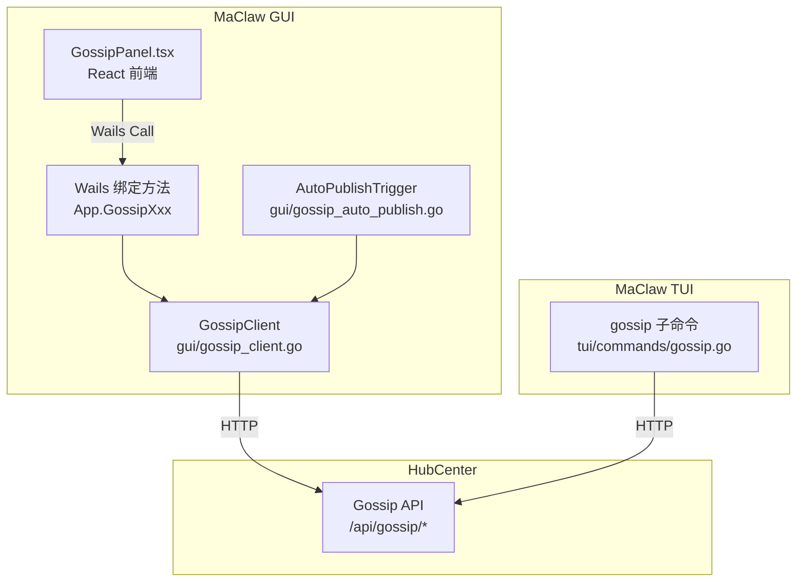
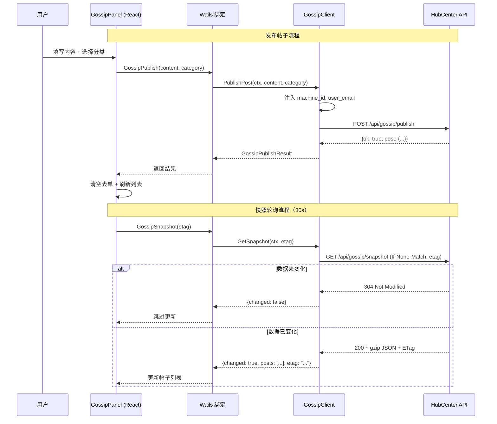

# 设计文档：MaClaw Gossip 集成

## 概述

本设计为 MaClaw 端（GUI + TUI）接入 HubCenter Gossip API 提供完整的技术方案。核心思路是：

1. 在 `gui/` 包中新增 `GossipClient`（参照 `SkillMarketClient` 模式），封装与 HubCenter Gossip API 的全部 HTTP 通信
2. 在 `gui/` 包的 `App` 结构体上新增 Wails 绑定方法，将 GossipClient 暴露给前端
3. 改造现有 `GossipPanel.tsx`，从直连 HubCenter 切换为通过 Wails 绑定调用 Go 后端，并新增发布、评论、评分 UI
4. 在 `tui/commands/` 中新增 `gossip.go`，提供完整的 CLI 子命令（参照 `skillmarket.go` 模式）
5. 新增 `AutoPublishTrigger`（参照 `AutoUploadTrigger` 模式），在特定事件发生时自动生成并发布 Gossip 内容
6. 在 `AppConfig` 中新增 `gossip_auto_publish` 配置项

设计决策要点：
- GossipClient 放在 `gui/` 包而非 `corelib/`，因为 TUI 端直接通过 HTTP 调用（与 `skillmarket.go` 一致），无需共享客户端代码
- 前端从直连 HubCenter 切换为后端中转，统一 machine_id/user_email 注入，避免前端暴露配置细节
- 自动发布默认关闭，需用户显式开启，避免隐私泄露

## 架构

### 整体架构图



### 数据流



## 组件与接口

### 1. GossipClient（gui/gossip_client.go）

参照 `SkillMarketClient` 的设计模式，封装与 HubCenter Gossip API 的通信。

```go
// GossipClient 与 HubCenter Gossip API 交互。
type GossipClient struct {
    app    *App
    client *http.Client
}

func NewGossipClient(app *App) *GossipClient

// 核心方法
func (c *GossipClient) PublishPost(ctx context.Context, content, category string) (*GossipPublishResult, error)
func (c *GossipClient) BrowsePosts(ctx context.Context, page int) (*GossipBrowseResult, error)
func (c *GossipClient) AddComment(ctx context.Context, postID, content string, rating int) (*GossipCommentResult, error)
func (c *GossipClient) RatePost(ctx context.Context, postID string, rating int) error
func (c *GossipClient) GetComments(ctx context.Context, postID string, page int) (*GossipCommentsResult, error)
func (c *GossipClient) GetSnapshot(ctx context.Context, etag string) (*GossipSnapshotResult, error)
```

关键设计：
- `baseURL()` 从 `config.RemoteHubCenterURL` 读取，为空时回退到 `defaultRemoteHubCenterURL`（与 SkillMarketClient 一致）
- 所有请求自动注入 `machine_id`（来自 `config.RemoteMachineID`）和 `user_email`（来自 `config.RemoteEmail`）
- HTTP 超时统一 30 秒
- 错误返回包含 HTTP 状态码和服务端错误消息

### 2. Wails 绑定方法（gui/app_gossip.go）

在 `App` 结构体上新增方法，通过 Wails 暴露给前端：

```go
// gui/app_gossip.go
func (a *App) GossipPublish(content, category string) (*GossipPublishResult, error)
func (a *App) GossipBrowse(page int) (*GossipBrowseResult, error)
func (a *App) GossipComment(postID, content string, rating int) (*GossipCommentResult, error)
func (a *App) GossipRate(postID string, rating int) error
func (a *App) GossipGetComments(postID string, page int) (*GossipCommentsResult, error)
func (a *App) GossipSnapshot(etag string) (*GossipSnapshotResult, error)
```

每个方法内部创建带 30 秒超时的 context，调用 GossipClient 对应方法。

### 3. GossipPanel 前端改造（gui/frontend/src/components/gossip/GossipPanel.tsx）

改造要点：
- 移除 `hubUrl` prop 依赖，改为通过 Wails 绑定获取数据
- 新增发布表单（textarea + category 选择器 + 字符计数）
- 新增评论区域（展开/收起 + 评论列表 + 评论输入框）
- 新增评分星标（1-5 星点击评分）
- locked 帖子隐藏评论/评分交互，显示"已锁定"提示
- 保留 30s 轮询、搜索、排序、分页功能

### 4. TUI gossip 子命令（tui/commands/gossip.go）

参照 `skillmarket.go` 的命令结构：

```go
func RunGossip(args []string) error  // 入口分发

// 子命令
func gossipBrowse(args []string) error    // gossip browse [--page N] [--json]
func gossipPublish(args []string) error   // gossip publish --content "..." --category owner|project|news
func gossipComment(args []string) error   // gossip comment --post-id ID --content "..." [--rating 0-5]
func gossipRate(args []string) error      // gossip rate --post-id ID --rating 1-5
func gossipComments(args []string) error  // gossip comments --post-id ID [--page N] [--json]
```

每个子命令直接通过 HTTP 调用 HubCenter API（与 skillmarket.go 一致），从配置读取 hubcenter URL、machine_id、email。

### 5. AutoPublishTrigger（gui/gossip_auto_publish.go）

参照 `AutoUploadTrigger` 的设计模式：

```go
type AutoPublishTrigger struct {
    mu         sync.Mutex
    client     *GossipClient
    lastPublish time.Time          // 冷却计时
    enabled    func() bool         // 动态读取 gossip_auto_publish 配置
}

func NewAutoPublishTrigger(client *GossipClient, enabledFn func() bool) *AutoPublishTrigger

// 事件触发入口
func (t *AutoPublishTrigger) OnSkillUploaded(skillName, description string)
func (t *AutoPublishTrigger) OnSessionCompleted(sessionSummary string, durationMin int)

// 内部方法
func (t *AutoPublishTrigger) tryPublish(content, category string)
func sanitizeContent(content string) string  // 脱敏：移除文件路径、邮箱、IP
```

关键设计：
- 冷却间隔 10 分钟，防止刷屏
- `sanitizeContent` 使用正则移除文件路径（`/xxx/xxx` 或 `C:\xxx`）、邮箱（`xxx@xxx`）、IP 地址
- 发布失败只记录日志，不中断主流程
- 默认关闭（`gossip_auto_publish` 默认 false）

## 数据模型

### Go 端数据结构（gui/gossip_client.go）

```go
// GossipPost 帖子数据（从 HubCenter API 返回）
type GossipPost struct {
    ID        string `json:"id"`
    Nickname  string `json:"nickname"`
    Content   string `json:"content"`
    Category  string `json:"category"`
    Score     int    `json:"score"`
    Votes     int    `json:"votes"`
    Locked    bool   `json:"locked"`
    CreatedAt string `json:"created_at"`
}

// GossipComment 评论数据
type GossipComment struct {
    ID        string `json:"id"`
    Nickname  string `json:"nickname"`
    Content   string `json:"content"`
    Rating    int    `json:"rating"`
    CreatedAt string `json:"created_at"`
}

// API 响应结构
type GossipPublishResult struct {
    OK   bool       `json:"ok"`
    Post GossipPost `json:"post"`
}

type GossipBrowseResult struct {
    OK    bool         `json:"ok"`
    Posts []GossipPost `json:"posts"`
    Total int          `json:"total"`
    Page  int          `json:"page"`
}

type GossipCommentResult struct {
    OK      bool          `json:"ok"`
    Comment GossipComment `json:"comment"`
}

type GossipCommentsResult struct {
    OK       bool            `json:"ok"`
    Comments []GossipComment `json:"comments"`
    Total    int             `json:"total"`
    Page     int             `json:"page"`
}

type GossipSnapshotResult struct {
    Changed bool         `json:"changed"`
    Posts   []GossipPost `json:"posts,omitempty"`
    Total   int          `json:"total,omitempty"`
    ETag    string       `json:"etag,omitempty"`
}
```

### 配置扩展（corelib/app_config.go）

```go
// 在 AppConfig 中新增：
GossipAutoPublish bool `json:"gossip_auto_publish,omitempty"` // 默认 false
```

### 前端 TypeScript 类型

```typescript
// 扩展现有 GossipPost 接口（已有）
interface GossipPost {
    id: string;
    nickname: string;
    content: string;
    category: string;
    score: number;
    votes: number;
    locked: boolean;
    created_at: string;
}

// 新增
interface GossipComment {
    id: string;
    nickname: string;
    content: string;
    rating: number;
    created_at: string;
}

interface GossipSnapshotResult {
    changed: boolean;
    posts?: GossipPost[];
    total?: number;
    etag?: string;
}
```


## 正确性属性

*属性（Property）是在系统所有有效执行中都应成立的特征或行为——本质上是关于系统应该做什么的形式化陈述。属性是人类可读规范与机器可验证正确性保证之间的桥梁。*

### Property 1: GossipClient 请求构造正确性

*For any* GossipClient API 方法调用（PublishPost、BrowsePosts、AddComment、RatePost、GetComments、GetSnapshot），给定任意有效参数和任意非空配置（RemoteHubCenterURL、RemoteMachineID、RemoteEmail），构造的 HTTP 请求应满足：(a) 使用正确的 HTTP 方法和端点路径，(b) POST 请求体中包含配置中的 machine_id 和 user_email 字段，(c) 基础 URL 来自 RemoteHubCenterURL（为空时回退到默认值）。

**Validates: Requirements 1.1, 1.2, 1.3, 1.4, 1.5, 1.6, 1.7, 1.8, 1.9**

### Property 2: HTTP 错误传播

*For any* HubCenter API 响应，当 HTTP 状态码 >= 300 时，GossipClient 返回的 error 应包含该状态码数值和响应体中的错误消息文本。

**Validates: Requirements 1.10**

### Property 3: 内容长度验证

*For any* 字符串 s，发布帖子时：若 `len([]rune(s))` 不在 [1, 2000] 范围内，则提交应被拒绝；评论时：若 `len([]rune(s))` 不在 [1, 1000] 范围内，则提交应被拒绝。在范围内的字符串应被接受。

**Validates: Requirements 2.3, 2.4, 3.3**

### Property 4: 锁定帖子禁止交互

*For any* GossipPost 数据，当 `locked == true` 时，该帖子的评论输入框和评分星标不应被渲染（或应被禁用），且应显示"已锁定"提示。

**Validates: Requirements 3.6**

### Property 5: TUI 缺少必需参数时返回用法提示

*For any* gossip 子命令（publish、comment、rate），当缺少任意必需参数时，命令应返回 UsageError 类型的错误，且错误消息中包含 "usage:" 字样。

**Validates: Requirements 5.6**

### Property 6: TUI --json 输出有效 JSON

*For any* gossip 子命令的成功执行结果，当指定 --json 标志时，标准输出应为可解析的有效 JSON。

**Validates: Requirements 5.7**

### Property 7: 内容脱敏移除敏感信息

*For any* 包含文件路径（如 `/home/user/project` 或 `C:\Users\xxx`）、邮箱地址（如 `user@example.com`）或 IP 地址（如 `192.168.1.1`）的字符串，经过 `sanitizeContent` 处理后，输出中不应再包含这些敏感模式。

**Validates: Requirements 6.5**

### Property 8: 自动发布生成正确的分类和内容

*For any* 触发事件，当 Skill 上传成功时，生成的帖子 category 应为 "news" 且内容包含 Skill 名称；当编码会话完成且时长 > 5 分钟时，生成的帖子 category 应为 "project" 且内容包含会话摘要；当会话时长 ≤ 5 分钟时，不应生成帖子。

**Validates: Requirements 6.1, 6.2**

### Property 9: 自动发布尊重禁用配置

*For any* 触发事件（Skill 上传或会话完成），当 `gossip_auto_publish` 配置为 false 时，不应发起任何发布请求。

**Validates: Requirements 6.3, 6.4**

### Property 10: 自动发布冷却间隔

*For any* 两次连续的自动发布尝试，若时间间隔小于 10 分钟，则第二次应被跳过，不发起发布请求。

**Validates: Requirements 6.6**

### Property 11: 搜索排序过滤正确性

*For any* 帖子列表和搜索关键词 q，过滤后的结果中每条帖子的 nickname、content 或 category 标签应包含 q（不区分大小写）。排序模式为 "newest" 时，结果应按 created_at 降序；"hottest" 时按 votes 降序；"score" 时按 score 降序。

**Validates: Requirements 7.3**

### Property 12: ETag 未变化时跳过数据更新

*For any* GossipSnapshot 调用，当返回结果的 `changed == false` 时，前端帖子状态不应被修改（保持调用前的值）。

**Validates: Requirements 7.4**

## 错误处理

### GossipClient 错误处理

| 场景 | 处理方式 |
|------|---------|
| HubCenter URL 未配置 | 返回 `fmt.Errorf("hubcenter URL not configured")` |
| HTTP 请求超时（30s） | 返回包含超时信息的 error |
| HTTP 状态码 >= 300 | 读取响应体，返回 `fmt.Errorf("request failed (%d): %s", statusCode, body)` |
| JSON 解码失败 | 返回 `fmt.Errorf("decode response: %w", err)` |
| machine_id 为空 | 返回 `fmt.Errorf("machine_id not configured")` |
| GetSnapshot 收到 304 | 返回 `GossipSnapshotResult{Changed: false}`（非错误） |
| gzip 解压失败 | 返回 `fmt.Errorf("decompress snapshot: %w", err)` |

### GUI 前端错误处理

| 场景 | 处理方式 |
|------|---------|
| Wails 绑定调用失败 | 在对应区域显示红色错误提示，3 秒后自动消失 |
| 发布失败 | 保留表单内容，在表单区域显示错误信息 |
| 评论/评分失败 | 在帖子评论区域显示错误信息 |
| 快照轮询失败 | 静默忽略（轮询场景），不影响已显示的数据 |
| 内容验证不通过 | 禁用提交按钮，显示字符计数提示 |

### TUI 错误处理

| 场景 | 处理方式 |
|------|---------|
| 缺少必需参数 | 返回 UsageError，输出用法提示 |
| HTTP 请求失败 | 输出中文错误提示：`fmt.Errorf("操作失败: %w", err)` |
| JSON 解码失败 | 输出中文错误提示：`fmt.Errorf("解析结果失败: %w", err)` |
| email 未配置 | 输出提示：`"邮箱未配置，请在配置中设置 remote_email"` |

### AutoPublishTrigger 错误处理

| 场景 | 处理方式 |
|------|---------|
| 发布请求失败 | `log.Printf("[gossip-auto] publish failed: %v", err)`，不中断主流程 |
| 配置读取失败 | 视为 disabled，跳过发布 |
| 冷却期内 | 静默跳过，记录 debug 日志 |

## 测试策略

### 双重测试方法

本功能采用单元测试 + 属性测试的双重策略：

- **单元测试**：验证具体示例、边界情况和错误条件
- **属性测试**：验证跨所有输入的通用属性

### 属性测试配置

- **测试库**：Go 端使用 `pgregory.net/rapid`（Go 属性测试库）；前端使用 `fast-check`
- **每个属性测试最少运行 100 次迭代**
- **每个属性测试必须通过注释引用设计文档中的属性编号**
- **标签格式**：`Feature: maclaw-gossip-integration, Property {number}: {property_text}`
- **每个正确性属性由单个属性测试实现**

### Go 端测试（gui/gossip_client_test.go）

**属性测试**：
- Property 1: 请求构造正确性 — 使用 httptest.Server 模拟 HubCenter，验证请求方法、路径、body 字段
- Property 2: HTTP 错误传播 — 生成随机状态码和错误消息，验证 error 包含它们
- Property 7: 内容脱敏 — 生成包含随机敏感模式的字符串，验证 sanitizeContent 移除它们
- Property 8: 自动发布分类/内容 — 生成随机事件参数，验证生成的帖子分类和内容
- Property 9: 自动发布禁用 — 生成随机事件，验证 disabled 时不发布
- Property 10: 冷却间隔 — 生成随机时间间隔，验证 < 10min 时跳过

**单元测试**：
- GossipClient 各方法的成功路径
- URL 回退到默认值（边界情况）
- machine_id 为空时的错误
- GetSnapshot 304 处理
- AutoPublishTrigger 发布失败不中断主流程

### TUI 端测试（tui/commands/gossip_test.go）

**属性测试**：
- Property 5: 缺少参数 → UsageError
- Property 6: --json 输出有效 JSON

**单元测试**：
- 各子命令的成功路径
- 错误消息为中文

### 前端测试（gui/frontend/src/components/gossip/GossipPanel.test.tsx）

**属性测试**（使用 fast-check）：
- Property 3: 内容长度验证
- Property 11: 搜索排序过滤正确性

**单元测试**：
- Property 4: locked 帖子隐藏交互控件
- Property 12: ETag 未变化时跳过更新
- 发布表单展开/收起
- 评论区域展开/收起
- 评分星标点击
