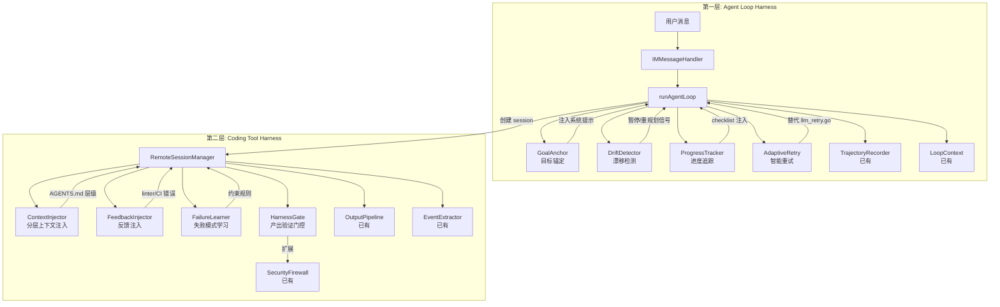
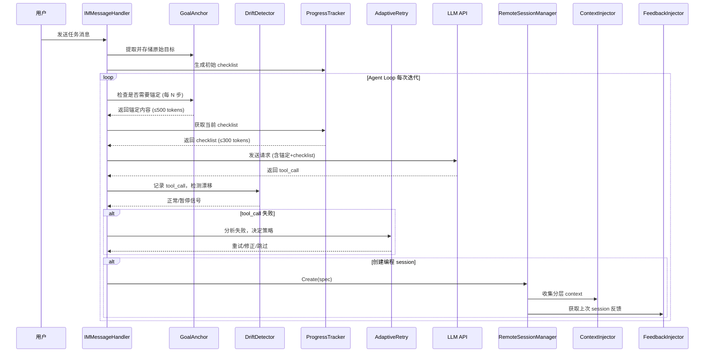

# 设计文档：MaClaw Harness Engineering

## 概述

本设计为 MaClaw 项目引入两层 Harness Engineering 体系，提升 AI Agent 在长程任务中的可靠性和编程工具的运行环境质量。

**第一层 — Agent Loop Harness**：在 `gui/im_message_handler.go` 的 `runAgentLoop` 中嵌入目标锚定（Goal Anchoring）、漂移检测（Drift Detection）、结构化进度追踪（Progress Tracking）和智能重试（Adaptive Retry）四个模块，替代现有的盲重试机制。

**第二层 — Coding Tool Harness**：在 `gui/remote_session_manager.go` 管理的编程工具 session 生命周期中嵌入分层 Context File 注入、Linter/CI 反馈注入、失败模式学习和产出验证门控四个模块，增强编程工具的运行环境。

**核心设计原则**：
- 所有 Harness 模块均为可选插件，通过 setter 注入到 `IMMessageHandler` 和 `RemoteSessionManager`，不影响现有功能
- 复用现有基础设施：`TrajectoryRecorder`（轨迹记录）、`OutputPipeline`（输出管道）、`SecurityFirewall`（安全防火墙）、`LoopContext`（循环上下文）
- Token 预算严格控制：所有注入内容有明确的 token 上限，避免挤占 LLM context 窗口

## 架构

### 整体架构图



### 模块集成点



## 组件和接口

### 第一层组件

#### 1. GoalAnchor（目标锚定）

位置：`gui/goal_anchor.go`

```go
// GoalAnchor 在长程 Agent Loop 中周期性重新注入原始用户目标。
type GoalAnchor struct {
    originalGoal    string // 原始用户目标文本 (≤200 字符)
    anchorInterval  int    // 锚定间隔 (默认 5 步)
    maxTokens       int    // 锚定内容 token 上限 (默认 500)
}

// NewGoalAnchor 从用户首条消息中提取目标。
func NewGoalAnchor(userText string, interval int) *GoalAnchor

// ShouldAnchor 判断当前迭代是否需要锚定。
func (g *GoalAnchor) ShouldAnchor(iteration int) bool

// BuildAnchorContent 生成锚定内容，包含原始目标和进度摘要。
// progressSummary 来自 ProgressTracker。
func (g *GoalAnchor) BuildAnchorContent(progressSummary string) string
```

集成点：在 `runAgentLoop` 的每次迭代开始时调用，将返回内容追加到系统提示末尾。

#### 2. DriftDetector（漂移检测）

位置：`gui/drift_detector.go`

```go
// DriftDetector 分析 tool_call 序列检测循环模式。
type DriftDetector struct {
    windowSize       int     // 检测窗口大小 (默认 K=8)
    similarityThresh float64 // 参数相似度阈值 (默认 0.8)
    replanCount      int     // 当前 loop 中重规划次数
}

// ToolCallRecord 记录单次 tool_call 的关键信息。
type ToolCallRecord struct {
    ToolName  string
    ArgsHash  string // 参数的规范化哈希
    Timestamp time.Time
}

// NewDriftDetector 创建漂移检测器。
func NewDriftDetector(windowSize int, threshold float64) *DriftDetector

// Record 记录一次 tool_call。
func (d *DriftDetector) Record(rec ToolCallRecord)

// DetectDrift 分析最近 K 步，返回漂移类型。
func (d *DriftDetector) DetectDrift() DriftResult

// ResetWindow 重规划后重置检测窗口。
func (d *DriftDetector) ResetWindow()
```

```go
// DriftResult 描述漂移检测结果。
type DriftResult struct {
    Drifted       bool
    Pattern       string // "loop" | "diverge" | ""
    ReplanPrompt  string // 注入 LLM 的重规划提示
    NeedHumanHelp bool   // 二次触发时为 true
}
```

集成点：在 `runAgentLoop` 每次 tool_call 执行后调用 `Record`，然后调用 `DetectDrift` 检查。

#### 3. HarnessProgressTracker（Harness 进度追踪）

位置：`gui/harness_progress_tracker.go`

注意：与 `corelib/remote/session_progress_tracker.go` 中的 `ProgressTracker`（追踪编程工具的 tool_use 步骤）不同，此组件追踪的是 Agent Loop 自身的任务 checklist。

```go
// HarnessProgressTracker 维护 Agent Loop 的结构化任务 checklist。
type HarnessProgressTracker struct {
    items     []ChecklistItem
    maxTokens int // checklist token 上限 (默认 300)
}

// ChecklistItem 表示 checklist 中的一项。
type ChecklistItem struct {
    Description string
    Completed   bool
    CompletedAt time.Time
}

// NewHarnessProgressTracker 从用户目标生成初始 checklist。
// 如果目标简单（单步），返回 nil 表示不需要 checklist。
func NewHarnessProgressTracker(items []ChecklistItem, maxTokens int) *HarnessProgressTracker

// MarkComplete 标记指定项为已完成。
func (t *HarnessProgressTracker) MarkComplete(index int)

// BuildChecklistContent 生成 Markdown checkbox 格式的 checklist。
// 超出 token 限制时仅保留最近 3 个已完成项和全部未完成项。
func (t *HarnessProgressTracker) BuildChecklistContent() string

// AllComplete 判断是否全部完成。
func (t *HarnessProgressTracker) AllComplete() bool

// Summary 返回进度摘要（已完成数/总数 + 当前步骤描述）。
func (t *HarnessProgressTracker) Summary() string
```

集成点：在 `runAgentLoop` 开始时由 LLM 生成初始 checklist，每次迭代前注入 checklist 到 context。

#### 4. AdaptiveRetry（智能重试）

位置：`gui/adaptive_retry.go`

替代现有 `gui/llm_retry.go` 中的 `isRetryableLLMError` 盲重试逻辑。

```go
// FailureCategory 失败分类。
type FailureCategory string

const (
    FailureNetwork    FailureCategory = "network"
    FailurePermission FailureCategory = "permission"
    FailureArgs       FailureCategory = "args"
    FailureLogic      FailureCategory = "logic"
    FailureUnknown    FailureCategory = "unknown"
)

// AdaptiveRetry 分析 tool_call 失败并决定重试策略。
type AdaptiveRetry struct {
    failureCounts map[string]int // toolName → 累计失败次数
    maxFailures   int            // 单工具最大失败次数 (默认 5)
    disabledTools map[string]bool // 已禁用的工具
    recorder      *TrajectoryRecorder
}

// RetryDecision 重试决策。
type RetryDecision struct {
    Action       string // "retry", "fix", "skip", "disable"
    Delay        time.Duration // 重试延迟 (指数退避)
    ErrorContext string // 注入 LLM 的错误上下文
    Attempt      int    // 当前重试次数
}

// NewAdaptiveRetry 创建智能重试器。
func NewAdaptiveRetry(recorder *TrajectoryRecorder) *AdaptiveRetry

// Classify 分析错误信息，返回失败分类。
func (r *AdaptiveRetry) Classify(toolName string, err error) FailureCategory

// Decide 根据失败分类和历史决定重试策略。
func (r *AdaptiveRetry) Decide(toolName string, category FailureCategory, attempt int) RetryDecision

// RecordFailure 记录一次失败到 TrajectoryRecorder。
func (r *AdaptiveRetry) RecordFailure(toolName string, category FailureCategory, decision RetryDecision)

// IsDisabled 检查工具是否已被禁用。
func (r *AdaptiveRetry) IsDisabled(toolName string) bool
```

集成点：在 `runAgentLoop` 的 tool_call 执行失败处理中替代现有的 `isRetryableLLMError` 逻辑。

### 第二层组件

#### 5. ContextInjector（分层上下文注入）

位置：`corelib/configfile/context_injector.go`

```go
// ContextLayer 表示一层 context file。
type ContextLayer struct {
    Level   string // "ROOT", "MODULE: xxx", "LOCAL"
    Path    string // AGENTS.md 文件路径
    Content string // 文件内容
}

// ContextInjector 收集并拼接分层 context files。
type ContextInjector struct {
    maxTokens int // 总 token 上限 (默认 8000)
}

// NewContextInjector 创建注入器。
func NewContextInjector(maxTokens int) *ContextInjector

// Collect 从 workDir 向上递归收集 AGENTS.md 文件。
// 同时合并根目录的 CLAUDE.md（向后兼容）。
func (c *ContextInjector) Collect(workDir, projectRoot string) []ContextLayer

// Build 将收集的层级拼接为带标记的 context 字符串。
// 超出 token 限制时优先保留 ROOT 和 LOCAL，截断中间层级。
func (c *ContextInjector) Build(layers []ContextLayer) string
```

集成点：在 `RemoteSessionManager.Create` 中，`ensureToolOnboardingComplete` 之后调用，将 context 写入编程工具的配置文件（CLAUDE.md / codex config / gemini settings）。

#### 6. FeedbackInjector（反馈注入）

位置：`corelib/remote/feedback_injector.go`

```go
// FeedbackEntry 表示一条结构化反馈。
type FeedbackEntry struct {
    Source   string // "linter", "test", "build", "ci"
    Severity string // "error", "warning"
    File     string // 文件路径
    Line     int    // 行号
    Message  string // 错误描述
}

// FeedbackInjector 从 OutputPipeline 事件中提取反馈并注入下次 session。
type FeedbackInjector struct {
    maxTokens      int                       // 反馈块 token 上限 (默认 2000)
    sessionFeedback map[string][]FeedbackEntry // sessionID → 反馈列表
    mu             sync.RWMutex
}

// NewFeedbackInjector 创建反馈注入器。
func NewFeedbackInjector(maxTokens int) *FeedbackInjector

// ConsumeEvents 从 OutputPipeline 事件中提取反馈。
func (f *FeedbackInjector) ConsumeEvents(sessionID string, events []ImportantEvent)

// BuildFeedbackBlock 为下次 session 生成反馈块。
// 按严重程度排序，超出 token 限制时截断低优先级错误。
func (f *FeedbackInjector) BuildFeedbackBlock(prevSessionID string) string

// Clear 清除指定 session 的反馈。
func (f *FeedbackInjector) Clear(sessionID string)
```

集成点：在 `OutputPipeline.Consume` 的事件处理后调用 `ConsumeEvents`；在 `RemoteSessionManager.Create` 中调用 `BuildFeedbackBlock` 获取上次反馈。

#### 7. FailureLearner（失败模式学习）

位置：`corelib/remote/failure_learner.go`

```go
// LearnedConstraint 表示一条从失败中学到的约束规则。
type LearnedConstraint struct {
    Rule        string    `json:"rule"`         // 自然语言约束描述
    TriggerCount int      `json:"trigger_count"` // 触发次数
    CreatedAt   time.Time `json:"created_at"`
    LastTriggered time.Time `json:"last_triggered"`
}

// FailureLearner 从重复失败中提取约束规则。
type FailureLearner struct {
    projectPath    string
    threshold      int // 重复失败阈值 (默认 3)
    expiryDays     int // 约束过期天数 (默认 7)
    maxTokens      int // 约束文件 token 上限 (默认 1500)
    errorPatterns  map[string]int // errorKey → 出现次数
    mu             sync.Mutex
}

// NewFailureLearner 创建失败学习器。
func NewFailureLearner(projectPath string) *FailureLearner

// RecordError 记录一次错误事件，达到阈值时自动生成约束。
func (l *FailureLearner) RecordError(errorKey, errorDetail string)

// LoadConstraints 从 .maclaw/learned-constraints.md 加载约束。
func (l *FailureLearner) LoadConstraints() []LearnedConstraint

// BuildConstraintBlock 生成约束注入内容。
// 按触发次数降序排列，超出 token 限制时截断低频约束。
func (l *FailureLearner) BuildConstraintBlock() string

// PruneExpired 移除过期约束。
func (l *FailureLearner) PruneExpired()
```

集成点：在 `OutputPipeline` 事件处理后调用 `RecordError`；在编程工具 session 启动时调用 `BuildConstraintBlock`。

#### 8. HarnessGate（产出验证门控）

位置：`corelib/security/harness_gate.go`

```go
// ProjectConstraints 定义项目约束规则。
type ProjectConstraints struct {
    ForbiddenPaths    []string `json:"forbidden_paths"`    // 禁止修改的文件路径 glob
    RequiredFiles     []string `json:"required_files"`     // 必须存在的文件 glob
    ForbiddenImports  []string `json:"forbidden_imports"`  // 禁止引入的依赖包
}

// Violation 表示一条违规。
type Violation struct {
    Rule    string // 违反的约束类型
    Detail  string // 违规详情
    File    string // 相关文件
}

// HarnessGate 扩展 SecurityFirewall 增加项目约束检查。
type HarnessGate struct {
    firewall    *Firewall
    constraints *ProjectConstraints
    audit       *AuditLog
}

// NewHarnessGate 创建门控，加载项目约束。
func NewHarnessGate(firewall *Firewall, projectPath string) *HarnessGate

// LoadConstraints 从 .maclaw/project-constraints.json 加载约束。
func (g *HarnessGate) LoadConstraints(projectPath string) error

// CheckOutput 检查编程工具产出是否符合约束。
// changedFiles 是本次 session 修改的文件列表。
func (g *HarnessGate) CheckOutput(sessionID string, changedFiles []string) []Violation

// BuildViolationReport 生成违规报告，用于注入下次 session context。
func (g *HarnessGate) BuildViolationReport(violations []Violation) string
```

集成点：在编程工具 session 退出后（`runExitLoop`）调用 `CheckOutput`；违规报告通过 `FeedbackInjector` 注入下次 session。

## 数据模型

### 配置文件

#### `.maclaw/project-constraints.json`

```json
{
  "forbidden_paths": [
    "go.mod",
    "go.sum",
    "*.lock",
    "vendor/**"
  ],
  "required_files": [
    "*_test.go"
  ],
  "forbidden_imports": [
    "unsafe",
    "reflect"
  ]
}
```

#### `.maclaw/learned-constraints.md`

```markdown
# Learned Constraints (Auto-generated)

- [2025-01-15] (触发 5 次) 禁止在 corelib/security/ 下使用 fmt.Println 调试输出，应使用 log.Printf
- [2025-01-14] (触发 3 次) gui/ 包中的新 struct 必须实现 json.Marshaler 接口
```

#### AGENTS.md 层级结构

```
project-root/
├── AGENTS.md              ← [ROOT] 项目地图
├── CLAUDE.md              ← 合并到 ROOT 层级（向后兼容）
├── corelib/
│   ├── AGENTS.md          ← [MODULE: corelib] 共享库上下文
│   └── security/
│       └── AGENTS.md      ← [MODULE: corelib/security] 安全模块上下文
├── gui/
│   └── AGENTS.md          ← [MODULE: gui] 桌面客户端上下文
└── hub/
    └── AGENTS.md          ← [MODULE: hub] 后端上下文
```

### 内部数据结构

#### GoalAnchor 注入格式

```
[目标锚定]
原始目标: <用户目标文本，≤200字符>
当前进度: 已完成 3/7 步 | 当前: 实现 DriftDetector | 剩余: 4 项
[/目标锚定]
```

#### DriftDetector 重规划提示格式

```
[漂移检测]
检测到循环模式: 连续 3 次调用 bash 且参数相似。
请暂停当前操作，重新审视原始目标，制定新的执行计划。
不要重复之前失败的方法，尝试不同的解决路径。
[/漂移检测]
```

#### FeedbackInjector 反馈块格式

```
[上次 Session 反馈]
来源: linter | 文件: gui/goal_anchor.go:42 | 错误: undefined: GoalAnchor
来源: test  | 文件: gui/goal_anchor_test.go:15 | 错误: TestGoalAnchor/basic failed
来源: build | 文件: gui/drift_detector.go:88 | 错误: cannot use x (type int) as string
[/反馈]
```


## 正确性属性（Correctness Properties）

*属性（Property）是在系统所有有效执行中都应成立的特征或行为——本质上是关于系统应该做什么的形式化陈述。属性是人类可读规范与机器可验证正确性保证之间的桥梁。*

### Property 1: 目标锚定周期性触发

*For any* 迭代次数 iteration 和锚定间隔 N，GoalAnchor.ShouldAnchor(iteration) 应当在且仅在 iteration > 0 且 iteration % N == 0 时返回 true。

**Validates: Requirements 1.1**

### Property 2: 目标文本不变性

*For any* 用户目标文本，GoalAnchor 构造后，无论调用多少次 BuildAnchorContent 或 ShouldAnchor，其内部存储的原始目标文本应始终等于构造时提取的文本（截断后）。

**Validates: Requirements 1.2**

### Property 3: 锚定内容完整性与大小约束

*For any* 进度摘要（包含已完成数、当前步骤、剩余数），BuildAnchorContent 的输出应同时满足：(a) 包含已完成步骤数、当前步骤描述和剩余待完成项计数，(b) 估算 token 数 ≤ 500，(c) 若原始目标超过 200 字符则被截断为 200 字符加省略标记。

**Validates: Requirements 1.3, 1.4, 1.5**

### Property 4: 循环模式检测准确性

*For any* tool_call 序列，若序列中存在连续 3 次或以上调用相同工具且参数哈希相同的子序列，且序列长度 ≥ K，则 DetectDrift 应返回 Drifted=true 且 ReplanPrompt 非空；若不存在此模式或序列长度 < K，则应返回 Drifted=false。

**Validates: Requirements 2.1, 2.2, 2.3**

### Property 5: 漂移检测窗口重置

*For any* DriftDetector，在检测到漂移并调用 ResetWindow 后，需要重新累积 K 步新记录才能再次触发检测；在重置后的 K 步内，DetectDrift 不应返回 Drifted=true（除非新记录本身构成循环模式）。

**Validates: Requirements 2.5**

### Property 6: 二次漂移触发人工介入

*For any* DriftDetector，若在同一 loop 生命周期内第二次检测到漂移（即 ResetWindow 后再次触发），DetectDrift 应返回 NeedHumanHelp=true。

**Validates: Requirements 2.6**

### Property 7: Checklist 格式与大小约束

*For any* ChecklistItem 列表（包含任意数量的已完成和未完成项），BuildChecklistContent 的输出应满足：(a) 每个已完成项以 `- [x]` 开头，每个未完成项以 `- [ ]` 开头，(b) 估算 token 数 ≤ 300，(c) 超出限制时保留最近 3 个已完成项和全部未完成项。

**Validates: Requirements 3.2, 3.4**

### Property 8: Checklist 完成状态一致性

*For any* ChecklistItem 列表，当且仅当所有项的 Completed 字段为 true 时，AllComplete 返回 true；MarkComplete(i) 后第 i 项的 Completed 应为 true。

**Validates: Requirements 3.5, 3.6**

### Property 9: 失败分类到重试策略的映射

*For any* 工具名称和失败分类，AdaptiveRetry.Decide 应返回：网络错误 → Action="retry" 且 Delay 按指数退避递增且 attempt ≤ 3；参数/逻辑错误 → Action="fix" 且 ErrorContext 非空；权限错误 → Action="skip"。

**Validates: Requirements 4.2, 4.3, 4.4**

### Property 10: 工具禁用阈值

*For any* 工具名称，当该工具的累计失败次数 ≥ 5 时，IsDisabled 应返回 true；累计失败次数 < 5 时应返回 false。

**Validates: Requirements 4.6**

### Property 11: 分层 Context 收集顺序与大小约束

*For any* 目录层级结构（含 AGENTS.md 文件），ContextInjector.Collect 返回的层级应按从根到叶排序，且 Build 的输出估算 token 数 ≤ 8000，每个层级带有正确的标记（[ROOT]、[MODULE: xxx]、[LOCAL]）。

**Validates: Requirements 5.2, 5.3, 5.6**

### Property 12: 反馈提取格式化与大小约束

*For any* ImportantEvent 列表（含错误事件），FeedbackInjector.ConsumeEvents 后 BuildFeedbackBlock 的输出应满足：(a) 每条反馈包含来源、文件路径、行号和错误描述，(b) 估算 token 数 ≤ 2000，(c) 按严重程度排序。

**Validates: Requirements 6.1, 6.2, 6.4, 6.6**

### Property 13: 失败模式学习阈值与约束生成

*For any* 错误键，当同一错误键被 RecordError 记录 ≥ 3 次时，LoadConstraints 应包含对应的约束规则（非空 Rule 字段）；记录 < 3 次时不应生成约束。

**Validates: Requirements 7.1, 7.2**

### Property 14: 约束过期清理

*For any* LearnedConstraint 集合，PruneExpired 后，所有 LastTriggered 距今超过 7 天的约束应被移除，7 天内的约束应被保留。

**Validates: Requirements 7.5**

### Property 15: 约束内容大小约束

*For any* LearnedConstraint 集合，BuildConstraintBlock 的输出估算 token 数 ≤ 1500，且约束按 TriggerCount 降序排列。

**Validates: Requirements 7.6**

### Property 16: 产出约束检查

*For any* 变更文件列表和 ProjectConstraints，HarnessGate.CheckOutput 应：(a) 对匹配 ForbiddenPaths 的文件返回违规，(b) 对缺失 RequiredFiles 模式的情况返回违规，(c) 对包含 ForbiddenImports 的文件返回违规；当无约束文件时返回空违规列表。

**Validates: Requirements 8.2, 8.3**

### Property 17: 违规报告生成

*For any* 非空 Violation 列表，BuildViolationReport 应返回非空字符串，包含每条违规的 Rule 和 Detail；空 Violation 列表应返回空字符串。

**Validates: Requirements 8.4**

## 错误处理

### 第一层错误处理

| 场景 | 处理策略 |
|------|---------|
| GoalAnchor 构造时用户消息为空 | 使用默认目标文本 "完成用户请求" |
| DriftDetector 记录数不足 K 步 | 跳过检测，返回无漂移 |
| ProgressTracker checklist 为空 | 不注入 checklist，正常执行 |
| AdaptiveRetry 分类失败 | 归类为 FailureUnknown，使用默认重试策略（重试 1 次） |
| LLM 生成的 checklist 格式异常 | 回退到无 checklist 模式 |

### 第二层错误处理

| 场景 | 处理策略 |
|------|---------|
| AGENTS.md 文件读取失败 | 跳过该层级，记录警告日志 |
| learned-constraints.md 解析失败 | 备份损坏文件，创建空文件 |
| project-constraints.json 格式错误 | 跳过约束检查，仅执行安全检查 |
| FeedbackInjector 事件提取失败 | 跳过该事件，不影响其他事件 |
| HarnessGate 文件 glob 匹配失败 | 跳过该规则，记录警告 |

### 通用原则

- 所有 Harness 模块的失败不应阻塞 Agent Loop 或编程工具 session 的正常执行
- 错误信息通过 `log.Printf` 记录，不向用户暴露内部错误
- 配置文件缺失时使用合理默认值，不要求用户手动创建

## 测试策略

### 双轨测试方法

本功能采用单元测试 + 属性测试的双轨策略：

- **单元测试**：验证具体示例、边界情况和集成点
- **属性测试**：验证跨所有输入的通用属性

### 属性测试配置

- 使用 Go 标准库 `testing/quick` 作为属性测试框架
- 每个属性测试最少运行 100 次迭代
- 每个属性测试必须以注释引用设计文档中的属性编号
- 标签格式：**Feature: maclaw-harness-engineering, Property {number}: {property_text}**
- 每个正确性属性由单个属性测试实现

### 测试文件规划

| 组件 | 测试文件 | 测试类型 |
|------|---------|---------|
| GoalAnchor | `gui/goal_anchor_test.go` | 单元 + 属性 (P1, P2, P3) |
| DriftDetector | `gui/drift_detector_test.go` | 单元 + 属性 (P4, P5, P6) |
| HarnessProgressTracker | `gui/harness_progress_tracker_test.go` | 单元 + 属性 (P7, P8) |
| AdaptiveRetry | `gui/adaptive_retry_test.go` | 单元 + 属性 (P9, P10) |
| ContextInjector | `corelib/configfile/context_injector_test.go` | 单元 + 属性 (P11) |
| FeedbackInjector | `corelib/remote/feedback_injector_test.go` | 单元 + 属性 (P12) |
| FailureLearner | `corelib/remote/failure_learner_test.go` | 单元 + 属性 (P13, P14, P15) |
| HarnessGate | `corelib/security/harness_gate_test.go` | 单元 + 属性 (P16, P17) |

### 单元测试重点

- GoalAnchor：空消息、超长消息、中文/英文混合消息
- DriftDetector：恰好 K-1 步不触发、恰好 K 步触发、混合工具序列
- AdaptiveRetry：各类错误字符串的分类准确性、第 5 次失败的禁用触发
- ContextInjector：无 AGENTS.md、仅 CLAUDE.md、深层嵌套目录
- HarnessGate：无约束文件、空约束、glob 模式匹配
