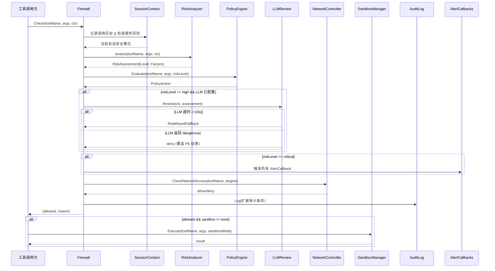

# 设计文档：MaClaw 安全护栏增强

## 概述

本设计基于现有 `corelib/security/` 包的五大组件（Firewall、RiskAnalyzer、PolicyEngine、AuditLog、LLMReview）进行增强，覆盖 9 个需求领域：扩展内置风险模式、可配置护栏扩展机制、增强审计与告警、LLM 安全审查增强、热加载与验证、会话级安全上下文、进程级沙箱隔离、网络访问分级控制、安全策略设置入口。

核心设计原则：
- **向后兼容**：所有新增功能通过扩展现有结构体和接口实现，不破坏已有 API
- **防御性编程**：任何新增子系统的失败都不应导致整体安全检查链路中断
- **最小权限**：沙箱和网络控制默认采用最严格的可用选项
- **配置驱动**：所有安全策略均可通过 GuardrailProfile JSON 配置档进行声明式管理

## 架构

### 整体架构图

```mermaid
graph TB
    subgraph "安全检查入口"
        FW[Firewall]
    end

    subgraph "风险评估层"
        RA[RiskAnalyzer]
        RA_BUILTIN[内置 RiskPattern<br/>含新增 7 类]
        RA_CUSTOM[自定义 RiskPattern<br/>来自 GuardrailProfile]
        RA --> RA_BUILTIN
        RA --> RA_CUSTOM
    end

    subgraph "策略决策层"
        PE[PolicyEngine]
        PE_BUILTIN[内置 PolicyRule]
        PE_CUSTOM[自定义 PolicyRule<br/>来自 GuardrailProfile]
        PE --> PE_BUILTIN
        PE --> PE_CUSTOM
    end

    subgraph "LLM 审查层"
        LR[LLMReview]
        LR_FB[RuleBasedFallback]
        LR --> LR_FB
    end

    subgraph "会话安全上下文"
        SC[SessionContext]
        SC_HIST[调用历史 ≤50]
        SC_RISK[累积风险计数]
        SC_MODE[会话安全模式]
        SC --> SC_HIST
        SC --> SC_RISK
        SC --> SC_MODE
    end

    subgraph "执行隔离层"
        SB[SandboxManager]
        SB_MAC[Seatbelt<br/>macOS]
        SB_LIN[Landlock+seccomp<br/>Linux]
        SB_WIN[Job Object<br/>Windows]
        SB_DOC[Docker 容器]
        SB --> SB_MAC
        SB --> SB_LIN
        SB --> SB_WIN
        SB --> SB_DOC
    end

    subgraph "网络控制层"
        NC[NetworkController]
        NC_BYPASS[系统豁免列表]
        NC_ALLOW[白名单]
        NC_INTRA[内网域名列表]
        NC --> NC_BYPASS
        NC --> NC_ALLOW
        NC --> NC_INTRA
    end

    subgraph "审计与告警"
        AL[AuditLog]
        AC[AlertCallbacks]
    end

    subgraph "配置管理"
        PL[ProfileLoader]
        PW[ProfileWatcher<br/>fsnotify 热加载]
        PV[ValidateProfile]
        PL --> PW
        PL --> PV
    end

    subgraph "用户界面"
        GUI[GUI 安全策略面板]
        TUI[TUI policy 命令]
    end

    FW --> RA
    FW --> PE
    FW --> LR
    FW --> SC
    FW --> SB
    FW --> NC
    FW --> AL
    FW --> AC
    FW --> PL
    GUI --> FW
    TUI --> FW
```



### 安全检查流程




## 组件与接口

### 1. 扩展内置风险模式（需求 1）

在 `corelib/security/risk_analyzer.go` 的 `DefaultRiskPatterns` 中追加以下 RiskPattern：

| 名称 | 类别 | ToolMatch | ParamKey | ParamMatch | 风险等级 | 说明 |
|------|------|-----------|----------|------------|----------|------|
| `credential_leak_ssh` | credential | `(?i)bash\|shell` | command | `cat\s+~/.ssh/id_rsa\|cat\s+/etc/shadow` | critical | SSH 密钥/shadow 文件读取 |
| `credential_leak_env` | credential | `(?i)bash\|shell` | command | `cat\s+.*\.env\|grep\s+.*PASSWORD.*\.env` | high | .env 文件中的密钥泄露 |
| `container_escape` | container | `(?i)bash\|shell` | command | `docker\s+run\s+--privileged\|nsenter\s+\|chroot\s+` | critical | 容器/虚拟化逃逸 |
| `network_recon` | network | `(?i)bash\|shell` | command | `\bnmap\s+\|\bmasscan\s+\|zmap\s+` | high | 网络侦察/端口扫描 |
| `disk_format` | disk | `(?i)bash\|shell` | command | `\bmkfs\b\|\bfdisk\b\|\bdiskpart\b\|\bparted\b` | critical | 磁盘格式化/分区操作 |
| `kernel_module` | kernel | `(?i)bash\|shell` | command | `\binsmod\b\|\bmodprobe\b\|\brmmod\b` | critical | 内核模块加载/卸载 |
| `cron_tamper` | schedule | `(?i)bash\|shell` | command | `crontab\s+-[er]\|/etc/cron` | high | 定时任务篡改 |
| `git_force_push` | vcs | `(?i)bash\|shell` | command | `git\s+push\s+.*--force\|git\s+push\s+-f` | medium | Git 强制推送 |
| `git_rebase_remote` | vcs | `(?i)bash\|shell` | command | `git\s+rebase\s+.*origin/` | medium | Git 远程分支 rebase |

### 2. GuardrailProfile 配置档结构（需求 2、5、7、8）

新增文件 `corelib/security/guardrail_profile.go`：

```go
// GuardrailProfile 定义一个护栏配置档的 JSON 结构。
type GuardrailProfile struct {
    Name           string            `json:"name"`
    Enabled        bool              `json:"enabled"`
    GuardrailMode  string            `json:"guardrail_mode,omitempty"`  // standard/strict/relaxed
    RiskPatterns   []RiskPattern     `json:"risk_patterns,omitempty"`
    PolicyRules    []PolicyRule      `json:"policy_rules,omitempty"`
    Sandbox        string            `json:"sandbox,omitempty"`         // none/os/docker
    SandboxOverrides []SandboxOverride `json:"sandbox_overrides,omitempty"`
    Network        NetworkLevel      `json:"network,omitempty"`         // none/intranet/allowlist/audit/full
    NetworkAllowlist []string        `json:"network_allowlist,omitempty"`
    NetworkAllowlistPresets []string `json:"network_allowlist_presets,omitempty"`
    IntranetDomains []string        `json:"intranet_domains,omitempty"`
}

// SandboxOverride 按工具名或风险等级覆盖沙箱模式。
type SandboxOverride struct {
    ToolPattern string    `json:"tool_pattern,omitempty"`
    RiskLevel   RiskLevel `json:"risk_level,omitempty"`
    Sandbox     string    `json:"sandbox"` // none/os/docker
}

// NetworkLevel 网络访问级别。
type NetworkLevel string

const (
    NetworkNone      NetworkLevel = "none"
    NetworkIntranet  NetworkLevel = "intranet"
    NetworkAllowlist NetworkLevel = "allowlist"
    NetworkAudit     NetworkLevel = "audit"
    NetworkFull      NetworkLevel = "full"
)

// ValidationResult 配置验证结果。
type ValidationResult struct {
    Valid  bool     `json:"valid"`
    Errors []string `json:"errors"`
}
```

### 3. ProfileLoader 配置加载器（需求 2、5）

新增文件 `corelib/security/profile_loader.go`：

```go
// ProfileLoader 负责从 .maclaw/guardrail-profiles/ 加载和验证配置档。
type ProfileLoader struct {
    mu           sync.RWMutex
    projectPath  string
    profiles     []GuardrailProfile
    watcher      *fsnotify.Watcher
    firewall     *Firewall
    logger       func(format string, args ...interface{})
}

// NewProfileLoader 创建配置加载器。
func NewProfileLoader(projectPath string, fw *Firewall) *ProfileLoader

// LoadAll 扫描 .maclaw/guardrail-profiles/*.json，按文件名字母序加载。
func (pl *ProfileLoader) LoadAll() error

// StartWatching 启动文件监控，检测到变更后 5 秒内重新加载。
func (pl *ProfileLoader) StartWatching() error

// StopWatching 停止文件监控。
func (pl *ProfileLoader) StopWatching()

// ValidateProfile 验证配置档内容，不实际应用。
func ValidateProfile(data []byte) ValidationResult
```

加载流程：
1. 扫描 `{projectPath}/.maclaw/guardrail-profiles/*.json`
2. 按文件名字母序排序
3. 逐个解析 JSON，跳过 `enabled: false` 的配置档
4. 对每个 RiskPattern 的正则表达式进行预编译验证
5. 验证失败的规则记录错误日志并跳过，不影响其他规则
6. 将有效的 RiskPattern 追加到 RiskAnalyzer
7. 将有效的 PolicyRule 按优先级合并到 PolicyEngine
8. 后加载的同名规则覆盖先加载的

热加载机制：
- 使用 `fsnotify.Watcher` 监控 `.maclaw/guardrail-profiles/` 目录
- 防抖处理：500ms 内多次变更只触发一次重载（与现有 `tui/config_watcher.go` 模式一致）
- 重载成功后在 AuditLog 记录配置变更事件
- 重载失败时保留当前配置不变

### 4. AlertCallback 告警机制（需求 3）

扩展 `Firewall` 结构体：

```go
// AlertCallback 告警回调函数类型。
type AlertCallback func(entry AuditEntry) error

// Firewall 新增字段
type Firewall struct {
    // ... 现有字段 ...
    alertCallbacks []AlertCallback
    llmReview      *LLMReview
    sessionCtx     map[string]*SessionSecurityContext  // 需求 6
    networkCtrl    *NetworkController                   // 需求 8
    sandboxMgr     *SandboxManager                     // 需求 7
    profileLoader  *ProfileLoader                       // 需求 2/5
}

// RegisterAlertCallback 注册告警回调。
func (f *Firewall) RegisterAlertCallback(cb AlertCallback)

// fireAlerts 触发所有告警回调，单个失败不中断链路。
func (f *Firewall) fireAlerts(entry AuditEntry)
```

### 5. AuditEntry 扩展（需求 3）

扩展现有 `AuditEntry` 结构体：

```go
type AuditEntry struct {
    // ... 现有字段 ...
    RiskPatterns    []string           `json:"risk_patterns,omitempty"`    // 触发的风险模式名称
    MatchedArgs     string             `json:"matched_args,omitempty"`     // 匹配的参数片段
    LLMVerdict      LLMSecurityVerdict `json:"llm_verdict,omitempty"`     // LLM 审查结论
    LLMExplanation  string             `json:"llm_explanation,omitempty"` // LLM 审查解释
    SandboxType     string             `json:"sandbox_type,omitempty"`    // 实际使用的沙箱类型
    SandboxParams   string             `json:"sandbox_params,omitempty"`  // 沙箱隔离参数
    EventType       string             `json:"event_type,omitempty"`      // config_change/session_upgrade/network_change 等
    Source          string             `json:"source,omitempty"`          // gui/tui/system
}
```

扩展 `AuditFilter`：

```go
type AuditFilter struct {
    // ... 现有字段 ...
    RiskPatterns []string  // 按风险模式名称过滤
}
```

### 6. LLMReview 增强（需求 4）

修改 `corelib/security/llm_review.go`：

```go
// Review 增强：支持超时控制和会话历史
func (r *LLMReview) Review(ctx RiskContext, assessment RiskAssessment) (LLMSecurityVerdict, string, error)
```

变更点：
- `Review` 方法增加 10 秒超时（`context.WithTimeout`），超时回退到 `RuleBasedFallback`
- `BuildSecurityPrompt` 增加项目路径和近期操作历史（从 `RiskContext` 中获取）
- `RiskContext` 扩展 `RecentHistory []string` 字段，包含近期工具调用摘要

Firewall 集成逻辑：
- 当 `RiskAssessment.Level >= RiskHigh` 且 LLM 已配置时，自动触发 `LLMReview`
- LLM 返回 `dangerous` 时，覆盖 PolicyEngine 结果为 `deny`
- LLM 未配置或不可用时，使用 `RuleBasedFallback`

### 7. SessionSecurityContext 会话安全上下文（需求 6）

新增文件 `corelib/security/session_context.go`：

```go
// SessionSecurityContext 维护单个会话的安全上下文。
type SessionSecurityContext struct {
    mu              sync.Mutex
    SessionID       string
    CallHistory     []SessionCallRecord  // 最近 50 条
    HighRiskCount   int                  // 5 分钟窗口内 high/critical 计数
    HighRiskWindow  []time.Time          // high/critical 事件时间戳
    EscalatedMode   string               // 被升级后的安全模式，空表示未升级
    OriginalMode    string               // 升级前的原始模式
}

// SessionCallRecord 会话调用记录。
type SessionCallRecord struct {
    Timestamp time.Time
    ToolName  string
    RiskLevel RiskLevel
    Action    PolicyAction
}

const (
    maxSessionHistory     = 50
    highRiskWindowMinutes = 5
    highRiskThreshold     = 3
)

// RecordCall 记录一次工具调用，维护滑动窗口。
func (sc *SessionSecurityContext) RecordCall(record SessionCallRecord)

// ShouldEscalate 检查是否需要升级到 strict 模式。
func (sc *SessionSecurityContext) ShouldEscalate() bool

// Reset 重置安全模式到默认值。
func (sc *SessionSecurityContext) Reset()
```

Firewall 集成：
- `Check` 方法开头调用 `SessionSecurityContext.RecordCall`
- 检查 `ShouldEscalate()`，若触发则自动切换 PolicyEngine 到 strict 模式
- `ClearSession` 同时清除 `SessionSecurityContext`
- 新增 `ResetSessionSecurity(sessionID)` 方法

### 8. SandboxManager 沙箱管理器（需求 7）

新增文件 `corelib/security/sandbox.go`：

```go
// SandboxMode 沙箱模式。
type SandboxMode string

const (
    SandboxNone   SandboxMode = "none"
    SandboxOS     SandboxMode = "os"
    SandboxDocker SandboxMode = "docker"
)

// SandboxManager 管理工具调用的沙箱隔离。
type SandboxManager struct {
    defaultMode   SandboxMode
    overrides     []SandboxOverride
    projectPath   string
    logger        func(format string, args ...interface{})
}

// NewSandboxManager 创建沙箱管理器。
func NewSandboxManager(mode SandboxMode, projectPath string) *SandboxManager

// ResolveMode 根据工具名和风险等级确定实际沙箱模式。
func (sm *SandboxManager) ResolveMode(toolName string, riskLevel RiskLevel) SandboxMode

// PrepareSandbox 准备沙箱环境，返回执行参数。
// 失败时回退到 none 模式。
func (sm *SandboxManager) PrepareSandbox(mode SandboxMode) (*SandboxConfig, error)

// SandboxConfig 沙箱执行配置。
type SandboxConfig struct {
    Mode       SandboxMode
    E
## 组件与接口

### 3.1 扩展 RiskPattern（需求 1）

在现有 `DefaultRiskPatterns` 列表中追加 7 类新风险模式，不修改 `RiskPattern` 结构体本身。

新增类别及对应模式：

| 类别 | 模式名称 | ParamMatch 正则 | 风险等级 |
|------|----------|----------------|---------|
| `credential_leak` | `ssh_key_read` | `cat\s+.*\.ssh/(id_rsa\|id_ed25519\|authorized_keys)` | critical |
| `credential_leak` | `shadow_read` | `cat\s+.*/etc/shadow` | critical |
| `credential_leak` | `env_secret_read` | `cat\s+.*\.env\|grep\s+.*\.(env\|pem\|key)` | high |
| `container_escape` | `docker_privileged` | `docker\s+run\s+.*--privileged` | critical |
| `container_escape` | `nsenter_chroot` | `\b(nsenter\|chroot)\b` | critical |
| `network_recon` | `nmap_scan` | `\b(nmap\|masscan)\b` | high |
| `network_recon` | `port_scan` | `\bfor\b.*\bport\b.*\bdo\b\|\bnc\s+-z` | high |
| `disk_format` | `disk_destructive` | `\b(mkfs\|fdisk\|diskpart\|parted)\b` | critical |
| `kernel_module` | `kernel_mod_load` | `\b(insmod\|modprobe\|rmmod)\b` | critical |
| `cron_tamper` | `crontab_edit` | `crontab\s+-[er]\|/etc/cron` | high |
| `git_force` | `git_force_push` | `git\s+push\s+.*--force\|git\s+push\s+-f` | medium |
| `git_force` | `git_rebase_remote` | `git\s+rebase\s+.*origin/` | medium |

实现方式：在 `risk_analyzer.go` 的 `DefaultRiskPatterns` 变量中追加上述条目，所有新模式的 `ToolMatch` 均为 `(?i)bash|shell`，`ParamKey` 均为 `command`。

### 3.2 GuardrailProfile 配置档（需求 2）

#### JSON Schema

```json
{
  "name": "my-project-guardrails",
  "enabled": true,
  "guardrail_mode": "standard",
  "sandbox": "none",
  "network": "allowlist",
  "network_allowlist": ["api.openai.com:443", "registry.npmjs.org:443"],
  "network_allowlist_presets": ["llm-apis", "package-managers"],
  "intranet_domains": ["*.corp.example.com"],
  "custom_risk_patterns": [
    {
      "name": "my-custom-pattern",
      "category": "custom",
      "tool_match": "(?i)bash|shell",
      "param_key": "command",
      "param_match": "my-dangerous-cmd",
      "level": "high",
      "description": "自定义危险命令"
    }
  ],
  "custom_policy_rules": [
    {
      "name": "deny-my-tool",
      "priority": 5,
      "tool_pattern": "my-tool",
      "risk_levels": ["critical"],
      "action": "deny"
    }
  ],
  "sandbox_overrides": {
    "by_tool": { "bash": "os" },
    "by_risk_level": { "critical": "docker" }
  }
}
```

#### Go 结构体

```go
// GuardrailProfile 护栏配置档，从 .maclaw/guardrail-profiles/*.json 加载。
type GuardrailProfile struct {
    Name                    string            `json:"name"`
    Enabled                 *bool             `json:"enabled,omitempty"`
    GuardrailMode           string            `json:"guardrail_mode,omitempty"`
    Sandbox                 SandboxMode       `json:"sandbox,omitempty"`
    Network                 NetworkLevel      `json:"network,omitempty"`
    NetworkAllowlist        []string          `json:"network_allowlist,omitempty"`
    NetworkAllowlistPresets []string          `json:"network_allowlist_presets,omitempty"`
    IntranetDomains         []string          `json:"intranet_domains,omitempty"`
    CustomRiskPatterns      []RiskPattern     `json:"custom_risk_patterns,omitempty"`
    CustomPolicyRules       []PolicyRule      `json:"custom_policy_rules,omitempty"`
    SandboxOverrides        *SandboxOverrides `json:"sandbox_overrides,omitempty"`
}

// IsEnabled 返回配置档是否启用（nil 视为 true）。
func (p *GuardrailProfile) IsEnabled() bool {
    return p.Enabled == nil || *p.Enabled
}

// SandboxOverrides 按工具名或风险等级覆盖沙箱模式。
type SandboxOverrides struct {
    ByTool      map[string]SandboxMode    `json:"by_tool,omitempty"`
    ByRiskLevel map[RiskLevel]SandboxMode `json:"by_risk_level,omitempty"`
}
```

#### ProfileLoader 热加载（需求 5）

```go
// ProfileLoader 负责从 .maclaw/guardrail-profiles/ 加载和监听配置档变更。
type ProfileLoader struct {
    mu       sync.RWMutex
    dir      string
    profiles []GuardrailProfile
    watcher  *fsnotify.Watcher
    onReload func(profiles []GuardrailProfile)
    stopCh   chan struct{}
}

// NewProfileLoader 创建配置加载器，dir 为 .maclaw/guardrail-profiles/ 绝对路径。
func NewProfileLoader(dir string) (*ProfileLoader, error)

// Load 扫描目录，按文件名字母序加载所有 *.json 配置档。
// 跳过 enabled=false 的配置档，跳过 JSON 解析失败的文件（记录错误日志）。
func (l *ProfileLoader) Load() ([]GuardrailProfile, error)

// Watch 启动 fsnotify 监听，配置文件变更后自动重新加载。
// 内部使用 5 秒 debounce 防止频繁重载。
func (l *ProfileLoader) Watch() error

// Stop 停止文件监听。
func (l *ProfileLoader) Stop()

// Profiles 返回当前已加载的配置档副本。
func (l *ProfileLoader) Profiles() []GuardrailProfile

// ValidateProfile 验证单个配置档内容，返回错误列表，不实际应用。
func ValidateProfile(data []byte) []error
```

验证逻辑：
- JSON 格式合法性
- 所有 `custom_risk_patterns` 中的正则表达式可编译
- 所有 `custom_policy_rules` 中的正则表达式可编译
- `guardrail_mode` 值在 `standard/strict/relaxed` 范围内
- `sandbox` 值在 `none/os/docker` 范围内
- `network` 值在 `none/intranet/allowlist/audit/full` 范围内

### 3.3 增强 AuditEntry 与 AlertCallback（需求 3）

扩展现有 `AuditEntry` 结构体，新增字段：

```go
// AuditEntry 扩展字段（追加到现有结构体，不修改已有字段）
type AuditEntry struct {
    // ... 现有字段保持不变 ...

    // 新增字段
    MatchedPatterns []string           `json:"matched_patterns,omitempty"`
    MatchedSnippet  string             `json:"matched_snippet,omitempty"`
    LLMVerdict      LLMSecurityVerdict `json:"llm_verdict,omitempty"`
    LLMExplanation  string             `json:"llm_explanation,omitempty"`
    SandboxType     SandboxMode        `json:"sandbox_type,omitempty"`
    SandboxParams   string             `json:"sandbox_params,omitempty"`
    NetworkTarget   string             `json:"network_target,omitempty"`
    EventType       AuditEventType     `json:"event_type,omitempty"`
    ChangeSource    string             `json:"change_source,omitempty"`
}

// AuditEventType 审计事件类型。
type AuditEventType string

const (
    AuditEventToolCall        AuditEventType = ""
    AuditEventConfigReload    AuditEventType = "config_reload"
    AuditEventSessionUpgrade  AuditEventType = "session_upgrade"
    AuditEventPolicyChange    AuditEventType = "policy_change"
    AuditEventNetworkChange   AuditEventType = "network_change"
    AuditEventSandboxFallback AuditEventType = "sandbox_fallback"
)
```

扩展 `AuditFilter`，新增 `MatchedPatterns` 过滤条件：

```go
type AuditFilter struct {
    // ... 现有字段保持不变 ...
    MatchedPatterns []string // 按触发的风险模式名称过滤
}
```

AlertCallback 机制：

```go
// AlertCallback 告警回调函数签名。
type AlertCallback func(entry AuditEntry) error

// Firewall 新增方法
// RegisterAlertCallback 注册告警回调，critical 事件时依次调用。
func (f *Firewall) RegisterAlertCallback(cb AlertCallback)

// fireAlerts 触发所有告警回调，单个回调失败记录日志但不中断后续回调。
func (f *Firewall) fireAlerts(entry AuditEntry)
```

### 3.4 LLMReview 增强（需求 4）

扩展 `RiskContext`，在安全审查提示词中包含会话历史：

```go
// RiskContext 扩展字段（追加到现有结构体）
type RiskContext struct {
    // ... 现有字段保持不变 ...
    RecentHistory []string // 当前会话近期操作摘要（最近 10 条）
}
```

Firewall 中的 LLM 审查集成逻辑（在 `Check` 方法中）：

1. 当 `risk.Level >= RiskHigh` 且 `llmReview != nil`：
   - 设置 10 秒超时 `context.WithTimeout`
   - 调用 `llmReview.Review(riskCtx, assessment)`
   - 若超时 → 调用 `RuleBasedFallback`，审计记录超时事件
   - 若返回 `VerdictDangerous` → 覆盖 PolicyEngine 结果为 `deny`
   - 将 verdict 和 explanation 写入 `AuditEntry`

`BuildSecurityPrompt` 扩展：在提示词中追加 `RecentHistory` 字段，格式为：
```
Recent operations in this session:
- tool1(args_summary)
- tool2(args_summary)
...
```
