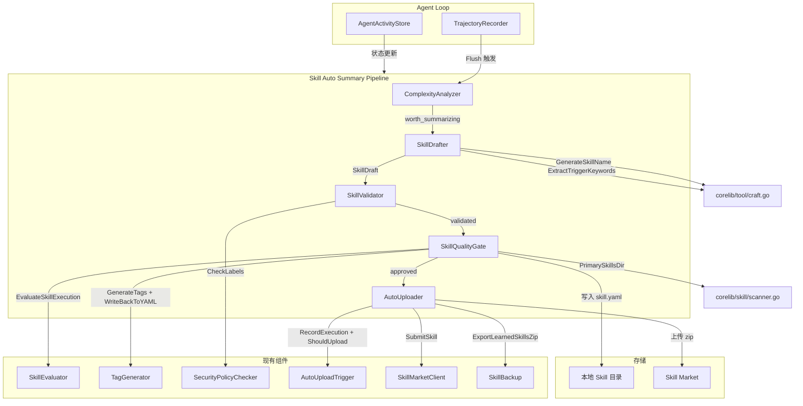
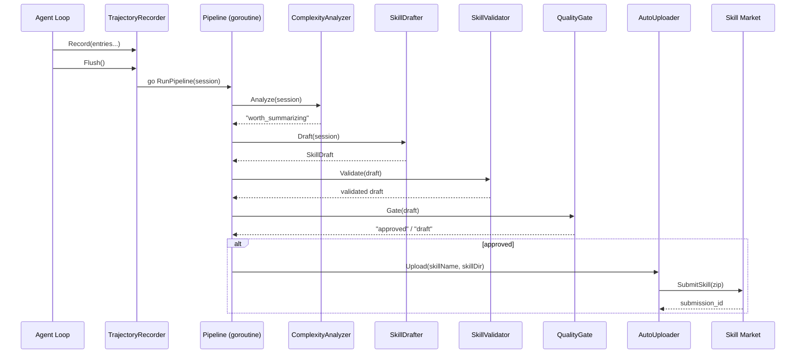

# 设计文档：MaClaw Skill 自动总结

## 概述

本设计实现 MaClaw 在完成复杂多步骤任务后，自动将执行轨迹总结为可复用的 Skill 定义，经过验证、评分后上传到 Skill Market 的端到端流水线。

整个流水线分为五个阶段：

1. **复杂度分析** — 从 `TrajectorySession` 提取指标，判断任务是否值得总结
2. **草稿生成** — 将 Trajectory 中的 tool_calls 整理为 `SkillYAMLFile` 结构
3. **草稿验证** — 结构校验 + 安全策略检查 + 名称去重
4. **质量门控** — 写入本地、补全元数据、评分判定
5. **自动上传** — 打包并通过 `SkillMarketClient` 上传

设计原则：
- **增量集成**：所有新组件通过现有接口（`TrajectoryRecorder`、`EvaluateSkillExecution`、`AutoUploadTrigger` 等）组合，不修改现有公共 API
- **异步非阻塞**：流水线在后台 goroutine 执行，不阻塞 Agent Loop
- **幂等安全**：同一 session_id 不会产生重复 Skill

## 架构

### 高层架构



### 数据流



## 组件与接口

### 1. ComplexityAnalyzer (`gui/skill_auto_summary.go`)

```go
// ComplexityResult 复杂度分析结果
type ComplexityResult struct {
    Score         string // "worth_summarizing" | "too_simple"
    StepCount     int    // role="assistant" 且包含 ToolCalls 的条目数
    ToolKindCount int    // 去重后的工具名称数
    TurnCount     int    // 总交互轮次（Entries 长度）
}

// AnalyzeComplexity 分析 TrajectorySession 的复杂度
// 阈值：StepCount ≥ 3 && ToolKindCount ≥ 2 && TurnCount ≥ 5
func AnalyzeComplexity(session *TrajectorySession) ComplexityResult
```

### 2. SkillDrafter (`gui/skill_auto_summary.go`)

```go
// DraftSkill 从 TrajectorySession 生成 Skill 草稿
// - 提取所有 tool_calls 按时间顺序整理为 Steps
// - 合并连续相同工具的重复调用
// - 从第一条 user 消息提取 description
// - 调用 GenerateSkillName 和 ExtractTriggerKeywords
// - 对执行出错的 Step 设置 on_error="skip"
func DraftSkill(session *TrajectorySession) (*SkillYAMLFile, error)
```

### 3. SkillValidator (`gui/skill_auto_summary.go`)

```go
// ValidationError 验证错误
type ValidationError struct {
    Reasons []string
}

func (e *ValidationError) Error() string

// ValidateSkillDraft 验证 Skill 草稿
// - name 非空且 ≤ 60 字符
// - description 非空且 ≤ 500 字符
// - 至少 1 个 Step，每个 Step 的 action 非空
// - triggers 至少 1 个
// - 调用 SecurityPolicyChecker.CheckLabels
// - 名称去重（与本地已有 Skill 冲突时追加时间戳）
func ValidateSkillDraft(
    draft *SkillYAMLFile,
    checker *SecurityPolicyChecker,
    existingNames map[string]bool,
) (*SkillYAMLFile, error)
```

### 4. SkillQualityGate (`gui/skill_auto_summary.go`)

```go
// QualityGateResult 质量门控结果
type QualityGateResult struct {
    Status   string // "approved" | "draft"
    Score    int
    SkillDir string
}

// RunQualityGate 执行质量门控
// 1. 写入本地 PrimarySkillsDir
// 2. 调用 TagGenerator.GenerateTags + WriteBackToYAML
// 3. 调用 EvaluateSkillExecution 评分
// 4. score ≥ 1 → "approved"，否则 → "draft"
func RunQualityGate(
    draft *SkillYAMLFile,
    tagGen *TagGenerator,
) (*QualityGateResult, error)
```

### 5. AutoUploader (`gui/skill_auto_summary.go`)

```go
// RunAutoUpload 执行自动上传
// 1. 调用 AutoUploadTrigger.RecordExecution
// 2. 调用 ExportLearnedSkillsZip 打包
// 3. 调用 ShouldUpload 判断
// 4. 调用 SkillMarketClient.SubmitSkill 上传
// 5. 写入 upload_status.json
func RunAutoUpload(
    ctx context.Context,
    skillName string,
    skillDir string,
    score int,
    trigger *AutoUploadTrigger,
    skillExec *SkillExecutor,
    client *SkillMarketClient,
) error
```

### 6. Pipeline 编排 (`gui/skill_auto_summary.go`)

```go
// SkillAutoSummaryPipeline 端到端流水线
type SkillAutoSummaryPipeline struct {
    tagGen    *TagGenerator
    checker   *SecurityPolicyChecker
    trigger   *AutoUploadTrigger
    skillExec *SkillExecutor
    client    *SkillMarketClient
    activity  *AgentActivityStore

    mu        sync.Mutex
    processed map[string]bool // session_id → 已处理（幂等）
}

// RunPipeline 异步执行完整流水线
// 在后台 goroutine 中运行，每个阶段记录结构化日志
func (p *SkillAutoSummaryPipeline) RunPipeline(session *TrajectorySession)
```

## 数据模型

### ComplexityResult

| 字段 | 类型 | 说明 |
|------|------|------|
| Score | string | "worth_summarizing" 或 "too_simple" |
| StepCount | int | 包含 ToolCalls 的 assistant 条目数 |
| ToolKindCount | int | 去重后的工具名称数 |
| TurnCount | int | 总交互轮次 |

### SkillYAMLFile（复用现有结构）

| 字段 | 类型 | 说明 |
|------|------|------|
| Name | string | Skill 名称，由 GenerateSkillName 生成 |
| Description | string | 从第一条 user 消息提取 |
| Triggers | []string | 由 ExtractTriggerKeywords 提取 |
| Steps | []SkillYAMLStep | 从 tool_calls 整理的步骤列表 |
| Status | string | "active"（默认） |
| Platforms | []string | 运行时平台（可选） |
| RequiresGUI | bool | 是否需要 GUI 环境 |

### SkillYAMLStep（复用现有结构）

| 字段 | 类型 | 说明 |
|------|------|------|
| Action | string | 工具名称 |
| Params | map[string]interface{} | 工具参数，合并重复调用时包含 `_repeat_count` |
| OnError | string | 出错处理策略，默认空，出错时设为 "skip" |

### QualityGateResult

| 字段 | 类型 | 说明 |
|------|------|------|
| Status | string | "approved" 或 "draft" |
| Score | int | EvaluateSkillExecution 返回的评分 |
| SkillDir | string | Skill 写入的本地目录路径 |

### ValidationError

| 字段 | 类型 | 说明 |
|------|------|------|
| Reasons | []string | 所有验证失败原因的列表 |

### Pipeline 幂等状态

`SkillAutoSummaryPipeline.processed` 是一个 `map[string]bool`，key 为 `session_id`，用于保证同一会话不会被重复处理。


## 正确性属性 (Correctness Properties)

*属性（Property）是在系统所有合法执行中都应成立的特征或行为——本质上是对系统应做什么的形式化陈述。属性是人类可读规格与机器可验证正确性保证之间的桥梁。*

### Property 1: 复杂度指标提取正确性

*For any* TrajectorySession，AnalyzeComplexity 返回的 StepCount 应等于 Entries 中 role="assistant" 且 ToolCalls 非 nil 的条目数，ToolKindCount 应等于所有 ToolCalls 中去重后的工具名称数，TurnCount 应等于 Entries 的长度。

**Validates: Requirements 1.1, 1.4, 1.5**

### Property 2: 复杂度阈值分类正确性

*For any* TrajectorySession，当且仅当 StepCount ≥ 3 且 ToolKindCount ≥ 2 且 TurnCount ≥ 5 时，AnalyzeComplexity 返回的 Score 为 "worth_summarizing"；否则为 "too_simple"。

**Validates: Requirements 1.2, 1.3**

### Property 3: 草稿步骤提取忠实性

*For any* TrajectorySession（包含至少一个 tool_call），DraftSkill 生成的 Steps 中每个 Step 的 action 应对应原始 tool_call 的工具名称，params 应对应原始 tool_call 的参数，且 Steps 的顺序应与原始 tool_calls 的时间顺序一致。

**Validates: Requirements 2.1, 2.2**

### Property 4: 草稿描述提取正确性

*For any* TrajectorySession（包含至少一条 role="user" 的条目），DraftSkill 生成的 description 应等于第一条 role="user" 条目的 Content 字符串。

**Validates: Requirements 2.3**

### Property 5: 草稿名称与触发词生成一致性

*For any* 任务描述字符串，DraftSkill 生成的 Name 应等于 GenerateSkillName(description) 的返回值，Triggers 应等于 ExtractTriggerKeywords(description) 的返回值。

**Validates: Requirements 2.4, 2.5**

### Property 6: 连续重复工具调用合并

*For any* tool_call 序列，如果存在连续 N 次（N > 1）相同工具名称的调用，DraftSkill 应将其合并为单个 Step，且该 Step 的 params 中包含 `_repeat_count` 等于 N。合并后的 Steps 总数应 ≤ 原始 tool_calls 总数。

**Validates: Requirements 2.6**

### Property 7: 错误步骤标记

*For any* TrajectorySession 中的 tool_call，如果其对应的 role="tool" 条目的 Content 包含 "[error]" 或 "[stderr]" 前缀，则 DraftSkill 生成的对应 Step 的 on_error 字段应为 "skip"。

**Validates: Requirements 2.7**

### Property 8: Skill YAML 序列化 round-trip

*For any* 由 DraftSkill 生成的 SkillYAMLFile，将其序列化为 YAML 后再反序列化，应得到与原始结构等价的 SkillYAMLFile。

**Validates: Requirements 2.8**

### Property 9: 验证规则完整性

*For any* SkillYAMLFile，如果 name 为空或长度 > 60，或 description 为空或长度 > 500，或 Steps 为空，或任一 Step 的 action 为空，或 triggers 为空，则 ValidateSkillDraft 应返回非 nil 错误，且错误的 Reasons 列表应包含所有违反的规则（不遗漏）。

**Validates: Requirements 3.1, 3.2, 3.3, 3.4, 3.7**

### Property 10: 安全标签验证

*For any* SkillYAMLFile 和安全策略配置，如果 Steps 中的 action 映射到被 deny 的安全标签，则 ValidateSkillDraft 应返回包含安全拒绝原因的错误。

**Validates: Requirements 3.5**

### Property 11: 名称去重唯一性

*For any* SkillYAMLFile 和已有 Skill 名称集合，如果 draft 的 name 与已有名称冲突，ValidateSkillDraft 返回的 draft 的 name 应不在已有名称集合中（即保证唯一性）。

**Validates: Requirements 3.6**

### Property 12: 评分阈值决定审批状态

*For any* 评分值 score，当 score ≥ 1 时 QualityGateResult.Status 应为 "approved"，当 score < 1 时应为 "draft"。

**Validates: Requirements 4.5, 4.6**

### Property 13: 流水线幂等性

*For any* TrajectorySession，对同一个 session_id 调用 RunPipeline 两次，第二次调用不应产生新的 Skill 文件或重复上传。

**Validates: Requirements 6.5**

### Property 14: 流水线阶段失败中止

*For any* 流水线执行，如果某一阶段返回错误，则后续阶段不应被执行。

**Validates: Requirements 6.4**

## 错误处理

| 阶段 | 错误场景 | 处理方式 |
|------|---------|---------|
| 复杂度分析 | session 为 nil 或 Entries 为空 | 返回 "too_simple"，不产生错误 |
| 草稿生成 | 无 tool_calls | 返回错误，中止流水线 |
| 草稿生成 | 无 user 消息 | 使用 session_id 作为 fallback description |
| 验证 | 多项验证失败 | 收集所有失败原因，返回 ValidationError |
| 验证 | 安全策略拒绝 | 在 Reasons 中包含安全拒绝原因 |
| 质量门控 | PrimarySkillsDir 不可写 | 返回错误，记录日志，中止上传 |
| 质量门控 | TagGenerator 失败 | 记录警告，继续（tags 为空不影响核心功能） |
| 自动上传 | HubCenter URL 未配置 | 跳过上传，记录警告日志 |
| 自动上传 | SubmitSkill 网络失败 | 记录错误，保留本地 Skill 不删除 |
| 自动上传 | ShouldUpload 返回 false | 正常结束，不上传（等待后续积累） |
| 流水线 | 任一阶段失败 | 中止后续阶段，记录失败原因和 session_id |
| 流水线 | 重复 session_id | 跳过（幂等保护） |

## 测试策略

### 双轨测试方法

本功能采用单元测试 + 属性测试的双轨方法：

- **单元测试**：验证具体示例、边界情况和错误条件
- **属性测试**：验证跨所有输入的通用属性

### 属性测试配置

- 使用 Go 标准库 `testing/quick` 作为属性测试框架
- 每个属性测试至少运行 100 次迭代
- 每个属性测试必须通过注释引用设计文档中的属性编号
- 标签格式：**Feature: maclaw-skill-auto-summary, Property {number}: {property_text}**
- 每个正确性属性由单个属性测试实现

### 单元测试覆盖

| 测试文件 | 覆盖范围 |
|---------|---------|
| `gui/skill_auto_summary_test.go` | ComplexityAnalyzer、SkillDrafter、SkillValidator、QualityGate 的单元测试 |
| `gui/skill_auto_summary_property_test.go` | 所有 14 个正确性属性的属性测试 |

### 单元测试重点

- nil/空 session 的边界情况
- 单步骤简单任务（不满足阈值）
- 包含错误结果的 tool_call 序列
- 名称冲突去重
- HubCenter 未配置时的上传跳过
- 上传失败后本地 Skill 保留

### 属性测试重点

- Property 1-2：随机生成 TrajectorySession，验证指标提取和阈值分类
- Property 3-7：随机生成 tool_call 序列，验证草稿生成的忠实性
- Property 8：YAML 序列化 round-trip
- Property 9-11：随机生成 SkillYAMLFile，验证验证规则
- Property 12：随机生成评分值，验证状态映射
- Property 13-14：流水线级别的幂等性和失败中止
