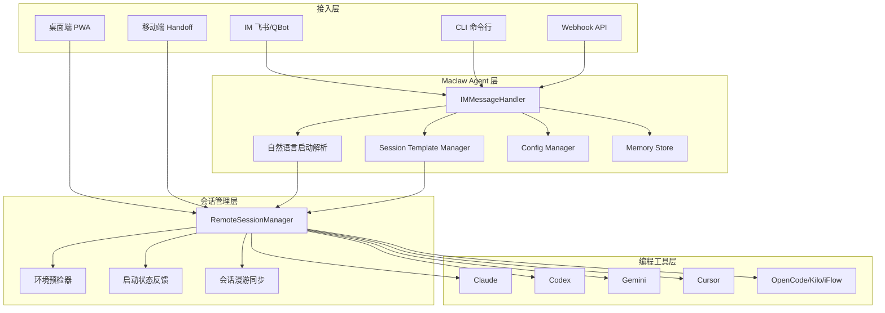
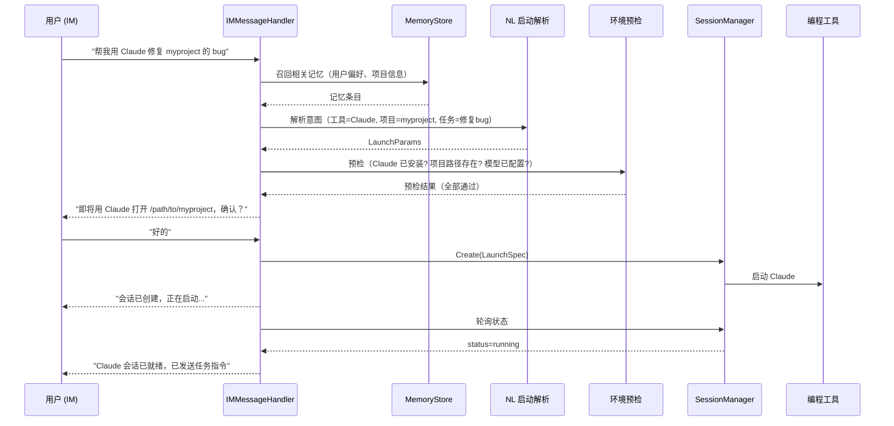

# 设计文档：Maclaw 智能会话启动与接入

## 概述

本设计文档描述 Maclaw 平台在四个方向的能力升级：智能会话启动、新接入方式、自然语言配置管理、持久化长期记忆系统。设计基于现有 Go 代码库（Wails 桌面端 + Hub 后端），在不破坏现有架构的前提下进行增量扩展。

### 设计目标

1. **智能会话启动**：让 IM 端会话启动从"手动指定参数"升级为"自动推断 + 确认"模式，支持模板快捷启动和自然语言启动
2. **新接入方式**：在现有桌面/IM/移动端基础上，增加 CLI 命令行、Webhook 触发和多设备漫游能力
3. **自然语言配置**：通过 Agent 工具实现 AppConfig 的读写，支持 IM 端自然语言查询和修改配置
4. **长期记忆系统**：构建持久化 Memory_Store，替代当前纯内存的 conversationMemory 短期记忆，实现跨会话记忆召回

### 设计原则

- **增量扩展**：所有新组件通过接口与现有代码集成，不修改现有公共 API 签名
- **关注点分离**：每个子系统独立文件，通过 `App` 结构体组合
- **Go 惯用法**：使用 `sync.RWMutex` 保护并发状态，`interface` 实现多态，`context.Context` 控制超时

## 架构

### 高层架构



### 数据流 — IM 自然语言启动



## 组件与接口

### 1. 智能会话启动子系统

#### 1.1 项目上下文推断 (`session_context_resolver.go`)

```go
// SessionContextResolver 自动推断会话启动参数
type SessionContextResolver struct {
    app *App
}

// ResolveProject 按优先级推断项目路径
// (a) 当前桌面端打开的项目 → (b) 最近使用的项目 → (c) 默认项目
func (r *SessionContextResolver) ResolveProject() (string, string)
// 返回 (projectPath, reason)

// ResolveTool 根据项目特征和任务描述推荐工具
func (r *SessionContextResolver) ResolveTool(projectPath, taskDescription string) (string, string)
// 返回 (toolName, reason)
```

#### 1.2 会话模板管理 (`session_template.go`)

```go
// SessionTemplate 会话模板
type SessionTemplate struct {
    Name       string            `json:"name"`
    Tool       string            `json:"tool"`
    ProjectPath string           `json:"project_path"`
    ModelConfig string           `json:"model_config"` // 模型名称
    YoloMode   bool              `json:"yolo_mode"`
    EnvVars    map[string]string `json:"env_vars,omitempty"`
    CreatedAt  string            `json:"created_at"`
}

// SessionTemplateManager 管理会话模板的 CRUD
type SessionTemplateManager struct {
    mu        sync.RWMutex
    templates []SessionTemplate
    path      string // 持久化路径 ~/.maclaw/templates.json
}

// Create 创建模板
func (m *SessionTemplateManager) Create(tpl SessionTemplate) error

// Get 按名称获取模板
func (m *SessionTemplateManager) Get(name string) (*SessionTemplate, error)

// List 列出所有模板
func (m *SessionTemplateManager) List() []SessionTemplate

// Delete 删除模板
func (m *SessionTemplateManager) Delete(name string) error
```

#### 1.3 启动状态反馈 (`session_startup_feedback.go`)

```go
// SessionStartupFeedback 会话启动进度反馈
type SessionStartupFeedback struct {
    manager  *RemoteSessionManager
    callback ProgressCallback
}

// WatchStartup 监控会话启动进度，每 3 秒推送状态更新
// 60 秒超时后发送警告
func (f *SessionStartupFeedback) WatchStartup(sessionID string, callback ProgressCallback)
```

#### 1.4 环境预检 (`session_precheck.go`)

```go
// PrecheckResult 预检结果
type PrecheckResult struct {
    ToolReady    bool   `json:"tool_ready"`
    ProjectReady bool   `json:"project_ready"`
    ModelReady   bool   `json:"model_ready"`
    ToolHint     string `json:"tool_hint,omitempty"`     // 安装指引
    ModelHint    string `json:"model_hint,omitempty"`    // 配置提示
    AllPassed    bool   `json:"all_passed"`
}

// SessionPrecheck 启动前环境预检
type SessionPrecheck struct {
    app *App
}

// Check 执行预检，3 秒超时
func (p *SessionPrecheck) Check(toolName, projectPath string) PrecheckResult
```

### 2. 新接入方式子系统

#### 2.1 CLI 客户端 (`cmd/maclaw-cli/main.go`)

独立的 Go 二进制，通过 Hub WebSocket API 与桌面端通信。

```go
// CLI 子命令结构
// maclaw-cli session list
// maclaw-cli session start --tool claude --project /path
// maclaw-cli session attach <session-id>
// maclaw-cli session kill <session-id>

type CLIClient struct {
    hubURL   string
    token    string
    wsConn   *websocket.Conn
}

func (c *CLIClient) Connect() error
func (c *CLIClient) ListSessions() ([]RemoteSessionView, error)
func (c *CLIClient) StartSession(tool, project, template string) (*RemoteSessionView, error)
func (c *CLIClient) AttachSession(sessionID string) error // 进入交互模式
func (c *CLIClient) KillSession(sessionID string) error
```

#### 2.2 Webhook 端点 (`hub/internal/httpapi/webhook_session_handlers.go`)

在 Hub 后端添加 Webhook API。

```go
// WebhookSessionRequest Webhook 触发请求
type WebhookSessionRequest struct {
    Tool        string `json:"tool"`
    ProjectPath string `json:"project_path"`
    Prompt      string `json:"prompt"`
    CallbackURL string `json:"callback_url"`
}

// WebhookSessionResponse Webhook 响应
type WebhookSessionResponse struct {
    SessionID string `json:"session_id"`
    Status    string `json:"status"`
}

// POST /api/webhook/session — 创建会话并发送初始指令
// Authorization: Bearer <token>
func HandleWebhookSession(w http.ResponseWriter, r *http.Request)

// WebhookCallbackPayload 回调负载
type WebhookCallbackPayload struct {
    SessionID string `json:"session_id"`
    Status    string `json:"status"`
    Summary   string `json:"summary"`
}
```

#### 2.3 会话漫游同步

扩展现有 `RemoteHubClient`：

```go
// 在 RemoteHubClient 中添加：

// SyncSessionMetadata 将活跃会话元数据同步到 Hub
func (c *RemoteHubClient) SyncSessionMetadata()

// RelaySessionIO 为远程设备建立会话 IO 中继
// 输出广播到所有连接设备，输入接受最近发送者
func (c *RemoteHubClient) RelaySessionIO(sessionID string, deviceConn *websocket.Conn)
```

### 3. 自然语言配置管理子系统

#### 3.1 Config Manager (`config_manager.go`)

```go
// ConfigSection 配置区域
type ConfigSection struct {
    Name        string            `json:"name"`
    Description string            `json:"description"`
    Keys        []ConfigKeySchema `json:"keys"`
}

// ConfigKeySchema 配置项 schema
type ConfigKeySchema struct {
    Key          string   `json:"key"`
    Description  string   `json:"description"`
    Type         string   `json:"type"` // string/bool/int/enum/list
    Default      string   `json:"default,omitempty"`
    ValidValues  []string `json:"valid_values,omitempty"` // enum 类型
}

// ConfigManager 配置管理器
type ConfigManager struct {
    app    *App
    schema []ConfigSection
}

// NewConfigManager 创建配置管理器并初始化 schema
func NewConfigManager(app *App) *ConfigManager

// GetConfig 读取指定 section 的配置（敏感字段脱敏）
func (m *ConfigManager) GetConfig(section string) (string, error)

// UpdateConfig 修改配置项
func (m *ConfigManager) UpdateConfig(section, key, value string) (oldValue string, err error)

// BatchUpdate 批量修改（原子性）
func (m *ConfigManager) BatchUpdate(changes []ConfigChange) error

// GetSchema 返回所有配置 schema
func (m *ConfigManager) GetSchema() []ConfigSection

// ExportConfig 导出配置（脱敏）
func (m *ConfigManager) ExportConfig() (string, error)

// ImportConfig 导入配置（保留本机字段）
func (m *ConfigManager) ImportConfig(jsonData string) (*ImportReport, error)

// ConfigChange 配置变更
type ConfigChange struct {
    Section string `json:"section"`
    Key     string `json:"key"`
    Value   string `json:"value"`
}

// ImportReport 导入报告
type ImportReport struct {
    Applied  int      `json:"applied"`
    Skipped  int      `json:"skipped"`
    Warnings []string `json:"warnings"`
}
```

#### 3.2 敏感字段脱敏

```go
// maskSensitive 对 API Key/Token 进行脱敏
// "sk-abc123xyz789" → "sk-a***9789"
func maskSensitive(value string) string
```

### 4. 长期记忆子系统

#### 4.1 Memory Store (`memory_store.go`)

```go
// MemoryCategory 记忆类别
type MemoryCategory string

const (
    MemCategoryUserFact           MemoryCategory = "user_fact"
    MemCategoryPreference         MemoryCategory = "preference"
    MemCategoryProjectKnowledge   MemoryCategory = "project_knowledge"
    MemCategoryInstruction        MemoryCategory = "instruction"
    MemCategoryConversationSummary MemoryCategory = "conversation_summary"
)

// MemoryEntry 记忆条目
type MemoryEntry struct {
    ID          string         `json:"id"`
    Content     string         `json:"content"`
    Category    MemoryCategory `json:"category"`
    Tags        []string       `json:"tags"`
    CreatedAt   time.Time      `json:"created_at"`
    UpdatedAt   time.Time      `json:"updated_at"`
    AccessCount int            `json:"access_count"`
}

// MemoryStore 长期记忆存储
type MemoryStore struct {
    mu       sync.RWMutex
    entries  []MemoryEntry
    path     string        // ~/.maclaw/memories.json
    dirty    bool
    saveCh   chan struct{} // debounce 信号
    stopCh   chan struct{}
    maxItems int           // 500
}

// NewMemoryStore 创建并加载持久化记忆
func NewMemoryStore(path string) (*MemoryStore, error)

// Save 保存记忆条目（去重：语义相同则更新）
func (s *MemoryStore) Save(entry MemoryEntry) error

// Search 按 category 和关键词检索
func (s *MemoryStore) Search(category MemoryCategory, keyword string, limit int) []MemoryEntry

// Recall 为系统提示词召回相关记忆
// 始终包含所有 user_fact，其余按相关性排序
// 最多 20 条，总 token ≤ 2000
func (s *MemoryStore) Recall(userMessage string) []MemoryEntry

// Delete 删除指定记忆
func (s *MemoryStore) Delete(id string) error

// List 列出记忆（支持过滤）
func (s *MemoryStore) List(category MemoryCategory, keyword string) []MemoryEntry

// TouchAccess 更新访问计数
func (s *MemoryStore) TouchAccess(ids []string)
```

#### 4.2 记忆持久化机制

```go
// persistLoop 后台持久化循环
// 收到 saveCh 信号后等待 5 秒（debounce），然后写入磁盘
func (s *MemoryStore) persistLoop()

// load 从磁盘加载记忆
func (s *MemoryStore) load() error

// flush 写入磁盘
func (s *MemoryStore) flush() error

// evictLRU 当条目数超过 maxItems 时，淘汰 access_count 最低且最旧的条目
func (s *MemoryStore) evictLRU()
```

#### 4.3 对话摘要归档 (`conversation_archiver.go`)

```go
// ConversationArchiver 对话摘要归档器
type ConversationArchiver struct {
    memoryStore *MemoryStore
    llmConfig   MaclawLLMConfig
    client      *http.Client
}

// Archive 在对话过期前提取关键信息存入长期记忆
func (a *ConversationArchiver) Archive(userID string, entries []conversationEntry) error
```

### 5. IMMessageHandler 工具扩展

在现有 `buildToolDefinitions()` 和 `executeTool()` 中添加新工具：

```go
// 新增工具定义
// --- 会话管理增强 ---
// "create_template"  — 创建会话模板
// "list_templates"   — 列出会话模板
// "launch_template"  — 使用模板启动会话

// --- 配置管理 ---
// "get_config"        — 查询配置
// "update_config"     — 修改配置
// "batch_update_config" — 批量修改配置
// "list_config_schema" — 列出配置 schema
// "export_config"     — 导出配置
// "import_config"     — 导入配置

// --- 记忆管理 ---
// "save_memory"       — 保存记忆
// "list_memories"     — 列出/搜索记忆
// "delete_memory"     — 删除记忆
```

## 数据模型

### SessionTemplate

```go
type SessionTemplate struct {
    Name        string            `json:"name"`
    Tool        string            `json:"tool"`
    ProjectPath string            `json:"project_path"`
    ModelConfig string            `json:"model_config"`
    YoloMode    bool              `json:"yolo_mode"`
    EnvVars     map[string]string `json:"env_vars,omitempty"`
    CreatedAt   string            `json:"created_at"`
}
```

### MemoryEntry

```go
type MemoryEntry struct {
    ID          string         `json:"id"`
    Content     string         `json:"content"`
    Category    MemoryCategory `json:"category"`
    Tags        []string       `json:"tags"`
    CreatedAt   time.Time      `json:"created_at"`
    UpdatedAt   time.Time      `json:"updated_at"`
    AccessCount int            `json:"access_count"`
}
```

### ConfigSection / ConfigKeySchema

```go
type ConfigSection struct {
    Name        string            `json:"name"`
    Description string            `json:"description"`
    Keys        []ConfigKeySchema `json:"keys"`
}

type ConfigKeySchema struct {
    Key         string   `json:"key"`
    Description string   `json:"description"`
    Type        string   `json:"type"`
    Default     string   `json:"default,omitempty"`
    ValidValues []string `json:"valid_values,omitempty"`
}
```

### PrecheckResult

```go
type PrecheckResult struct {
    ToolReady    bool   `json:"tool_ready"`
    ProjectReady bool   `json:"project_ready"`
    ModelReady   bool   `json:"model_ready"`
    ToolHint     string `json:"tool_hint,omitempty"`
    ModelHint    string `json:"model_hint,omitempty"`
    AllPassed    bool   `json:"all_passed"`
}
```
