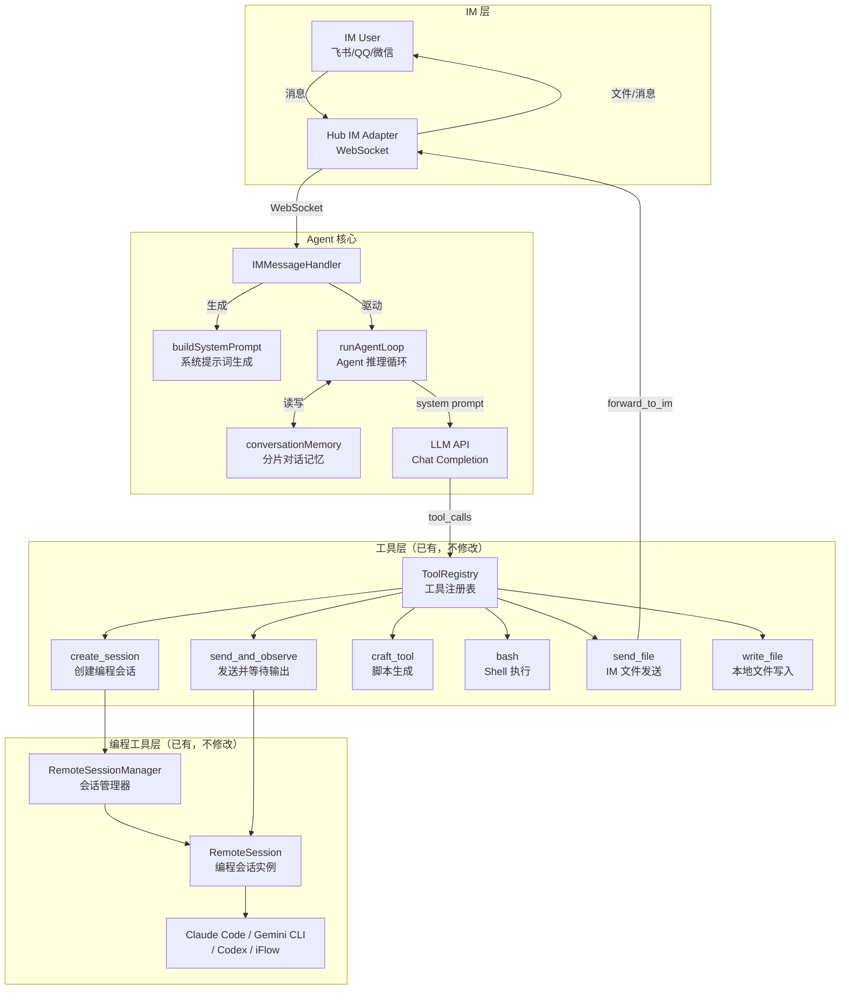
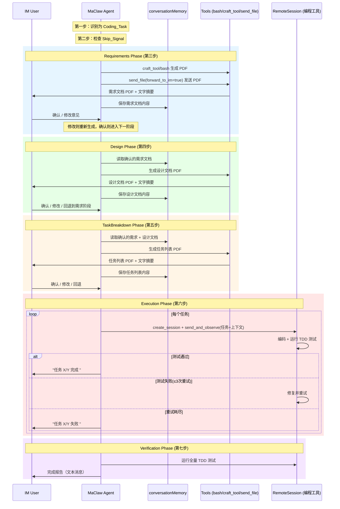
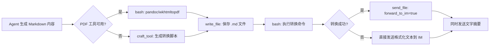

# Design Document: MaClaw Spec-Driven Workflow

## Overview

将 MaClaw Agent 的编程任务处理流程从"需求确认 → 执行 → RFO"三阶段模式，升级为五阶段 Spec 驱动编程工作流：

1. **Requirements Phase** — 生成需求文档 PDF，IM 发送给用户确认
2. **Design Phase** — 基于确认的需求生成技术设计文档 PDF，用户确认
3. **TaskBreakdown Phase** — 基于设计生成任务列表（含 TDD 测试用例）PDF，用户确认
4. **Execution Phase** — 按任务列表逐个执行，TDD 验证，自动进行
5. **Verification Phase** — 全量回归测试 + 完成报告，自动进行

### 核心设计决策

**纯提示词驱动方案**：通过修改 `buildSystemPrompt()` 输出的系统提示词文本实现，不新增 Go 状态机、不新增工具、不新增数据结构。理由：

- Agent 行为完全由 System Prompt + Tool Set 驱动，LLM 指令遵循能力已在 coding-interaction-workflow 中验证
- 五阶段工作流本质是对话策略变更，每个阶段的文档生成/发送都可通过现有工具组合完成
- `conversationMemory` 已能保存各阶段文档内容和用户反馈，无需额外存储
- 修改范围限定在单个方法的单个文本块，风险可控

**替换而非扩展**：新工作流替换 coding-interaction-workflow 中的 Confirmation Phase 和 RFO Phase。Requirements Phase 是 Confirmation Phase 的升级版（文本确认 → PDF 文档确认），RFO Phase 整合到 Verification Phase。

### 技术栈

| 层面 | 技术 |
|------|------|
| 语言 | Go 1.21+ |
| 核心文件 | `gui/im_message_handler.go` |
| 测试框架 | `testing/quick`（Property-Based Testing） |
| 测试文件 | `gui/im_message_handler_spec_workflow_test.go` |
| PDF 生成 | pandoc / wkhtmltopdf（系统工具）或 craft_tool 生成脚本 |
| 文件发送 | `send_file` 工具（`forward_to_im=true`） |
| 对话记忆 | `conversationMemory`（分片并发安全，FNV-1a 哈希） |


## Architecture

### 系统组件关系



### 五阶段工作流数据流



### 与现有 coding-interaction-workflow 的映射

| 现有阶段 | 新工作流 | 变更 |
|----------|---------|------|
| 第一步：识别任务类型 | 第一步（不变） | 保留 Coding_Task vs 非编程任务区分 |
| 第二步：检查跳过信号 | 第二步（扩展） | Skip_Signal 跳过三个确认阶段 |
| 第三步：需求确认 | 第三步 Requirements Phase | 文本确认 → PDF 文档确认 |
| — | 第四步 Design Phase | 新增 |
| — | 第五步 TaskBreakdown Phase | 新增 |
| 第四步：执行编程任务 | 第六步 Execution Phase | 增加 TDD 验证 + 进度汇报 |
| 第五步：RFO Phase | 第七步 Verification Phase | 可选 RFO → 自动全量验收 |
| 第六步：自动续接 | 第八步（不变） | 保留 Auto-Resume 逻辑 |


## Components and Interfaces

### 1. buildSystemPrompt() — 唯一修改点

**文件**: `gui/im_message_handler.go`
**方法签名**: `func (h *IMMessageHandler) buildSystemPrompt() string`

该方法使用 `strings.Builder` 拼接系统提示词。修改范围限定在 `isProMode` 分支内的 `## 编程任务工作流（极其重要）` 文本块。

#### 修改边界

```
起始位置: "### 第一步：识别任务类型"
结束位置: "### 第八步：自动续接（Auto-Resume）" 之前（不含第八步）
```

原文本约 80 行（五步工作流），替换为约 120 行（八步工作流）。第八步（原第六步）仅重编号，内容不变。

#### 输入依赖

`buildSystemPrompt()` 从以下来源获取动态数据（均不受本次修改影响）：

| 数据源 | 用途 | 访问方式 |
|--------|------|----------|
| `h.app.LoadConfig()` | 角色名、角色描述、Pro/Lite 模式 | `cfg.MaclawRoleName`, `cfg.UIMode` |
| `h.memoryStore` | 自我认知记忆 | `SelfIdentitySummary(600)` |
| `h.manager.List()` | 活跃会话列表 | 遍历 `RemoteSession` |
| `h.app.mcpRegistry` | MCP Server 列表 | `ListServers()` |
| `h.app.skillExecutor` | Skill 列表 | `List()` |
| `h.registry` | 动态工具统计 | `ListAvailable()`, `ListByCategory()` |
| `h.firewall` | 安全防火墙状态 | 非 nil 检查 |
| `h.bgManager` | 后台任务列表 | `List()` |

#### 输出结构

`buildSystemPrompt()` 返回的完整提示词结构（标注修改区域）：

```
身份定义（角色名、角色描述）
## 核心原则
## 编程任务工作流（极其重要）     ← 【修改区域开始】
  ### 第一步：识别任务类型              ← 保留不变
  ### 第二步：检查跳过信号              ← 扩展（三阶段跳过）
  ### 第三步：需求确认 Requirements Phase  ← 新增（替换原第三步）
  ### 第四步：技术设计 Design Phase        ← 新增
  ### 第五步：任务分解 TaskBreakdown Phase ← 新增
  ### 第六步：任务执行 Execution Phase     ← 替换原第四步
  ### 第七步：完成验收 Verification Phase  ← 替换原第五步
  ### 第八步：自动续接 Auto-Resume         ← 原第六步重编号
                                          ← 【修改区域结束】
## 执行验证原则                     ← 保留不变
## 会话失败止损原则                  ← 保留不变
## 工具使用要点                         ← 保留不变
## 当前设备状态                         ← 保留不变（动态生成）
## 当前会话列表                         ← 保留不变（动态生成）
## 已注册 MCP Server                    ← 保留不变（动态生成）
## 后台任务                             ← 保留不变（动态生成）
## 已注册 Skill                         ← 保留不变（动态生成）
## 动态工具                             ← 保留不变（动态生成）
## 安全防火墙                           ← 保留不变（动态生成）
## 高级能力                             ← 保留不变
## 对话管理                             ← 保留不变
## 用户记忆                             ← 保留不变（动态生成）
```

### 2. 各阶段使用的工具链

Agent 在各阶段通过 `ToolRegistry` 调用已注册的 builtin 工具，不新增工具。

#### PDF 生成与发送流程



#### 各阶段工具调用矩阵

| 阶段 | write_file | bash | craft_tool | send_file | create_session | send_and_observe |
|------|:---:|:---:|:---:|:---:|:---:|:---:|
| Requirements Phase | | | | | | |
| Design Phase | | | | | | |
| TaskBreakdown Phase | | | | | | |
| Execution Phase | | | | | | |
| Verification Phase | | | | | | |

### 3. 阶段间上下文传递机制

所有阶段文档通过 `conversationMemory` 自然传递。Agent 在每个阶段生成的文档内容作为 `assistant` 角色的对话条目保存，后续阶段可直接引用。

| 阶段 | 输入上下文（从 memory 读取） | 输出（写入 memory） |
|------|---------------------------|-------------------|
| Requirements Phase | 用户原始需求消息 | 需求文档内容 + 用户确认 |
| Design Phase | 确认的需求文档 | 设计文档内容 + 用户确认 |
| TaskBreakdown Phase | 确认的需求 + 设计文档 | 任务列表 + TDD 测试用例 + 用户确认 |
| Execution Phase | 确认的需求 + 设计 + 任务列表 | 每个任务的执行结果和测试结果 |
| Verification Phase | 所有任务执行结果 | 完成报告 |

上下文传递不需要额外代码：`conversationMemory` 的 `entries []conversationEntry` 按时间顺序保存所有对话，`runAgentLoop` 每次调用 LLM 时会将完整对话历史作为 messages 传入。`trimConversation` 在超过 `maxConversationTurns`（40 轮）或 token 限制时自动裁剪旧消息。

### 4. 阶段回退机制

用户在 Design Phase 或 TaskBreakdown Phase 中可请求回退。Agent 通过语义理解识别回退请求：

- 回退触发词：`"需求文档需要改一下"`, `"回到需求阶段"`, `"设计要改"`, `"回到设计阶段"`
- 回退行为：返回目标阶段，重新生成文档，所有后续阶段文档需重新生成
- 回退通知：Agent 告知用户 `"已回到需求阶段，后续的设计文档和任务列表将重新生成"`

回退不需要代码支持——Agent 在对话中识别回退意图后，按提示词指令重新执行对应阶段即可。

### 5. Skip_Signal 处理

Skip_Signal 的作用范围从原来的跳过 Confirmation Phase 扩展为跳过三个确认阶段。

| 信号类型 | 模式 |
|---------|------|
| 中文 | 直接做、不用问了、按你的想法来、直接开始、不用确认、马上做、赶紧做 |
| English | just do it、skip confirmation、go ahead、do it now |
| 阶段中途 | 任何确认阶段中收到跳过信号，跳过剩余确认阶段 |

跳过时 Agent 仍在内部生成需求理解、设计方案和任务分解（作为 Execution Phase 的上下文），但不生成 PDF、不等待用户确认。


## Data Models

### 现有数据结构（不修改，仅使用）

#### IMMessageHandler（核心 Handler）

```go
// gui/im_message_handler.go
type IMMessageHandler struct {
    app        *App                    // 应用实例，提供 LoadConfig()、mcpRegistry、skillExecutor
    manager    *RemoteSessionManager   // 编程会话管理器，提供 List()
    memory     *conversationMemory     // 对话记忆（分片并发安全）
    registry   *ToolRegistry           // 工具注册表
    firewall   *SecurityFirewall       // 安全防火墙
    memoryStore *MemoryStore           // 长期记忆
    bgManager  *BackgroundLoopManager  // 后台任务管理器
    // ... 其他字段（与本功能无关）
}
```

本功能仅修改 `buildSystemPrompt()` 方法的返回字符串，不读写 `IMMessageHandler` 的任何字段。

#### conversationMemory（对话记忆）

```go
// gui/im_message_handler.go
type conversationMemory struct {
    shards   [16]*memoryShard    // 16 个分片，FNV-1a 哈希分配
    stopCh   chan struct{}       // 停止信号
    archiver *ConversationArchiver
}

type memoryShard struct {
    mu       sync.RWMutex
    sessions map[string]*conversationSession  // userID → session
}

type conversationSession struct {
    entries    []conversationEntry  // 按时间顺序的对话条目
    lastAccess time.Time
}

type conversationEntry struct {
    Role             string      `json:"role"`              // "system" | "user" | "assistant" | "tool"
    Content          interface{} `json:"content"`           // 消息内容（文本或结构化）
    ToolCalls        interface{} `json:"tool_calls,omitempty"`
    ToolCallID       string      `json:"tool_call_id,omitempty"`
}
```

五阶段工作流的所有阶段文档内容通过 `conversationEntry` 自然保存在对话历史中：
- Requirements Phase 的需求文档 → `assistant` 角色的 entry
- 用户确认/修改 → `user` 角色的 entry
- Design Phase 的设计文档 → `assistant` 角色的 entry
- 以此类推

内存管理：`evictionLoop` 定期清理超过 `memoryTTL` 的过期会话，`trimConversation` 在 token 超限时裁剪旧消息。

#### RemoteSession（编程会话）

```go
// gui/remote_types.go
type RemoteSession struct {
    mu        sync.RWMutex
    ID        string
    Tool      string           // claude, gemini, codex, etc.
    Status    SessionStatus    // starting | running | busy | waiting_input | error | exited
    ExitCode  *int
    Summary   SessionSummary
    ResumeContext *SessionResumeContext  // 续接上下文
    // ...
}

type SessionStatus string
const (
    SessionStarting     SessionStatus = "starting"
    SessionRunning      SessionStatus = "running"
    SessionBusy         SessionStatus = "busy"
    SessionWaitingInput SessionStatus = "waiting_input"
    SessionError        SessionStatus = "error"
    SessionExited       SessionStatus = "exited"
)

type SessionSummary struct {
    Status          string   `json:"status"`
    CurrentTask     string   `json:"current_task"`
    ProgressSummary string   `json:"progress_summary"`
    LastResult      string   `json:"last_result"`
    ImportantFiles  []string `json:"important_files"`
    // ...
}
```

Execution Phase 中 Agent 通过 `SessionStatus` 判断任务完成情况：
- `waiting_input` → 编程工具等待下一条指令（任务可能完成）
- `busy` → 编程工具正在工作（不可中断）
- `exited` + `ExitCode` → 会话结束，根据退出码判断是否需要续接

#### 工具注册表

```go
// gui/tool_registry.go (概要)
type ToolRegistry struct { /* ... */ }

// Execution Phase 使用的关键工具：
// - create_session(tool, project_path, ...) → 创建编程会话
// - send_and_observe(session_id, text, timeout_seconds) → 发送指令并等待输出
// - control_session(session_id, action) → 中断/终止会话

// 文档生成阶段使用的关键工具：
// - write_file(path, content) → 写入 Markdown 文件
// - bash(command, working_dir, timeout) → 执行 pandoc/wkhtmltopdf
// - craft_tool(task, language, ...) → 生成 PDF 转换脚本
// - send_file(path, file_name) → 发送 PDF 到 IM（forward_to_im=true）
```

### Token 预算影响

| 指标 | 修改前 | 修改后 |
|------|--------|--------|
| 工作流文本行数 | ~80 行 | ~120 行 |
| 估计 token 增量 | — | +400 tokens |
| 系统提示词总量 | ~2500-3500 tokens | ~2900-3900 tokens |

`trimConversation` 会根据总 token 预算自动调整对话历史长度，增加的 400 tokens 在合理范围内。


## Correctness Properties

由于核心实现是修改 `buildSystemPrompt()` 的输出文本，correctness properties 验证系统提示词的结构完整性和内容正确性。这些属性确保提示词变更不会遗漏关键工作流指令。

所有属性使用 `testing/quick` 包验证，对随机生成的 `randomAppConfig`（角色名、角色描述等）调用 `buildSystemPrompt()` 并检查输出。

### Property 1: 五阶段顺序完整性

*For any* valid system configuration, `buildSystemPrompt()` output must contain the five phases in strict sequential order: Requirements Phase → Design Phase → TaskBreakdown Phase → Execution Phase → Verification Phase, each appearing exactly once.

**Validates**: Requirements 1.4, 10.1, 10.2

### Property 2: Spec 工作流在 create_session 之前

*For any* valid system configuration, the three confirmation phase instructions (Requirements, Design, TaskBreakdown) must appear before the Execution Phase's `create_session` instructions.

**Validates**: Requirements 1.1

### Property 3: 编程任务与非编程任务的区分

*For any* valid system configuration, the output must contain clear Coding_Task vs non-coding distinction, and explicitly list non-coding categories (信息检索、翻译、文档生成、文件操作、通信、日常助手).

**Validates**: Requirements 1.2, 1.3, 10.4

### Property 4: 三个确认阶段的文档内容要求

*For any* valid system configuration, the output must contain document content requirements for all three confirmation phases:
- Requirements Phase: 需求背景与目标、功能需求列表、非功能需求、约束与假设
- Design Phase: 架构设计、接口设计、数据模型变更、实现方案概述
- TaskBreakdown Phase: 编号任务列表、任务描述和涉及文件、TDD 验收测试用例

**Validates**: Requirements 2.1, 3.1, 4.1

### Property 5: PDF 生成与发送指令

*For any* valid system configuration, the output must contain: (a) PDF generation referencing craft_tool or bash, (b) send_file with forward_to_im=true, (c) descriptive PDF naming, (d) text summary alongside PDF, (e) fallback to formatted text on failure.

**Validates**: Requirements 2.2, 2.5, 3.2, 3.5, 4.2, 4.5, 8.1-8.5

### Property 6: 阶段确认与修订规则

*For any* valid system configuration, the output must contain: (a) wait for user confirmation before next phase, (b) update and regenerate PDF on revision, (c) use revised version as input to subsequent phases.

**Validates**: Requirements 2.3, 2.4, 3.3, 3.4, 4.3, 4.4, 9.5

### Property 7: Skip_Signal 双语模式与三阶段跳过

*For any* valid system configuration, the output must contain: (a) Chinese Skip_Signal patterns (直接做, 不用问了, etc.), (b) English patterns (just do it, go ahead, etc.), (c) skip all three confirmation phases, (d) still perform internal planning when skipping, (e) mid-phase skip support.

**Validates**: Requirements 7.1-7.4

### Property 8: Execution Phase TDD 验证与重试

*For any* valid system configuration, the output must contain: (a) run TDD test after each task, (b) max 3 retry attempts, (c) skip to next task after exhaustion, (d) progress format ("任务 X/Y 完成 " / "任务 X/Y 失败 ").

**Validates**: Requirements 5.3-5.6

### Property 9: Verification Phase 完成报告

*For any* valid system configuration, the output must contain: (a) full regression test suite, (b) report components (总任务数/成功失败数, 每个任务结果, 全量测试结果, 失败摘要), (c) success report, (d) failure listing with next steps.

**Validates**: Requirements 6.1-6.6

### Property 10: 阶段间上下文传递

*For any* valid system configuration, the output must contain context passing instructions: requirements → Design Phase, requirements + design → TaskBreakdown Phase, all three → Execution Phase (via send_and_observe).

**Validates**: Requirements 9.1-9.3, 5.2

### Property 11: 阶段回退机制

*For any* valid system configuration, the output must contain: (a) return to previous phase on user request, (b) regenerate all subsequent documents, (c) inform user about rollback.

**Validates**: Requirements 11.1-11.3

### Property 12: 现有工作流规则保留

*For any* valid system configuration, the output must preserve: (a) 会话失败止损原则, (b) 执行验证原则, (c) busy 会话不终止规则, (d) 自动续接 Auto-Resume 规则.

**Validates**: Requirements 10.5


## Error Handling

### 1. PDF 生成失败

| 场景 | 原因 | 处理策略 |
|------|------|----------|
| 系统无 pandoc/wkhtmltopdf | 工具未安装 | Agent 用 craft_tool 生成 Python/Node 脚本转换 |
| craft_tool 脚本也失败 | 依赖缺失 | 回退为格式化文本直接发送到 IM |
| 文件过大 | Markdown 内容过长 | 分段发送或压缩内容 |

提示词中明确指示回退链：`bash(pandoc)` → `craft_tool(脚本)` → 格式化文本。

### 2. LLM 不遵循五阶段流程

| 场景 | 缓解措施 |
|------|----------|
| 跳过确认阶段直接 create_session | 提示词中用 强调标记 + "极其重要"提高优先级 |
| 遗漏某个阶段 | 阶段使用清晰编号（第三步/第四步/...）和结构化格式 |
| 混淆阶段顺序 | 每个阶段开头明确前置条件（"用户确认需求文档后"） |

### 3. 对话记忆溢出

| 场景 | 处理 |
|------|------|
| 多次修订导致对话过长 | `trimConversation` 自动裁剪（maxConversationTurns=40） |
| 五阶段比三步产生更多轮次 | 40 轮限制通常足够，极端情况下旧阶段文档被裁剪但不影响当前阶段 |

### 4. 阶段回退后上下文不一致

| 场景 | 处理 |
|------|------|
| 回退到需求阶段但对话中仍有旧设计文档 | 提示词指示 Agent 使用最新版本，忽略旧版本 |
| 用户在 TaskBreakdown 阶段要求改需求 | Agent 告知"需求已更新，设计和任务列表将重新生成" |

### 5. Execution Phase 会话异常

| 场景 | 处理 |
|------|------|
| 编程工具 token 耗尽（exit_code=0/1） | Auto-Resume：创建新会话续接（最多 10 次） |
| API 错误（exit_code > 1） | 自动重试 1-2 次，仍失败则记录并跳到下一任务 |
| 会话启动失败 | 止损原则：最多重试 1 次，仍失败则告知用户 |

### 6. TDD 测试用例质量问题

| 场景 | 处理 |
|------|------|
| Agent 生成的测试本身有 bug | 3 次重试机制给 Agent 机会修复测试 |
| 测试与实现不匹配 | 失败后跳过，在 Verification Phase 报告中记录 |

### 7. send_file 发送失败

| 场景 | 处理 |
|------|------|
| 网络问题 | 回退为格式化文本发送 |
| 文件过大 | 压缩或分段发送 |
| IM 通道未连接 | 告知用户 IM 转发不可用，文件已保存到本地 |


## Testing Strategy

### 测试文件

`gui/im_message_handler_spec_workflow_test.go`

### 测试基础设施（复用）

复用 `gui/im_message_handler_coding_workflow_test.go` 中的：

```go
// 随机配置生成器
type randomAppConfig struct {
    RoleName string
    RoleDesc string
}

// 构建测试用 Handler 并调用 buildSystemPrompt()
func buildPromptForConfig(cfg randomAppConfig) string

// 100 次迭代配置
func quickConfig() *quick.Config
```

`buildPromptForConfig` 创建一个带有 `RemoteSessionManager` 的 `IMMessageHandler`（确保 `isProMode` 路径被执行），调用 `buildSystemPrompt()` 返回完整提示词文本。

### Property-Based Tests

每个 Correctness Property 对应一个独立的 `TestSpecWorkflowPropertyN_*` 函数，使用 `testing/quick.Check` 运行至少 100 次迭代。

| 测试函数 | Property | 验证要点 |
|----------|----------|----------|
| `TestSpecWorkflowProperty1_PhaseSequentialOrder` | P1 | 五阶段关键词按顺序出现，各出现一次 |
| `TestSpecWorkflowProperty2_SpecBeforeCreateSession` | P2 | 三个确认阶段在 create_session 之前 |
| `TestSpecWorkflowProperty3_CodingVsNonCodingDistinction` | P3 | Coding_Task 区分 + 非编程任务类别列表 |
| `TestSpecWorkflowProperty4_DocumentContentRequirements` | P4 | 三个阶段各自的文档内容关键词 |
| `TestSpecWorkflowProperty5_PDFGenerationAndDelivery` | P5 | PDF 工具链 + send_file + 命名 + 摘要 + 回退 |
| `TestSpecWorkflowProperty6_PhaseConfirmationAndRevision` | P6 | 确认等待 + 修订重生成 + 最新版本传递 |
| `TestSpecWorkflowProperty7_SkipSignalBilingualAndThreePhase` | P7 | 中英文信号 + 三阶段跳过 + 内部规划 |
| `TestSpecWorkflowProperty8_ExecutionTDDAndRetry` | P8 | TDD 测试 + 3 次重试 + 跳过 + 进度格式 |
| `TestSpecWorkflowProperty9_VerificationReport` | P9 | 全量测试 + 报告组件 + 成功/失败报告 |
| `TestSpecWorkflowProperty10_InterPhaseContextPassing` | P10 | 阶段间上下文传递指令 |
| `TestSpecWorkflowProperty11_PhaseRollback` | P11 | 回退 + 重新生成 + 通知用户 |
| `TestSpecWorkflowProperty12_ExistingRulesPreserved` | P12 | 止损 + 验证 + busy 不终止 + Auto-Resume |

### 测试验证方法

每个 property test 的验证逻辑：
1. 生成随机 `randomAppConfig`
2. 调用 `buildPromptForConfig(cfg)` 获取提示词文本
3. 使用 `strings.Contains` / `strings.Index` 检查关键词存在性和顺序
4. 返回 `bool`（true = 属性满足）

示例（Property 1）：

```go
func TestSpecWorkflowProperty1_PhaseSequentialOrder(t *testing.T) {
    f := func(cfg randomAppConfig) bool {
        prompt := buildPromptForConfig(cfg)
        phases := []string{"需求确认", "技术设计", "任务分解", "任务执行", "完成验收"}
        lastIdx := -1
        for _, phase := range phases {
            idx := strings.Index(prompt, phase)
            if idx < 0 { return false }  // 阶段缺失
            if idx <= lastIdx { return false }  // 顺序错误
            lastIdx = idx
        }
        return true
    }
    if err := quick.Check(f, quickConfig()); err != nil {
        t.Errorf("Property 1 failed: %v", err)
    }
}
```

### 回归测试

修改 `buildSystemPrompt()` 后，现有的 `im_message_handler_coding_workflow_test.go` 中的 7 个 property tests 必须全部通过，确保：
- Property 1: 确认阶段在 create_session 之前（适配新的步骤编号）
- Property 2: 需求文档内容组件完整
- Property 3: 编程/非编程任务区分
- Property 4: Skip_Signal 双语模式
- Property 5: Verification Phase 完整性
- Property 6: 任务失败重试机制
- Property 7: 现有工作流规则保留

如果现有测试因步骤编号变更（第三步→第三步、第四步→第六步）而失败，需同步更新测试中的硬编码步骤编号。
