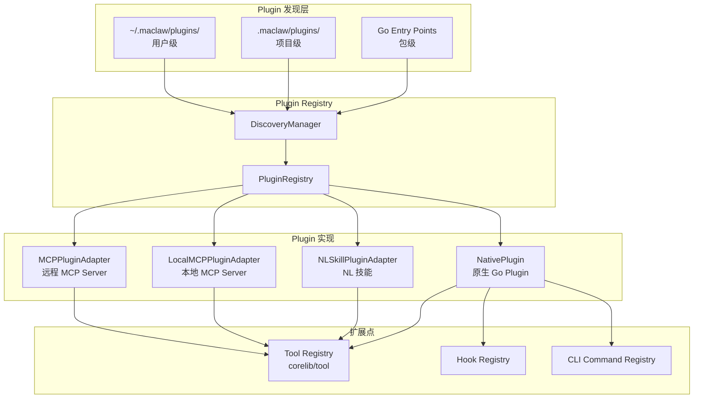
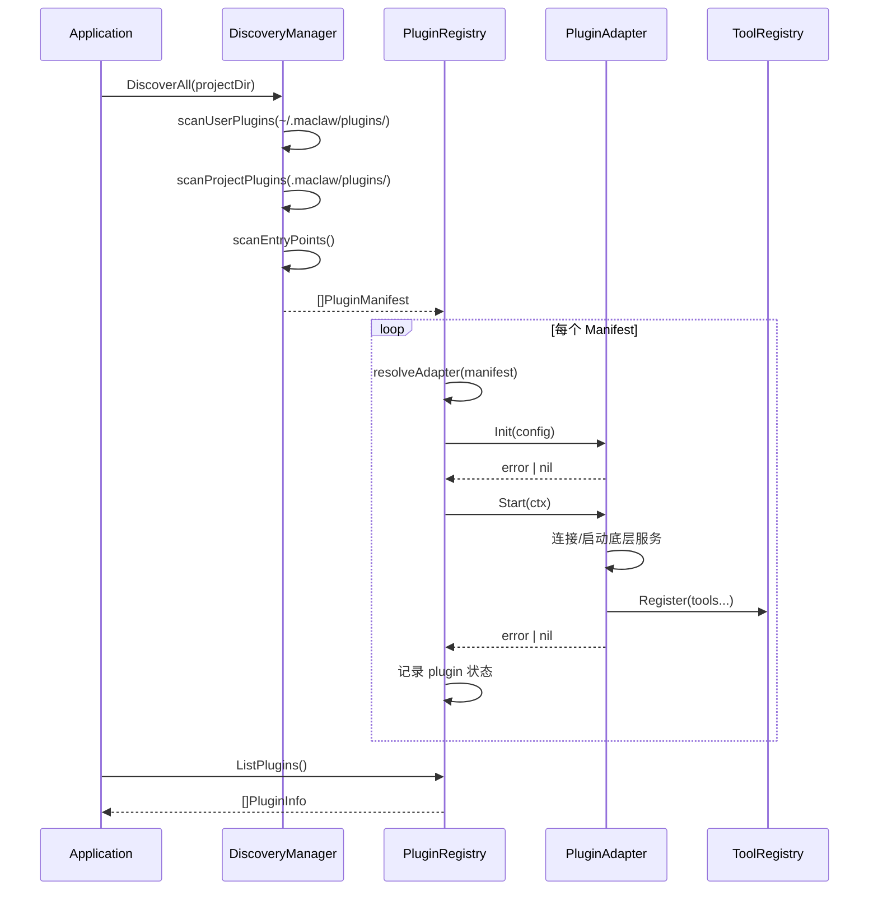
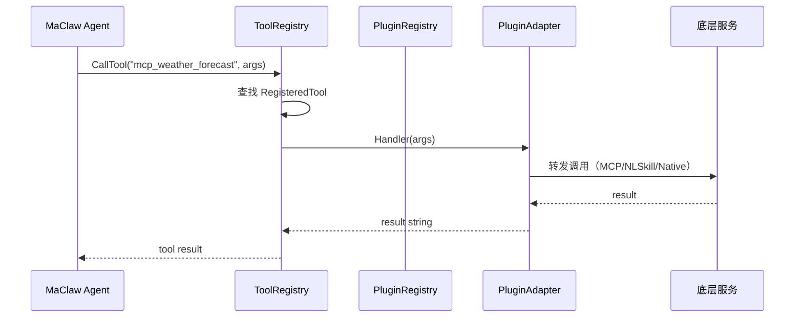

# 设计文档：maclaw-unified-plugin（统一 Plugin 接口抽象层）

## 概述

maclaw 项目目前通过三套独立的扩展机制实现类似 plugin 的功能：MCP Server（远程/本地 stdio 协议工具）、NLSkill（自然语言技能，基于 YAML/Markdown 定义的多步骤自动化）、以及 Tool Registry（内置工具注册表）。这三套机制各自有独立的配置格式、发现路径、生命周期管理和 CLI 命令，导致扩展点管理碎片化。

本设计引入一个统一的 Plugin 接口，将 MCP Server、NLSkill、Local MCP 统一为 plugin 的不同实现类型（PluginType）。参考 Hermes 的三层发现机制，实现用户级（`~/.maclaw/plugins/`）、项目级（`.maclaw/plugins/`）、包级（Go plugin entry points）的 plugin 发现。每个 Plugin 可以注册 tools、hooks 和 CLI commands，通过统一的 PluginRegistry 进行生命周期管理。

本设计的核心原则是**渐进式迁移**：新的 Plugin 接口作为上层抽象，现有的 MCP Server、NLSkill、Tool Registry 代码保持不变，通过 Adapter 模式桥接到统一接口。这确保了零破坏性变更，同时为未来的扩展提供了统一的入口。

## 架构



## 序列图

### Plugin 发现与加载流程



### Tool 调用流程



## 组件和接口

### 组件 1：Plugin 接口

**用途**：定义所有 plugin 必须实现的统一接口

```go
// Plugin 是所有插件必须实现的统一接口。
type Plugin interface {
    // Manifest 返回插件的静态元数据。
    Manifest() PluginManifest

    // Init 初始化插件，传入配置。在 Start 之前调用。
    Init(cfg PluginConfig) error

    // Start 启动插件（建立连接、注册 webhook 等）。
    Start(ctx context.Context) error

    // Stop 优雅停止插件。
    Stop(ctx context.Context) error

    // Tools 返回该插件提供的所有工具定义。
    Tools() []ToolDefinition

    // Health 返回插件当前健康状态。
    Health() HealthStatus
}

// HookProvider 是可选接口，支持注册 hooks 的插件实现此接口。
type HookProvider interface {
    Hooks() []HookDefinition
}

// CLIProvider 是可选接口，支持注册 CLI 命令的插件实现此接口。
type CLIProvider interface {
    Commands() []CLICommand
}
```

**职责**：
- 提供统一的生命周期管理（Init → Start → Stop）
- 暴露工具定义供 ToolRegistry 注册
- 可选地提供 hooks 和 CLI commands

### 组件 2：PluginManifest

**用途**：描述插件的静态元数据，从 `plugin.yaml` 或代码中获取

```go
// PluginType 标识插件的底层实现类型。
type PluginType string

const (
    PluginTypeMCP      PluginType = "mcp"       // 远程 MCP Server
    PluginTypeLocalMCP PluginType = "local_mcp"  // 本地 stdio MCP Server
    PluginTypeNLSkill  PluginType = "nlskill"    // NL 技能
    PluginTypeNative   PluginType = "native"     // 原生 Go 插件
)

// PluginScope 标识插件的发现来源。
type PluginScope string

const (
    ScopeUser    PluginScope = "user"    // ~/.maclaw/plugins/
    ScopeProject PluginScope = "project" // .maclaw/plugins/
    ScopePackage PluginScope = "package" // Go entry points
    ScopeBuiltin PluginScope = "builtin" // 内置
)

// PluginManifest 描述插件的静态元数据。
type PluginManifest struct {
    Name        string     `yaml:"name" json:"name"`
    Version     string     `yaml:"version" json:"version"`
    Description string     `yaml:"description" json:"description"`
    Type        PluginType `yaml:"type" json:"type"`
    Scope       PluginScope `json:"scope"`
    Author      string     `yaml:"author" json:"author"`
    Tags        []string   `yaml:"tags" json:"tags"`
    Platforms   []string   `yaml:"platforms" json:"platforms"` // 空=全平台
    Dir         string     `json:"dir"`                        // 插件目录绝对路径
}
```

**验证规则**：
- `Name` 必须非空，且在同一 Scope 内唯一
- `Type` 必须是已知的 PluginType
- 同名插件按优先级覆盖：project > user > package

### 组件 3：PluginConfig

**用途**：传递给插件的运行时配置

```go
// PluginConfig 是传递给 Plugin.Init() 的运行时配置。
type PluginConfig struct {
    // DataDir 是插件可以存储持久化数据的目录。
    DataDir string

    // Settings 是从 plugin.yaml 的 settings 字段解析的自定义配置。
    Settings map[string]interface{}

    // Logger 是插件可以使用的日志接口。
    Logger PluginLogger
}

// PluginLogger 是插件使用的日志接口。
type PluginLogger interface {
    Info(msg string, args ...interface{})
    Warn(msg string, args ...interface{})
    Error(msg string, args ...interface{})
}
```

### 组件 4：ToolDefinition 和 HookDefinition

**用途**：插件暴露的工具和 hook 定义

```go
// ToolDefinition 描述插件提供的一个工具。
type ToolDefinition struct {
    Name        string                 `json:"name"`
    Description string                 `json:"description"`
    InputSchema map[string]interface{} `json:"input_schema"`
    Required    []string               `json:"required"`
    Tags        []string               `json:"tags"`
    Handler     func(args map[string]interface{}) (string, error)
}

// HookDefinition 描述插件提供的一个 hook。
type HookDefinition struct {
    Name    string   `json:"name"`
    Event   string   `json:"event"` // "pre_tool_call", "post_tool_call", "on_message", etc.
    Handler func(ctx context.Context, payload interface{}) error
}

// CLICommand 描述插件提供的一个 CLI 子命令。
type CLICommand struct {
    Name        string `json:"name"`
    Description string `json:"description"`
    Run         func(args []string) error
}

// HealthStatus 描述插件的健康状态。
type HealthStatus struct {
    Status  string `json:"status"` // "healthy", "degraded", "unhealthy"
    Message string `json:"message,omitempty"`
}
```

### 组件 5：PluginRegistry

**用途**：管理所有已注册插件的生命周期

```go
// PluginRegistry 管理所有已注册插件的生命周期。
type PluginRegistry struct {
    mu      sync.RWMutex
    plugins map[string]*pluginEntry // name → entry
    toolReg *tool.Registry          // 现有的 tool registry
}

type pluginEntry struct {
    plugin   Plugin
    manifest PluginManifest
    status   string // "registered", "running", "stopped", "error"
    err      error  // 最近一次错误
}
```

**职责**：
- 注册/注销插件
- 管理插件生命周期（Init → Start → Stop）
- 将插件的 Tools 注册到现有的 `tool.Registry`
- 提供插件查询和状态监控

### 组件 6：DiscoveryManager

**用途**：扫描三层目录发现插件

```go
// DiscoveryManager 负责从三层目录发现插件。
type DiscoveryManager struct {
    userDir    string // ~/.maclaw/plugins/
    projectDir string // .maclaw/plugins/ (相对于项目根目录)
    entryPoints []EntryPointProvider
}

// EntryPointProvider 是包级插件的注册接口。
type EntryPointProvider interface {
    Plugins() []Plugin
}
```

**职责**：
- 扫描 `~/.maclaw/plugins/` 下的 `plugin.yaml` 文件
- 扫描 `.maclaw/plugins/` 下的 `plugin.yaml` 文件
- 收集通过 Go entry points 注册的内置插件
- 按优先级去重（project > user > package）

## 数据模型

### plugin.yaml 文件格式

```yaml
name: weather-tools
version: "1.0.0"
description: "天气查询工具集"
type: mcp           # mcp | local_mcp | nlskill | native
author: "user"
tags: ["weather", "api"]
platforms: []        # 空=全平台

# MCP 类型特有配置
mcp:
  endpoint_url: "https://weather-api.example.com/mcp"
  auth_type: "api_key"
  auth_secret: "${WEATHER_API_KEY}"

# Local MCP 类型特有配置
local_mcp:
  command: "npx"
  args: ["-y", "@weather/mcp-server"]
  env:
    API_KEY: "${WEATHER_API_KEY}"

# NLSkill 类型特有配置
nlskill:
  triggers: ["天气", "weather", "forecast"]
  steps:
    - action: bash
      params:
        command: "curl -s 'https://api.weather.com/...'"

# 自定义设置
settings:
  default_city: "Beijing"
  units: "metric"
```

### PluginInfo（查询返回）

```go
// PluginInfo 是面向用户的插件信息视图。
type PluginInfo struct {
    Name        string     `json:"name"`
    Version     string     `json:"version"`
    Description string     `json:"description"`
    Type        PluginType `json:"type"`
    Scope       PluginScope `json:"scope"`
    Status      string     `json:"status"`
    ToolCount   int        `json:"tool_count"`
    HookCount   int        `json:"hook_count"`
    Error       string     `json:"error,omitempty"`
}
```

## 算法伪代码

### 插件发现算法

```go
// DiscoverAll 扫描所有层级的插件目录，返回去重后的 manifest 列表。
// 优先级：project > user > package。同名插件高优先级覆盖低优先级。
func (dm *DiscoveryManager) DiscoverAll(projectDir string) ([]PluginManifest, error)
```

**前置条件：**
- `projectDir` 为空或有效目录路径
- 用户主目录可访问

**后置条件：**
- 返回的 manifest 列表中 Name 唯一
- 高优先级 scope 的同名插件覆盖低优先级

**算法：**

```pascal
ALGORITHM DiscoverAll(projectDir)
INPUT: projectDir 字符串（项目根目录，可为空）
OUTPUT: manifests []PluginManifest

BEGIN
  seen ← 空 map[string]bool
  manifests ← 空列表

  // 第一层：项目级（最高优先级）
  IF projectDir 非空 THEN
    projectPluginDir ← projectDir + "/.maclaw/plugins/"
    projectManifests ← scanDirectory(projectPluginDir, ScopeProject)
    FOR EACH m IN projectManifests DO
      IF NOT seen[m.Name] THEN
        manifests.append(m)
        seen[m.Name] ← true
      END IF
    END FOR
  END IF

  // 第二层：用户级
  userPluginDir ← homeDir + "/.maclaw/plugins/"
  userManifests ← scanDirectory(userPluginDir, ScopeUser)
  FOR EACH m IN userManifests DO
    IF NOT seen[m.Name] THEN
      manifests.append(m)
      seen[m.Name] ← true
    END IF
  END FOR

  // 第三层：包级（Go entry points）
  FOR EACH provider IN dm.entryPoints DO
    FOR EACH plugin IN provider.Plugins() DO
      m ← plugin.Manifest()
      m.Scope ← ScopePackage
      IF NOT seen[m.Name] THEN
        manifests.append(m)
        seen[m.Name] ← true
      END IF
    END FOR
  END FOR

  RETURN manifests
END
```

### 插件加载与启动算法

```go
// LoadAndStart 加载并启动所有发现的插件。
func (pr *PluginRegistry) LoadAndStart(ctx context.Context, manifests []PluginManifest) error
```

**前置条件：**
- manifests 中 Name 唯一
- ctx 未取消

**后置条件：**
- 所有成功启动的插件状态为 "running"
- 失败的插件状态为 "error"，不影响其他插件
- 插件的 tools 已注册到 tool.Registry

**算法：**

```pascal
ALGORITHM LoadAndStart(ctx, manifests)
INPUT: ctx Context, manifests []PluginManifest
OUTPUT: error（仅当全部失败时返回错误）

BEGIN
  FOR EACH manifest IN manifests DO
    // 1. 根据 Type 创建对应的 Adapter
    plugin ← createAdapter(manifest)
    IF plugin = nil THEN
      log.Warn("unknown plugin type: %s", manifest.Type)
      CONTINUE
    END IF

    // 2. 初始化
    config ← buildConfig(manifest)
    err ← plugin.Init(config)
    IF err ≠ nil THEN
      pr.setStatus(manifest.Name, "error", err)
      CONTINUE
    END IF

    // 3. 启动
    err ← plugin.Start(ctx)
    IF err ≠ nil THEN
      pr.setStatus(manifest.Name, "error", err)
      CONTINUE
    END IF

    // 4. 注册 tools 到现有 tool.Registry
    FOR EACH td IN plugin.Tools() DO
      rt ← convertToRegisteredTool(td, manifest)
      pr.toolReg.Register(rt)
    END FOR

    // 5. 注册 hooks（如果支持）
    IF plugin implements HookProvider THEN
      FOR EACH hook IN plugin.(HookProvider).Hooks() DO
        registerHook(hook)
      END FOR
    END IF

    pr.setStatus(manifest.Name, "running", nil)
  END FOR

  RETURN nil
END
```

**循环不变量：**
- 已处理的插件要么状态为 "running"，要么状态为 "error"
- 单个插件的失败不影响后续插件的加载

### Adapter 工厂算法

```pascal
ALGORITHM createAdapter(manifest)
INPUT: manifest PluginManifest
OUTPUT: Plugin 实例

BEGIN
  SWITCH manifest.Type
    CASE "mcp":
      RETURN NewMCPPluginAdapter(manifest)
    CASE "local_mcp":
      RETURN NewLocalMCPPluginAdapter(manifest)
    CASE "nlskill":
      RETURN NewNLSkillPluginAdapter(manifest)
    CASE "native":
      RETURN loadNativePlugin(manifest.Dir)
    DEFAULT:
      RETURN nil
  END SWITCH
END
```

## Key Functions with Formal Specifications

### Function: PluginRegistry.Register

```go
func (pr *PluginRegistry) Register(p Plugin) error
```

**前置条件：**
- `p` 非 nil
- `p.Manifest().Name` 非空

**后置条件：**
- 成功时：插件已注册，状态为 "registered"
- 同名插件已存在时：返回错误
- 不修改输入参数

### Function: PluginRegistry.Unregister

```go
func (pr *PluginRegistry) Unregister(name string) error
```

**前置条件：**
- `name` 非空

**后置条件：**
- 插件存在时：调用 Stop()，从 registry 移除，相关 tools 从 tool.Registry 注销
- 插件不存在时：返回错误

### Function: DiscoveryManager.scanDirectory

```go
func (dm *DiscoveryManager) scanDirectory(dir string, scope PluginScope) []PluginManifest
```

**前置条件：**
- `dir` 为有效目录路径或不存在的路径
- `scope` 为有效的 PluginScope 值

**后置条件：**
- 目录不存在时：返回空列表，不报错
- 目录存在时：返回所有包含有效 `plugin.yaml` 的子目录对应的 manifest
- 无效的 `plugin.yaml` 被跳过并记录日志

### Function: MCPPluginAdapter.Tools

```go
func (a *MCPPluginAdapter) Tools() []ToolDefinition
```

**前置条件：**
- Adapter 已 Init 且已 Start

**后置条件：**
- 返回从 MCP Server 获取的所有工具定义
- 每个 ToolDefinition 的 Handler 封装了对 MCP Server 的 RPC 调用
- 服务不可达时返回空列表

## 示例用法

```go
// 示例 1：应用启动时发现并加载所有插件
func bootstrapPlugins(ctx context.Context, toolReg *tool.Registry, projectDir string) {
    dm := plugin.NewDiscoveryManager()
    registry := plugin.NewPluginRegistry(toolReg)

    manifests, _ := dm.DiscoverAll(projectDir)
    registry.LoadAndStart(ctx, manifests)

    // 查看已加载的插件
    for _, info := range registry.List() {
        log.Printf("plugin: %s type=%s status=%s tools=%d",
            info.Name, info.Type, info.Status, info.ToolCount)
    }
}

// 示例 2：通过 plugin.yaml 定义一个 MCP 插件
// ~/.maclaw/plugins/github-tools/plugin.yaml
// name: github-tools
// type: mcp
// description: "GitHub API 工具集"
// mcp:
//   endpoint_url: "https://github-mcp.example.com"
//   auth_type: bearer
//   auth_secret: "${GITHUB_TOKEN}"

// 示例 3：原生 Go 插件注册
type MyPlugin struct{}

func (p *MyPlugin) Manifest() plugin.PluginManifest {
    return plugin.PluginManifest{
        Name:        "my-custom-tools",
        Version:     "1.0.0",
        Description: "自定义工具集",
        Type:        plugin.PluginTypeNative,
    }
}

func (p *MyPlugin) Init(cfg plugin.PluginConfig) error { return nil }
func (p *MyPlugin) Start(ctx context.Context) error    { return nil }
func (p *MyPlugin) Stop(ctx context.Context) error     { return nil }
func (p *MyPlugin) Health() plugin.HealthStatus {
    return plugin.HealthStatus{Status: "healthy"}
}

func (p *MyPlugin) Tools() []plugin.ToolDefinition {
    return []plugin.ToolDefinition{
        {
            Name:        "my_tool",
            Description: "一个自定义工具",
            Handler: func(args map[string]interface{}) (string, error) {
                return "hello from my plugin", nil
            },
        },
    }
}

// 示例 4：CLI 中管理插件
// maclaw-tui plugin list
// maclaw-tui plugin list --json
// maclaw-tui plugin enable github-tools
// maclaw-tui plugin disable github-tools
// maclaw-tui plugin info github-tools
```

## 正确性属性

1. **名称唯一性**：∀ p1, p2 ∈ PluginRegistry, p1.Name = p2.Name ⟹ p1 = p2
2. **优先级覆盖**：∀ manifest m1(scope=project), m2(scope=user), m1.Name = m2.Name ⟹ registry 中只有 m1
3. **生命周期一致性**：∀ plugin p, p.Status = "running" ⟹ p.Init() 和 p.Start() 均已成功调用
4. **工具注册一致性**：∀ plugin p, p.Status = "running" ⟹ p.Tools() 中的所有工具已注册到 tool.Registry
5. **优雅降级**：∀ plugin p, p.Start() 失败 ⟹ 不影响其他插件的加载和运行
6. **清理保证**：∀ plugin p, Unregister(p.Name) ⟹ p.Stop() 被调用 ∧ p 的 tools 从 tool.Registry 移除

## 错误处理

### 错误场景 1：plugin.yaml 解析失败

**条件**：`plugin.yaml` 格式错误或缺少必填字段
**响应**：跳过该插件，记录 WARN 日志
**恢复**：用户修复 `plugin.yaml` 后重新加载

### 错误场景 2：MCP Server 不可达

**条件**：远程 MCP Server 连接超时或返回错误
**响应**：插件状态设为 "error"，已注册的 tools 标记为 `StatusDegraded`
**恢复**：后台定期健康检查，恢复后自动重新标记为 `StatusAvailable`

### 错误场景 3：同名插件冲突

**条件**：不同 scope 下存在同名插件
**响应**：按优先级（project > user > package）选择高优先级的，低优先级的被忽略
**恢复**：无需恢复，这是设计行为

### 错误场景 4：插件 Stop 超时

**条件**：插件的 Stop() 方法在 10 秒内未返回
**响应**：强制取消 context，记录 ERROR 日志
**恢复**：下次启动时重新初始化

## 测试策略

### 单元测试方法

- PluginManifest 解析：测试各种 `plugin.yaml` 格式（正常、缺字段、错误类型）
- DiscoveryManager：使用临时目录模拟三层目录结构，验证发现和优先级逻辑
- PluginRegistry：测试注册、注销、生命周期状态转换
- Adapter 转换：测试 MCPPluginAdapter、NLSkillPluginAdapter 的 Tools() 输出

### Property-Based 测试方法

**Property Test Library**: `testing/quick` (Go 标准库)

- 属性 1：任意数量的 manifest 经过 DiscoverAll 后，结果中 Name 唯一
- 属性 2：任意顺序注册/注销插件后，registry 状态一致
- 属性 3：任意 plugin.yaml 内容，解析要么成功返回有效 manifest，要么返回错误，不 panic

### 集成测试方法

- 端到端测试：创建临时 plugin 目录，放入 `plugin.yaml`，验证 DiscoverAll → LoadAndStart → tool 可调用
- 与现有 MCP 命令兼容性测试：验证通过 plugin 接口注册的 MCP tools 与直接通过 `mcp add` 注册的行为一致

## 性能考虑

- 插件发现使用目录扫描，启动时一次性执行，不影响运行时性能
- MCP Server 的工具列表在 Start 时缓存，避免每次 Build() 时远程查询
- 插件健康检查使用后台 goroutine，间隔 60 秒，不阻塞主流程
- plugin.yaml 解析使用 `gopkg.in/yaml.v3`，与现有 skill.yaml 解析保持一致

## 安全考虑

- `plugin.yaml` 中的 `auth_secret` 支持 `${ENV_VAR}` 语法，避免明文存储密钥
- 项目级插件（`.maclaw/plugins/`）在首次加载时提示用户确认信任
- 原生 Go 插件仅支持编译时注册（通过 EntryPointProvider），不支持运行时动态加载 `.so` 文件
- 插件的 bash 命令执行受现有安全策略（`corelib/security`）约束

## 依赖

- `gopkg.in/yaml.v3`：解析 `plugin.yaml`（项目已有依赖）
- `corelib/tool`：现有的 Tool Registry，Plugin 的 tools 注册到此处
- `corelib/skill`：现有的 NLSkill 扫描器，NLSkillPluginAdapter 复用其逻辑
- `corelib`：现有的 `MCPServerEntry`、`LocalMCPServerEntry`、`NLSkillEntry` 类型
- `hub/internal/im`：IMPlugin 接口作为参考（但 Plugin 接口独立于 IM 层）
