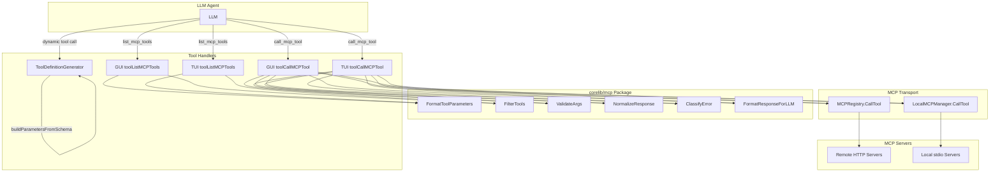

# Design Document: MCP Service Enhancement

## Overview

This feature enhances MaClaw's MCP (Model Context Protocol) service layer to provide rich parameter schema display, local argument validation, standardized response/error envelopes, and tool search/filtering. The core design principle is **shared logic in `corelib/mcp/`** — all validation, formatting, normalization, and classification functions live in a single package consumed by both GUI and TUI handlers, ensuring parity without code duplication.

### Current State

- `toolListMCPTools()` displays only tool name + description, no parameter info
- `buildParametersFromSchema()` copies the schema but doesn't guarantee preservation of `required`, `enum`, `description` fields in all code paths
- `toolCallMCPTool()` passes arguments directly to the MCP server with no local validation
- Error responses are raw strings from `doMCPRoundTrip` — format varies by error source (HTTP, JSON-RPC, MCP protocol)
- TUI's `toolCallMCPTool()` is a stub that returns "暂不支持直接调用"
- No search/filter capability in `list_mcp_tools`

### Target State

- `list_mcp_tools` shows full parameter schemas (name, type, required, enum, description) with search/filter
- `buildParametersFromSchema()` faithfully preserves all InputSchema fields (round-trip property)
- `call_mcp_tool` validates arguments locally before JSON-RPC dispatch, returning actionable errors
- All responses/errors follow a unified `StandardResponse`/`StandardError` envelope
- GUI and TUI share identical behavior via `corelib/mcp/` functions

## Architecture



### Design Decisions

1. **Shared `corelib/mcp/` package**: All new logic (validation, formatting, normalization, classification) goes into `corelib/mcp/` as pure functions with no GUI/TUI dependencies. This guarantees parity and enables independent unit testing.

2. **Fail-open validation**: `ValidateArgs` errors are advisory — if the schema is missing or the validator itself errors, the call proceeds to the MCP server. This prevents the validator from being a single point of failure.

3. **Envelope normalization at the handler level**: `NormalizeResponse` and `ClassifyError` are called in the `toolCallMCPTool` handlers (GUI and TUI), not inside `MCPRegistry.CallTool`. This keeps the transport layer unchanged and avoids breaking other callers (Wails bindings, health checks).

4. **`buildParametersFromSchema` fix is minimal**: The existing function already handles the `type:"object"` case correctly by shallow-copying all keys. The fix ensures the `required` array and nested `enum`/`description` fields survive the copy in all code paths, including the `looksLikePropertiesMap` fallback.

## Components and Interfaces

### 1. `corelib/mcp/validate.go` — Parameter Validation

```go
package mcp

// ValidationError represents a single parameter validation failure.
type ValidationError struct {
    Param    string   // parameter name
    Code     string   // "missing_required", "type_mismatch", "invalid_enum"
    Expected string   // expected type or enum values
    Actual   string   // actual type or value provided
    Message  string   // human-readable error message
}

// ValidateArgs validates tool arguments against the tool's InputSchema.
// Returns nil if validation passes or schema is nil/empty (graceful degradation).
// Returns a slice of ValidationError for each violation found.
// Never panics — internal errors are logged and result in nil return (fail-open).
func ValidateArgs(schema map[string]interface{}, args map[string]interface{}) []ValidationError
```

**Validation checks (in order):**
1. **Required parameters**: Compare `schema["required"]` array against `args` keys. Missing keys produce `missing_required` errors.
2. **Type checking**: For each arg present in `schema["properties"]`, compare the JSON type of the provided value against the declared `"type"` field. Mismatches produce `type_mismatch` errors. Type mapping: Go `string` → JSON `"string"`, `float64` → `"number"` or `"integer"`, `bool` → `"boolean"`, `map[string]interface{}` → `"object"`, `[]interface{}` → `"array"`, `nil` → `"null"`.
3. **Enum validation**: For string parameters with an `"enum"` array, check that the provided value is in the allowed set. Violations produce `invalid_enum` errors.

**Not validated** (intentionally): nested object properties, `pattern`, `minLength`/`maxLength`, `minimum`/`maximum`. These are left to the MCP server — local validation focuses on the most common LLM mistakes (wrong parameter names, wrong types, wrong enum values).

### 2. `corelib/mcp/format.go` — Tool Parameter Formatting

```go
package mcp

// FormatToolParameters formats an InputSchema into a human-readable string
// for display in list_mcp_tools output.
// Returns "(no parameters)" for nil/empty schemas.
func FormatToolParameters(schema map[string]interface{}) string

// FormatToolList formats a list of tools with their parameters, optionally
// filtered by query and/or serverID.
// Each ToolEntry contains ServerName, ServerID, SourceType, HealthStatus,
// and a slice of tools (name, description, schema).
func FormatToolList(entries []ToolEntry, query string, serverID string) string
```

**`FormatToolParameters` output format:**
```
  Parameters:
    - search_query (string, required): Content to be searched
    - content_size (string, optional): Control word count [enum: medium, high]
    - location (string, optional): User region [enum: cn, us]
```

For nested object parameters:
```
    - config (object, required): Configuration settings [nested object]
```

### 3. `corelib/mcp/response.go` — Response Normalization

```go
package mcp

// StandardResponse represents a normalized successful MCP tool response.
type StandardResponse struct {
    Status   string `json:"status"`    // always "ok"
    ServerID string `json:"server_id"`
    ToolName string `json:"tool_name"`
    Result   string `json:"result"`    // original response content
}

// StandardError represents a normalized MCP error response.
type StandardError struct {
    Status       string `json:"status"`        // always "error"
    ServerID     string `json:"server_id"`
    ToolName     string `json:"tool_name"`
    ErrorCode    string `json:"error_code"`    // category from ClassifyError
    ErrorMessage string `json:"error_message"` // human-readable description
}

// NormalizeResponse wraps a raw MCP response string into a StandardResponse.
// It detects MCP protocol errors (result.isError=true) and converts them
// to StandardError.
func NormalizeResponse(serverID, toolName, rawResponse string) (*StandardResponse, *StandardError)

// FormatForLLM formats a StandardResponse or StandardError as a human-readable
// string suitable for returning to the LLM.
func FormatForLLM(resp *StandardResponse, err *StandardError) string
```

### 4. `corelib/mcp/classify.go` — Error Classification

```go
package mcp

// ErrorCode constants for the Standard_Error error_code field.
const (
    ErrValidation  = "validation_error"  // local schema validation failure
    ErrConnection  = "connection_error"  // network/timeout
    ErrAuth        = "auth_error"        // 401/403
    ErrRateLimit   = "rate_limit"        // 429
    ErrServer      = "server_error"      // 5xx
    ErrRPC         = "rpc_error"         // JSON-RPC error response
    ErrTool        = "tool_error"        // MCP result.isError
    ErrUnknown     = "unknown_error"     // unclassifiable
)

// ClassifyError categorizes an error into one of the standard error codes.
// It inspects the error message string for known patterns (HTTP status codes,
// timeout keywords, auth keywords, etc.).
// The raw response body (if available) is truncated to 500 characters for
// inclusion in the error message.
func ClassifyError(err error, httpStatusCode int, rawBody string) (errorCode string, errorMessage string)
```

**Classification rules (evaluated in order):**

| Condition | error_code | error_message template |
|-----------|-----------|----------------------|
| `httpStatusCode == 401 \|\| 403` | `auth_error` | "Authentication failed (HTTP {code})" |
| `httpStatusCode == 429` | `rate_limit` | "Rate limited — retry after a delay (HTTP 429)" |
| `httpStatusCode >= 500` | `server_error` | "Server error (HTTP {code})" |
| error contains "timeout" or "deadline exceeded" | `connection_error` | "Connection timeout: {err}" |
| error contains "connection refused" or "no such host" | `connection_error` | "Connection failed: {err}" |
| JSON-RPC error object detected | `rpc_error` | "RPC error {code}: {message}" |
| MCP `result.isError` detected | `tool_error` | "Tool error: {content}" |
| otherwise | `unknown_error` | "Unexpected error: {truncated body or err}" |

### 5. `corelib/mcp/filter.go` — Tool Search/Filter

```go
package mcp

// ToolEntry represents a tool with its server context for filtering.
type ToolEntry struct {
    ServerName   string
    ServerID     string
    SourceType   string // "local/stdio" or "remote/HTTP"
    HealthStatus string
    ToolName     string
    Description  string
    InputSchema  map[string]interface{}
}

// FilterTools filters a slice of ToolEntry by query (case-insensitive substring
// match on tool name, description, or server name) and/or serverID (exact match).
// Returns all entries if both query and serverID are empty.
func FilterTools(entries []ToolEntry, query string, serverID string) []ToolEntry
```

### 6. Enhanced `buildParametersFromSchema` — Schema Preservation

The existing `gui/tool_definition_generator.go` `buildParametersFromSchema` function needs a targeted fix in the `looksLikePropertiesMap` branch. Currently, when the schema is detected as a raw properties map (no `"type":"object"` wrapper), it wraps it as:

```go
return map[string]interface{}{
    "type":       "object",
    "properties": schema,
}
```

This drops the `"required"` array if it was present at the top level alongside properties. The fix:

```go
if looksLikePropertiesMap(schema) {
    result := map[string]interface{}{
        "type":       "object",
        "properties": schema,
    }
    // Preserve top-level keys that aren't property definitions
    // (e.g., "required", "additionalProperties")
    for k, v := range schema {
        if _, isObj := v.(map[string]interface{}); !isObj {
            result[k] = v
            delete(result["properties"].(map[string]interface{}), k)
        }
    }
    return result
}
```

Additionally, the JSON marshal/unmarshal fallback path already preserves all fields, so no change needed there.

### 7. Enhanced Tool Definitions

**GUI `list_mcp_tools` definition** (in `gui/im_tool_definitions.go`):
```go
toolDef("list_mcp_tools", "列出所有 MCP 服务器及其工具（含参数详情）。支持按关键词搜索或按服务器过滤",
    map[string]interface{}{
        "query":     map[string]string{"type": "string", "description": "搜索关键词（匹配工具名、描述、服务器名，大小写不敏感）"},
        "server_id": map[string]string{"type": "string", "description": "按服务器 ID 过滤"},
    }, nil),
```

**TUI `list_mcp_tools` definition** (in `tui/agent_handler.go`): identical parameters.

## Data Models

### InputSchema (from MCP `tools/list` response)

The InputSchema is a JSON Schema object returned by MCP servers. Example from zhipu's `web_search_prime`:

```json
{
  "type": "object",
  "properties": {
    "search_query": {
      "type": "string",
      "description": "Content to be searched, recommended not to exceed 70 characters"
    },
    "content_size": {
      "type": "string",
      "description": "Control the number of words in the web page summary",
      "enum": ["medium", "high"]
    },
    "location": {
      "type": "string",
      "description": "Guess which region the user is from",
      "enum": ["cn", "us"]
    }
  },
  "required": ["search_query"]
}
```

### StandardResponse / StandardError

```json
// Success
{
  "status": "ok",
  "server_id": "zhipu-bigmodel",
  "tool_name": "web_search_prime",
  "result": "{\"jsonrpc\":\"2.0\",\"id\":1,\"result\":{...}}"
}

// Error
{
  "status": "error",
  "server_id": "zhipu-bigmodel",
  "tool_name": "web_search_prime",
  "error_code": "validation_error",
  "error_message": "Missing required parameters: search_query (string)"
}
```

### ValidationError

```json
{
  "param": "search_query",
  "code": "missing_required",
  "expected": "string",
  "actual": "",
  "message": "Required parameter 'search_query' (string) is missing"
}
```

## Correctness Properties

*A property is a characteristic or behavior that should hold true across all valid executions of a system — essentially, a formal statement about what the system should do. Properties serve as the bridge between human-readable specifications and machine-verifiable correctness guarantees.*

### Property 1: Schema formatting completeness

*For any* valid InputSchema with `properties`, `required`, `enum`, and `description` fields, calling `FormatToolParameters(schema)` SHALL produce a string that contains every property name, every property's type, the correct required/optional marker for each property, every enum value, and every description string present in the schema.

**Validates: Requirements 1.1, 1.2, 1.3, 1.5**

### Property 2: Schema round-trip preservation

*For any* valid `MCPToolView` with a non-empty InputSchema of `type:"object"`, converting it to an OpenAI tool definition via `mcpToolToDefinition` and extracting the `parameters` field SHALL produce a map deeply equal to the original InputSchema (preserving `properties`, `required`, `enum`, and `description` fields).

**Validates: Requirements 2.1, 2.2, 2.3, 2.4, 2.5**

### Property 3: Validation error completeness

*For any* InputSchema with required fields and/or typed properties and/or enum constraints, and *for any* arguments map that violates one or more of these constraints, `ValidateArgs(schema, args)` SHALL return a non-empty slice of `ValidationError` where each violation is represented with the correct parameter name, error code, and expected/actual values.

**Validates: Requirements 3.2, 3.3, 3.4**

### Property 4: Response normalization invariant

*For any* MCP tool invocation result (successful raw response string or error), normalizing it via `NormalizeResponse` or constructing a `StandardError` via `ClassifyError` SHALL produce an output containing non-empty `server_id` and `tool_name` fields, a `status` field that is either `"ok"` or `"error"`, and either a `result` field (for success) or both `error_code` and `error_message` fields (for error).

**Validates: Requirements 4.1, 4.2, 4.7**

### Property 5: Error classification bounded range

*For any* error input (error object, HTTP status code, raw body), `ClassifyError` SHALL return an `error_code` that is one of the 8 defined categories: `validation_error`, `connection_error`, `auth_error`, `rate_limit`, `server_error`, `rpc_error`, `tool_error`, `unknown_error`.

**Validates: Requirements 5.1, 4.4**

### Property 6: Text search filter correctness

*For any* list of `ToolEntry` items and *for any* non-empty query string, every entry returned by `FilterTools(entries, query, "")` SHALL have the query as a case-insensitive substring of at least one of: `ToolName`, `Description`, or `ServerName`. Additionally, no entry excluded from the result SHALL match the query in any of those fields.

**Validates: Requirements 6.1**

### Property 7: Server ID filter correctness

*For any* list of `ToolEntry` items and *for any* non-empty serverID string, every entry returned by `FilterTools(entries, "", serverID)` SHALL have `ServerID` equal to the given serverID. Additionally, no entry excluded from the result SHALL have a matching `ServerID`.

**Validates: Requirements 6.2**

## Error Handling

### Validation Errors (fail-open)

- If `ValidateArgs` receives a nil/empty schema → return nil (skip validation, proceed with call)
- If `ValidateArgs` panics or encounters an internal error → recover, log, return nil (fail-open)
- If validation finds violations → return `[]ValidationError` to handler → handler formats as `StandardError` with `error_code: "validation_error"` and returns to LLM without making the RPC call

### Transport Errors

- HTTP errors from `doMCPRoundTrip` → `ClassifyError` maps to appropriate category
- Connection timeouts → `connection_error`
- Auth failures (401/403) → `auth_error` (existing retry-with-fresh-session logic in `CallTool` is preserved)
- Rate limits (429) → `rate_limit` with retry advice
- 5xx errors → `server_error`

### MCP Protocol Errors

- JSON-RPC error response (`"error": {"code": -32600, "message": "..."}`) → `rpc_error`
- Successful response with `result.isError: true` → `tool_error`

### Unknown Errors

- Any error that doesn't match known patterns → `unknown_error` with raw body truncated to 500 characters

### Graceful Degradation

- Missing toolsCache entry for the target tool → skip validation entirely (Requirement 3.7)
- TUI without MCPRegistry/LocalMCPManager → existing "未初始化" messages preserved
- Schema without `type:"object"` → `buildParametersFromSchema` fallback paths preserved

## Testing Strategy

### Property-Based Tests (using `testing/quick` or `gopter`)

The project is in Go. We'll use `testing/quick` for simple properties and `gopter` for more complex generators where `testing/quick` is insufficient.

- **Minimum 100 iterations per property test**
- Each test tagged with: `// Feature: mcp-service-enhancement, Property N: <title>`

| Property | Test File | Generator Strategy |
|----------|-----------|-------------------|
| P1: Schema formatting completeness | `corelib/mcp/format_test.go` | Generate random InputSchema maps with 1-10 properties, random types, random required subsets, random enum arrays, random description strings |
| P2: Schema round-trip preservation | `gui/tool_definition_generator_test.go` | Generate random MCPToolView with valid InputSchema (type:"object", 1-8 properties with types/required/enum/description) |
| P3: Validation error completeness | `corelib/mcp/validate_test.go` | Generate random schemas + args with deliberate violations (missing required, wrong types, invalid enums) |
| P4: Response normalization invariant | `corelib/mcp/response_test.go` | Generate random server_id/tool_name + random success/error payloads |
| P5: Error classification bounded range | `corelib/mcp/classify_test.go` | Generate random error messages, HTTP status codes (100-599), random body strings |
| P6: Text search filter correctness | `corelib/mcp/filter_test.go` | Generate random ToolEntry slices (1-20 entries) + random query strings |
| P7: Server ID filter correctness | `corelib/mcp/filter_test.go` | Generate random ToolEntry slices (1-20 entries) + random serverID from the entries |

### Unit Tests (example-based)

| Test | File | What it verifies |
|------|------|-----------------|
| Empty/nil schema formatting | `corelib/mcp/format_test.go` | Returns "(no parameters)" (Req 1.4) |
| Backward-compatible list output | `corelib/mcp/format_test.go` | Server metadata fields present (Req 1.6) |
| Validation skipped when schema missing | `corelib/mcp/validate_test.go` | Returns nil (Req 3.7) |
| Validator fail-open on internal error | `corelib/mcp/validate_test.go` | Returns nil, no panic (Req 3.8) |
| isError detection | `corelib/mcp/response_test.go` | result.isError=true → StandardError (Req 4.5) |
| Timeout classification | `corelib/mcp/classify_test.go` | "deadline exceeded" → connection_error (Req 5.2) |
| Auth classification | `corelib/mcp/classify_test.go` | HTTP 401/403 → auth_error (Req 5.3) |
| Rate limit classification | `corelib/mcp/classify_test.go` | HTTP 429 → rate_limit (Req 5.4) |
| Unknown error truncation | `corelib/mcp/classify_test.go` | Body > 500 chars truncated (Req 5.5) |
| No-filter returns all | `corelib/mcp/filter_test.go` | Empty query + empty serverID → full list (Req 6.3) |
| Empty filter result message | `corelib/mcp/filter_test.go` | No matches → message with total count (Req 6.4) |
| Tool definition has query/server_id | `gui/im_tool_definitions_test.go` | list_mcp_tools definition updated (Req 6.5) |
| TUI/GUI parity | `tui/agent_tools_test.go` | Both call same corelib functions (Req 7.1-7.4) |

### Integration Tests

- End-to-end `toolCallMCPTool` with a mock MCP server returning various response types
- End-to-end `toolListMCPTools` with mock registry containing multiple servers with rich schemas
