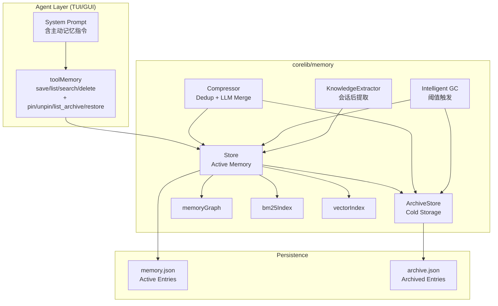

# Design Document: Memory Claude-Style Upgrade

## Overview

本设计文档描述将 Claude Code Memory 2.0 的五大核心记忆管理能力整合到 maclaw 现有 `corelib/memory` 包中的技术方案。升级涵盖六个需求：

1. **主动记忆机制** — Agent 通过 system prompt 引导主动保存非显而易见的技术发现
2. **会话后知识提取** — 对话过期时 LLM 自动提取遗漏知识点
3. **归档冷存储** — LRU 淘汰的条目归档而非删除，支持恢复
4. **Pin 钉住机制** — 钉住的条目永不被淘汰或压缩
5. **智能 GC** — 阈值触发的 GC，归档代替删除，自动复活相关归档条目
6. **向后兼容** — 现有数据无损加载，无破坏性变更

设计原则：所有核心变更集中在 `corelib/memory` 包，GUI/TUI 端仅做工具层适配（新增 pin/unpin action、system prompt 注入）。归档存储使用独立 JSON 文件，与主存储共享延迟写入机制。

## Architecture



### 关键设计决策

1. **ArchiveStore 作为 Store 的内部组件**：`ArchiveStore` 嵌入 `Store` 中，在 `NewStore` 时自动初始化。这样 `evictLRU` 可以直接调用归档逻辑，无需外部协调。

2. **Pin 字段使用 `omitempty`**：`Pinned bool json:"pinned,omitempty"` 确保旧数据加载时默认为 `false`，零值不写入 JSON，保持向后兼容。

3. **KnowledgeExtractor 独立于 ConversationArchiver**：现有 `ConversationArchiver` 生成 `conversation_summary`，新的 `KnowledgeExtractor` 提取结构化知识点为 `project_knowledge`/`instruction`。两者互补，不替换。

4. **智能 GC 集成到 Compressor**：GC 逻辑作为 `Compressor` 的新方法，复用其 LLM 调用能力和后台循环。阈值检查在每次 `Compress` 前执行。

5. **主动记忆通过 system prompt 实现**：不修改 Agent 循环逻辑，仅在 `buildSystemPromptWithMemory` 中注入主动记忆指令。Agent 自行决定何时调用 `memory(action=save, tags=["proactive"])`。

## Components and Interfaces

### 1. Entry 结构扩展

```go
// Entry — 新增 Pinned 字段
type Entry struct {
    // ... 现有字段不变 ...
    Pinned bool `json:"pinned,omitempty"` // 新增：钉住标记
}
```

### 2. ArchiveStore（新增）

```go
// ArchiveStore 管理归档冷存储
type ArchiveStore struct {
    mu       sync.RWMutex
    entries  []Entry
    path     string        // archive.json 路径
    dirty    bool
    saveCh   chan struct{}
    stopCh   chan struct{}
    maxItems int           // 默认 1000
}

// 公开方法
func (a *ArchiveStore) Add(entries ...Entry) error      // 添加归档条目
func (a *ArchiveStore) Remove(id string) (*Entry, error) // 移除并返回条目（用于恢复）
func (a *ArchiveStore) List(category Category, keyword string) []Entry
func (a *ArchiveStore) FindRelevant(tags []string, categories []Category, limit int) []Entry
func (a *ArchiveStore) Stop()                            // 停止持久化循环
```

### 3. Store 扩展

```go
// Store — 新增方法
func (s *Store) PinEntry(id string) error
func (s *Store) UnpinEntry(id string) error
func (s *Store) ListArchive(category Category, keyword string) []Entry
func (s *Store) RestoreFromArchive(id string) error
func (s *Store) Archive() *ArchiveStore  // 访问器
func (s *Store) ActiveCount() int        // 活跃条目数
```

### 4. KnowledgeExtractor（新增）

```go
// KnowledgeExtractor 从对话历史中提取知识点
type KnowledgeExtractor struct {
    store       *Store
    llm         LLMChatCaller
    cooldown    time.Duration  // 默认 1 小时
    lastExtract time.Time
    mu          sync.Mutex
}

func NewKnowledgeExtractor(store *Store, llm LLMChatCaller) *KnowledgeExtractor
func (ke *KnowledgeExtractor) Extract(userID string, messages []ConversationMessage) error
```

### 5. Compressor 扩展（智能 GC）

```go
// Compressor — 新增方法和字段
type Compressor struct {
    // ... 现有字段 ...
    gcThreshold int  // 默认 450
}

func (mc *Compressor) SetGCThreshold(n int)
func (mc *Compressor) RunGC(ctx context.Context) (*GCResult, error)
```

```go
// GCResult 记录 GC 周期结果
type GCResult struct {
    ArchivedCount  int `json:"archived_count"`
    RevivedCount   int `json:"revived_count"`
    ActiveBefore   int `json:"active_before"`
    ActiveAfter    int `json:"active_after"`
    SkippedPinned  int `json:"skipped_pinned"`
}
```

### 6. Agent Tool 扩展

TUI `toolMemory` 和 GUI `toolMemory` 新增 action：
- `pin` — 钉住条目（参数：`id`）
- `unpin` — 取消钉住（参数：`id`）
- `list_archive` — 列出归档条目（参数：`category`, `keyword`）
- `restore` — 从归档恢复条目（参数：`id`）

### 7. System Prompt 主动记忆指令

在 `buildSystemPromptWithMemory` 的首轮注入中追加：

```
## 主动记忆
当你在会话中发现以下类型的非显而易见信息时，应主动使用 memory(action=save) 保存：
- 调试过程中发现的 workaround 或未文档化行为
- 配置细节、环境特殊性
- 用户项目的架构决策或约定
- 重要的错误原因和解决方案

保存时使用 category=project_knowledge 或 instruction，并添加 tag "proactive"。
每次会话最多主动保存 5 条。保存后在回复中简要提示：已主动记录: <摘要>
```

## Data Models

### Entry（扩展后）

| 字段 | 类型 | JSON | 说明 |
|------|------|------|------|
| ID | string | `id` | 唯一标识 |
| Content | string | `content` | 记忆内容 |
| Category | Category | `category` | 分类 |
| Tags | []string | `tags` | 标签（含 `proactive`/`extracted`） |
| CreatedAt | time.Time | `created_at` | 创建时间 |
| UpdatedAt | time.Time | `updated_at` | 更新时间 |
| AccessCount | int | `access_count` | 访问次数 |
| Embedding | []float32 | `embedding,omitempty` | 向量嵌入 |
| RelatedIDs | []string | `related_ids,omitempty` | 关联条目 |
| Strength | float64 | `strength,omitempty` | 遗忘曲线强度 |
| Status | Status | `status,omitempty` | 生命周期状态 |
| Scope | Scope | `scope,omitempty` | 跨项目可见性 |
| **Pinned** | **bool** | **`pinned,omitempty`** | **新增：钉住标记** |

### ArchiveStore 持久化格式

`archive.json` 使用与 `memory.json` 相同的 `[]Entry` JSON 数组格式。归档条目保留所有原始字段，便于无损恢复。

### ConversationMessage（KnowledgeExtractor 输入）

```go
type ConversationMessage struct {
    Role    string `json:"role"`    // "user" 或 "assistant"
    Content string `json:"content"` // 纯文本内容
}
```

### GCResult

```go
type GCResult struct {
    ArchivedCount  int `json:"archived_count"`
    RevivedCount   int `json:"revived_count"`
    ActiveBefore   int `json:"active_before"`
    ActiveAfter    int `json:"active_after"`
    SkippedPinned  int `json:"skipped_pinned"`
}
```


## Correctness Properties

*A property is a characteristic or behavior that should hold true across all valid executions of a system — essentially, a formal statement about what the system should do. Properties serve as the bridge between human-readable specifications and machine-verifiable correctness guarantees.*

### Property 1: Tag preservation round-trip

*For any* Entry saved to the Memory_Store with a non-empty tag list (including tags like `"proactive"` or `"extracted"`), listing or searching the store should return that entry with all original tags intact and unmodified.

**Validates: Requirements 1.3, 2.5**

### Property 2: Conversation filter retains only user and assistant messages

*For any* conversation history containing messages with roles from the set {`"user"`, `"assistant"`, `"tool"`, `"system"`}, the KnowledgeExtractor's filter function should return only messages with role `"user"` or `"assistant"`, preserving their original order and content.

**Validates: Requirements 2.1**

### Property 3: Cooldown enforcement

*For any* sequence of two consecutive KnowledgeExtractor.Extract calls where the time between them is less than the Cooldown_Period (1 hour), the second call should be a no-op — no new entries should be saved to the Memory_Store.

**Validates: Requirements 2.4**

### Property 4: Deduplication of extracted knowledge

*For any* set of extracted knowledge points where one or more have content identical to existing entries in the Memory_Store, the KnowledgeExtractor should not create duplicate entries. The store's entry count should increase only by the number of genuinely new knowledge points.

**Validates: Requirements 2.7**

### Property 5: LRU eviction archives instead of deleting

*For any* Memory_Store at maximum capacity (500 entries), when a new non-pinned, non-protected entry is saved, the evicted entry should appear in the ArchiveStore and should no longer be in active memory. No entry data is permanently lost during eviction.

**Validates: Requirements 3.1**

### Property 6: Archive serialization round-trip

*For any* set of Entry objects added to the ArchiveStore, flushing to disk and reloading from `archive.json` should produce an equivalent set of entries with all fields preserved.

**Validates: Requirements 3.2, 3.7**

### Property 7: Archive capacity invariant

*For any* ArchiveStore, the number of archived entries should never exceed the maximum capacity (1000). When adding entries that would exceed the limit, the oldest entries (by `UpdatedAt`) should be evicted first.

**Validates: Requirements 3.3**

### Property 8: Archive list filtering consistency

*For any* set of archived entries and any category/keyword filter combination, `ListArchive(category, keyword)` should return exactly the subset of archived entries matching both the category (if non-empty) and keyword (if non-empty), consistent with the behavior of the existing `List` method on active entries.

**Validates: Requirements 3.4**

### Property 9: Restore from archive round-trip

*For any* archived entry, calling `RestoreFromArchive(id)` should remove the entry from the ArchiveStore, add it to active memory, set its `UpdatedAt` to approximately the current time (within 1 second), and set `AccessCount` to 1.

**Validates: Requirements 3.5, 3.6, 5.6**

### Property 10: Pin/Unpin round-trip

*For any* entry in the Memory_Store, calling `PinEntry(id)` should set `Pinned` to true, and subsequently calling `UnpinEntry(id)` should set `Pinned` back to false. The entry's other fields should remain unchanged by both operations.

**Validates: Requirements 4.4, 4.5**

### Property 11: Pinned and protected entries survive eviction and GC

*For any* Memory_Store containing pinned entries and entries in protected categories (self_identity), neither LRU eviction nor intelligent GC should ever remove these entries from active memory. After any eviction or GC cycle, all pinned and protected entries should still be present in active memory.

**Validates: Requirements 4.2, 4.3, 5.2**

### Property 12: Pinned entries are compression-immune

*For any* set of entries where some have `Pinned=true`, running the Compressor's dedup, semantic merge, and LLM compression should never modify the content of pinned entries. Pinned entries' Content field should be byte-identical before and after compression.

**Validates: Requirements 4.3**

### Property 13: Pinned entry indicator in output

*For any* pinned entry returned by list or search operations, the formatted output string should contain the `` indicator character.

**Validates: Requirements 4.7**

### Property 14: Any category can be pinned

*For any* category in the set {self_identity, user_fact, preference, project_knowledge, instruction, conversation_summary, session_checkpoint}, creating an entry of that category and calling `PinEntry` should succeed without error.

**Validates: Requirements 4.8**

### Property 15: GC triggers at threshold

*For any* Memory_Store where the active entry count is >= GC_Threshold (default 450), the Compressor's GC check should determine that a GC cycle is needed. When the count is below the threshold, no GC cycle should be triggered.

**Validates: Requirements 5.1**

### Property 16: GC archives instead of deleting

*For any* intelligent GC cycle, the entries removed from active memory should all appear in the ArchiveStore. The total count of (active entries after GC) + (newly archived entries) + (pinned/protected entries) should equal the active entry count before GC.

**Validates: Requirements 5.3**

### Property 17: Archive revival limit

*For any* intelligent GC cycle, the number of entries revived from the ArchiveStore should be at most 10.

**Validates: Requirements 5.5**

### Property 18: Backward compatible deserialization

*For any* valid JSON array of Entry objects that lacks the `"pinned"` field, loading into the Memory_Store should succeed without error, and all loaded entries should have `Pinned == false`.

**Validates: Requirements 6.1**

### Property 19: Existing operations unchanged

*For any* sequence of save/list/search/delete operations on a Memory_Store, the results should be identical whether or not the new Pinned field, ArchiveStore, and GC features are present. Specifically, saving an entry and then listing/searching should return it, and deleting should remove it.

**Validates: Requirements 6.4, 6.5**

## Error Handling

| 场景 | 处理策略 |
|------|----------|
| `archive.json` 不存在 | `ArchiveStore.load()` 静默创建空归档，不报错 |
| `archive.json` 损坏 | 备份损坏文件为 `archive.json.corrupt.<timestamp>`，从空归档重新开始 |
| LLM 未配置时调用 KnowledgeExtractor | `Extract()` 返回 nil，不影响会话生命周期 |
| LLM 调用失败（网络/超时） | `Extract()` 返回 error，调用方记录日志但不中断 |
| PinEntry/UnpinEntry 传入不存在的 ID | 返回 `fmt.Errorf("entry %q not found")` |
| RestoreFromArchive 传入不存在的 ID | 返回 `fmt.Errorf("archived entry %q not found")` |
| 恢复条目时 Active_Memory 已满 | 先执行 evictLRU（会将最低优先级条目归档），再插入恢复的条目 |
| GC 期间 ArchiveStore 写入失败 | GC 继续执行，记录错误到 GCResult，不中断压缩流程 |
| 并发访问 ArchiveStore | 使用 `sync.RWMutex` 保护，与 Store 相同的锁策略 |
| Cooldown 期间重复调用 Extract | 静默跳过，返回 nil |

## Testing Strategy

### 测试框架选择

- **单元测试**: Go 标准 `testing` 包
- **属性测试**: [`pgregory.net/rapid`](https://github.com/flyingmutant/rapid) — Go 生态最活跃的 property-based testing 库
- 每个属性测试配置最少 **100 次迭代**
- 每个属性测试必须以注释引用设计文档中的 Property 编号

### 属性测试（Property-Based Tests）

每个 Correctness Property 对应一个属性测试函数，使用 `rapid` 库生成随机输入：

| Property | 测试函数 | 生成器 |
|----------|----------|--------|
| P1: Tag preservation | `TestProperty_TagPreservation` | 随机 Entry + 随机 tags |
| P2: Conversation filter | `TestProperty_ConversationFilter` | 随机 role 列表 |
| P3: Cooldown enforcement | `TestProperty_CooldownEnforcement` | 随机时间间隔 |
| P4: Dedup extracted | `TestProperty_ExtractedDedup` | 随机 content 集合 |
| P5: LRU archives | `TestProperty_LRUArchives` | 随机 Entry 序列 |
| P6: Archive round-trip | `TestProperty_ArchiveRoundTrip` | 随机 Entry 集合 |
| P7: Archive capacity | `TestProperty_ArchiveCapacity` | 随机大量 Entry |
| P8: Archive list filter | `TestProperty_ArchiveListFilter` | 随机 category + keyword |
| P9: Restore round-trip | `TestProperty_RestoreRoundTrip` | 随机 archived Entry |
| P10: Pin/Unpin round-trip | `TestProperty_PinUnpinRoundTrip` | 随机 Entry |
| P11: Protected survive | `TestProperty_ProtectedSurviveEviction` | 随机 pinned + protected entries |
| P12: Compression immune | `TestProperty_PinnedCompressionImmune` | 随机 pinned entries |
| P13: Pin indicator | `TestProperty_PinIndicatorInOutput` | 随机 pinned entries |
| P14: Any category pin | `TestProperty_AnyCategoryPin` | 所有 Category 值 |
| P15: GC threshold | `TestProperty_GCThreshold` | 随机 entry count |
| P16: GC archives | `TestProperty_GCArchives` | 随机 entry 集合 |
| P17: Revival limit | `TestProperty_RevivalLimit` | 随机 archive 内容 |
| P18: Backward compat | `TestProperty_BackwardCompatDeserialize` | 随机 JSON 无 pinned 字段 |
| P19: Existing ops | `TestProperty_ExistingOpsUnchanged` | 随机 CRUD 序列 |

### 标签格式

每个属性测试函数开头必须包含注释：

```go
// Feature: memory-claude-style-upgrade, Property 1: Tag preservation round-trip
```

### 单元测试（Unit Tests）

单元测试聚焦于具体示例、边界情况和集成点：

- **KnowledgeExtractor**: LLM 未配置时跳过、LLM 返回错误时优雅降级、空对话跳过
- **ArchiveStore**: 空文件初始化、损坏文件恢复、并发读写安全
- **Pin 机制**: pin 不存在的 ID、unpin 已经 unpinned 的条目
- **GC**: 阈值边界（449 不触发、450 触发）、全部 pinned 时 GC 无操作
- **System Prompt**: 首轮包含主动记忆指令、非首轮不包含
- **Tool dispatch**: pin/unpin/list_archive/restore action 正确路由
- **向后兼容**: 加载无 pinned 字段的 JSON、加载无 archive.json 的目录
