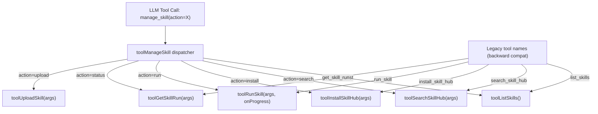

# Design Document: Merge Skill Tools into `manage_skill`

## Overview

This feature merges 5 existing skill-related LLM tools (`list_skills`, `search_skill_hub`, `install_skill_hub`, `run_skill`, `get_skill_run`) into a single `manage_skill` tool with action-based routing, and adds a new `upload` action. This follows the established merge pattern from improvement #14 (`manage_config`, `manage_template`, `manage_schedule`).

The merge reduces LLM context consumption by ~800-1000 tokens (5 tool definitions → 1) while preserving full backward compatibility through legacy name dispatch aliases.

### Design Decisions

1. **Action-based routing over separate tools**: Consistent with the existing `manage_config`/`manage_template`/`manage_schedule` pattern. Reduces model decision cost and context usage.
2. **`regP` registration**: The merged tool must use progress-aware registration (`regP`) because the `run` action delegates to `toolRunSkill`, which requires a `ProgressCallback`. Non-progress actions simply ignore the callback.
3. **`status` action name**: The `get_skill_run` tool is renamed to `status` (not `get_run`) for consistency with the action verb pattern used by other merged tools.
4. **CoreToolNames inclusion**: `manage_skill` replaces `list_skills` and `run_skill` in `CoreToolNames` so it's always available. The legacy names are removed from `CoreToolNames` but remain in `BuiltinToolNames`.
5. **Upload via existing Wails binding**: The `upload` action reuses `App.UploadNLSkillToMarket()` in GUI and the equivalent logic in TUI, avoiding code duplication.

## Architecture



The architecture mirrors the existing merged tool pattern:

1. **Tool Definition Layer** (`im_tool_definitions.go`): Single `manage_skill` definition replaces 5 separate definitions.
2. **Tool Registry Layer** (`tool_registry_builtin.go`): `manage_skill` registered with `regP` (progress-aware). Legacy names registered with handlers only (no definitions).
3. **Dispatcher Layer** (`im_tools_misc.go` / `agent_tools.go`): `toolManageSkill` function routes `action` parameter to existing handlers.
4. **Dispatch Layer** (`im_message_handler.go` / `agent_handler.go`): Both GUI and TUI dispatch `manage_skill` to the router, and legacy names to their original handlers.
5. **Router Layer** (`corelib/tool/router.go`): `BuiltinToolNames` and `CoreToolNames` updated.
6. **Deferred Tool Layer** (`tool_deferred.go`): Legacy names added to deferred list.

## Components and Interfaces

### 1. `toolManageSkill` Dispatcher (GUI — `gui/im_tools_misc.go`)

```go
func (h *IMMessageHandler) toolManageSkill(args map[string]interface{}, onProgress ProgressCallback) string {
    action := stringVal(args, "action")
    switch action {
    case "list":
        return h.toolListSkills()
    case "search":
        return h.toolSearchSkillHub(args)
    case "install":
        return h.toolInstallSkillHub(args)
    case "run":
        return h.toolRunSkill(args, onProgress)
    case "status":
        return h.toolGetSkillRun(args)
    case "upload":
        return h.toolUploadSkill(args)
    default:
        return fmt.Sprintf("未知 manage_skill action: %s（支持: list/search/install/run/status/upload）", action)
    }
}
```

### 2. `toolUploadSkill` Handler (GUI — `gui/im_tools_misc.go`)

```go
func (h *IMMessageHandler) toolUploadSkill(args map[string]interface{}) string {
    name := stringVal(args, "name")
    if name == "" {
        return "缺少 name 参数（要上传的 Skill 名称）"
    }
    submissionID, err := h.app.UploadNLSkillToMarket(name)
    if err != nil {
        return fmt.Sprintf("上传失败: %s", err.Error())
    }
    return fmt.Sprintf("Skill「%s」已上传到 SkillMarket，提交 ID: %s", name, submissionID)
}
```

### 3. `toolManageSkill` Dispatcher (TUI — `tui/agent_tools.go`)

```go
func (h *TUIAgentHandler) toolManageSkill(args map[string]interface{}) string {
    action := stringArg(args, "action")
    switch action {
    case "list":
        return h.toolListSkills()
    case "search":
        return h.toolSearchSkillHub(args)
    case "install":
        return h.toolInstallSkillHub(args)
    case "run":
        return h.toolRunSkill(args)
    case "status":
        return h.toolGetSkillRun(args)
    case "upload":
        return h.toolUploadSkill(args)
    default:
        return fmt.Sprintf("未知 manage_skill action: %s（支持: list/search/install/run/status/upload）", action)
    }
}
```

### 4. `toolUploadSkill` Handler (TUI — `tui/agent_tools.go`)

TUI upload uses the same `UploadNLSkillToMarket` logic but adapted for TUI infrastructure (skill executor + skill market client initialization).

### 5. Tool Registry Registration (`gui/tool_registry_builtin.go`)

```go
// Merged skill management tool (progress-aware for run action)
regP("manage_skill", "Skill 管理（action: list/search/install/run/status/upload）...",
    ToolCategoryBuiltin, []string{"skill", "list", "search", "install", "run", "status", "upload"},
    manageSkillSchema, []string{"action"},
    func(args map[string]interface{}, onProgress ProgressCallback) string {
        return h.toolManageSkill(args, onProgress)
    })

// Legacy backward-compat aliases (handler only, no definition)
reg("list_skills", "", ToolCategoryBuiltin, nil, nil, nil,
    func(args map[string]interface{}) string { return h.toolListSkills() })
// ... (search_skill_hub, install_skill_hub, get_skill_run similarly)
regP("run_skill", "", ToolCategoryBuiltin, nil, nil, nil,
    func(args map[string]interface{}, onProgress ProgressCallback) string {
        return h.toolRunSkill(args, onProgress)
    })
```

### 6. Router Updates (`corelib/tool/router.go`)

```go
var CoreToolNames = map[string]bool{
    // ... existing entries ...
    "manage_skill": true,  // replaces list_skills + run_skill
    // remove: "list_skills": true, "run_skill": true,
}

var BuiltinToolNames = map[string]bool{
    // ... existing entries ...
    "manage_skill":    true,
    "search_skill_hub": true, "install_skill_hub": true,  // keep for backward compat
    "list_skills": true, "run_skill": true, "get_skill_run": true,  // keep for backward compat
}
```

### 7. Deferred Tool List Updates (`gui/tool_deferred.go`)

```go
var DeferredToolNames = []string{
    // ... existing entries ...
    // Skill (legacy names, kept for backward compat dispatch only)
    "list_skills",
    "search_skill_hub",
    "install_skill_hub",
    "run_skill",
    "get_skill_run",
}
```

Note: `manage_skill` is NOT deferred because it's in `CoreToolNames` (always available).

## Data Models

### Unified Tool Definition Schema

The `manage_skill` tool definition uses a superset schema where parameters are conditionally required based on the `action` value:

| Parameter | Type | Required For | Description |
|-----------|------|-------------|-------------|
| `action` | string (enum) | ALL | `list`, `search`, `install`, `run`, `status`, `upload` |
| `query` | string | search | Search keywords |
| `skill_id` | string | install | Skill ID from search results |
| `hub_url` | string | install | Source Hub URL |
| `auto_run` | boolean | — | Auto-run after install (default true) |
| `name` | string | run, upload | Skill name |
| `args` | object | — | Placeholder replacement args for run |
| `env` | object | — | Environment variables for run |
| `operation` | string | — | Operation name for api_workflow skills |
| `input` | string | — | Legacy input parameter for run |
| `output` | string | — | Legacy output parameter for run |
| `user_prompt` | string | — | User's original request text for craft_tool skills |
| `wait_seconds` | number | — | Wait duration for install/run/status snapshots |
| `run_id` | string | status | Run ID from previous run |

### File Change Summary

| File | Change Type | Description |
|------|------------|-------------|
| `gui/im_tool_definitions.go` | Modify | Replace 5 skill tool defs with 1 `manage_skill` def |
| `gui/im_tools_misc.go` | Add | `toolManageSkill` dispatcher + `toolUploadSkill` handler |
| `gui/tool_registry_builtin.go` | Modify | Register `manage_skill` with `regP`, legacy names with handler-only |
| `gui/tool_deferred.go` | Modify | Add 5 legacy skill tool names |
| `corelib/tool/router.go` | Modify | Update `CoreToolNames` and `BuiltinToolNames` |
| `tui/agent_handler.go` | Modify | Add `manage_skill` dispatch case, keep legacy cases |
| `tui/agent_tools.go` | Add | `toolManageSkill` dispatcher + `toolUploadSkill` handler |

## Correctness Properties

*A property is a characteristic or behavior that should hold true across all valid executions of a system — essentially, a formal statement about what the system should do. Properties serve as the bridge between human-readable specifications and machine-verifiable correctness guarantees.*

### Property 1: Dispatch round-trip equivalence

*For any* valid action in {list, search, install, run, status} and *for any* args map, calling `toolManageSkill(args)` with that action SHALL produce the same result as calling the corresponding standalone handler directly (e.g., `toolListSkills()` for list, `toolSearchSkillHub(args)` for search, etc.).

**Validates: Requirements 2.1, 2.2, 2.3, 2.4, 2.5, 2.8**

### Property 2: Invalid action error lists all supported actions

*For any* string that is not one of {list, search, install, run, status, upload}, calling `toolManageSkill` with that action SHALL return an error message that contains all six supported action names.

**Validates: Requirements 2.7**

### Property 3: Legacy name dispatch equivalence (GUI)

*For any* legacy tool name in {list_skills, search_skill_hub, install_skill_hub, run_skill, get_skill_run} and *for any* args map, dispatching via the legacy tool name in the GUI handler SHALL produce the same result as calling the corresponding handler directly.

**Validates: Requirements 4.1, 4.2, 4.3, 4.4, 4.5**

### Property 4: Legacy name dispatch equivalence (TUI)

*For any* legacy tool name in {list_skills, search_skill_hub, install_skill_hub, run_skill, get_skill_run} and *for any* args map, dispatching via the legacy tool name in the TUI handler SHALL produce the same result as calling the corresponding handler directly.

**Validates: Requirements 6.2**

## Error Handling

| Scenario | Behavior |
|----------|----------|
| Missing `action` parameter | Return error listing supported actions |
| Unrecognized `action` value | Return error listing supported actions |
| `upload` with empty/missing `name` | Return "缺少 name 参数" error |
| `upload` with uninitialized skill executor | Return "Skill Executor 未初始化" error |
| `upload` with uninitialized skill market client | Return "skill market client not initialized" error |
| `UploadNLSkillToMarket` returns error | Propagate error message: "上传失败: {error}" |
| `search` with empty `query` | Delegated to `toolSearchSkillHub` which returns "缺少 query 参数" |
| `install` with missing `skill_id`/`hub_url` | Delegated to `toolInstallSkillHub` which returns appropriate error |
| `run` with missing `name` | Delegated to `toolRunSkill` which returns "缺少 name 参数" |
| `status` with missing `run_id` | Delegated to `toolGetSkillRun` which returns "缺少 run_id 参数" |

All error handling for existing actions is preserved unchanged — the dispatcher delegates to the original handlers which already handle their own errors.

## Testing Strategy

### Property-Based Tests

Property-based testing is appropriate for this feature because the dispatch logic is a pure routing function with clear input/output behavior. The core property (dispatch equivalence) holds universally across all valid inputs.

- **Library**: Go's `testing/quick` or a PBT library like `gopter`
- **Minimum iterations**: 100 per property
- **Tag format**: `Feature: merge-skill-tools, Property {N}: {description}`

Each correctness property above maps to a property-based test:

1. **Dispatch round-trip**: Generate random action + args, verify merged tool output matches standalone handler output. Use mock handlers to isolate dispatch logic from external dependencies.
2. **Invalid action error**: Generate random strings excluding valid actions, verify error message format.
3. **Legacy dispatch (GUI)**: Generate random legacy name + args, verify dispatch equivalence.
4. **Legacy dispatch (TUI)**: Same as above for TUI handler.

### Unit Tests (Example-Based)

- Tool definition schema validation (Req 1.1-1.8)
- `CoreToolNames` contains `manage_skill`, not `list_skills`/`run_skill` (Req 5.5)
- `BuiltinToolNames` contains `manage_skill` and all legacy names (Req 4.6, 5.4)
- `DeferredToolNames` contains legacy names (Req 7.2-7.3)
- Upload action with mock: success path returns submission ID (Req 3.2)
- Upload action with mock: error propagation (Req 3.4)
- Upload action with empty name returns error (Req 3.3)
- Upload action with nil executor returns error (Req 3.5)
- `manage_skill` registered with `HandlerProg` (Req 8.1-8.2)
- Progress callback passed through to `run` action (Req 8.3)
- `buildToolDefinitions` produces exactly one skill-related definition (Req 5.3)

### Integration Tests

- End-to-end `upload` action with real `UploadNLSkillToMarket` (Req 3.1)
- TUI and GUI produce equivalent results for all actions (Req 6.4)
