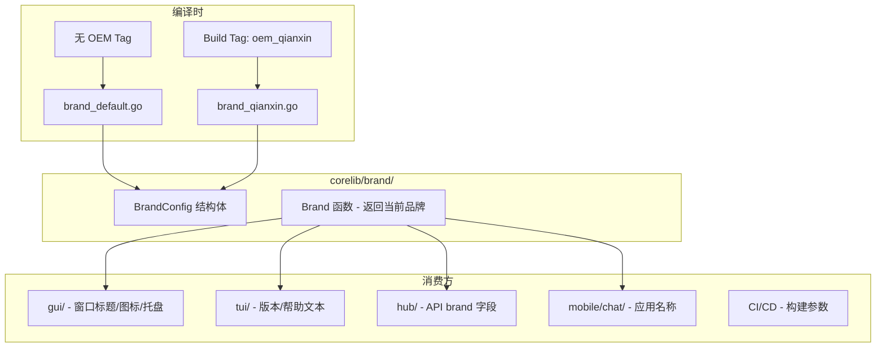
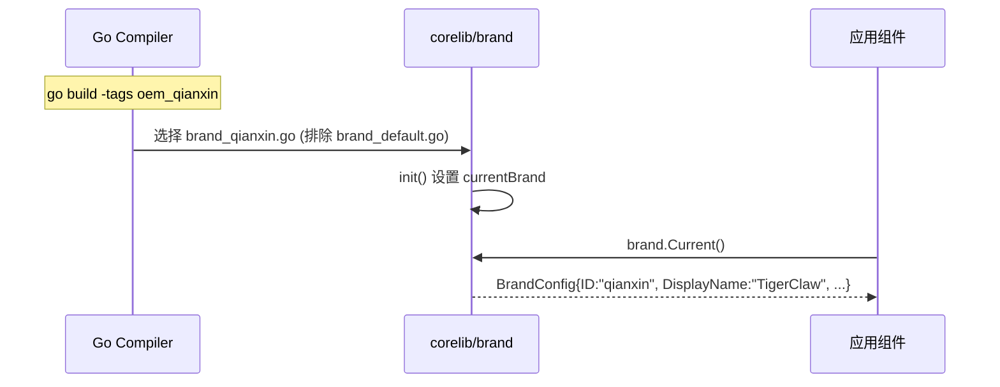

# Design Document: OEM Branding

## Overview

本设计文档描述 MaClaw/CodeClaw 项目的 OEM 品牌机制的技术实现方案。该机制通过 Go build tag 在编译时选择品牌变体，实现零运行时开销的品牌切换。

核心设计原则：
- **编译时切换**：通过 `//go:build oem_xxx` tag 激活品牌，不引入运行时分支
- **最小侵入**：OEM 方只需新增一个 Go 文件 + 放置 Logo 资源，不修改任何现有代码
- **中心化注册**：品牌配置定义在 `corelib/brand/` 包中，所有组件统一引用
- **默认安全**：不带任何 OEM tag 编译时，行为与当前代码完全一致

第一个 OEM 品牌：奇爪（TigerClaw），BrandID 为 `qianxin`。

## Architecture

### 整体架构



### 品牌解析流程



### 设计决策

1. **为什么用 build tag 而不是运行时配置？**
   - 零运行时开销，无需条件分支
   - 编译时即可发现配置错误（未注册的 brand tag 会编译失败）
   - OEM 方的品牌文件不会被打包进默认品牌的二进制中
   - 符合 Go 惯用的条件编译模式

2. **为什么品牌定义放在 corelib/brand/ 而不是各组件内？**
   - gui/、tui/、hub/、mobile/ 都需要引用品牌信息
   - 避免循环依赖，corelib 是最底层的共享库
   - 单一数据源，修改品牌信息只需改一处

3. **ExtraTools 如何注入？**
   - BrandConfig 包含 `ExtraTools []ExtraToolDef`
   - 各组件在启动时读取 `brand.Current().ExtraTools` 并注册到各自的工具列表
   - 工具的环境变量构建函数通过函数引用（`EnvBuilderFunc`）传入，避免硬编码

## Components and Interfaces

### 1. `corelib/brand` 包

```go
package brand

// BrandConfig 描述一个品牌变体的完整配置。
type BrandConfig struct {
    ID             string         // 品牌标识符，如 "qianxin"
    DisplayName    string         // 产品显示名称，如 "TigerClaw"
    DisplayNameCN  string         // 中文显示名称，如 "奇爪"
    WindowTitle    string         // GUI 窗口标题
    TrayTooltip    string         // 系统托盘提示文字
    IconPath       string         // 桌面图标资源路径（相对于 build/）
    IcnsPath       string         // macOS icns 路径
    IcoPath        string         // Windows ico 路径
    MobileAppName  string         // 移动端应用名称
    ExtraTools     []ExtraToolDef // 额外工具列表
}

// ExtraToolDef 描述一个 OEM 额外工具。
type ExtraToolDef struct {
    Name           string                                                          // 工具内部名称，如 "tigerclaw"
    DisplayName    string                                                          // 显示名称
    ConfigKey      string                                                          // AppConfig 中的配置键名
    EnvBuilderFunc func(cfg interface{}, model interface{}, projectDir string) map[string]string // 环境变量构建函数
    OnboardingFunc func(projectDir string, env map[string]string)                  // 可选：首次启动预配置
}

// Current 返回当前编译时激活的品牌配置。
func Current() BrandConfig

// IsDefault 返回当前品牌是否为默认品牌。
func IsDefault() bool
```

### 2. 品牌文件结构

```
corelib/brand/
├── brand.go              # BrandConfig 类型定义 + Current() 函数
├── brand_default.go      # //go:build !oem_qianxin  — 默认品牌 MaClaw
├── brand_qianxin.go      # //go:build oem_qianxin   — 奇爪品牌
└── extra_tools.go        # ExtraToolDef 类型定义
```

### 3. 默认品牌文件 (`brand_default.go`)

```go
//go:build !oem_qianxin

package brand

func init() {
    currentBrand = BrandConfig{
        ID:            "maclaw",
        DisplayName:   "MaClaw",
        DisplayNameCN: "码卡龙",
        WindowTitle:   "MaClaw",
        TrayTooltip:   "MaClaw Dashboard",
        IconPath:      "build/appicon.png",
        IcnsPath:      "build/AppIcon.icns",
        IcoPath:       "build/windows/icon.ico",
        MobileAppName: "MaClaw Chat",
        ExtraTools:    nil,
    }
}
```

### 4. OEM 品牌文件 (`brand_qianxin.go`)

```go
//go:build oem_qianxin

package brand

func init() {
    currentBrand = BrandConfig{
        ID:            "qianxin",
        DisplayName:   "TigerClaw",
        DisplayNameCN: "奇爪",
        WindowTitle:   "TigerClaw",
        TrayTooltip:   "TigerClaw Dashboard",
        IconPath:      "assets/qianxin.png",
        IcnsPath:      "assets/qianxin.icns",
        IcoPath:       "assets/qianxin.ico",
        MobileAppName: "TigerClaw",
        ExtraTools: []ExtraToolDef{
            {
                Name:        "tigerclaw",
                DisplayName: "TigerClaw Code",
                ConfigKey:   "tigerclaw",
            },
        },
    }
}
```

### 5. 各组件集成点

#### GUI (`gui/main.go`)
```go
// 替换硬编码的 "MaClaw"
appOptions := &options.App{
    Title: brand.Current().WindowTitle,
    // ...
}
```

#### GUI 托盘 (`gui/common.go`)
```go
// trayTranslations 中的 "title" 使用品牌名
// brand.Current().TrayTooltip 替代硬编码
```

#### GUI 图标 (`gui/resources_*.go`)
- 默认品牌：继续 embed `build/appicon.png`
- OEM 品牌：通过 build tag 条件编译，embed OEM 的图标文件
- 实现方式：新增 `gui/resources_oem_qianxin_*.go` 文件，用 `//go:build oem_qianxin` 覆盖 `icon` 变量

#### TUI (`tui/main.go`)
```go
// --version 输出
fmt.Printf("%s %s\n", brand.Current().DisplayName, version)

// --help 输出
fmt.Fprintf(os.Stderr, "Usage: %s [command] [flags]\n", strings.ToLower(brand.Current().DisplayName))
```

#### Hub (`hub/internal/center/service.go`)
```go
// 设备注册响应
"brand": brand.Current().DisplayName,
```

#### 额外工具注入
- `tui/tool_launch_env.go` 的 `buildToolEnv` 和 `normalizeToolName` 需要支持动态工具
- `tui/main.go` 的 launch 命令帮助文本需要包含额外工具
- `gui/app.go` 的 `LaunchTool` 需要支持额外工具的环境变量构建

### 6. CI/CD 集成

`.github/workflows/main.yml` 新增 `BRAND` 参数：

```yaml
env:
  BRAND: ''  # 默认为空，表示 MaClaw

# 在 go build 命令中：
# if BRAND != '': 添加 -tags oem_${BRAND}
# 产物文件名中包含品牌标识
```

## Data Models

### BrandConfig

| 字段 | 类型 | 说明 | 默认品牌值 | qianxin 品牌值 |
|------|------|------|-----------|---------------|
| ID | string | 品牌唯一标识 | "maclaw" | "qianxin" |
| DisplayName | string | 英文显示名 | "MaClaw" | "TigerClaw" |
| DisplayNameCN | string | 中文显示名 | "码卡龙" | "奇爪" |
| WindowTitle | string | 窗口标题 | "MaClaw" | "TigerClaw" |
| TrayTooltip | string | 托盘提示 | "MaClaw Dashboard" | "TigerClaw Dashboard" |
| IconPath | string | PNG 图标路径 | "build/appicon.png" | "assets/qianxin.png" |
| IcnsPath | string | macOS icns | "build/AppIcon.icns" | "assets/qianxin.icns" |
| IcoPath | string | Windows ico | "build/windows/icon.ico" | "assets/qianxin.ico" |
| MobileAppName | string | 移动端名称 | "MaClaw Chat" | "TigerClaw" |
| ExtraTools | []ExtraToolDef | 额外工具 | nil | [{Name:"tigerclaw",...}] |

### ExtraToolDef

| 字段 | 类型 | 说明 |
|------|------|------|
| Name | string | 工具内部名称（小写，用于 CLI 和配置键） |
| DisplayName | string | 用户可见的显示名称 |
| ConfigKey | string | AppConfig JSON 中的键名 |
| EnvBuilderFunc | func | 环境变量构建函数（可选，nil 表示使用通用 OpenAI 兼容构建器） |
| OnboardingFunc | func | 首次启动预配置函数（可选） |

### 文件系统布局（OEM 方需要添加的文件）

```
corelib/brand/brand_qianxin.go    # 品牌配置声明
assets/qianxin.png                # Logo 资源（已存在）
assets/qianxin.ico                # Windows 图标（需生成）
assets/qianxin.icns               # macOS 图标（需生成）
gui/resources_oem_qianxin_darwin.go   # macOS 图标 embed 覆盖
gui/resources_oem_qianxin_windows.go  # Windows 图标 embed 覆盖
gui/resources_oem_qianxin_linux.go    # Linux 图标 embed 覆盖
```


## Correctness Properties

*A property is a characteristic or behavior that should hold true across all valid executions of a system — essentially, a formal statement about what the system should do. Properties serve as the bridge between human-readable specifications and machine-verifiable correctness guarantees.*

### Property 1: Brand resolver always returns a valid configuration

*For any* call to `brand.Current()`, the returned `BrandConfig` shall have non-empty `ID`, `DisplayName`, `WindowTitle`, and `TrayTooltip` fields, and `ExtraTools` shall be a non-nil slice (may be empty).

**Validates: Requirements 2.3, 1.3**

### Property 2: CLI output reflects brand configuration

*For any* `BrandConfig`, the version output string shall contain `BrandConfig.DisplayName`, the help/usage output shall contain `BrandConfig.DisplayName`, and if `BrandConfig.ExtraTools` is non-empty, the launch command's supported tools list shall include each extra tool's `Name`.

**Validates: Requirements 4.1, 4.2, 7.4**

### Property 3: Hub responses reflect brand configuration

*For any* `BrandConfig`, the device registration response's "brand" field shall equal `BrandConfig.DisplayName`, and if `BrandConfig.ExtraTools` is non-empty, the device capability report's tools list shall include each extra tool's `Name`.

**Validates: Requirements 6.1, 7.5**

### Property 4: Extra tools are registered in tool registry

*For any* `BrandConfig` with non-empty `ExtraTools`, after invoking the tool registration function, the tool registry shall contain an entry for each extra tool's `Name`, and the total tool count shall increase by exactly `len(ExtraTools)`.

**Validates: Requirements 7.2**

### Property 5: Tool name conflict detection

*For any* `ExtraToolDef` whose `Name` matches an existing builtin tool name (e.g., "claude", "codex", "gemini"), the tool registration function shall return an error, and the tool registry shall remain unchanged.

**Validates: Requirements 7.6**

### Property 6: Config loading ignores unknown brand tool keys

*For any* `AppConfig` JSON that contains tool configuration keys not present in the current brand's `ExtraTools` list, deserializing and loading the config shall succeed without error, and the unknown keys shall be silently ignored.

**Validates: Requirements 9.4**

## Error Handling

| 场景 | 处理方式 |
|------|---------|
| 使用未注册的 OEM build tag 编译 | 编译失败：Go 找不到匹配的源文件，产生明确的编译错误 |
| ExtraTools 中的工具名与内置工具冲突 | 注册时返回 error，日志输出冲突详情，不注册冲突工具 |
| OEM 图标资源文件不存在 | 编译失败：`//go:embed` 指令找不到文件，产生编译错误 |
| 配置文件包含未知品牌的工具配置 | 静默忽略，JSON 反序列化自动丢弃未知字段 |
| `brand.Current()` 在 init 之前被调用 | 不可能发生：Go 的 init() 在 main() 之前执行，且 `currentBrand` 是包级变量 |
| 多个 OEM build tag 同时指定 | 编译失败：多个 brand 文件的 init() 都会设置 `currentBrand`，但 build tag 的互斥约束（`!oem_qianxin`）确保只有一个文件被编译 |

## Testing Strategy

### 单元测试

单元测试覆盖具体示例和边界情况：

1. **默认品牌验证**：不带 OEM tag 编译时，`brand.Current()` 返回 `DisplayName="MaClaw"`、`ExtraTools` 为空
2. **OEM 品牌验证**：带 `oem_qianxin` tag 编译时，`brand.Current()` 返回 `DisplayName="TigerClaw"`、`ExtraTools` 包含 "tigerclaw"
3. **IsDefault() 函数**：默认品牌返回 true，OEM 品牌返回 false
4. **工具名冲突检测**：尝试注册名为 "claude" 的额外工具，验证返回错误
5. **配置兼容性**：加载包含 "tigerclaw" 配置键的 JSON，在默认品牌下不报错

### 属性测试

使用 `testing/quick` 或 `pgregory.net/rapid` 库进行属性测试，每个属性至少运行 100 次迭代。

每个属性测试必须用注释标注对应的设计属性：

```go
// Feature: oem-branding, Property 1: Brand resolver always returns a valid configuration
func TestProperty_BrandResolverAlwaysValid(t *testing.T) { ... }

// Feature: oem-branding, Property 2: CLI output reflects brand configuration
func TestProperty_CLIOutputReflectsBrand(t *testing.T) { ... }

// Feature: oem-branding, Property 3: Hub responses reflect brand configuration
func TestProperty_HubResponsesReflectBrand(t *testing.T) { ... }

// Feature: oem-branding, Property 4: Extra tools are registered in tool registry
func TestProperty_ExtraToolsRegistered(t *testing.T) { ... }

// Feature: oem-branding, Property 5: Tool name conflict detection
func TestProperty_ToolNameConflictDetection(t *testing.T) { ... }

// Feature: oem-branding, Property 6: Config loading ignores unknown brand tool keys
func TestProperty_ConfigIgnoresUnknownToolKeys(t *testing.T) { ... }
```

属性测试策略：
- **Property 1**：生成随机 BrandConfig 实例，验证 Current() 返回值的必填字段非空
- **Property 2**：生成随机 BrandConfig（含随机 ExtraTools），调用格式化函数，验证输出包含品牌名和工具名
- **Property 3**：生成随机 BrandConfig，构建 hub 响应，验证 brand 字段和工具列表
- **Property 4**：生成随机 ExtraToolDef 列表（名称不与内置工具冲突），注册后验证 registry 包含所有工具
- **Property 5**：从内置工具名列表中随机选取一个作为 ExtraToolDef.Name，验证注册返回错误
- **Property 6**：生成随机 JSON 配置（包含随机额外键），验证反序列化成功

推荐使用 `pgregory.net/rapid` 库，它提供了更好的生成器 API 和缩减能力。
