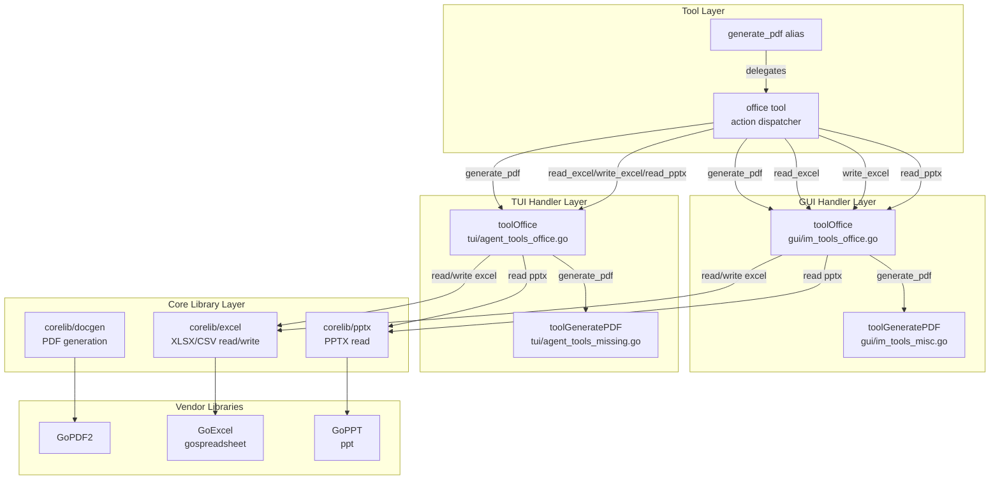

# Design Document: Office Tool Integration

## Overview

This design merges the existing `generate_pdf` tool with new Excel (XLSX/CSV) and PPTX reading capabilities into a unified `office(action=...)` tool. The architecture follows the established tool-merge pattern (improvement #14) where multiple related tools are consolidated behind a single action-dispatching entry point, reducing LLM tool-selection overhead.

The implementation introduces two new `corelib` packages (`corelib/excel/` and `corelib/pptx/`) that wrap the Vantagics GoExcel and GoPPT libraries respectively. These packages expose clean Go types decoupled from the underlying library types, keeping tool handlers thin and the core logic independently testable.

Key design decisions:
- **Action-based dispatch**: A single `office` tool with an `action` parameter routes to `generate_pdf`, `read_excel`, `write_excel`, and `read_pptx` handlers. This mirrors the `manage_config`, `manage_template`, and `manage_schedule` patterns.
- **Backward compatibility**: `generate_pdf` remains as a registered alias that delegates to `office(action="generate_pdf", ...)`. All existing references in allowlists, conditional keep rules, and system prompts continue to work.
- **Package-level encapsulation**: `corelib/excel/` and `corelib/pptx/` own all library interaction. GUI and TUI handlers call these packages, never the raw GoExcel/GoPPT APIs directly.
- **Full TUI implementation**: Unlike PDF generation (which falls back to Markdown in TUI), Excel and PPTX operations are fully functional in TUI since they don't require font rendering.

## Architecture



### Dispatch Flow

1. LLM calls `office(action="read_excel", file_path="data.xlsx", range="A1:D10")`
2. Tool registry routes to `toolOffice()` handler
3. Handler reads `action` parameter, dispatches to `handleReadExcel(args)`
4. `handleReadExcel` calls `excel.ReadFile(filePath, opts)` from `corelib/excel/`
5. `corelib/excel/` uses GoExcel to open the file, extract cells, and return `[][]CellValue`
6. Handler serializes result to JSON and returns to LLM

For the backward-compatible alias: LLM calls `generate_pdf(content=..., title=...)` → registry routes to the same `toolOffice()` handler with `action` injected as `"generate_pdf"`.

## Components and Interfaces

### 1. `corelib/excel/` Package

```go
package excel

import "encoding/json"

// CellValue represents a single cell's value with type information.
type CellValue struct {
    Value   interface{} `json:"value"`            // string, float64, bool, or nil
    Type    CellType    `json:"type"`             // "string", "number", "bool", "formula", "empty"
    Formula string      `json:"formula,omitempty"` // original formula if Type == CellTypeFormula
}

type CellType string

const (
    CellTypeString  CellType = "string"
    CellTypeNumber  CellType = "number"
    CellTypeBool    CellType = "bool"
    CellTypeFormula CellType = "formula"
    CellTypeEmpty   CellType = "empty"
)

// ReadOptions configures a read operation.
type ReadOptions struct {
    SheetName string // empty = first sheet
    Range     string // A1 notation, empty = all non-empty cells
}

// ReadResult contains the data read from a spreadsheet.
type ReadResult struct {
    SheetName string       `json:"sheet_name"`
    Rows      [][]CellValue `json:"rows"`
    RowCount  int          `json:"row_count"`
    ColCount  int          `json:"col_count"`
}

// ReadFile reads cell data from an XLSX or CSV file.
// CSV files are auto-detected by extension.
func ReadFile(filePath string, opts ReadOptions) (*ReadResult, error)

// SheetStyle defines formatting for a cell.
type SheetStyle struct {
    Bold            bool   `json:"bold,omitempty"`
    FontSize        int    `json:"font_size,omitempty"`
    BackgroundColor string `json:"background_color,omitempty"` // hex color e.g. "#FF0000"
    NumberFormat    string `json:"number_format,omitempty"`
}

// WriteCell represents a single cell to write.
type WriteCell struct {
    Value interface{} `json:"value"`           // string, float64, bool
    Style *SheetStyle `json:"style,omitempty"`
}

// WriteSheet represents a sheet to write.
type WriteSheet struct {
    Name string       `json:"name"`
    Rows [][]WriteCell `json:"rows"`
}

// WriteData is the top-level structure for write operations.
type WriteData struct {
    Sheets []WriteSheet `json:"sheets"`
}

// WriteFile creates or overwrites an XLSX file.
func WriteFile(filePath string, data WriteData) error

// ListSheets returns the sheet names in a workbook.
func ListSheets(filePath string) ([]string, error)

// ParseRange parses an A1-notation range string into column/row bounds.
// Returns (startCol, startRow, endCol, endRow, error).
func ParseRange(rangeStr string) (int, int, int, int, error)
```

### 2. `corelib/pptx/` Package

```go
package pptx

// Presentation is the top-level structured representation of a PPTX file.
type Presentation struct {
    SlideCount int                `json:"slide_count"`
    Properties DocumentProperties `json:"properties"`
    Slides     []Slide            `json:"slides"`
}

type DocumentProperties struct {
    Title       string `json:"title,omitempty"`
    Creator     string `json:"creator,omitempty"`
    Description string `json:"description,omitempty"`
}

// Slide represents a single slide.
type Slide struct {
    Number int     `json:"number"`
    Shapes []Shape `json:"shapes"`
    Notes  string  `json:"notes,omitempty"`
}

// Shape represents a shape on a slide.
type Shape struct {
    Type       ShapeType   `json:"type"` // "text", "table", "chart", "image", "line", "group"
    Name       string      `json:"name,omitempty"`
    Position   Position    `json:"position"`
    Dimensions Dimensions  `json:"dimensions"`
    Text       *TextBody   `json:"text,omitempty"`
    Table      *TableData  `json:"table,omitempty"`
    Chart      *ChartData  `json:"chart,omitempty"`
}

type ShapeType string

const (
    ShapeTypeText  ShapeType = "text"
    ShapeTypeTable ShapeType = "table"
    ShapeTypeChart ShapeType = "chart"
    ShapeTypeImage ShapeType = "image"
    ShapeTypeLine  ShapeType = "line"
    ShapeTypeGroup ShapeType = "group"
)

type Position struct {
    X int `json:"x"` // EMU (English Metric Units)
    Y int `json:"y"`
}

type Dimensions struct {
    Width  int `json:"width"`  // EMU
    Height int `json:"height"`
}

// TextBody contains paragraphs of formatted text.
type TextBody struct {
    Paragraphs []Paragraph `json:"paragraphs"`
}

type Paragraph struct {
    Runs []TextRun `json:"runs"`
}

type TextRun struct {
    Text     string    `json:"text"`
    Bold     bool      `json:"bold,omitempty"`
    Italic   bool      `json:"italic,omitempty"`
    FontSize int       `json:"font_size,omitempty"` // in points
    Color    string    `json:"color,omitempty"`      // hex color
}

// TableData represents a table shape.
type TableData struct {
    Rows []TableRow `json:"rows"`
}

type TableRow struct {
    Cells []TableCell `json:"cells"`
}

type TableCell struct {
    Text string `json:"text"`
}

// ChartData represents a chart shape.
type ChartData struct {
    ChartType  string       `json:"chart_type"` // "bar", "line", "pie", etc.
    DataSeries []DataSeries `json:"data_series"`
}

type DataSeries struct {
    Label string `json:"label"`
}

// Read parses a PPTX file and returns a structured representation.
func Read(filePath string) (*Presentation, error)
```

### 3. Tool Handler — GUI (`gui/im_tools_office.go`)

```go
// toolOffice dispatches office tool calls by action parameter.
func (h *IMMessageHandler) toolOffice(args map[string]interface{}) string {
    action := stringVal(args, "action")
    switch action {
    case "generate_pdf":
        return h.toolGeneratePDF(args) // existing handler
    case "read_excel":
        return h.handleReadExcel(args)
    case "write_excel":
        return h.handleWriteExcel(args)
    case "read_pptx":
        return h.handleReadPPTX(args)
    default:
        return fmt.Sprintf("未知的 office action: %q。支持的 action: generate_pdf, read_excel, write_excel, read_pptx", action)
    }
}
```

### 4. Tool Handler — TUI (`tui/agent_tools_office.go`)

Same dispatch pattern. For `generate_pdf`, delegates to existing `toolGeneratePDF` (Markdown fallback). For `read_excel`, `write_excel`, `read_pptx`, calls `corelib/excel` and `corelib/pptx` directly (full implementation).

### 5. Tool Registration (`gui/tool_registry_builtin.go`)

```go
// Register unified office tool
reg("office", "Office 文档操作工具。action 参数：generate_pdf（生成PDF文档）、read_excel（读取XLSX/CSV表格）、write_excel（写入XLSX表格）、read_pptx（读取PPT演示文稿）。Office document tool: generate PDF, read/write Excel (XLSX/CSV), read PowerPoint (PPTX).",
    ToolCategoryBuiltin,
    []string{"office", "pdf", "excel", "xlsx", "csv", "pptx", "document", "spreadsheet", "presentation"},
    officeToolParams, officeToolRequired,
    func(args map[string]interface{}) string { return h.toolOffice(args) })

// Backward-compatible alias
reg("generate_pdf", "...", ToolCategoryBuiltin, []string{"pdf", "document", "generate"},
    generatePDFParams, []string{"content"},
    func(args map[string]interface{}) string {
        args["action"] = "generate_pdf"
        return h.toolOffice(args)
    })
```

### 6. Router Updates (`corelib/tool/router.go`)

New conditional keep rules for Excel and PPTX keywords, plus updating the existing `codingWorkflowDocKeywords` rule to keep both `"office"` and `"generate_pdf"`:

```go
// Excel keywords
{
    keepTools: []string{"office"},
    matches: func(msg string) bool {
        return containsAnyKeyword(msg, excelKeywords)
    },
},
// PPTX keywords
{
    keepTools: []string{"office"},
    matches: func(msg string) bool {
        return containsAnyKeyword(msg, pptxReadKeywords)
    },
},
// Existing coding workflow doc rule — add "office"
{
    keepTools: []string{"generate_pdf", "office"},
    matches: func(msg string) bool {
        return containsAnyKeyword(msg, codingWorkflowDocKeywords)
    },
},
```

Add `"office"` to `noPinConditionalTools` to prevent session pinning.

### 7. Allowlist and Gate Updates

- `deliveryToolAllowlist` in `gui/coding_tool_gate.go`: add `"office": true`
- `DocOnlyAllowedTools` in `corelib/workflow/types.go`: add `"office": true`
- `BuiltinToolNames` in `corelib/tool/router.go`: add `"office": true`

### 8. System Prompt Updates

- Replace `generate_pdf` references with `office(action="generate_pdf", ...)` in IM channel instructions
- Add a new section describing Excel and PPTX capabilities
- Desktop workflow doc override: reference `office` instead of `generate_pdf`
- TUI system prompt: add `office` tool description

### 9. SteeringWorkflowDetector Update

`interceptToolCall` in `gui/im_message_handler.go` adds a case for `"office"` that checks if `action == "generate_pdf"` and then applies the same logic as the existing `"generate_pdf"` case.

## Data Models

### A1 Range Notation

The `range` parameter uses standard spreadsheet A1 notation:
- Single cell: `A1`
- Rectangular range: `A1:D10`
- Column letters: A=1, B=2, ..., Z=26, AA=27, AB=28, ...
- Row numbers: 1-based integers

`ParseRange("B2:D5")` → `(2, 2, 4, 5, nil)` meaning columns 2-4, rows 2-5.

### Excel Read Output Format

```json
{
    "sheet_name": "Sheet1",
    "rows": [
        [{"value": "Name", "type": "string"}, {"value": 42, "type": "number"}],
        [{"value": "Alice", "type": "string"}, {"value": 100.5, "type": "number"}]
    ],
    "row_count": 2,
    "col_count": 2
}
```

### Excel Write Input Format

```json
{
    "sheets": [
        {
            "name": "Report",
            "rows": [
                ["Header1", "Header2", "Total"],
                [100, 200, "=A2+B2"],
                ["styled", {"value": "bold text", "style": {"bold": true}}]
            ]
        }
    ]
}
```

Cell values in the `rows` array can be:
- **string**: written as text cell (or formula if starts with `=`)
- **number**: written as numeric cell
- **bool**: written as boolean cell
- **object with `value` and `style`**: written with formatting applied
- **null**: empty cell

### PPTX Read Output Format

```json
{
    "slide_count": 3,
    "properties": {"title": "Q4 Report", "creator": "Alice"},
    "slides": [
        {
            "number": 1,
            "shapes": [
                {
                    "type": "text",
                    "name": "Title 1",
                    "position": {"x": 457200, "y": 274638},
                    "dimensions": {"width": 8229600, "height": 1143000},
                    "text": {
                        "paragraphs": [
                            {
                                "runs": [
                                    {"text": "Q4 Report", "bold": true, "font_size": 44}
                                ]
                            }
                        ]
                    }
                }
            ],
            "notes": "Presenter notes here"
        }
    ]
}
```


## Correctness Properties

*A property is a characteristic or behavior that should hold true across all valid executions of a system — essentially, a formal statement about what the system should do. Properties serve as the bridge between human-readable specifications and machine-verifiable correctness guarantees.*

### Property 1: Unknown action returns supported action list

*For any* string that is not one of `"generate_pdf"`, `"read_excel"`, `"write_excel"`, or `"read_pptx"`, calling the office tool dispatcher with that action SHALL return an error message that contains all four supported action names.

**Validates: Requirements 1.3**

### Property 2: PDF alias equivalence

*For any* valid combination of `content` (non-empty Markdown string), `title`, and `doc_type` parameters, calling `office(action="generate_pdf", ...)` and calling `generate_pdf(...)` directly SHALL produce identical output strings.

**Validates: Requirements 2.1, 2.2**

### Property 3: Excel write-then-read round-trip

*For any* valid `WriteData` containing sheets with rows of mixed cell types (strings, numbers, formulas), writing to a temporary XLSX file via `excel.WriteFile` then reading it back via `excel.ReadFile` SHALL produce cell values equivalent to the original input data. Specifically: string cells preserve their text, numeric cells preserve their value (within floating-point tolerance), and formula cells preserve the formula string.

**Validates: Requirements 3.1, 3.10, 4.1, 4.10**

### Property 4: Sheet selection by name

*For any* workbook containing multiple sheets with distinct names and data, reading with a specific `SheetName` option SHALL return only the data from the sheet matching that name, and the returned `sheet_name` field SHALL equal the requested name.

**Validates: Requirements 3.3**

### Property 5: Range filtering returns correct subset

*For any* spreadsheet data and any valid A1-notation range, reading with that range SHALL return a rectangular subset of cells whose dimensions match the range bounds, and each returned cell value SHALL equal the corresponding cell in the full (unfiltered) read result.

**Validates: Requirements 3.4**

### Property 6: CSV read fidelity

*For any* tabular data consisting of string and numeric values, writing it as a CSV file then reading it via `excel.ReadFile` SHALL produce row data equivalent to the original input (with all values as strings, since CSV has no type information).

**Validates: Requirements 3.6**

### Property 7: Malformed range rejection

*For any* string that does not match valid A1 notation (e.g., missing colon, non-alphabetic column, zero or negative row number, reversed bounds), `ParseRange` SHALL return a non-nil error whose message mentions "A1" or describes the expected format.

**Validates: Requirements 3.9**

### Property 8: Cell type classification

*For any* cell value, the write-then-read round-trip SHALL preserve the cell type classification: (a) *for any* `float64` value, the cell type after read SHALL be `"number"`, (b) *for any* string starting with `=`, the cell type SHALL be `"formula"`, and (c) *for any* string not starting with `=`, the cell type SHALL be `"string"`.

**Validates: Requirements 4.3, 4.4, 4.5**

## Error Handling

### Action Dispatch Errors

| Condition | Error Message | Source |
|-----------|--------------|--------|
| Unknown `action` value | `未知的 office action: "X"。支持的 action: generate_pdf, read_excel, write_excel, read_pptx` | `toolOffice()` dispatcher |
| Missing `action` parameter | Same as unknown action with empty string | `toolOffice()` dispatcher |

### Excel Read Errors

| Condition | Error Message | Source |
|-----------|--------------|--------|
| File not found | `文件不存在: {file_path}` | `excel.ReadFile()` |
| Sheet not found | `工作表 "{name}" 不存在。可用的工作表: Sheet1, Sheet2, ...` | `excel.ReadFile()` |
| Malformed range | `范围格式错误: "{range}"。请使用 A1 表示法，例如 A1:D10` | `excel.ParseRange()` |
| File read error (corrupted) | `读取文件失败: {underlying error}` | `excel.ReadFile()` |
| CSV parse error | `CSV 解析失败: {underlying error}` | `excel.ReadFile()` |

### Excel Write Errors

| Condition | Error Message | Source |
|-----------|--------------|--------|
| Missing `data` parameter | `缺少 data 参数` | `handleWriteExcel()` |
| Malformed `data` JSON | `data 参数格式错误: {parse error}` | `handleWriteExcel()` |
| Empty sheets array | `data.sheets 不能为空` | `excel.WriteFile()` |
| File write error (permissions) | `写入文件失败: {underlying error}` | `excel.WriteFile()` |

### PPTX Read Errors

| Condition | Error Message | Source |
|-----------|--------------|--------|
| File not found | `文件不存在: {file_path}` | `pptx.Read()` |
| Invalid PPTX format | `文件格式无效，不是有效的 PPTX 文件: {file_path}` | `pptx.Read()` |
| File read error | `读取 PPTX 失败: {underlying error}` | `pptx.Read()` |

### Error Propagation Strategy

All `corelib/excel/` and `corelib/pptx/` functions return `error` as the last return value. The tool handlers in GUI and TUI catch these errors and format them as user-friendly Chinese error messages. The underlying library errors are wrapped with `fmt.Errorf` to provide context without exposing raw library internals.

For file path errors, the handler always includes the original `file_path` parameter value in the error message so the LLM can self-correct (e.g., fix a typo in the path).

## Testing Strategy

### Property-Based Tests

Property-based testing is well-suited for this feature because the core packages (`corelib/excel/` and `corelib/pptx/`) contain pure functions with clear input/output behavior and large input spaces (arbitrary cell values, sheet names, range strings, file formats).

**Library**: `github.com/leanovate/gopter` (Go property-based testing library)

**Configuration**: Minimum 100 iterations per property test.

**Tag format**: `// Feature: office-tool-integration, Property {N}: {title}`

Each correctness property from the design document maps to a single property-based test:

| Property | Test Location | Generator Strategy |
|----------|--------------|-------------------|
| P1: Unknown action error | `gui/im_tools_office_test.go` | Random strings excluding the 4 valid actions |
| P2: PDF alias equivalence | `gui/im_tools_office_test.go` | Random Markdown content + title + doc_type |
| P3: Excel round-trip | `corelib/excel/excel_test.go` | Random WriteData with mixed cell types |
| P4: Sheet selection | `corelib/excel/excel_test.go` | Random multi-sheet workbooks |
| P5: Range filtering | `corelib/excel/excel_test.go` | Random data + random valid A1 ranges |
| P6: CSV read fidelity | `corelib/excel/excel_test.go` | Random tabular string/number data |
| P7: Malformed range | `corelib/excel/range_test.go` | Random non-A1 strings |
| P8: Cell type classification | `corelib/excel/excel_test.go` | Random values of each Go type |

### Unit Tests (Example-Based)

Unit tests cover specific examples, edge cases, and integration points:

**`corelib/excel/` package:**
- `TestReadFile_XLSX_BasicData` — read a fixture XLSX with known values
- `TestReadFile_CSV_BasicData` — read a fixture CSV
- `TestReadFile_FileNotFound` — verify error message includes path
- `TestReadFile_SheetNotFound` — verify error lists available sheets
- `TestWriteFile_CreatesDirectories` — write to nested non-existent path
- `TestWriteFile_OverwritesExisting` — write twice, verify only second data
- `TestWriteFile_MalformedData` — nil/empty data returns error
- `TestWriteFile_StyleApplication` — write with styles, verify no error
- `TestParseRange_ValidRanges` — table-driven test with known A1 strings
- `TestParseRange_InvalidRanges` — table-driven test with malformed strings
- `TestListSheets` — verify sheet name enumeration

**`corelib/pptx/` package:**
- `TestRead_BasicPresentation` — read fixture PPTX, verify slide count and structure
- `TestRead_TextFormatting` — verify bold/italic/font_size/color extraction
- `TestRead_Tables` — verify table cell data extraction
- `TestRead_Charts` — verify chart type and data series labels
- `TestRead_EmptySlide` — verify empty shapes array
- `TestRead_SpeakerNotes` — verify notes extraction
- `TestRead_FileNotFound` — verify error includes path
- `TestRead_InvalidFormat` — verify error for non-PPTX file

**Tool handler tests:**
- `TestToolOffice_Dispatch` — verify each action routes correctly
- `TestToolOffice_UnknownAction` — verify error message
- `TestToolOffice_GeneratePDFAlias` — verify backward-compatible alias
- `TestToolOffice_ReadExcel_Integration` — end-to-end with temp file
- `TestToolOffice_WriteThenReadExcel` — end-to-end round-trip

**Router/gate tests:**
- `TestConditionalKeepRules_ExcelKeywords` — verify "office" kept for Excel keywords
- `TestConditionalKeepRules_PPTXKeywords` — verify "office" kept for PPTX keywords
- `TestConditionalKeepRules_CodingDocKeywords` — verify both "office" and "generate_pdf" kept
- `TestNoPinConditionalTools_Office` — verify "office" in no-pin set
- `TestDeliveryToolAllowlist_Office` — verify "office" in allowlist
- `TestDocOnlyAllowedTools_Office` — verify "office" in doc-only set
- `TestInterceptToolCall_OfficeGeneratePDF` — verify SteeringWorkflowDetector handles office(action="generate_pdf")
