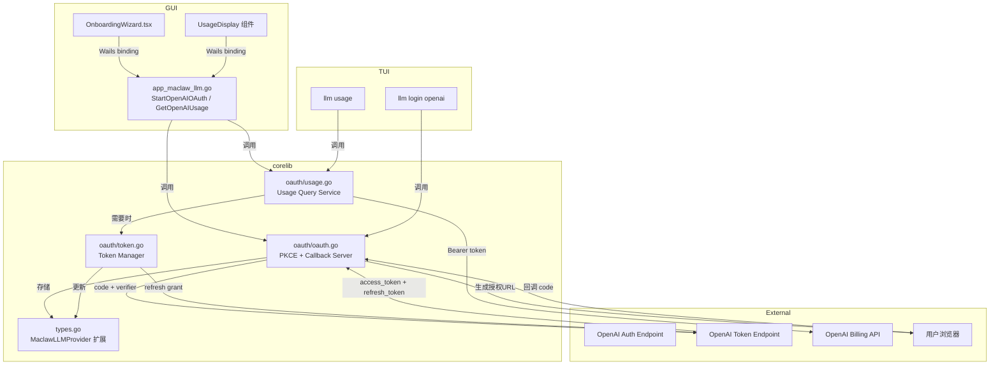

# 设计文档：OpenAI OAuth Provider

## 概述

本设计为 MaClaw 桌面应用（GUI + TUI）新增 OpenAI OAuth PKCE 登录能力。核心思路是复用 Codex CLI 的 OAuth `client_id`，通过标准 OAuth 2.0 PKCE 流程在本地浏览器完成授权，获取 `access_token` 和 `refresh_token`。token 存储在现有 `MaclawLLMProvider` 结构体中（扩展 3 个字段），过期时自动刷新，用户无感。同时在 GUI 设置页和 TUI 终端提供 OpenAI 用量查询功能。

### 关键设计决策

1. **复用 Codex CLI client_id**：避免申请新的 OAuth 应用，降低审批成本
2. **access_token 存入 Key 字段**：现有 `DoSimpleLLMRequest` 已使用 `cfg.Key` 作为 Bearer token，无需修改请求逻辑
3. **corelib/oauth 独立包**：OAuth 流程与 GUI/TUI 解耦，两端共享同一实现
4. **Token 刷新集成在请求前**：在 `DoSimpleLLMRequest` 调用前检查并刷新，而非后台定时刷新，简化并发控制

## 架构



### 数据流

1. 用户在 GUI/TUI 触发 OAuth 登录
2. `corelib/oauth` 生成 PKCE code_verifier/code_challenge
3. 构建授权 URL，打开系统浏览器
4. 本地 Callback Server 监听 `127.0.0.1:<port>/auth/callback`
5. 用户在浏览器完成授权，OpenAI 回调携带 `code`
6. 用 `code` + `code_verifier` 换取 token
7. token 写入 `MaclawLLMProvider`（Key/RefreshToken/TokenExpiresAt），持久化
8. 后续 LLM 请求前检查 token 过期，必要时自动刷新

## 组件与接口

### 1. `corelib/oauth/oauth.go` — OAuth PKCE 核心

```go
package oauth

// Config 包含 OAuth 流程的配置参数
type Config struct {
    ClientID            string // Codex CLI 的 client_id
    AuthEndpoint        string // https://auth.openai.com/oauth/authorize
    TokenEndpoint       string // https://auth.openai.com/oauth/token
    Scopes              []string
    CallbackPath        string // /auth/callback
    Timeout             time.Duration // 默认 120s
}

// TokenResult 是 OAuth 流程的返回结果
type TokenResult struct {
    AccessToken  string
    RefreshToken string
    ExpiresIn    int // 秒
}

// GenerateCodeVerifier 生成 43-128 字符的随机 code_verifier
func GenerateCodeVerifier() (string, error)

// GenerateCodeChallenge 对 code_verifier 做 SHA256 + Base64URL
func GenerateCodeChallenge(verifier string) string

// RunOAuthFlow 执行完整的 OAuth PKCE 流程：
// 1. 生成 PKCE 参数
// 2. 启动 Callback Server
// 3. 打开浏览器
// 4. 等待回调或超时
// 5. 用 code 换 token
// 返回 TokenResult 或 error
func RunOAuthFlow(cfg Config) (*TokenResult, error)
```

### 2. `corelib/oauth/callback.go` — 本地回调服务器

```go
// CallbackServer 管理本地 HTTP 回调服务器
type CallbackServer struct {
    listener net.Listener
    port     int
    codeCh   chan string
    errCh    chan error
}

// Start 在 127.0.0.1 上启动回调服务器，自动选择可用端口
func (s *CallbackServer) Start() error

// Port 返回实际监听的端口
func (s *CallbackServer) Port() int

// WaitForCode 阻塞等待授权码或超时
func (s *CallbackServer) WaitForCode(timeout time.Duration) (string, error)

// Stop 关闭服务器并释放端口
func (s *CallbackServer) Stop()
```

回调 HTML 页面：成功时显示 "授权成功，请返回 MaClaw"，3 秒后尝试 `window.close()`；失败时显示错误原因和重试建议。

### 3. `corelib/oauth/token.go` — Token Manager

```go
// NeedsRefresh 检查 provider 的 access_token 是否即将过期（过期前 5 分钟）
func NeedsRefresh(provider corelib.MaclawLLMProvider) bool

// RefreshAccessToken 使用 refresh_token 获取新的 access_token
func RefreshAccessToken(cfg Config, refreshToken string) (*TokenResult, error)

// EnsureValidToken 检查并在需要时刷新 token，返回更新后的 provider
// 如果刷新成功，调用 saveFn 持久化
func EnsureValidToken(provider corelib.MaclawLLMProvider, cfg Config, saveFn func(corelib.MaclawLLMProvider) error) (corelib.MaclawLLMProvider, error)
```

### 4. `corelib/oauth/usage.go` — Usage Query Service

```go
// UsageInfo 包含 OpenAI 账户用量信息
type UsageInfo struct {
    TotalGranted float64 `json:"total_granted"` // 总额度（美元）
    TotalUsed    float64 `json:"total_used"`    // 已用额度
    TotalAvailable float64 `json:"total_available"` // 剩余额度
}

// QueryUsage 使用 access_token 查询 OpenAI 账户用量
func QueryUsage(accessToken string) (*UsageInfo, error)
```

### 5. GUI 后端方法 (`gui/app_maclaw_llm.go` 扩展)

```go
// StartOpenAIOAuth 启动 OpenAI OAuth 流程，成功后自动保存 provider 配置
// 返回成功/失败信息给前端
func (a *App) StartOpenAIOAuth() (string, error)

// GetOpenAIUsage 查询当前 OpenAI provider 的用量信息
func (a *App) GetOpenAIUsage() (*oauth.UsageInfo, error)
```

### 6. GUI 前端变更 (`OnboardingWizard.tsx`)

- `LLMProvider` 接口新增 `auth_type?: string` 字段
- 当 `selectedProvider.auth_type === "oauth"` 时，显示 "使用 OpenAI 账号登录" 按钮替代 API Key 输入
- 点击按钮调用 `StartOpenAIOAuth()` Wails binding
- 显示 "等待浏览器授权..." 加载状态
- 成功/失败后显示对应提示

新增 `UsageDisplay` 组件（嵌入 LLM Config 设置区域）：
- 当前 provider 为 OAuth 类型时显示
- 调用 `GetOpenAIUsage()` 获取并展示剩余额度

### 7. TUI 命令扩展 (`tui/commands/llm.go`)

```go
// 新增子命令
case "login":
    return llmLogin(args[1:])  // llm login openai
case "usage":
    return llmUsage(args[1:])  // llm usage
```

- `llm login openai`：调用 `oauth.RunOAuthFlow`，成功后更新 provider 配置并设为当前
- `llm usage`：调用 `oauth.QueryUsage`，输出剩余额度/已用/总额度
- `llm providers`：显示 OAuth 认证状态（已认证/未认证/已过期）

## 数据模型

### MaclawLLMProvider 扩展

```go
type MaclawLLMProvider struct {
    Name          string `json:"name"`
    URL           string `json:"url"`
    Key           string `json:"key"`                        // access_token 也存这里
    Model         string `json:"model"`
    Protocol      string `json:"protocol,omitempty"`
    ContextLength int    `json:"context_length,omitempty"`
    IsCustom      bool   `json:"is_custom,omitempty"`
    // ── 新增 OAuth 字段 ──
    AuthType       string `json:"auth_type,omitempty"`        // "api_key"(默认) | "oauth"
    RefreshToken   string `json:"refresh_token,omitempty"`
    TokenExpiresAt int64  `json:"token_expires_at,omitempty"` // Unix 时间戳
}
```

向后兼容：`AuthType` 为空时视为 `"api_key"`，新增字段均使用 `omitempty`，不影响现有 JSON 序列化。

### defaultMaclawLLMProviders 更新

```go
func defaultMaclawLLMProviders() []MaclawLLMProvider {
    return []MaclawLLMProvider{
        {Name: "OpenAI", URL: "https://api.openai.com/v1", Model: "gpt-4o", AuthType: "oauth", ContextLength: 128000},
        {Name: "智谱", URL: "https://open.bigmodel.cn/api/paas/v4", Model: "glm-5-turbo", ContextLength: 180000},
        {Name: "MiniMax", URL: "https://api.minimaxi.com/v1", Model: "MiniMax-M2.7", ContextLength: 128000},
        {Name: "Custom1", URL: "", Model: "", IsCustom: true},
        {Name: "Custom2", URL: "", Model: "", IsCustom: true},
    }
}
```

### OAuth 常量

```go
const (
    OpenAIClientID      = "..." // Codex CLI 的 client_id
    OpenAIAuthEndpoint  = "https://auth.openai.com/oauth/authorize"
    OpenAITokenEndpoint = "https://auth.openai.com/oauth/token"
    TokenRefreshMargin  = 5 * time.Minute // 过期前 5 分钟触发刷新
)
```

### Callback HTML 模板

成功页面：
```html
<!DOCTYPE html>
<html><head><meta charset="utf-8"><title>MaClaw</title></head>
<body style="font-family:sans-serif;text-align:center;padding:60px">
  <h2>✅ 授权成功</h2>
  <p>请返回 MaClaw 继续使用。此页面将自动关闭。</p>
  <script>setTimeout(()=>window.close(),3000)</script>
</body></html>
```


## 正确性属性 (Correctness Properties)

*属性（Property）是在系统所有合法执行中都应成立的特征或行为——本质上是对系统应做什么的形式化陈述。属性是人类可读规格说明与机器可验证正确性保证之间的桥梁。*

### Property 1: MaclawLLMProvider JSON 序列化往返

*For any* MaclawLLMProvider 实例，将其序列化为 JSON 再反序列化回来，应得到与原始实例等价的结构体。当 AuthType、RefreshToken、TokenExpiresAt 为零值时，JSON 输出中不应包含这些字段。

**Validates: Requirements 1.1, 1.2, 1.3, 1.5**

### Property 2: AuthType 空值向后兼容

*For any* MaclawLLMProvider，当 AuthType 为空字符串时，`NeedsRefresh` 应返回 false（视为 api_key 类型，不需要 token 刷新）。

**Validates: Requirements 1.4**

### Property 3: NeedsRefresh 过期检测

*For any* MaclawLLMProvider（AuthType 为 "oauth"），当 TokenExpiresAt 距当前时间不足 5 分钟时 `NeedsRefresh` 应返回 true；当 TokenExpiresAt 距当前时间超过 5 分钟时应返回 false。

**Validates: Requirements 5.1**

### Property 4: code_verifier 符合 RFC 7636

*For any* 调用 `GenerateCodeVerifier()` 生成的 code_verifier，其长度应在 43-128 字符之间，且仅包含 unreserved 字符集 `[A-Za-z0-9\-._~]`。

**Validates: Requirements 3.1**

### Property 5: code_challenge 为 code_verifier 的 SHA256 Base64URL 编码

*For any* code_verifier 字符串，`GenerateCodeChallenge(verifier)` 的结果应等于 `base64url(sha256(verifier))`（无填充）。这是一个确定性变换，相同输入始终产生相同输出。

**Validates: Requirements 3.1, 3.2**

### Property 6: 授权 URL 包含所有必要参数

*For any* 有效的 OAuth Config，构建的授权 URL 应包含 `client_id`、`redirect_uri`、`response_type=code`、`code_challenge`、`code_challenge_method=S256`、`scope` 这些查询参数，且 URL 的 host 应为 `auth.openai.com`。

**Validates: Requirements 3.2**

### Property 7: TokenResult 正确应用到 Provider

*For any* TokenResult（包含 access_token、refresh_token、expires_in）和任意 MaclawLLMProvider，将 TokenResult 应用到 provider 后：Key 应等于 access_token，RefreshToken 应等于 refresh_token，TokenExpiresAt 应约等于 `now() + expires_in`（误差不超过 2 秒）。

**Validates: Requirements 4.1, 4.2, 4.3, 5.3**

### Property 8: 已保存的 provider 列表不被默认值覆盖

*For any* 非空的已保存 provider 列表，调用 GetMaclawLLMProviders 应返回该已保存列表（可能有 backfill），而非 defaultMaclawLLMProviders 的结果。

**Validates: Requirements 2.4**

## 错误处理

| 场景 | 处理方式 |
|------|---------|
| 默认端口被占用 | Callback Server 自动尝试其他端口（`:0` 让 OS 分配） |
| 浏览器授权超时（120s） | 关闭 Callback Server，返回超时错误，GUI/TUI 显示提示 |
| OAuth 回调携带 error 参数 | 解析 error + error_description，返回结构化错误 |
| Token 交换 HTTP 失败 | 返回 HTTP 状态码和响应体摘要 |
| Token 刷新失败 | 返回错误，提示用户重新 OAuth 登录 |
| refresh_token 为空 | 返回错误，提示用户重新 OAuth 登录 |
| Usage API 请求失败 | GUI 显示 "无法获取用量信息"，TUI 输出错误原因 |
| 非 OAuth provider 查询用量 | GUI 隐藏用量区域，TUI 输出 "当前 provider 不支持用量查询" |

## 测试策略

### 单元测试

- `GenerateCodeVerifier` 输出格式验证
- `GenerateCodeChallenge` 已知输入/输出对照（RFC 7636 附录 B 示例）
- `NeedsRefresh` 边界值：刚好过期、刚好未过期、AuthType 为空
- `BuildAuthURL` 参数完整性
- TokenResult 应用到 Provider 的字段映射
- Callback HTML 内容包含关键元素
- `defaultMaclawLLMProviders` 返回值检查（OpenAI 在首位、字段正确）
- Usage API 响应解析

### 属性测试 (Property-Based Testing)

使用 Go 的 `testing/quick` 或 `github.com/leanovate/gopter` 库。

每个属性测试至少运行 100 次迭代，使用随机生成的输入。

- **Feature: openai-oauth-provider, Property 1**: MaclawLLMProvider JSON 序列化往返
- **Feature: openai-oauth-provider, Property 2**: AuthType 空值向后兼容
- **Feature: openai-oauth-provider, Property 3**: NeedsRefresh 过期检测
- **Feature: openai-oauth-provider, Property 4**: code_verifier 符合 RFC 7636
- **Feature: openai-oauth-provider, Property 5**: code_challenge SHA256 Base64URL 确定性
- **Feature: openai-oauth-provider, Property 6**: 授权 URL 包含所有必要参数
- **Feature: openai-oauth-provider, Property 7**: TokenResult 正确应用到 Provider
- **Feature: openai-oauth-provider, Property 8**: 已保存的 provider 列表不被默认值覆盖

### 集成测试

- Callback Server 启动/停止/端口释放
- 完整 OAuth 流程（mock OpenAI token endpoint）
- Token 刷新流程（mock token endpoint）
- GUI Wails binding 调用链
- TUI 命令路由和输出格式
