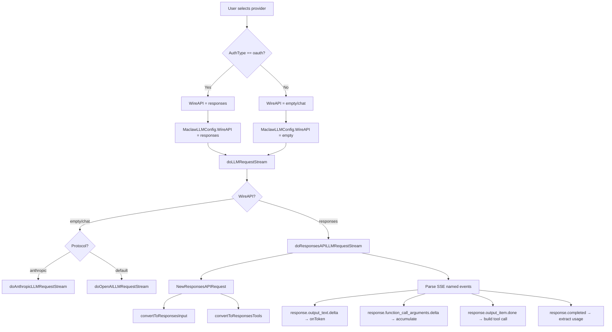

# Design Document: OpenAI Responses API Support

## Overview

This design adds OpenAI Responses API (`POST /v1/responses`) support to MaClaw, enabling OAuth-authenticated users to use their ChatGPT Plus/Pro subscription quota instead of API billing quota. The implementation follows the existing multi-protocol pattern established by the Anthropic protocol support: a new wire format branch in the request builder and streaming parser, selected by a `WireAPI` field on the config structs.

The key insight is that the Responses API uses a fundamentally different request/response schema from Chat Completions — different field names (`input` vs `messages`, `instructions` vs system role), different tool definition format (flat vs nested), and different SSE event types (named events like `response.output_text.delta` vs `data:` JSON chunks with `choices[0].delta`). However, the internal `llmResponse`/`llmMessage`/`llmToolCall` types remain unchanged — only the serialization layer differs.

### Design Decisions

1. **WireAPI field on both Provider and Config structs**: The `MaclawLLMProvider` gets a persisted `WireAPI` field; `MaclawLLMConfig` gets a runtime `WireAPI` field. For OAuth providers, this is auto-set to `"responses"`. This mirrors how `Protocol` already selects between OpenAI and Anthropic wire formats.

2. **New functions in `corelib/llm` package**: `NewResponsesAPIRequest` and `BuildResponsesAPIRequestData` parallel the existing `NewOpenAIChatRequest` / `BuildOpenAIChatRequestData`. Message conversion and tool format conversion are separate pure functions for testability.

3. **Streaming parser as a new method on `IMMessageHandler`**: `doResponsesAPILLMRequestStream` follows the same pattern as `doOpenAILLMRequestStream` and `doAnthropicLLMRequestStream`, with the SSE event routing adapted for the Responses API's named event types.

4. **Routing by WireAPI in `doLLMRequestStream`**: The existing dispatch point (`doLLMRequestStream`) gains a `WireAPI == "responses"` check before the existing `Protocol == "anthropic"` check.

## Architecture



## Components and Interfaces

### 1. Data Model Changes (`corelib/types.go`)

**MaclawLLMProvider** — add `WireAPI` field:
```go
type MaclawLLMProvider struct {
    // ... existing fields ...
    WireAPI string `json:"wire_api,omitempty"` // "chat" or "responses"; empty defaults to "chat"
}
```

**MaclawLLMConfig** — add `WireAPI` field:
```go
type MaclawLLMConfig struct {
    // ... existing fields ...
    WireAPI string `json:"wire_api,omitempty"` // "chat" or "responses"; empty defaults to "chat"
}
```

**Helper function** on `MaclawLLMConfig`:
```go
func (c MaclawLLMConfig) IsResponsesAPI() bool {
    return strings.EqualFold(strings.TrimSpace(c.WireAPI), "responses")
}
```

### 2. Request Builder (`corelib/llm/responses.go` — new file)

New functions parallel the existing Chat Completions builder:

```go
// ResponsesAPIRequestOptions controls how a Responses API request is built.
type ResponsesAPIRequestOptions struct {
    Stream    bool
    Tools     []map[string]interface{}
    ExtraBody map[string]interface{}
}

// BuildResponsesAPIRequestData constructs the endpoint URL and JSON body
// for a Responses API request.
func BuildResponsesAPIRequestData(
    cfg corelib.MaclawLLMConfig,
    messages []interface{},
    opts ResponsesAPIRequestOptions,
) (endpoint string, body []byte, err error)

// NewResponsesAPIRequest creates an *http.Request for the Responses API.
func NewResponsesAPIRequest(
    ctx context.Context,
    cfg corelib.MaclawLLMConfig,
    messages []interface{},
    opts ResponsesAPIRequestOptions,
) (*http.Request, []byte, string, error)
```

**Endpoint construction**: `strings.TrimRight(cfg.URL, "/") + "/responses"` — since `cfg.URL` already contains `/v1` (e.g. `https://api.openai.com/v1`), this produces `https://api.openai.com/v1/responses`.

### 3. Message Converter (`corelib/llm/responses_convert.go` — new file)

Pure functions for converting between internal message format and Responses API format:

```go
// ResponsesConvertedInput holds the result of converting OpenAI-style
// messages into Responses API input format.
type ResponsesConvertedInput struct {
    Instructions string        // extracted from system messages
    Input        []interface{} // Responses API input items
}

// ConvertToResponsesInput converts OpenAI-style conversation messages
// into Responses API input format.
func ConvertToResponsesInput(messages []interface{}) ResponsesConvertedInput

// ConvertToResponsesTools converts OpenAI Chat Completions tool definitions
// to Responses API tool format.
func ConvertToResponsesTools(tools []map[string]interface{}) []map[string]interface{}
```

**Message conversion rules**:

| Chat Completions format | Responses API format |
|---|---|
| `{role: "system", content: "..."}` | Extracted to `instructions` field (top-level, not in input array) |
| `{role: "user", content: "..."}` | `{type: "message", role: "user", content: [{type: "input_text", text: "..."}]}` |
| `{role: "assistant", content: "..."}` | `{type: "message", role: "assistant", content: [{type: "output_text", text: "..."}]}` |
| `{role: "assistant", tool_calls: [...]}` | One `{type: "function_call", call_id, name, arguments}` per tool call |
| `{role: "tool", tool_call_id: "...", content: "..."}` | `{type: "function_call_output", call_id: "...", output: "..."}` |

**Tool definition conversion**:

| Chat Completions format | Responses API format |
|---|---|
| `{type: "function", function: {name, description, parameters}}` | `{type: "function", name, description, parameters}` |

### 4. Streaming Parser (`gui/llm_stream_responses.go` — new file)

New method on `IMMessageHandler`:

```go
func (h *IMMessageHandler) doResponsesAPILLMRequestStream(
    reqCtx context.Context,
    cfg MaclawLLMConfig,
    messages []interface{},
    tools []map[string]interface{},
    httpClient *http.Client,
    onToken TokenCallback,
    metrics *llmStreamMetrics,
) (*llmResponse, error)
```

**SSE Event Handling**:

The Responses API uses named SSE events (`event:` + `data:` pairs) unlike Chat Completions which uses only `data:` lines. The parser reads two-line pairs:

```
event: response.output_text.delta
data: {"delta": "Hello", "item_id": "...", ...}
```

Key events handled:

| SSE Event | Action |
|---|---|
| `response.output_item.added` | Initialize per-item accumulator (track `type`, `item_id`, `call_id`, `name`) |
| `response.output_text.delta` | Extract `delta` field, pass to token callback |
| `response.function_call_arguments.delta` | Accumulate `delta` into function args buffer |
| `response.function_call_arguments.done` | Finalize function args (authoritative) |
| `response.output_item.done` | For `function_call` type items, construct `llmToolCall` |
| `response.completed` | Extract `response.usage` for token counts |
| `response.failed` | Extract error, return as error |
| `response.incomplete` | Return partial content with appropriate finish reason |

**Idle timeout**: Same `guiSSEIdleTimeout` (90s) watchdog pattern as existing OpenAI/Anthropic paths.

### 5. Non-Streaming Parser (`corelib/llm/responses_parse.go` — new file)

```go
// ParseNonStreamResponsesAPIResponse parses a non-streaming Responses API
// JSON response into the internal Response type.
func ParseNonStreamResponsesAPIResponse(resp *http.Response) (*Response, error)

// ParseNonStreamResponsesAPIBody parses a Responses API JSON body.
func ParseNonStreamResponsesAPIBody(body []byte) (*Response, error)
```

**Response structure mapping**:

```json
{
  "id": "resp_...",
  "output": [
    {
      "type": "message",
      "role": "assistant",
      "content": [{"type": "output_text", "text": "Hello!"}]
    },
    {
      "type": "function_call",
      "call_id": "call_...",
      "name": "bash",
      "arguments": "{...}"
    }
  ],
  "usage": {
    "input_tokens": 100,
    "output_tokens": 50,
    "total_tokens": 150
  }
}
```

Maps to internal types:
- `output[type=message].content[type=output_text].text` → `llmMessage.Content`
- `output[type=function_call]` → `llmToolCall{ID: call_id, Function: {Name: name, Arguments: arguments}}`
- `usage` → `llm.Usage{InputTokens, OutputTokens, TotalTokens}`

### 6. Config Propagation (`gui/app_maclaw_llm.go`)

**GetMaclawLLMConfig** modification — propagate WireAPI from provider:

```go
func (a *App) GetMaclawLLMConfig() MaclawLLMConfig {
    data := a.GetMaclawLLMProviders()
    for _, p := range data.Providers {
        if p.Name == data.Current {
            wireAPI := p.WireAPI
            if wireAPI == "" && p.AuthType == "oauth" {
                wireAPI = "responses"
            }
            return MaclawLLMConfig{
                // ... existing fields ...
                WireAPI: wireAPI,
            }
        }
    }
    return MaclawLLMConfig{}
}
```

### 7. Routing Changes (`gui/llm_stream.go`)

**doLLMRequestStream** — add WireAPI check:

```go
func (h *IMMessageHandler) doLLMRequestStream(
    reqCtx context.Context,
    cfg MaclawLLMConfig,
    messages []interface{},
    tools []map[string]interface{},
    httpClient *http.Client,
    onToken TokenCallback,
    metrics *llmStreamMetrics,
) (*llmResponse, error) {
    if onToken == nil {
        onToken = func(string) {}
    }
    if cfg.IsResponsesAPI() {
        return h.doResponsesAPILLMRequestStream(reqCtx, cfg, messages, tools, httpClient, withFirstTokenMetrics(onToken, metrics), metrics)
    }
    if cfg.Protocol == "anthropic" {
        return h.doAnthropicLLMRequestStream(...)
    }
    return h.doOpenAILLMRequestStream(...)
}
```

**doLLMRequest** (non-streaming in `im_llm_client.go`) — add WireAPI check:

```go
func (h *IMMessageHandler) doLLMRequest(cfg MaclawLLMConfig, messages []interface{}, tools []map[string]interface{}, httpClient *http.Client) (*llmResponse, error) {
    if cfg.IsResponsesAPI() {
        return h.doResponsesAPILLMRequest(cfg, messages, tools, httpClient)
    }
    if cfg.Protocol == "anthropic" {
        return h.doAnthropicLLMRequest(...)
    }
    return h.doOpenAILLMRequest(...)
}
```

### 8. Error Handling (`gui/llm_stream_responses.go`)

Responses API error classification function:

```go
func classifyResponsesAPIHTTPError(statusCode int, body []byte, endpoint, model string) string
```

| HTTP Status | Error Message |
|---|---|
| 401 | "OAuth token 已过期，请重新登录 OpenAI 账号 (HTTP 401)" |
| 429 | "ChatGPT 订阅额度已达上限，请稍后再试 (HTTP 429)" |
| 403 + insufficient_quota | "ChatGPT 订阅状态异常，请检查订阅是否有效 (HTTP 403)" |
| Other | "Responses API 错误 (HTTP {code}): {body} [url={endpoint} model={model}]" |

### 9. Connection Test (`gui/app_maclaw_llm.go`)

**TestMaclawLLM** — route to Responses API test for OAuth providers:

```go
func (a *App) TestMaclawLLM(cfg MaclawLLMConfig) (*MaclawLLMTestResult, error) {
    if cfg.IsResponsesAPI() {
        return a.testResponsesAPILLM(cfg.URL, cfg.Key, cfg.Model, cfg.UserAgent())
    }
    // ... existing protocol routing ...
}
```

**testResponsesAPILLM** sends a minimal Responses API request:
```json
{
  "model": "gpt-5.4",
  "input": [{"type": "message", "role": "user", "content": [{"type": "input_text", "text": "hello"}]}]
}
```

### 10. Codex Config Propagation (`corelib/configfile/codex.go`)

`WriteCodexConfig` already accepts and propagates `wireApi` parameter. No changes needed — the caller in `gui/app_maclaw_llm.go` just needs to pass the provider's `WireAPI` value.


## Data Models

### Responses API Request Body

```go
// responsesAPIRequestBody is the JSON structure sent to POST /v1/responses.
type responsesAPIRequestBody struct {
    Model        string        `json:"model"`
    Input        []interface{} `json:"input"`
    Instructions string        `json:"instructions,omitempty"`
    Stream       bool          `json:"stream"`
    Tools        []interface{} `json:"tools,omitempty"`
}
```

### Responses API Input Item Types

```go
// Message input item
{
    "type": "message",
    "role": "user" | "assistant",
    "content": [
        {"type": "input_text", "text": "..."} // for user
        // or
        {"type": "output_text", "text": "..."} // for assistant
    ]
}

// Function call input item (from assistant history)
{
    "type": "function_call",
    "call_id": "call_...",
    "name": "bash",
    "arguments": "{...}"
}

// Function call output input item (tool result)
{
    "type": "function_call_output",
    "call_id": "call_...",
    "output": "..."
}
```

### Responses API Tool Definition

```go
// Responses API tool format (flat, not nested)
{
    "type": "function",
    "name": "bash",
    "description": "Execute a shell command",
    "parameters": {
        "type": "object",
        "properties": { ... },
        "required": [...]
    }
}
```

### Responses API Response Body (Non-Streaming)

```go
// responsesAPIResponse is the JSON structure returned by POST /v1/responses.
type responsesAPIResponse struct {
    ID     string                    `json:"id"`
    Output []responsesAPIOutputItem  `json:"output"`
    Usage  *responsesAPIUsage        `json:"usage,omitempty"`
}

type responsesAPIOutputItem struct {
    Type      string                       `json:"type"` // "message" or "function_call"
    Role      string                       `json:"role,omitempty"`
    Content   []responsesAPIContentPart    `json:"content,omitempty"`
    CallID    string                       `json:"call_id,omitempty"`
    Name      string                       `json:"name,omitempty"`
    Arguments string                       `json:"arguments,omitempty"`
}

type responsesAPIContentPart struct {
    Type string `json:"type"` // "output_text"
    Text string `json:"text"`
}

type responsesAPIUsage struct {
    InputTokens  int `json:"input_tokens"`
    OutputTokens int `json:"output_tokens"`
    TotalTokens  int `json:"total_tokens"`
}
```

### SSE Event Structure (Streaming)

```go
// responsesSSEEvent represents a parsed SSE event from the Responses API stream.
type responsesSSEEvent struct {
    EventType string          // from "event:" line
    Data      json.RawMessage // from "data:" line
}

// Common data fields extracted per event type:
type responsesTextDelta struct {
    Delta        string `json:"delta"`
    ItemID       string `json:"item_id"`
    OutputIndex  int    `json:"output_index"`
    ContentIndex int    `json:"content_index"`
}

type responsesOutputItemAdded struct {
    OutputIndex int                    `json:"output_index"`
    Item        map[string]interface{} `json:"item"`
}

type responsesCompletedData struct {
    Response struct {
        Output []responsesAPIOutputItem `json:"output"`
        Usage  *responsesAPIUsage       `json:"usage"`
    } `json:"response"`
}
```

## Correctness Properties

*A property is a characteristic or behavior that should hold true across all valid executions of a system — essentially, a formal statement about what the system should do. Properties serve as the bridge between human-readable specifications and machine-verifiable correctness guarantees.*

### Property 1: WireAPI-based format selection

*For any* `MaclawLLMConfig`, if `WireAPI` is `"responses"` then the request builder SHALL produce a request body containing an `"input"` key (Responses API format), and if `WireAPI` is empty or `"chat"` then the request body SHALL contain a `"messages"` key (Chat Completions format).

**Validates: Requirements 1.4, 1.5, 9.1, 9.2**

### Property 2: Responses API request body structure

*For any* valid message array and model name, when building a Responses API request body, the result SHALL contain `"model"`, `"input"`, and `"stream"` keys, SHALL NOT contain a `"messages"` key, and the `"model"` value SHALL equal the configured model name.

**Validates: Requirements 2.1, 2.2, 2.4**

### Property 3: Responses API endpoint URL construction

*For any* base URL string, the Responses API endpoint SHALL equal `TrimRight(baseURL, "/") + "/responses"`, preserving the original URL path structure.

**Validates: Requirements 2.5**

### Property 4: Tool definition format conversion preserves semantics

*For any* valid Chat Completions tool definition `{type: "function", function: {name, description, parameters}}`, converting to Responses API format SHALL produce `{type: "function", name, description, parameters}` where `name`, `description`, and `parameters` are identical to the original values.

**Validates: Requirements 2.3, 5.1**

### Property 5: Message conversion preserves all roles and content

*For any* sequence of OpenAI Chat Completions messages containing system, user, assistant, and tool roles, converting to Responses API input format SHALL: (a) extract system content into the `instructions` field, (b) map each user message to an input item with `type: "message"` and `role: "user"`, (c) map each assistant text message to an input item with `type: "message"` and `role: "assistant"`, (d) map each assistant tool_call to a `type: "function_call"` input item preserving `call_id`, `name`, and `arguments`, and (e) map each tool result to a `type: "function_call_output"` input item preserving `call_id` and `output`.

**Validates: Requirements 5.2, 10.1, 10.2, 10.3, 10.4**

### Property 6: Non-streaming response parsing extracts all content

*For any* valid Responses API JSON response body containing message output items and/or function_call output items and usage data, parsing SHALL produce an `llmResponse` where: (a) text content from `output_text` parts is concatenated into `Message.Content`, (b) each `function_call` output item maps to an `llmToolCall` with matching `ID`/`call_id`, `Function.Name`/`name`, and `Function.Arguments`/`arguments`, and (c) usage tokens match the source values.

**Validates: Requirements 4.1, 4.2, 4.3, 5.3**

### Property 7: Streaming SSE parse produces correct llmResponse

*For any* valid Responses API SSE event sequence containing text deltas and/or function call argument deltas followed by a `response.completed` event, parsing SHALL produce an `llmResponse` where: (a) concatenated text deltas equal the final `Message.Content`, (b) concatenated argument deltas for each function call equal the final `Function.Arguments`, and (c) usage from the completed event is preserved.

**Validates: Requirements 3.1, 3.2, 3.3, 3.4, 3.5**

### Property 8: WireAPI propagation from provider AuthType

*For any* `MaclawLLMProvider`, if `AuthType` is `"oauth"` and `WireAPI` is empty, then the derived `MaclawLLMConfig.WireAPI` SHALL be `"responses"`. If `AuthType` is not `"oauth"` and `WireAPI` is empty, then `MaclawLLMConfig.WireAPI` SHALL be empty (defaulting to Chat Completions).

**Validates: Requirements 6.1, 6.2**

### Property 9: Codex config wire_api propagation

*For any* non-empty `wireApi` string passed to `WriteCodexConfig`, the generated TOML output SHALL contain a line matching `wire_api = "{wireApi}"` within the provider section.

**Validates: Requirements 6.4**

## Error Handling

### HTTP Error Classification

The Responses API error handler (`classifyResponsesAPIHTTPError`) maps HTTP status codes to user-friendly Chinese error messages, following the same pattern as the existing `classifyOpenAIHTTPError`:

| Condition | Error Message | Recovery Action |
|---|---|---|
| HTTP 401 | "OAuth token 已过期，请重新登录 OpenAI 账号" | Trigger re-authentication flow |
| HTTP 429 | "ChatGPT 订阅额度已达上限，请稍后再试" | Wait and retry |
| HTTP 403 + `insufficient_quota` | "ChatGPT 订阅状态异常，请检查订阅是否有效" | Check subscription |
| HTTP 403 (other) | "OpenAI 拒绝访问" | Check account status |
| `response.failed` SSE event | Extract `error.message` from event data | Display to user |
| `response.incomplete` SSE event | Extract `incomplete_details.reason` | Display partial result + reason |
| SSE idle timeout (90s) | "SSE stream idle timeout" | Retry (retryable error) |
| Other HTTP errors | Include endpoint URL and model in message | Debug info for user |

### SSE Stream Error Recovery

- **Idle timeout**: Same 90-second watchdog as existing OpenAI/Anthropic paths. If no SSE data arrives within the timeout, close the connection and return a retryable error so the agent loop can re-attempt.
- **Partial content**: If the stream is interrupted after receiving some content/tool calls, return the partial result rather than an error (same behavior as existing paths).
- **`response.failed` event**: Parse the error from the event data and return it as a non-retryable error.
- **`response.incomplete` event**: Return partial content with finish reason `"length"` (analogous to `max_tokens` in Chat Completions).

### Tool Call Argument Size Limit

Same `guiMaxToolArgumentsBytes` (180KB) limit applies to Responses API function call arguments, consistent with existing OpenAI and Anthropic paths.

## Testing Strategy

### Property-Based Tests (using `testing/quick` or `rapid`)

Each correctness property maps to a property-based test with minimum 100 iterations:

1. **Property 1-2**: Generate random `MaclawLLMConfig` (varying `WireAPI`, `Model`, `URL`) and random message arrays. Build request data via both `BuildOpenAIChatRequestData` and `BuildResponsesAPIRequestData`. Verify the correct function is selected based on `WireAPI` and that the body structure matches.

2. **Property 3**: Generate random URL strings (with/without trailing slashes, with/without `/v1` suffix). Verify endpoint construction.

3. **Property 4**: Generate random tool definitions with random names, descriptions, and parameter schemas. Convert and verify field preservation.

4. **Property 5**: Generate random multi-turn conversation sequences with mixed roles (system, user, assistant, assistant+tool_calls, tool). Convert and verify each item maps correctly.

5. **Property 6**: Generate random Responses API response JSON bodies with varying numbers of message and function_call output items. Parse and verify extraction.

6. **Property 7**: Generate random SSE event sequences (text deltas, function call argument deltas, completed events). Parse and verify the assembled `llmResponse`.

7. **Property 8**: Generate random `MaclawLLMProvider` configs with varying `AuthType` and `WireAPI`. Derive `MaclawLLMConfig` and verify `WireAPI` propagation.

8. **Property 9**: Generate random wire_api strings. Call `WriteCodexConfig` (or the TOML builder directly). Verify the output contains the wire_api value.

### Unit Tests (Example-Based)

- **Error classification**: Test each HTTP status code (401, 429, 403+insufficient_quota, 500) with specific response bodies.
- **Connection test routing**: Mock HTTP server returning Responses API format, verify test passes.
- **Vision probe routing**: Mock HTTP server, verify Responses API format is used for OAuth providers.
- **SSE idle timeout**: Mock a stalled SSE stream, verify timeout error is returned.
- **Backward compatibility**: Verify existing Chat Completions tests still pass unchanged.

### Integration Tests

- **End-to-end streaming**: Mock HTTP server returning a realistic Responses API SSE stream (text + tool calls + usage). Verify the full pipeline from `doLLMRequestStream` through filters to `llmResponse`.
- **Config round-trip**: Save a provider config with `WireAPI: "responses"`, reload, verify it persists correctly.
- **Codex config write**: Write config with `wireApi: "responses"`, read back TOML, verify structure.

### Test Configuration

- Property-based testing library: Go's `testing/quick` package (stdlib) or `pgregory.net/rapid` for more control over generators
- Minimum iterations per property test: 100
- Tag format: `// Feature: openai-responses-api, Property {N}: {title}`
