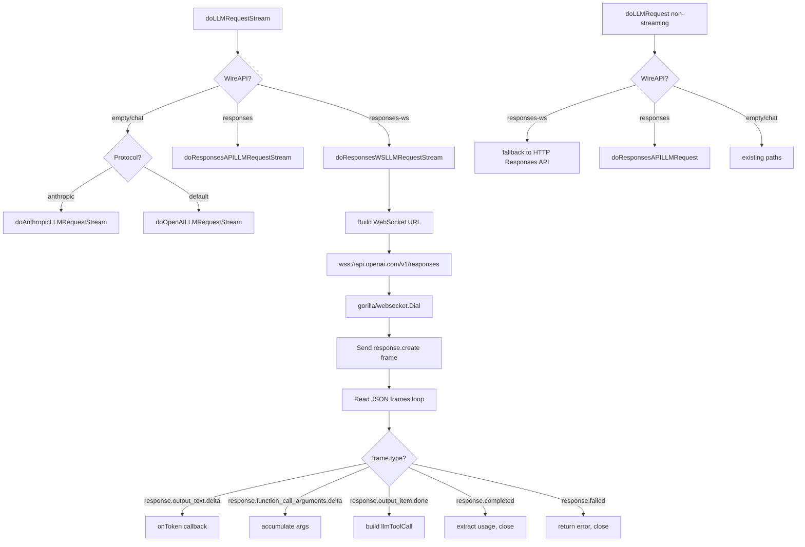

# Design Document: OpenAI Responses API WebSocket Transport

## Overview

This design adds WebSocket as an alternative streaming transport for the OpenAI Responses API in MaClaw. The existing HTTP+SSE Responses API implementation remains the default; WebSocket transport is opt-in via a new `WireAPI` value `"responses-ws"` on the provider configuration.

The WebSocket endpoint is `wss://api.openai.com/v1/responses` — the same path as the HTTP endpoint but over WebSocket. The client sends a `response.create` JSON frame to initiate a response, and the server streams back the same event types used in the SSE path (`response.output_text.delta`, `response.function_call_arguments.delta`, `response.completed`, etc.) as individual WebSocket text frames. Each frame is a JSON object with a `type` field that maps directly to the SSE `event:` name.

### Design Decisions

1. **New WireAPI value `"responses-ws"`**: Extends the existing `WireAPI` field (which already supports `""`, `"chat"`, `"responses"`) with a fourth value. The `IsResponsesWebSocket()` helper on `MaclawLLMConfig` checks for this value. This keeps the routing logic clean — one new check before the existing `IsResponsesAPI()` check.

2. **Reuse existing conversion functions**: `ConvertToResponsesInput` and `ConvertToResponsesTools` from `corelib/llm/responses_convert.go` are reused unchanged. The WebSocket frame body is identical to the HTTP request body (minus `stream` field, plus `type: "response.create"`).

3. **Per-request WebSocket connections**: Each streaming request opens a new WebSocket connection, sends one `response.create` frame, reads response frames until `response.completed`/`response.failed`, then closes. This matches the existing per-request HTTP pattern and avoids connection pooling complexity. The OpenAI WebSocket mode supports sequential requests on a single connection, but connection reuse is a future optimization.

4. **gorilla/websocket library**: The codebase already uses `github.com/gorilla/websocket` extensively (hub client, QQ bot, browser CDP, etc.). Using the same library avoids adding a new dependency.

5. **Non-streaming fallback to HTTP**: WebSocket is streaming-only. Non-streaming requests (connection tests, vision probes) for `"responses-ws"` providers fall back to the HTTP Responses API path, treating them as `"responses"` for those calls.

6. **Same event handling logic**: The WebSocket frame parser reuses the same accumulator pattern (`responsesItemAccum`) and event dispatch logic as the SSE parser. The only difference is the transport layer — reading JSON frames from a WebSocket instead of parsing `event:`/`data:` lines from an SSE stream.

## Architecture



## Components and Interfaces

### 1. Data Model Changes (`corelib/types.go`)

Add `IsResponsesWebSocket()` helper method on `MaclawLLMConfig`:

```go
// IsResponsesWebSocket reports whether this config targets the OpenAI
// Responses API over WebSocket transport.
func (c MaclawLLMConfig) IsResponsesWebSocket() bool {
    return strings.EqualFold(strings.TrimSpace(c.WireAPI), "responses-ws")
}
```

Update `IsResponsesAPI()` to also match `"responses-ws"` so that non-streaming fallback paths work:

```go
func (c MaclawLLMConfig) IsResponsesAPI() bool {
    w := strings.ToLower(strings.TrimSpace(c.WireAPI))
    return w == "responses" || w == "responses-ws"
}
```

No new fields are needed on `MaclawLLMProvider` or `MaclawLLMConfig` — the existing `WireAPI` field accepts the new `"responses-ws"` value.

### 2. WebSocket URL Construction (`gui/llm_stream_responses_ws.go`)

```go
// responsesWSEndpoint converts an HTTP base URL to a WebSocket URL for the
// Responses API WebSocket mode.
// Example: "https://api.openai.com/v1" → "wss://api.openai.com/v1/responses"
func responsesWSEndpoint(baseURL string) string {
    u := strings.TrimRight(baseURL, "/")
    u = strings.Replace(u, "https://", "wss://", 1)
    u = strings.Replace(u, "http://", "ws://", 1)
    return u + "/responses"
}
```

### 3. WebSocket Streaming Function (`gui/llm_stream_responses_ws.go` — new file)

New method on `IMMessageHandler`:

```go
func (h *IMMessageHandler) doResponsesWSLLMRequestStream(
    reqCtx context.Context,
    cfg MaclawLLMConfig,
    messages []interface{},
    tools []map[string]interface{},
    httpClient *http.Client,
    onToken TokenCallback,
    metrics *llmStreamMetrics,
) (*llmResponse, error)
```

This function:

1. **Constructs the WebSocket URL** via `responsesWSEndpoint(cfg.URL)`
2. **Dials the WebSocket** using `gorilla/websocket.Dialer` with:
   - `HandshakeTimeout` set to `cfg.EffectiveTimeoutSec()`
   - Request headers: `Authorization: Bearer {key}`, `User-Agent: {agent}`
   - TLS config from the existing HTTP client's transport (if available)
3. **Sends the `response.create` frame** as a single JSON text message:
   ```json
   {
     "type": "response.create",
     "model": "gpt-5.4",
     "input": [...],
     "instructions": "...",
     "tools": [...],
     "store": false
   }
   ```
   The `input`, `instructions`, and `tools` fields are built using the existing `ConvertToResponsesInput` and `ConvertToResponsesTools` functions.
4. **Reads response frames** in a loop using `conn.ReadMessage()`, parsing each as JSON and dispatching on the `type` field
5. **Closes the connection** via `conn.WriteMessage(websocket.CloseMessage, ...)` followed by `conn.Close()` in a deferred block

### 4. WebSocket Frame Parsing

Each WebSocket text frame is a JSON object with a `type` field. The event types and their handling are identical to the SSE path:

| Frame `type` | Action |
|---|---|
| `response.output_item.added` | Initialize per-item accumulator (track `itemType`, `callID`, `name`) |
| `response.output_text.delta` | Extract `delta`, pass to token callback via filter chain |
| `response.function_call_arguments.delta` | Accumulate `delta` into per-item args buffer |
| `response.function_call_arguments.done` | Replace accumulated args with authoritative final value |
| `response.output_item.done` | No-op (items finalized when building response) |
| `response.completed` | Extract `response.usage`, break read loop |
| `response.failed` | Extract error message, return non-retryable error |
| `response.incomplete` | Set finish reason to `"length"`, break read loop |
| `error` | Extract error details, return error |

The same token filter chain (think filter → func call filter → tool call filter) is applied, and the same `guiMaxToolArgumentsBytes` (180KB) limit is enforced.

### 5. Idle Timeout and Heartbeat (`gui/llm_stream_responses_ws.go`)

**Idle detection**: A `time.Timer` with `guiSSEIdleTimeout` (90s) is reset on each received frame. If the timer fires, the connection is closed and a retryable error is returned.

**Ping/pong**: gorilla/websocket automatically responds to server pings with pongs. The client sets a pong handler that resets the read deadline:

```go
conn.SetPongHandler(func(string) error {
    idleTimer.Reset(guiSSEIdleTimeout)
    return nil
})
```

A background goroutine sends periodic ping frames (every 30s) to keep the connection alive through proxies and detect dead connections:

```go
go func() {
    ticker := time.NewTicker(30 * time.Second)
    defer ticker.Stop()
    for {
        select {
        case <-ticker.C:
            conn.WriteControl(websocket.PingMessage, nil, time.Now().Add(5*time.Second))
        case <-done:
            return
        }
    }
}()
```

### 6. Routing Changes

**`gui/llm_stream.go` — `doLLMRequestStream`**:

```go
func (h *IMMessageHandler) doLLMRequestStream(...) (*llmResponse, error) {
    if onToken == nil {
        onToken = func(string) {}
    }
    if cfg.IsResponsesWebSocket() {
        return h.doResponsesWSLLMRequestStream(reqCtx, cfg, messages, tools, httpClient, withFirstTokenMetrics(onToken, metrics), metrics)
    }
    if cfg.IsResponsesAPI() {
        return h.doResponsesAPILLMRequestStream(...)
    }
    // ... existing anthropic/openai paths
}
```

The `IsResponsesWebSocket()` check comes first. Since `IsResponsesAPI()` now also matches `"responses-ws"`, the non-streaming `doLLMRequest` in `gui/im_llm_client.go` automatically falls back to the HTTP Responses API path for non-streaming calls — no changes needed there.

**`gui/app_maclaw_llm.go` — `GetMaclawLLMConfig`**: No changes needed. The existing code reads `WireAPI` from the provider and passes it through. The `"responses-ws"` value flows through unchanged.

**`gui/app_maclaw_llm.go` — `TestMaclawLLM`**: No changes needed. `IsResponsesAPI()` now matches both `"responses"` and `"responses-ws"`, so connection tests and vision probes use the HTTP Responses API path for both.

### 7. WebSocket Error Handling

**Handshake errors**: The `gorilla/websocket.Dialer.DialContext` returns the HTTP response from the handshake. Error classification reuses `classifyResponsesAPIHTTPError`:

```go
conn, resp, err := dialer.DialContext(reqCtx, wsURL, headers)
if err != nil {
    if resp != nil {
        body, _ := io.ReadAll(io.LimitReader(resp.Body, 4096))
        return nil, fmt.Errorf("%s", classifyResponsesAPIHTTPError(resp.StatusCode, body, wsURL, cfg.Model))
    }
    return nil, fmt.Errorf("WebSocket dial failed: %w [url=%s]", err, wsURL)
}
```

**In-stream errors**: The `error` frame type (distinct from `response.failed`) handles protocol-level errors like `previous_response_not_found` and `websocket_connection_limit_reached`:

```go
case "error":
    var errFrame struct {
        Status int `json:"status"`
        Error  struct {
            Code    string `json:"code"`
            Message string `json:"message"`
        } `json:"error"`
    }
    // ... parse and return error
```

**Connection close**: Unexpected close codes are captured via `websocket.IsCloseError` and included in the error message.

### 8. `response.create` Frame Construction

A new helper builds the WebSocket request frame:

```go
// buildResponsesWSFrame constructs the JSON frame for a response.create
// WebSocket message, reusing the existing conversion functions.
func buildResponsesWSFrame(
    cfg MaclawLLMConfig,
    messages []interface{},
    tools []map[string]interface{},
) ([]byte, error) {
    converted := llm.ConvertToResponsesInput(messages)
    frame := map[string]interface{}{
        "type":  "response.create",
        "model": cfg.Model,
        "input": converted.Input,
        "store": false,
    }
    if converted.Instructions != "" {
        frame["instructions"] = converted.Instructions
    }
    if convTools := llm.ConvertToResponsesTools(tools); len(convTools) > 0 {
        frame["tools"] = convTools
    }
    return json.Marshal(frame)
}
```

## Data Models

### WebSocket Request Frame (`response.create`)

```json
{
  "type": "response.create",
  "model": "gpt-5.4",
  "store": false,
  "input": [
    {"type": "message", "role": "user", "content": [{"type": "input_text", "text": "hello"}]}
  ],
  "instructions": "You are a helpful assistant.",
  "tools": [
    {"type": "function", "name": "bash", "description": "...", "parameters": {...}}
  ]
}
```

### WebSocket Response Frames

Each frame is a JSON object with a `type` field. The structure is identical to the SSE event `data:` payloads from the HTTP path:

**Text delta**:
```json
{"type": "response.output_text.delta", "delta": "Hello", "item_id": "item_...", "output_index": 0, "content_index": 0}
```

**Function call arguments delta**:
```json
{"type": "response.function_call_arguments.delta", "delta": "{\"co", "output_index": 1, "item_id": "item_..."}
```

**Response completed**:
```json
{
  "type": "response.completed",
  "response": {
    "id": "resp_...",
    "output": [...],
    "usage": {"input_tokens": 100, "output_tokens": 50, "total_tokens": 150}
  }
}
```

**Error frame**:
```json
{
  "type": "error",
  "status": 400,
  "error": {"code": "previous_response_not_found", "message": "..."}
}
```

### Reused Data Types

The following types from the existing HTTP+SSE implementation are reused without modification:
- `responsesItemAccum` — per-output-item accumulator for function call args
- `llmResponse`, `llmMessage`, `llmToolCall` — internal response types
- `llm.Usage` — token usage statistics
- `llmStreamMetrics` — streaming performance metrics


## Correctness Properties

*A property is a characteristic or behavior that should hold true across all valid executions of a system — essentially, a formal statement about what the system should do. Properties serve as the bridge between human-readable specifications and machine-verifiable correctness guarantees.*

### Property 1: WireAPI classification

*For any* string value of `WireAPI`, `IsResponsesWebSocket()` SHALL return true if and only if the trimmed, lowercased value equals `"responses-ws"`. Additionally, `IsResponsesAPI()` SHALL return true if and only if the trimmed, lowercased value equals `"responses"` or `"responses-ws"`. For empty strings and `"chat"`, both methods SHALL return false.

**Validates: Requirements 1.1, 1.2, 1.3, 1.4, 11.1, 11.2, 12.1**

### Property 2: WebSocket URL construction

*For any* base URL string, `responsesWSEndpoint(baseURL)` SHALL produce a URL where: (a) `https://` is replaced with `wss://`, (b) `http://` is replaced with `ws://`, (c) trailing slashes are removed before appending, and (d) the path ends with `/responses`.

**Validates: Requirements 2.1**

### Property 3: WebSocket request frame structure

*For any* valid message array, model name, and tool definitions, `buildResponsesWSFrame` SHALL produce a JSON object where: (a) `type` equals `"response.create"`, (b) `model` equals the configured model name, (c) `input` matches the output of `ConvertToResponsesInput(messages).Input`, (d) `instructions` is present if and only if `ConvertToResponsesInput(messages).Instructions` is non-empty, (e) `tools` is present if and only if `ConvertToResponsesTools(tools)` returns a non-empty slice, and (f) `store` equals `false`.

**Validates: Requirements 3.1, 3.2, 3.3, 3.4, 9.1, 9.2, 10.1, 10.2, 10.3, 10.4**

### Property 4: WebSocket frame parsing produces correct llmResponse

*For any* valid sequence of WebSocket response frames containing text deltas and/or function call argument deltas followed by a `response.completed` frame, parsing SHALL produce an `llmResponse` where: (a) concatenated text deltas equal the final `Message.Content` (after filter stripping), (b) concatenated argument deltas for each function call equal the final `Function.Arguments`, (c) each function call's `ID`, `Function.Name` match the values from the `response.output_item.added` frame, and (d) usage from the completed frame is preserved.

**Validates: Requirements 4.1, 4.2, 4.3, 4.4, 4.5, 9.3, 13.4**

### Property 5: Transport equivalence

*For any* valid response event sequence, parsing the events as WebSocket JSON frames SHALL produce an identical `llmResponse` (same `Message.Content`, same `ToolCalls` with same `ID`/`Name`/`Arguments`, same `Usage`) as parsing the equivalent SSE `event:`/`data:` lines via the HTTP+SSE path.

**Validates: Requirements 9.4**

### Property 6: Partial content recovery on connection drop

*For any* prefix of a valid WebSocket frame sequence that includes at least one text delta or function call arguments delta, if the connection closes before a `response.completed` frame, the parser SHALL return a non-nil `llmResponse` containing the accumulated partial content rather than a nil response with an error.

**Validates: Requirements 5.3, 7.2**

## Error Handling

### WebSocket Handshake Errors

The WebSocket dialer returns the HTTP response from the upgrade handshake. Error classification reuses the existing `classifyResponsesAPIHTTPError` function for consistency with the HTTP+SSE path:

| Condition | Error Message | Recovery |
|---|---|---|
| HTTP 401 | "OAuth token 已过期，请重新登录 OpenAI 账号 (HTTP 401)" | Re-authenticate |
| HTTP 429 | "ChatGPT 订阅额度已达上限，请稍后再试 (HTTP 429)" | Wait and retry |
| HTTP 403 + `insufficient_quota` | "ChatGPT 订阅状态异常，请检查订阅是否有效 (HTTP 403)" | Check subscription |
| Network timeout / DNS failure | Retryable error (agent loop retries) | Automatic retry |
| HTTP 502/503/504 | Retryable error | Automatic retry |
| Other | "WebSocket dial failed: {error} [url={wsURL}]" | Debug info |

### In-Stream Errors

| Frame Type | Action |
|---|---|
| `response.failed` | Extract `error.message` and `error.code`, return non-retryable error |
| `error` (protocol-level) | Extract `error.code` and `error.message`, return error. Handles `previous_response_not_found`, `websocket_connection_limit_reached` |
| Unexpected close code | Include close code and reason in error message |
| Read error after partial content | Return partial content (same as HTTP+SSE path) |
| Read error with no content | Return error |

### Idle Timeout

Same 90-second `guiSSEIdleTimeout` watchdog as existing paths. If no WebSocket frame is received within the timeout, the connection is closed and a retryable error is returned so the agent loop can re-attempt.

### Tool Call Argument Size Limit

Same `guiMaxToolArgumentsBytes` (180KB) limit on accumulated function call arguments, consistent with HTTP+SSE path.

## Testing Strategy

### Property-Based Tests (using `testing/quick` or `pgregory.net/rapid`)

Each correctness property maps to a property-based test with minimum 100 iterations:

1. **Property 1 — WireAPI classification**: Generate random strings (including edge cases like mixed case, whitespace padding, empty strings, "responses", "responses-ws", "chat", "RESPONSES-WS"). Verify `IsResponsesWebSocket()` and `IsResponsesAPI()` return correct values.

2. **Property 2 — WebSocket URL construction**: Generate random URL strings with varying schemes (http/https), paths (with/without `/v1`), and trailing slashes. Verify `responsesWSEndpoint` produces correct `wss://` URL ending in `/responses`.

3. **Property 3 — Frame construction**: Generate random multi-turn conversation sequences (system/user/assistant/tool messages) and random tool definitions. Build frame via `buildResponsesWSFrame` and verify JSON structure matches expected format with correct field values.

4. **Property 4 — Frame parsing**: Generate random WebSocket frame sequences (output_item.added, output_text.delta, function_call_arguments.delta, function_call_arguments.done, output_item.done, response.completed). Parse and verify the assembled `llmResponse` has correct content, tool calls, and usage.

5. **Property 5 — Transport equivalence**: Generate random event sequences. Format them as both WebSocket JSON frames and SSE `event:`/`data:` lines. Parse via both paths and verify identical `llmResponse` output.

6. **Property 6 — Partial content recovery**: Generate random frame sequences, truncate at random points after at least one content frame. Verify the parser returns partial content rather than an error.

### Unit Tests (Example-Based)

- **Handshake error classification**: Test HTTP 401, 429, 403+insufficient_quota, 502/503/504 handshake responses with specific bodies. Verify error messages match the Chinese-language patterns from `classifyResponsesAPIHTTPError`.
- **`response.failed` frame handling**: Test with specific error payloads. Verify error extraction.
- **`error` frame handling**: Test `previous_response_not_found` and `websocket_connection_limit_reached` frames.
- **Unexpected close code**: Test with various WebSocket close codes (1006, 1011, etc.).
- **Idle timeout**: Mock a stalled WebSocket connection, verify timeout error.
- **Metrics population**: Verify `FirstTokenAt`, `FirstSSEWaitNanos`, `IdleTimeoutCount` are populated.

### Integration Tests

- **End-to-end streaming**: Mock WebSocket server returning a realistic frame sequence (text + tool calls + usage). Verify the full pipeline from `doResponsesWSLLMRequestStream` through filters to `llmResponse`.
- **Context cancellation**: Start a streaming request, cancel the context mid-stream, verify connection closes cleanly.
- **Non-streaming fallback**: Verify that `doLLMRequest` with WireAPI="responses-ws" uses the HTTP Responses API path.

### Backward Compatibility Tests

- Run existing `gui/llm_stream_test.go` and `gui/app_maclaw_llm_test.go` tests to confirm no regressions.
- Verify existing providers with WireAPI="" or WireAPI="responses" continue to work unchanged.

### Test Configuration

- Property-based testing library: Go's `testing/quick` or `pgregory.net/rapid`
- Minimum iterations per property test: 100
- Tag format: `// Feature: openai-ws-responses-api, Property {N}: {title}`
