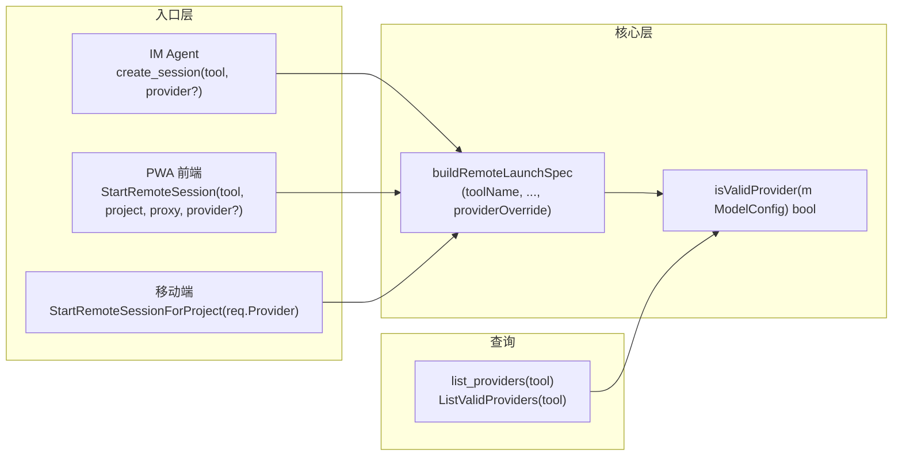

# 设计文档：编程会话启动时服务商选择

## 概述

本设计文档描述如何在 Maclaw 的多个会话启动入口（IM Agent、PWA/移动端、桌面端）统一支持服务商选择，并过滤无效服务商。设计基于现有 Go 代码库，在不破坏现有 API 的前提下进行增量扩展。

### 设计目标

1. 在 `buildRemoteLaunchSpec` 核心函数中增加 `providerOverride` 参数，作为所有入口的统一服务商覆盖机制
2. 提供 `isValidProvider` 统一判定函数，在所有服务商列举和选择场景中复用
3. IM Agent 的 `create_session` 工具增加 `provider` 可选参数
4. PWA/移动端的 `RemoteStartSessionRequest` 增加 `Provider` 字段
5. 新增 `list_providers` Agent 工具和 `ListValidProviders` Wails 绑定
6. PWA 前端在启动界面增加服务商下拉选择器

### 设计原则

- **向后兼容**：所有新增参数均为可选，默认行为与现有逻辑一致
- **单一职责**：`isValidProvider` 集中判定逻辑，避免散落在多处
- **最小改动**：复用现有 `ToolConfig`/`ModelConfig` 结构，不引入新的配置结构

## 架构

### 调用链变更

```
变更前:
  create_session(tool) → StartRemoteSessionForProject(req{Tool}) → buildRemoteLaunchSpec(tool, ...) → toolCfg.CurrentModel

变更后:
  create_session(tool, provider?) → StartRemoteSessionForProject(req{Tool, Provider}) → buildRemoteLaunchSpec(tool, ..., providerOverride) → providerOverride || toolCfg.CurrentModel
```

### 数据流




## 组件设计

### 1. `isValidProvider` 统一判定函数

文件：`remote_tool_catalog.go`

```go
// isValidProvider returns true when the ModelConfig represents a usable
// provider: either the built-in "Original" mode (which uses the tool's
// own authentication) or a third-party provider with a configured API key.
func isValidProvider(m ModelConfig) bool {
    if strings.EqualFold(m.ModelName, "original") {
        return true
    }
    return strings.TrimSpace(m.ApiKey) != ""
}

// validProviders returns only the usable providers from a ToolConfig.
func validProviders(tc ToolConfig) []ModelConfig {
    var out []ModelConfig
    for _, m := range tc.Models {
        if isValidProvider(m) {
            out = append(out, m)
        }
    }
    return out
}
```

### 2. `buildRemoteLaunchSpec` 签名变更

文件：`app.go`

```go
// 变更前
func (a *App) buildRemoteLaunchSpec(
    toolName string, config AppConfig,
    yoloMode bool, adminMode bool, pythonEnv string,
    projectDir string, useProxy bool,
) (LaunchSpec, error)

// 变更后 — 增加 providerOverride 参数
func (a *App) buildRemoteLaunchSpec(
    toolName string, config AppConfig,
    yoloMode bool, adminMode bool, pythonEnv string,
    projectDir string, useProxy bool,
    providerOverride string,  // 新增：非空时覆盖 toolCfg.CurrentModel
) (LaunchSpec, error)
```

核心逻辑变更：
```go
toolCfg := meta.ConfigSelector(config)

// 确定目标服务商名称
targetProvider := toolCfg.CurrentModel
if strings.TrimSpace(providerOverride) != "" {
    targetProvider = strings.TrimSpace(providerOverride)
}

// 在 Models 中查找
var selectedModel *ModelConfig
for _, m := range toolCfg.Models {
    if m.ModelName == targetProvider {
        model := m
        selectedModel = &model
        break
    }
}
if selectedModel == nil {
    return LaunchSpec{}, fmt.Errorf("provider %q not found for tool %s", targetProvider, tool)
}

// 有效性校验
if !isValidProvider(*selectedModel) {
    return LaunchSpec{}, fmt.Errorf("provider %q has no API key configured", targetProvider)
}
```

### 3. 所有调用方适配

所有现有调用方传 `""` 作为 `providerOverride`，保持原有行为：

| 调用方 | 文件 | 变更 |
|--------|------|------|
| `buildClaudeLaunchSpec` | `app.go` | 末尾加 `""` |
| `StartRemoteSession` | `remote_status.go` | 末尾加 `""` |
| `StartRemoteHandoffSession` | `remote_status.go` | 末尾加 `""` |
| `StartRemoteSessionForProject` | `remote_mobile_launch.go` | 传 `req.Provider` |
| 桌面端 launch | `app.go:2437` | 末尾加 `""` |
| readiness/smoke | `remote_diagnostics.go` | 末尾加 `""` |
| 测试文件 | `remote_status_test.go` | 末尾加 `""` |

### 4. `RemoteStartSessionRequest` 增加 Provider 字段

文件：`remote_mobile_launch.go`

```go
type RemoteStartSessionRequest struct {
    Tool        string `json:"tool"`
    ProjectID   string `json:"project_id,omitempty"`
    ProjectPath string `json:"project_path,omitempty"`
    Provider    string `json:"provider,omitempty"`     // 新增：服务商名称覆盖
    UseProxy    *bool  `json:"use_proxy,omitempty"`
    YoloMode    *bool  `json:"yolo_mode,omitempty"`
    AdminMode   *bool  `json:"admin_mode,omitempty"`
    PythonEnv   string `json:"python_env,omitempty"`
}
```

`StartRemoteSessionForProject` 中传递：
```go
spec, err := a.buildRemoteLaunchSpec(tool, cfg, yoloMode, adminMode, pythonEnv, project.Path, useProxy, req.Provider)
```

### 5. `create_session` 工具增加 provider 参数

文件：`im_message_handler.go`

工具定义变更：
```go
toolDef("create_session", "创建新的远程会话。可指定 provider 选择服务商。",
    map[string]interface{}{
        "tool":         map[string]string{"type": "string", "description": "工具名称，如 claude, codex, cursor, gemini, opencode"},
        "project_path": map[string]string{"type": "string", "description": "项目路径（可选）"},
        "provider":     map[string]string{"type": "string", "description": "服务商名称（可选，如 Original, DeepSeek, 百度千帆）。不指定则使用桌面端当前选中的服务商"},
    }, []string{"tool"}),
```

`toolCreateSession` 处理器变更：
```go
func (h *IMMessageHandler) toolCreateSession(args map[string]interface{}) string {
    tool, _ := args["tool"].(string)
    projectPath, _ := args["project_path"].(string)
    provider, _ := args["provider"].(string)  // 新增
    // ...
    view, err := h.app.StartRemoteSessionForProject(RemoteStartSessionRequest{
        Tool: tool, ProjectPath: projectPath, Provider: provider,  // 传递 provider
    })
    // ...
}
```

### 6. `list_providers` 新工具

文件：`im_message_handler.go`

```go
toolDef("list_providers", "列出指定编程工具的所有可用服务商（已过滤未配置的空服务商）",
    map[string]interface{}{
        "tool": map[string]string{"type": "string", "description": "工具名称，如 claude, codex, gemini"},
    }, []string{"tool"}),
```

处理器：
```go
func (h *IMMessageHandler) toolListProviders(args map[string]interface{}) string {
    toolName, _ := args["tool"].(string)
    if toolName == "" {
        return "缺少 tool 参数"
    }
    cfg, err := h.app.LoadConfig()
    if err != nil {
        return fmt.Sprintf("加载配置失败: %s", err.Error())
    }
    toolCfg, err := remoteToolConfig(cfg, toolName)
    if err != nil {
        return fmt.Sprintf("不支持的工具: %s", toolName)
    }
    valid := validProviders(toolCfg)
    if len(valid) == 0 {
        return fmt.Sprintf("工具 %s 没有可用的服务商，请在桌面端配置", toolName)
    }
    var b strings.Builder
    b.WriteString(fmt.Sprintf("工具 %s 的可用服务商:\n", toolName))
    for _, m := range valid {
        isDefault := ""
        if m.ModelName == toolCfg.CurrentModel {
            isDefault = " [当前默认]"
        }
        modelId := m.ModelId
        if len(modelId) > 20 {
            modelId = modelId[:20] + "..."
        }
        b.WriteString(fmt.Sprintf("  - %s (model_id=%s)%s\n", m.ModelName, modelId, isDefault))
    }
    return b.String()
}
```

### 7. `ListValidProviders` Wails 绑定

文件：`remote_status.go`

```go
type ProviderView struct {
    Name      string `json:"name"`
    ModelID   string `json:"model_id"`
    IsDefault bool   `json:"is_default"`
}

func (a *App) ListValidProviders(toolName string) ([]ProviderView, error) {
    cfg, err := a.LoadConfig()
    if err != nil {
        return nil, err
    }
    toolCfg, err := remoteToolConfig(cfg, toolName)
    if err != nil {
        return nil, err
    }
    valid := validProviders(toolCfg)
    out := make([]ProviderView, 0, len(valid))
    for _, m := range valid {
        out = append(out, ProviderView{
            Name:      m.ModelName,
            ModelID:   m.ModelId,
            IsDefault: m.ModelName == toolCfg.CurrentModel,
        })
    }
    return out, nil
}
```

### 8. PWA 前端服务商选择器

文件：`frontend/src/components/remote/useRemotePanel.ts`

- 新增 state: `selectedProvider: string`
- 工具切换时调用 `ListValidProviders(tool)` 刷新服务商列表
- `startRemoteSession` 和 `quickStartRemoteSession` 传递 `selectedProvider` 给 `StartRemoteSession`

文件：`remote_status.go` — `StartRemoteSession` 签名变更：
```go
// 变更前
func (a *App) StartRemoteSession(toolName, projectDir string, useProxy bool) (RemoteSessionView, error)

// 变更后
func (a *App) StartRemoteSession(toolName, projectDir string, useProxy bool, provider string) (RemoteSessionView, error)
```

## 正确性验证

| 属性 | 验证方式 |
|------|----------|
| P1: 判定一致性 | 单元测试 `TestIsValidProvider` 覆盖 Original/有Key/无Key 三种情况 |
| P2: 默认值保持 | 单元测试 `buildRemoteLaunchSpec` 传 `providerOverride=""` 验证使用 CurrentModel |
| P3: 覆盖生效 | 单元测试 `buildRemoteLaunchSpec` 传有效 provider 验证 LaunchSpec.ModelName 匹配 |
| P4: 无效不可启动 | 单元测试 `buildRemoteLaunchSpec` 传无效 provider 验证返回 error |
| P5: 列表过滤 | 单元测试 `validProviders` 验证返回列表不含无效服务商 |
