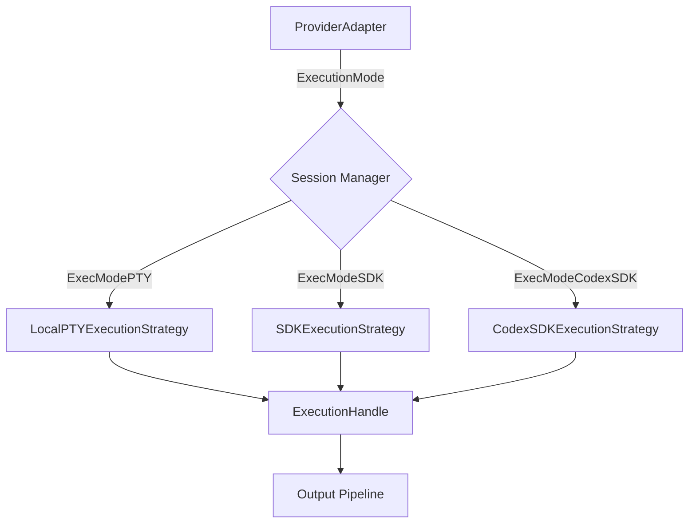
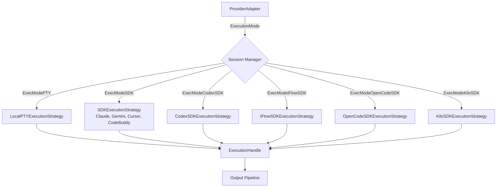

# Design Document: SDK Remote Integration

## Overview

本设计文档描述 MaClaw 桌面应用的工具集成改造，核心目标是：

1. **移除 Qoder 工具** — 从前端 UI（TOOL_NAMES、侧边栏、设置面板、翻译 key、图标）和后端 catalog 中完全清除 Qoder 引用
2. **添加 Cursor Agent 到前端** — 将 "cursor" 加入 TOOL_NAMES，使其在侧边栏和配置面板中可见
3. **SDK 模式升级** — 将 Gemini、Cursor、iFlow、OpenCode、Kilo 从 PTY 模式升级为各自的 SDK 模式
4. **远程模式限制** — 仅对具备 SDK 集成的工具开放远程模式，纯 PTY 工具（Kode）不支持远程
5. **前端远程 UI 隐藏** — 不支持远程的工具在启动区隐藏远程相关选项

当前系统中，Claude 和 Codex 已有成熟的 SDK 执行策略（`SDKExecutionStrategy` 和 `CodexSDKExecutionStrategy`）。其余工具均使用 `ExecModePTY`，通过 `LocalPTYExecutionStrategy` 启动。本次改造将为每种新协议引入独立的 `ExecutionMode` 常量和对应的 `ExecutionStrategy` 实现。

## Architecture

### 当前架构



### 目标架构



### 设计决策

**D1: Gemini、Cursor 和 CodeBuddy 复用 `ExecModeSDK` + `SDKExecutionStrategy`**

Gemini CLI 的 `--output-format stream-json`、Cursor Agent 的 `-p --output-format stream-json`、以及 CodeBuddy 的 `-p --output-format stream-json` 均产出与 Claude Code 兼容的 stream-json JSONL 事件流（init、assistant、result、stream_event 等类型）。因此这三个工具复用现有的 `ExecModeSDK` 和 `SDKExecutionStrategy`，无需新建执行策略。适配器只需修改 `ExecutionMode()` 返回值和 `BuildCommand()` 参数。CodeBuddy 需要新建 `ProviderAdapter` 并加入 `remoteToolCatalog`。

**D2: iFlow、OpenCode、Kilo 各自独立 ExecutionMode 和 ExecutionStrategy**

这三个工具的 SDK 协议各不相同：
- iFlow: ACP WebSocket 协议（`ws://localhost:<PORT>/acp`）
- OpenCode: HTTP server + SSE 事件流
- Kilo: HTTP server + SSE 事件流（OpenCode fork，协议相似但命令不同）

每种协议需要独立的连接管理、消息解析和生命周期处理，因此各自定义独立的 `ExecutionMode` 常量和 `ExecutionStrategy`。

**D3: Kode 保持 PTY 模式**

Kode 的 SDK 成熟度不足，保持 `ExecModePTY`，`SupportsRemote` 设为 false。

**D4: 远程模式基于 `SupportsRemote` 字段**

前端不再硬编码 `remoteCapableTools` 数组，而是从后端 `RemoteToolMetadataView.supports_remote` 字段动态判断。初始阶段仅 Claude、Codex、Gemini、Cursor 设为 `SupportsRemote: true`；iFlow、OpenCode、Kilo 初始设为 false，待远程稳定性验证后可更新。

## Components and Interfaces

### 1. ExecutionMode 常量扩展（`remote_sdk_types.go`）

新增三个常量：

```go
const (
    ExecModePTY         ExecutionMode = "pty"
    ExecModeSDK         ExecutionMode = "sdk"          // Claude, Gemini, Cursor, CodeBuddy
    ExecModeCodexSDK    ExecutionMode = "codex-sdk"
    ExecModeIFlowSDK    ExecutionMode = "iflow-sdk"    // NEW
    ExecModeOpenCodeSDK ExecutionMode = "opencode-sdk"  // NEW
    ExecModeKiloSDK     ExecutionMode = "kilo-sdk"      // NEW
)
```

### 2. ProviderAdapter 修改

| Tool      | 当前 ExecutionMode | 目标 ExecutionMode | BuildCommand 变更 |
|-----------|-------------------|-------------------|------------------|
| Gemini    | `ExecModePTY`     | `ExecModeSDK`     | 添加 `--output-format stream-json`；有 prompt 时添加 `-p` |
| Cursor    | `ExecModePTY`     | `ExecModeSDK`     | 添加 `-p --output-format stream-json`；移除 Cols/Rows |
| CodeBuddy | 无（新增 catalog） | `ExecModeSDK`     | 新建适配器；添加 `-p --output-format stream-json`；二进制名 `codebuddy`/`codebuddy-code` |
| iFlow     | `ExecModePTY`     | `ExecModeIFlowSDK`| 添加 `--experimental-acp --port <PORT>`；移除 Cols/Rows |
| OpenCode  | `ExecModePTY`     | `ExecModeOpenCodeSDK` | 配置 server 模式启动参数 |
| Kilo      | `ExecModePTY`     | `ExecModeKiloSDK` | 使用 `kilo serve` 子命令 |
| Kode      | `ExecModePTY`     | `ExecModePTY`（不变）| 无变更 |

### 3. 新增 ExecutionStrategy 实现

#### IFlowSDKExecutionStrategy（`remote_execution_iflow.go`）

```go
type IFlowSDKExecutionStrategy struct{}

func (s *IFlowSDKExecutionStrategy) Start(cmd CommandSpec) (ExecutionHandle, error)
```

- 启动 iFlow CLI 进程（带 `--experimental-acp --port <PORT>` 参数）
- 等待进程就绪后连接 `ws://localhost:<PORT>/acp` WebSocket
- 返回 `IFlowSDKExecutionHandle`

#### OpenCodeSDKExecutionStrategy（`remote_execution_opencode.go`）

```go
type OpenCodeSDKExecutionStrategy struct{}

func (s *OpenCodeSDKExecutionStrategy) Start(cmd CommandSpec) (ExecutionHandle, error)
```

- 启动 OpenCode server 进程
- 等待 HTTP server 就绪后连接 API endpoint
- 订阅 SSE 事件流
- 返回 `OpenCodeSDKExecutionHandle`

#### KiloSDKExecutionStrategy（`remote_execution_kilo.go`）

```go
type KiloSDKExecutionStrategy struct{}

func (s *KiloSDKExecutionStrategy) Start(cmd CommandSpec) (ExecutionHandle, error)
```

- 启动 `kilo serve` 进程
- 等待 HTTP server 就绪后连接 API endpoint
- 订阅 SSE 事件流
- 返回 `KiloSDKExecutionHandle`

### 4. 新增 ExecutionHandle 实现

每个新的 ExecutionHandle 必须实现 `ExecutionHandle` 接口：

```go
type ExecutionHandle interface {
    PID() int
    Write(data []byte) error
    Interrupt() error
    Kill() error
    Output() <-chan []byte
    Exit() <-chan PTYExit
    Close() error
}
```

#### IFlowSDKExecutionHandle

- `Write()`: 将用户文本封装为 ACP WebSocket 消息发送
- `Output()`: 解析 ACP WebSocket 消息（AssistantMessage、ToolCallMessage、PlanMessage、TaskFinishMessage），转换为人类可读文本
- `Close()`: 关闭 WebSocket 连接并终止进程

#### OpenCodeSDKExecutionHandle

- `Write()`: 通过 HTTP API 发送用户 prompt
- `Output()`: 订阅 SSE 事件流，解析事件并转换为人类可读文本
- `Close()`: 关闭 SSE 连接并终止 server 进程

#### KiloSDKExecutionHandle

- `Write()`: 通过 HTTP API 发送用户 prompt
- `Output()`: 订阅 SSE 事件流，解析事件并转换为人类可读文本
- `Close()`: 关闭 SSE 连接并终止 server 进程

### 5. Session Manager 路由扩展（`remote_session_manager.go`）

在 `Create()` 方法的 strategy selection switch 中添加新分支：

```go
switch provider.ExecutionMode() {
case ExecModeCodexSDK:
    strategy = NewCodexSDKExecutionStrategy()
case ExecModeSDK:
    strategy = NewSDKExecutionStrategy()
case ExecModeIFlowSDK:
    strategy = NewIFlowSDKExecutionStrategy()
case ExecModeOpenCodeSDK:
    strategy = NewOpenCodeSDKExecutionStrategy()
case ExecModeKiloSDK:
    strategy = NewKiloSDKExecutionStrategy()
default:
    // PTY fallback
}
```

同时为每种新 SDK handle 添加对应的 output loop（类似 `runSDKOutputLoop` 和 `runCodexSDKOutputLoop`）。

### 6. Tool Catalog 修改（`remote_tool_catalog.go`）

| Tool      | SupportsRemote 当前 | SupportsRemote 目标 |
|-----------|--------------------|--------------------|
| Claude    | true               | true               |
| Codex     | true               | true               |
| Gemini    | true               | true               |
| Cursor    | false              | true               |
| CodeBuddy | 无（新增 catalog） | true               |
| iFlow     | false              | false（初始）       |
| OpenCode  | false              | false（初始）       |
| Kilo      | false              | false（初始）       |
| Kode      | false              | false              |

移除 Qoder 条目（如果存在）。

### 7. 前端变更（`frontend/src/App.tsx`）

- **TOOL_NAMES**: 移除 `'qoder'`，添加 `'cursor'`
- **remoteCapableTools**: 移除硬编码数组，改为从后端 `RemoteToolMetadataView.supports_remote` 动态判断
- **侧边栏**: 移除 Qoder tab 渲染块，添加 Cursor Agent tab
- **设置面板**: 移除 Qoder visibility toggle
- **翻译 key**: 移除 `qoder`/`qoderDesc`，添加 `cursor`/`cursorDesc`
- **图标**: 移除 `qoderIcon` import 和图片资源引用
- **远程 UI 隐藏**: 当选中工具的 `supports_remote` 为 false 时，隐藏远程模式 toggle 和远程设置面板

### 8. 前端类型修改（`frontend/src/components/remote/types.ts`）

- `RemoteToolName` 类型：移除 `"qoder"`（如果存在），确认包含 `"cursor"`

## Data Models

### ExecutionMode 枚举（Go）

```go
type ExecutionMode string

const (
    ExecModePTY         ExecutionMode = "pty"
    ExecModeSDK         ExecutionMode = "sdk"
    ExecModeCodexSDK    ExecutionMode = "codex-sdk"
    ExecModeIFlowSDK    ExecutionMode = "iflow-sdk"
    ExecModeOpenCodeSDK ExecutionMode = "opencode-sdk"
    ExecModeKiloSDK     ExecutionMode = "kilo-sdk"
)
```

### RemoteToolMetadata（Go，已有结构体，字段不变）

```go
type RemoteToolMetadata struct {
    Name                  string
    DisplayName           string
    BinaryName            string
    DefaultTitle          string
    UsesOpenAICompat      bool
    RequiresSessionConfig bool
    SupportsProxy         bool
    SupportsRemote        bool   // 关键字段：控制远程模式可用性
    ReadinessHint         string
    SmokeHint             string
    ConfigSelector        func(AppConfig) ToolConfig
    ProviderFactory       func(*App) ProviderAdapter
}
```

### RemoteToolMetadataView（Go → JSON → TypeScript）

```go
type RemoteToolMetadataView struct {
    Name              string `json:"name"`
    DisplayName       string `json:"display_name"`
    SupportsRemote    bool   `json:"supports_remote"`  // 前端用此字段判断远程能力
    // ... 其他字段不变
}
```

### ACP WebSocket 消息类型（iFlow SDK）

```go
type ACPMessage struct {
    Type    string          `json:"type"`
    Payload json.RawMessage `json:"payload"`
}

type ACPAssistantMessage struct {
    Content string `json:"content"`
}

type ACPToolCallMessage struct {
    ToolName string      `json:"tool_name"`
    Input    interface{} `json:"input"`
}

type ACPTaskFinishMessage struct {
    Status  string `json:"status"`
    Summary string `json:"summary"`
}
```

### OpenCode/Kilo SSE 事件类型

```go
type SSEEvent struct {
    Event string `json:"event"`
    Data  string `json:"data"`
}
```

具体的 SSE 事件 payload 结构将在实现时根据 OpenCode/Kilo 的实际 API 文档确定。


## Correctness Properties

*A property is a characteristic or behavior that should hold true across all valid executions of a system — essentially, a formal statement about what the system should do. Properties serve as the bridge between human-readable specifications and machine-verifiable correctness guarantees.*

### Property 1: Session Manager routes ExecutionMode to correct strategy

*For any* tool registered in the `remoteToolCatalog`, when the Session Manager creates a session for that tool, the selected `ExecutionStrategy` type must correspond to the tool's `ExecutionMode()` return value: `ExecModeSDK` → `SDKExecutionStrategy`, `ExecModeCodexSDK` → `CodexSDKExecutionStrategy`, `ExecModeIFlowSDK` → `IFlowSDKExecutionStrategy`, `ExecModeOpenCodeSDK` → `OpenCodeSDKExecutionStrategy`, `ExecModeKiloSDK` → `KiloSDKExecutionStrategy`, `ExecModePTY` → `LocalPTYExecutionStrategy`.

**Validates: Requirements 3.4, 4.3, 5.3, 6.3, 7.3, 11.5**

### Property 2: Stream-json tools include required CLI arguments

*For any* valid `LaunchSpec`, when `BuildCommand()` is called on a `ProviderAdapter` that returns `ExecModeSDK` (Gemini, Cursor, or CodeBuddy), the resulting `CommandSpec.Args` must contain `"--output-format"` followed by `"stream-json"`. Additionally, for Cursor and CodeBuddy, the args must contain `"-p"`.

**Validates: Requirements 3.2, 3.3, 4.2, 4b.3**

### Property 3: SDK message-to-text conversion produces appropriate output

*For any* valid `SDKMessage` with type in {"assistant", "user", "result", "system"}, the `sdkMessageToText` function must return a non-empty string for assistant messages containing tool_use blocks, and must return an empty string for system init messages (to avoid duplication with status updates).

**Validates: Requirements 3.6, 4.5, 4b.6**

### Property 4: Exit code propagation through ExecutionHandle

*For any* SDK `ExecutionHandle` (SDK, Codex, iFlow, OpenCode, Kilo), when the underlying process terminates with exit code N, the `Exit()` channel must emit a `PTYExit` struct where `Code` points to N.

**Validates: Requirements 3.7, 5.6, 6.6, 7.6, 12.4**

### Property 5: iFlow ACP WebSocket message parsing

*For any* valid ACP WebSocket message of type AssistantMessage, ToolCallMessage, PlanMessage, or TaskFinishMessage, the iFlow SDK ExecutionHandle must convert it to a non-empty human-readable text line emitted on the `Output()` channel.

**Validates: Requirements 5.5**

### Property 6: OpenCode/Kilo SSE event parsing

*For any* valid SSE event emitted by an OpenCode or Kilo server, the corresponding SDK ExecutionHandle must parse the event and emit a non-empty human-readable text line on the `Output()` channel for meaningful events (assistant text, tool calls, task completion).

**Validates: Requirements 6.5, 7.5**

### Property 7: Write() delivers user input without error

*For any* SDK ExecutionHandle in an open (non-closed) state and any non-empty user text string, calling `Write()` must not return an error and must deliver the text to the underlying tool process using the tool-specific protocol (stream-json stdin for SDK, WebSocket for iFlow, HTTP API for OpenCode/Kilo).

**Validates: Requirements 5.7, 6.7, 12.3**

### Property 8: SupportsRemote consistency with ExecutionMode

*For any* tool in the `remoteToolCatalog`, if the tool's `SupportsRemote` field is true, then the tool's `ProviderAdapter.ExecutionMode()` must return a non-PTY mode (i.e., not `ExecModePTY`). Conversely, tools with `ExecModePTY` must have `SupportsRemote` set to false.

**Validates: Requirements 9.1, 9.2**

### Property 9: Remote session rejection for non-remote tools

*For any* tool in the `remoteToolCatalog` with `SupportsRemote` set to false, when a remote session start request is made for that tool via `remoteToolSupported()`, the function must return false, causing the Session Manager to reject the request.

**Validates: Requirements 9.4**

### Property 10: Translation key consistency across language bundles

*For every* language bundle (en, zh-Hans, zh-Hant), the bundle must not contain keys "qoder" or "qoderDesc", and must contain keys "cursor" and "cursorDesc" with non-empty string values.

**Validates: Requirements 1.5, 2.4**

### Property 11: Remote UI visibility based on supports_remote

*For any* tool selected in the frontend, the remote mode toggle and remote settings panel must be visible if and only if the tool's `supports_remote` metadata field (from the backend) is true. When `supports_remote` is false, both the toggle and settings panel must be hidden.

**Validates: Requirements 10.1, 10.2, 10.3**

### Property 12: iFlow BuildCommand includes ACP arguments

*For any* valid `LaunchSpec`, when `BuildCommand()` is called on the iFlow `ProviderAdapter`, the resulting `CommandSpec.Args` must contain `"--experimental-acp"` and `"--port"` followed by a valid port number.

**Validates: Requirements 5.2**

### Property 13: OpenCode/Kilo BuildCommand configures server mode

*For any* valid `LaunchSpec`, when `BuildCommand()` is called on the OpenCode `ProviderAdapter`, the resulting `CommandSpec` must configure server mode startup. When called on the Kilo `ProviderAdapter`, the `CommandSpec.Args` must contain `"serve"` for headless server mode.

**Validates: Requirements 6.2, 7.2**

## Error Handling

### 进程启动失败

- 所有新的 `ExecutionStrategy.Start()` 实现在进程启动失败时返回 `error`
- Session Manager 的 `Create()` 方法已有统一的失败会话处理逻辑（`newFailedSession`），新策略复用此路径
- 失败会话会同步到 Hub 并通知前端

### WebSocket/HTTP 连接失败（iFlow、OpenCode、Kilo）

- 进程启动后，如果 WebSocket 或 HTTP 连接在超时时间内未建立，`Start()` 返回错误
- 使用带超时的重试机制（如 5 秒超时，500ms 间隔重试）等待 server 就绪
- 连接中断时，ExecutionHandle 关闭输出通道并通过 Exit 通道报告错误

### 协议解析错误

- 无法解析的 JSON/JSONL 行作为原始文本输出到 `Output()` 通道（与现有 SDK 策略行为一致）
- WebSocket 消息解析失败时记录日志并跳过该消息
- SSE 事件解析失败时记录日志并跳过该事件

### 工具未安装

- `BuildCommand()` 在工具未安装时返回明确的错误信息（已有模式）
- 前端通过 `RemoteToolMetadataView.installed` 字段显示安装状态

### 远程模式拒绝

- `remoteToolSupported()` 对 `SupportsRemote=false` 的工具返回 false
- `StartRemoteSessionForProject()` 在工具不支持远程时返回 `"tool %q does not support remote mode"` 错误

## Testing Strategy

### 单元测试

单元测试覆盖具体示例和边界情况：

1. **Qoder 移除验证**
   - 验证 `remoteToolCatalog` 不包含 "qoder" key
   - 验证 `TOOL_NAMES` 不包含 "qoder"
   - 验证各语言包不包含 "qoder"/"qoderDesc" key

2. **Cursor/CodeBuddy 添加验证**
   - 验证 `TOOL_NAMES` 包含 "cursor"
   - 验证 `remoteToolCatalog` 包含 "cursor" 且 `SupportsRemote=true`
   - 验证 `remoteToolCatalog` 包含 "codebuddy" 且 `SupportsRemote=true`

3. **ExecutionMode 常量验证**
   - 验证 `ExecModeIFlowSDK`、`ExecModeOpenCodeSDK`、`ExecModeKiloSDK` 常量已定义
   - 验证各 adapter 的 `ExecutionMode()` 返回值正确

4. **Kode PTY 模式验证**
   - 验证 Kode adapter 返回 `ExecModePTY`
   - 验证 Kode catalog entry 的 `SupportsRemote=false`

5. **远程模式拒绝**
   - 验证 `remoteToolSupported("kode")` 返回 false
   - 验证 `remoteToolSupported("iflow")` 返回 false（初始阶段）

### 属性测试（Property-Based Testing）

使用 Go 的 `testing/quick` 或 `github.com/leanovate/gopter` 库进行属性测试。每个属性测试至少运行 100 次迭代。

每个属性测试必须以注释标注对应的设计属性：

```go
// Feature: sdk-remote-integration, Property 1: Session Manager routes ExecutionMode to correct strategy
func TestProperty_SessionManagerRouting(t *testing.T) { ... }
```

属性测试覆盖：

- **Property 1**: 生成随机工具名，验证 Session Manager 路由到正确的 ExecutionStrategy 类型
- **Property 2**: 生成随机 LaunchSpec，验证 Gemini/Cursor/CodeBuddy 的 BuildCommand 包含 stream-json 参数
- **Property 3**: 生成随机 SDKMessage，验证 sdkMessageToText 的输出符合预期
- **Property 4**: 生成随机退出码，验证 ExecutionHandle 正确传播
- **Property 5**: 生成随机 ACP 消息，验证 iFlow handle 的解析输出
- **Property 6**: 生成随机 SSE 事件，验证 OpenCode/Kilo handle 的解析输出
- **Property 7**: 生成随机非空字符串，验证 Write() 在 open handle 上不返回错误
- **Property 8**: 遍历所有 catalog 条目，验证 SupportsRemote 与 ExecutionMode 的一致性
- **Property 9**: 对所有 SupportsRemote=false 的工具，验证 remoteToolSupported() 返回 false
- **Property 10**: 遍历所有语言包，验证 Qoder key 缺失且 Cursor key 存在
- **Property 11**: 生成随机工具选择，验证远程 UI 可见性与 supports_remote 一致
- **Property 12**: 生成随机 LaunchSpec，验证 iFlow BuildCommand 包含 ACP 参数
- **Property 13**: 生成随机 LaunchSpec，验证 OpenCode/Kilo BuildCommand 配置 server 模式

### 集成测试

- 使用 mock 进程验证完整的 session 创建 → 输出处理 → 退出流程
- 验证 Hub 同步在 SDK 模式下正常工作
- 验证前端 `RemoteToolMetadataView` 的 `supports_remote` 字段正确传递到 UI 层
