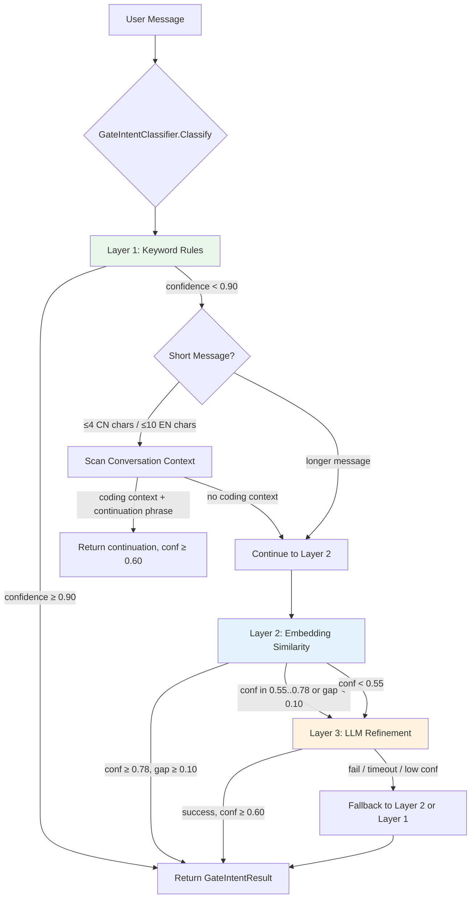
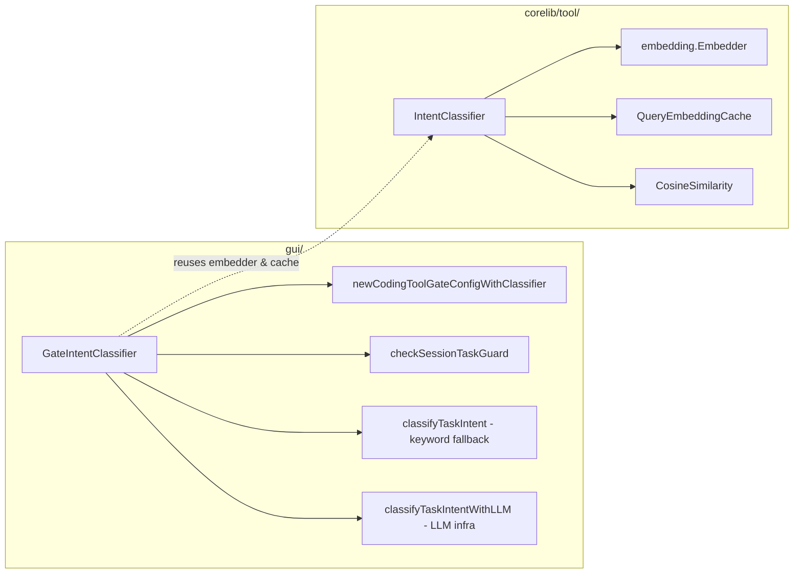
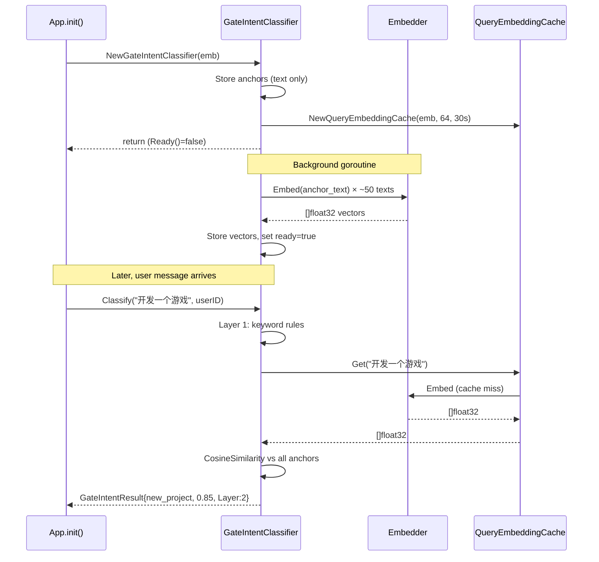
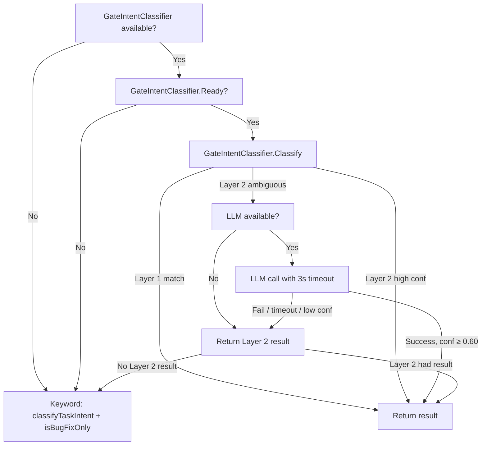

# Design Document: Semantic Gate Classifier

## Overview

This feature replaces the keyword-based gate decision in `gui/coding_tool_gate.go` with a semantic, multi-layer classification approach. The current system uses hardcoded keyword lists (`codingKeywords`, `bugFixKeywords`, `creationCodingKeywords`, `nonCodingKeywords`) to decide whether to activate the three-phase coding workflow. This is fragile: it misclassifies novel phrasings, conflates bug-fix tasks with new-project tasks, and requires manual keyword additions for every edge case.

The new `GateIntentClassifier` lives in the `gui/` package and wraps a three-layer classification pipeline (keyword rules → embedding cosine similarity → LLM refinement) to classify user messages into five gate-specific categories: `new_project`, `bug_fix`, `maintenance`, `non_coding`, and `continuation`. It reuses the existing `corelib/tool/IntentClassifier` infrastructure (embedding model, `QueryEmbeddingCache`, `CosineSimilarity`) and the `classifyTaskIntentWithLLM()` HTTP/LLM plumbing, adding gate-specific anchor texts and a gate-specific LLM system prompt.

### Design Rationale

- **Layered approach**: Fast keyword rules handle the common cases in <1ms. Embedding similarity catches novel phrasings in <500ms. LLM refinement resolves truly ambiguous cases with a 3-second timeout. Each layer is a fallback for the previous one.
- **Five categories instead of four**: The existing `IntentClassifier` in `corelib/tool/` classifies into `coding`/`ssh`/`content`/`chat`/`browser`/`query`. The gate needs finer granularity within "coding": `new_project` (activate gate) vs `bug_fix` (bypass gate) vs `maintenance` (bypass gate). Adding `continuation` handles short follow-up phrases that depend on conversation context.
- **Additive, non-breaking**: All existing keyword lists and functions are preserved. The semantic classifier is an additional signal that overrides keyword results only when it has sufficient confidence. When the embedding model isn't loaded, behavior is identical to the current implementation.

## Architecture



### Integration Points



## Components and Interfaces

### 1. GateIntent Constants (`gui/gate_intent_classifier.go`)

```go
type GateIntent string

const (
    GateIntentNewProject   GateIntent = "new_project"
    GateIntentBugFix       GateIntent = "bug_fix"
    GateIntentMaintenance  GateIntent = "maintenance"
    GateIntentNonCoding    GateIntent = "non_coding"
    GateIntentContinuation GateIntent = "continuation"
    GateIntentUnknown      GateIntent = "unknown"
)
```

### 2. GateIntentResult

```go
type GateIntentResult struct {
    Intent     GateIntent
    Confidence float64   // [0, 1]
    Gap        float64   // score gap between top-1 and top-2
    Layer      int       // 1=keyword, 2=embedding, 3=LLM
    Reason     string    // human-readable explanation
    AllScores  map[GateIntent]float64 // diagnostic: all five category scores
}
```

### 3. ConversationContextProvider Interface

```go
// ConversationContextProvider abstracts access to recent conversation history
// for continuation detection. Implemented by IMMessageHandler.
type ConversationContextProvider interface {
    // RecentMessages returns the last N messages for the given user.
    RecentMessages(userID string, n int) []string
}
```

### 4. GateIntentClassifier Struct

```go
type GateIntentClassifier struct {
    embedder    embedding.Embedder
    anchors     []gateAnchor          // five anchor sets
    queryCache  *tool.QueryEmbeddingCache
    ctxProvider ConversationContextProvider
    llmConfig   func() MaclawLLMConfig  // lazy access to LLM config
    httpClient  *http.Client
    ready       bool
    mu          sync.RWMutex
}

type gateAnchor struct {
    Intent GateIntent
    Texts  []string
    Vecs   [][]float32
}
```

### 5. Public API

```go
// NewGateIntentClassifier creates a new classifier. Starts background
// anchor embedding warmup. If emb is nil or NoopEmbedder, only Layer 1
// (keyword rules) is available.
func NewGateIntentClassifier(emb embedding.Embedder) *GateIntentClassifier

// SetContextProvider sets the conversation context provider for
// continuation detection.
func (g *GateIntentClassifier) SetContextProvider(p ConversationContextProvider)

// SetLLMConfig sets the lazy LLM config accessor and HTTP client for
// Layer 3 refinement.
func (g *GateIntentClassifier) SetLLMConfig(cfgFn func() MaclawLLMConfig, client *http.Client)

// Ready returns true when anchor embeddings have been pre-computed.
func (g *GateIntentClassifier) Ready() bool

// Classify determines the gate intent for a user message.
// userID is used for conversation context lookup (continuation detection).
func (g *GateIntentClassifier) Classify(text string, userID string) GateIntentResult

// DiagnoseScores returns the full scoring breakdown for all five categories.
// Used in tests and debugging tools.
func (g *GateIntentClassifier) DiagnoseScores(text string) map[GateIntent]float64
```

### 6. Integration with Existing Functions

**`newCodingToolGateConfigWithClassifier()`** — Updated to accept `*GateIntentClassifier` instead of `*tool.IntentClassifier`:

```go
func newCodingToolGateConfigWithClassifier(
    userText string,
    loopKind LoopKind,
    gic *GateIntentClassifier,
    userID string,
) codingToolGateConfig {
    // 1. Check skip signals (unchanged)
    skip := containsSkipSignal(userText)
    if skip || loopKind == LoopKindBackground {
        // ... existing bypass logic unchanged
    }

    // 2. Try semantic classification first
    if gic != nil && gic.Ready() {
        result := gic.Classify(userText, userID)
        return mapGateIntentToConfig(result, skip)
    }

    // 3. Fallback to keyword-based classification
    result := classifyTaskIntent(userText)
    bugfix := isBugFixOnly(userText)
    // ... existing keyword logic unchanged
}
```

**`checkSessionTaskGuard()`** — Updated to consult `GateIntentClassifier` when keyword classification is ambiguous:

```go
func (h *IMMessageHandler) checkSessionTaskGuard() string {
    result := classifyTaskIntent(h.lastUserText)

    if result.Intent == intentCoding {
        return "" // keyword says coding → allow
    }

    // Existing action phrase + context check (preserved)
    if (result.Intent == intentAmbiguous || result.Intent == intentUnknown) &&
        hasCodingActionPhrase(h.lastUserText) && h.conversationHasCodingContext() {
        return ""
    }

    // NEW: Consult GateIntentClassifier for ambiguous/unknown
    if result.Intent == intentAmbiguous || result.Intent == intentUnknown {
        if gic := h.getGateIntentClassifier(); gic != nil && gic.Ready() {
            gResult := gic.Classify(h.lastUserText, h.lastUserID)
            switch gResult.Intent {
            case GateIntentNewProject, GateIntentBugFix, GateIntentMaintenance:
                return "" // coding-related → allow session
            case GateIntentNonCoding:
                return nonCodingSessionHint(gResult)
            case GateIntentContinuation:
                return "" // continuation → allow session
            }
        }
    }

    // ... existing switch on result.Intent (unchanged)
}
```

## Data Models

### Gate-Specific Anchor Texts

Each category has a dedicated set of anchor texts used for embedding cosine similarity. These are defined as Go constants in `gui/gate_intent_classifier.go`:

```go
func gateAnchors() []gateAnchor {
    return []gateAnchor{
        {
            Intent: GateIntentNewProject,
            Texts: []string{
                // Chinese
                "开发一个贪吃蛇游戏",
                "写一个爬虫程序",
                "帮我开发一个聊天应用",
                "实现一个REST API服务",
                "创建一个命令行工具",
                "写一个自动化脚本",
                "开发一个数据可视化面板",
                // English
                "build a web application",
                "create a CLI tool",
                "develop a REST API",
                "write a Python script for data processing",
                "implement a chat server",
                "build a game in JavaScript",
            },
        },
        {
            Intent: GateIntentBugFix,
            Texts: []string{
                // Chinese
                "有bug，一直显示加载中",
                "修复崩溃问题",
                "页面白屏了",
                "程序闪退",
                "调试一下这个问题",
                "排查报错原因",
                "修复登录失败的bug",
                // English
                "fix the loading issue",
                "debug this crash",
                "the app keeps crashing on startup",
                "fix the authentication error",
                "there's a bug in the payment flow",
                "troubleshoot the memory leak",
            },
        },
        {
            Intent: GateIntentMaintenance,
            Texts: []string{
                // Chinese
                "重构这个函数",
                "优化性能",
                "清理无用代码",
                "升级依赖版本",
                "改善代码结构",
                // English
                "refactor the auth module",
                "clean up dead code",
                "optimize the database queries",
                "upgrade the dependencies",
                "improve code readability",
            },
        },
        {
            Intent: GateIntentNonCoding,
            Texts: []string{
                // Chinese
                "翻译文档",
                "搜索论文",
                "总结这篇文章",
                "帮我整理资料",
                "生成PDF报告",
                // English
                "summarize this article",
                "translate this document",
                "search for papers on AI",
                "organize these notes",
                "help me write a report",
            },
        },
        {
            Intent: GateIntentContinuation,
            Texts: []string{
                // Chinese
                "继续",
                "开工",
                "开干",
                "动手",
                "搞起来",
                // English
                "let's go",
                "start working",
                "go ahead",
            },
        },
    }
}
```

### LLM Refinement Prompt

The gate-specific LLM system prompt classifies into five categories instead of the existing four:

```go
const gateClassifierSystemPrompt = `你是一个编程任务分类器，负责判断用户请求属于哪种编程工作流类别。

分类目标：
- new_project：创建新应用、新功能、新工具、新游戏、新系统（需要走需求→设计→任务分解流程）
- bug_fix：修复bug、调试、排查错误、解决崩溃/白屏/闪退/卡住等问题（直接修复，不需要三阶段流程）
- maintenance：重构代码、优化性能、清理代码、升级依赖、改善结构（直接执行，不需要三阶段流程）
- non_coding：翻译、整理资料、搜索论文、总结文章、生成报告等非编程任务
- continuation：用户想继续之前讨论的任务（如"开工"、"继续"、"动手"）

规则：
- 如果消息同时包含创建和修复信号（如"开发一个bug追踪系统"），判为 new_project（主要意图是创建）
- 如果消息同时包含修复和维护信号（如"修复bug然后重构"），判为 bug_fix（主要动作是修复）
- 如果消息同时包含编码和非编码信号（如"翻译代码注释"），判为 non_coding（主要动作是翻译）
- 信息不足时输出 unknown
- 只输出 JSON，不要输出任何额外解释

输出格式：
{"gate_intent": "...", "confidence": 0.0-1.0, "reason": "..."}`
```

### LLM Response JSON Schema

```go
var gateClassifierJSONSchema = map[string]interface{}{
    "type":                 "object",
    "additionalProperties": false,
    "properties": map[string]interface{}{
        "gate_intent": map[string]interface{}{
            "type": "string",
            "enum": []string{"new_project", "bug_fix", "maintenance",
                             "non_coding", "continuation", "unknown"},
        },
        "confidence": map[string]interface{}{
            "type": "number", "minimum": 0, "maximum": 1,
        },
        "reason": map[string]interface{}{"type": "string"},
    },
    "required": []string{"gate_intent", "confidence", "reason"},
}
```

### Caching and Lazy Initialization



### Fallback Chain



## Correctness Properties

*A property is a characteristic or behavior that should hold true across all valid executions of a system — essentially, a formal statement about what the system should do. Properties serve as the bridge between human-readable specifications and machine-verifiable correctness guarantees.*

### Property 1: Category Classification Accuracy

*For any* user message that clearly belongs to one of the five gate categories (new_project, bug_fix, maintenance, non_coding, continuation), the `GateIntentClassifier.Classify()` method SHALL return the correct `GateIntent` with `Confidence` ≥ 0.70.

**Validates: Requirements 1.1, 1.2, 1.3, 1.4**

### Property 2: Continuation Detection with Coding Context

*For any* short continuation phrase (e.g. "开工", "继续", "let's go") AND a conversation context containing coding-related messages, the `GateIntentClassifier.Classify()` method SHALL return `GateIntentContinuation` with `Confidence` ≥ 0.60.

**Validates: Requirements 1.5, 6.3**

### Property 3: Continuation Ambiguity without Coding Context

*For any* short continuation phrase AND a conversation context that does NOT contain coding-related messages, the `GateIntentClassifier.Classify()` method SHALL return a result with `Confidence` < 0.50.

**Validates: Requirements 1.6, 6.4**

### Property 4: Gate Activation Correctness

*For any* `GateIntentResult`, the `codingToolGateConfig` produced by `mapGateIntentToConfig()` SHALL have `active=true` if and only if `Intent == GateIntentNewProject` and `Confidence ≥ 0.70`. For `GateIntentBugFix`, `bugFix` SHALL be `true` and `active` SHALL be `false`. For all other intents (`maintenance`, `non_coding`, `continuation`, `unknown`), `active` SHALL be `false`.

**Validates: Requirements 5.2, 5.3, 5.4, 5.5, 5.6**

### Property 5: Skip Signal Always Bypasses Gate

*For any* user message containing a known skip signal (from `skipSignalsChinese` or `skipSignalsEnglish`), the gate SHALL return `active=false` regardless of the `GateIntentClassifier` result.

**Validates: Requirements 5.7**

### Property 6: Background Loop Always Bypasses Gate

*For any* user message processed with `LoopKindBackground`, the gate SHALL return `active=false` regardless of the `GateIntentClassifier` result.

**Validates: Requirements 5.8**

### Property 7: Keyword Fallback When Classifier Unavailable

*For any* user message, when the `GateIntentClassifier` is `nil` or `Ready()` returns `false`, the gate SHALL produce identical `active` and `bugFix` fields to the current keyword-based implementation (`classifyTaskIntent()` + `isBugFixOnly()`).

**Validates: Requirements 5.9, 8.2**

### Property 8: Session Guard Correctness

*For any* `GateIntentResult` with `Intent` in {`new_project`, `bug_fix`, `maintenance`, `continuation`}, the `checkSessionTaskGuard()` SHALL return an empty string (allow session creation). For `Intent == non_coding`, it SHALL return a non-empty hint string (block session creation).

**Validates: Requirements 9.2, 9.3**

### Property 9: Mixed-Intent Dominant Classification

*For any* user message containing signals from multiple categories, the `GateIntentClassifier` SHALL return the dominant intent: creation signals dominate bug-fix signals (→ `new_project`), bug-fix signals dominate maintenance signals (→ `bug_fix`), and non-coding signals dominate coding signals when the primary action is non-coding (→ `non_coding`).

**Validates: Requirements 10.1, 10.2, 10.3**

### Property 10: Layer Escalation Correctness

*For any* classification, the `Layer` field in the result SHALL be the earliest (lowest-numbered) layer that produced sufficient confidence. If Layer 1 returns confidence ≥ 0.90, `Layer` SHALL be 1. If Layer 2 returns confidence ≥ 0.78 with gap ≥ 0.10, `Layer` SHALL be ≤ 2.

**Validates: Requirements 2.1, 2.3**

### Property 11: LLM Fallback on Unreliable Results

*For any* LLM refinement result with `confidence < 0.60` or a parse/network error, the `GateIntentClassifier` SHALL fall back to the best available Layer 1 or Layer 2 result rather than returning the unreliable LLM result.

**Validates: Requirements 7.4, 7.5, 2.6**

### Property 12: LLM Response JSON Round-Trip Parsing

*For any* valid JSON string containing `gate_intent` (one of the five categories + "unknown"), `confidence` (float in [0,1]), and `reason` (string), the `parseGateLLMResponse()` function SHALL correctly parse all three fields. For any invalid JSON or missing fields, it SHALL return an error.

**Validates: Requirements 7.1**

## Error Handling

| Scenario | Behavior |
|---|---|
| Embedding model not loaded | `Ready()` returns false; all calls fall back to keyword-based classification |
| Embedding computation fails for user query | Layer 2 returns `IntentUnknown`; falls through to Layer 3 or keyword fallback |
| Anchor embedding warmup fails mid-way | `ready` stays false; classifier operates in keyword-only mode |
| LLM call times out (>3s) | Context cancelled; falls back to Layer 2 result or keyword fallback |
| LLM returns invalid JSON | `parseGateLLMResponse()` returns error; falls back to Layer 2/1 |
| LLM returns unknown intent string | Mapped to `GateIntentUnknown`; treated as low confidence, triggers fallback |
| LLM returns confidence < 0.60 | Treated as ambiguous; falls back to Layer 2/1 |
| ConversationContextProvider is nil | Continuation detection disabled; short messages go to Layer 2 |
| HTTP client is nil | Layer 3 disabled; only Layer 1 and 2 available |
| Concurrent access | `sync.RWMutex` protects `ready` flag and anchor vectors; `QueryEmbeddingCache` is internally synchronized |

## Testing Strategy

### Property-Based Tests (PBT)

The feature is well-suited for property-based testing because:
- The classifier is a pure-ish function (text → classification result) with clear input/output behavior
- Universal properties hold across a wide range of inputs (any new-project message should classify as new_project)
- The input space is large (arbitrary Chinese/English text)
- Edge cases in mixed-intent messages are best found through randomized testing

**Library**: [rapid](https://github.com/flyingmutant/rapid) (Go property-based testing library)

**Configuration**: Minimum 100 iterations per property test.

**Tag format**: `Feature: semantic-gate-classifier, Property {N}: {title}`

Each correctness property (P1–P12) maps to a single property-based test. Generators will produce:
- Random messages from category-specific templates (P1, P9)
- Random short continuation phrases with/without coding context (P2, P3)
- Random `GateIntentResult` structs with varying intents and confidence values (P4, P5, P6, P7, P8)
- Random valid/invalid JSON strings for LLM response parsing (P12)
- Random messages with skip signals appended (P5)
- Mock classifiers returning controlled results for gate integration tests (P4, P7, P10, P11)

### Unit Tests (Example-Based)

Unit tests complement PBT by covering:
- **Anchor text completeness**: Verify each category has the required minimum number of anchors (smoke tests for Requirements 3.1–3.6)
- **Specific classification examples**: Known messages that must classify correctly (e.g. "开发一个贪吃蛇游戏" → new_project)
- **Latency benchmarks**: Layer 1 < 1ms, Layer 2 < 500ms (Requirements 4.1, 4.2)
- **LLM timeout enforcement**: Mock slow LLM, verify 3-second timeout (Requirements 4.3, 4.4)
- **Ready() lifecycle**: Verify false before warmup, true after (Requirement 3.7)
- **DiagnoseScores() output**: Verify all five categories have scores (Requirement 11.4)
- **Logging verification**: Verify debug log output contains expected fields (Requirements 8.3, 8.5, 11.1, 11.3)
- **Backward compatibility**: Existing `coding_tool_gate_test.go` tests must continue to pass unchanged

### Integration Tests

- **End-to-end gate decision**: Full pipeline from user message → `newCodingToolGateConfigWithClassifier()` → `codingToolGateConfig` with real embedding model
- **Session guard integration**: `checkSessionTaskGuard()` with real classifier for ambiguous messages
- **UsageTracker recording**: Verify classification results are recorded (Requirement 11.2)

### Test File Organization

```
gui/gate_intent_classifier.go          # Main implementation
gui/gate_intent_classifier_test.go     # Unit tests + PBT
gui/coding_tool_gate_test.go           # Existing tests (unchanged, must pass)
```
