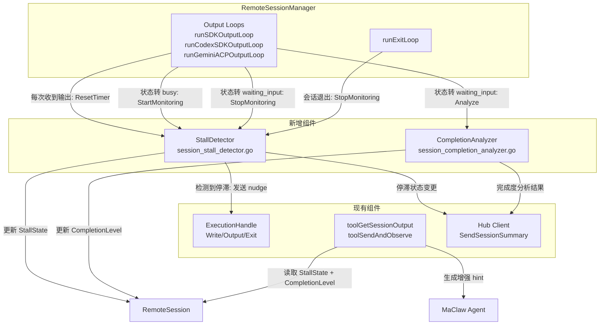

# Session Stall Detection 设计文档

## Overview

本特性为 MaClaw 的 `RemoteSessionManager` 层增加会话停滞检测（Stall Detection）和语义任务完成分析（Completion Analysis）能力。核心目标：

1. **自动检测停滞**：当编程工具会话处于 `busy` 状态但长时间无新输出时，自动识别并尝试通过发送 nudge 消息恢复。
2. **语义完成判断**：当会话转为 `waiting_input` 时，分析最近输出内容判断用户任务是否真正完成，而非仅依赖状态转换。
3. **增强 Session Hint**：在 `toolGetSessionOutput` 返回中提供更精确的操作提示，帮助 Agent 做出正确决策。

设计原则：
- 对上层 Agent（MaClaw LLM）透明——Agent 不感知 nudge 操作的存在
- 对下层编程工具无感知——通过统一的 `ExecutionHandle.Write` 接口发送 nudge
- 最小侵入——新增独立文件，仅在 output loop 和 tool handler 中添加少量集成代码

## Architecture



### 关键设计决策

1. **StallDetector 使用 per-session goroutine + timer**：每个进入 `busy` 状态的会话启动一个独立的监控 goroutine，使用 `time.Timer` 实现超时检测。相比全局轮询，per-session goroutine 更精确且资源开销可控（活跃会话通常 1-3 个）。

2. **Nudge 消息通过 `ExecutionHandle.Write` 发送**：这是所有工具类型共享的统一接口。SDK 模式下 `Write` 发送 JSON user message，Gemini ACP 下发送 `session/prompt` RPC。Codex 是 one-shot 模式，不支持交互式 nudge，需跳过。

3. **Nudge echo 过滤在 output loop 中完成**：nudge 发送后，编程工具可能回显 nudge 文本。在 output loop 的 `RawOutputLines` 追加逻辑中过滤包含 nudge 标记的行，确保 Agent 通过 `get_session_output` 看不到 nudge 痕迹。

4. **CompletionAnalyzer 使用纯模式匹配**：不调用 LLM，而是基于正则表达式和关键词匹配分析输出内容。这保证了零延迟和零额外成本。

## Components and Interfaces

### StallDetector（session_stall_detector.go）

```go
// StallState 表示会话的停滞状态
type StallState int

const (
    StallStateNormal    StallState = iota // 正常运行
    StallStateSuspected                    // 疑似停滞，正在 nudge
    StallStateStuck                        // 已达最大 nudge 次数，需要 Agent 介入
)

// StallDetectorConfig 停滞检测配置
type StallDetectorConfig struct {
    StallTimeout    time.Duration          // 默认 45s
    MaxNudgeCount   int                    // 默认 3
    NudgeMessages   map[string]string      // 按工具类型配置 nudge 文本，key=tool name
    DefaultNudge    string                 // 默认 nudge 文本: "continue"
}

// StallDetector 管理所有会话的停滞检测
type StallDetector struct {
    mu       sync.Mutex
    config   StallDetectorConfig
    sessions map[string]*sessionStallState  // key: session ID
    logger   func(string)                   // 日志函数
}

// sessionStallState 单个会话的停滞监控状态
type sessionStallState struct {
    timer       *time.Timer
    stallState  StallState
    nudgeCount  int
    lastOutput  time.Time
    cancelCh    chan struct{}  // 用于停止监控 goroutine
}

// NewStallDetector 创建停滞检测器
func NewStallDetector(config StallDetectorConfig, logger func(string)) *StallDetector

// StartMonitoring 开始监控指定会话（当会话进入 busy 状态时调用）
// 如果该会话已在监控中，重置计时器
func (d *StallDetector) StartMonitoring(sessionID string, exec ExecutionHandle, tool string)

// StopMonitoring 停止监控指定会话（当会话离开 busy 状态时调用）
// 清除所有计时器和状态
func (d *StallDetector) StopMonitoring(sessionID string)

// ResetTimer 重置指定会话的停滞计时器（当收到新输出时调用）
// 如果会话之前处于 StallStateSuspected 且收到非空输出，重置 nudge 计数器
func (d *StallDetector) ResetTimer(sessionID string, hasNewOutput bool)

// GetState 获取指定会话的停滞状态
func (d *StallDetector) GetState(sessionID string) StallState

// GetNudgeCount 获取指定会话已发送的 nudge 次数
func (d *StallDetector) GetNudgeCount(sessionID string) int

// Close 停止所有监控，释放资源
func (d *StallDetector) Close()
```

**内部 nudge 流程**（在 per-session goroutine 中）：

```
timer 到期 →
  if nudgeCount >= maxNudgeCount:
    stallState = StallStateStuck
    return (不再 nudge)
  stallState = StallStateSuspected
  nudgeCount++
  exec.Write(nudgeMessage)  // 发送 nudge
  log("[stall-nudge] session=%s nudge_count=%d")
  重置 timer 等待下一个 StallTimeout
```

### CompletionAnalyzer（session_completion_analyzer.go）

```go
// CompletionLevel 任务完成度级别
type CompletionLevel int

const (
    CompletionUncertain  CompletionLevel = iota // 无法确定
    CompletionCompleted                          // 任务完成
    CompletionIncomplete                         // 任务未完成
)

// CompletionAnalyzerConfig 完成分析配置
type CompletionAnalyzerConfig struct {
    AnalyzeLineCount int  // 分析最近 N 行输出，默认 50
}

// CompletionAnalyzer 语义任务完成分析器
type CompletionAnalyzer struct {
    config CompletionAnalyzerConfig
}

// NewCompletionAnalyzer 创建完成分析器
func NewCompletionAnalyzer(config CompletionAnalyzerConfig) *CompletionAnalyzer

// Analyze 分析输出内容判断任务完成度
// lines: 最近 N 行输出
// tool: 工具类型（用于工具特定的模式匹配）
// sdkResult: SDK result 消息（如果有），用于检查 is_error 字段
func (a *CompletionAnalyzer) Analyze(lines []string, tool string, sdkResult *SDKResultPayload) CompletionLevel
```

**分析逻辑**：

1. 如果有 SDK `result` 消息且 `is_error` 为 false → 倾向 `completed`
2. 扫描最近 N 行输出，匹配完成信号和未完成信号：
   - 完成信号：``、`"I've completed"`、`"已完成"`、`"All done"`、`"Successfully"`、`"Changes applied"`
   - 未完成信号：`"I'll continue"`、`"接下来我会"`、`"Next, I'll"`、`"Let me continue"`、`"I need to"`、`"还需要"`
   - Gemini ACP: `[gemini-acp] turn complete:` 后跟成功指示
3. 如果完成信号数 > 未完成信号数 → `completed`
4. 如果未完成信号数 > 0 → `incomplete`
5. 否则 → `uncertain`

### RemoteSession 扩展字段

在 `RemoteSession` struct 中新增（受 `mu` 保护）：

```go
// StallState 当前停滞状态（由 StallDetector 更新）
StallState StallState

// CompletionLevel 最近一次完成度分析结果（由 CompletionAnalyzer 更新）
CompletionLevel CompletionLevel

// LastNudgeCount 最近一轮 nudge 的次数（用于 hint 生成）
LastNudgeCount int
```

### RemoteSessionManager 扩展

```go
type RemoteSessionManager struct {
    // ... 现有字段 ...
    stallDetector      *StallDetector
    completionAnalyzer *CompletionAnalyzer
}
```

在 `NewRemoteSessionManager` 中初始化：

```go
stallDetector: NewStallDetector(StallDetectorConfig{
    StallTimeout:  45 * time.Second,
    MaxNudgeCount: 3,
    DefaultNudge:  "continue",
}, app.log),
completionAnalyzer: NewCompletionAnalyzer(CompletionAnalyzerConfig{
    AnalyzeLineCount: 50,
}),
```

### 集成点

#### 1. Output Loop 集成（runSDKOutputLoop）

在 `case msg` 分支中，当状态转换时调用 StallDetector：

```go
case "assistant":
    // 现有逻辑: s.Status = SessionBusy
    // 新增: 开始停滞监控
    m.stallDetector.StartMonitoring(s.ID, s.Exec, s.Tool)

case "result":
    // 现有逻辑: s.Status = SessionWaitingInput
    // 新增: 停止停滞监控
    m.stallDetector.StopMonitoring(s.ID)
    // 新增: 完成度分析
    level := m.completionAnalyzer.Analyze(s.RawOutputLines, s.Tool, msg.Result)
    s.CompletionLevel = level
```

在 `case chunk` 分支中，收到新输出时重置计时器：

```go
case chunk, ok := <-output:
    // 现有逻辑: appendStreamText(text)
    // 新增: 重置停滞计时器
    m.stallDetector.ResetTimer(s.ID, len(text) > 0)
```

#### 2. Output Loop 集成（runGeminiACPOutputLoop）

类似 SDK loop，在状态转换点调用 StallDetector：

```go
// 检测到 "❯ " 前缀 → busy
m.stallDetector.StartMonitoring(s.ID, s.Exec, s.Tool)

// 检测到 "[gemini-acp] turn complete:" → waiting_input
m.stallDetector.StopMonitoring(s.ID)
level := m.completionAnalyzer.Analyze(s.RawOutputLines, s.Tool, nil)
s.CompletionLevel = level

// 每次收到新 chunk
m.stallDetector.ResetTimer(s.ID, true)
```

#### 3. Codex Output Loop 不集成 StallDetector

Codex 是 one-shot 模式（`codex exec`），进程执行完即退出，不存在交互式停滞场景。`runCodexSDKOutputLoop` 不调用 StallDetector。

#### 4. toolGetSessionOutput 增强 Hint

在 `toolGetSessionOutput` 中，替换现有的 `busy` 状态 hint 逻辑：

```go
if status == string(SessionBusy) {
    session.mu.RLock()
    stallState := session.StallState
    session.mu.RUnlock()

    switch stallState {
    case StallStateNormal:
        b.WriteString("\n编程工具正在工作中，请等待后再检查进度")
    case StallStateSuspected:
        b.WriteString("\n编程工具输出暂停，系统正在尝试恢复，请稍后再检查")
    case StallStateStuck:
        b.WriteString("\n编程工具可能已卡住，建议发送具体指令或终止会话")
    }
}

if status == string(SessionWaitingInput) {
    session.mu.RLock()
    completionLevel := session.CompletionLevel
    session.mu.RUnlock()

    switch completionLevel {
    case CompletionCompleted:
        b.WriteString("\n任务似乎已完成，可以查看结果")
    case CompletionIncomplete:
        b.WriteString("\n任务似乎未完成，建议发送「继续」让编程工具继续工作")
    // CompletionUncertain: 保持现有默认提示
    }
}
```

#### 5. Nudge Echo 过滤

在 output loop 的 `appendStreamText` / `appendRawOutputLines` 调用前，检查输出是否为 nudge echo：

```go
// StallDetector 在发送 nudge 时设置一个短暂的 "nudge echo window"（2秒）
// 在此窗口内，如果输出行完全匹配 nudge 文本，则从 RawOutputLines 中过滤掉

func (d *StallDetector) IsNudgeEcho(sessionID string, line string) bool
```

SDK 模式下，nudge 通过 `Write` 发送的是 JSON user message，Claude Code 不会回显 user message 到 output channel（user message 通过 `msgCh` 的 `"user"` type 返回）。因此 SDK 模式下 nudge echo 过滤主要是防御性的。

Gemini ACP 模式下，nudge 通过 `session/prompt` RPC 发送，输出通过 `session/update` notification 返回，同样不会直接回显 nudge 文本。

实际上，由于 SDK 和 ACP 协议的结构化特性，nudge echo 问题在当前支持的工具中不太可能出现。过滤逻辑作为防御性措施保留，主要针对未来可能支持的 PTY 模式工具。

#### 6. Hub 同步

在 StallDetector 状态变更时更新 `SessionSummary` 并同步：

```go
// StallDetector 回调（在 nudge goroutine 中）
onStallStateChanged := func(sessionID string, state StallState) {
    s, ok := m.Get(sessionID)
    if !ok { return }
    s.mu.Lock()
    s.StallState = state
    switch state {
    case StallStateSuspected:
        s.Summary.SuggestedAction = "编程工具输出暂停，系统正在尝试恢复"
    case StallStateStuck:
        s.Summary.SuggestedAction = "编程工具可能已卡住，建议发送具体指令或终止会话"
    case StallStateNormal:
        s.Summary.SuggestedAction = ""
    }
    s.Summary.UpdatedAt = time.Now().Unix()
    snap := s.Summary
    s.mu.Unlock()
    if m.hubClient != nil {
        _ = m.hubClient.SendSessionSummary(snap)
    }
    m.app.emitRemoteStateChanged()
}
```

#### 7. 生命周期管理

- **会话创建**：在 `Create` 方法中，output loop 启动后，StallDetector 的 `StartMonitoring` 由 output loop 在检测到 `busy` 状态时自动调用，无需在 `Create` 中显式启动。
- **会话退出**：在 `runExitLoop` 中，会话退出时调用 `StallDetector.StopMonitoring` 确保清理：

```go
func (m *RemoteSessionManager) runExitLoop(s *RemoteSession) {
    defer func() {
        m.stallDetector.StopMonitoring(s.ID)  // 新增
        // ... 现有 cleanup ...
    }()
    // ...
}
```

- **Panic 保护**：StallDetector 的 per-session goroutine 使用 `defer recover()` 捕获 panic，记录错误日志但不影响会话正常运行。

## Data Models

### StallDetectorConfig

| 字段 | 类型 | 默认值 | 说明 |
|------|------|--------|------|
| StallTimeout | time.Duration | 45s | busy 状态下无新输出超过此时间判定为停滞 |
| MaxNudgeCount | int | 3 | 单个会话最大 nudge 次数 |
| NudgeMessages | map[string]string | nil | 按工具类型配置 nudge 文本 |
| DefaultNudge | string | "continue" | 默认 nudge 文本 |

### CompletionAnalyzerConfig

| 字段 | 类型 | 默认值 | 说明 |
|------|------|--------|------|
| AnalyzeLineCount | int | 50 | 分析最近 N 行输出 |

### RemoteSession 新增字段

| 字段 | 类型 | 说明 |
|------|------|------|
| StallState | StallState | 当前停滞状态 |
| CompletionLevel | CompletionLevel | 最近一次完成度分析结果 |
| LastNudgeCount | int | 最近一轮 nudge 次数 |

### 完成信号模式（内置）

| 类别 | 模式 | 说明 |
|------|------|------|
| 完成 | `` | Unicode 勾号 |
| 完成 | `I've completed` / `已完成` | 自然语言完成声明 |
| 完成 | `All done` / `Successfully` | 英文完成指示 |
| 完成 | `Changes applied` | 变更已应用 |
| 未完成 | `I'll continue` / `Let me continue` | 继续工作声明 |
| 未完成 | `接下来我会` / `还需要` | 中文未完成指示 |
| 未完成 | `Next, I'll` / `I need to` | 英文未完成指示 |


## Correctness Properties

*A property is a characteristic or behavior that should hold true across all valid executions of a system — essentially, a formal statement about what the system should do. Properties serve as the bridge between human-readable specifications and machine-verifiable correctness guarantees.*

### Property 1: Stall Timeout Detection

*For any* session in `busy` state where no new output has been received for a duration exceeding `StallTimeout`, the StallDetector shall transition the session's stall state to `StallStateSuspected`.

**Validates: Requirements 1.2**

### Property 2: Timer Reset on New Output

*For any* session in `busy` state that receives new non-empty output, the StallDetector shall reset the stall timer to the full `StallTimeout` duration. Furthermore, if the session was previously in `StallStateSuspected` state, the nudge counter shall be reset to zero.

**Validates: Requirements 1.1, 1.5, 2.5**

### Property 3: Nudge Delivery via Unified Write Interface

*For any* session that transitions to `StallStateSuspected`, the StallDetector shall call `ExecutionHandle.Write` exactly once with the configured nudge message text, regardless of the underlying tool type (Claude Code SDK, Gemini ACP, etc.).

**Validates: Requirements 2.1, 3.1**

### Property 4: Nudge Rate Limiting and Maximum Count

*For any* session being monitored by the StallDetector, the interval between consecutive nudge sends shall be at least one `StallTimeout` period, and the total nudge count shall not exceed `MaxNudgeCount`. When the maximum is reached, the stall state shall transition to `StallStateStuck` and no further nudges shall be sent.

**Validates: Requirements 2.3, 2.4**

### Property 5: Nudge Failure Stops Retries

*For any* session where `ExecutionHandle.Write` returns an error during a nudge attempt, the StallDetector shall immediately stop all further nudge attempts for that session and transition to `StallStateStuck`.

**Validates: Requirements 3.3**

### Property 6: Nudge Transparency

*For any* session that has received one or more nudge messages, the output returned by `toolGetSessionOutput` shall not contain the nudge message text in the `RawOutputLines` section. The nudge operation shall be invisible to the Agent.

**Validates: Requirements 2.6**

### Property 7: Completion Analysis Classification

*For any* set of output lines and tool type, the `CompletionAnalyzer.Analyze` function shall return exactly one of `{CompletionCompleted, CompletionIncomplete, CompletionUncertain}`. Lines containing completion signals (e.g., ``, `"I've completed"`) shall bias toward `CompletionCompleted`, and lines containing incompletion signals (e.g., `"I'll continue"`, `"还需要"`) shall bias toward `CompletionIncomplete`.

**Validates: Requirements 4.1, 4.2, 4.3**

### Property 8: Session Hint Mapping Correctness

*For any* session, the hint text returned by `toolGetSessionOutput` shall be determined by the combination of session status and stall/completion state:
- (`busy`, `StallStateNormal`) → "编程工具正在工作中，请等待后再检查进度"
- (`busy`, `StallStateSuspected`) → "编程工具输出暂停，系统正在尝试恢复，请稍后再检查"
- (`busy`, `StallStateStuck`) → "编程工具可能已卡住，建议发送具体指令或终止会话"
- (`waiting_input`, `CompletionCompleted`) → "任务似乎已完成，可以查看结果"
- (`waiting_input`, `CompletionIncomplete`) → "任务似乎未完成，建议发送「继续」让编程工具继续工作"

**Validates: Requirements 5.1, 5.2, 5.3, 5.4, 5.5**

### Property 9: Existing Hint Preservation

*For any* session in `starting`, `running`, `exited`, or `error` status, the hint text returned by `toolGetSessionOutput` shall be identical to the current implementation — the stall detection and completion analysis features shall not alter existing hint logic for these states.

**Validates: Requirements 5.6**

### Property 10: Hub Sync on State Changes

*For any* stall state transition (normal → suspected, suspected → stuck, suspected/stuck → normal) or completion analysis result, the `SessionSummary` shall be updated with the appropriate `SuggestedAction` and synced to Hub via `SendSessionSummary`.

**Validates: Requirements 6.1, 6.2, 6.3**

### Property 11: Lifecycle Correctness

*For any* session, the StallDetector shall have an active monitor if and only if the session is in `busy` state. Monitoring shall not be active for `starting`, `running`, `waiting_input`, `exited`, or `error` states. When a session exits or is killed, all associated timers and goroutines shall be released.

**Validates: Requirements 1.4, 7.1, 7.2, 7.3**

## Error Handling

### StallDetector Panic Recovery

StallDetector 的 per-session 监控 goroutine 使用 `defer recover()` 捕获所有 panic。发生 panic 时：
1. 记录错误日志：`[stall-detector-panic] session=%s error=%v`
2. 清理该会话的监控状态
3. 不影响会话本身的正常运行（output loop 和 exit loop 继续工作）

### Nudge Write 失败

当 `ExecutionHandle.Write` 返回错误时：
1. 记录错误日志：`[stall-nudge-error] session=%s error=%v`
2. 将该会话的 stall state 设为 `StallStateStuck`
3. 停止对该会话的所有后续 nudge 尝试
4. 更新 `SessionSummary.SuggestedAction` 提示 Agent 介入

### CompletionAnalyzer 错误

CompletionAnalyzer 是纯函数（无 I/O），不会产生运行时错误。如果输入为空（无输出行），返回 `CompletionUncertain`。

### 并发安全

- StallDetector 内部使用 `sync.Mutex` 保护 sessions map
- 对 `RemoteSession` 字段的读写通过现有的 `session.mu` RWMutex 保护
- StallDetector 的回调（状态变更通知）在 StallDetector 的 goroutine 中执行，通过 `session.mu.Lock()` 安全更新 session 字段

## Testing Strategy

### 测试框架

- 单元测试：Go 标准 `testing` 包
- Property-based 测试：`github.com/leanovate/gopter`（Go 生态成熟的 PBT 库）
- 每个 property test 至少运行 100 次迭代

### Property-Based Tests

每个 correctness property 对应一个 property-based test，使用 gopter 生成随机输入：

**Test 1: Stall Timeout Detection**
- 生成随机 StallTimeout（1s-120s）和随机等待时间
- 验证：等待时间 > StallTimeout 时状态为 StallStateSuspected
- Tag: `Feature: session-stall-detection, Property 1: Stall Timeout Detection`

**Test 2: Timer Reset on New Output**
- 生成随机 session，在 busy 状态下随机时间点发送输出
- 验证：每次输出后 timer 重置，recovering 时 nudge counter 归零
- Tag: `Feature: session-stall-detection, Property 2: Timer Reset on New Output`

**Test 3: Nudge Delivery via Unified Write Interface**
- 生成随机工具类型（非 Codex），触发 stall
- 验证：Write 被调用且参数为配置的 nudge 文本
- Tag: `Feature: session-stall-detection, Property 3: Nudge Delivery via Unified Write Interface`

**Test 4: Nudge Rate Limiting and Maximum Count**
- 生成随机 MaxNudgeCount（1-10）和 StallTimeout
- 模拟持续无输出场景
- 验证：nudge 间隔 >= StallTimeout，总次数 <= MaxNudgeCount
- Tag: `Feature: session-stall-detection, Property 4: Nudge Rate Limiting and Maximum Count`

**Test 5: Nudge Failure Stops Retries**
- 生成随机 session，配置 Write 在第 N 次调用时返回错误
- 验证：错误后不再有 Write 调用，状态为 StallStateStuck
- Tag: `Feature: session-stall-detection, Property 5: Nudge Failure Stops Retries`

**Test 6: Nudge Transparency**
- 生成随机 session 输出行，混入 nudge 文本
- 验证：toolGetSessionOutput 返回中不包含 nudge 文本
- Tag: `Feature: session-stall-detection, Property 6: Nudge Transparency`

**Test 7: Completion Analysis Classification**
- 生成随机输出行，随机插入完成/未完成信号
- 验证：结果为三个级别之一，且信号匹配正确
- Tag: `Feature: session-stall-detection, Property 7: Completion Analysis Classification`

**Test 8: Session Hint Mapping Correctness**
- 生成随机 (status, stallState, completionLevel) 组合
- 验证：toolGetSessionOutput 返回的 hint 文本匹配预期映射
- Tag: `Feature: session-stall-detection, Property 8: Session Hint Mapping Correctness`

**Test 9: Existing Hint Preservation**
- 生成随机 session，状态为 starting/running/exited/error
- 验证：hint 输出与未添加 stall detection 前完全一致
- Tag: `Feature: session-stall-detection, Property 9: Existing Hint Preservation`

**Test 10: Hub Sync on State Changes**
- 生成随机 stall state 转换序列
- 验证：每次转换都触发 SendSessionSummary 调用，SuggestedAction 字段正确
- Tag: `Feature: session-stall-detection, Property 10: Hub Sync on State Changes`

**Test 11: Lifecycle Correctness**
- 生成随机 session 状态转换序列（starting → running → busy → waiting_input → exited）
- 验证：仅在 busy 状态时有活跃监控，其他状态无监控
- Tag: `Feature: session-stall-detection, Property 11: Lifecycle Correctness`

### Unit Tests

单元测试覆盖 property test 不便覆盖的具体场景和边界情况：

1. **Codex 跳过 nudge**：创建 Codex session，验证 StallDetector 不发送 nudge（Validates: 3.2）
2. **默认配置值**：验证 StallTimeout 默认 45s，MaxNudgeCount 默认 3（Validates: 1.3）
3. **按工具类型配置 nudge 文本**：配置不同工具的 nudge 消息，验证正确选择（Validates: 3.4）
4. **Nudge 日志记录**：验证每次 nudge 操作产生包含 session ID、nudge count、timestamp 的日志（Validates: 2.7）
5. **Panic recovery**：注入 panic 到 StallDetector goroutine，验证 session 继续正常运行（Validates: 7.4）
6. **空输出分析**：CompletionAnalyzer 输入空行列表，验证返回 CompletionUncertain
7. **SDK result 消息集成**：传入 SDKResultPayload（is_error=false），验证倾向 CompletionCompleted
8. **Gemini ACP 完成标记**：输出包含 `[gemini-acp] turn complete:` 后跟成功指示，验证 CompletionCompleted

### Integration Tests

1. **完整 stall → nudge → recovery 流程**：创建 mock session → 进入 busy → 无输出超时 → 验证 nudge 发送 → 模拟输出恢复 → 验证状态清除
2. **完整 stall → stuck 流程**：创建 mock session → 连续 3 次 nudge 无效 → 验证 StallStateStuck → 验证 hint 正确
3. **completion analysis 集成**：创建 mock session → 进入 busy → 产生输出 → 转为 waiting_input → 验证 CompletionLevel 正确 → 验证 hint 正确
4. **toolGetSessionOutput 端到端**：创建各种状态组合的 session → 调用 toolGetSessionOutput → 验证返回的 hint 文本
