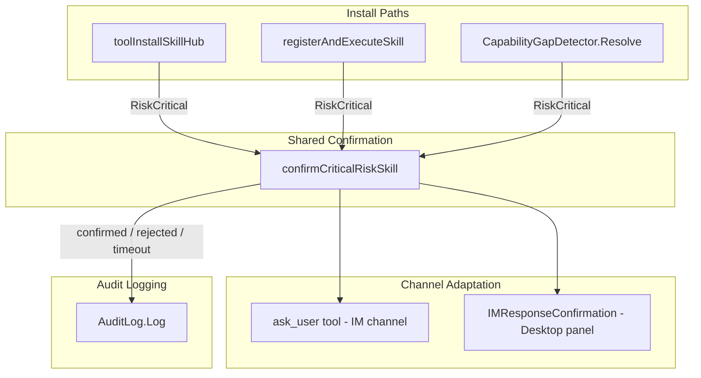

# Design Document: Skill Install User Confirmation for Critical Risk

## Overview

Currently, when a non-SkillMarket skill (from ClawHub, GitHub, or community sources) is assessed as `RiskCritical` by the `RiskAssessor`, all three installation paths (`toolInstallSkillHub`, `registerAndExecuteSkill`, `CapabilityGapDetector.Resolve`) hard-reject the installation with no user recourse. This design introduces a shared confirmation mechanism that asks the user before rejecting, allowing informed override decisions.

The core change is a new `confirmCriticalRiskSkill()` function on `IMMessageHandler` that all three install paths call. It adapts to the current platform context (IM channel → `ask_user` tool; desktop panel → `IMResponseConfirmation` buttons) and blocks until the user responds or a 120-second timeout expires. A new `PolicyUserOverride` audit constant distinguishes user-confirmed critical installs from auto-allowed ones.

## Architecture



**Design Decision: Shared function vs. interface**
A concrete function on `IMMessageHandler` is chosen over an interface because all three call sites already live on `IMMessageHandler` (or have access to it via `h`). An interface would add indirection without benefit. The `CapabilityGapDetector` already uses a `confirmCallback func(string, string) bool` — we wire the new shared function into that callback.

## Components and Interfaces

### 1. `confirmCriticalRiskSkill` (new function on `IMMessageHandler`)

```go
// confirmCriticalRiskSkill presents a blocking confirmation prompt to the user
// when a skill is assessed as RiskCritical. Returns true if the user confirms,
// false on rejection or timeout.
//
// Parameters:
//   skillName   - display name of the skill
//   source      - origin (hub URL, GitHub repo URL, "clawhub", etc.)
//   factors     - risk factors from RiskAssessment.Factors
//   platform    - "desktop" or IM platform identifier (feishu/wechat/qq/telegram)
//
// Behavior:
//   - Desktop: sends IMResponseConfirmation with confirm/reject buttons, blocks on channel
//   - IM: calls ask_user tool mechanism with confirm input_type, blocks on channel
//   - Timeout: 120 seconds, defaults to reject
//   - Nil/unavailable channel: returns false (fail-closed)
func (h *IMMessageHandler) confirmCriticalRiskSkill(
    ctx context.Context,
    skillName, source string,
    factors []string,
    platform string,
) bool
```

### 2. `buildCriticalRiskPrompt` (new helper)

```go
// buildCriticalRiskPrompt formats the confirmation prompt text from skill
// metadata and risk factors.
func buildCriticalRiskPrompt(skillName, source string, factors []string) string
```

Returns a string like:
```
⚠️ 安全警告: Skill「deploy-helper」来自 https://hub.example.com 被评估为 Critical 风险。

风险因素:
  • dangerous keyword "rm -rf" found in arguments
  • community trust level: high escalated to critical

确认安装此 Skill？
```

### 3. `PolicyUserOverride` (new constant in `corelib/security/types.go`)

```go
const PolicyUserOverride PolicyAction = "user_override"
```

Added alongside existing `PolicyAllow`, `PolicyDeny`, `PolicyAsk`, `PolicyAudit`. The alias in `gui/corelib_aliases.go` is updated to export it.

### 4. Modified install paths

**`toolInstallSkillHub`** (`gui/im_tools_misc.go`):
- Replace the hard-reject block with a call to `confirmCriticalRiskSkill`.
- On confirm: continue to Register, audit with `PolicyUserOverride`.
- On reject: audit with `PolicyDeny`, return rejection message (unchanged behavior).

**`registerAndExecuteSkill`** (`gui/im_message_handler.go`):
- Same pattern as above.

**`CapabilityGapDetector.Resolve`** (`gui/capability_gap_detector.go`):
- Already has `confirmCallback`. The wiring code (in `app.go` or handler init) sets `confirmCallback` to call `confirmCriticalRiskSkill` with the appropriate platform context.
- The existing `confirmCallback(skillName, riskDetails) bool` signature is sufficient — `riskDetails` already contains the formatted prompt text. The callback implementation calls `confirmCriticalRiskSkill` internally.

### 5. Confirmation channel dispatch

Inside `confirmCriticalRiskSkill`:

```go
switch {
case platform == "desktop":
    // Build IMResponseConfirmation with confirm/reject buttons
    // Send via Wails event, block on response channel with 120s timeout
case platform != "":
    // IM channel: use ask_user mechanism
    // Build AskUserRequest{InputType: "confirm", Options: ["确认安装", "拒绝安装"]}
    // Block on response channel with 120s timeout
default:
    // No platform context — fail-closed
    return false
}
```

**Design Decision: Synchronous blocking with timeout**
The function blocks the calling goroutine using a `select` on a response channel and `time.After(120s)`. This is safe because all three call sites already run in goroutines (agent loop iterations or async hub install). The 120-second timeout is generous enough for IM users who may not be watching the screen continuously.

## Data Models

### Modified: `AuditEntry` usage

No structural changes to `AuditEntry`. The new `PolicyUserOverride` value is used in the `PolicyAction` field:

| Scenario | PolicyAction | Result field |
|----------|-------------|-------------|
| User confirms critical install | `PolicyUserOverride` | `"user confirmed critical skill {name} from {source}, risk=critical, factors=[...]"` |
| User rejects critical install | `PolicyDeny` | `"user rejected critical skill {name}: critical risk"` |
| Timeout (no response) | `PolicyDeny` | `"timeout: user did not respond to critical risk prompt for skill {name}"` |

### New: Confirmation response channel

```go
// criticalRiskConfirmResponse is sent on the response channel when the user
// answers the confirmation prompt.
type criticalRiskConfirmResponse struct {
    Confirmed bool
}
```

A `sync.Map` keyed by a unique confirmation ID stores the response channels, cleaned up after use or timeout.

### Modified: `CapabilityGapDetector` wiring

The `confirmCallback` is set during initialization to a closure that captures the `IMMessageHandler` and platform context:

```go
detector.SetConfirmCallback(func(skillName, riskDetails string) bool {
    return h.confirmCriticalRiskSkill(ctx, skillName, source, factors, platform)
})
```

Since `CapabilityGapDetector.Resolve` already passes `skillName` and `riskDetails` to the callback, and `riskDetails` contains the formatted risk string, the callback can parse or pass through as needed.

## Correctness Properties

*A property is a characteristic or behavior that should hold true across all valid executions of a system — essentially, a formal statement about what the system should do. Properties serve as the bridge between human-readable specifications and machine-verifiable correctness guarantees.*

### Property 1: Critical-risk confirmation is triggered across all install paths

*For any* skill assessed as `RiskCritical` and *for any* of the three install paths (`toolInstallSkillHub`, `registerAndExecuteSkill`, `CapabilityGapDetector.Resolve`), the system SHALL invoke the shared confirmation mechanism with the skill name and risk factors before proceeding or rejecting.

**Validates: Requirements 1.1, 2.1, 3.1**

### Property 2: Confirmed critical install proceeds to registration

*For any* skill assessed as `RiskCritical` and *for any* install path, when the confirmation mechanism returns `true` (user confirmed), the skill SHALL be registered and (where applicable) executed — the same outcome as a non-critical skill.

**Validates: Requirements 1.2, 2.2**

### Property 3: Rejected critical install is denied without registration

*For any* skill assessed as `RiskCritical` and *for any* install path, when the confirmation mechanism returns `false` (user rejected or timeout), the skill SHALL NOT be registered, and the return value SHALL contain a rejection message.

**Validates: Requirements 1.3, 2.3**

### Property 4: Confirmation prompt contains all required metadata

*For any* skill name, source string, and list of risk factors, the output of `buildCriticalRiskPrompt` SHALL contain the skill name, the source, and every risk factor string from the input list.

**Validates: Requirements 4.1, 4.2, 4.3**

### Property 5: Audit entry on user-confirmed install is complete

*For any* skill that is confirmed by the user through the critical-risk prompt, the resulting `AuditEntry` SHALL have `PolicyAction == PolicyUserOverride` and its `Result` field SHALL contain the skill name, source, risk level (`critical`), and at least one risk factor.

**Validates: Requirements 5.1, 5.3**

### Property 6: Audit entry on rejection uses PolicyDeny

*For any* skill that is rejected by the user (or times out) through the critical-risk prompt, the resulting `AuditEntry` SHALL have `PolicyAction == PolicyDeny` and its `Result` field SHALL indicate user rejection.

**Validates: Requirements 5.2**

### Property 7: SkillMarket skills never trigger critical confirmation

*For any* skill with `TrustLevel` normalized to `"trusted"` or `"builtin"`, the `RiskAssessor.AssessSkill` output SHALL have `Level <= RiskMedium`, ensuring the critical-risk confirmation prompt is never triggered.

**Validates: Requirements 6.1, 6.2**

## Error Handling

| Scenario | Behavior |
|----------|----------|
| `confirmCriticalRiskSkill` called with empty platform | Returns `false` (fail-closed). Audit logs with `PolicyDeny`. |
| Response channel never receives a value (goroutine leak) | 120-second `time.After` fires, returns `false`. Channel entry cleaned from `sync.Map`. |
| `ask_user` tool unavailable in IM context | Returns `false` (fail-closed). |
| `IMResponseConfirmation` event not handled by frontend | 120-second timeout fires, returns `false`. |
| Audit log unavailable (`auditLog == nil`) | Confirmation still works; audit logging is best-effort (existing pattern). |
| Context cancelled before timeout | `ctx.Done()` case in `select` returns `false`. |
| Multiple concurrent confirmations for same user | Each confirmation gets a unique ID and its own response channel — no interference. |

## Testing Strategy

### Property-Based Tests (Go, using `testing/quick` or `rapid`)

Each correctness property is implemented as a property-based test with minimum 100 iterations:

- **Property 1–3**: Generate random `NLSkillEntry` values (random name, random steps, random trust levels that produce `RiskCritical`). For each of the three install paths, mock the risk assessor to return `RiskCritical`, mock the confirmation to return `true`/`false`, and verify the expected behavior (confirmation called, registration proceeds/blocked).
- **Property 4**: Generate random skill names (unicode strings), random source URLs, and random factor string slices. Call `buildCriticalRiskPrompt` and verify all inputs appear in the output via `strings.Contains`.
- **Property 5–6**: Generate random skill metadata, run through the confirm/reject path with a mock audit log, and verify the `AuditEntry` fields.
- **Property 7**: Generate random `NLSkillEntry` values with `TrustLevel` set to `"trusted"` or `"builtin"`, call `AssessSkill`, and verify `Level <= RiskMedium`.

Tag format: `// Feature: skill-install-user-confirm, Property N: <property text>`

### Unit Tests (example-based)

- Timeout behavior (1.4): mock confirmation to block, verify 120s timeout returns `false`.
- Nil callback on `CapabilityGapDetector` (3.2): verify rejection.
- Channel adaptation (7.1, 7.2): verify IM path uses `ask_user`, desktop path uses `IMResponseConfirmation`.
- Fail-closed on unavailable channel (7.3): verify rejection.
- Prompt has exactly two options (4.4): verify `AskUserRequest.Options` length == 2.

### Integration Tests

- End-to-end: install a crafted critical-risk skill via `toolInstallSkillHub` with a test confirmation callback, verify the full flow (prompt → confirm → register → audit).
